# BANKA — Manuel d'utilisation

> Guide destiné au personnel de la banque : directeurs, superviseurs, caissiers, agents de crédit, comptables et auditeurs.
> Version 1.0

---

## Sommaire

1. Introduction
2. Premiers pas (connexion et interface)
3. Les rôles et ce que chacun peut faire
4. Module Bancaire
5. Module Comptabilité
6. Module Ressources Humaines
7. Questions fréquentes et dépannage

---

## 1. Introduction

BANKA est le logiciel de gestion de votre institution financière. Il centralise en un seul endroit :

- la gestion des **clients** et de leurs **comptes** ;
- les **opérations de caisse** (dépôts, retraits, virements) ;
- les **crédits et prêts** avec leur suivi de remboursement ;
- la **comptabilité** conforme au plan SYSCOHADA ;
- la **gestion du personnel** (paie, congés, pointage) ;
- la **conformité** (lutte anti-blanchiment) et les **rapports réglementaires** (BRH).

Ce manuel explique, écran par écran, comment réaliser les tâches du quotidien. Vous n'avez pas besoin de connaissances techniques.

---

## 2. Premiers pas

### 2.1 Se connecter

1. Ouvrez votre navigateur (Chrome, Edge ou Firefox) et rendez-vous à l'adresse fournie par votre administrateur (par exemple `http://localhost:3001`).
2. Saisissez votre **email** et votre **mot de passe**.
3. Cliquez sur **Se connecter**.
4. Si la double authentification (2FA) est activée sur votre compte, saisissez le code à 6 chiffres affiché par votre application d'authentification.

> **Mot de passe oublié ?** Cliquez sur « Mot de passe oublié », saisissez votre email : un lien de réinitialisation vous est envoyé (valable 1 heure).

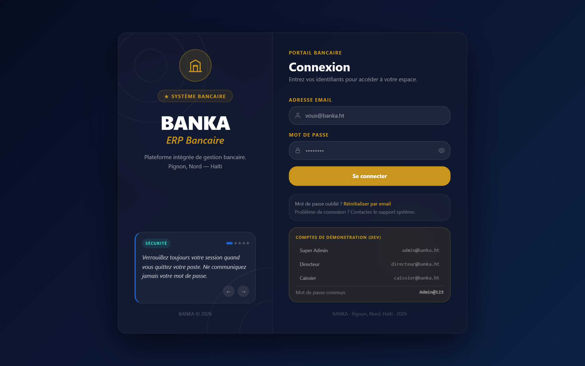

### 2.2 L'interface

Une fois connecté, l'écran se compose de trois zones :

- **La barre latérale (gauche)** : le menu de navigation. Elle est organisée en trois modules que vous pouvez basculer en haut : **Bancaire**, **Comptabilité**, **RH**. Vous ne voyez que les menus autorisés pour votre rôle.
- **L'en-tête (haut)** : la cloche de notifications (alertes en temps réel), et votre profil (en cliquant dessus : accès au profil, changement de mot de passe, déconnexion).
- **La zone centrale** : le contenu de l'écran sélectionné.

### 2.3 Se déconnecter

Cliquez sur votre nom en haut à droite, puis sur **Déconnexion**. Déconnectez-vous toujours en fin de journée ou en quittant votre poste.

---

## 3. Les rôles

Chaque utilisateur possède un rôle qui détermine ce qu'il peut voir et faire.

| Rôle | Ce qu'il fait principalement |
|------|------------------------------|
| **Super Admin** | Accès complet, configuration du système |
| **Directeur** | Vue d'ensemble, supervision, rapports, gestion des opérateurs et agences |
| **Superviseur** | Valide les opérations importantes, supervise la caisse et les alertes |
| **Caissier** | Ouvre la caisse, saisit dépôts, retraits et virements |
| **Agent de crédit** | Monte et suit les dossiers de prêt |
| **Comptable** | Tient la comptabilité, produit les états financiers |
| **Auditeur** | Consulte les rapports, le journal d'audit et les alertes (lecture) |

---

## 4. Module Bancaire

Sélectionnez **Bancaire** en haut de la barre latérale.

### 4.1 Tableau de bord

C'est l'écran d'accueil. Il affiche en temps réel les indicateurs clés : solde total des dépôts, encours de crédit, dépôts et retraits du jour, tendances sur 7 jours. Les grands montants sont affichés de façon compacte (ex. « 1,2 M HTG ») ; survolez-les pour voir le montant exact.

> Si la caisse n'est pas ouverte, une bannière rouge « Caisse fermée » apparaît avec un lien direct vers l'écran Caisse.

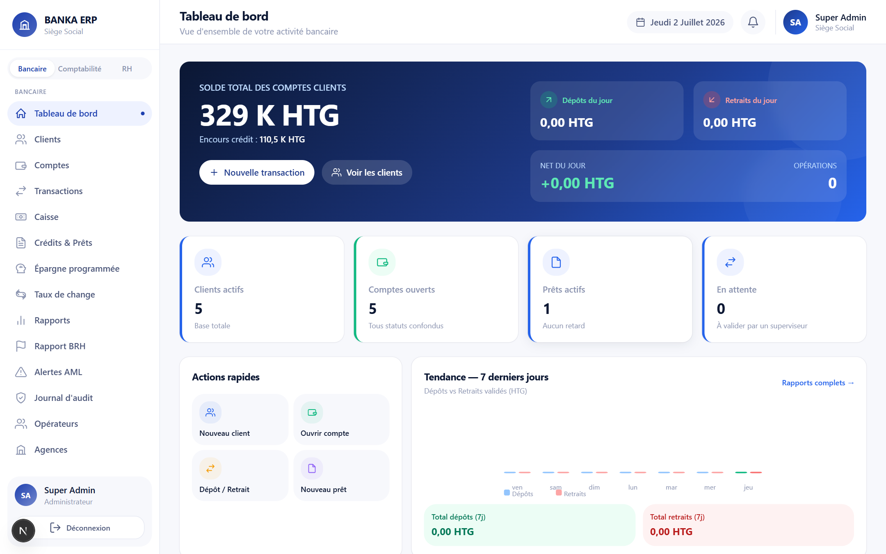

### 4.2 Clients

Menu **Clients**. Vous y gérez le fichier des clients.

**Créer un client :**

1. Cliquez sur **Nouveau client**.
2. Choisissez le type : **Individuel** (personne) ou **Entreprise**.
3. Renseignez les informations. Pour un client individuel, la **pièce d'identité** et son **numéro** sont obligatoires (règles KYC), et le client doit avoir **18 ans ou plus** (l'âge est calculé automatiquement à partir de la date de naissance).
4. Enregistrez.

**Statuts d'un client :** Actif, Inactif, Suspendu, Blacklisté. Un client blacklisté est surveillé par le module anti-blanchiment.

> On ne peut pas supprimer définitivement un client qui a des comptes actifs ou des prêts en cours : il est archivé (mis en Inactif).

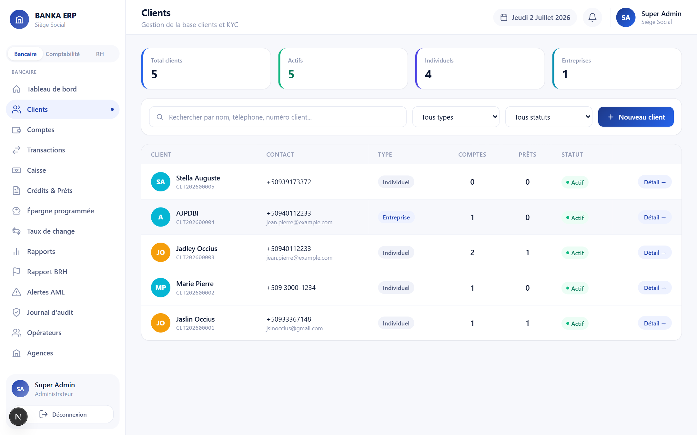

### 4.3 Comptes

Menu **Comptes**. Chaque client peut avoir un ou plusieurs comptes.

**Types de comptes disponibles :** Épargne, Courant, À terme, Joint, Micro-épargne, Tontine, Retraite, Jeunesse, Crédit. Chaque compte est libellé en **HTG** ou en **USD**.

**Ouvrir un compte :**

1. Cliquez sur **Nouveau compte**.
2. Sélectionnez le client, le type de compte et la devise.
3. Enregistrez. Un numéro de compte est généré automatiquement.

**Clôturer un compte :** possible uniquement si le solde est à **zéro**, sans prêt actif ni épargne programmée en cours.

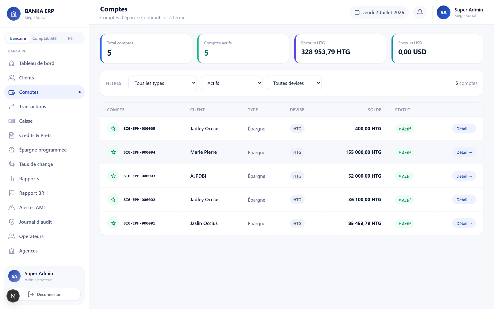

### 4.4 Caisse

Menu **Caisse**. **Étape indispensable avant toute opération d'argent.**

**Ouvrir la caisse (début de journée) :**

1. Cliquez sur **Ouvrir la caisse**.
2. Saisissez le fond de caisse initial.
3. Validez.

Tant qu'aucune caisse n'est ouverte, les dépôts, retraits et virements sont **bloqués**. Chaque opération de la journée est automatiquement rattachée à la session de caisse ouverte.

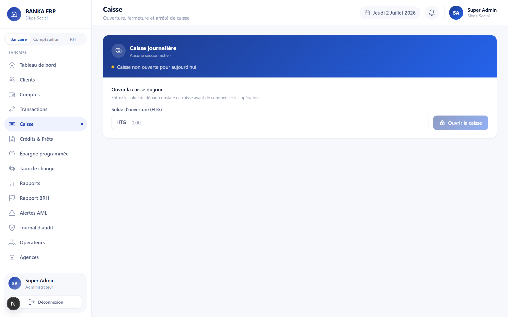

**Fermer la caisse (fin de journée) :**

1. Cliquez sur **Fermer la caisse**.
2. Saisissez le montant physiquement compté.
3. Le système calcule l'écart éventuel entre le théorique et le réel (arrêté de caisse).
4. Validez.

### 4.5 Transactions

Menu **Transactions**. Les trois opérations de base :

**Dépôt :**
1. Cliquez sur **Dépôt**.
2. Sélectionnez le compte bénéficiaire.
3. Saisissez le montant et un motif.
4. Validez.

**Retrait :**
1. Cliquez sur **Retrait**.
2. Sélectionnez le compte.
3. Saisissez le montant. Le système refuse le retrait si le solde est insuffisant.
4. Validez.

**Virement :**
1. Cliquez sur **Virement**.
2. Sélectionnez le compte source et le compte destination.
3. Saisissez le montant.
4. Validez.

> **Validation des grosses opérations :** au-delà d'un seuil défini (par défaut 50 000 HTG ou 500 USD), la transaction passe en statut **En attente** et doit être **validée par un superviseur** avant de prendre effet. Le superviseur la retrouve dans la liste des transactions et clique sur **Valider** ou **Rejeter**.

**Statuts d'une transaction :** En attente, Validée, Rejetée, Annulée.

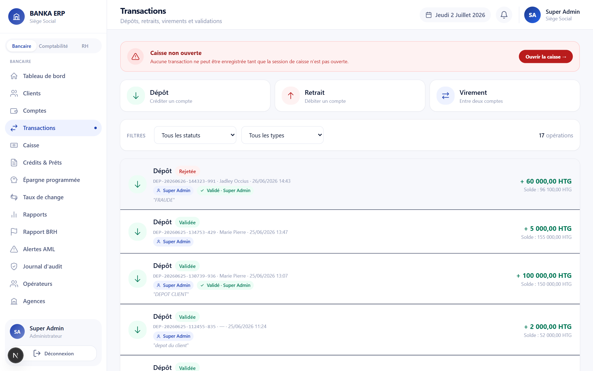

### 4.6 Crédits & Prêts

Menu **Crédits & Prêts** (agents de crédit et direction). Cycle complet d'un prêt.

1. **Création du dossier** : sélectionnez le client, le montant, la durée, le taux, et le type d'amortissement (**dégressif**, **constant** ou **in fine**). Le système génère le tableau d'amortissement.
2. **Approbation** : un responsable approuve ou rejette le dossier.
3. **Décaissement** : les fonds sont versés, une écriture comptable est générée. Des frais de dossier (pourcentage du montant) sont prélevés automatiquement.
4. **Remboursement** : enregistrez chaque échéance payée. Le système suit les échéances en retard.
5. **Remboursement anticipé** : possible ; le tableau d'amortissement est recalculé automatiquement sur le capital restant.

**Statuts d'un prêt :** En attente, Approuvé, Décaissé, En cours, Soldé, En retard, Rejeté, Annulé. Un prêt peut être annulé tant qu'il n'est pas décaissé.

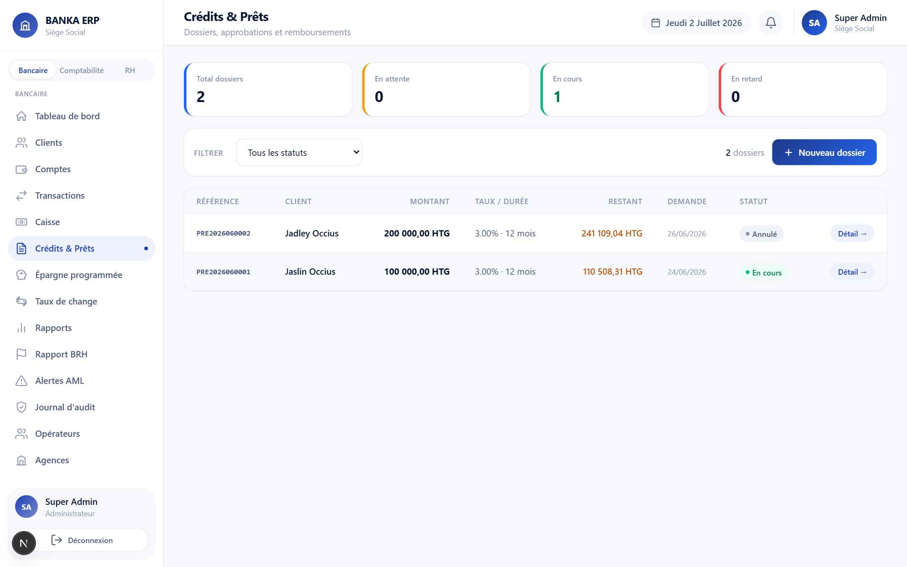

### 4.7 Épargne programmée

Menu **Épargne programmée**. Automatise des virements récurrents vers un compte d'épargne (hebdomadaire, mensuel, bimestriel ou trimestriel). Définissez le compte, le montant et la fréquence : le système exécute les virements automatiquement à échéance.

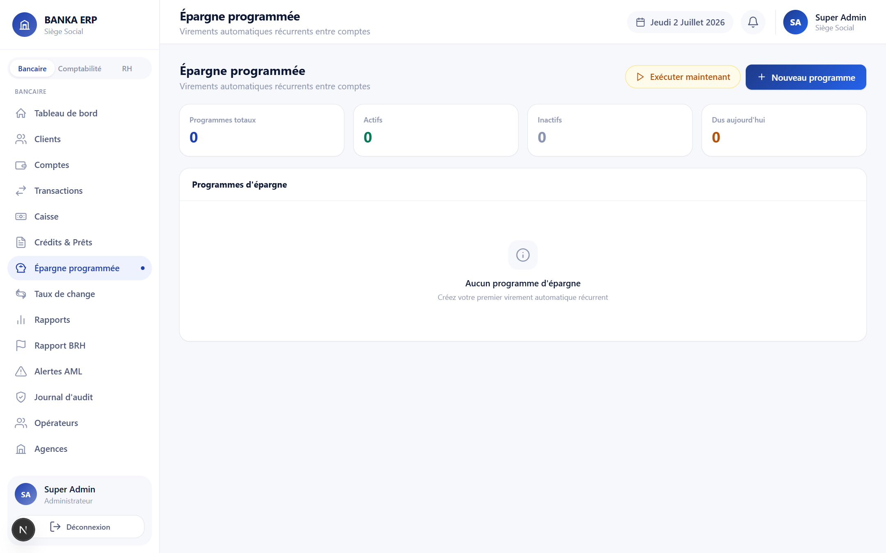

### 4.8 Taux de change

Menu **Taux de change**. Consultez et mettez à jour le taux HTG/USD (taux d'achat et de vente). Un virement entre un compte HTG et un compte USD applique automatiquement le bon taux.

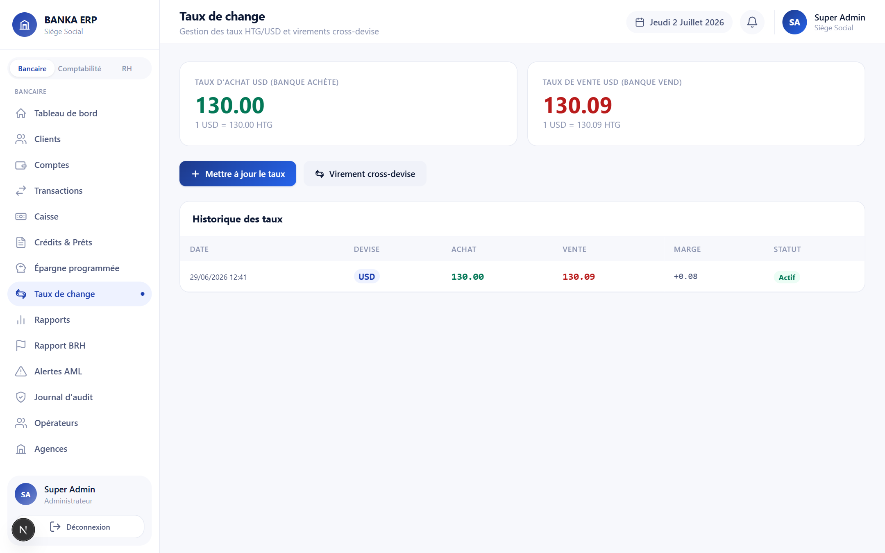

### 4.9 Rapports

Menu **Rapports**. Génère les rapports d'activité : rapport journalier, portefeuille à risque (PAR 30/90), impayés. Sélectionnez la période souhaitée.

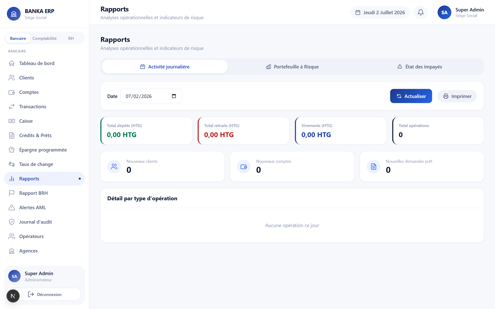

### 4.10 Rapport BRH

Menu **Rapport BRH** (direction et audit). Rapport réglementaire pour la Banque de la République d'Haïti : ratio de liquidité (≥ 20 %), ratio de solvabilité (≥ 8 %), grandes expositions (top 5 emprunteurs), comptes de capitaux. Chaque ratio affiche un badge « conforme » ou « non conforme ». Bouton **Imprimer** disponible.

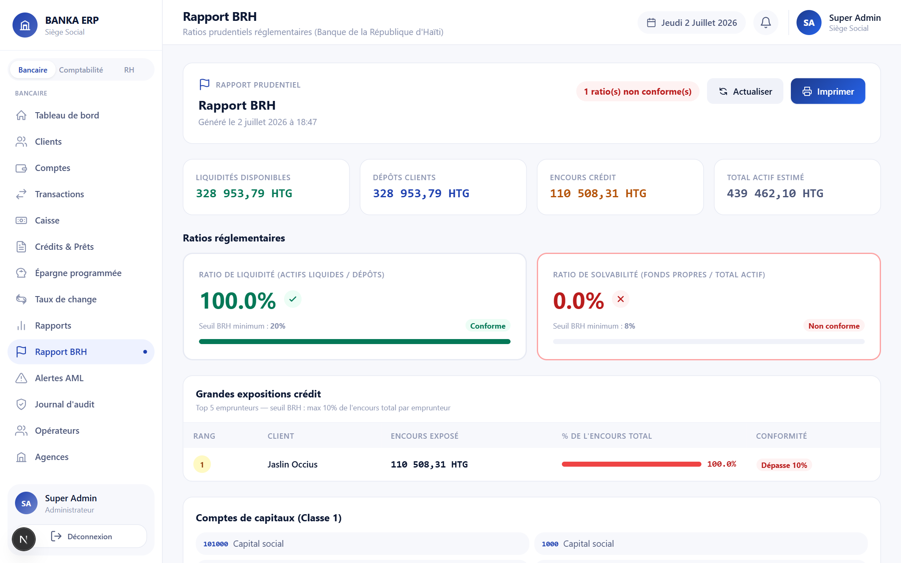

### 4.11 Alertes AML (anti-blanchiment)

Menu **Alertes AML**. Le système surveille automatiquement les transactions et lève une alerte en cas de : dépassement du seuil déclarable, structuration (fractionnement suspect), vélocité anormale (trop d'opérations en peu de temps), ou opération liée à un mandataire blacklisté. Traitez chaque alerte en cliquant sur **Marquer traitée**.

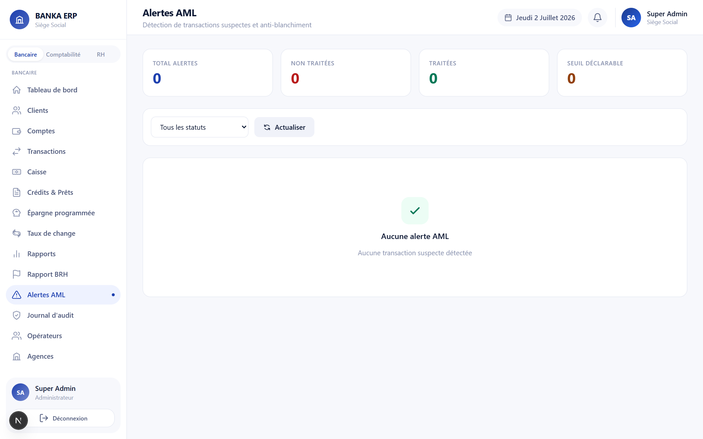

### 4.12 Journal d'audit

Menu **Journal d'audit** (direction et audit). Trace toutes les actions sensibles réalisées dans le système : qui a fait quoi et quand. Consultation et filtrage.

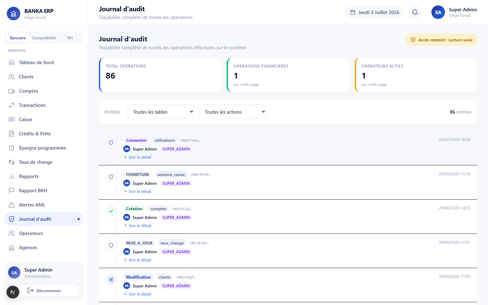

### 4.13 Opérateurs, Agences, Administration

Réservés à la direction :

- **Opérateurs** : créer et gérer les comptes utilisateurs du personnel, attribuer les rôles, activer/désactiver un compte.
- **Agences** : gérer les succursales.
- **Administration** : régler les paramètres du système (seuils AML, taux de frais, pénalités de retard, plafonds).

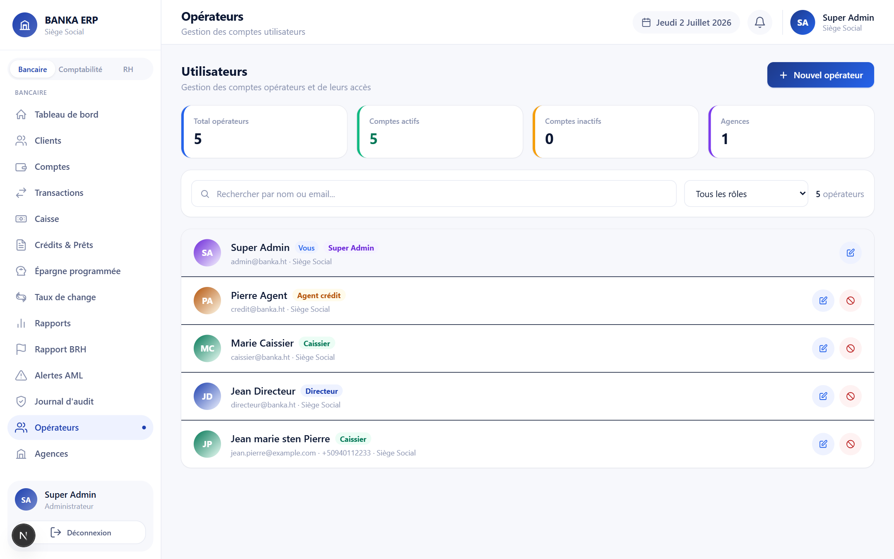

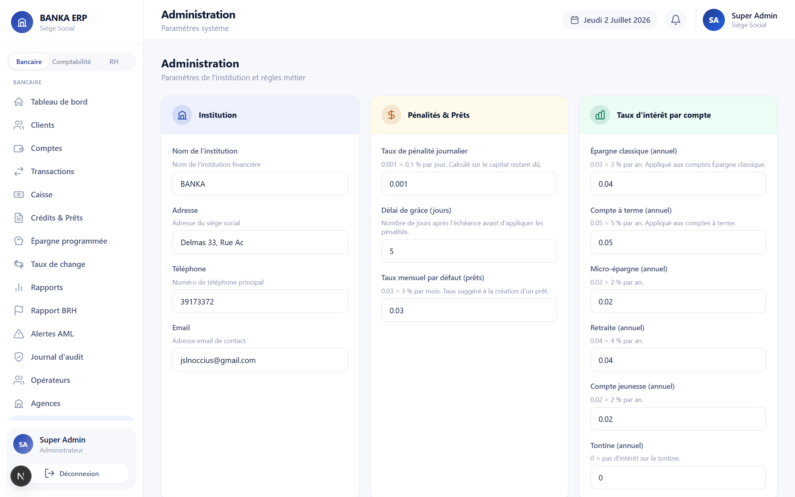

---

## 5. Module Comptabilité

Sélectionnez **Comptabilité** en haut de la barre latérale (comptables, direction, auditeurs).

Bonne nouvelle : la comptabilité est **automatique**. Chaque dépôt, retrait, virement, décaissement ou frais génère tout seul une écriture équilibrée. Vous n'avez pas à ressaisir les opérations.

- **Tableau de bord comptable** : synthèse de la situation comptable.
- **Plan comptable** : liste des comptes (classes 1 à 7 du plan SYSCOHADA).
- **Journal des écritures** : toutes les écritures, avec possibilité de saisie manuelle pour les cas particuliers.
- **Grand livre** : le détail des mouvements compte par compte.
- **Bilan** : la situation patrimoniale (actif / passif).
- **Compte de résultat** : produits et charges sur la période.

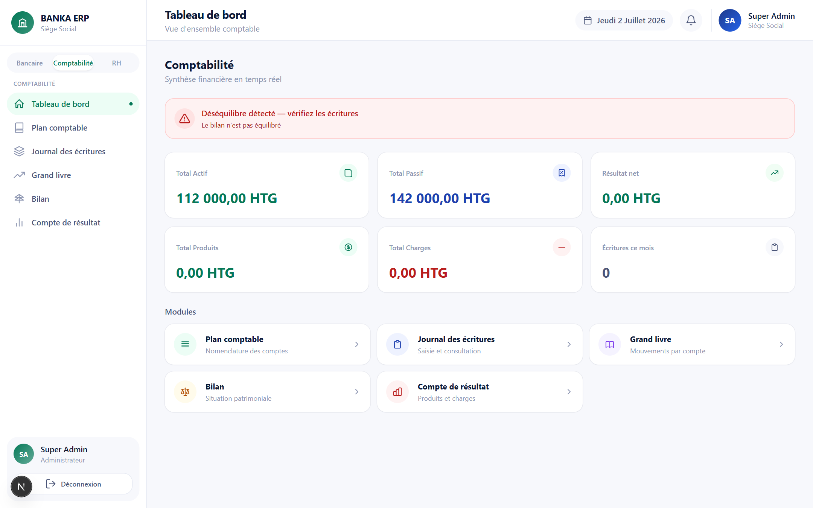

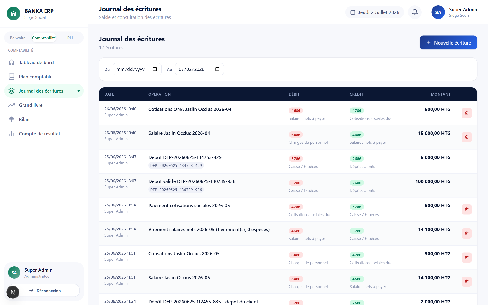

---

## 6. Module Ressources Humaines

Sélectionnez **RH** en haut de la barre latérale (direction et superviseurs).

- **Tableau de bord RH** : indicateurs du personnel (effectif, masse salariale…).
- **Employés** : fiches du personnel. Possibilité de créer un compte utilisateur système directement depuis la fiche, et de transférer un employé entre agences.
- **Postes & Métiers** : définition des postes.
- **Contrats** : contrats de travail (CDI, CDD, stage, consultant).
- **Gestion de la paie** : bulletins de paie suivant le cycle **Brouillon → Validé → Payé**, avances sur salaire, éléments variables (primes, bonus, indemnités, retenues, heures supplémentaires).
- **Congés & Absences** : demandes de congé (annuel, maladie, maternité…) avec workflow d'approbation.
- **Pointage** : suivi des présences, avec prise en charge des pointeuses biométriques ZKTeco.

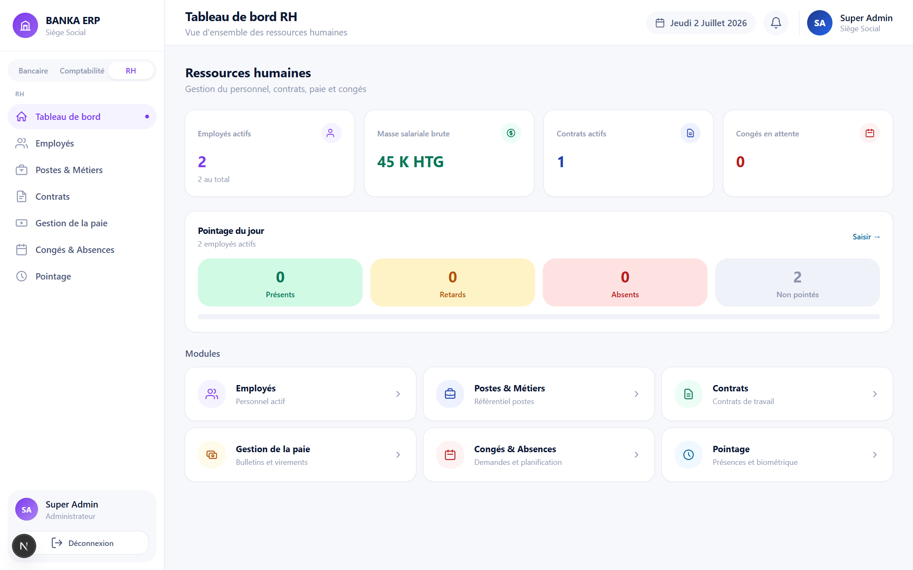

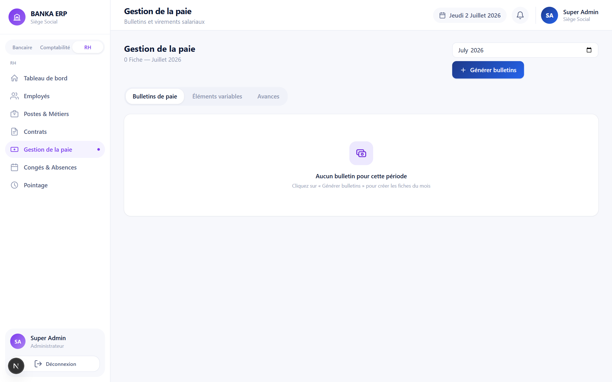

---

## 7. Questions fréquentes et dépannage

**Je ne vois pas certains menus.**
C'est normal : la barre latérale n'affiche que les fonctions autorisées pour votre rôle. Contactez votre directeur si vous pensez avoir besoin d'un accès supplémentaire.

**Je ne peux pas enregistrer un dépôt / retrait / virement.**
Vérifiez que la **caisse est ouverte** (menu Caisse). Sans session de caisse ouverte, ces opérations sont bloquées.

**Ma transaction reste « En attente ».**
Le montant dépasse le seuil de validation. Un superviseur doit la valider depuis l'écran Transactions.

**Le système refuse un retrait.**
Le solde du compte est insuffisant pour le montant demandé.

**Je n'arrive pas à clôturer un compte.**
Le solde doit être à zéro, sans prêt actif ni épargne programmée en cours.

**J'ai oublié mon mot de passe.**
Utilisez « Mot de passe oublié » sur l'écran de connexion. Vérifiez vos emails (le lien est valable 1 heure).

**Une alerte AML est apparue.**
Prévenez le responsable conformité. L'alerte se traite depuis le menu Alertes AML.

---

*Manuel utilisateur BANKA v1.0. Pour toute assistance, contactez l'administrateur de votre institution.*
