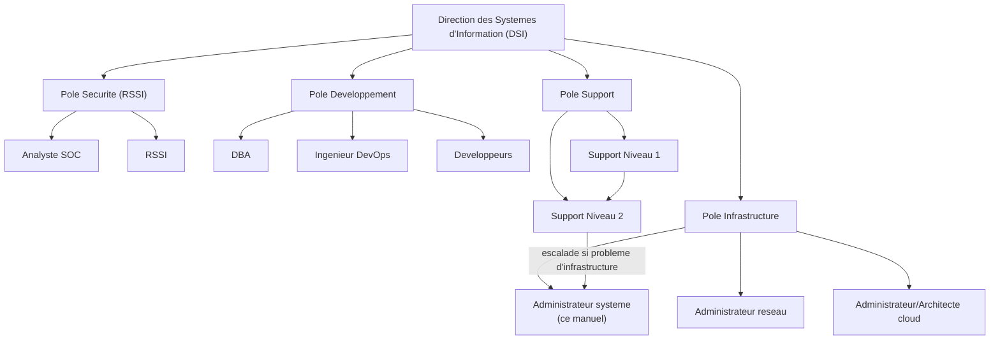

<div class="chapitre-titre-num">CHAPITRE 1</div>

# Le métier d'administrateur système

<div class="encadre objectif">
<span class="encadre-titre">🎯 Objectif du chapitre</span>
Comprendre ce que fait réellement un administrateur système au quotidien — au-delà de l'image populaire du "informaticien qui répare tout" — et savoir le situer précisément dans l'organisation IT d'une entreprise : ses frontières avec l'ingénieur réseau, le DBA, l'analyste sécurité, l'ingénieur DevOps et le support technique. À la fin de ce chapitre, tu sauras nommer les cinq responsabilités centrales du métier (disponibilité, sécurité, performance, sauvegarde, documentation), reconnaître dans quel type de structure tu es susceptible d'exercer, et expliquer en entretien — avec des mots précis, pas des formules toutes faites — en quoi consiste réellement ce métier.
</div>

<div class="encadre scenario">
<span class="encadre-titre">🎬 Mise en situation</span>
Tu viens d'être recruté comme administrateur système junior dans une compagnie d'assurance de 200 employés, avec un siège à Port-au-Prince et un second bureau qui vient d'ouvrir au Cap-Haïtien. Le premier jour, le DSI (Directeur des Systèmes d'Information) te fait faire le tour et te dit une phrase que tu vas te répéter souvent dans les mois qui suivent : <em>"Ici, tu ne vas pas seulement redémarrer des ordinateurs. Tu vas être responsable que tout tourne, que tout le monde puisse travailler, et que si quelque chose casse à 2h du matin, quelqu'un sache exactement quoi faire — même si ce n'est pas toi qui es d'astreinte."</em> Il te tend un badge d'accès à la salle serveur, un compte sur l'outil de tickets, et un planning d'astreinte qui commence dans deux semaines. Tu n'as pas encore tapé une seule commande. Ce chapitre pose les bases de ce que ce métier recouvre réellement, avant même d'ouvrir un terminal — parce que comprendre le rôle précède toujours la technique, jamais l'inverse.
</div>

## 1.1 Qu'est-ce qu'un administrateur système, vraiment

Dans l'imaginaire collectif, l'administrateur système ("sysadmin" dans le jargon du métier) est la personne qu'on appelle quand l'imprimante ne répond plus ou que l'ordinateur d'un collègue "fait des choses bizarres". Cette image n'est pas totalement fausse dans une très petite structure — mais elle est très incomplète, et elle sous-estime largement la réalité du métier tel qu'il s'exerce dans une organisation qui a dépassé la dizaine d'employés.

**Un administrateur système est la personne responsable du bon fonctionnement, de la sécurité et de la disponibilité de l'infrastructure informatique** : les serveurs (physiques ou virtuels), les systèmes d'exploitation qui tournent dessus, les services qu'ils hébergent (messagerie, fichiers partagés, applications métier, bases de données), les comptes utilisateurs et leurs droits, et — de plus en plus — les ressources hébergées dans le cloud. Le sysadmin ne développe généralement pas les applications métier lui-même (c'est le rôle des développeurs) ; il fournit et maintient **l'environnement dans lequel ces applications s'exécutent**, de façon fiable, sécurisée et mesurable.

<div class="encadre astuce">
<span class="encadre-titre">💡 Analogie — le plombier-électricien d'un immeuble</span>
Un administrateur système, c'est un peu le plombier-électricien d'un immeuble de bureaux. Personne ne pense à lui quand l'eau coule au robinet et que la lumière s'allume au bon moment — c'est <em>censé</em> fonctionner, silencieusement, en permanence. Mais dès qu'une fuite apparaît un vendredi à 17h, ou qu'un court-circuit coupe l'électricité d'un étage entier, c'est lui qu'on appelle en urgence, et c'est sa compétence (et sa capacité à garder son calme) qui détermine si l'incident dure 20 minutes ou toute la nuit. Le vrai travail d'un bon administrateur système, comme celui d'un bon plombier-électricien, se voit surtout à travers son <strong>absence</strong> d'incidents — ce qui rend le métier difficile à valoriser auprès de ceux qui ne le pratiquent pas.
</div>

<div class="encadre retenir">
<span class="encadre-titre">📌 À retenir</span>
Administrateur système = responsable de l'infrastructure (serveurs, OS, réseau local, stockage, identités, sauvegardes) sur laquelle les applications et les utilisateurs de l'entreprise s'appuient. Ce n'est ni un développeur d'applications, ni un simple technicien de dépannage poste de travail — même si, dans une petite structure, la même personne peut légitimement porter plusieurs de ces casquettes à la fois (section 1.7).
</div>

## 1.2 L'administrateur système face aux métiers voisins

C'est l'une des sources de confusion les plus fréquentes chez les débutants, y compris en entretien : le mot "informaticien" recouvre en réalité une dizaine de métiers très différents, avec des frontières qui varient selon la taille de l'entreprise. Voici les métiers avec lesquels un sysadmin travaille le plus souvent, et où se situent les frontières (poreuses, mais réelles) :

| Métier | Ce qu'il possède réellement | Ce qu'il NE possède pas (en général) |
|---|---|---|
| **Administrateur système** (ce manuel) | Serveurs, OS, virtualisation, identités (AD/LDAP), sauvegardes, supervision de l'infrastructure | Le code des applications métier, la conception du réseau d'entreprise complet |
| **Administrateur/Ingénieur réseau** | Switches, routeurs, VLAN, pare-feu, VPN, câblage, Wi-Fi | Les serveurs et ce qui tourne dessus |
| **DBA** (administrateur de bases de données) | Performance et intégrité des bases de données, sauvegardes de données, réplication | Le serveur physique/virtuel qui héberge la base (sauf structures très réduites) |
| **Ingénieur DevOps** | Automatisation du déploiement, pipelines CI/CD, infrastructure as code, culture Dev+Ops | La gestion quotidienne "à la main" d'un parc de serveurs existant |
| **Analyste sécurité / SOC** | Détection d'incidents, réponse à incident, conformité, audits | L'administration courante des systèmes (mais collabore étroitement avec le sysadmin) |
| **Architecte cloud** | Conception d'architectures cloud à grande échelle, choix de services managés | L'exploitation quotidienne "terrain" (souvent déléguée à des sysadmins cloud) |
| **Support technique (helpdesk)** | Premier contact avec l'utilisateur, incidents simples, poste de travail | L'infrastructure serveur, les décisions d'architecture |

<div class="encadre attention">
<span class="encadre-titre">⚠️ Erreur de compréhension fréquente : "sysadmin = celui qui répare tout"</span>
Dans une entreprise de 15 personnes, il est parfaitement normal — et même inévitable — qu'une seule personne cumule sysadmin, réseau, un peu de sécurité et parfois du support niveau 1. Mais dans une entreprise de 300 employés ou davantage, ces rôles se séparent en équipes distinctes avec des responsabilités précises et des accès différents. Comprendre cette distinction change directement ce qu'on doit apprendre en priorité : un sysadmin dans une grande structure a besoin de profondeur sur son périmètre (Windows Server, Linux, virtualisation, identité) ; un sysadmin dans une petite structure a besoin de largeur (un peu de tout, y compris du réseau et du support).
</div>

<div class="encadre bonne-pratique">
<span class="encadre-titre">✅ Bonne pratique — assume ta posture selon la structure</span>
Si tu es (ou tu vises) un poste dans une petite structure, ne rougis jamais d'être généraliste — c'est une compétence à part entière, et souvent la plus difficile à trouver sur le marché. Si tu vises une grande structure ou un poste très spécialisé, commence à choisir un axe de spécialisation dès que tu maîtrises les fondamentaux de ce manuel (typiquement après la Partie 6 ou 7) : virtualisation, cloud, sécurité, ou automatisation sont les quatre axes qui recrutent le plus en 2026.
</div>

## 1.3 Où se situe le sysadmin dans l'organisation IT

Pour comprendre à quel moment on fait appel à un administrateur système — et à quel moment ce n'est <em>pas</em> à lui de répondre — il faut voir la chaîne complète d'une organisation IT structurée. Voici l'organigramme type d'une direction des systèmes d'information (DSI) de taille moyenne :



<div class="encadre astuce">
<span class="encadre-titre">💡 Explication du schéma — la chaîne d'escalade</span>
Un incident n'atterrit presque jamais directement sur le bureau de l'administrateur système. Il commence typiquement au Support Niveau 1 (l'utilisateur signale "je n'arrive pas à me connecter"), qui tente une résolution rapide à partir de procédures connues. S'il n'y arrive pas, il escalade au Niveau 2, qui creuse davantage. Si le problème touche l'infrastructure elle-même (un serveur, un service central, une panne réseau) plutôt qu'un poste individuel, il remonte à l'administrateur système ou réseau concerné. Comprendre cette chaîne évite un piège classique du débutant : vouloir tout résoudre soi-même sans processus, ce qui casse justement la raison d'être de cette organisation en couches.
</div>

<div class="encadre memoriser">
<span class="encadre-titre">🧠 À mémoriser — les 4 pôles d'une DSI structurée</span>
1. **Infrastructure** : serveurs, réseau, cloud — l'administrateur système y appartient.
2. **Sécurité** : détection, réponse à incident, conformité (RSSI, SOC).
3. **Développement** : applications métier, bases de données, DevOps.
4. **Support** : premier contact utilisateur, escalade progressive (N1 → N2 → spécialiste).
</div>

## 1.4 Les cinq responsabilités concrètes du métier

Au-delà des définitions, voici ce qui occupe réellement le temps et l'attention d'un administrateur système, résumé en cinq responsabilités qui reviendront, sous une forme ou une autre, dans presque tous les chapitres de ce manuel :

| Responsabilité | Ce que ça signifie concrètement | Exemple de tâche |
|---|---|---|
| **Disponibilité** | S'assurer que les services sont accessibles quand les utilisateurs en ont besoin | Configurer un cluster de basculement (chapitre 13), surveiller l'espace disque avant qu'il ne sature |
| **Sécurité** | Réduire la surface d'attaque, contrôler les accès, appliquer les correctifs | Appliquer le principe du moindre privilège, planifier les mises à jour de sécurité (WSUS, chapitre 12) |
| **Performance** | Anticiper la charge avant qu'elle ne dégrade le service | Surveiller l'utilisation CPU/RAM/disque dans le temps, planifier une montée en capacité |
| **Sauvegarde et restauration** | Garantir que les données peuvent être récupérées après un incident | Vérifier qu'une sauvegarde peut réellement être restaurée — pas seulement qu'elle "s'est bien terminée" |
| **Documentation** | Transmettre la connaissance au-delà de sa propre mémoire | Rédiger un runbook pour une procédure d'urgence, tenir à jour un schéma d'architecture |

<div class="encadre securite">
<span class="encadre-titre">🔒 Sécurité — une sauvegarde jamais testée n'est pas une sauvegarde</span>
C'est l'un des pièges les plus coûteux du métier, et il revient sans cesse dans les retours d'expérience d'incidents réels : une tâche de sauvegarde peut se terminer "avec succès" pendant des mois sans que personne n'ait jamais vérifié qu'un fichier de sauvegarde peut réellement être restauré. Le jour où un serveur tombe pour de bon, découvrir que la sauvegarde est corrompue, incomplète, ou tout simplement inexploitable est l'un des pires moments qu'un administrateur système puisse vivre. Ce sujet est traité en profondeur dans la Partie 5 (stockage et continuité d'activité), mais retiens dès ce premier chapitre le réflexe : une sauvegarde n'a de valeur que le jour où on a prouvé qu'elle se restaure.
</div>

<div class="encadre performance">
<span class="encadre-titre">🚀 Performance — anticiper plutôt que subir</span>
Un bon administrateur système ne se contente pas de réagir aux alertes : il surveille des tendances dans le temps (croissance de l'espace disque utilisé, montée progressive de la charge CPU) pour agir <strong>avant</strong> que le seuil critique soit atteint. C'est la différence entre "le disque C: est plein, tout est bloqué" (réactif, stressant, souvent en pleine nuit) et "le disque C: sera plein dans trois semaines au rythme actuel, j'ai prévu l'extension pour la semaine prochaine" (proactif, maîtrisé). Cette discipline s'appuie sur la supervision, couverte en profondeur dans la Partie 10.
</div>

## 1.5 Une journée type, sans enjoliver

Les formations en ligne montrent souvent le métier à travers des captures d'écran impeccables et des commandes qui fonctionnent du premier coup. La réalité du quotidien est un peu différente — pas moins intéressante, mais plus mélangée. Voici, de façon honnête, à quoi ressemble une journée ordinaire (pas une journée de crise) :

**8h00** — Café, puis un premier réflexe : consulter le tableau de bord de supervision (Partie 10) pour voir si quelque chose s'est dégradé pendant la nuit. Rien d'urgent aujourd'hui, mais une alerte "espace disque à 78%" sur un serveur de fichiers, à surveiller.

**8h30** — Un ticket du support N2 arrive : un utilisateur ne peut plus accéder à un dossier partagé depuis la veille. Diagnostic rapide (section 1.6 et chapitre suivant sur la méthode) : ce n'est pas un problème réseau (d'autres dossiers du même serveur sont accessibles), c'est un problème de permissions — quelqu'un a modifié les droits sur ce dossier précis. Corrigé en 10 minutes, ticket fermé, cause notée dans le journal des changements.

**9h00** — Réunion d'équipe hebdomadaire de 15 minutes ("stand-up") : chacun résume ce qu'il fait aujourd'hui. Tu mentionnes l'alerte disque du matin et la planification d'une extension.

**9h30 à 11h30** — Travail de fond planifié : mise à jour d'un runbook de procédure d'urgence (jamais fait depuis 6 mois, il ne correspond plus à l'infrastructure actuelle), puis test d'une restauration de sauvegarde sur un environnement de test, exactement le réflexe évoqué plus haut.

**11h30** — Un message urgent : le service de messagerie interne semble lent pour plusieurs utilisateurs. Diagnostic en cours quand le problème se résout de lui-même 20 minutes plus tard — cause probable : un pic de charge temporaire. Note prise pour surveiller si ça se reproduit (un incident isolé se surveille ; un incident qui se répète devient un projet).

**Après-midi** — Un chantier de fond : préparation de la migration d'un serveur applicatif vers une nouvelle version de l'OS, prévue dans trois semaines. Ce travail inclut la lecture de la documentation officielle des changements (les fameuses "release notes"), la préparation d'un environnement de test, et la rédaction d'un plan de bascule avec un plan de retour arrière si ça se passe mal.

**17h00** — Dernier passage sur le tableau de bord de supervision avant de partir, transmission de l'astreinte à un collègue pour la nuit.

<div class="encadre mauvaise-pratique">
<span class="encadre-titre">❌ Mauvaise pratique — l'héroïsme permanent</span>
Certains environnements (souvent ceux qui manquent de discipline de documentation et de supervision) transforment chaque journée en enchaînement de pompiers à éteindre. Ce mode "héroïque" est parfois valorisé socialement dans l'équipe ("c'est encore lui qui a sauvé la situation hier soir") — mais c'est en réalité un symptôme d'organisation défaillante, pas une preuve de compétence. Un bon administrateur système préfère une journée ennuyeuse, où rien de grave ne se produit parce que tout a été anticipé, à une journée héroïque où tout est sauvé de justesse. Ce réflexe est difficile à acquérir en début de carrière, où l'adrénaline d'un incident résolu de justesse peut sembler gratifiante — mais c'est un piège à repérer tôt.
</div>

## 1.6 Les compétences du métier : techniques et humaines

<div class="encadre astuce">
<span class="encadre-titre">💡 Le profil "en T" (T-shaped)</span>
La plupart des administrateurs système expérimentés développent un profil dit "en T" : une **largeur** de connaissances suffisante sur l'ensemble de l'écosystème (réseau, sécurité, virtualisation, cloud, scripting — la barre horizontale du T), et une **profondeur** réelle sur un ou deux domaines précis (par exemple, une vraie expertise Active Directory, ou une maîtrise poussée de Kubernetes — la barre verticale du T). Ce manuel est construit pour donner cette largeur d'ensemble ; la profondeur se construit ensuite, par la pratique et la spécialisation progressive.
</div>

**Compétences techniques (le "quoi")**, dans l'ordre où ce manuel les aborde :
- Administration Windows Server et Linux au quotidien (Parties 2 et 3).
- Identité et authentification : Active Directory, LDAP, Kerberos (Partie 4).
- Stockage et continuité d'activité (Partie 5).
- Virtualisation et conteneurisation (Parties 6 et 7).
- Cloud computing (Partie 8).
- Automatisation et Infrastructure as Code (Partie 9).
- Supervision et observabilité (Partie 10).
- Réseau d'entreprise avancé (Partie 11).
- Cybersécurité et gouvernance (Partie 12).

**Compétences humaines (le "comment"), tout aussi déterminantes pour la réussite dans ce métier :**
- **Communiquer sous pression** : expliquer un incident en cours à un responsable non technique sans jargon inutile ni fausse certitude.
- **Documenter par réflexe**, pas seulement quand on y pense — la mémoire d'une seule personne n'est jamais une stratégie d'entreprise fiable.
- **Admettre "je ne sais pas encore"** plutôt que deviner une solution à l'aveugle sur un système en production — un réflexe qui distingue nettement le junior prudent du junior dangereux.
- **Gérer une astreinte** : rester joignable, savoir évaluer rapidement la gravité réelle d'une alerte à 3h du matin, et savoir quand escalader plutôt qu'insister seul.

<div class="encadre bonne-pratique">
<span class="encadre-titre">✅ Bonne pratique — le doute méthodique avant l'action</span>
Sur un système en production, la question à se poser avant chaque commande n'est jamais "est-ce que ça va marcher ?" mais <strong>"qu'est-ce qui se passe si ça ne marche pas ?"</strong>. Un administrateur système expérimenté n'est pas celui qui ne se trompe jamais — c'est celui dont les erreurs restent toujours réversibles, parce qu'il a pris l'habitude de se poser cette question avant d'agir, pas après.
</div>

## 1.7 Les environnements où l'on exerce ce métier

Le métier ne se vit pas de la même façon selon le type de structure. Voici un panorama réaliste, utile autant pour choisir sa trajectoire de carrière que pour comprendre pourquoi deux administrateurs système peuvent avoir des quotidiens très différents :

| Environnement | Ce qui caractérise le poste | Intensité de l'astreinte |
|---|---|---|
| **PME généraliste** (10-100 employés) | Un ou deux administrateurs couvrent tout : serveurs, réseau, un peu de sécurité, parfois le support | Modérée, souvent portée par la même personne en continu |
| **Grande entreprise** (300+ employés) | Équipes spécialisées, processus formalisés (ITIL, chapitre 2), ségrégation stricte des accès | Rotation d'équipe organisée, astreinte partagée |
| **Hébergeur / fournisseur cloud** | Infrastructure à très grande échelle, automatisation poussée, criticité extrême (clients externes dépendent du service) | Très structurée, souvent 24/7 avec plusieurs fuseaux horaires |
| **Administration publique** | Contraintes réglementaires fortes, cycles de décision plus lents, priorité à la stabilité sur l'innovation | Variable, souvent modérée hors incidents majeurs |
| **Data center / colocation** | Responsabilité de l'infrastructure physique et de sa disponibilité pour plusieurs clients hébergés | Très élevée, interventions physiques possibles à toute heure |
| **MSP (prestataire de services managés)** | Gestion de l'infrastructure de plusieurs entreprises clientes en parallèle, contextes très variés | Élevée, avec des engagements contractuels (SLA) par client |

🏢 **En entreprise — un même titre, des réalités très différentes.** Deux personnes avec exactement le même titre de poste ("Administrateur système") peuvent avoir des quotidiens presque incomparables selon l'environnement ci-dessus. En entretien d'embauche, une des questions les plus utiles à poser (et qui impressionne favorablement un recruteur, car elle montre une compréhension mûre du métier) est justement : *"Dans cette structure, l'administrateur système gère-t-il aussi le réseau et le support niveau 1, ou ces rôles sont-ils déjà séparés ?"*

## 1.8 Panorama de ce que ce manuel va couvrir

```{.uml}
Manuel professionnel d'Administration Systeme et Infrastructure
│
├─ Partie 1  : Le metier et la posture professionnelle          (ch. 1-4)
│
├─ Partie 2  : Administration Windows Server avancee             (ch. 5-13)
├─ Partie 3  : Administration Linux avancee                      (ch. 14-21)
│
├─ Partie 4  : Identite, authentification et annuaires           (ch. 22-26)
├─ Partie 5  : Stockage et continuite d'activite (PRA/PCA)       (ch. 27-32)
│
├─ Partie 6  : Virtualisation (VMware, Hyper-V, Proxmox)         (ch. 33-38)
├─ Partie 7  : Conteneurisation et orchestration (Docker, K8s)   (ch. 39-44)
│
├─ Partie 8  : Cloud computing (AWS, Azure, GCP)                 (ch. 45-50)
├─ Partie 9  : Automatisation et Infrastructure as Code          (ch. 51-57)
│
├─ Partie 10 : Supervision, journalisation et observabilite      (ch. 58-64)
├─ Partie 11 : Reseau d'entreprise avance                        (ch. 65-70)
├─ Partie 12 : Cybersecurite et gouvernance                      (ch. 71-79)
│
└─ Partie 13 : Projet final - infrastructure hybride complete    (ch. 80-86)
```

Chaque partie s'appuie sur les précédentes. Les Parties 2 à 5 forment le socle "sur site" (on-premise) qu'un administrateur système doit maîtriser en premier, quel que soit l'environnement visé ; les Parties 6 à 9 modernisent ce socle (virtualisation, conteneurs, cloud, automatisation) ; les Parties 10 à 12 rendent l'ensemble observable, robuste et gouverné ; et la Partie 13 rassemble tout dans un projet fil rouge complet, à l'image de ce que vivrait réellement un administrateur système en poste.

## Atelier — Qui fait quoi dans cette entreprise ?

<div class="encadre exercice">
<span class="encadre-titre">🛠️ Atelier 1 — Cartographier l'écosystème IT</span>

**Objectif** : s'entraîner à identifier, à partir d'une situation concrète, quel métier de l'écosystème IT (section 1.2 et 1.3) est réellement responsable — la compétence la plus utile de ce chapitre pour comprendre où s'arrête ton propre rôle en poste.

**Préparation** : aucune installation nécessaire. Prends une feuille ou un fichier texte.

**Étapes détaillées** :

1. Pour chacune des six situations suivantes, écris quel métier est **normalement responsable en premier**, puis à qui il devrait escalader si le problème dépasse son périmètre :
   - a) Un employé ne peut plus imprimer depuis ce matin, uniquement lui.
   - b) Le serveur de fichiers central refuse toute connexion pour l'ensemble du bureau du Cap-Haïtien.
   - c) Une alerte de sécurité signale une tentative de connexion suspecte depuis un pays inhabituel sur un compte administrateur.
   - d) Une application métier interne affiche une erreur de base de données depuis un déploiement d'hier soir.
   - e) Le Wi-Fi de la salle de réunion du 3ème étage ne fonctionne plus, mais le reste du bureau va bien.
   - f) La direction demande un rapport mensuel automatique sur l'état de conformité des mises à jour de sécurité de tous les serveurs.
2. Compare tes réponses à la section "Résultat attendu" ci-dessous.
3. Pour chaque réponse où tu t'es trompé, relis la section 1.2 ou 1.3 correspondante avant de continuer.

**Résultat attendu** :
- a) **Support Niveau 1** — incident isolé sur un poste individuel, pas d'infrastructure impliquée à ce stade.
- b) **Administrateur système** — panne d'un service central affectant tout un site, remontée directement depuis le support N2.
- c) **Analyste sécurité / SOC**, en coordination avec l'administrateur système pour la partie technique (verrouillage du compte, analyse des journaux).
- d) **DBA en première ligne**, avec le développeur de l'application si la cause est liée au code déployé la veille — pas l'administrateur système, sauf si le serveur de base de données lui-même est en cause.
- e) **Administrateur réseau** — problème localisé à un point d'accès Wi-Fi, pas aux serveurs.
- f) **Administrateur système**, typiquement via un outil de supervision (Partie 10) — c'est exactement le type de responsabilité "conformité" évoqué en section 1.4.

**Dépannage** : si tu hésites entre deux métiers, pose-toi la question centrale de la section 1.2 — *"Est-ce que le problème touche un poste individuel (support), le réseau physique (réseau), l'infrastructure serveur (sysadmin), les données elles-mêmes (DBA), ou une intention malveillante (sécurité) ?"*
</div>

## Erreurs fréquentes

<div class="encadre attention">
<span class="encadre-titre">⚠️ Erreur n°1 — Confondre le métier avec le dépannage de poste de travail</span>
Le dépannage de poste de travail (imprimante, logiciel bloqué, souris qui ne répond plus) est le rôle du support technique, pas de l'administrateur système — même si, dans une petite structure, la même personne peut faire les deux. Se présenter en entretien comme "je répare les ordinateurs" plutôt que "je maintiens la disponibilité et la sécurité de l'infrastructure" donne une image très réduite — et fausse — du niveau de responsabilité réel du poste.
</div>

<div class="encadre attention">
<span class="encadre-titre">⚠️ Erreur n°2 — Croire que le métier se résume à réagir aux pannes</span>
Comme vu en section 1.5, la majorité du temps d'un bon administrateur système est consacrée à des tâches proactives : supervision, documentation, tests de sauvegarde, planification de capacité, veille de sécurité. Les incidents existent et font partie du métier, mais un environnement où l'on ne fait que "réagir" en permanence est le signe d'un manque de discipline organisationnelle — pas une fatalité du métier.
</div>

<div class="encadre attention">
<span class="encadre-titre">⚠️ Erreur n°3 — Sous-estimer la documentation et la communication</span>
Beaucoup de débutants pensent que la valeur d'un administrateur système se mesure uniquement à sa compétence technique pure. En réalité, un administrateur système très compétent techniquement mais qui ne documente rien et communique mal en situation de crise crée un risque réel pour l'organisation : la connaissance reste enfermée dans sa tête, et disparaît avec lui le jour où il change de poste ou tombe malade pendant un incident.
</div>

## Diagnostiquer sans paniquer : une démarche avant même de savoir taper une commande

Avant d'apprendre la moindre commande technique (ce sera l'objet de tous les chapitres suivants), il existe une démarche mentale que tout administrateur système applique, consciemment ou non, face à un problème. La détailler dès ce premier chapitre te fera gagner un temps précieux pour la suite du manuel :

<div class="encadre attention">
<span class="encadre-titre">🩺 Situation : "Un utilisateur dit que ça ne marche pas"</span>

- **Diagnostic** : cette phrase seule ne veut presque rien dire. La première étape n'est jamais technique — c'est de **restreindre le problème** en posant quatre questions : *Qui* est concerné (une seule personne, un service, tout le monde) ? *Quoi* exactement ne fonctionne pas (préciser l'action précise qui échoue) ? *Depuis quand* (un changement récent a-t-il eu lieu juste avant) ? *Un seul endroit ou plusieurs* (le problème existe-t-il aussi depuis un autre poste, un autre réseau) ?
- **Comment vérifier** : reproduire le problème soi-même si possible, ou demander une capture d'écran précise du message d'erreur exact — jamais se fier uniquement à une description verbale approximative.
- **Résolution** : une fois le périmètre du problème clarifié, on peut déterminer avec beaucoup plus de certitude à quel métier de la section 1.2 il appartient réellement, et éviter de perdre du temps sur une fausse piste.
</div>

<div class="encadre attention">
<span class="encadre-titre">🩺 Situation : "Une alerte de supervision arrive en pleine nuit"</span>

- **Diagnostic** : avant toute action technique, évaluer l'**impact réel** (combien d'utilisateurs ou de services sont affectés maintenant, pas dans l'absolu) et l'**urgence réelle** (le problème s'aggrave-t-il, ou est-il stable ?).
- **Comment vérifier** : consulter le tableau de bord de supervision pour confirmer que l'alerte reflète bien un problème actuel, et non un faux positif ponctuel déjà résolu — un réflexe qui évite bien des interventions inutiles à 3h du matin.
- **Résolution** : si l'impact est réel et significatif, agir ou escalader immédiatement selon la procédure d'astreinte de l'organisation ; si l'impact est faible ou incertain, il est souvent légitime de surveiller quelques minutes avant d'intervenir en urgence — la panique n'a jamais résolu un incident plus vite que le calme méthodique.
</div>

## En entreprise

Dans la pratique professionnelle, quelques constats reviennent presque systématiquement, quelle que soit la taille de l'organisation :

- **Bonne pratique répandue** : les entreprises matures organisent des rotations d'astreinte formalisées, avec une procédure claire d'escalade (qui appeler, dans quel ordre, à partir de quel niveau de gravité) — jamais une seule personne "toujours disponible par défaut", qui finit inévitablement par s'épuiser.
- **Bonne pratique répandue** : après un incident significatif, les équipes matures organisent un "post-mortem sans blâme" (*blameless postmortem*) : l'objectif est de comprendre la chaîne de causes réelles et d'améliorer le processus, jamais de désigner un coupable — une culture qui encourage la transparence plutôt que la dissimulation d'erreurs.
- **Erreur classique observée** : la connaissance critique de l'infrastructure repose sur une seule personne ("bus factor" de 1), sans documentation ni doublure. Quand cette personne part, tombe malade, ou est simplement en vacances pendant un incident majeur, l'organisation se retrouve démunie — un risque que ce manuel t'aidera à éviter par la discipline de documentation abordée à chaque chapitre.

## Entretien technique

<div class="encadre exercice">
<span class="encadre-titre">💼 Questions fréquemment posées en entretien</span>

**Q1. "Quelle est, selon toi, la différence entre un administrateur système et un ingénieur DevOps ?"**
Réponse attendue : l'administrateur système se concentre traditionnellement sur l'exploitation et la maintenance quotidienne d'une infrastructure existante (souvent manuelle ou semi-automatisée) ; l'ingénieur DevOps se concentre sur l'automatisation du cycle complet de déploiement et sur le rapprochement culturel entre équipes de développement et d'exploitation, en s'appuyant fortement sur l'Infrastructure as Code (Partie 9). En pratique, ces deux rôles se chevauchent de plus en plus dans les organisations modernes — beaucoup d'administrateurs système évoluent progressivement vers des pratiques DevOps.
*Piège fréquent* : répondre "c'est la même chose" ou, à l'inverse, présenter les deux comme totalement étrangers l'un à l'autre — les deux réponses trahissent une compréhension superficielle.

**Q2. "Comment gérerais-tu une astreinte, concrètement ?"**
Réponse attendue : rester joignable pendant la période définie, savoir accéder rapidement aux outils de diagnostic et à la documentation d'astreinte (runbooks), évaluer rapidement la gravité réelle d'une alerte avant d'agir dans la précipitation, et savoir reconnaître les limites de ce qu'on peut résoudre seul pour escalader à temps plutôt que de s'obstiner.

**Q3. "Raconte un incident, même scolaire ou personnel, que tu as diagnostiqué de façon méthodique."**
Réponse attendue : le recruteur cherche ici une démarche structurée (restreindre le problème, formuler une hypothèse, la vérifier, agir), pas nécessairement un exploit technique impressionnant. Un exemple simple mais raconté avec une méthode claire (comme celle de la section "Diagnostiquer sans paniquer" ci-dessus) est souvent plus convaincant qu'un exemple complexe raconté sans structure.
</div>

## Optimisation, sécurité et maintenabilité — les réflexes dès ce chapitre

<div class="encadre securite">
<span class="encadre-titre">🔒 Sécurité</span>
Le principe du **moindre privilège** — donner à chaque personne et chaque système exactement les droits nécessaires à sa fonction, ni plus ni moins — est une posture, pas seulement une commande technique. Elle s'applique dès la définition d'un rôle IT : un développeur n'a normalement pas besoin d'un accès administrateur aux serveurs de production, et un stagiaire support n'a normalement pas besoin d'accès aux sauvegardes. Ce principe sera appliqué concrètement tout au long de ce manuel (Active Directory, RBAC Kubernetes, IAM cloud).
</div>

<div class="encadre bonne-pratique">
<span class="encadre-titre">✅ Maintenabilité</span>
Prends dès maintenant l'habitude de documenter une décision au moment où tu la prends, pas après coup "quand tu auras le temps" — ce moment n'arrive presque jamais. Un simple fichier texte daté ("le 12 mars, j'ai changé X parce que Y") vaut infiniment mieux qu'aucune trace du tout, et constitue le point de départ naturel du runbook évoqué tout au long de ce manuel.
</div>

<div class="encadre performance">
<span class="encadre-titre">🚀 Performance</span>
Prends l'habitude, dès ce premier chapitre, de distinguer un problème **isolé** (qui se surveille) d'un problème **récurrent** (qui devient un projet à part entière, avec une cause racine à corriger). Cette distinction, appliquée avec rigueur, est ce qui différencie une équipe qui s'améliore dans le temps d'une équipe qui répète indéfiniment les mêmes incidents.
</div>

## Résumé du chapitre

- Un administrateur système est responsable de l'infrastructure informatique (serveurs, OS, identités, sauvegardes) — pas des applications elles-mêmes, ni uniquement du dépannage de poste de travail.
- Le métier se situe dans un écosystème IT plus large : réseau, DBA, DevOps, sécurité et support ont chacun leur périmètre propre, avec des frontières qui se resserrent à mesure que l'organisation grandit.
- Les cinq responsabilités centrales du métier sont la disponibilité, la sécurité, la performance, la sauvegarde/restauration et la documentation.
- Le quotidien réel mélange tâches proactives (majoritaires dans un environnement mature) et incidents réactifs — jamais uniquement l'un ou l'autre.
- Les compétences humaines (communication, documentation, gestion du stress, humilité technique) pèsent autant que les compétences techniques dans la réussite du métier.
- Ce manuel couvre, dans l'ordre, l'administration Windows/Linux avancée, l'identité, le stockage/continuité, la virtualisation, les conteneurs, le cloud, l'automatisation, la supervision, le réseau avancé, la cybersécurité, et un projet final complet.

## Quiz

<div class="encadre exercice">
<span class="encadre-titre">📝 QCM (une seule bonne réponse par question)</span>

1. Un administrateur système est principalement responsable de :
   - a) Écrire le code des applications métier
   - b) L'infrastructure sur laquelle les applications et les utilisateurs s'appuient
   - c) Réparer uniquement les postes de travail individuels
   - d) La conception graphique des interfaces utilisateur

2. Dans la chaîne d'escalade type d'une DSI, un incident touchant un poste individuel est d'abord traité par :
   - a) L'administrateur système
   - b) Le RSSI
   - c) Le support technique Niveau 1
   - d) L'architecte cloud

3. Une sauvegarde qui se termine "avec succès" chaque nuit mais n'a jamais été testée en restauration est :
   - a) Une garantie suffisante
   - b) Un risque non prouvé, potentiellement inexploitable en cas de besoin réel
   - c) Une pratique recommandée par défaut
   - d) Uniquement un problème pour les très grandes entreprises

**Corrigé** : 1-b, 2-c, 3-b.
</div>

<div class="encadre exercice">
<span class="encadre-titre">📝 Vrai ou Faux</span>

1. Dans une entreprise de 300 employés ou plus, il est normal que les rôles sysadmin, réseau et sécurité soient tenus par des équipes distinctes. — **Vrai**.
2. Le métier d'administrateur système se résume essentiellement à réagir aux pannes au fur et à mesure qu'elles arrivent. — **Faux** (la majorité du temps, dans un environnement mature, est consacrée à des tâches proactives).
3. Un "post-mortem sans blâme" a pour objectif de désigner la personne responsable d'un incident. — **Faux** (l'objectif est de comprendre la cause réelle et d'améliorer le processus, sans chercher de coupable).
4. Documenter une décision au moment où elle est prise est plus fiable que compter sur sa mémoire. — **Vrai**.
</div>

<div class="encadre exercice">
<span class="encadre-titre">📝 Questions ouvertes</span>

1. Explique, en tes propres mots, pourquoi le principe du moindre privilège s'applique aussi bien aux personnes qu'aux systèmes.
2. Un ami te dit : "L'administration système, c'est un métier voué à disparaître à cause du cloud." Que lui réponds-tu, en t'appuyant sur ce chapitre ?

**Corrigé 1** : le principe du moindre privilège vise à limiter les dégâts possibles en cas d'erreur ou de compromission — que l'acteur soit une personne (un employé dont le compte serait piraté ne devrait pas pouvoir tout casser) ou un système (une application compromise ne devrait pas pouvoir accéder à des ressources hors de son périmètre). Réduire les privilèges au strict nécessaire réduit mécaniquement la surface de dégâts possibles, dans les deux cas.

**Corrigé 2** : le cloud ne supprime pas le métier, il le transforme — les responsabilités de disponibilité, sécurité, performance, sauvegarde et documentation (section 1.4) restent toutes présentes dans un environnement cloud, mais certaines tâches d'exploitation matérielle sont déléguées au fournisseur. Les administrateurs système qui montent en compétence sur le cloud (Partie 8) et l'automatisation (Partie 9) restent très recherchés ; ceux qui refusent d'évoluer risquent effectivement de voir leur périmètre se réduire — la transformation du métier, pas sa disparition, est le constat le plus honnête.
</div>

## Exercices

<div class="encadre exercice">
<span class="encadre-titre">📝 Exercice 1.1</span>

Reprends la journée type décrite en section 1.5. Identifie, pour chacune des activités mentionnées, si elle relève d'une des cinq responsabilités de la section 1.4 (disponibilité, sécurité, performance, sauvegarde/restauration, documentation) — certaines activités peuvent en toucher plusieurs.
</div>

**Corrigé :** Consultation du tableau de bord (disponibilité + performance) ; correction des permissions du dossier partagé (disponibilité, et indirectement sécurité si l'erreur de permission exposait des données) ; test de restauration de sauvegarde (sauvegarde/restauration) ; mise à jour du runbook (documentation) ; diagnostic du ralentissement de la messagerie (disponibilité + performance) ; préparation de la migration avec plan de retour arrière (disponibilité + documentation).

<div class="encadre exercice">
<span class="encadre-titre">📝 Exercice 1.2</span>

Reprends le scénario d'ouverture du chapitre (la compagnie d'assurance avec un bureau à Port-au-Prince et un nouveau bureau au Cap-Haïtien). En 4 à 6 phrases, décris trois questions concrètes que tu poserais à ton DSI lors de ta première semaine pour comprendre précisément le périmètre réel de ton poste, en t'appuyant sur les sections 1.2, 1.3 et 1.7.
</div>

**Corrigé (exemple de réponse) :** Je demanderais d'abord si le poste couvre uniquement les serveurs et l'infrastructure, ou aussi le réseau et le support niveau 1 — la frontière typique d'une petite ou moyenne structure (section 1.2 et 1.7). Ensuite, je demanderais comment fonctionne la chaîne d'escalade actuelle entre le support et moi, pour comprendre à quel moment un incident est censé m'arriver (section 1.3). Enfin, je demanderais s'il existe déjà une documentation d'infrastructure et des runbooks d'astreinte, ou si cette documentation reste à construire — une information essentielle pour savoir dans quel état de maturité organisationnelle j'arrive, et si le nouveau bureau du Cap-Haïtien a ses propres procédures ou dépend entièrement du siège.

## Checklist de fin de chapitre

<ul class="checklist">
<li>☐ Je peux expliquer ce qu'est un administrateur système sans dire "celui qui répare les ordinateurs".</li>
<li>☐ Je sais distinguer le périmètre du sysadmin de celui du réseau, du DBA, du DevOps, de la sécurité et du support.</li>
<li>☐ Je connais les cinq responsabilités centrales du métier (disponibilité, sécurité, performance, sauvegarde, documentation).</li>
<li>☐ Je comprends pourquoi une sauvegarde jamais testée n'est pas une garantie réelle.</li>
<li>☐ Je sais expliquer la différence entre un incident isolé et un incident récurrent.</li>
<li>☐ Je connais la démarche de base pour restreindre un problème avant de le diagnostiquer techniquement.</li>
<li>☐ Je sais situer le métier selon le type d'organisation (PME, grande entreprise, hébergeur, secteur public, datacenter, MSP).</li>
</ul>

## FAQ

<dl class="faq">
<dt>Faut-il être développeur pour devenir administrateur système ?</dt>
<dd>Non, ce n'est pas un prérequis. Le scripting (Bash, PowerShell, Python — couvert dans les Parties 2, 3 et 9) est en revanche une compétence de plus en plus indispensable pour automatiser des tâches répétitives, sans nécessiter le niveau d'un développeur d'applications.</dd>

<dt>Le cloud va-t-il rendre ce métier obsolète ?</dt>
<dd>Non — il le transforme, comme évoqué dans le quiz de ce chapitre. Les responsabilités fondamentales (disponibilité, sécurité, performance, sauvegarde, documentation) restent identiques ; les outils et le niveau d'abstraction évoluent. C'est justement pourquoi ce manuel couvre le cloud (Partie 8) comme une extension naturelle des compétences on-premise, pas comme un sujet séparé.</dd>

<dt>Dois-je choisir entre Windows et Linux dès le début ?</dt>
<dd>Non, et ce serait même une erreur stratégique. La quasi-totalité des environnements professionnels réels mélangent les deux (Windows Server pour l'identité et les postes de travail, Linux pour une grande partie des serveurs applicatifs et du cloud). Ce manuel couvre les deux en profondeur (Parties 2 et 3), volontairement dans cet ordre pédagogique.</dd>

<dt>Est-ce un métier compatible avec le travail en freelance ou en petite structure ?</dt>
<dd>Oui, notamment via les missions de type MSP (prestataire de services managés, section 1.7) ou d'accompagnement ponctuel de PME qui n'ont pas les moyens d'employer un administrateur système à temps plein — un contexte particulièrement pertinent en Haïti, où beaucoup de petites structures fonctionnent exactement sur ce modèle.</dd>
</dl>

## Références et pour aller plus loin

- Microsoft Learn — Parcours "Administrateur système Windows Server" : [https://learn.microsoft.com](https://learn.microsoft.com)
- Red Hat — Documentation et parcours de certification RHCSA/RHCA : [https://www.redhat.com/fr/services/certification](https://www.redhat.com/fr/services/certification)
- ITIL v4 — Vue d'ensemble officielle (Axelos/PeopleCert) : [https://www.axelos.com/certifications/itil-service-management](https://www.axelos.com/certifications/itil-service-management)
- NIST — Cybersecurity Framework, vue d'ensemble : [https://www.nist.gov/cyberframework](https://www.nist.gov/cyberframework)
- *The Practice of System and Network Administration*, Thomas A. Limoncelli, Christina J. Hogan, Strata R. Chalup (Addison-Wesley) — référence historique et toujours pertinente sur les fondamentaux du métier.

*Chapitre suivant : ITIL v4 appliqué au quotidien — comprendre le cadre de référence qui structure la plupart des organisations IT matures, et comment il s'applique concrètement à ton travail de tous les jours.*
