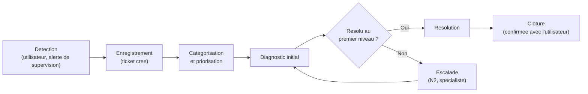
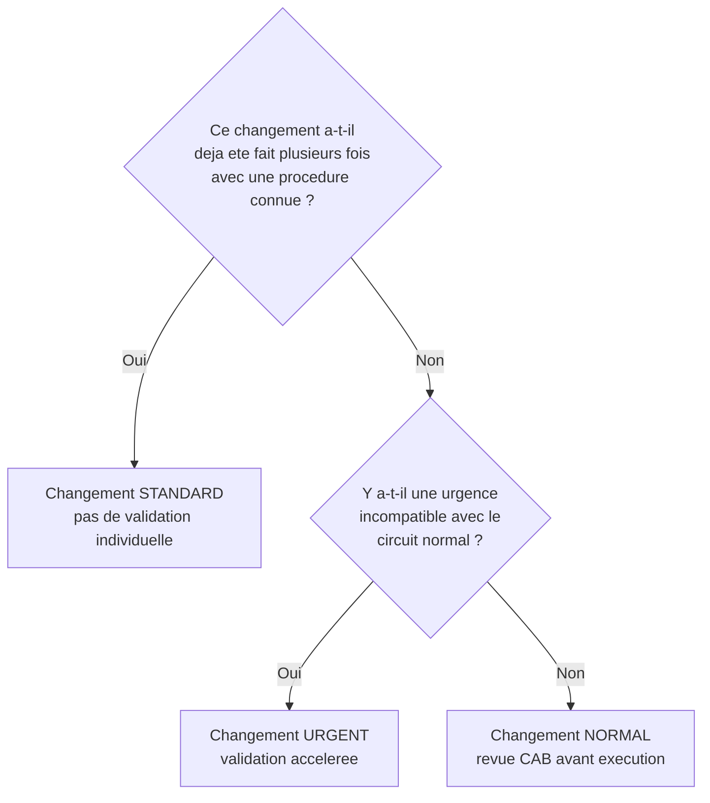

CHAPITRE 2

# ITIL v4 appliqué au quotidien

🎯 Objectif du chapitre
Comprendre ITIL v4 non pas comme une liste d'acronymes à mémoriser pour un examen, mais comme un langage commun qui structure le travail quotidien d'un administrateur système dans une organisation mature. À la fin de ce chapitre, tu sauras distinguer précisément un <strong>incident</strong>, un <strong>problème</strong> et un <strong>changement</strong> — la confusion la plus fréquente chez les débutants — et tu comprendras pourquoi un outil de tickets, une réunion CAB ou une fenêtre de maintenance existent et à quoi ils servent réellement, pas seulement "parce que c'est la procédure".

🎬 Mise en situation
Deuxième semaine dans la compagnie d'assurance du chapitre précédent. Tu remarques que chaque demande passe par un outil de tickets avec des catégories précises : "Incident", "Problème", "Demande de changement". Un collègue plus ancien t'explique, en buvant son café : <em>"On n'a pas toujours fait ça. Il y a trois ans, un technicien a redémarré un serveur de production un vendredi après-midi pour 'tester un correctif rapide', sans prévenir personne. Le serveur n'est jamais revenu proprement — mauvaise version de driver, personne ne savait comment revenir en arrière. Tout le système de gestion des sinistres est resté hors service pendant 14 heures, un samedi, pendant que les agents essayaient de joindre quelqu'un qui savait ce qui s'était passé."</em> Depuis cet incident, la DSI a mis en place un processus formel de changement, avec une validation avant toute intervention en production. Ce chapitre t'explique ce cadre — ITIL v4 — et surtout <em>pourquoi</em> chacune de ses briques existe, à partir d'un incident réel comme celui-ci plutôt que d'une théorie abstraite.

## 2.1 Qu'est-ce qu'ITIL, vraiment

**ITIL** (*Information Technology Infrastructure Library*) est un ensemble de bonnes pratiques pour la gestion des services informatiques, aujourd'hui dans sa quatrième version majeure (ITIL v4, publiée à partir de 2019). Ce n'est ni une loi, ni une norme obligatoire, ni un logiciel : c'est un **cadre de référence** — un vocabulaire commun et des processus éprouvés, que chaque organisation adapte à sa propre taille et à ses propres besoins.

💡 Analogie — le code de la route
ITIL, c'est un peu comme le code de la route. Rien n'oblige légalement une entreprise à l'appliquer à la lettre, exactement comme rien n'oblige un cycliste à rouler dans une ville sans jamais avoir lu le code de la route. Mais un code de la route existe parce que, sans lui, chaque carrefour devient une négociation risquée entre conducteurs qui ne savent pas à quoi s'attendre des autres. ITIL joue le même rôle dans une organisation IT : il donne des règles communes (qui a la priorité, qui valide quoi, dans quel ordre) qui évitent les collisions — comme celle du technicien du scénario d'ouverture, qui a "grillé un feu rouge" en modifiant la production sans validation ni plan de retour arrière.

📌 À retenir
ITIL n'est pas une certification que tu dois obtenir pour faire ce métier (contrairement à une idée reçue fréquente), et ce n'est pas un logiciel que tu installes. C'est un cadre conceptuel : les logiciels de gestion de tickets (ServiceNow, Jira Service Management, GLPI, Zammad...) sont des <strong>outils</strong> qui permettent d'appliquer concrètement les processus qu'ITIL décrit — l'outil n'est jamais la source du processus, seulement son support.

## 2.2 Le Système de Valeur des Services, en bref

ITIL v4 a introduit une évolution importante par rapport à la version précédente (ITIL v3, encore très répandue dans beaucoup d'entreprises) : au lieu d'une suite rigide de processus séquentiels, ITIL v4 propose un **Système de Valeur des Services** (SVS), plus flexible, organisé autour de sept principes directeurs. Ce manuel ne détaille pas l'ensemble du SVS (ce n'est pas un manuel de préparation à la certification ITIL Foundation) — mais trois de ces principes directeurs sont directement utiles dans ton travail quotidien, dès ce chapitre :

🧠 À mémoriser — 3 principes directeurs ITIL utiles au quotidien
1. <strong>Se concentrer sur la valeur</strong> : chaque action doit servir, au bout du compte, l'utilisateur ou le client — pas exister pour elle-même. Un processus qui ralentit tout sans réduire de risque réel n'est pas un bon processus, même s'il "suit ITIL" sur le papier.
2. <strong>Progresser de manière itérative avec un retour d'information</strong> : ne cherche jamais à construire un processus parfait du premier coup ; commence simple, observe ce qui casse, améliore.
3. <strong>Collaborer et favoriser la visibilité</strong> : la cause profonde de l'incident du scénario d'ouverture n'était pas technique — c'était l'absence de communication avant une action risquée.

⚠️ Un piège de débutant : réciter ITIL sans comprendre pourquoi
Beaucoup de débutants apprennent les noms des processus ITIL par cœur pour un entretien, sans jamais avoir vécu concrètement pourquoi ils existent. La bonne approche est inverse : comprends d'abord le problème réel que chaque processus résout (comme celui du scénario d'ouverture pour la gestion du changement), et le vocabulaire ITIL devient alors une évidence, pas une liste à mémoriser.

## 2.3 Incident, problème, changement : la distinction la plus importante de ce chapitre

C'est ici que se concentre la confusion la plus fréquente chez les administrateurs système débutants — y compris en entretien d'embauche. Ces trois mots ont un sens **précis et différent** en ITIL, alors qu'ils sont souvent utilisés de façon interchangeable dans le langage courant.

| Concept | Définition ITIL | Objectif | Exemple concret |
|---|---|---|---|
| **Incident** | Une interruption non planifiée d'un service, ou une dégradation de sa qualité | Rétablir le service **le plus vite possible** | Le serveur de messagerie ne répond plus |
| **Problème** | La **cause sous-jacente** d'un ou plusieurs incidents (parfois pas encore identifiée) | Comprendre la cause racine et **empêcher la récurrence** | Le serveur de messagerie plante chaque lundi matin depuis 3 semaines — pourquoi ? |
| **Changement** | Toute action planifiée d'ajout, modification ou retrait de quelque chose qui affecte un service | Réaliser une modification **de façon maîtrisée**, avec un risque évalué à l'avance | Appliquer un correctif, migrer une base de données, changer une configuration réseau |

💡 Analogie — le médecin urgentiste et l'épidémiologiste
Face à un patient qui arrive en urgence, un médecin urgentiste a un seul objectif immédiat : stabiliser le patient, le plus vite possible, même sans connaître encore la cause exacte (c'est la <strong>gestion d'incident</strong>). Un épidémiologiste, lui, étudie pourquoi des dizaines de patients similaires arrivent chaque semaine avec les mêmes symptômes, pour éliminer la cause à la source — une contamination, une pratique dangereuse (c'est la <strong>gestion des problèmes</strong>). Les deux rôles sont indispensables, mais confondre leurs objectifs serait dangereux : soigner un symptôme sans jamais chercher la cause, ou au contraire retarder les soins d'urgence pour "d'abord comprendre pourquoi", coûterait cher dans les deux cas.

❌ Mauvaise pratique — traiter un incident récurrent comme un incident isolé
Rappelle-toi la section 1.4 du chapitre 1 : un incident isolé se surveille, un incident récurrent devient un projet. Résoudre le même incident cinq fois de suite en une semaine, sans jamais ouvrir un <strong>problème</strong> pour en chercher la cause racine, est l'erreur la plus coûteuse en temps qu'une équipe puisse commettre — chaque résolution rapide traite le symptôme, jamais la cause, et l'incident revient inévitablement.

## 2.4 La gestion des incidents en détail

Le cycle de vie d'un incident suit une séquence assez stable d'une organisation à l'autre :

💡 Explication du schéma
Ce cycle rejoint directement la chaîne d'escalade vue au chapitre 1 (section 1.3) : un incident circule entre les niveaux jusqu'à ce qu'il trouve la compétence capable de le résoudre. La clôture n'est jamais automatique dès que "ça remarche" du point de vue technique — une bonne pratique répandue est de confirmer avec l'utilisateur concerné que le service est réellement rétabli de son point de vue, pas seulement du point de vue du tableau de bord de supervision.

**La priorisation** d'un incident ne dépend jamais uniquement de sa gravité technique apparente, mais du croisement entre deux facteurs :

| | Urgence faible | Urgence élevée |
|---|---|---|
| **Impact élevé** (beaucoup d'utilisateurs, service critique) | Priorité moyenne | **Priorité critique** |
| **Impact faible** (un seul utilisateur, service secondaire) | Priorité basse | Priorité moyenne |

🔒 Sécurité — un incident de sécurité suit un chemin différent
Un incident présentant une composante de sécurité (compromission suspectée, fuite de données potentielle) ne suit pas nécessairement le circuit standard de priorisation impact/urgence — il doit être signalé immédiatement à l'analyste sécurité ou au SOC (chapitre 1, section 1.3), même si son impact apparent semble limité au moment de la détection. Une intrusion détectée tôt et signalée immédiatement coûte infiniment moins cher qu'une intrusion découverte tardivement parce qu'elle a été traitée comme un incident technique ordinaire.

## 2.5 La gestion des problèmes : chercher la cause, pas seulement soigner le symptôme

La gestion des problèmes se distingue par son objectif : elle ne cherche pas à rétablir un service rapidement (c'est le rôle de la gestion d'incidents), mais à **comprendre pourquoi** un ou plusieurs incidents se produisent, pour empêcher qu'ils se reproduisent.

**Deux formes de gestion des problèmes existent :**
- **Réactive** : ouverte après qu'un incident (ou une série d'incidents similaires) a déjà eu lieu — c'est la forme la plus courante en début de maturité organisationnelle.
- **Proactive** : identifie des risques *avant* qu'un incident ne survienne, en analysant des tendances (par exemple, un espace disque qui se remplit progressivement — exactement l'exemple de performance proactive du chapitre 1, section 1.4).

✅ Bonne pratique — la base des erreurs connues (KEDB)
Une organisation mature tient une <strong>base des erreurs connues</strong> (*Known Error Database*, KEDB) : un répertoire des causes racines déjà identifiées, avec leur solution de contournement (*workaround*) si la cause n'a pas encore pu être corrigée définitivement. Face à un nouvel incident, la première question à se poser est souvent : "cette situation ressemble-t-elle à une erreur déjà connue et documentée ?" — un réflexe qui rejoint directement la discipline de documentation évoquée au chapitre 1 (section 1.6).

🚀 Performance — le retour sur investissement de la gestion des problèmes
Résoudre un incident prend généralement quelques minutes à quelques heures. Analyser sa cause racine en profondeur peut prendre plusieurs jours de travail d'investigation. Cet investissement se justifie pourtant très vite dès qu'un incident revient plus de deux ou trois fois : le temps cumulé passé à répéter la même résolution dépasse presque toujours, au bout de quelques semaines, le temps qu'aurait pris une vraie analyse de cause racine.

## 2.6 La gestion des changements : le cœur du scénario d'ouverture

Revenons directement à l'incident du scénario d'ouverture : un technicien a modifié un serveur de production sans validation ni plan de retour arrière, provoquant 14 heures d'interruption. La **gestion des changements** existe précisément pour éviter ce scénario, en distinguant trois types de changement, avec un niveau de contrôle proportionné au risque réel :

| Type de changement | Caractéristique | Exemple | Validation requise |
|---|---|---|---|
| **Standard** | Faible risque, déjà réalisé plusieurs fois, procédure pré-approuvée | Créer un compte utilisateur standard, appliquer un correctif mineur déjà testé | Aucune validation individuelle — la procédure elle-même a été validée une fois pour toutes |
| **Normal** | Risque réel, nécessite une évaluation au cas par cas | Migrer une base de données, changer la configuration d'un pare-feu | Revue par un **CAB** (*Change Advisory Board*) avant exécution |
| **Urgent** | Risque réel mais délai incompatible avec le circuit normal (souvent lié à un incident critique en cours) | Appliquer en urgence un correctif de sécurité critique activement exploité | Validation accélérée par un nombre réduit de décideurs, tracée après coup |

⚠️ Erreur de compréhension fréquente : croire que "urgent" veut dire "sans validation"
Un changement urgent n'est pas un changement <em>sans</em> contrôle — c'est un changement dont le circuit de validation est **accéléré**, pas supprimé. La différence est cruciale : même en urgence, quelqu'un d'autre que l'exécutant confirme que l'action est raisonnable et qu'un plan de retour arrière existe. C'est exactement ce qui a manqué dans l'incident du scénario d'ouverture — le technicien a traité son intervention comme si elle n'exigeait aucune validation, ni même une simple prévention de l'équipe.

**Tout changement normal ou urgent doit inclure, avant exécution :**
- Une description précise de ce qui va être modifié.
- Une évaluation du risque et de l'impact si ça se passe mal.
- Un **plan de retour arrière** (*rollback*) testé ou au moins documenté — pas juste "on verra bien".
- Une fenêtre de maintenance communiquée aux utilisateurs concernés, quand c'est pertinent.

🏢 **Le CAB en pratique.** Dans une grande organisation, le CAB est une réunion régulière (souvent hebdomadaire) réunissant des représentants de plusieurs équipes (infrastructure, sécurité, métier) qui examinent les changements normaux prévus. Dans une PME, ce rôle peut se réduire à un simple message écrit à un responsable, avec un accusé de réception avant d'agir — l'esprit du processus (une paire d'yeux supplémentaire avant un risque) compte plus que sa forme exacte.

## 2.7 Comment ces trois processus s'articulent au quotidien

Un exemple concret permet de voir comment incident, problème et changement collaborent dans un scénario réaliste, dans la continuité directe de la journée type du chapitre 1 (section 1.5) :

**Lundi, 9h15** — Plusieurs utilisateurs signalent une lenteur sur l'application de gestion des sinistres. Un **incident** est ouvert, priorité moyenne (impact partiel, urgence modérée). Diagnostic rapide : redémarrage d'un service applicatif, le service revient à la normale. Incident clos.

**Mardi, 9h10** — Même symptôme signalé, même solution appliquée. Incident clos une nouvelle fois.

**Mercredi, 9h05** — Troisième occurrence. À ce stade, le réflexe correct (section 2.3, encadré mauvaise pratique) est d'ouvrir un **problème** : *"Pourquoi ce service ralentit-il systématiquement le matin ?"* — l'investigation révèle une tâche planifiée mal dimensionnée qui sature la mémoire du serveur chaque matin à 9h.

**Jeudi** — La cause racine identifiée, un **changement normal** est soumis : reconfigurer la tâche planifiée pour limiter sa consommation mémoire, avec un plan de retour arrière (remettre l'ancienne configuration si le comportement empire). Validé, planifié pour une fenêtre de maintenance le vendredi soir.

**Vendredi soir** — Le changement est exécuté, vérifié, documenté. Le problème peut être clos car sa cause racine a été corrigée définitivement — plus seulement contournée.

## Atelier — Incident, problème ou changement ?

🛠️ Atelier 2 — Classer six situations

**Objectif** : s'entraîner à identifier immédiatement, face à une situation donnée, s'il s'agit d'un incident, d'un problème ou d'un changement — la compétence la plus directement transférable de ce chapitre vers ton futur poste.

**Préparation** : aucune installation nécessaire.

**Étapes détaillées** :

1. Pour chacune des six situations suivantes, indique s'il s'agit d'un incident, d'un problème ou d'un changement, et justifie en une phrase :
   - a) Un serveur de fichiers devient inaccessible pour tout un service à 14h.
   - b) Une équipe demande la migration planifiée d'une application vers un nouveau serveur le mois prochain.
   - c) Une analyse révèle que trois pannes du mois dernier partagent la même cause : un câble réseau défectueux dans une baie de brassage.
   - d) Un utilisateur ne peut plus se connecter à son compte ce matin, cas isolé.
   - e) L'équipe sécurité demande l'application immédiate d'un correctif critique activement exploité par des attaquants.
   - f) Une enquête est ouverte pour comprendre pourquoi la sauvegarde nocturne échoue un jour sur trois depuis deux semaines, sans qu'aucun service n'ait encore été interrompu.
2. Compare tes réponses à la section "Résultat attendu" ci-dessous.

**Résultat attendu** :
- a) **Incident** — interruption non planifiée d'un service.
- b) **Changement** (normal) — action planifiée, à évaluer et valider avant exécution.
- c) **Problème** — recherche de cause racine commune à plusieurs incidents passés.
- d) **Incident** — interruption non planifiée, impact limité à un utilisateur.
- e) **Changement urgent** — action nécessaire, mais dont le délai est incompatible avec le circuit normal.
- f) **Problème proactif** — aucun service n'a encore été interrompu, mais un risque a été identifié et fait l'objet d'une investigation avant qu'un incident ne survienne.

**Dépannage** : si tu hésites entre incident et problème, pose-toi la question de la section 2.3 — *cherches-tu à rétablir un service maintenant, ou à comprendre une cause qui explique plusieurs situations ?* Si tu hésites entre incident et changement, demande-toi si la situation était **planifiée** (changement) ou **subie** (incident).

## Erreurs fréquentes

⚠️ Erreur n°1 — Confondre incident et problème
C'est, de loin, l'erreur la plus fréquente. Un moyen simple de trancher : un incident se ferme quand le service est rétabli, même sans connaître la cause exacte ; un problème ne se ferme que quand la cause racine est corrigée ou qu'une décision explicite est prise de vivre avec (un contournement documenté et accepté).

⚠️ Erreur n°2 — Traiter tout changement comme un changement normal lourd
À l'inverse du scénario d'ouverture (aucune validation), une organisation peut basculer dans l'excès inverse : soumettre au CAB des changements triviaux et déjà éprouvés des dizaines de fois, ralentissant tout sans réduire de risque réel. C'est exactement ce que le principe directeur "se concentrer sur la valeur" (section 2.2) vise à éviter — un changement standard bien défini existe justement pour ces cas.

⚠️ Erreur n°3 — Considérer ITIL comme une fin en soi
Suivre un processus à la lettre sans jamais se demander s'il sert encore son objectif réel est une dérive fréquente dans les grandes organisations ("c'est la procédure" devient une réponse suffisante en soi). Un bon administrateur système applique ITIL parce qu'il en comprend la raison d'être (éviter les incidents comme celui du scénario d'ouverture), pas parce que "c'est écrit qu'il faut faire comme ça".

## Diagnostiquer : incident, problème ou changement ?

🩺 Situation : "On ne sait pas si on doit ouvrir un incident ou un problème"

- **Diagnostic** : pose la question de la section 2.3 — y a-t-il, en ce moment même, une interruption ou une dégradation de service ? Si oui, un incident existe déjà (ou doit être ouvert) indépendamment de la suite. La question du problème (la cause) est toujours secondaire par rapport au rétablissement du service.
- **Comment vérifier** : si le service fonctionne normalement au moment où on se pose la question, mais qu'une inquiétude ou une tendance suspecte existe, c'est un problème proactif — pas un incident.
- **Résolution** : dans le doute, ouvre toujours l'incident d'abord si un service est réellement affecté ; le lien vers un problème (nouveau ou existant) peut être établi ensuite, une fois le service rétabli.

🩺 Situation : "Une modification semble mineure, faut-il vraiment ouvrir un changement ?"

- **Diagnostic** : la question à se poser n'est jamais "est-ce que ça prend du temps à documenter ?" mais *"si cette action échoue, quel est l'impact réel ?"* — reprends le raisonnement de la section 1.6 du chapitre 1 (*"qu'est-ce qui se passe si ça ne marche pas ?"*).
- **Comment vérifier** : si l'action touche un système de production partagé par plusieurs utilisateurs, la réponse est presque toujours oui, même pour une modification qui semble triviale — c'est exactement l'angle mort qui a produit l'incident du scénario d'ouverture.
- **Résolution** : en cas de doute persistant, en parler à un collègue ou un responsable prend rarement plus de cinq minutes, et c'est précisément la "paire d'yeux supplémentaire" que le CAB formalise à plus grande échelle.

## En entreprise

- **Bonne pratique répandue** : les organisations matures publient des statistiques régulières sur les incidents (nombre, durée moyenne de résolution, taux de récurrence) — pas pour blâmer une équipe, mais pour repérer objectivement où investir en gestion des problèmes.
- **Bonne pratique répandue** : un changement standard n'est jamais créé "à la légère" — il résulte généralement de plusieurs changements normaux similaires, exécutés sans incident, qu'une équipe décide ensuite de pré-approuver pour accélérer le futur.
- **Erreur classique observée** : une équipe qui adopte les noms ITIL (incident, problème, changement) dans son outil de tickets sans jamais réellement distinguer les processus dans la pratique — tout devient un "ticket", peu importe sa vraie nature, ce qui annule l'intérêt même du cadre.

## Entretien technique

💼 Questions fréquemment posées en entretien

**Q1. "Quelle est la différence entre un incident et un problème selon ITIL ?"**
Réponse attendue : un incident est une interruption ou dégradation non planifiée d'un service, dont l'objectif de traitement est le rétablissement rapide. Un problème est la cause sous-jacente d'un ou plusieurs incidents, dont l'objectif est d'empêcher la récurrence — pas nécessairement de résoudre vite.
*Piège fréquent* : répondre uniquement "c'est la même chose en plus grave" trahit une confusion fondamentale entre gravité et nature du processus.

**Q2. "Pourquoi une organisation distingue-t-elle changement standard, normal et urgent ?"**
Réponse attendue : pour proportionner le niveau de contrôle au risque réel — un contrôle insuffisant sur un changement risqué (comme dans le scénario d'ouverture de ce chapitre) peut provoquer un incident majeur ; un contrôle excessif sur un changement trivial ralentit l'organisation sans bénéfice réel.

**Q3. "As-tu déjà eu affaire à un processus de gestion du changement, même en dehors du travail ?"**
Réponse attendue : le recruteur cherche ici une capacité à transposer le concept au-delà du jargon — par exemple, demander une validation avant de modifier un projet partagé, ou prévoir un plan B avant une action risquée dans un contexte personnel ou scolaire. L'important est de montrer que le principe est compris, pas seulement le vocabulaire ITIL.

## Optimisation, sécurité et maintenabilité — les réflexes dès ce chapitre

🔒 Sécurité
Un changement qui touche des permissions, des règles de pare-feu ou des accès (même "mineur" en apparence) mérite toujours une revue par une seconde personne — le risque en cas d'erreur n'est pas seulement une panne, mais potentiellement une porte laissée ouverte. Ce réflexe sera repris concrètement dans la Partie 12 (cybersécurité et gouvernance).

✅ Maintenabilité
Documente systématiquement le lien entre un incident et le problème correspondant quand il existe (la plupart des outils de tickets le permettent nativement). Sans ce lien explicite, l'historique d'un service devient illisible : personne ne peut plus répondre à la question "cette panne, on l'a déjà eue ?" sans repartir de zéro.

🚀 Performance
Mesurer le **MTTR** (*Mean Time To Resolve*, temps moyen de résolution d'un incident) et le **taux de récurrence** (proportion d'incidents qui reviennent après une première résolution) donne une vision bien plus utile de la santé d'une infrastructure que le simple nombre brut d'incidents ouverts — deux métriques à connaître avant même d'aborder la supervision en profondeur (Partie 10).

## Résumé du chapitre

- ITIL v4 est un cadre de bonnes pratiques, pas une loi ni un logiciel — il donne un vocabulaire et des processus communs, adaptables à la taille de chaque organisation.
- Un **incident** est une interruption non planifiée, traité pour un rétablissement rapide ; un **problème** est la cause racine d'un ou plusieurs incidents, traité pour empêcher la récurrence ; un **changement** est une action planifiée, contrôlée selon son niveau de risque réel (standard, normal, urgent).
- La priorisation d'un incident croise impact et urgence, jamais l'un sans l'autre.
- Tout changement normal ou urgent doit inclure une évaluation du risque et un plan de retour arrière, quelle que soit sa simplicité apparente.
- Ces trois processus s'articulent naturellement dans le quotidien : un incident récurrent devient un problème, dont la résolution passe souvent par un changement contrôlé.

## Quiz

📝 QCM (une seule bonne réponse par question)

1. Un serveur devient inaccessible sans prévenir pour l'ensemble d'un service. C'est :
   - a) Un problème
   - b) Un changement urgent
   - c) Un incident
   - d) Un changement standard

2. L'objectif principal de la gestion des problèmes est de :
   - a) Rétablir un service le plus vite possible
   - b) Comprendre une cause racine et empêcher la récurrence
   - c) Valider une modification avant exécution
   - d) Fermer le plus de tickets possible

3. Un changement standard se caractérise par :
   - a) Un risque élevé et une nouveauté totale
   - b) Une procédure déjà éprouvée et pré-approuvée, à faible risque
   - c) L'absence de toute trace écrite
   - d) Une validation systématique par le CAB avant chaque exécution

**Corrigé** : 1-c, 2-b, 3-b.

📝 Vrai ou Faux

1. Un changement urgent signifie qu'aucune validation n'est nécessaire. — **Faux** (la validation est accélérée, pas supprimée).
2. Un incident peut être clos sans connaître sa cause racine exacte. — **Vrai** (c'est le rôle de la gestion des problèmes de creuser cette cause, séparément).
3. La priorisation d'un incident dépend uniquement de sa gravité technique. — **Faux** (elle croise impact et urgence).
4. Une base des erreurs connues (KEDB) sert à accélérer le diagnostic de nouveaux incidents ressemblant à des cas déjà documentés. — **Vrai**.

📝 Questions ouvertes

1. Explique, avec tes propres mots, pourquoi fermer un incident ne veut pas dire que le travail est terminé.
2. Reprends l'incident du scénario d'ouverture (le redémarrage de serveur non validé un vendredi). Explique quelles étapes du processus de gestion du changement, si elles avaient existé à l'époque, auraient pu éviter les 14 heures d'interruption.

**Corrigé 1** : fermer un incident signifie que le service est rétabli pour les utilisateurs — mais si l'incident fait partie d'une récurrence, ou si sa cause racine reste inconnue, le travail réel (comprendre pourquoi, via la gestion des problèmes) continue séparément. Un incident fermé sans investigation de fond, en cas de récurrence, revient inévitablement.

**Corrigé 2** : une évaluation du risque aurait identifié qu'une intervention en production un vendredi après-midi, sans fenêtre de maintenance annoncée, présentait un risque élevé compte tenu de l'absence de supervision le week-end. Une revue par une seconde personne (même informelle) aurait probablement demandé un plan de retour arrière avant l'action — or aucun n'existait, ce qui explique directement pourquoi le serveur "n'est jamais revenu proprement". Une simple communication préalable ("je fais ceci, voici comment annuler si ça tourne mal") aurait permis à un collègue de réagir bien plus vite le samedi, au lieu de chercher à joindre "quelqu'un qui savait ce qui s'était passé".

## Exercices

📝 Exercice 2.1

Un serveur d'impression tombe en panne trois fois en un mois, toujours résolu par un simple redémarrage en moins de 10 minutes. Explique pourquoi, malgré la rapidité de résolution de chaque incident individuel, cette situation mérite d'ouvrir un problème.

**Corrigé :** Chaque redémarrage individuel traite le symptôme (le service est interrompu) mais jamais la cause. Trois occurrences en un mois indiquent une cause récurrente non identifiée (fuite mémoire, tâche planifiée mal configurée, matériel défaillant...). Sans ouvrir un problème, l'équipe continuera indéfiniment à répéter la même résolution rapide, sans jamais réduire le nombre total d'interruptions subies par les utilisateurs — même si chaque interruption individuelle semble "sans gravité".

📝 Exercice 2.2

Reprends l'articulation incident → problème → changement de la section 2.7. Rédige, en 4 à 6 phrases, un scénario équivalent mais appliqué à un contexte que tu connais bien (un contexte scolaire, personnel, ou une autre entreprise) — un incident répété, un problème ouvert pour en chercher la cause, puis un changement pour corriger définitivement.

**Corrigé (exemple de réponse) :** Le Wi-Fi d'une salle de classe universitaire coupe systématiquement vers 14h chaque mardi (incident répété). Après la troisième occurrence, un problème est ouvert pour comprendre pourquoi ce créneau précis pose systématiquement problème. L'investigation révèle que le point d'accès Wi-Fi de la salle voisine, utilisé à ce moment-là pour un cours pratique avec beaucoup d'appareils connectés, sature le canal radio partagé. Un changement normal est alors planifié : reconfigurer les deux points d'accès sur des canaux radio distincts, avec un test de validation après la modification et un plan de retour arrière (remettre l'ancienne configuration) si le problème persiste après le changement.

## Checklist de fin de chapitre

<ul class="checklist">
<li>☐ Je peux définir ITIL sans dire "c'est une certification" ou "c'est un logiciel".</li>
<li>☐ Je sais distinguer sans hésitation un incident, un problème et un changement.</li>
<li>☐ Je comprends comment la priorité d'un incident se calcule (impact × urgence).</li>
<li>☐ Je connais les trois types de changement (standard, normal, urgent) et leur niveau de contrôle respectif.</li>
<li>☐ Je sais pourquoi un plan de retour arrière est indispensable avant tout changement à risque réel.</li>
<li>☐ Je comprends le rôle d'une base des erreurs connues (KEDB).</li>
<li>☐ Je sais expliquer, à partir d'un exemple concret, comment incident, problème et changement s'articulent dans le temps.</li>
</ul>

## FAQ

<dl class="faq">
<dt>Dois-je passer une certification ITIL Foundation pour travailler comme administrateur système ?</dt>
<dd>Non, ce n'est presque jamais un prérequis strict pour un poste junior. C'est en revanche un atout reconnu sur un CV, et la certification la plus répandue dans le métier reste ITIL v4 Foundation — un bon objectif à envisager après quelques mois d'expérience pratique, une fois les concepts de ce chapitre déjà vécus sur le terrain.</dd>

<dt>ITIL v3 est-il complètement obsolète maintenant qu'ITIL v4 existe ?</dt>
<dd>Non. Une part importante des organisations utilise encore un vocabulaire et des processus hérités d'ITIL v3 (souvent appelés "processus" plutôt que "pratiques"). Les concepts fondamentaux de ce chapitre (incident, problème, changement) restent quasiment identiques entre les deux versions — ITIL v4 a surtout fait évoluer la structure globale (le Système de Valeur des Services) et l'esprit plus flexible du cadre.</dd>

<dt>Une toute petite entreprise a-t-elle vraiment besoin d'un CAB formel ?</dt>
<dd>Non, et ce serait probablement disproportionné pour une équipe de deux ou trois personnes, comme évoqué en section 2.6. L'esprit du processus — une validation avant un risque réel, un plan de retour arrière — reste pertinent à toute taille d'organisation, seule sa formalisation doit s'adapter.</dd>

<dt>Que se passe-t-il si un changement, bien validé, échoue quand même ?</dt>
<dd>C'est précisément la raison d'être du plan de retour arrière préparé à l'avance (section 2.6) : revenir à l'état précédent de façon maîtrisée, puis ouvrir un nouvel incident si le service reste affecté le temps du retour arrière, et éventuellement un problème si la cause de l'échec doit être comprise avant une nouvelle tentative.</dd>
</dl>

## Références et pour aller plus loin

- Axelos / PeopleCert — ITIL 4 Foundation, présentation officielle : [https://www.peoplecert.org/products/itil-4-foundation](https://www.peoplecert.org/products/itil-4-foundation)
- ITIL 4 Foundation, Axelos (ouvrage officiel de référence pour la certification).
- ITSM.tools — ressources et articles pratiques sur la mise en œuvre d'ITIL en entreprise : [https://itsm.tools](https://itsm.tools)

*Chapitre suivant : documentation, inventaire et gestion des actifs — comment transformer la discipline de documentation évoquée depuis le chapitre 1 en un système réellement exploitable au quotidien.*
