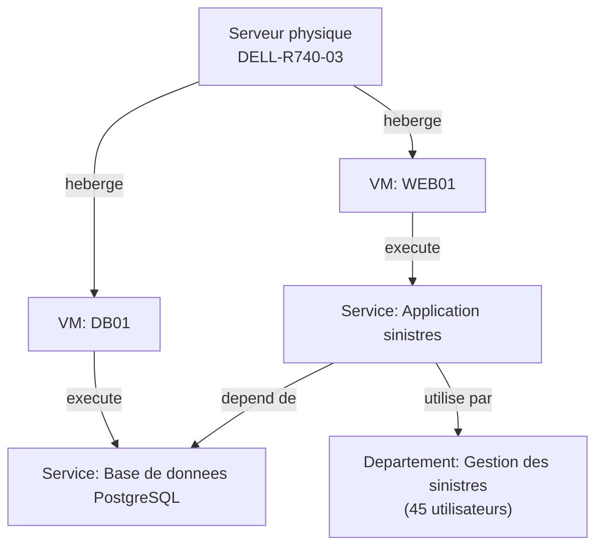
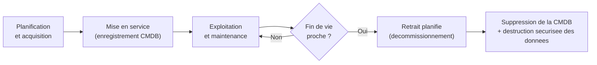

<div class="chapitre-titre-num">CHAPITRE 3</div>

# Documentation, inventaire et gestion des actifs

<div class="encadre objectif">
<span class="encadre-titre">🎯 Objectif du chapitre</span>
Comprendre pourquoi la documentation et l'inventaire ne sont pas des tâches administratives secondaires, mais une responsabilité centrale du métier — directement liée à la sécurité, à la continuité d'activité et à la vitesse de résolution d'incident. À la fin de ce chapitre, tu sauras écrire un runbook réellement utilisable par quelqu'un d'autre que toi, distinguer un simple inventaire d'une CMDB, et comprendre le cycle de vie complet d'un actif informatique, de son acquisition à son retrait.
</div>

<div class="encadre scenario">
<span class="encadre-titre">🎬 Mise en situation</span>
Troisième semaine dans la compagnie d'assurance. Le collègue le plus expérimenté de l'équipe infrastructure, celui qui connaît "par cœur" l'emplacement de chaque serveur et la raison de chaque exception de pare-feu, part en congé de trois semaines pour la naissance de son enfant. Le jour de son départ, une alerte se déclenche sur un serveur que tu ne connais pas encore. Tu ouvres le dossier partagé "Documentation infrastructure" en espérant trouver une réponse — et tu tombes sur un schéma d'architecture daté d'il y a deux ans, visiblement obsolète (il mentionne un serveur qui, tu le sais déjà, a été remplacé le mois dernier), et aucun runbook pour ce type d'alerte précis. Tu résous l'incident après 40 minutes de tâtonnement — largement plus long que nécessaire si la documentation avait été fiable. Ce chapitre explique comment éviter exactement cette situation, dans les deux sens : comment documenter pour les autres, et comment reconnaître une documentation sur laquelle on ne peut pas compter.
</div>

## 3.1 La documentation est une responsabilité, pas une corvée administrative

Rappelle-toi le chapitre 1 (section "En entreprise") : le "bus factor" de 1 — quand la connaissance critique d'une infrastructure repose sur une seule personne — est l'un des risques organisationnels les plus sérieux qu'une équipe IT puisse porter, souvent sans même s'en rendre compte tant que cette personne est présente. La documentation n'est pas une tâche que l'on fait "quand on a le temps" : c'est ce qui transforme la compétence d'une seule personne en capacité durable d'une organisation entière.

<div class="encadre astuce">
<span class="encadre-titre">💡 Analogie — le carnet de bord du capitaine</span>
Un capitaine de navire tient un carnet de bord non pas parce qu'un règlement maritime l'y oblige dans l'absolu, mais parce que si l'équipage change, si le capitaine tombe malade en pleine mer, ou si un événement doit être reconstitué après coup, ce carnet est la seule trace fiable de ce qui s'est réellement passé, quand, et pourquoi. Une infrastructure informatique mérite exactement la même discipline : un "carnet de bord" qui survit au départ, à la maladie ou aux vacances de n'importe quel membre de l'équipe.
</div>

<div class="encadre mauvaise-pratique">
<span class="encadre-titre">❌ Mauvaise pratique — la documentation "dans ma tête"</span>
"Je le sais, je n'ai pas besoin de l'écrire" est l'une des phrases les plus risquées qu'un administrateur système puisse prononcer. Ce n'est jamais une question de compétence individuelle : même la personne la plus compétente peut être en vacances, malade, ou avoir simplement changé de poste au moment précis où cette connaissance devient nécessaire — exactement la situation du scénario d'ouverture de ce chapitre.
</div>

## 3.2 Les différents types de documentation dont un administrateur système a besoin

Tous les documents ne servent pas le même objectif. Confondre leurs rôles est une source fréquente de documentation à la fois surabondante et, paradoxalement, inutilisable au bon moment :

| Type de document | Objectif | Quand le consulter | Fréquence de mise à jour attendue |
|---|---|---|---|
| **Runbook** | Procédure pas-à-pas pour une situation précise, souvent urgente | Pendant un incident, en pleine astreinte | À chaque fois que la procédure change |
| **Procédure standard** | Décrire une tâche récurrente non urgente (créer un compte, provisionner un serveur) | Avant d'exécuter une tâche répétitive | Occasionnelle |
| **Schéma d'architecture** | Vue d'ensemble de comment les systèmes s'articulent entre eux | Pour comprendre l'impact d'un changement (chapitre 2) | À chaque changement structurel |
| **Journal des changements** (*changelog*) | Trace chronologique de "quoi, qui, quand, pourquoi" | Pour comprendre l'historique d'un système | À chaque changement, sans exception |
| **Base de connaissance / KEDB** (chapitre 2) | Solutions à des problèmes déjà rencontrés | Au début d'un diagnostic d'incident | À chaque nouveau problème résolu |

<div class="encadre retenir">
<span class="encadre-titre">📌 À retenir</span>
Un schéma d'architecture répond à la question "comment est-ce construit ?". Un runbook répond à "que dois-je faire, maintenant, dans cette situation précise ?". Ce sont deux besoins différents, à des moments différents — un bon système de documentation propose les deux, pas seulement l'un ou l'autre.
</div>

## 3.3 Qu'est-ce qu'un bon runbook

Un runbook efficace n'est pas un document théorique — c'est un texte qu'une personne stressée, en pleine nuit, avec une alerte qui sonne, doit pouvoir suivre **sans avoir besoin de comprendre le système en profondeur au préalable**. C'est un critère de qualité très concret et vérifiable.

```markdown
# Runbook — Service de messagerie interne ne repond plus

## Symptome
Les utilisateurs signalent l'impossibilite d'envoyer/recevoir des emails internes.
L'alerte de supervision "mail-service-down" est active.

## Impact
Critique — bloque la communication interne de toute l'entreprise.

## Verification prealable
1. Se connecter au serveur MAIL01 (voir acces dans le coffre-fort de mots de passe).
2. Executer : `systemctl status postfix`
3. Si "inactive (dead)" -> passer a l'etape de resolution.
4. Si "active (running)" -> le probleme est ailleurs, escalader au reseau (verifier DNS/pare-feu).

## Resolution
1. Executer : `systemctl restart postfix`
2. Attendre 30 secondes, revérifier le statut.
3. Envoyer un email de test a test@entreprise.ht depuis un compte externe.
4. Si le service ne redemarre pas : consulter les logs `journalctl -u postfix -n 100`
   et escalader au Niveau 2 infrastructure avec ces logs joints.

## Apres resolution
- Confirmer avec au moins 2 utilisateurs que le service fonctionne reellement.
- Ouvrir un ticket "probleme" si c'est la 2e occurrence ce mois-ci (voir chapitre 2).
- Mettre a jour ce runbook si une etape s'est reveleee incorrecte ou incomplete.
```

<div class="encadre bonne-pratique">
<span class="encadre-titre">✅ Bonne pratique — le test du "collègue qui ne connaît rien"</span>
Avant de considérer un runbook terminé, fais-le lire à un collègue qui ne connaît pas ce système précis (ou relis-le toi-même en imaginant que tu ne connais rien). S'il contient une étape comme "vérifier que la configuration est correcte" sans préciser **comment** vérifier concrètement, ou une commande sans expliquer ce qu'elle fait, ce n'est pas encore un runbook exploitable — c'est un aide-mémoire pour toi seul.
</div>

<div class="encadre attention">
<span class="encadre-titre">⚠️ Un runbook qui n'est jamais mis à jour devient dangereux, pas seulement inutile</span>
Le schéma d'architecture obsolète du scénario d'ouverture est un cas typique : une information fausse peut coûter plus cher qu'une absence totale d'information, parce qu'elle donne une **fausse confiance**. Un runbook qui recommande de redémarrer un service qui n'existe plus sous ce nom peut faire perdre un temps précieux en pleine crise, précisément au moment où ce temps compte le plus.
</div>

## 3.4 L'inventaire : on ne peut pas protéger ce qu'on ne connaît pas

Avant même de parler d'outils, un principe simple : un administrateur système ne peut sécuriser, sauvegarder, mettre à jour ou superviser correctement que ce dont il connaît **l'existence**. Un serveur, un compte de service, ou un abonnement cloud oublié — ce qu'on appelle le **shadow IT** quand ces ressources échappent totalement au contrôle de l'équipe IT — représente un angle mort de sécurité et de coût réel, pas une simple négligence administrative.

<div class="encadre securite">
<span class="encadre-titre">🔒 Sécurité — l'inventaire comme fondation de la cybersécurité</span>
Ce n'est pas un hasard si le tout premier contrôle des <strong>CIS Controls</strong> (un référentiel de cybersécurité largement reconnu, approfondi en Partie 12) s'intitule "Inventaire et contrôle des actifs de l'entreprise". Il est littéralement impossible d'appliquer un correctif de sécurité, de détecter une intrusion, ou de restreindre un accès sur un système dont on ignore l'existence — l'inventaire précède toute autre mesure de sécurité, il n'est pas une option parmi d'autres.
</div>

**Un bon inventaire répond, pour chaque actif, à des questions précises :** quoi (nature de l'actif), où (localisation physique ou logique), qui (propriétaire/responsable), depuis quand (date de mise en service), et quelle criticité (impact si cet actif tombe en panne).

## 3.5 De l'inventaire à la CMDB : ajouter les relations entre les actifs

Un simple inventaire (une liste de serveurs dans un tableur, par exemple) répond à "qu'est-ce qu'on a ?". Une **CMDB** (*Configuration Management Database*, base de données de gestion de configuration) va plus loin : elle capture aussi les **relations** entre les actifs — appelés **éléments de configuration** (*Configuration Items*, CI) en ITIL — ce qui permet de répondre à une question bien plus utile en pratique : "si <em>ceci</em> tombe en panne, qu'est-ce que ça affecte réellement ?"



<div class="encadre astuce">
<span class="encadre-titre">💡 Explication du schéma — la vraie valeur d'une CMDB</span>
Sans ce graphe de relations, une panne sur "DELL-R740-03" ressemble à un problème matériel isolé. Avec la CMDB, on voit immédiatement l'impact réel en cascade : ce serveur physique héberge deux machines virtuelles, dont une base de données dont dépend l'application de gestion des sinistres, utilisée par 45 personnes. C'est exactement l'information qui manquait dans le scénario d'ouverture — sans elle, il est impossible d'évaluer rapidement la vraie criticité d'un incident.
</div>

<div class="encadre performance">
<span class="encadre-titre">🚀 Performance — la CMDB au service de la gestion des changements</span>
La CMDB rejoint directement le chapitre 2 : avant de valider un changement normal, un CAB s'appuie sur la CMDB pour évaluer précisément quels services seraient affectés — sans elle, l'évaluation du risque devient une estimation approximative, pas une analyse fondée sur des faits.
</div>

## 3.6 Le cycle de vie d'un actif

Un actif informatique — un serveur, un poste de travail, une licence logicielle, un abonnement cloud — suit un cycle de vie prévisible, qu'une bonne gestion des actifs (*Asset Management*) accompagne à chaque étape :



<div class="encadre attention">
<span class="encadre-titre">⚠️ L'étape la plus souvent négligée : le décommissionnement</span>
Beaucoup d'organisations sont rigoureuses sur l'acquisition et la mise en service d'un actif, mais négligent son retrait propre. Un serveur "éteint mais jamais vraiment retiré" reste une ligne fantôme dans l'inventaire (ou pire, en dehors de tout inventaire), un ancien compte de service jamais désactivé reste un accès valide que plus personne ne surveille — exactement le type d'angle mort de sécurité évoqué en section 3.4. Le décommissionnement doit inclure la destruction sécurisée des données sensibles, pas seulement l'arrêt physique de la machine.
</div>

## 3.7 Les outils, selon la taille de l'organisation

Comme pour le CAB du chapitre 2, l'outillage doit être proportionné à la taille réelle de l'organisation — l'esprit de la discipline compte plus que la sophistication de l'outil :

| Taille d'organisation | Outil typique |
|---|---|
| Très petite structure (quelques serveurs) | Un tableur partagé, rigoureusement tenu à jour |
| PME structurée | GLPI, Lansweeper, ou une CMDB légère intégrée à l'outil de tickets |
| Grande entreprise | ServiceNow CMDB, ou équivalent, avec découverte automatique des actifs réseau |

<div class="encadre astuce">
<span class="encadre-titre">💡 Pour aller plus loin — l'infrastructure as code comme documentation vivante</span>
Les Parties 6 à 9 de ce manuel (virtualisation, conteneurs, automatisation) introduisent une idée complémentaire puissante : quand l'infrastructure est décrite dans du code (Terraform, Ansible), ce code devient lui-même une forme de documentation — toujours à jour par construction, puisque c'est lui qui a réellement créé l'infrastructure en question. Ce n'est pas un remplacement des runbooks ou des schémas d'architecture, mais un complément qui réduit fortement le risque de dérive entre "ce qui est documenté" et "ce qui existe réellement" (chapitre 51 et suivants).
</div>

## 3.8 Le test ultime : quelqu'un d'autre doit pouvoir s'en servir sans toi

Toutes les sections précédentes convergent vers un seul critère de qualité, simple à énoncer mais exigeant à respecter : **une documentation n'a de valeur que le jour où quelqu'un d'autre que son auteur original l'utilise avec succès, sans aide.** Exactement comme la sauvegarde jamais testée du chapitre 1 (section 1.4), une documentation jamais éprouvée par quelqu'un d'extérieur reste une hypothèse non vérifiée, pas une garantie.

<div class="encadre bonne-pratique">
<span class="encadre-titre">✅ Bonne pratique — faire tourner la documentation</span>
Dans une équipe de plusieurs personnes, un exercice simple et efficace consiste à faire résoudre occasionnellement un incident (réel ou simulé, hors production) à la personne qui n'est habituellement pas en charge de ce système, en suivant uniquement la documentation existante. Ce qui bloque révèle exactement ce qui doit être amélioré — un réflexe qui rejoint directement les principes directeurs ITIL vus au chapitre 2 (progresser de manière itérative avec un retour d'information).
</div>

## Atelier — Écrire un runbook exploitable

<div class="encadre exercice">
<span class="encadre-titre">🛠️ Atelier 3 — Rédiger un runbook depuis zéro</span>

**Objectif** : s'entraîner à produire un runbook qui respecte le "test du collègue qui ne connaît rien" (section 3.3) — la compétence la plus directement utile de ce chapitre pour ton futur poste.

**Préparation** : aucune installation nécessaire. Prends un éditeur de texte ou une feuille.

**Scénario donné** : un serveur de fichiers partagé (nom : FILE01) affiche une alerte "espace disque à 95%" dans l'outil de supervision. Les utilisateurs commencent à ne plus pouvoir enregistrer de nouveaux fichiers.

**Étapes détaillées** :

1. Rédige un runbook complet pour ce scénario, en suivant la structure de la section 3.3 (Symptôme, Impact, Vérification préalable, Résolution, Après résolution).
2. Pour l'étape "Résolution", imagine et décris au moins deux actions possibles (par exemple : identifier et supprimer les fichiers temporaires ou obsolètes les plus volumineux ; étendre l'espace disque si l'infrastructure le permet).
3. Relis ton propre runbook en te demandant, pour chaque étape : *"Si je ne connaissais rien à ce serveur, saurais-je exactement quoi faire avec cette seule phrase ?"*
4. Compare ta démarche à la section "Résultat attendu" ci-dessous.

**Résultat attendu** : un bon runbook pour ce scénario doit inclure des commandes précises (pas "vérifier l'espace disque" seul, mais la commande exacte à exécuter selon l'OS, sujet approfondi dans les Parties 2 et 3 de ce manuel), un seuil clair de décision (à partir de quel espace libéré peut-on considérer l'incident résolu), et une étape de vérification après action (confirmer qu'un utilisateur peut de nouveau enregistrer un fichier). L'absence de l'une de ces trois composantes est le signe d'un runbook encore incomplet.

**Dépannage** : si tu ne sais pas quelle commande précise écrire à ce stade du manuel (avant les Parties 2 et 3), c'est normal — note "TODO : commande précise à ajouter après le chapitre correspondant" plutôt que d'inventer une commande approximative. Un runbook incomplet mais honnête vaut mieux qu'un runbook qui semble complet mais contient une erreur.
</div>

## Erreurs fréquentes

<div class="encadre attention">
<span class="encadre-titre">⚠️ Erreur n°1 — la documentation zombie</span>
Un document créé une fois puis jamais mis à jour devient, avec le temps, plus dangereux qu'utile — exactement le schéma d'architecture obsolète du scénario d'ouverture. La meilleure façon d'éviter ce piège est de lier la mise à jour de la documentation directement au processus de changement du chapitre 2 : aucun changement n'est considéré terminé tant que la documentation correspondante n'a pas été mise à jour.
</div>

<div class="encadre attention">
<span class="encadre-titre">⚠️ Erreur n°2 — confondre inventaire physique et CMDB</span>
Un inventaire physique répond à "qu'est-ce qu'on possède ?" ; une CMDB répond en plus à "comment tout cela s'articule, et quel est l'impact d'une panne ?" (section 3.5). Une organisation qui ne tient qu'un inventaire physique croit souvent, à tort, disposer d'une vision complète de son risque opérationnel.
</div>

<div class="encadre attention">
<span class="encadre-titre">⚠️ Erreur n°3 — reporter la documentation à "plus tard"</span>
"Je documenterai une fois que tout sera stable" est une promesse presque toujours rompue, car une infrastructure n'est jamais définitivement stable — de nouveaux systèmes, de nouveaux changements arrivent en continu. La bonne pratique est de documenter **au moment même** de l'action (section 3.1 du chapitre 1), jamais différée à un moment hypothétique plus calme qui n'arrive presque jamais.
</div>

## Diagnostiquer la fiabilité d'une documentation

<div class="encadre attention">
<span class="encadre-titre">🩺 Situation : "Je ne sais pas si je peux faire confiance à ce document"</span>

- **Diagnostic** : vérifie d'abord la date de dernière modification, et compare-la à la date du dernier changement connu sur le système concerné (journal des changements, section 3.2). Un écart important est un signal d'alerte immédiat.
- **Comment vérifier** : si possible, valide une information factuelle simple et vérifiable rapidement (un nom de serveur, une adresse IP) avant de suivre une procédure plus risquée à l'aveugle.
- **Résolution** : en cas de doute persistant pendant un incident réel, ne suis jamais une procédure douteuse sans vérification préalable sur un système de production — mieux vaut perdre quelques minutes à confirmer qu'aggraver un incident avec une action basée sur une information fausse.
</div>

## En entreprise

En pratique professionnelle, quelques constats reviennent souvent autour de la documentation et de l'inventaire :

- **Bonne pratique répandue** : les organisations matures effectuent un audit périodique de leur CMDB (souvent trimestriel ou semestriel), en comparant l'inventaire déclaré à une découverte automatique du réseau réel, pour détecter les écarts (shadow IT, actifs oubliés).
- **Bonne pratique répandue** : documenter au format texte simple (Markdown, comme l'exemple de runbook de ce chapitre) plutôt que dans des formats propriétaires complexes — un texte brut reste lisible, versionnable (avec Git, chapitre 51), et consultable même quand l'outil "idéal" est lui-même hors service.
- **Erreur classique observée** : une documentation qui existe uniquement dans la tête d'un prestataire externe ou d'un consultant temporaire, jamais transférée à l'équipe interne — un risque similaire au "bus factor" de 1 du chapitre 1, mais encore plus difficile à corriger une fois le contrat terminé.

## Entretien technique

<div class="encadre exercice">
<span class="encadre-titre">💼 Questions fréquemment posées en entretien</span>

**Q1. "Quelle est la différence entre un inventaire et une CMDB ?"**
Réponse attendue : un inventaire liste les actifs existants ; une CMDB ajoute les relations entre ces actifs (éléments de configuration), permettant d'évaluer l'impact réel d'une panne ou d'un changement, pas seulement de savoir ce qui existe.

**Q2. "Comment t'assures-tu qu'un runbook que tu écris sera vraiment utile à quelqu'un d'autre ?"**
Réponse attendue : en appliquant le "test du collègue qui ne connaît rien" (section 3.3) — des commandes précises plutôt que des instructions vagues, un critère clair de résolution, et une vérification finale. Le mieux est de le faire relire ou tester par une personne extérieure au système concerné.

**Q3. "Pourquoi l'inventaire des actifs est-il considéré comme un sujet de cybersécurité, pas seulement d'organisation ?"**
Réponse attendue : parce qu'il est impossible de sécuriser, corriger ou surveiller un système dont on ignore l'existence (section 3.4) — un point d'ailleurs classé en tout premier dans le référentiel CIS Controls, approfondi en Partie 12 de ce manuel.
</div>

## Optimisation, sécurité et maintenabilité — les réflexes dès ce chapitre

<div class="encadre securite">
<span class="encadre-titre">🔒 Sécurité</span>
Un compte de service ou un accès créé "temporairement" pour une tâche ponctuelle doit être enregistré dans l'inventaire au même titre qu'un serveur — c'est précisément ce type d'accès temporaire jamais retiré qui constitue, statistiquement, l'une des causes les plus fréquentes de compromission a posteriori.
</div>

<div class="encadre bonne-pratique">
<span class="encadre-titre">✅ Maintenabilité</span>
Choisis un format de documentation simple et pérenne (texte brut, Markdown) plutôt qu'un outil complexe que toute l'équipe devra apprendre à maîtriser avant de pouvoir documenter quoi que ce soit — l'outil ne doit jamais devenir un obstacle à la discipline elle-même.
</div>

<div class="encadre performance">
<span class="encadre-titre">🚀 Performance</span>
Une CMDB à jour accélère directement le diagnostic d'incident (chapitre 2) : au lieu de découvrir en pleine crise qu'un serveur héberge trois services critiques, cette information est déjà connue et consultable en quelques secondes — un gain de temps qui se mesure très concrètement en MTTR (temps moyen de résolution, chapitre 2).
</div>

## Résumé du chapitre

- La documentation transforme la connaissance individuelle en capacité durable de l'organisation — elle réduit directement le risque du "bus factor" de 1 évoqué au chapitre 1.
- Un runbook, une procédure standard, un schéma d'architecture, un journal des changements et une base de connaissance répondent chacun à un besoin différent, à un moment différent.
- Un bon runbook passe le "test du collègue qui ne connaît rien" : des commandes précises, un critère de résolution clair, une vérification finale.
- Un simple inventaire liste les actifs ; une CMDB ajoute leurs relations, permettant d'évaluer un impact réel, pas seulement une existence.
- Un actif suit un cycle de vie complet, de l'acquisition au décommissionnement — l'étape de retrait est la plus souvent négligée, et l'une des plus risquées si elle l'est.
- Une documentation n'a de valeur prouvée que le jour où quelqu'un d'autre que son auteur l'utilise avec succès.

## Quiz

<div class="encadre exercice">
<span class="encadre-titre">📝 QCM (une seule bonne réponse par question)</span>

1. Un document qui décrit, étape par étape, quoi faire pendant un incident précis est :
   - a) Un schéma d'architecture
   - b) Un runbook
   - c) Un journal des changements
   - d) Une CMDB

2. Une CMDB se distingue d'un simple inventaire parce qu'elle ajoute :
   - a) Des captures d'écran
   - b) Les relations entre les actifs (éléments de configuration)
   - c) Uniquement les licences logicielles
   - d) Une estimation financière des actifs

3. L'étape du cycle de vie d'un actif la plus souvent négligée est :
   - a) L'acquisition
   - b) La mise en service
   - c) Le décommissionnement
   - d) L'exploitation quotidienne

**Corrigé** : 1-b, 2-b, 3-c.
</div>

<div class="encadre exercice">
<span class="encadre-titre">📝 Vrai ou Faux</span>

1. Une documentation jamais mise à jour est simplement inutile, jamais dangereuse. — **Faux** (elle peut donner une fausse confiance, comme le schéma obsolète du scénario d'ouverture).
2. L'inventaire des actifs est considéré comme un fondement de la cybersécurité. — **Vrai**.
3. Un runbook efficace peut se permettre des instructions vagues si l'auteur connaît bien le système. — **Faux** (il doit être exploitable par quelqu'un qui ne connaît pas le système).
4. L'infrastructure as code (Terraform, Ansible) peut compléter, mais ne remplace pas, un runbook. — **Vrai**.
</div>

<div class="encadre exercice">
<span class="encadre-titre">📝 Questions ouvertes</span>

1. Explique pourquoi une organisation qui possède un inventaire à jour mais aucune CMDB peut quand même être surprise par l'ampleur réelle d'une panne.
2. Reprends le scénario d'ouverture de ce chapitre. Propose deux mesures concrètes que l'équipe aurait pu mettre en place pour que ton diagnostic de 40 minutes n'ait pas été nécessaire.

**Corrigé 1** : un inventaire seul liste les actifs mais ne montre pas leurs dépendances. Une organisation peut donc savoir qu'un serveur existe sans savoir combien de services critiques il héberge réellement ni combien d'utilisateurs en dépendent — la CMDB (section 3.5) est justement ce qui comble cet écart entre "savoir que ça existe" et "comprendre l'impact réel d'une panne".

**Corrigé 2** : premièrement, un schéma d'architecture mis à jour systématiquement après chaque changement (et non occasionnellement), avec une date de dernière révision visible pour repérer immédiatement un document potentiellement obsolète. Deuxièmement, un runbook dédié à ce type précis d'alerte, écrit et testé par quelqu'un d'autre que la personne partie en congé — précisément le principe du "test du collègue qui ne connaît rien" de la section 3.3.
</div>

## Exercices

<div class="encadre exercice">
<span class="encadre-titre">📝 Exercice 3.1</span>

Une entreprise découvre, lors d'un audit, un serveur physique branché et fonctionnel dans sa salle serveur, mais absent de tout inventaire. Explique, à partir de la section 3.4, pourquoi cette découverte doit être traitée comme un problème de sécurité et pas seulement comme un oubli administratif.
</div>

**Corrigé :** Un serveur absent de l'inventaire n'a probablement jamais reçu de correctifs de sécurité suivis, n'est couvert par aucune sauvegarde connue, et n'est surveillé par aucun outil de supervision (chapitre 1, section 1.4) — puisque, par définition, personne ne savait qu'il fallait s'en occuper. C'est exactement la définition du "shadow IT" (section 3.4) : un angle mort qui peut héberger une vulnérabilité non corrigée depuis des années, invisible tant que personne ne le découvre, volontairement ou par accident.

<div class="encadre exercice">
<span class="encadre-titre">📝 Exercice 3.2</span>

Rédige, en 4 à 6 phrases, comment tu justifierais à un responsable peu technique (par exemple un directeur financier) le temps passé chaque mois à maintenir la documentation et l'inventaire à jour, alors qu'aucun incident n'est en cours au moment de la discussion.
</div>

**Corrigé (exemple de réponse) :** Je lui expliquerais que le temps investi en documentation aujourd'hui se traduit directement par un temps de résolution d'incident plus court demain — chaque minute passée à documenter un runbook peut économiser des dizaines de minutes lors d'un incident réel, exactement comme dans le scénario où 40 minutes de tâtonnement auraient pu se réduire à quelques minutes. Je soulignerais aussi le risque financier concret d'un actif non inventorié (licence oubliée qui continue à être facturée, serveur non sécurisé exposé à une faille coûteuse) — un investissement modeste et régulier en documentation évite des coûts imprévisibles et potentiellement bien plus élevés en cas d'incident mal préparé.

## Checklist de fin de chapitre

<ul class="checklist">
<li>☐ Je sais distinguer un runbook, une procédure standard, un schéma d'architecture et un journal des changements.</li>
<li>☐ Je peux écrire un runbook qui passe le "test du collègue qui ne connaît rien".</li>
<li>☐ Je comprends pourquoi l'inventaire des actifs est un fondement de la cybersécurité, pas juste une tâche administrative.</li>
<li>☐ Je sais expliquer la différence entre un inventaire et une CMDB.</li>
<li>☐ Je connais les étapes du cycle de vie d'un actif, y compris le décommissionnement.</li>
<li>☐ Je sais reconnaître les signes d'une documentation obsolète ou peu fiable.</li>
<li>☐ Je comprends pourquoi une documentation n'a de valeur prouvée qu'une fois testée par quelqu'un d'autre que son auteur.</li>
</ul>

## FAQ

<dl class="faq">
<dt>Faut-il documenter absolument tout, y compris les tâches les plus triviales ?</dt>
<dd>Non — l'objectif n'est pas l'exhaustivité à tout prix (rappel du principe directeur ITIL "se concentrer sur la valeur", chapitre 2), mais de prioriser ce qui est critique, récurrent, ou risqué en cas d'oubli. Une tâche faite une seule fois et sans risque particulier n'a pas besoin du même niveau de documentation qu'un runbook d'incident critique.</dd>

<dt>Un tableur Excel suffit-il comme CMDB dans une petite structure ?</dt>
<dd>Oui, à condition qu'il capture aussi les relations entre les actifs (section 3.5), pas seulement leur liste — sinon ce n'est qu'un inventaire, utile mais incomplet. La rigueur de la mise à jour compte plus que la sophistication de l'outil, comme évoqué en section 3.7.</dd>

<dt>Que faire si je découvre une documentation existante mais visiblement fausse, comme dans le scénario d'ouverture ?</dt>
<dd>Ne la supprime jamais sans explication : corrige-la si tu as l'information correcte, ou signale-la explicitement comme obsolète si tu n'as pas encore de quoi la corriger (une note "obsolète depuis [date], à vérifier" vaut mieux qu'un silence qui laisse croire que le document reste fiable).</dd>

<dt>La documentation ralentit-elle vraiment le travail au quotidien ?</dt>
<dd>Elle demande un investissement de temps réel, mais rarement plus de quelques minutes par changement si elle est faite au moment même de l'action (section 3.1), plutôt que reconstituée après coup — un exercice bien plus long et souvent imprécis.</dd>
</dl>

## Références et pour aller plus loin

- CIS Controls v8 — Contrôle 1 : Inventaire et contrôle des actifs de l'entreprise : [https://www.cisecurity.org/controls](https://www.cisecurity.org/controls)
- ITIL 4 — pratique "Service configuration management" (Axelos) : [https://www.axelos.com/certifications/itil-service-management](https://www.axelos.com/certifications/itil-service-management)
- Documentation GLPI (gestion d'inventaire et de tickets open source) : [https://glpi-project.org/fr/](https://glpi-project.org/fr/)
- *The Practice of System and Network Administration*, Thomas A. Limoncelli, Christina J. Hogan, Strata R. Chalup (Addison-Wesley) — chapitres consacrés à la documentation et à la gestion des actifs.

*Chapitre suivant : les environnements d'administration — Windows Admin Center, Cockpit, et l'accès distant sécurisé (RDP/SSH), les outils avec lesquels tu vas concrètement appliquer tout ce que ce premier chapitre a posé comme fondations.*
