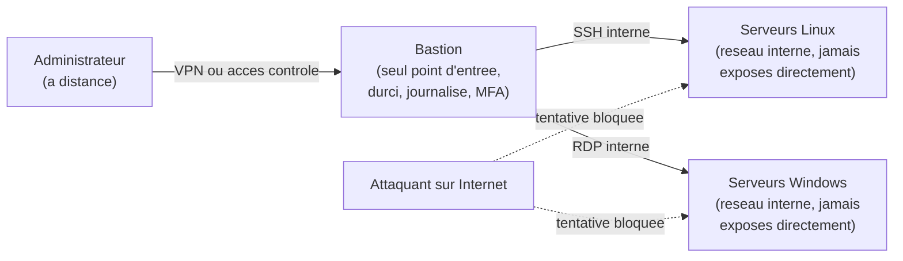

CHAPITRE 4

# Environnements d'administration : consoles et accès distant

🎯 Objectif du chapitre
Comprendre les outils avec lesquels un administrateur système travaille réellement au quotidien — RDP et SSH pour l'accès distant, Windows Admin Center et Cockpit pour la gestion centralisée — et surtout comprendre pourquoi certaines pratiques d'accès distant, en apparence pratiques, représentent l'une des plus grandes portes d'entrée pour les attaquants. À la fin de ce chapitre, tu sauras expliquer le principe du bastion, la différence entre une authentification par mot de passe et par clé, et tu seras prêt à aborder les Parties 2 et 3 de ce manuel, où ces outils seront utilisés concrètement.

🎬 Mise en situation
Quatrième semaine dans la compagnie d'assurance. Le DSI t'accorde enfin un accès aux serveurs des deux sites (Port-au-Prince et Cap-Haïtien) — tu ne mettras jamais les pieds physiquement dans la salle serveur du Cap-Haïtien, à 190 kilomètres de ton bureau. Avant de te transmettre les accès, il te montre un article qu'il garde en favori depuis trois ans : une PME haïtienne du secteur de la distribution, paralysée par un rançongiciel, dont l'enquête post-incident a révélé une cause précise — un serveur Windows avec le Bureau à distance (RDP) exposé directement sur Internet, avec un mot de passe administrateur simple, jamais changé depuis l'installation. <em>"On ne travaille jamais comme ça ici,"</em> te dit-il. <em>"Tu vas comprendre pourquoi avant même de recevoir tes accès."</em> Ce chapitre explique exactement cette différence — entre un accès distant pratique et un accès distant dangereux — avant d'aborder la moindre commande d'administration.

## 4.1 Pourquoi un administrateur système travaille rarement devant le serveur lui-même

Contrairement à l'image d'un poste de travail unique, un administrateur système gère généralement des dizaines, parfois des centaines de serveurs, souvent répartis sur plusieurs sites physiques — exactement la situation du scénario d'ouverture avec deux villes distantes de près de 200 kilomètres. Se déplacer physiquement pour chaque intervention serait non seulement impraticable, mais représenterait aussi une perte de temps considérable pour des tâches qui prennent, une fois maîtrisées, quelques minutes à distance.

💡 Analogie — la tour de contrôle aérienne
Un contrôleur aérien ne monte jamais dans chaque avion qu'il guide : il travaille entièrement à distance, via des instruments fiables (radar, radio), avec des procédures strictes qui compensent l'absence de présence physique. L'administration système à distance fonctionne sur le même principe : des outils fiables (RDP, SSH) et des procédures rigoureuses (le sujet de ce chapitre) permettent d'agir avec la même précision que si l'on était physiquement devant la machine — à condition de respecter des règles de sécurité aussi strictes que celles d'un contrôle aérien.

## 4.2 L'accès distant Windows : RDP (Remote Desktop Protocol)

**RDP** permet de se connecter à distance à l'interface graphique complète d'une machine Windows, comme si on était physiquement assis devant elle. Il écoute par défaut sur le port réseau **3389**.

🔒 Sécurité — RDP est l'un des vecteurs d'attaque les plus exploités au monde
Ce n'est pas une exagération du scénario d'ouverture : RDP exposé directement sur Internet, avec des identifiants faibles, est historiquement l'un des vecteurs d'entrée les plus documentés pour les attaques par rançongiciel, à l'échelle mondiale — les attaquants scannent en continu l'ensemble d'Internet à la recherche du port 3389 ouvert, puis tentent des connexions par force brute ou avec des identifiants déjà compromis ailleurs. <strong>Règle absolue, sans exception : un serveur RDP ne doit jamais être directement accessible depuis Internet.</strong> L'accès doit toujours transiter par un VPN ou un bastion (section 4.6).

**Deux mécanismes de protection à connaître dès ce chapitre, détaillés en pratique dans la Partie 2 :**
- **NLA** (*Network Level Authentication*) : exige une authentification avant même l'affichage de l'écran de connexion complet, réduisant la surface d'attaque exposée à un utilisateur non authentifié.
- **Verrouillage après tentatives échouées** : une politique de compte qui bloque temporairement un compte après plusieurs échecs de mot de passe, contrant les attaques par force brute.

⚠️ Un mot de passe fort ne suffit pas à lui seul
Même avec un mot de passe fort, un RDP exposé directement sur Internet reste une pratique à risque : de nouvelles vulnérabilités du protocole lui-même sont régulièrement découvertes, indépendamment de la qualité du mot de passe utilisé. La bonne pratique n'est pas "renforcer le mot de passe", mais "ne jamais exposer directement le service" — un principe repris dans le concept de bastion (section 4.6) et dans le principe Zero Trust (chapitre 26).

## 4.3 L'accès distant Linux : SSH

**SSH** (*Secure Shell*) permet de se connecter à distance à une machine Linux, principalement en ligne de commande (bien qu'une interface graphique distante reste possible via des extensions). Il écoute par défaut sur le port **22**.

📌 À retenir — authentification par clé plutôt que par mot de passe
SSH permet deux méthodes d'authentification : par mot de passe, ou par **paire de clés cryptographiques** (une clé privée gardée secrète sur ta machine, une clé publique déposée sur le serveur). La méthode par clé est très largement préférée en environnement professionnel : une clé privée correctement protégée est pratiquement impossible à deviner par force brute, contrairement à un mot de passe, même complexe. La pratique concrète de génération et de configuration de ces clés est détaillée au chapitre 20 (scripting Bash) et dans la Partie 3.

| Critère | RDP (Windows) | SSH (Linux) |
|---|---|---|
| Port par défaut | 3389 | 22 |
| Type d'accès | Interface graphique complète | Ligne de commande (principalement) |
| Authentification recommandée | Mot de passe fort + NLA + MFA | Clé cryptographique (pas de mot de passe) |
| Exposition directe sur Internet | **À proscrire absolument** | À proscrire également, sauf durcissement poussé |
| Usage typique | Administration de serveurs Windows, postes de travail à distance | Administration de serveurs Linux, automatisation (Ansible, chapitre 52) |

✅ Bonne pratique — désactiver l'authentification par mot de passe sur SSH
Une fois l'authentification par clé configurée et testée avec succès, désactiver complètement l'authentification par mot de passe sur le serveur SSH élimine la quasi-totalité des tentatives de force brute automatisées — un attaquant sans la clé privée correspondante ne peut tout simplement pas se connecter, quel que soit le nombre de tentatives.

## 4.4 Consoles de gestion centralisée côté Windows

Administrer un serveur Windows uniquement via une session RDP individuelle, machine par machine, devient vite impraticable au-delà de quelques serveurs. Windows propose plusieurs niveaux d'outils de gestion centralisée :

- **MMC** (*Microsoft Management Console*) : le cadre historique dans lequel s'insèrent des "snap-ins" spécialisés (Utilisateurs et ordinateurs Active Directory, Gestionnaire DNS, Gestionnaire DHCP — tous abordés en Partie 2). Une seule fenêtre MMC peut regrouper plusieurs snap-ins pour une vue consolidée.
- **Server Manager** (Gestionnaire de serveur) : permet de gérer plusieurs serveurs Windows depuis une seule console, d'installer des rôles et fonctionnalités à distance, sans ouvrir de session RDP individuelle sur chaque machine.
- **Windows Admin Center** : l'outil moderne de Microsoft (interface web, architecture par passerelle), qui remplace progressivement une partie des consoles historiques avec une expérience unifiée, accessible depuis un navigateur, y compris pour des serveurs Windows en mode "Core" (sans interface graphique du tout).

📷 Capture d'écran recommandée
La page d'accueil de Windows Admin Center après connexion, affichant la liste des serveurs gérés avec leurs indicateurs de santé (CPU, mémoire, disque) sous forme de tuiles — une première image utile pour visualiser la différence avec une console MMC traditionnelle, plus austère.

🚀 Performance — Windows Server Core
Une installation Windows Server en mode <strong>Core</strong> (sans interface graphique locale) consomme sensiblement moins de ressources et réduit la surface d'attaque (moins de composants installés, donc moins de vulnérabilités potentielles) qu'une installation complète avec interface graphique. Elle s'administre entièrement à distance, via PowerShell, Server Manager, ou Windows Admin Center — une pratique de plus en plus répandue en production, approfondie dans la Partie 2.

## 4.5 Consoles de gestion centralisée côté Linux : Cockpit

**Cockpit** est une console d'administration web légère pour les serveurs Linux, permettant de consulter les journaux système, gérer les services, surveiller les ressources, configurer le réseau ou le stockage, directement depuis un navigateur — sans remplacer la ligne de commande, mais en la complétant utilement pour les tâches de supervision courantes ou pour les administrateurs moins à l'aise avec le terminal pur.

💡 Cockpit n'est pas un concurrent de la ligne de commande, mais un complément
Contrairement à une idée reçue chez certains puristes Linux, utiliser Cockpit pour une tâche de supervision rapide n'est pas "moins légitime" que de passer entièrement par le terminal — c'est un choix d'efficacité, pas de compétence. La majorité des tâches d'administration Linux avancées (couvertes en Partie 3) resteront cependant réalisées en ligne de commande, notamment pour tout ce qui doit être automatisé ou scripté.

📷 Capture d'écran recommandée
Le tableau de bord principal de Cockpit sur un serveur Ubuntu Server ou Rocky Linux, montrant les graphiques d'utilisation CPU/mémoire/réseau en temps réel et le menu latéral (Services, Réseau, Comptes, Journaux, Terminal intégré).

## 4.6 Le bastion : un point d'entrée unique et surveillé

Revenons directement au scénario d'ouverture : le problème du RDP exposé n'était pas l'existence même de l'accès distant, mais son **exposition directe**. La solution standard en entreprise s'appelle un **bastion** (ou *jump host*, serveur relais) : une machine unique, durcie et étroitement surveillée, qui constitue le **seul** point d'entrée autorisé vers l'ensemble des serveurs internes.

💡 Explication du schéma
Aucun serveur interne (Windows ou Linux) n'expose directement ses ports d'administration (3389, 22) vers Internet — seul le bastion est exposé, et encore, généralement seulement via un VPN plutôt que directement. Un attaquant qui scanne Internet à la recherche du port 3389 (exactement le scénario de l'entreprise victime évoquée en ouverture) ne trouve tout simplement rien à attaquer sur les serveurs eux-mêmes. Le bastion lui-même reçoit une attention de sécurité disproportionnée par rapport à sa taille : mises à jour prioritaires, authentification multifacteur (MFA) obligatoire, journalisation exhaustive de chaque session.

🧠 À mémoriser — le principe du bastion en une phrase
Réduire la surface d'attaque exposée à Internet à un seul point, plutôt que de multiplier les portes d'entrée individuelles sur chaque serveur — un principe qui reviendra sous d'autres formes tout au long de ce manuel (segmentation réseau en Partie 11, Zero Trust au chapitre 26).

## 4.7 Bonnes pratiques transverses d'accès distant

✅ Bonnes pratiques à appliquer systématiquement
- <strong>Authentification multifacteur (MFA)</strong> sur tout accès distant administratif, sans exception, y compris vers le bastion lui-même.
- <strong>Restriction par adresse IP</strong> quand c'est possible (n'autoriser l'accès qu'à partir d'un VPN d'entreprise connu, jamais depuis "n'importe où").
- <strong>Journalisation systématique</strong> des sessions d'accès distant — qui s'est connecté, quand, depuis où — pour permettre une investigation en cas d'incident de sécurité (Partie 12).
- <strong>Déconnexion automatique après inactivité</strong>, pour limiter le risque d'une session laissée ouverte et accessible à quelqu'un d'autre.
- <strong>Comptes nominatifs</strong>, jamais de compte "admin" générique partagé entre plusieurs personnes — sans compte individuel, impossible de savoir qui a réellement fait quoi (un principe qui rejoint directement le journal des changements du chapitre 3).

## Atelier — Corriger une architecture d'accès à risque

🛠️ Atelier 4 — Redessiner l'architecture de l'entreprise victime

**Objectif** : appliquer concrètement le principe du bastion (section 4.6) pour corriger une architecture d'accès distant dangereuse — exactement le type de mission qu'un administrateur système peut recevoir après un audit de sécurité.

**Préparation** : aucune installation nécessaire, un schéma sur papier ou dans un outil de diagramme simple suffit.

**Situation donnée** : une PME dispose de 4 serveurs Windows et 3 serveurs Linux. Actuellement, chacun des 4 serveurs Windows a le port 3389 ouvert directement sur Internet (accès RDP direct), et les 3 serveurs Linux ont chacun le port 22 ouvert directement sur Internet également — exactement la configuration qui a coûté cher à l'entreprise du scénario d'ouverture.

**Étapes détaillées** :

1. Dessine (ou décris textuellement) l'architecture actuelle, avec ses 7 points d'exposition directs sur Internet.
2. Redessine une architecture corrigée en y introduisant un bastion unique, en t'inspirant du schéma de la section 4.6.
3. Liste au moins trois mesures de sécurité supplémentaires à appliquer spécifiquement sur le bastion lui-même (section 4.7).
4. Compare ta proposition à la section "Résultat attendu" ci-dessous.

**Résultat attendu** : l'architecture corrigée ne doit exposer qu'un seul point d'entrée vers Internet (le bastion, idéalement seulement via VPN plutôt que directement), les 7 serveurs internes n'étant accessibles qu'à travers ce bastion, sur le réseau interne. Les mesures de sécurité attendues sur le bastion incluent au minimum le MFA, la restriction par IP, et la journalisation exhaustive des sessions.

**Dépannage** : si tu as du mal à visualiser la différence entre "exposé directement" et "accessible via le bastion", reprends l'analogie d'un immeuble : la version actuelle équivaut à donner à chaque appartement sa propre porte donnant directement sur la rue ; la version corrigée équivaut à un hall d'entrée unique, avec un gardien (le bastion), à partir duquel on accède ensuite à chaque appartement.

## Erreurs fréquentes

⚠️ Erreur n°1 — exposer RDP ou SSH directement sur Internet "temporairement"
"Je l'ouvre juste pour ce soir, je fermerai demain" est une des promesses les plus souvent rompues du métier — et les attaquants scannent Internet en continu, pas seulement de temps en temps. Une exposition "temporaire" de quelques heures suffit largement à être détectée et exploitée. La bonne pratique reste, sans exception, de passer par un VPN ou un bastion dès la première minute.

⚠️ Erreur n°2 — réutiliser le même mot de passe entre plusieurs serveurs
Si un seul serveur est compromis et que tous partagent le même mot de passe administrateur, l'attaquant obtient immédiatement un accès à l'ensemble du parc. Chaque serveur doit avoir des identifiants distincts, gérés idéalement via un coffre-fort de mots de passe centralisé plutôt que mémorisés ou stockés en clair dans un fichier — un sujet approfondi en Partie 4 (identité) et en Partie 12 (sécurité).

⚠️ Erreur n°3 — laisser une session RDP ou SSH ouverte sans verrouillage
Une session administrative ouverte et sans surveillance, même quelques minutes (pause café, réunion imprévue), représente une fenêtre d'opportunité pour quiconque a un accès physique momentané au poste. Le verrouillage automatique après inactivité (section 4.7) protège précisément contre ce scénario, indépendamment de la qualité du mot de passe utilisé pour se reconnecter ensuite.

## Diagnostiquer un problème de connexion distante

🩺 Situation : "Je n'arrive pas à me connecter à un serveur à distance"

- **Diagnostic** : distingue d'abord trois causes possibles, dans cet ordre de vérification : un problème **réseau** (le serveur est-il joignable du tout, par exemple via un test de connectivité de base ?), un problème d'**authentification** (identifiants ou clé refusés), ou un problème de **service** (le service RDP ou SSH lui-même est-il arrêté sur le serveur ?).
- **Comment vérifier** : un problème réseau empêche généralement toute réponse, même une erreur d'authentification claire ; un problème d'authentification produit un message d'erreur explicite de refus d'identifiants ; un service arrêté produit souvent une erreur de type "connexion refusée" plutôt qu'un simple délai d'attente.
- **Résolution** : une fois la cause isolée, elle oriente directement vers le bon interlocuteur — administrateur réseau pour un problème de connectivité (chapitre 1, section 1.2), toi-même pour un problème de service ou d'authentification sur un serveur dont tu es responsable.

## En entreprise

- **Bonne pratique répandue** : les grandes organisations utilisent des solutions de gestion des accès privilégiés (*Privileged Access Management*, PAM) qui vont au-delà du simple bastion — rotation automatique des mots de passe administrateurs, enregistrement vidéo des sessions sensibles, approbation à la demande plutôt qu'un accès permanent.
- **Bonne pratique répandue** : un audit régulier de tous les ports exposés sur Internet (via un scan externe périodique) permet de détecter une exposition accidentelle — comme un pare-feu mal reconfiguré après une intervention — avant qu'un attaquant ne la découvre en premier.
- **Erreur classique observée** : une entreprise qui adopte un bastion pour ses accès "officiels", mais où un technicien ouvre malgré tout un accès RDP direct "juste pour dépanner plus vite" — la discipline de sécurité n'est aussi solide que son point le plus faible, et un seul contournement suffit à annuler tout le bénéfice du bastion.

## Entretien technique

💼 Questions fréquemment posées en entretien

**Q1. "Pourquoi ne faut-il jamais exposer RDP directement sur Internet ?"**
Réponse attendue : RDP est l'un des vecteurs d'attaque les plus exploités pour les rançongiciels, ciblé par des scans automatisés permanents sur l'ensemble d'Internet. L'accès doit toujours transiter par un VPN ou un bastion, qui réduit la surface d'attaque à un seul point fortement sécurisé plutôt que de multiplier les portes d'entrée.

**Q2. "Pourquoi l'authentification par clé est-elle préférée à l'authentification par mot de passe sur SSH ?"**
Réponse attendue : une clé cryptographique privée correctement protégée est pratiquement impossible à deviner par force brute, contrairement à un mot de passe même complexe. Une fois l'authentification par clé validée, désactiver l'authentification par mot de passe élimine la quasi-totalité des tentatives de connexion automatisées malveillantes.

**Q3. "Qu'est-ce qu'un bastion, et pourquoi une organisation en utiliserait-elle un plutôt que d'exposer chaque serveur individuellement ?"**
Réponse attendue : un bastion est un point d'entrée unique, durci et surveillé, à travers lequel transite tout accès administratif distant vers les serveurs internes — il concentre l'effort de sécurité sur un seul point au lieu de le disperser sur chaque serveur, réduisant drastiquement la surface d'attaque exposée directement sur Internet.

## Optimisation, sécurité et maintenabilité — les réflexes dès ce chapitre

🔒 Sécurité
Considère tout accès distant administratif comme un actif critique au sens du chapitre 3 : il doit être inventorié (qui a accès à quoi), documenté (comment s'y connecter en respectant les bonnes pratiques), et revu périodiquement (les accès sont-ils tous encore justifiés, ou certains devraient-ils être révoqués ?).

✅ Maintenabilité
Documente, dans le runbook ou la procédure standard correspondante (chapitre 3), la méthode exacte de connexion à chaque environnement (via quel bastion, avec quel type d'authentification) — une information qui semble évidente tant qu'on la pratique tous les jours, mais qui devient précieuse pour toute nouvelle personne rejoignant l'équipe.

🚀 Performance
Windows Admin Center et Cockpit permettent tous deux de surveiller plusieurs serveurs depuis une seule interface, réduisant le temps perdu à ouvrir des sessions individuelles pour des vérifications de routine — un gain de temps direct sur les tâches proactives évoquées au chapitre 1 (section 1.4).

## Résumé du chapitre

- L'administration système se fait très majoritairement à distance, via RDP (Windows) et SSH (Linux) — jamais en se déplaçant physiquement pour chaque intervention.
- RDP et SSH ne doivent jamais être exposés directement sur Internet : c'est l'un des vecteurs d'attaque les plus exploités au monde, notamment pour les rançongiciels.
- L'authentification par clé cryptographique est très largement préférée à l'authentification par mot de passe sur SSH.
- Windows Admin Center et Cockpit offrent des consoles de gestion centralisée modernes, complémentaires (pas substituts) à la ligne de commande et aux consoles historiques (MMC, Server Manager).
- Le principe du bastion réduit la surface d'attaque exposée à un seul point d'entrée fortement sécurisé, plutôt que de multiplier les accès directs sur chaque serveur.
- Des bonnes pratiques transverses (MFA, restriction IP, journalisation, comptes nominatifs) s'appliquent systématiquement à tout accès distant administratif.

## Quiz

📝 QCM (une seule bonne réponse par question)

1. Le port par défaut du protocole RDP est :
   - a) 22
   - b) 443
   - c) 3389
   - d) 8080

2. L'authentification SSH recommandée en environnement professionnel est :
   - a) Mot de passe simple
   - b) Mot de passe complexe changé chaque semaine
   - c) Paire de clés cryptographiques
   - d) Aucune authentification, restreinte par IP uniquement

3. Le rôle principal d'un bastion est de :
   - a) Accélérer la connexion réseau
   - b) Remplacer le besoin de mots de passe
   - c) Concentrer et sécuriser l'accès distant en un seul point d'entrée
   - d) Sauvegarder automatiquement les serveurs

**Corrigé** : 1-c, 2-c, 3-c.

📝 Vrai ou Faux

1. Exposer RDP directement sur Internet est acceptable si le mot de passe est suffisamment complexe. — **Faux** (le principe est de ne jamais l'exposer directement, indépendamment de la force du mot de passe).
2. Cockpit remplace complètement le besoin de la ligne de commande sur un serveur Linux. — **Faux** (c'est un complément, pas un remplacement).
3. Un bastion doit recevoir une attention de sécurité proportionnellement plus élevée que les autres serveurs. — **Vrai**.
4. Les comptes administratifs partagés entre plusieurs personnes facilitent la traçabilité des actions. — **Faux** (l'inverse : ils la rendent impossible, d'où la nécessité de comptes nominatifs).

📝 Questions ouvertes

1. Explique pourquoi un mot de passe fort ne suffit pas, à lui seul, à sécuriser un accès RDP exposé sur Internet.
2. Reprends le scénario d'ouverture (la PME victime de rançongiciel). Explique en quoi la mise en place d'un bastion, seule, n'aurait peut-être pas suffi si les comptes n'étaient pas nominatifs et sans MFA.

**Corrigé 1** : un mot de passe fort protège contre la devinette ou la force brute, mais pas contre les vulnérabilités du protocole RDP lui-même (régulièrement découvertes), ni contre un identifiant compromis ailleurs et réutilisé (fuite de données sur un autre service, par exemple). Le vrai problème est l'exposition directe elle-même, pas seulement la robustesse du mot de passe qui la protège.

**Corrigé 2** : un bastion réduit la surface d'attaque exposée depuis Internet, mais si l'accès au bastion lui-même repose sur un compte partagé sans MFA, un attaquant qui obtient ces identifiants (par hameçonnage, par exemple) contourne entièrement la protection du bastion. La sécurité d'ensemble dépend de la combinaison des mesures (bastion + MFA + comptes nominatifs, section 4.7), pas d'une seule mesure isolée aussi solide soit-elle.

## Exercices

📝 Exercice 4.1

Explique, en tes propres mots, pourquoi la désactivation de l'authentification par mot de passe sur un serveur SSH ne doit se faire qu'**après** avoir validé que l'authentification par clé fonctionne correctement, jamais avant ou en même temps.

**Corrigé :** Si l'authentification par clé n'est pas correctement configurée (clé publique mal déposée, permissions de fichier incorrectes) et que le mot de passe est désactivé en même temps, il devient impossible de se connecter au serveur par un moyen quelconque — y compris pour corriger l'erreur elle-même, si aucun accès physique ou de secours n'existe. Tester d'abord la connexion par clé avec succès, puis seulement ensuite désactiver le mot de passe, évite ce risque de blocage total.

📝 Exercice 4.2

Un collègue propose d'utiliser un unique compte "admin" partagé par toute l'équipe pour se connecter au bastion, "pour simplifier la gestion des accès". En 3 à 5 phrases, explique-lui pourquoi c'est une mauvaise idée, en t'appuyant sur les chapitres 3 et 4.

**Corrigé (exemple de réponse) :** Un compte partagé rend impossible de savoir qui a réellement effectué une action donnée, ce qui casse directement le journal des changements évoqué au chapitre 3 — en cas d'incident ou d'erreur, personne ne peut être identifié avec certitude. Si ce compte partagé est compromis (mot de passe deviné, phishing), c'est l'accès de toute l'équipe qui est perdu simultanément, plutôt qu'un seul compte individuel à révoquer. Enfin, quand une personne quitte l'équipe, un mot de passe partagé doit être changé pour tout le monde en même temps — alors qu'un compte nominatif se révoque individuellement, sans perturber les autres membres de l'équipe.

## Checklist de fin de chapitre

<ul class="checklist">
<li>☐ Je sais expliquer pourquoi RDP et SSH ne doivent jamais être exposés directement sur Internet.</li>
<li>☐ Je connais les ports par défaut de RDP (3389) et SSH (22).</li>
<li>☐ Je comprends pourquoi l'authentification par clé est préférée à l'authentification par mot de passe sur SSH.</li>
<li>☐ Je sais distinguer MMC, Server Manager et Windows Admin Center.</li>
<li>☐ Je comprends le rôle de Cockpit comme complément à la ligne de commande sur Linux.</li>
<li>☐ Je sais expliquer le principe du bastion et pourquoi il réduit la surface d'attaque.</li>
<li>☐ Je connais au moins 4 bonnes pratiques transverses d'accès distant (MFA, restriction IP, journalisation, comptes nominatifs).</li>
</ul>

## FAQ

<dl class="faq">
<dt>Un VPN remplace-t-il complètement le besoin d'un bastion ?</dt>
<dd>Un VPN et un bastion se complètent plutôt qu'ils ne se remplacent : le VPN sécurise la connexion réseau elle-même (chiffrement, appartenance au réseau d'entreprise), tandis que le bastion concentre et journalise spécifiquement les accès administratifs. Beaucoup d'organisations utilisent les deux ensemble, comme suggéré dans le schéma de la section 4.6.</dd>

<dt>Windows Admin Center peut-il entièrement remplacer les consoles MMC traditionnelles ?</dt>
<dd>Pas encore complètement en 2026 pour tous les scénarios avancés, mais son périmètre s'élargit régulièrement. Ce manuel couvre les deux approches dans la Partie 2, car les deux restent utiles selon le contexte et le niveau de maturité de l'infrastructure concernée.</dd>

<dt>Est-il acceptable d'utiliser un mot de passe sur SSH pour un simple serveur de test personnel, hors production ?</dt>
<dd>Le risque est objectivement moindre pour un environnement de test isolé sans donnée sensible, mais prendre l'habitude de toujours utiliser des clés, même en test, évite d'avoir à changer de réflexe le jour où ce même serveur devient, sans qu'on s'en rende toujours compte, un système plus critique qu'initialement prévu.</dd>

<dt>Comment gérer les accès distants pour des prestataires externes ou temporaires ?</dt>
<dd>Toujours via des comptes nominatifs et temporaires, avec une date d'expiration automatique et un accès strictement limité à ce qui est nécessaire (principe du moindre privilège, chapitre 1, section "Optimisation, sécurité et maintenabilité") — jamais via les mêmes comptes que l'équipe interne permanente.</dd>
</dl>

## Références et pour aller plus loin

- Microsoft Learn — Sécuriser les connexions Bureau à distance (RDP) : [https://learn.microsoft.com/fr-fr/windows-server/remote/remote-desktop-services/](https://learn.microsoft.com/fr-fr/windows-server/remote/remote-desktop-services/)
- Microsoft Learn — Vue d'ensemble de Windows Admin Center : [https://learn.microsoft.com/fr-fr/windows-server/manage/windows-admin-center/overview](https://learn.microsoft.com/fr-fr/windows-server/manage/windows-admin-center/overview)
- Documentation officielle du projet Cockpit : [https://cockpit-project.org/documentation.html](https://cockpit-project.org/documentation.html)
- OpenSSH — documentation officielle sur l'authentification par clé : [https://www.openssh.com/manual.html](https://www.openssh.com/manual.html)
- CISA (Cybersecurity and Infrastructure Security Agency) — recommandations sur l'exposition RDP : [https://www.cisa.gov](https://www.cisa.gov)

*Fin de la Partie 1. La Partie 2 commence maintenant l'administration Windows Server avancée, en partant du sujet le plus structurant de tout environnement Windows d'entreprise : l'architecture Active Directory.*
