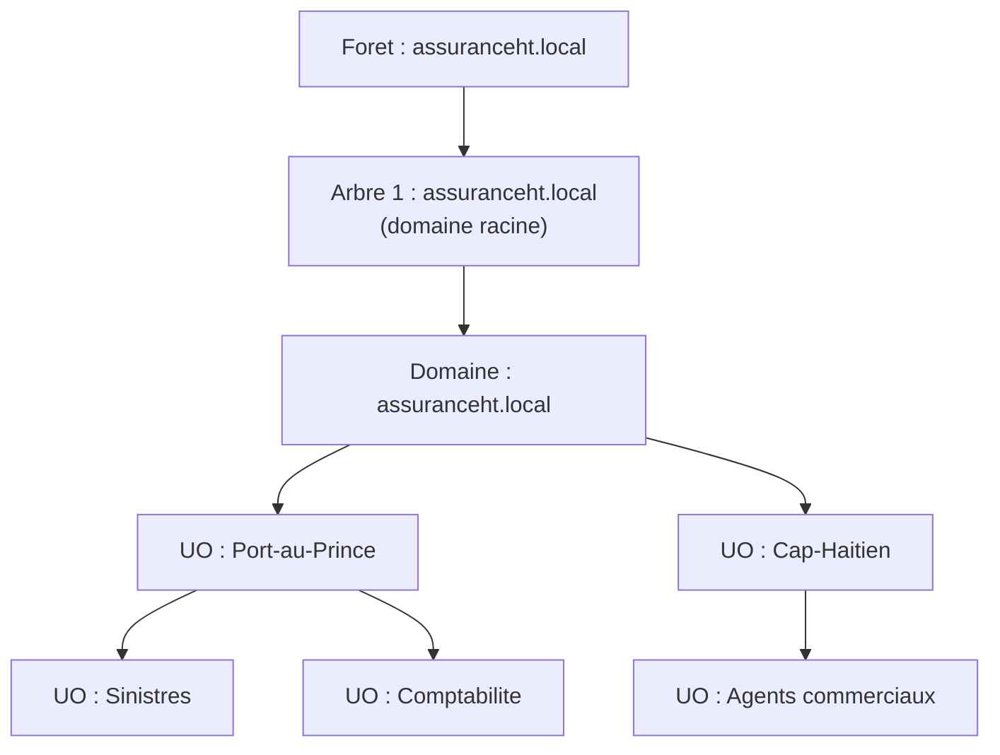
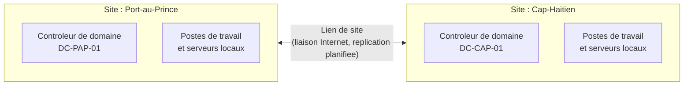

CHAPITRE 5

# Architecture Active Directory : forêts, domaines, arbres, sites, FSMO

🎯 Objectif du chapitre
Comprendre l'architecture logique et physique d'Active Directory — le service d'annuaire qui centralise l'identité et les autorisations dans la quasi-totalité des entreprises utilisant Windows. À la fin de ce chapitre, tu sauras distinguer une forêt, un domaine, une unité d'organisation et un site, expliquer à quoi servent les rôles FSMO, et concevoir sur papier une architecture Active Directory adaptée à une entreprise multi-sites comme celle de ce manuel.

🎬 Mise en situation
Cinquième semaine dans la compagnie d'assurance. Le DSI te confie un vrai projet : le bureau du Cap-Haïtien, jusqu'ici connecté au siège de Port-au-Prince uniquement par une liaison Internet standard, va bientôt doubler ses effectifs. <em>"Aujourd'hui, chaque ouverture de session à distance là-bas passe par la liaison vers Port-au-Prince pour vérifier les identifiants — c'est lent, et si la liaison tombe, plus personne ne peut se connecter au Cap-Haïtien, même pour des ressources locales."</em> Il te demande de proposer une architecture Active Directory qui corrige ce problème. Avant de dessiner quoi que ce soit, tu dois comprendre en profondeur les briques qu'Active Directory met à ta disposition — l'objet de ce chapitre.

## 5.1 Qu'est-ce qu'Active Directory

**Active Directory** (AD) est le service d'annuaire de Microsoft : une base de données centralisée qui stocke les identités (utilisateurs, ordinateurs, groupes) et applique des règles de sécurité et de configuration à l'ensemble d'un réseau Windows. C'est la brique qui répond à la question la plus fondamentale de toute organisation informatique : *qui es-tu, et à quoi as-tu le droit d'accéder ?*

💡 Analogie — le registre d'état civil d'un pays
Active Directory joue, pour un réseau d'entreprise, un rôle comparable à celui d'un registre d'état civil pour un pays : chaque "citoyen" (utilisateur, ordinateur) y est enregistré une seule fois, avec une identité vérifiable, et cette identité unique est reconnue par toutes les "administrations" (serveurs, applications) qui font confiance au même registre — plutôt que chaque service exigeant sa propre carte d'identité distincte.

📌 À retenir
Active Directory repose sur le protocole **LDAP** (approfondi au chapitre 22) pour le stockage et l'interrogation de l'annuaire, et sur **Kerberos** (chapitre 23) pour l'authentification. Ce chapitre se concentre sur l'architecture logique et physique — la façon dont les objets et les serveurs s'organisent entre eux — avant d'aborder ces protocoles sous-jacents dans la Partie 4.

## 5.2 La forêt : la frontière de sécurité ultime

La **forêt** (*forest*) est la limite de sécurité la plus large d'Active Directory — tout ce qui se trouve à l'intérieur d'une même forêt partage un schéma commun (la structure des types d'objets possibles) et un certain niveau de confiance implicite entre ses domaines.

🧠 À mémoriser
Une forêt peut contenir un ou plusieurs domaines. Une entreprise qui n'a pas de besoin particulier de séparation forte (fusion-acquisition avec des systèmes distincts, filiale totalement indépendante) n'a presque jamais besoin de plusieurs forêts — une forêt à domaine unique reste l'architecture la plus simple à administrer et la plus répandue, y compris dans de grandes entreprises.

## 5.3 Le domaine, l'arbre, et les unités d'organisation

💡 Explication du schéma
Un <strong>domaine</strong> est une limite administrative (politiques de sécurité communes, base d'annuaire partagée) — dans l'exemple, l'entreprise n'a besoin que d'un seul domaine, <code>assuranceht.local</code>. Les <strong>unités d'organisation</strong> (UO, *Organizational Units*) sont des conteneurs internes au domaine, utilisés pour organiser les objets (souvent par site géographique puis par service) et surtout pour appliquer des <strong>stratégies de groupe</strong> (GPO, chapitre 7) ciblées à un sous-ensemble précis d'utilisateurs ou d'ordinateurs.

⚠️ Erreur de compréhension fréquente : confondre UO et groupe de sécurité
Une unité d'organisation sert à **organiser et appliquer des GPO** ; un groupe de sécurité sert à **attribuer des permissions**. Un utilisateur appartient à une seule UO (son emplacement dans l'arborescence), mais peut appartenir à plusieurs groupes de sécurité simultanément. Confondre les deux est l'une des erreurs de conception les plus fréquentes chez les administrateurs débutants — approfondi au chapitre 6.

**Un arbre** (*tree*) regroupe un ou plusieurs domaines qui partagent un espace de noms DNS contigu (par exemple, `assuranceht.local` et `filiale.assuranceht.local`). Une forêt peut contenir plusieurs arbres, si les domaines qu'elle regroupe n'ont pas de nom contigu — un cas nettement plus rare en pratique que l'arbre à domaine unique du schéma ci-dessus.

## 5.4 Les sites Active Directory : la couche physique

Voici la réponse directe au problème posé dans le scénario d'ouverture. Un **site** Active Directory est une représentation de la **topologie physique réelle** du réseau — typiquement, un site correspond à un emplacement géographique relié par un lien réseau rapide et fiable (un même bâtiment ou un même campus), distinct d'un autre site relié par une liaison plus lente ou moins fiable (comme la liaison Internet entre Port-au-Prince et le Cap-Haïtien).

✅ Bonne pratique — un contrôleur de domaine par site distant
Placer un contrôleur de domaine local à chaque site géographique important résout exactement le problème du scénario d'ouverture : l'authentification des utilisateurs du Cap-Haïtien se fait localement, sans dépendre de la liaison vers Port-au-Prince, qui ne sert plus qu'à la <strong>réplication</strong> (synchronisation périodique des changements d'annuaire entre les deux contrôleurs) plutôt qu'à chaque connexion individuelle.

🚀 Performance — pourquoi les sites existent aussi pour le trafic applicatif
Au-delà de l'authentification, la configuration des sites permet à un client de préférer systématiquement les ressources (contrôleur de domaine, mais aussi serveur de fichiers, serveur d'impression) situées dans son propre site plutôt que de traverser une liaison lente pour joindre une ressource équivalente ailleurs — un mécanisme appelé "affinité de site", qui réduit la latence perçue par les utilisateurs sans qu'ils aient à faire quoi que ce soit eux-mêmes.

## 5.5 Les rôles FSMO : les opérations qui ne peuvent pas être distribuées partout

Active Directory réplique la quasi-totalité de ses données entre tous les contrôleurs de domaine, selon un modèle "multi-maître" (chaque contrôleur peut accepter des écritures). Mais certaines opérations très spécifiques ne peuvent pas être traitées simultanément par plusieurs contrôleurs sans provoquer de conflits — pour ces cas précis, Active Directory désigne des contrôleurs uniques responsables de chaque opération : les rôles **FSMO** (*Flexible Single Master Operations*).

| Rôle FSMO | Portée | Ce qu'il gère |
|---|---|---|
| **Contrôleur de schéma** | Forêt (unique) | Les modifications de la structure même de l'annuaire (types d'objets possibles) |
| **Maître de nommage de domaine** | Forêt (unique) | L'ajout ou la suppression de domaines dans la forêt |
| **Émulateur PDC** | Domaine (un par domaine) | Synchronisation de l'heure, compatibilité avec les systèmes plus anciens, traitement prioritaire des changements de mot de passe |
| **Maître RID** | Domaine (un par domaine) | Distribution des identifiants relatifs uniques (RID) utilisés pour créer chaque nouvel objet |
| **Maître d'infrastructure** | Domaine (un par domaine) | Mise à jour des références entre objets de domaines différents dans une forêt multi-domaines |

🔒 Sécurité — l'indisponibilité d'un rôle FSMO n'est pas toujours critique dans l'immédiat
Une confusion fréquente chez les débutants consiste à croire qu'une panne du contrôleur détenteur d'un rôle FSMO paralyse immédiatement tout le domaine. En réalité, la plupart des opérations quotidiennes (ouverture de session, consultation de l'annuaire) continuent de fonctionner normalement même si un rôle FSMO est temporairement indisponible — seules les opérations spécifiques à ce rôle précis sont bloquées (par exemple, impossible de créer de nouveaux objets si le maître RID reste indisponible trop longtemps, une fois le stock local de RID épuisé). Cela dit, un rôle FSMO indisponible durablement doit toujours être transféré vers un autre contrôleur, jamais ignoré.

⚠️ Transfert vs saisie de rôle : ne pas confondre
Un **transfert** de rôle FSMO est une opération planifiée et propre (l'ancien détenteur est toujours disponible et coopère). Une **saisie** (*seizure*) est une opération d'urgence, utilisée uniquement quand l'ancien détenteur a disparu définitivement (matériel détruit, par exemple) — elle comporte un risque réel de conflit si l'ancien détenteur revient en ligne par la suite. La saisie ne doit jamais être utilisée comme raccourci pour éviter un transfert propre.

## 5.6 Concevoir l'architecture du scénario d'ouverture

En appliquant les concepts de ce chapitre au besoin exprimé par le DSI, une proposition raisonnable prend forme :

- **Une seule forêt, un seul domaine** (`assuranceht.local`) — l'entreprise n'a aucun besoin de séparation forte entre ses deux sites, seulement d'une organisation physique adaptée.
- **Deux sites Active Directory** : "Port-au-Prince" et "Cap-Haïtien", chacun correspondant à la topologie réseau réelle.
- **Un contrôleur de domaine local à chaque site**, résolvant directement le problème de dépendance à la liaison Internet pour l'authentification.
- **Des unités d'organisation reflétant à la fois le site et le service** (comme dans le schéma de la section 5.3), permettant d'appliquer des GPO différenciées (chapitre 7) selon l'emplacement ou la fonction des utilisateurs.

🏢 **En entreprise — le compromis coût/résilience.** Un second contrôleur de domaine par site (soit deux par site, quatre au total) est souvent recommandé pour la tolérance de panne (chapitre 6), mais représente un coût matériel et de licence supplémentaire. Une PME peut raisonnablement démarrer avec un seul contrôleur par site et planifier l'ajout d'un second dès que la criticité du site le justifie — une décision à documenter explicitement (chapitre 3), avec le risque assumé clairement énoncé plutôt que simplement oublié.

## Atelier — Dessiner l'architecture Active Directory de l'entreprise

🛠️ Atelier 5 — Concevoir une architecture à trois sites

**Objectif** : s'entraîner à appliquer les concepts forêt/domaine/UO/site à un cas légèrement plus complexe que celui du chapitre.

**Préparation** : un outil de schéma simple ou une feuille de papier.

**Situation donnée** : l'entreprise d'assurance ouvre un troisième site, une petite agence commerciale de 8 personnes à Jacmel, reliée aux deux autres sites uniquement par liaison Internet standard, sans besoin de serveur local autre que l'authentification.

**Étapes détaillées** :

1. Décide si ce troisième site nécessite son propre contrôleur de domaine local, en t'appuyant sur la section 5.4 et sur la taille de l'agence.
2. Propose une structure d'unités d'organisation pour ce nouveau site.
3. Justifie ta décision en une ou deux phrases.

**Résultat attendu** : pour une agence de seulement 8 personnes, un contrôleur de domaine physique local est rarement justifié économiquement — l'authentification via la liaison Internet reste acceptable pour un si petit effectif, quitte à réévaluer si l'agence grandit significativement (le même raisonnement que "En entreprise" ci-dessus). Une UO "Jacmel" simple, sans sous-division supplémentaire vu la petite taille de l'équipe, suffit à ce stade — l'over-engineering d'une arborescence complexe pour 8 personnes serait disproportionné (rappel du principe directeur ITIL "se concentrer sur la valeur", chapitre 2).

**Dépannage** : si tu hésites sur la nécessité d'un contrôleur local, pose-toi la question du chapitre 1 (section "qu'est-ce qui se passe si ça ne marche pas ?") — quel est l'impact réel si la liaison Internet de Jacmel tombe pendant quelques heures pour 8 personnes, comparé à l'impact pour l'ensemble du Cap-Haïtien ?

## Erreurs fréquentes

⚠️ Erreur n°1 — créer plusieurs domaines sans raison réelle
Une architecture multi-domaines complique considérablement l'administration (réplication, relations d'approbation, GPO à dupliquer) sans bénéfice de sécurité réel dans la plupart des cas — un domaine unique avec des UO bien structurées couvre l'immense majorité des besoins, y compris pour des entreprises de plusieurs milliers d'utilisateurs.

⚠️ Erreur n°2 — négliger la configuration des sites même en environnement mono-site apparent
Même une entreprise sur un seul site géographique bénéficie d'une configuration de site correcte si son réseau interne comporte des segments à latence différente (par exemple, un site secondaire relié par une liaison plus lente au sein du même bâtiment). La configuration des sites n'est pas réservée aux grandes entreprises multi-villes.

⚠️ Erreur n°3 — utiliser une saisie de rôle FSMO comme réflexe automatique
Comme vu en section 5.5, la saisie doit rester une opération d'urgence exceptionnelle, jamais un raccourci pour éviter la procédure normale de transfert quand l'ancien détenteur est encore joignable.

## Diagnostiquer un problème lié à l'architecture Active Directory

🩺 Situation : "Les utilisateurs d'un site se connectent anormalement lentement"

- **Diagnostic** : vérifie d'abord si ce site dispose d'un contrôleur de domaine local (section 5.4). Si l'authentification traverse une liaison lente vers un autre site à chaque connexion, la lenteur est directement liée à cette architecture, pas à un dysfonctionnement.
- **Comment vérifier** : consulter la configuration des sites et services Active Directory pour confirmer quel contrôleur de domaine ce site utilise réellement (le "site" auquel un sous-réseau est rattaché peut être mal configuré, provoquant un site utilisant à tort un contrôleur distant).
- **Résolution** : corriger le rattachement du sous-réseau au bon site si c'est une erreur de configuration, ou envisager l'ajout d'un contrôleur local si le site n'en a structurellement jamais eu et que sa taille le justifie désormais.

## En entreprise

- **Bonne pratique répandue** : documenter l'architecture Active Directory (forêt, domaines, sites, emplacement des rôles FSMO) dans un schéma tenu à jour, directement lié au processus de changement du chapitre 2 — une modification de cette architecture est presque toujours un changement normal, jamais standard, vu son impact potentiel large.
- **Bonne pratique répandue** : connaître à tout moment quel contrôleur détient chaque rôle FSMO, sans avoir à le rechercher en urgence pendant un incident.
- **Erreur classique observée** : une architecture Active Directory héritée d'une croissance organique non planifiée (domaines ou sites créés au fil du temps sans vision d'ensemble), rendue coûteuse à corriger une fois en place — un argument de plus pour concevoir dès le départ, même dans une petite structure appelée à grandir.

## Entretien technique

💼 Questions fréquemment posées en entretien

**Q1. "Quelle est la différence entre un domaine et une unité d'organisation ?"**
Réponse attendue : un domaine est une frontière administrative et de réplication ; une unité d'organisation est un conteneur interne à un domaine, utilisé pour organiser les objets et cibler l'application de GPO — une distinction fréquemment confondue par les débutants (section 5.3).

**Q2. "À quoi servent les sites Active Directory ?"**
Réponse attendue : à représenter la topologie physique réelle du réseau, pour optimiser l'authentification et l'accès aux ressources (préférence pour les ressources locales) et planifier la réplication entre contrôleurs de domaine distants de façon adaptée à la qualité des liens réseau réels.

**Q3. "Que se passe-t-il si le contrôleur détenant le rôle d'émulateur PDC tombe en panne ?"**
Réponse attendue : les opérations quotidiennes de base continuent de fonctionner sur les autres contrôleurs, mais certaines fonctions spécifiques (synchronisation de l'heure, traitement prioritaire de certains changements de mot de passe, compatibilité avec des systèmes plus anciens) sont affectées jusqu'à ce que le rôle soit transféré à un autre contrôleur disponible.

## Optimisation, sécurité et maintenabilité — les réflexes dès ce chapitre

🔒 Sécurité
Les contrôleurs de domaine sont parmi les serveurs les plus critiques de toute infrastructure Windows — ils doivent bénéficier d'un durcissement de sécurité renforcé, d'un accès restreint au strict nécessaire, et ne jamais héberger d'autres rôles non liés à l'annuaire (serveur web, partage de fichiers généraliste) qui élargiraient inutilement leur surface d'attaque.

✅ Maintenabilité
Nomme les domaines, sites et unités d'organisation selon une convention claire et documentée dès la conception initiale (chapitre 3) — renommer une structure Active Directory établie, une fois des centaines d'objets et de GPO qui en dépendent, est une opération beaucoup plus risquée et coûteuse que de bien nommer dès le départ.

🚀 Performance
Une architecture de sites correctement configurée réduit directement la charge sur les liaisons inter-sites, en limitant la réplication et le trafic d'authentification aux fenêtres et volumes réellement nécessaires — un gain particulièrement sensible sur des liaisons Internet standards comme celle entre Port-au-Prince et le Cap-Haïtien.

## Résumé du chapitre

- Active Directory centralise l'identité et les autorisations d'un réseau Windows, comparable à un registre d'état civil pour une organisation.
- La forêt est la limite de sécurité la plus large ; un domaine unique par forêt couvre la grande majorité des besoins réels.
- Les unités d'organisation structurent l'annuaire et ciblent l'application de GPO ; les groupes de sécurité attribuent des permissions — deux rôles distincts, souvent confondus.
- Les sites Active Directory représentent la topologie physique réelle du réseau, et un contrôleur de domaine local par site important évite la dépendance aux liaisons distantes pour l'authentification.
- Les rôles FSMO gèrent des opérations qui ne peuvent pas être distribuées à tous les contrôleurs simultanément ; leur indisponibilité temporaire n'est presque jamais bloquante immédiatement, mais doit toujours être corrigée.

## Quiz

📝 QCM (une seule bonne réponse par question)

1. La frontière de sécurité la plus large dans Active Directory est :
   - a) L'unité d'organisation
   - b) Le domaine
   - c) La forêt
   - d) Le site

2. Un site Active Directory représente principalement :
   - a) Une organisation logique des utilisateurs par service
   - b) La topologie physique réelle du réseau
   - c) Un niveau de sécurité supplémentaire
   - d) Un groupe de sécurité étendu

3. Une saisie (*seizure*) de rôle FSMO doit être utilisée :
   - a) Systématiquement, plutôt qu'un transfert normal
   - b) Uniquement en cas de disparition définitive de l'ancien détenteur
   - c) Chaque fois qu'un contrôleur redémarre
   - d) Jamais, sous aucune circonstance

**Corrigé** : 1-c, 2-b, 3-b.

📝 Vrai ou Faux

1. Une entreprise a presque toujours besoin de plusieurs domaines dès qu'elle a plusieurs sites géographiques. — **Faux** (les sites, pas les domaines, gèrent la dimension géographique).
2. Une unité d'organisation et un groupe de sécurité servent exactement le même objectif. — **Faux** (UO pour l'organisation et les GPO, groupe pour les permissions).
3. L'indisponibilité temporaire d'un rôle FSMO bloque immédiatement toutes les ouvertures de session du domaine. — **Faux** (la plupart des opérations quotidiennes continuent normalement).
4. Un contrôleur de domaine local à chaque site important réduit la dépendance à la liaison réseau inter-sites pour l'authentification. — **Vrai**.

📝 Questions ouvertes

1. Explique pourquoi l'entreprise du scénario d'ouverture n'a probablement pas besoin de plusieurs domaines, malgré ses deux sites géographiques distincts.
2. Un collègue propose de créer une unité d'organisation "Administrateurs" contenant à la fois les comptes administrateurs et les permissions qui leur sont accordées. Explique-lui pourquoi cette confusion peut poser un problème de conception, à partir de la section 5.3.

**Corrigé 1** : les deux sites n'ont besoin que d'une séparation physique (gérée par les sites Active Directory, section 5.4), pas d'une séparation administrative ou de sécurité forte (qui justifierait des domaines distincts). Un domaine unique avec deux sites et des UO reflétant chaque emplacement couvre entièrement le besoin exprimé, avec une administration bien plus simple qu'une architecture multi-domaines.

**Corrigé 2** : une unité d'organisation regroupe des objets pour l'organisation de l'annuaire et l'application de GPO ; elle ne porte pas elle-même de permissions d'accès à des ressources. Les permissions doivent être gérées via des groupes de sécurité distincts (potentiellement nommés séparément, comme "GS-Admins-Serveurs"), auxquels les comptes administrateurs sont ajoutés en tant que membres — l'UO organise "où se trouve l'objet dans l'arborescence", le groupe détermine "à quoi cet objet a accès".

## Exercices

📝 Exercice 5.1

Liste les cinq rôles FSMO et indique, pour chacun, s'il existe une seule fois par forêt ou une fois par domaine.

**Corrigé :** Contrôleur de schéma (forêt), Maître de nommage de domaine (forêt), Émulateur PDC (domaine), Maître RID (domaine), Maître d'infrastructure (domaine) — voir le tableau de la section 5.5.

📝 Exercice 5.2

Reprends l'atelier de ce chapitre (l'agence de Jacmel). Rédige, en 4 à 6 phrases, les arguments que tu présenterais au DSI si l'agence de Jacmel passait de 8 à 60 employés en un an, pour justifier une réévaluation de l'architecture.

**Corrigé (exemple de réponse) :** Avec 60 employés, l'impact d'une panne de liaison Internet devient bien plus significatif qu'avec 8 personnes — un site entier de cette taille sans authentification locale représenterait un risque opérationnel comparable à celui du Cap-Haïtien avant la correction proposée dans ce chapitre. Je recommanderais l'ajout d'un contrôleur de domaine local à Jacmel, avec la création d'un site Active Directory dédié pour optimiser l'authentification et l'accès aux ressources locales. Cette décision devrait suivre le processus de changement normal du chapitre 2, avec une évaluation du coût matériel face au risque opérationnel désormais bien plus élevé qu'à l'ouverture initiale de l'agence.

## Checklist de fin de chapitre

<ul class="checklist">
<li>☐ Je sais distinguer forêt, arbre, domaine et unité d'organisation.</li>
<li>☐ Je comprends la différence entre une UO (organisation/GPO) et un groupe de sécurité (permissions).</li>
<li>☐ Je sais expliquer à quoi servent les sites Active Directory et pourquoi ils comptent pour la performance.</li>
<li>☐ Je connais les cinq rôles FSMO et leur portée (forêt ou domaine).</li>
<li>☐ Je comprends la différence entre un transfert et une saisie de rôle FSMO.</li>
<li>☐ Je sais concevoir sur papier une architecture Active Directory simple pour une entreprise multi-sites.</li>
</ul>

## FAQ

<dl class="faq">
<dt>Faut-il toujours créer plusieurs domaines pour séparer des services différents dans une même entreprise ?</dt>
<dd>Non, presque jamais. Les unités d'organisation et les groupes de sécurité, combinés à une bonne stratégie de GPO (chapitre 7), suffisent à séparer des services différents dans l'immense majorité des cas — les domaines multiples se justifient surtout pour des besoins de séparation de sécurité très forts ou des contraintes réglementaires spécifiques.</dd>

<dt>Un petit environnement de test à la maison a-t-il besoin d'une architecture de sites ?</dt>
<dd>Non, un environnement de laboratoire personnel mono-site n'a généralement aucun besoin réel de configuration de sites avancée — mais comprendre le concept reste utile pour aborder sereinement un environnement professionnel multi-sites plus tard.</dd>

<dt>Combien de contrôleurs de domaine faut-il au minimum pour un domaine en production ?</dt>
<dd>Au moins deux, pour la tolérance de panne — un seul contrôleur de domaine en production représente un point de défaillance unique critique, un risque similaire au "bus factor" de 1 évoqué au chapitre 1, mais appliqué à l'infrastructure plutôt qu'aux personnes.</dd>

<dt>Peut-on renommer un domaine Active Directory existant sans tout reconstruire ?</dt>
<dd>C'est techniquement possible avec des outils dédiés, mais c'est une opération lourde, risquée et rarement entreprise à la légère en production — une raison de plus pour bien choisir la convention de nommage dès la conception initiale (section "Maintenabilité" de ce chapitre).</dd>
</dl>

## Références et pour aller plus loin

- Microsoft Learn — Vue d'ensemble de la structure logique d'Active Directory : [https://learn.microsoft.com/fr-fr/windows-server/identity/ad-ds/plan/](https://learn.microsoft.com/fr-fr/windows-server/identity/ad-ds/plan/)
- Microsoft Learn — Rôles FSMO (Flexible Single Master Operations) : [https://learn.microsoft.com/fr-fr/troubleshoot/windows-server/identity/fsmo-roles](https://learn.microsoft.com/fr-fr/troubleshoot/windows-server/identity/fsmo-roles)
- Microsoft Learn — Sites et services Active Directory : [https://learn.microsoft.com/fr-fr/windows-server/identity/ad-ds/plan/](https://learn.microsoft.com/fr-fr/windows-server/identity/ad-ds/plan/)

*Chapitre suivant : réplication Active Directory et tolérance de panne — comment plusieurs contrôleurs de domaine restent synchronisés, et ce qui se passe concrètement quand un lien réseau entre deux sites tombe.*
