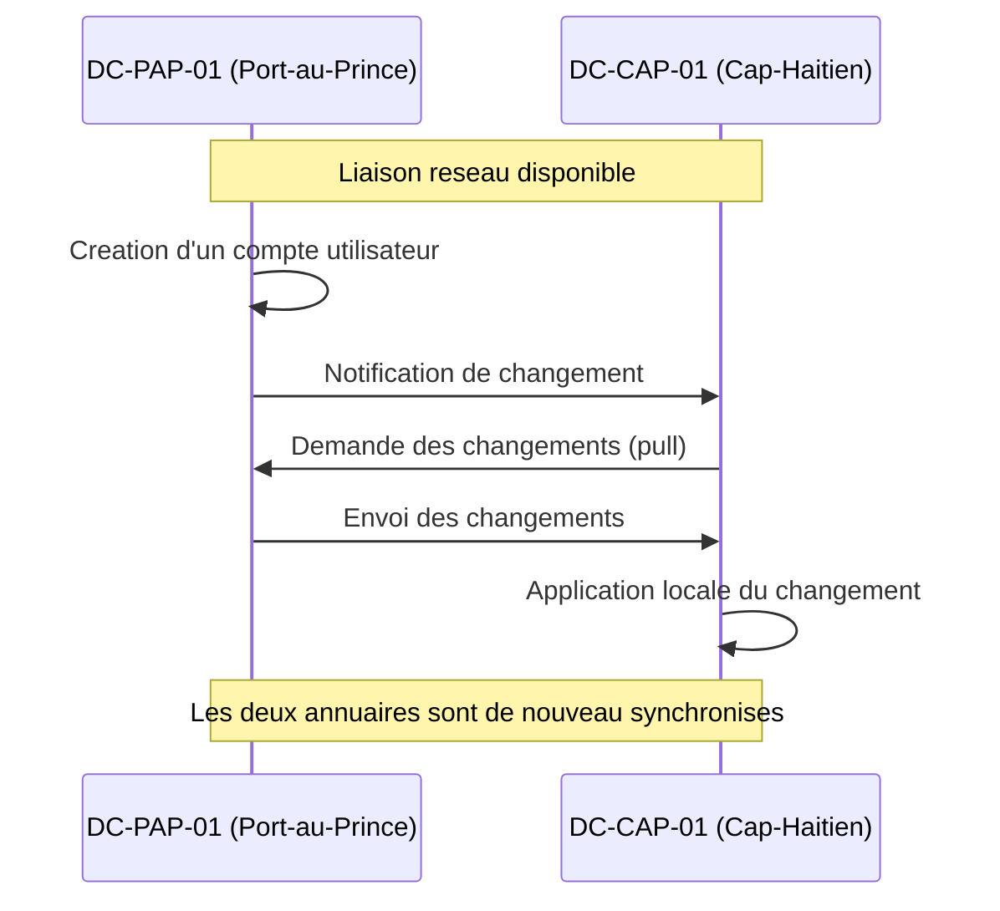
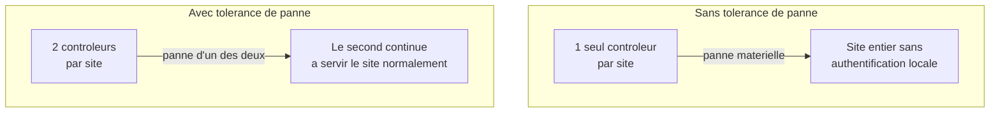

<div class="chapitre-titre-num">CHAPITRE 6</div>

# Réplication Active Directory et tolérance de panne

<div class="encadre objectif">
<span class="encadre-titre">🎯 Objectif du chapitre</span>
Comprendre comment plusieurs contrôleurs de domaine restent synchronisés entre eux, et surtout ce qui se passe concrètement — pour de vrai, pas en théorie — quand un lien réseau entre deux sites tombe, ou quand un contrôleur de domaine devient indisponible. À la fin de ce chapitre, tu sauras expliquer le modèle multi-maître, diagnostiquer un problème de réplication basique, et concevoir une architecture de contrôleurs de domaine réellement tolérante aux pannes plutôt que résiliente uniquement sur le papier.
</div>

<div class="encadre scenario">
<span class="encadre-titre">🎬 Mise en situation</span>
Sixième semaine. L'architecture à deux sites du chapitre précédent a été validée et mise en œuvre : chaque site a désormais son propre contrôleur de domaine. Un mardi matin, la liaison Internet du Cap-Haïtien tombe pendant six heures — une coupure malheureusement fréquente dans certaines zones du pays. Le DSI t'appelle, inquiet : <em>"Les gens du Cap peuvent toujours travailler et se connecter, c'est déjà bien. Mais qu'est-ce qui se passe si, PENDANT cette coupure, quelqu'un change son mot de passe là-bas ? Et qu'est-ce qui se passe si un administrateur crée un compte à Port-au-Prince en même temps qu'un autre crée un compte avec le même nom au Cap-Haïtien, sans le savoir ?"</em> Ce sont exactement les questions auxquelles la réplication Active Directory — et la gestion de ses conflits — doit répondre. Ce chapitre y répond en détail.
</div>

## 6.1 Le modèle multi-maître : chaque contrôleur peut écrire

Contrairement à certains systèmes qui désignent un serveur "maître" unique acceptant les écritures (avec des serveurs "esclaves" en lecture seule), Active Directory utilise un modèle **multi-maître** : chaque contrôleur de domaine peut accepter des écritures (création de compte, changement de mot de passe, modification de groupe) de façon totalement autonome, puis propage ce changement aux autres contrôleurs par réplication.

<div class="encadre astuce">
<span class="encadre-titre">💡 Analogie — plusieurs guichets d'une même administration</span>
Imagine une administration publique avec plusieurs guichets dans différentes villes, chacun capable d'enregistrer un changement d'état civil directement, sans devoir d'abord téléphoner à un guichet central pour validation. Chaque guichet transmet ensuite ses changements aux autres guichets, périodiquement. C'est exactement le modèle multi-maître : aucun contrôleur de domaine n'a besoin d'attendre la permission d'un autre pour accepter une écriture — ce qui explique directement pourquoi le contrôleur du Cap-Haïtien continue de fonctionner normalement pendant la coupure du scénario d'ouverture.
</div>

<div class="encadre retenir">
<span class="encadre-titre">📌 À retenir</span>
Le modèle multi-maître explique pourquoi une panne de liaison réseau entre deux sites (chapitre 5) n'empêche PAS les utilisateurs de chaque site de continuer à s'authentifier et à travailler localement — chaque contrôleur reste pleinement fonctionnel de façon autonome. Ce que la coupure empêche, c'est uniquement l'échange des changements récents entre les deux sites, le temps que la liaison soit rétablie.
</div>

## 6.2 Comment la réplication fonctionne concrètement



<div class="encadre astuce">
<span class="encadre-titre">💡 Explication du schéma</span>
Active Directory utilise un modèle de réplication en **"pull"** (tirer) plutôt qu'en "push" (pousser) : un contrôleur notifie ses partenaires qu'un changement est disponible, mais ce sont les contrôleurs partenaires qui viennent activement chercher (*pull*) ces changements, selon leur propre planification. Cette conception réduit le risque de surcharge d'un contrôleur qui devrait "pousser" ses changements vers de nombreux partenaires simultanément.
</div>

**Deux contextes de réplication distincts, avec des comportements différents :**
- **Au sein d'un même site** : la réplication est quasiment immédiate (généralement déclenchée par une notification dans les secondes qui suivent un changement), car le lien réseau local est considéré fiable et rapide.
- **Entre sites différents** (comme Port-au-Prince et le Cap-Haïtien) : la réplication suit une **planification** définie par l'administrateur (par exemple, toutes les 15 minutes ou toutes les heures), pour ne pas saturer une liaison inter-sites plus coûteuse ou moins fiable — directement lié à la configuration des liens de site du chapitre 5.

<div class="encadre performance">
<span class="encadre-titre">🚀 Performance — équilibrer fraîcheur et charge réseau</span>
Une fréquence de réplication inter-sites trop élevée peut saturer une liaison Internet standard comme celle du scénario d'ouverture ; une fréquence trop basse retarde la propagation de changements importants (comme la désactivation d'urgence d'un compte compromis). La bonne pratique consiste à ajuster cette fréquence selon la criticité réelle du lien et le volume de changements attendu — pas à laisser systématiquement la valeur par défaut sans y réfléchir.
</div>

## 6.3 Répondre à la première question du DSI : le changement de mot de passe pendant la coupure

Reprenons la première inquiétude du scénario d'ouverture. Un utilisateur au Cap-Haïtien change son mot de passe pendant que la liaison est coupée :

1. Le contrôleur local (DC-CAP-01) accepte le changement immédiatement — le modèle multi-maître le permet sans contact avec Port-au-Prince.
2. L'utilisateur peut continuer à s'authentifier localement avec son **nouveau** mot de passe, sans interruption.
3. Dès que la liaison est rétablie, ce changement se réplique vers DC-PAP-01, comme n'importe quel autre changement.
4. **Entre-temps**, si cet utilisateur tente de s'authentifier auprès d'une ressource qui interroge spécifiquement DC-PAP-01 (par exemple, s'il se déplace physiquement à Port-au-Prince pendant la coupure), l'ancien mot de passe serait encore reconnu là-bas jusqu'à la réplication — un décalage temporaire, normal et attendu dans ce modèle.

<div class="encadre bonne-pratique">
<span class="encadre-titre">✅ Bonne pratique — le rôle particulier de l'émulateur PDC pour les mots de passe</span>
Rappel du chapitre 5 : l'émulateur PDC (un des cinq rôles FSMO) reçoit un traitement prioritaire pour les changements de mot de passe récents, précisément pour réduire ce type de décalage. Un contrôleur qui refuse une authentification peut, avant de la rejeter définitivement, vérifier auprès de l'émulateur PDC si un changement de mot de passe plus récent existe ailleurs — un mécanisme qui limite l'impact pratique du délai de réplication normal.
</div>

## 6.4 Répondre à la seconde question du DSI : les conflits de création simultanée

La seconde inquiétude — deux comptes créés avec le même nom sur deux contrôleurs différents pendant une coupure — illustre un vrai risque du modèle multi-maître : le **conflit de réplication**.

<div class="encadre attention">
<span class="encadre-titre">⚠️ Comment Active Directory résout un conflit de nommage</span>
Si deux objets portant le même nom sont créés indépendamment sur deux contrôleurs différents pendant une période de déconnexion, Active Directory les détecte au moment de la réplication (via un identifiant unique interne, différent du nom affiché) et les traite comme des objets distincts en conflit. La résolution automatique conserve généralement l'objet créé en dernier sous le nom original, et **renomme automatiquement** l'autre objet (en lui ajoutant un suffixe, par exemple <code>CNF:</code> suivi d'un identifiant) plutôt que de fusionner ou de supprimer silencieusement l'un des deux.
</div>

<div class="encadre securite">
<span class="encadre-titre">🔒 Sécurité — pourquoi un conflit non surveillé est un risque</span>
Un objet renommé automatiquement suite à un conflit peut passer inaperçu si personne ne surveille les journaux de réplication — un compte "en double" mal nommé peut soit perturber un utilisateur légitime, soit, dans un scénario plus grave, créer une confusion exploitable si un attaquant provoque volontairement ce type de situation. La supervision des événements de réplication (approfondie en Partie 10) doit inclure une alerte sur ce type de conflit, pas seulement sur les pannes complètes.
</div>

<div class="encadre bonne-pratique">
<span class="encadre-titre">✅ Bonne pratique — réduire le risque de conflit en amont</span>
Le risque de conflit de nommage augmente avec la fréquence des créations simultanées sur des sites différents pendant une déconnexion prolongée. Une convention de nommage qui inclut un préfixe par site (par exemple, un identifiant de site dans un champ dédié, pas nécessairement dans le nom affiché lui-même) et une procédure centralisée de création de comptes (plutôt que plusieurs administrateurs créant des comptes de façon totalement indépendante) réduisent ce risque sans l'éliminer complètement — le vrai remède reste de limiter la durée des coupures réseau elles-mêmes.
</div>

## 6.5 La tolérance de panne : au-delà de la réplication

La réplication résout la synchronisation des données, mais la **disponibilité** du service d'authentification lui-même dépend directement du nombre de contrôleurs de domaine réellement disponibles à tout moment.



<div class="encadre memoriser">
<span class="encadre-titre">🧠 À mémoriser</span>
Un seul contrôleur de domaine par site (l'architecture minimale du chapitre 5) résout le problème de latence réseau, mais reste un point de défaillance unique en cas de panne matérielle de ce contrôleur précis — indépendamment de l'état de la liaison réseau. Deux contrôleurs par site (ou au minimum, un plan clair de reprise en cas de panne, avec un délai acceptable documenté) sont nécessaires pour une vraie tolérance de panne, pas seulement une tolérance à la latence.
</div>

🏢 **Le compromis budgétaire, encore une fois.** Cette recommandation rejoint directement l'encadré "En entreprise" du chapitre 5 : le choix entre un ou deux contrôleurs par site est un vrai compromis coût/risque, pas une réponse universelle. Une agence de 8 personnes (comme Jacmel dans l'atelier du chapitre précédent) n'a probablement pas besoin de deux contrôleurs locaux ; un site de plusieurs centaines d'utilisateurs comme le Cap-Haïtien, si.

## 6.6 Diagnostiquer un problème de réplication

Un outil central pour surveiller la santé de la réplication est la commande `repadmin` (incluse aux outils d'administration Active Directory), qui permet notamment de vérifier depuis quand une réplication n'a pas eu lieu avec succès entre deux contrôleurs donnés.

```
# Verifier l'etat de replication de tous les partenaires d'un controleur
repadmin /showrepl DC-PAP-01

# Forcer une tentative de replication immediate entre deux controleurs
repadmin /replicate DC-CAP-01 DC-PAP-01 "DC=assuranceht,DC=local"
```

<div class="encadre attention">
<span class="encadre-titre">⚠️ Un échec de réplication qui persiste devient rapidement critique</span>
Une réplication en échec depuis quelques heures (comme dans le scénario d'ouverture) est normale et sans gravité immédiate. Mais Active Directory impose une limite stricte : par défaut, un contrôleur qui n'a pas répliqué avec succès depuis plus de <strong>60 jours</strong> (la durée de vie par défaut des objets "tombstone", liés à la suppression d'objets) est considéré en échec de réplication irrémédiable, et doit être retiré puis reconstruit entièrement — jamais simplement laissé reconnecté tel quel. Un délai de coupure de quelques heures, comme dans le scénario d'ouverture, est donc totalement anodin ; ce seuil ne concerne que des pannes exceptionnellement longues.
</div>

## Atelier — Répondre aux questions du DSI par écrit

<div class="encadre exercice">
<span class="encadre-titre">🛠️ Atelier 6 — Rédiger une note explicative</span>

**Objectif** : synthétiser les concepts de ce chapitre dans une explication claire, destinée à un responsable non technique — une compétence de communication directement liée au chapitre 1 (section "compétences humaines").

**Préparation** : aucune installation nécessaire.

**Étapes détaillées** :

1. Rédige une note d'une dizaine de lignes maximum, en français simple, répondant aux deux questions du DSI posées dans le scénario d'ouverture (changement de mot de passe pendant une coupure, création simultanée de comptes en conflit).
2. Évite tout jargon non expliqué (pas de "FSMO", "multi-maître" ou "repadmin" sans une explication en une phrase si tu les utilises).
3. Termine ta note par une recommandation concrète pour réduire le risque de conflit à l'avenir.
4. Compare ta note à la section "Résultat attendu" ci-dessous.

**Résultat attendu** : une bonne note explique que chaque site continue de fonctionner de façon autonome pendant une coupure (sections 6.1 et 6.3), que les changements se synchronisent automatiquement dès le retour de la liaison, qu'un conflit de nommage est rare mais possible et automatiquement détecté et corrigé par le système sans perte de données (section 6.4), et recommande une procédure de création de comptes centralisée pour réduire encore ce risque déjà faible.

**Dépannage** : si ta note dépasse largement dix lignes ou reste truffée de jargon, relis-la en te demandant si un directeur financier (comme dans l'exercice 3.2 du chapitre 3) la comprendrait sans devoir te reposer de questions.
</div>

## Erreurs fréquentes

<div class="encadre attention">
<span class="encadre-titre">⚠️ Erreur n°1 — croire qu'une coupure réseau bloque l'authentification locale</span>
C'est exactement la confusion du DSI au début de ce chapitre. Le modèle multi-maître garantit que chaque site continue de fonctionner localement pendant une coupure — la coupure retarde uniquement la synchronisation entre sites, elle ne bloque pas le travail local.
</div>

<div class="encadre attention">
<span class="encadre-titre">⚠️ Erreur n°2 — ignorer les alertes de réplication tant qu'aucun incident visible ne survient</span>
Un échec de réplication silencieux peut s'accumuler pendant des semaines sans symptôme visible pour les utilisateurs (grâce, justement, au modèle multi-maître qui masque le problème localement) — jusqu'à ce que la limite des 60 jours (section 6.6) transforme un problème mineur en reconstruction complète d'un contrôleur. La supervision proactive (chapitre 1, section 1.4) s'applique directement ici.
</div>

<div class="encadre attention">
<span class="encadre-titre">⚠️ Erreur n°3 — n'avoir qu'un seul contrôleur de domaine par site critique</span>
Comme vu en section 6.5, cette architecture résout la latence mais pas la tolérance de panne matérielle — une confusion fréquente entre les deux problèmes, pourtant distincts.
</div>

## Diagnostiquer un problème de réplication

<div class="encadre attention">
<span class="encadre-titre">🩺 Situation : "Un changement effectué sur un site n'apparaît pas encore sur l'autre"</span>

- **Diagnostic** : vérifie d'abord depuis combien de temps ce changement a été effectué, et compare ce délai à la fréquence de réplication planifiée entre les deux sites (section 6.2) — un délai inférieur à la fréquence planifiée est normal, pas un dysfonctionnement.
- **Comment vérifier** : utilise `repadmin /showrepl` (section 6.6) pour confirmer l'heure de la dernière réplication réussie entre les deux contrôleurs concernés.
- **Résolution** : si le délai dépasse largement la planification normale, force une réplication manuelle avec `repadmin /replicate` pour confirmer si le problème est temporaire (résolu par la tentative forcée) ou persistant (nécessitant une investigation plus poussée, par exemple un problème réseau sous-jacent à signaler à l'administrateur réseau, chapitre 1 section 1.2).
</div>

## En entreprise

- **Bonne pratique répandue** : surveiller activement la santé de la réplication via des outils dédiés (approfondi en Partie 10), plutôt que d'attendre qu'un symptôme visible signale un problème déjà ancien.
- **Bonne pratique répandue** : documenter la fréquence de réplication choisie pour chaque lien de site, et la raison de ce choix (chapitre 3) — une valeur laissée par défaut sans réflexion explicite est un signe de configuration non maîtrisée.
- **Erreur classique observée** : une organisation qui découvre l'existence de conflits de réplication accumulés uniquement lors d'un audit de sécurité, faute d'alerte automatisée configurée en amont.

## Entretien technique

<div class="encadre exercice">
<span class="encadre-titre">💼 Questions fréquemment posées en entretien</span>

**Q1. "Que se passe-t-il si le lien réseau entre deux sites Active Directory tombe pendant plusieurs heures ?"**
Réponse attendue : chaque site continue de fonctionner normalement en local grâce au modèle multi-maître, l'authentification et les opérations quotidiennes ne sont pas interrompues. Seule la synchronisation des changements entre sites est retardée, et reprend automatiquement dès que la liaison est rétablie, sans action manuelle nécessaire dans la majorité des cas.

**Q2. "Comment Active Directory gère-t-il un conflit de création simultanée du même nom d'objet sur deux contrôleurs différents ?"**
Réponse attendue : le conflit est détecté au moment de la réplication via un identifiant unique interne ; l'un des deux objets est automatiquement renommé (jamais fusionné ou supprimé silencieusement), permettant à un administrateur de repérer et corriger la situation après coup.

**Q3. "Pourquoi un seul contrôleur de domaine par site ne suffit-il pas à garantir une vraie tolérance de panne ?"**
Réponse attendue : parce qu'il résout uniquement le problème de latence réseau (authentification locale plutôt que distante), mais reste un point de défaillance unique en cas de panne matérielle propre à ce contrôleur — un second contrôleur par site critique est nécessaire pour couvrir ce risque distinct.
</div>

## Optimisation, sécurité et maintenabilité — les réflexes dès ce chapitre

<div class="encadre securite">
<span class="encadre-titre">🔒 Sécurité</span>
Traite tout conflit de réplication détecté comme un événement à investiguer, pas seulement à corriger silencieusement — un volume anormalement élevé de conflits peut être le signe d'un problème réseau récurrent non résolu, ou plus rarement d'une activité suspecte à corréler avec d'autres journaux de sécurité (Partie 12).
</div>

<div class="encadre bonne-pratique">
<span class="encadre-titre">✅ Maintenabilité</span>
Documente, pour chaque site, le nombre de contrôleurs de domaine, la fréquence de réplication configurée avec les autres sites, et la procédure à suivre en cas d'échec de réplication prolongé — exactement le type de runbook décrit au chapitre 3.
</div>

<div class="encadre performance">
<span class="encadre-titre">🚀 Performance</span>
Une réplication correctement dimensionnée (ni trop fréquente pour une liaison faible, ni trop rare pour les besoins de fraîcheur réels) réduit à la fois la charge réseau inutile et le risque de conflits liés à de longues périodes de désynchronisation — un équilibre à revoir périodiquement à mesure que l'organisation grandit, pas une configuration figée une fois pour toutes.
</div>

## Résumé du chapitre

- Active Directory utilise un modèle multi-maître : chaque contrôleur de domaine accepte des écritures de façon autonome, sans dépendre d'un serveur central.
- La réplication au sein d'un même site est quasi immédiate ; entre sites différents, elle suit une planification adaptée à la qualité de la liaison réseau.
- Une coupure réseau entre deux sites n'empêche pas l'authentification locale de continuer normalement — elle retarde seulement la synchronisation des changements.
- Un conflit de création simultanée du même nom d'objet est automatiquement détecté et résolu par renommage, jamais par perte silencieuse de données.
- La tolérance de panne matérielle (plusieurs contrôleurs par site) est un besoin distinct de la tolérance à la latence réseau (un contrôleur local par site) — les deux problèmes sont souvent confondus.
- `repadmin` permet de diagnostiquer et de forcer manuellement une réplication en cas de besoin.

## Quiz

<div class="encadre exercice">
<span class="encadre-titre">📝 QCM (une seule bonne réponse par question)</span>

1. Le modèle de réplication d'Active Directory est :
   - a) Maître-esclave, un seul contrôleur accepte les écritures
   - b) Multi-maître, chaque contrôleur accepte les écritures
   - c) Sans réplication, chaque contrôleur est indépendant
   - d) Basé uniquement sur une synchronisation manuelle

2. Que se passe-t-il si deux objets portant le même nom sont créés sur deux contrôleurs différents pendant une coupure réseau ?
   - a) Le second écrase silencieusement le premier
   - b) Une erreur bloque toute réplication future
   - c) Le conflit est détecté et l'un des deux objets est automatiquement renommé
   - d) Les deux objets fusionnent automatiquement

3. Un seul contrôleur de domaine par site garantit :
   - a) Une tolérance complète aux pannes matérielles et réseau
   - b) Une authentification locale, mais pas de tolérance à une panne matérielle de ce contrôleur
   - c) Aucune amélioration par rapport à l'absence de contrôleur local
   - d) Une réplication instantanée avec tous les autres sites

**Corrigé** : 1-b, 2-c, 3-b.
</div>

<div class="encadre exercice">
<span class="encadre-titre">📝 Vrai ou Faux</span>

1. Une coupure réseau entre deux sites Active Directory empêche les utilisateurs locaux de s'authentifier. — **Faux** (le modèle multi-maître permet une authentification locale continue).
2. Un conflit de réplication peut entraîner la perte silencieuse d'un des deux objets en conflit. — **Faux** (l'un des deux est renommé automatiquement, jamais supprimé silencieusement).
3. La réplication au sein d'un même site est généralement plus rapide qu'entre deux sites différents. — **Vrai**.
4. `repadmin` permet de diagnostiquer et de forcer une réplication manuelle entre deux contrôleurs. — **Vrai**.
</div>

<div class="encadre exercice">
<span class="encadre-titre">📝 Questions ouvertes</span>

1. Explique, avec tes propres mots, pourquoi le modèle multi-maître d'Active Directory est particulièrement adapté à un pays où les coupures réseau et électriques sont fréquentes.
2. Un collègue affirme : "Puisqu'on a un contrôleur de domaine local à chaque site, on n'a plus besoin de se soucier des pannes." Corrige cette affirmation en t'appuyant sur la section 6.5.

**Corrigé 1** : le modèle multi-maître permet à chaque site de continuer à fonctionner de façon totalement autonome pendant une coupure réseau, sans dépendre d'un contact permanent avec un site distant — une propriété particulièrement précieuse dans un contexte comme celui d'Haïti, où les coupures réseau et électriques (chapitre 1, plan du manuel) sont une réalité opérationnelle fréquente plutôt qu'une exception rare à gérer occasionnellement.

**Corrigé 2** : un contrôleur local par site (chapitre 5) résout uniquement le problème de latence réseau — il ne protège pas contre une panne matérielle de ce contrôleur précis. Sans un second contrôleur par site critique, une panne matérielle locale prive quand même le site d'authentification locale, malgré la présence d'un contrôleur "local". La tolérance de panne réseau et la tolérance de panne matérielle sont deux problèmes distincts, qui demandent chacun leur propre solution.
</div>

## Exercices

<div class="encadre exercice">
<span class="encadre-titre">📝 Exercice 6.1</span>

Explique la différence entre la fréquence de réplication au sein d'un même site et celle entre deux sites différents, et pourquoi cette différence existe.
</div>

**Corrigé :** Au sein d'un même site, la réplication est quasi immédiate (déclenchée par notification), car le réseau local est considéré rapide et fiable. Entre deux sites différents, la réplication suit une planification définie par l'administrateur (par exemple toutes les 15 minutes), pour éviter de saturer une liaison inter-sites potentiellement plus lente, plus coûteuse, ou moins fiable — un ajustement direct à la réalité physique du réseau, comme vu au chapitre 5 sur les sites Active Directory.

<div class="encadre exercice">
<span class="encadre-titre">📝 Exercice 6.2</span>

Reprends le scénario d'ouverture. Rédige, en 3 à 5 phrases, une recommandation à donner au DSI pour réduire le risque de conflit de nommage lors de futures coupures réseau prolongées, sans pour autant recommander l'ajout d'un second contrôleur (déjà couvert par la section 6.5, ici on cherche une mesure complémentaire).
</div>

**Corrigé (exemple de réponse) :** Je recommanderais de centraliser la création de nouveaux comptes utilisateurs autant que possible auprès d'une seule équipe ou d'une procédure unique (rejoignant la discipline de documentation du chapitre 3), plutôt que de laisser plusieurs administrateurs créer des comptes de façon indépendante sur des sites différents. Je proposerais aussi de vérifier, avant toute création pendant une coupure connue, si un nom similaire existe déjà localement. Enfin, je suggérerais de traiter toute coupure prolongée comme un signal pour vérifier ensuite systématiquement les journaux de réplication dès le retour de la liaison, plutôt que de supposer que tout s'est resynchronisé sans problème.

## Checklist de fin de chapitre

<ul class="checklist">
<li>☐ Je comprends le modèle multi-maître et pourquoi chaque contrôleur peut écrire de façon autonome.</li>
<li>☐ Je sais expliquer pourquoi une coupure réseau entre sites n'empêche pas l'authentification locale.</li>
<li>☐ Je comprends comment Active Directory détecte et résout un conflit de nommage.</li>
<li>☐ Je sais distinguer la tolérance à la latence réseau (un contrôleur local) de la tolérance de panne matérielle (plusieurs contrôleurs par site).</li>
<li>☐ Je connais l'existence et l'usage de base de `repadmin`.</li>
<li>☐ Je sais expliquer, en langage simple, ces concepts à un responsable non technique.</li>
</ul>

## FAQ

<dl class="faq">
<dt>Une coupure réseau de plusieurs jours entre deux sites pose-t-elle un vrai problème ?</dt>
<dd>Le fonctionnement quotidien local reste intact bien au-delà de quelques jours, mais un délai prolongé augmente le risque de conflits de nommage (section 6.4) et retarde d'autant la propagation de changements de sécurité critiques (comme la désactivation d'un compte compromis) vers le site déconnecté — un vrai risque opérationnel à ne pas sous-estimer, même sans blocage immédiat.</dd>

<dt>Faut-il surveiller manuellement la réplication au quotidien ?</dt>
<dd>Non, ce n'est ni réaliste ni nécessaire à faire manuellement — un outil de supervision automatisé (Partie 10) doit alerter proactivement en cas d'échec prolongé, suivant exactement le principe de la supervision proactive du chapitre 1.</dd>

<dt>Que devient un objet renommé automatiquement suite à un conflit ?</dt>
<dd>Il reste pleinement fonctionnel sous son nouveau nom généré automatiquement, mais nécessite presque toujours une intervention manuelle pour être identifié, éventuellement fusionné ou supprimé proprement selon le contexte réel de la situation — jamais une action à ignorer une fois détectée.</dd>

<dt>Le délai de 60 jours des objets "tombstone" est-il configurable ?</dt>
<dd>Oui, techniquement configurable, mais rarement modifié en pratique — la valeur par défaut convient à la grande majorité des scénarios réels, et la réduire agressivement augmenterait le risque de perte de données de réplication légitimes en cas de panne prolongée mais récupérable.</dd>
</dl>

## Références et pour aller plus loin

- Microsoft Learn — Fonctionnement de la réplication Active Directory : [https://learn.microsoft.com/fr-fr/windows-server/identity/ad-ds/get-started/replication/active-directory-replication-concepts](https://learn.microsoft.com/fr-fr/windows-server/identity/ad-ds/get-started/replication/active-directory-replication-concepts)
- Microsoft Learn — Référence de la commande `repadmin` : [https://learn.microsoft.com/fr-fr/windows-server/administration/windows-commands/repadmin](https://learn.microsoft.com/fr-fr/windows-server/administration/windows-commands/repadmin)

*Chapitre suivant : les stratégies de groupe (GPO) avancées — comment appliquer des configurations et des politiques de sécurité de façon centralisée et ciblée à travers toute l'organisation, en s'appuyant directement sur les unités d'organisation du chapitre 5.*
