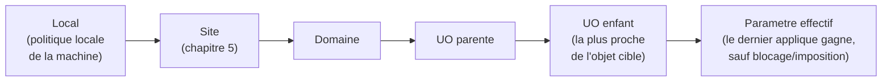

<div class="chapitre-titre-num">CHAPITRE 7</div>

# Group Policy Objects (GPO) avancées

<div class="encadre objectif">
<span class="encadre-titre">🎯 Objectif du chapitre</span>
Comprendre comment appliquer des configurations et des politiques de sécurité de façon centralisée à des milliers de postes et de comptes, sans intervenir manuellement sur chacun. À la fin de ce chapitre, tu sauras créer une stratégie de groupe ciblée, comprendre l'ordre de traitement LSDOU (Local, Site, Domaine, UO), diagnostiquer pourquoi une GPO ne s'applique pas comme prévu, et concevoir une structure de GPO qui reste maintenable dans le temps.
</div>

<div class="encadre scenario">
<span class="encadre-titre">🎬 Mise en situation</span>
Septième semaine. Un audit de sécurité externe, commandé par la direction de la compagnie d'assurance, vient de rendre son rapport. Parmi les recommandations : verrouiller automatiquement chaque poste après 10 minutes d'inactivité, imposer une longueur minimale de mot de passe de 12 caractères, et désactiver l'exécution de scripts PowerShell non signés sur les postes du service comptabilité, particulièrement exposé aux tentatives de phishing. Le DSI te confie cette mission avec une contrainte claire : <em>"Je veux que ce soit appliqué automatiquement, partout où c'est pertinent, sans que quelqu'un ait à s'en souvenir manuellement sur chaque poste. Et je veux que ce soit réversible si une règle pose un problème imprévu."</em> C'est exactement ce que les stratégies de groupe permettent de faire — l'objet de ce chapitre.
</div>

## 7.1 Qu'est-ce qu'une GPO

Une **stratégie de groupe** (*Group Policy Object*, GPO) est un ensemble de paramètres de configuration et de sécurité qu'Active Directory applique automatiquement aux ordinateurs et aux utilisateurs qu'elle cible — depuis un mot de passe minimal jusqu'au fond d'écran imposé, en passant par les scripts exécutés à l'ouverture de session ou les logiciels installés automatiquement.

<div class="encadre astuce">
<span class="encadre-titre">💡 Analogie — le règlement intérieur appliqué automatiquement</span>
Une GPO fonctionne comme un règlement intérieur d'entreprise qui s'appliquerait tout seul, sans que personne n'ait besoin de le lire ou de le faire respecter manuellement : dès qu'un employé (ou un ordinateur) entre dans le "bâtiment" concerné (l'unité d'organisation ciblée, chapitre 5), les règles s'appliquent automatiquement — verrouillage d'écran, politique de mot de passe, restrictions logicielles — sans intervention humaine répétée poste par poste.
</div>

<div class="encadre retenir">
<span class="encadre-titre">📌 À retenir</span>
Une GPO contient deux grandes catégories de paramètres, appliquées indépendamment : les paramètres **Ordinateur** (s'appliquent au démarrage de la machine, indépendamment de qui s'y connecte) et les paramètres **Utilisateur** (s'appliquent à l'ouverture de session, suivant l'utilisateur quel que soit le poste utilisé). Cette distinction détermine directement où et comment lier chaque GPO.
</div>

## 7.2 L'ordre de traitement : LSDOU

Quand plusieurs GPO s'appliquent simultanément à un même objet, Active Directory les traite dans un ordre précis et prévisible, résumé par l'acronyme **LSDOU** :



<div class="encadre memoriser">
<span class="encadre-titre">🧠 À mémoriser — LSDOU</span>
<strong>L</strong>ocal → <strong>S</strong>ite → <strong>D</strong>omaine → <strong>O</strong>U (de la plus haute à la plus proche de l'objet). En cas de paramètre en conflit entre deux niveaux, c'est généralement le niveau **le plus proche de l'objet cible** (l'UO enfant) qui l'emporte — sauf si une GPO de niveau supérieur a été explicitement marquée "imposée" (*Enforced*).
</div>

<div class="encadre attention">
<span class="encadre-titre">⚠️ Deux mécanismes qui inversent l'ordre normal : blocage et imposition</span>
Une UO peut être configurée pour **bloquer l'héritage** des GPO venant de niveaux supérieurs — mais une GPO marquée <strong>imposée</strong> (*Enforced*) au niveau du domaine traverse quand même ce blocage et s'applique malgré tout. Ces deux mécanismes existent pour des cas légitimes (isoler une UO de test, garantir qu'une politique de sécurité critique s'applique partout sans exception), mais leur usage excessif rend rapidement le comportement réel d'une GPO imprévisible sans une documentation rigoureuse — un piège directement lié à la discipline du chapitre 3.
</div>

## 7.3 Concevoir la mission du scénario d'ouverture

Reprenons les trois exigences de l'audit de sécurité, et voyons comment les traduire en GPO distinctes plutôt qu'en une seule GPO monolithique :

| Exigence | GPO dédiée | Portée (liaison) |
|---|---|---|
| Verrouillage après 10 min d'inactivité | GPO-Securite-Verrouillage-Ecran | Domaine entier (concerne tous les postes) |
| Mot de passe minimum 12 caractères | GPO-Securite-Politique-MotDePasse | Domaine entier |
| Blocage des scripts PowerShell non signés | GPO-Securite-Restriction-PowerShell-Comptabilite | UO "Comptabilité" uniquement |

<div class="encadre bonne-pratique">
<span class="encadre-titre">✅ Bonne pratique — une GPO, un objectif</span>
Créer une GPO distincte par objectif clair (plutôt qu'une seule GPO géante regroupant des dizaines de paramètres sans lien logique) facilite grandement le diagnostic en cas de problème : si les postes du service comptabilité rencontrent un problème après le déploiement, il est immédiat de savoir laquelle des trois GPO désactiver temporairement pour isoler la cause, sans devoir démêler un paramètre au milieu de centaines d'autres.
</div>

<div class="encadre securite">
<span class="encadre-titre">🔒 Sécurité — pourquoi la politique de mot de passe minimum se lie au domaine, pas à une UO</span>
Un point technique important souvent source d'erreur chez les débutants : la politique de mot de passe par défaut d'un domaine (longueur minimale, complexité, historique) ne peut être appliquée efficacement qu'au niveau du domaine lui-même via la GPO "Default Domain Policy" ou une GPO liée à la racine du domaine — la lier uniquement à une UO spécifique n'affecterait pas la politique de mot de passe des comptes de domaine de la façon attendue (un mécanisme distinct, les <em>Fine-Grained Password Policies</em>, existe pour des exceptions ciblées par groupe, mais reste hors du périmètre de ce chapitre introductif).
</div>

## 7.4 Tester avant de déployer : l'environnement de test et le groupe pilote

<div class="encadre mauvaise-pratique">
<span class="encadre-titre">❌ Mauvaise pratique — déployer une GPO de sécurité directement sur toute l'organisation</span>
Appliquer immédiatement une nouvelle GPO à l'ensemble du domaine, sans test préalable, expose l'organisation entière à un impact imprévu simultané — exactement le type de risque que le processus de changement du chapitre 2 vise à contrôler. Une GPO de restriction de scripts mal configurée, par exemple, pourrait bloquer des scripts métier légitimes pour l'ensemble de l'entreprise en une seule fois.
</div>

<div class="encadre bonne-pratique">
<span class="encadre-titre">✅ Bonne pratique — déploiement progressif via un groupe pilote</span>
Une approche plus sûre consiste à lier la nouvelle GPO à une UO de test, ou à restreindre son application via un <strong>filtrage de sécurité</strong> à un petit groupe pilote de volontaires (souvent l'équipe IT elle-même en premier), avant un déploiement progressif au reste de l'organisation. Cette approche rejoint directement le principe directeur ITIL "progresser de manière itérative avec un retour d'information" (chapitre 2).
</div>

## 7.5 Diagnostiquer une GPO qui ne s'applique pas comme prévu

C'est l'une des situations les plus fréquentes vécues par un administrateur système débutant : une GPO créée et liée correctement, mais dont l'effet n'apparaît pas sur le poste ciblé. L'outil central de diagnostic s'appelle **RSoP** (*Resultant Set of Policy*, ensemble résultant de stratégies), accessible notamment via la commande `gpresult`.

```
# Afficher un rapport HTML complet des GPO appliquees a l'utilisateur et
# a l'ordinateur actuellement connectes, avec les raisons de refus eventuelles
gpresult /h rapport-gpo.html /f

# Forcer l'actualisation immediate des GPO sur un poste, sans attendre
# le cycle d'actualisation automatique (par defaut, environ toutes les 90 minutes)
gpupdate /force
```

<div class="encadre capture">
<span class="encadre-titre">📷 Capture d'écran recommandée</span>
Le rapport HTML généré par <code>gpresult /h</code>, en particulier la section "GPO refusée" (*Denied GPOs*) qui liste, avec leur raison précise (filtrage de sécurité, WMI, désactivée), chaque stratégie qui n'a pas été appliquée à l'objet analysé — souvent l'endroit exact où se trouve la réponse à "pourquoi cette GPO ne s'applique pas".
</div>

<div class="encadre attention">
<span class="encadre-titre">🩺 Symptôme : "j'ai créé et lié la GPO, mais rien ne s'applique sur le poste"</span>

- **Diagnostic** : les causes les plus fréquentes, dans l'ordre de probabilité, sont : (1) le cycle d'actualisation automatique n'a pas encore eu lieu — <code>gpupdate /force</code> permet de vérifier immédiatement ; (2) l'objet ciblé (ordinateur ou utilisateur) ne se trouve pas réellement dans l'UO à laquelle la GPO est liée ; (3) un filtrage de sécurité exclut cet objet précis ; (4) une autre GPO de priorité supérieure impose une valeur contraire (section 7.2).
- **Comment vérifier** : <code>gpresult /h</code> révèle directement laquelle de ces causes s'applique, sans deviner.
- **Résolution** : corriger la cause identifiée (déplacer l'objet vers la bonne UO, ajuster le filtrage de sécurité, revoir l'ordre de priorité) plutôt que de créer une seconde GPO redondante en espérant qu'elle "prenne le dessus" sans comprendre la cause réelle.
</div>

## Atelier — Concevoir la structure de GPO de l'audit de sécurité

<div class="encadre exercice">
<span class="encadre-titre">🛠️ Atelier 7 — Planifier les trois GPO du scénario d'ouverture</span>

**Objectif** : s'entraîner à traduire des exigences de sécurité en structure de GPO concrète, en appliquant les principes des sections 7.3 et 7.4.

**Préparation** : aucune installation nécessaire.

**Étapes détaillées** :

1. Pour chacune des trois exigences du scénario d'ouverture (section 7.3), détermine : le nom de la GPO, son niveau de liaison (domaine ou UO précise), et si un déploiement pilote est recommandé avant généralisation.
2. Pour la restriction PowerShell ciblant uniquement le service comptabilité, explique pourquoi un filtrage de sécurité ou une liaison d'UO ciblée est préférable à une application à tout le domaine.
3. Propose une méthode pour vérifier, après déploiement, que les trois GPO s'appliquent correctement sur un poste de test.
4. Compare ta proposition à la section "Résultat attendu".

**Résultat attendu** : les deux premières GPO (verrouillage d'écran, politique de mot de passe) se lient au niveau du domaine, avec un déploiement pilote recommandé avant généralisation même pour des règles a priori peu risquées — la prudence méthodique prime toujours sur la confiance excessive (chapitre 1, section "compétences humaines"). La troisième GPO se lie spécifiquement à l'UO comptabilité (ou via un filtrage de sécurité ciblé) car appliquer une restriction de script à toute l'entreprise dépasserait le périmètre réel du risque identifié par l'audit. La vérification post-déploiement utilise `gpresult /h` sur un poste de chaque UO concernée.

**Dépannage** : si tu hésites sur le niveau de liaison d'une GPO, pose-toi la question : "cette règle doit-elle s'appliquer à absolument tout le monde, ou seulement à un sous-ensemble précis et justifié ?" — la réponse détermine directement le niveau de liaison approprié.
</div>

## Erreurs fréquentes

<div class="encadre attention">
<span class="encadre-titre">⚠️ Erreur n°1 — une seule GPO géante pour tout</span>
Comme vu en section 7.3, regrouper des dizaines de paramètres sans lien logique dans une seule GPO rend le diagnostic et la maintenance beaucoup plus difficiles qu'une structure de GPO ciblées et nommées clairement.
</div>

<div class="encadre attention">
<span class="encadre-titre">⚠️ Erreur n°2 — déployer directement en production sans test pilote</span>
Rappel de la section 7.4 : même une règle qui semble anodine mérite un test progressif avant généralisation, car son impact réel n'est jamais garanti à 100% avant un test sur des cas réels.
</div>

<div class="encadre attention">
<span class="encadre-titre">⚠️ Erreur n°3 — oublier de documenter la raison d'être d'une GPO</span>
Une GPO nommée simplement "Politique 3" ou "Test", sans description ni lien vers sa raison d'être (comme l'audit de sécurité de ce scénario), devient rapidement un mystère pour quiconque doit la maintenir plus tard — un rappel direct du chapitre 3 sur la documentation.
</div>

## En entreprise

- **Bonne pratique répandue** : documenter systématiquement, dans la description de chaque GPO elle-même (champ disponible nativement dans l'outil de gestion des stratégies de groupe) ainsi que dans la documentation externe du chapitre 3, la raison de sa création et la date de son dernier changement significatif.
- **Bonne pratique répandue** : revoir périodiquement l'ensemble des GPO existantes pour repérer les doublons, les GPO orphelines (non liées à aucune UO) ou les GPO obsolètes dont la raison d'être a disparu — un audit similaire, dans l'esprit, à celui de la CMDB évoqué au chapitre 3.
- **Erreur classique observée** : une accumulation de dizaines de GPO créées au fil des années par différentes personnes, sans convention de nommage ni documentation, rendant tout changement futur risqué faute de compréhension claire de l'existant.

## Entretien technique

<div class="encadre exercice">
<span class="encadre-titre">💼 Questions fréquemment posées en entretien</span>

**Q1. "Explique l'ordre de traitement LSDOU des stratégies de groupe."**
Réponse attendue : Local, puis Site, puis Domaine, puis Unité d'Organisation (de la plus haute à la plus proche de l'objet cible) — en cas de conflit, le niveau le plus proche de l'objet l'emporte généralement, sauf imposition explicite d'une GPO de niveau supérieur.

**Q2. "Comment diagnostiquerais-tu une GPO qui ne semble pas s'appliquer sur un poste donné ?"**
Réponse attendue : utiliser `gpresult /h` pour obtenir un rapport détaillé des GPO appliquées et refusées avec leurs raisons, plutôt que de deviner ou de recréer une GPO redondante ; vérifier aussi si le cycle d'actualisation automatique a eu le temps de s'exécuter, ou forcer une actualisation avec `gpupdate /force`.

**Q3. "Pourquoi recommande-t-on de tester une GPO sur un groupe pilote avant un déploiement général ?"**
Réponse attendue : pour limiter l'impact d'un effet imprévu à un petit groupe contrôlé plutôt qu'à l'ensemble de l'organisation simultanément — un principe directement lié au processus de changement du chapitre 2 et au principe directeur ITIL de progression itérative.
</div>

## Optimisation, sécurité et maintenabilité — les réflexes dès ce chapitre

<div class="encadre securite">
<span class="encadre-titre">🔒 Sécurité</span>
Les GPO sont un levier de sécurité puissant, mais aussi un vecteur d'impact potentiellement très large en cas d'erreur ou de compromission d'un compte disposant du droit de les modifier — la gestion des droits d'administration des GPO elle-même doit suivre le principe du moindre privilège (chapitre 1), pas seulement les paramètres qu'elles contiennent.
</div>

<div class="encadre bonne-pratique">
<span class="encadre-titre">✅ Maintenabilité</span>
Adopte une convention de nommage cohérente dès la première GPO créée (comme le préfixe "GPO-Securite-" de ce chapitre) — un choix qui semble mineur au début, mais qui devient précieux dès que le nombre de GPO dépasse la dizaine.
</div>

<div class="encadre performance">
<span class="encadre-titre">🚀 Performance</span>
Un nombre excessif de GPO liées au même objet peut ralentir légèrement le temps de démarrage ou d'ouverture de session (chaque GPO devant être évaluée), sans que ce soit généralement un problème critique dans une infrastructure bien conçue — un rappel que la structure des GPO (section 7.3) sert autant la clarté que la performance.
</div>

## Résumé du chapitre

- Une GPO applique automatiquement des paramètres de configuration et de sécurité aux ordinateurs et utilisateurs ciblés, sans intervention manuelle répétée.
- L'ordre de traitement LSDOU détermine quelle GPO l'emporte en cas de conflit, sauf blocage d'héritage ou imposition explicite.
- Une GPO par objectif clair, avec une convention de nommage cohérente, facilite grandement le diagnostic et la maintenance.
- Un déploiement progressif via un groupe pilote réduit le risque d'impact imprévu à grande échelle.
- `gpresult /h` est l'outil central de diagnostic pour comprendre pourquoi une GPO s'applique ou non à un objet donné.

## Quiz

<div class="encadre exercice">
<span class="encadre-titre">📝 QCM (une seule bonne réponse par question)</span>

1. L'ordre de traitement LSDOU signifie :
   - a) Local, Sécurité, Domaine, Organisation
   - b) Local, Site, Domaine, Unité d'Organisation
   - c) Liaison, Site, Droits, Objet
   - d) Local, Serveur, Domaine, Objet

2. La commande pour diagnostiquer pourquoi une GPO ne s'applique pas est :
   - a) `gpupdate /force`
   - b) `repadmin /showrepl`
   - c) `gpresult /h`
   - d) `systemctl status`

3. La bonne pratique recommandée avant de déployer une nouvelle GPO de sécurité à toute l'organisation est :
   - a) La déployer directement, la GPO peut toujours être annulée après coup
   - b) La tester d'abord sur un groupe pilote restreint
   - c) La lier uniquement au niveau du site
   - d) Attendre qu'un incident survienne avant d'agir

**Corrigé** : 1-b, 2-c, 3-b.
</div>

<div class="encadre exercice">
<span class="encadre-titre">📝 Vrai ou Faux</span>

1. Une GPO marquée "imposée" (Enforced) peut traverser un blocage d'héritage configuré sur une UO. — **Vrai**.
2. Il est recommandé de regrouper le plus grand nombre de paramètres possible dans une seule GPO pour simplifier la gestion. — **Faux** (une GPO par objectif clair est recommandée, section 7.3).
3. `gpupdate /force` permet de forcer l'actualisation immédiate des GPO sur un poste sans attendre le cycle automatique. — **Vrai**.
4. La politique de mot de passe par défaut d'un domaine se configure efficacement au niveau d'une UO isolée. — **Faux** (elle se configure au niveau du domaine, section 7.3).
</div>

<div class="encadre exercice">
<span class="encadre-titre">📝 Questions ouvertes</span>

1. Explique pourquoi une structure de GPO nommées et documentées facilite le diagnostic en cas de problème après un déploiement.
2. Reprends le scénario d'ouverture. Explique pourquoi il serait risqué de combiner les trois exigences de l'audit de sécurité dans une seule et même GPO.

**Corrigé 1** : avec une structure claire (une GPO par objectif, bien nommée et documentée), il est immédiat d'identifier laquelle des GPO récemment déployées pourrait être responsable d'un problème observé, et de la désactiver ou de l'ajuster de façon ciblée. Avec une seule GPO géante, un problème force à examiner l'ensemble des paramètres pour isoler la cause, un travail beaucoup plus lent et incertain.

**Corrigé 2** : la restriction PowerShell ne concerne que le service comptabilité, tandis que le verrouillage d'écran et la politique de mot de passe concernent tout le domaine — les combiner forcerait soit à appliquer la restriction PowerShell à toute l'entreprise (dépassant le périmètre réel du risque identifié), soit à complexifier inutilement le filtrage de sécurité d'une GPO unique. Séparer les GPO permet à chaque règle d'avoir exactement la portée qui correspond à son besoin réel, ni plus ni moins.
</div>

## Exercices

<div class="encadre exercice">
<span class="encadre-titre">📝 Exercice 7.1</span>

Un poste appartient à l'UO "Comptabilité", elle-même sous l'UO "Port-au-Prince". Une GPO A est liée au domaine avec un paramètre X activé. Une GPO B est liée à l'UO "Comptabilité" avec le même paramètre X désactivé. Aucune des deux GPO n'est marquée "imposée" et aucun blocage d'héritage n'est configuré. Quel est le résultat final du paramètre X sur ce poste, et pourquoi ?
</div>

**Corrigé :** Le paramètre X sera **désactivé**, car la GPO B (liée à l'UO la plus proche de l'objet, "Comptabilité") est traitée après la GPO A (liée au domaine, plus haut dans l'ordre LSDOU) et l'emporte donc sur le conflit, en l'absence de tout mécanisme d'imposition ou de blocage qui inverserait cet ordre normal.

<div class="encadre exercice">
<span class="encadre-titre">📝 Exercice 7.2</span>

Rédige, en 3 à 5 phrases, comment tu expliquerais à un collègue pourquoi `gpresult /h` est préférable à "essayer de deviner" en recréant simplement une nouvelle GPO quand une précédente ne semble pas fonctionner.
</div>

**Corrigé (exemple de réponse) :** Recréer une GPO sans comprendre pourquoi la précédente ne s'appliquait pas risque de reproduire exactement le même problème, en plus d'ajouter de la complexité et de la confusion dans la structure de GPO existante (contraire à la bonne pratique de la section 7.3). `gpresult /h` révèle la cause exacte du refus — filtrage de sécurité, mauvaise UO, conflit avec une GPO de priorité supérieure — permettant de corriger le vrai problème plutôt que de le contourner à l'aveugle. C'est le même principe de diagnostic méthodique que celui du chapitre 1 : restreindre le problème avant d'agir, plutôt qu'agir avant de comprendre.

## Checklist de fin de chapitre

<ul class="checklist">
<li>☐ Je sais expliquer ce qu'est une GPO et la différence entre paramètres Ordinateur et Utilisateur.</li>
<li>☐ Je connais l'ordre de traitement LSDOU et le rôle du blocage d'héritage et de l'imposition.</li>
<li>☐ Je sais concevoir une structure de GPO ciblées plutôt qu'une seule GPO monolithique.</li>
<li>☐ Je comprends pourquoi un déploiement pilote est recommandé avant une généralisation.</li>
<li>☐ Je sais utiliser `gpresult /h` et `gpupdate /force` pour diagnostiquer un problème d'application de GPO.</li>
</ul>

## FAQ

<dl class="faq">
<dt>Combien de temps faut-il pour qu'une nouvelle GPO s'applique automatiquement ?</dt>
<dd>Le cycle d'actualisation automatique par défaut est d'environ 90 minutes (avec un décalage aléatoire pour éviter que tous les postes ne se synchronisent au même instant précis) — `gpupdate /force` permet de forcer une application immédiate pour les tests, sans attendre ce délai.</dd>

<dt>Une GPO peut-elle être annulée facilement après déploiement si elle pose un problème ?</dt>
<dd>Oui, désactiver ou dé-lier une GPO annule son effet dès le prochain cycle d'actualisation (ou immédiatement avec `gpupdate /force` sur les postes concernés) — c'est justement l'un des avantages de la centralisation par GPO par rapport à des modifications manuelles poste par poste, bien plus difficiles à annuler uniformément.</dd>

<dt>Faut-il une GPO distincte pour chaque petit paramètre individuel ?</dt>
<dd>Non, l'objectif de la section 7.3 est de regrouper par objectif cohérent (par exemple, tous les paramètres liés au verrouillage d'écran dans une même GPO), pas de créer une GPO par paramètre isolé — l'équilibre entre granularité excessive et regroupement excessif s'affine avec l'expérience.</dd>

<dt>Le filtrage de sécurité et la liaison à une UO servent-ils le même objectif ?</dt>
<dd>Ils se complètent : la liaison détermine à quelle UO la GPO est rattachée dans l'arborescence, tandis que le filtrage de sécurité permet d'exclure ou d'inclure des objets précis au sein (ou même en dehors) de cette UO, pour un ciblage plus fin qu'une simple appartenance à l'UO.</dd>
</dl>

## Références et pour aller plus loin

- Microsoft Learn — Vue d'ensemble des stratégies de groupe : [https://learn.microsoft.com/fr-fr/windows-server/identity/ad-ds/manage/group-policy/group-policy-overview](https://learn.microsoft.com/fr-fr/windows-server/identity/ad-ds/manage/group-policy/group-policy-overview)
- Microsoft Learn — Référence de la commande `gpresult` : [https://learn.microsoft.com/fr-fr/windows-server/administration/windows-commands/gpresult](https://learn.microsoft.com/fr-fr/windows-server/administration/windows-commands/gpresult)
- CIS Benchmarks — modèles de GPO de durcissement Windows Server : [https://www.cisecurity.org/cis-benchmarks](https://www.cisecurity.org/cis-benchmarks)

*Chapitre suivant : Microsoft Entra ID et scénarios hybrides — comment étendre cette gestion centralisée de l'identité au-delà du réseau local de l'entreprise, vers le cloud.*
