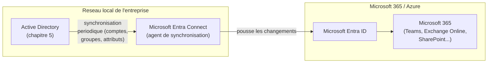

CHAPITRE 8

# Microsoft Entra ID et scénarios hybrides

🎯 Objectif du chapitre
Comprendre Microsoft Entra ID (anciennement Azure Active Directory) et la façon dont il s'articule avec un Active Directory local existant, plutôt que de le remplacer brutalement. À la fin de ce chapitre, tu sauras expliquer la différence fondamentale entre Active Directory et Entra ID, décrire le rôle d'Entra Connect dans un scénario hybride, et choisir la méthode de synchronisation d'identité adaptée à un contexte donné.

🎬 Mise en situation
Huitième semaine. La direction de la compagnie d'assurance annonce l'adoption de Microsoft 365 pour l'ensemble de l'entreprise — messagerie, Teams, stockage de documents partagé. Le DSI te pose une question simple en apparence : <em>"Est-ce que les employés vont devoir retenir un second mot de passe pour Microsoft 365, en plus de celui qu'ils utilisent déjà pour ouvrir leur session Windows tous les matins ?"</em> Tu comprends immédiatement l'enjeu : sans une réflexion sur l'identité hybride, l'entreprise s'expose soit à une double gestion de comptes source d'erreurs et de frustration, soit à un abandon pur et simple de l'annuaire local historique — deux options extrêmes qu'un scénario hybride bien conçu permet d'éviter. Ce chapitre explique comment.

## 8.1 Qu'est-ce que Microsoft Entra ID

**Microsoft Entra ID** est le service d'identité cloud de Microsoft (anciennement nommé Azure Active Directory, renommé en 2023 — les deux noms circulent encore largement en 2026). Il centralise l'identité pour les services cloud Microsoft (Microsoft 365, Azure) et pour de nombreuses applications tierces compatibles, selon des protocoles différents de ceux d'Active Directory traditionnel.

⚠️ Erreur de compréhension fréquente : Entra ID n'est pas "Active Directory dans le cloud"
Malgré la ressemblance des noms, Entra ID n'est <strong>pas</strong> une simple version hébergée d'Active Directory. Active Directory repose sur LDAP et Kerberos (chapitres 22-23), organisé en forêts/domaines/UO (chapitre 5) ; Entra ID repose sur des protocoles web modernes (SAML, OAuth 2.0, OpenID Connect) et une structure beaucoup plus plate, sans notion de forêt, de domaine ou d'unité d'organisation au sens Active Directory. Ce sont deux systèmes d'identité distincts, avec des cas d'usage complémentaires plutôt qu'un simple remplacement l'un de l'autre.

📌 À retenir
Un moyen simple de retenir la distinction : Active Directory répond très bien à "qui peut se connecter à ce serveur du réseau local, et à quoi a-t-il accès sur ce réseau ?" ; Entra ID répond à "qui peut se connecter à ce service cloud, où qu'il se trouve dans le monde, depuis n'importe quel appareil ?".

## 8.2 Pourquoi la plupart des entreprises n'abandonnent pas Active Directory du jour au lendemain

💡 Analogie — deux passeports pour deux types de voyage
Reprendre l'analogie du chapitre 5 (Active Directory comme registre d'état civil) : Entra ID s'apparente à un passeport international, reconnu au-delà des frontières du réseau local, tandis qu'Active Directory reste la carte d'identité nationale, essentielle pour les démarches purement locales (accès à un serveur de fichiers interne, une imprimante réseau, une application legacy sur site). La plupart des grandes organisations ont encore besoin des deux, pas d'un seul.

De nombreuses entreprises disposent d'applications, de serveurs de fichiers et de systèmes legacy qui dépendent d'Active Directory local et ne peuvent pas migrer immédiatement (ou jamais) vers une authentification purement cloud. Reconstruire toute l'identité de l'entreprise directement dans Entra ID, en abandonnant l'annuaire local existant, serait un projet disproportionné pour répondre au seul besoin exprimé dans le scénario d'ouverture (accès simplifié à Microsoft 365). C'est exactement pour ce cas de figure très répandu qu'existe le modèle **hybride**.

## 8.3 Le modèle hybride et Microsoft Entra Connect

**Microsoft Entra Connect** (anciennement Azure AD Connect) est l'outil qui synchronise les identités d'un Active Directory local vers Entra ID, permettant à un même compte utilisateur de fonctionner des deux côtés, sans double saisie ni double gestion.

💡 Explication du schéma
Un administrateur continue de créer et gérer les comptes utilisateurs dans l'Active Directory local, exactement comme au chapitre 5 — Entra Connect se charge automatiquement de répliquer ces comptes (et une sélection d'attributs) vers Entra ID, à intervalles réguliers. Cela répond directement à la question du DSI dans le scénario d'ouverture : un employé continue d'utiliser un compte unique, géré à un seul endroit (l'Active Directory local), qui fonctionne aussi bien pour ouvrir sa session Windows que pour accéder à Microsoft 365.

## 8.4 Les trois méthodes d'authentification hybride

Une fois les comptes synchronisés via Entra Connect, il reste à décider **comment** le mot de passe lui-même est vérifié lors d'une connexion à un service cloud. Trois méthodes principales existent :

| Méthode | Fonctionnement | Où le mot de passe est-il vérifié ? |
|---|---|---|
| **Password Hash Synchronization** (PHS) | Un hachage du mot de passe est synchronisé vers Entra ID | Dans le cloud, avec une copie sécurisée du hachage |
| **Pass-through Authentication** (PTA) | Chaque tentative de connexion est transmise en temps réel vers un agent local | Sur le réseau local, en temps réel, à chaque connexion |
| **Fédération** (ADFS ou équivalent) | Un serveur de fédération dédié gère entièrement l'authentification | Sur le réseau local, via une infrastructure de fédération dédiée |

✅ Bonne pratique — PHS comme choix par défaut recommandé
Pour la grande majorité des organisations de taille moyenne (comme la compagnie d'assurance de ce manuel), la synchronisation de hachage de mot de passe (PHS) est la méthode recommandée par Microsoft elle-même par défaut : elle est la plus simple à maintenir, ne nécessite aucune infrastructure supplémentaire critique, et permet même l'authentification cloud de continuer à fonctionner temporairement si le réseau local est indisponible (contrairement à PTA et à la fédération, qui dépendent d'une disponibilité locale à chaque connexion). Les méthodes plus complexes (PTA, fédération) se justifient surtout pour des exigences réglementaires strictes interdisant explicitement toute forme de hachage de mot de passe hors du réseau local.

🔒 Sécurité — PHS ne transmet jamais le mot de passe en clair
Une confusion fréquente et légitime concerne la sécurité de PHS : le terme "synchronisation de mot de passe" laisse parfois croire, à tort, que le mot de passe en clair transite vers le cloud. En réalité, seul un hachage supplémentaire (une transformation cryptographique, approfondie au chapitre 22) du hachage déjà stocké localement est envoyé — le mot de passe en clair de l'utilisateur ne quitte jamais le réseau local, ni au moment de la synchronisation, ni au moment de l'authentification cloud elle-même.

## 8.5 L'authentification unique (SSO) : l'expérience utilisateur finale

Une fois la synchronisation et l'authentification hybride configurées, l'objectif final pour l'utilisateur final est l'**authentification unique** (*Single Sign-On*, SSO) : se connecter une seule fois à sa session Windows le matin, puis accéder à Microsoft 365 et aux autres applications compatibles sans ressaisir ses identifiants.

🚀 Performance — l'expérience utilisateur comme métrique de succès
Le succès d'un déploiement hybride bien conçu se mesure directement à la question posée par le DSI dans le scénario d'ouverture : si un employé doit retenir et saisir un second mot de passe distinct, le déploiement n'a pas atteint son objectif, même si la synchronisation technique elle-même fonctionne parfaitement. L'expérience utilisateur finale est le vrai critère de réussite, pas seulement la réussite technique de la synchronisation en coulisses.

## 8.6 L'authentification multifacteur dans un contexte hybride

Rappel du chapitre 4 (section 4.7) : l'authentification multifacteur (MFA) doit s'appliquer systématiquement à tout accès administratif distant. Dans un contexte hybride, Entra ID permet d'étendre le MFA à l'ensemble des utilisateurs, y compris pour l'accès aux applications cloud grand public comme la messagerie — une extension naturelle et fortement recommandée de la posture de sécurité déjà posée en Partie 1.

🧠 À mémoriser
Le déploiement d'un modèle hybride est souvent l'occasion idéale d'introduire le MFA à l'échelle de toute l'organisation, en particulier pour les comptes ayant des privilèges élevés (comptes administrateurs Entra ID globaux, dont la compromission aurait un impact potentiellement aussi large que celui d'un administrateur de domaine local) — un sujet approfondi au chapitre 25.

## Atelier — Choisir une méthode d'authentification hybride

🛠️ Atelier 8 — Recommander une méthode pour l'entreprise du scénario

**Objectif** : s'entraîner à choisir et justifier une méthode d'authentification hybride adaptée à un contexte donné, en t'appuyant sur la section 8.4.

**Préparation** : aucune installation nécessaire.

**Étapes détaillées** :

1. À partir des informations connues sur l'entreprise d'assurance (deux sites, liaison Internet parfois instable au Cap-Haïtien, chapitre 6), recommande une méthode d'authentification hybride (PHS, PTA, ou fédération) et justifie ton choix en tenant compte de la fiabilité réseau évoquée au chapitre 6.
2. Explique un avantage concret de ta méthode recommandée par rapport aux deux autres dans ce contexte précis.
3. Compare ta réponse à la section "Résultat attendu".

**Résultat attendu** : PHS est la recommandation la plus adaptée, précisément parce qu'elle permet aux utilisateurs de continuer à s'authentifier auprès des services cloud même si le réseau local (ou la liaison entre sites) rencontre une interruption temporaire — un avantage particulièrement pertinent compte tenu des coupures réseau déjà rencontrées au chapitre 6. PTA et la fédération, à l'inverse, dépendraient d'une disponibilité locale à chaque tentative de connexion cloud, un risque supplémentaire non négligeable dans ce contexte précis.

**Dépannage** : si tu hésites entre les méthodes, reviens à la question centrale de la section 8.4 — "où le mot de passe est-il vérifié, et que se passe-t-il si cet endroit précis devient temporairement injoignable ?"

## Erreurs fréquentes

⚠️ Erreur n°1 — croire qu'Entra ID remplace purement et simplement Active Directory
Comme vu en section 8.1, ce sont deux systèmes distincts et complémentaires dans la grande majorité des organisations existantes — l'un ne rend pas l'autre obsolète du jour au lendemain, surtout tant que des systèmes legacy dépendent d'Active Directory local.

⚠️ Erreur n°2 — négliger le MFA lors du passage au cloud
Étendre l'accès à des services cloud accessibles depuis n'importe où dans le monde, sans renforcer l'authentification par MFA, élargit considérablement la surface d'attaque exposée par rapport à un accès purement local protégé par le périmètre réseau de l'entreprise — un point à ne jamais négliger lors d'un déploiement hybride, rappel direct du chapitre 4.

⚠️ Erreur n°3 — sous-estimer l'impact d'un problème de synchronisation
Un dysfonctionnement d'Entra Connect peut créer un décalage entre l'état réel d'un compte dans Active Directory (par exemple, un compte désactivé suite à un départ d'employé) et son état encore actif côté Entra ID pendant un délai de synchronisation — un risque de sécurité réel si ce délai n'est pas surveillé, similaire dans l'esprit au délai de réplication étudié au chapitre 6.

## En entreprise

- **Bonne pratique répandue** : surveiller activement la santé de la synchronisation Entra Connect (via son propre tableau de bord de supervision), au même titre que la réplication Active Directory du chapitre 6 — un échec de synchronisation silencieux peut passer inaperçu longtemps sans alerte proactive.
- **Bonne pratique répandue** : limiter le nombre de comptes disposant du rôle d'administrateur global Entra ID au strict minimum nécessaire (principe du moindre privilège, chapitre 1), et protéger ces comptes précis par un MFA renforcé sans exception.
- **Erreur classique observée** : un déploiement hybride réalisé dans l'urgence pour répondre à un besoin immédiat (comme l'adoption de Microsoft 365 du scénario d'ouverture), sans réflexion préalable sur la méthode d'authentification la plus adaptée au contexte réel de fiabilité réseau de l'entreprise.

## Entretien technique

💼 Questions fréquemment posées en entretien

**Q1. "Quelle est la différence fondamentale entre Active Directory et Microsoft Entra ID ?"**
Réponse attendue : Active Directory est un service d'annuaire local, basé sur LDAP et Kerberos, organisé en forêts/domaines/UO ; Entra ID est un service d'identité cloud, basé sur des protocoles web modernes (SAML, OAuth, OpenID Connect), avec une structure plus plate — les deux se complètent dans un scénario hybride plutôt que l'un ne remplace l'autre.

**Q2. "Que fait Microsoft Entra Connect ?"**
Réponse attendue : il synchronise les identités (comptes, groupes, attributs) d'un Active Directory local vers Entra ID, permettant à un même compte utilisateur de fonctionner à la fois localement et pour les services cloud, sans double gestion.

**Q3. "Pourquoi PHS (Password Hash Synchronization) est-elle souvent recommandée par défaut plutôt que la fédération ?"**
Réponse attendue : elle est plus simple à maintenir, ne nécessite pas d'infrastructure de fédération dédiée critique, et permet à l'authentification cloud de continuer à fonctionner même en cas d'indisponibilité temporaire du réseau local — un avantage de résilience important, sauf exigence réglementaire spécifique imposant une autre méthode.

## Optimisation, sécurité et maintenabilité — les réflexes dès ce chapitre

🔒 Sécurité
Un compte administrateur global Entra ID compromis peut avoir un impact aussi large, voire plus large (accès potentiel à l'ensemble des services cloud de l'entreprise, accessibles depuis n'importe où), qu'un compte administrateur de domaine Active Directory compromis — la même rigueur de protection (comptes nominatifs, MFA obligatoire, chapitre 4) s'applique avec la même exigence des deux côtés.

✅ Maintenabilité
Documente la méthode d'authentification hybride choisie et sa justification (section 8.4), au même titre que toute autre décision d'architecture (chapitre 3) — une décision technique de ce type, prise sans trace écrite de son raisonnement, devient difficile à réévaluer sereinement des années plus tard.

🚀 Performance
Un cycle de synchronisation Entra Connect trop espacé retarde la propagation de changements importants (comme la désactivation d'un compte) vers le cloud — un compromis à ajuster selon la criticité réelle de réactivité attendue par l'organisation, dans le même esprit que la fréquence de réplication inter-sites du chapitre 6.

## Résumé du chapitre

- Microsoft Entra ID est un service d'identité cloud distinct d'Active Directory, complémentaire plutôt que substitut dans la plupart des organisations existantes.
- Microsoft Entra Connect synchronise les comptes d'un Active Directory local vers Entra ID, évitant la double gestion et la double authentification pour les utilisateurs.
- Trois méthodes d'authentification hybride existent (PHS, PTA, fédération) ; PHS est généralement recommandée par défaut pour sa simplicité et sa résilience aux coupures réseau locales.
- Le succès d'un déploiement hybride se mesure à l'expérience réelle de l'utilisateur final (authentification unique), pas seulement à la réussite technique de la synchronisation.
- Le MFA doit être étendu systématiquement lors de tout passage à des services cloud accessibles depuis l'extérieur du réseau de l'entreprise.

## Quiz

📝 QCM (une seule bonne réponse par question)

1. Microsoft Entra ID est :
   - a) Une version hébergée identique d'Active Directory
   - b) Un service d'identité cloud distinct, basé sur des protocoles web modernes
   - c) Un remplacement obligatoire d'Active Directory local
   - d) Un outil de sauvegarde d'Active Directory

2. L'outil qui synchronise les identités d'Active Directory local vers Entra ID est :
   - a) `repadmin`
   - b) Microsoft Entra Connect
   - c) `gpresult`
   - d) Windows Admin Center

3. La méthode d'authentification hybride généralement recommandée par défaut est :
   - a) La fédération (ADFS)
   - b) Pass-through Authentication (PTA)
   - c) Password Hash Synchronization (PHS)
   - d) Aucune synchronisation, deux mots de passe distincts

**Corrigé** : 1-b, 2-b, 3-c.

📝 Vrai ou Faux

1. Avec PHS, le mot de passe en clair de l'utilisateur transite vers Entra ID. — **Faux** (seul un hachage supplémentaire du hachage local est transmis).
2. Un déploiement hybride bien conçu permet à un utilisateur de n'avoir qu'un seul mot de passe à retenir. — **Vrai**.
3. PTA et la fédération continuent de fonctionner normalement même si le réseau local est totalement indisponible. — **Faux** (elles dépendent d'une disponibilité locale à chaque connexion, contrairement à PHS).
4. Le MFA devient encore plus important lors d'un passage à des services cloud accessibles depuis l'extérieur du réseau de l'entreprise. — **Vrai**.

📝 Questions ouvertes

1. Explique, avec tes propres mots, pourquoi une entreprise avec des systèmes legacy dépendant d'Active Directory local n'a généralement pas intérêt à migrer immédiatement et entièrement vers Entra ID seul.
2. Reprends le scénario d'ouverture. Explique comment tu répondrais à la question du DSI sur le second mot de passe, en une réponse claire et non technique.

**Corrigé 1** : les systèmes legacy dépendant de protocoles Active Directory traditionnels (LDAP, Kerberos) ne peuvent généralement pas s'authentifier directement contre Entra ID, qui repose sur des protocoles différents. Abandonner Active Directory local casserait l'accès à ces systèmes tant qu'ils n'ont pas été eux-mêmes migrés ou remplacés — un projet potentiellement long et coûteux, largement disproportionné pour répondre au seul besoin d'accès simplifié à des services cloud comme Microsoft 365.

**Corrigé 2** : je répondrais que non, grâce à la synchronisation entre l'Active Directory local existant et Entra ID (via Microsoft Entra Connect), chaque employé continuera d'utiliser exactement le même compte et le même mot de passe qu'aujourd'hui pour ouvrir sa session Windows le matin, et ce même compte fonctionnera automatiquement pour Microsoft 365 — sans second mot de passe à retenir ni double gestion pour l'équipe IT.

## Exercices

📝 Exercice 8.1

Explique la différence entre PHS et PTA en termes de "où le mot de passe est réellement vérifié", et laquelle des deux méthodes serait affectée par une panne du réseau local au moment précis d'une tentative de connexion cloud.

**Corrigé :** Avec PHS, un hachage du mot de passe est déjà synchronisé vers Entra ID à l'avance — la vérification a lieu entièrement dans le cloud, indépendamment de l'état du réseau local au moment de la connexion. Avec PTA, chaque tentative de connexion doit être transmise en temps réel vers un agent installé sur le réseau local pour vérification — une panne du réseau local au moment précis de la connexion empêcherait donc l'authentification de réussir avec PTA, contrairement à PHS.

📝 Exercice 8.2

Rédige, en 3 à 5 phrases, pourquoi le MFA devrait être une priorité immédiate lors du déploiement hybride du scénario d'ouverture, plutôt qu'une amélioration à envisager "plus tard".

**Corrigé (exemple de réponse) :** Avant le déploiement hybride, l'accès aux systèmes de l'entreprise était limité au réseau local ou à un accès distant déjà sécurisé par bastion (chapitre 4) ; après le déploiement, les comptes utilisateurs deviennent accessibles depuis Internet via les services Microsoft 365, élargissant considérablement la surface d'attaque exposée. Sans MFA, un mot de passe compromis par hameçonnage (un risque réel et fréquent) suffirait à un attaquant pour accéder directement à la messagerie et aux documents de l'entreprise depuis n'importe où dans le monde. Activer le MFA dès le déploiement, plutôt qu'après coup, évite une fenêtre de vulnérabilité inutile pendant laquelle l'entreprise serait exposée sans la protection appropriée.

## Checklist de fin de chapitre

<ul class="checklist">
<li>☐ Je sais expliquer la différence fondamentale entre Active Directory et Microsoft Entra ID.</li>
<li>☐ Je comprends le rôle de Microsoft Entra Connect dans un scénario hybride.</li>
<li>☐ Je connais les trois méthodes d'authentification hybride (PHS, PTA, fédération) et leurs compromis.</li>
<li>☐ Je sais pourquoi PHS est souvent recommandée par défaut.</li>
<li>☐ Je comprends pourquoi le MFA devient encore plus critique lors d'un passage à des services cloud.</li>
</ul>

## FAQ

<dl class="faq">
<dt>Une petite entreprise sans Active Directory local a-t-elle besoin d'Entra Connect ?</dt>
<dd>Non — si l'entreprise n'a jamais eu d'Active Directory local et gère ses comptes directement dans Entra ID (un scénario "cloud natif" de plus en plus fréquent pour les très petites structures), la synchronisation hybride n'a simplement pas lieu d'être. Ce chapitre concerne spécifiquement les organisations qui possèdent déjà un Active Directory local, comme celle de ce manuel.</dd>

<dt>Peut-on changer de méthode d'authentification hybride après le déploiement initial ?</dt>
<dd>Oui, c'est techniquement possible et parfois nécessaire (par exemple, passer de PHS à la fédération suite à une nouvelle exigence réglementaire), mais ce changement mérite la même rigueur de planification et de test qu'un changement normal du chapitre 2, pas une bascule improvisée.</dd>

<dt>Le déploiement hybride affecte-t-il les serveurs et applications qui restent purement locaux ?</dt>
<dd>Non, les systèmes purement locaux continuent de s'authentifier normalement contre l'Active Directory local, exactement comme avant le déploiement hybride — seuls les services cloud bénéficient de la synchronisation vers Entra ID.</dd>

<dt>Faut-il des licences Microsoft 365 pour utiliser Entra ID ?</dt>
<dd>Une version gratuite d'Entra ID existe avec des fonctionnalités de base, mais les fonctionnalités avancées de sécurité (comme certaines politiques de MFA conditionnelles poussées) nécessitent généralement des licences payantes — un point à valider avec les besoins réels et le budget de l'organisation avant de s'engager sur une architecture précise.</dd>
</dl>

## Références et pour aller plus loin

- Microsoft Learn — Qu'est-ce que Microsoft Entra Connect : [https://learn.microsoft.com/fr-fr/entra/identity/hybrid/connect/whatis-azure-ad-connect](https://learn.microsoft.com/fr-fr/entra/identity/hybrid/connect/whatis-azure-ad-connect)
- Microsoft Learn — Choisir la bonne méthode d'authentification pour votre solution d'identité hybride : [https://learn.microsoft.com/fr-fr/entra/identity/hybrid/connect/choose-ad-authn](https://learn.microsoft.com/fr-fr/entra/identity/hybrid/connect/choose-ad-authn)
- Microsoft Learn — Vue d'ensemble de Microsoft Entra ID : [https://learn.microsoft.com/fr-fr/entra/fundamentals/whatis](https://learn.microsoft.com/fr-fr/entra/fundamentals/whatis)

*Chapitre suivant : DNS avancé sur Windows Server — zones, délégation et DNSSEC, le service qui permet à chaque machine et chaque utilisateur de trouver les ressources dont ils ont besoin sur le réseau.*
