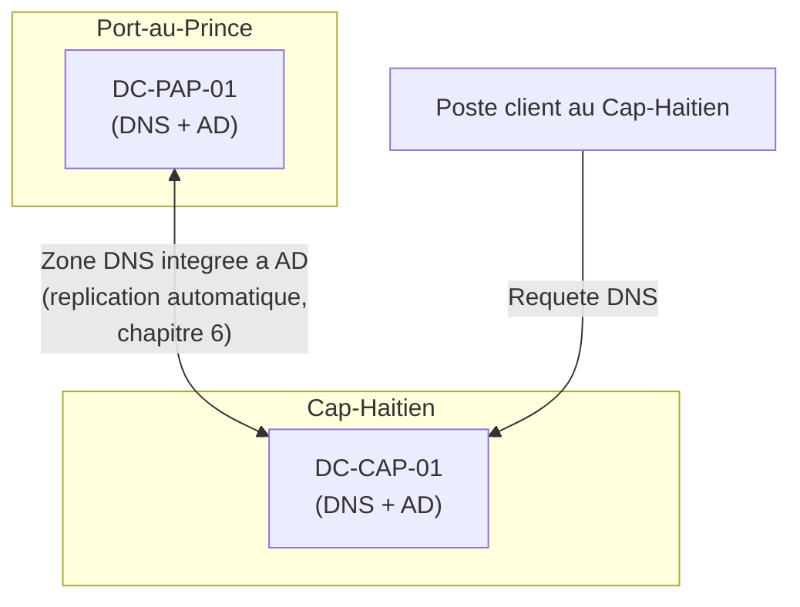
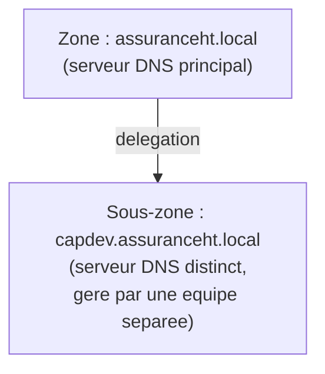

<div class="chapitre-titre-num">CHAPITRE 9</div>

# DNS avancé sur Windows Server

<div class="encadre objectif">
<span class="encadre-titre">🎯 Objectif du chapitre</span>
Comprendre en profondeur le fonctionnement du DNS sur Windows Server — au-delà de la simple résolution de noms — et savoir concevoir des zones DNS intégrées à Active Directory, configurer une délégation de zone, et comprendre l'intérêt de DNSSEC. À la fin de ce chapitre, tu sauras diagnostiquer méthodiquement un problème de résolution DNS, l'une des causes les plus fréquentes d'incidents en environnement Windows.
</div>

<div class="encadre scenario">
<span class="encadre-titre">🎬 Mise en situation</span>
Neuvième semaine. Un lundi matin, plusieurs utilisateurs du Cap-Haïtien signalent qu'ils n'arrivent plus à accéder à l'application interne de gestion des sinistres, alors que le serveur qui l'héberge fonctionne normalement (confirmé par une connexion directe via son adresse IP). Le DSI te demande d'investiguer. En quelques minutes de diagnostic méthodique, tu identifies la cause : une modification récente de l'adresse IP du serveur applicatif n'a pas été correctement propagée dans le DNS interne. <em>"Comment est-ce qu'un simple problème de nom peut bloquer tout un service qui fonctionne pourtant très bien ?"</em> te demande le DSI, perplexe. Ce chapitre répond à cette question, et t'arme pour ne plus jamais perdre de temps face à ce type d'incident, l'un des plus fréquents du métier.
</div>

## 9.1 Pourquoi le DNS est si souvent la cause cachée d'un incident

Le **DNS** (*Domain Name System*) traduit des noms lisibles par un humain (`sinistres.assuranceht.local`) en adresses IP utilisables par les machines. Le service applicatif lui-même peut fonctionner parfaitement — comme dans le scénario d'ouverture — tout en étant totalement inaccessible si le nom qui pointe vers lui est incorrect, obsolète, ou introuvable.

<div class="encadre astuce">
<span class="encadre-titre">💡 Analogie — l'annuaire téléphonique</span>
Le DNS fonctionne comme un annuaire téléphonique : le numéro de téléphone d'une entreprise (l'adresse IP) ne change pas nécessairement, mais si l'annuaire (le DNS) indique encore un ancien numéro après un déménagement, l'appelant compose un numéro qui ne répond plus — même si l'entreprise elle-même fonctionne parfaitement à sa nouvelle adresse. C'est exactement ce qui s'est passé dans le scénario d'ouverture : le serveur fonctionnait, mais "l'annuaire" pointait vers une adresse obsolète.
</div>

<div class="encadre memoriser">
<span class="encadre-titre">🧠 À mémoriser</span>
Le DNS est fréquemment cité par les administrateurs système expérimentés comme l'une des causes les plus sous-estimées d'incidents apparemment mystérieux — un service qui "ne répond pas" alors qu'il fonctionne réellement très bien mérite presque toujours une vérification DNS avant toute autre hypothèse plus complexe.
</div>

## 9.2 Les zones DNS intégrées à Active Directory

Sur Windows Server, une **zone DNS intégrée à Active Directory** stocke ses données directement dans l'annuaire Active Directory plutôt que dans un simple fichier texte local à un seul serveur — bénéficiant ainsi directement du modèle multi-maître et de la réplication étudiés au chapitre 6.

<div class="encadre bonne-pratique">
<span class="encadre-titre">✅ Bonne pratique — préférer les zones intégrées à Active Directory</span>
Une zone DNS intégrée à Active Directory se réplique automatiquement vers tous les contrôleurs de domaine qui hébergent aussi le rôle DNS, sans configuration de transfert de zone supplémentaire à maintenir manuellement, et bénéficie nativement de la tolérance de panne du chapitre 6 : si un contrôleur DNS tombe, un autre contrôleur peut répondre aux requêtes avec les mêmes données à jour, sans configuration additionnelle.
</div>



## 9.3 Enregistrements DNS essentiels à connaître

| Type d'enregistrement | Rôle | Exemple |
|---|---|---|
| **A** | Nom vers adresse IPv4 | `sinistres.assuranceht.local` → `10.10.2.15` |
| **AAAA** | Nom vers adresse IPv6 | Équivalent A pour IPv6 |
| **CNAME** | Alias vers un autre nom | `intranet.assuranceht.local` → `sinistres.assuranceht.local` |
| **PTR** | Adresse IP vers nom (résolution inverse) | `10.10.2.15` → `sinistres.assuranceht.local` |
| **SRV** | Localisation d'un service précis (utilisé massivement par Active Directory lui-même) | Localisation des contrôleurs de domaine par site |
| **MX** | Serveur de messagerie responsable d'un domaine | Redirige les emails vers le bon serveur |

<div class="encadre attention">
<span class="encadre-titre">⚠️ L'enregistrement PTR, souvent oublié</span>
Contrairement à l'enregistrement A (indispensable et rarement oublié), l'enregistrement PTR correspondant est souvent négligé lors de la création manuelle d'un enregistrement — alors que de nombreuses applications et certains contrôles de sécurité (notamment liés à la messagerie électronique) dépendent explicitement d'une résolution inverse cohérente. Une bonne pratique consiste à toujours créer les deux ensemble, jamais l'un sans l'autre.
</div>

## 9.4 La délégation de zone

La **délégation** permet de confier la gestion d'une portion de l'espace de noms DNS à un autre serveur DNS, sans que le serveur parent ait besoin de connaître le détail de cette sous-zone.



<div class="encadre astuce">
<span class="encadre-titre">💡 Quand la délégation est-elle utile en pratique ?</span>
Dans une petite ou moyenne entreprise comme celle de ce manuel, la délégation de zone reste rarement nécessaire — un seul serveur DNS intégré à Active Directory (section 9.2) couvre largement le besoin. Elle devient pertinente dans des organisations plus grandes, où une équipe distincte (par exemple une équipe de développement gérant un environnement de test isolé) a besoin d'une autonomie complète sur sa propre portion de l'espace de noms, sans dépendre à chaque changement de l'équipe infrastructure centrale.
</div>

## 9.5 DNSSEC : authentifier les réponses DNS

**DNSSEC** (*Domain Name System Security Extensions*) ajoute une couche de signature cryptographique aux réponses DNS, permettant à un client de vérifier qu'une réponse provient réellement du serveur légitime et n'a pas été altérée en chemin — une protection contre certaines attaques de type usurpation ou empoisonnement de cache DNS.

<div class="encadre securite">
<span class="encadre-titre">🔒 Sécurité — DNSSEC protège l'intégrité, pas la confidentialité</span>
Une confusion fréquente : DNSSEC ne chiffre pas les requêtes DNS (leur contenu reste visible en transit) — il garantit uniquement l'<strong>authenticité</strong> et l'<strong>intégrité</strong> de la réponse reçue, empêchant un attaquant de rediriger discrètement un nom légitime vers une adresse IP malveillante. Pour la confidentialité des requêtes elles-mêmes, des protocoles distincts existent (DNS over HTTPS, DNS over TLS), hors du périmètre de ce chapitre.
</div>

<div class="encadre performance">
<span class="encadre-titre">🚀 Performance — le coût réel de DNSSEC</span>
DNSSEC ajoute une charge de calcul et de taille de réponse supplémentaire (signatures cryptographiques à vérifier), un compromis à évaluer selon le niveau de risque réel de l'organisation — pour un réseau interne d'entreprise fermé, protégé par ailleurs (bastion du chapitre 4, segmentation du chapitre 5), le bénéfice de DNSSEC est souvent moins critique que pour un domaine public exposé sur Internet, où l'usurpation DNS représente un risque nettement plus concret.
</div>

## 9.6 Diagnostiquer un problème DNS méthodiquement

Reprenons le scénario d'ouverture avec les bons outils :

```
# Verifier la resolution d'un nom precis, sans passer par le cache local
nslookup sinistres.assuranceht.local

# Interroger directement un serveur DNS precis (utile pour comparer
# la reponse entre deux controleurs de domaine differents)
nslookup sinistres.assuranceht.local DC-CAP-01

# Vider le cache DNS local d'un poste client, utile si une ancienne
# reponse incorrecte y est restee stockee au-dela de sa duree de vie prevue
ipconfig /flushdns

# Verifier la coherence entre les enregistrements A et PTR
nslookup 10.10.2.15
```

<div class="encadre attention">
<span class="encadre-titre">🩺 Situation : "Le service fonctionne en accès direct par IP, mais pas par son nom"</span>

- **Diagnostic** : c'est presque toujours un problème DNS pur, exactement comme dans le scénario d'ouverture — le service lui-même n'est pas en cause.
- **Comment vérifier** : `nslookup` sur le nom en question, en interrogeant directement plusieurs serveurs DNS différents (section 9.6) pour identifier si le problème touche un seul contrôleur (retard de réplication, chapitre 6) ou l'ensemble de l'infrastructure DNS (enregistrement réellement incorrect ou manquant).
- **Résolution** : corriger ou créer l'enregistrement manquant/incorrect ; si le problème ne touchait qu'un seul contrôleur, vérifier également l'état de la réplication (chapitre 6) plutôt que de supposer une simple coïncidence.
</div>

<div class="encadre bonne-pratique">
<span class="encadre-titre">✅ Bonne pratique — le réflexe DNS avant tout diagnostic plus complexe</span>
Face à un service "injoignable" alors que son infrastructure sous-jacente semble saine, vérifier la résolution DNS devrait systématiquement faire partie des toutes premières étapes de diagnostic (chapitre 1, méthode de restriction du problème) — avant d'explorer des pistes plus complexes comme un problème applicatif ou réseau profond, qui prennent nettement plus de temps à investiguer.
</div>

## Atelier — Diagnostiquer le scénario d'ouverture

<div class="encadre exercice">
<span class="encadre-titre">🛠️ Atelier 9 — Reconstituer la démarche de diagnostic</span>

**Objectif** : s'entraîner à appliquer une démarche méthodique de diagnostic DNS, en reconstituant les étapes qui ont mené à la découverte de la cause dans le scénario d'ouverture.

**Préparation** : aucune installation nécessaire.

**Étapes détaillées** :

1. Liste, dans l'ordre logique, les étapes de diagnostic que tu aurais suivies pour identifier la cause de l'incident du scénario d'ouverture, en t'appuyant sur la section 9.6.
2. Pour chaque étape, précise la commande utilisée et ce que son résultat t'aurait appris.
3. Propose une mesure préventive pour éviter que ce type d'incident (changement d'IP non répercuté dans le DNS) ne se reproduise, en t'appuyant sur le chapitre 2 (gestion du changement) et le chapitre 3 (documentation).
4. Compare ta démarche à la section "Résultat attendu".

**Résultat attendu** : la démarche commence par confirmer que le service répond bien par IP directe (isolant le problème au DNS plutôt qu'au service lui-même), puis `nslookup` sur le nom concerné pour observer l'adresse IP réellement renvoyée et la comparer à l'adresse actuelle du serveur. La mesure préventive attendue est de traiter tout changement d'adresse IP d'un serveur comme un changement normal (chapitre 2) incluant explicitement la mise à jour DNS (et PTR) dans son plan d'exécution, documentée comme une étape systématique du runbook de changement de serveur (chapitre 3) plutôt que laissée à la mémoire de l'exécutant.

**Dépannage** : si tu as du mal à formuler la mesure préventive, reviens à la section "Optimisation, sécurité et maintenabilité" de ce chapitre.
</div>

## Erreurs fréquentes

<div class="encadre attention">
<span class="encadre-titre">⚠️ Erreur n°1 — négliger la vérification DNS au profit d'hypothèses plus complexes</span>
Comme évoqué en section 9.6, beaucoup d'administrateurs débutants passent un temps disproportionné à investiguer des causes complexes avant de penser à vérifier simplement la résolution de nom — un réflexe rapide et peu coûteux à acquérir dès le début de carrière.
</div>

<div class="encadre attention">
<span class="encadre-titre">⚠️ Erreur n°2 — oublier l'enregistrement PTR</span>
Rappel de la section 9.3 : de nombreux dysfonctionnements subtils (notamment liés à certains contrôles de messagerie ou de sécurité) proviennent d'une résolution inverse absente ou incohérente, souvent négligée par rapport à l'enregistrement A plus évident.
</div>

<div class="encadre attention">
<span class="encadre-titre">⚠️ Erreur n°3 — modifier une adresse IP sans mettre à jour le DNS dans la même opération</span>
Exactement la cause du scénario d'ouverture — traiter le changement d'adresse IP et la mise à jour DNS comme deux tâches séparées, potentiellement oubliables indépendamment l'une de l'autre, plutôt que comme une seule opération atomique documentée dans un runbook unique.
</div>

## En entreprise

- **Bonne pratique répandue** : intégrer la mise à jour DNS comme étape obligatoire et cochée explicitement dans toute procédure de changement touchant l'adresse IP d'un serveur (chapitres 2 et 3), plutôt que de compter sur la mémoire de la personne qui exécute le changement.
- **Bonne pratique répandue** : surveiller les temps de réponse et la disponibilité du service DNS lui-même via un outil de supervision dédié (Partie 10) — une panne DNS peut avoir un impact bien plus large et plus difficile à diagnostiquer qu'une panne d'un service applicatif isolé.
- **Erreur classique observée** : des enregistrements DNS obsolètes qui s'accumulent au fil des années (serveurs décommissionnés dont le nom reste actif, chapitre 3 sur le décommissionnement), créant une confusion croissante lors de tout diagnostic futur.

## Entretien technique

<div class="encadre exercice">
<span class="encadre-titre">💼 Questions fréquemment posées en entretien</span>

**Q1. "Un utilisateur ne peut pas accéder à une application par son nom, mais y accède normalement par adresse IP directe. Quelle est ta première hypothèse ?"**
Réponse attendue : un problème de résolution DNS — l'enregistrement pointe probablement vers une adresse incorrecte ou obsolète, ou n'existe pas/plus. La vérification avec `nslookup` doit être l'un des tout premiers réflexes de diagnostic, avant d'explorer des causes applicatives plus complexes.

**Q2. "Quel est l'avantage d'une zone DNS intégrée à Active Directory par rapport à une zone traditionnelle basée sur un fichier ?"**
Réponse attendue : elle bénéficie automatiquement de la réplication multi-maître d'Active Directory (chapitre 6), sans configuration de transfert de zone séparée, et profite nativement de la tolérance de panne offerte par plusieurs contrôleurs de domaine hébergeant aussi le rôle DNS.

**Q3. "Que protège DNSSEC, et que ne protège-t-il pas ?"**
Réponse attendue : DNSSEC garantit l'authenticité et l'intégrité des réponses DNS (empêche une réponse falsifiée d'être acceptée comme légitime), mais ne chiffre pas le contenu des requêtes — la confidentialité relève de protocoles distincts comme DNS over HTTPS ou DNS over TLS.
</div>

## Optimisation, sécurité et maintenabilité — les réflexes dès ce chapitre

<div class="encadre securite">
<span class="encadre-titre">🔒 Sécurité</span>
Restreins qui peut modifier les zones DNS aux comptes strictement nécessaires (principe du moindre privilège, chapitre 1) — un enregistrement DNS modifié de façon malveillante ou par erreur peut rediriger silencieusement des utilisateurs vers une destination inattendue, un risque de sécurité sérieux au-delà d'une simple gêne opérationnelle.
</div>

<div class="encadre bonne-pratique">
<span class="encadre-titre">✅ Maintenabilité</span>
Documente la convention de nommage DNS de l'organisation (chapitre 3) et traite systématiquement la mise à jour DNS comme une étape explicite de tout runbook de changement de serveur — exactement la mesure préventive attendue dans l'atelier de ce chapitre.
</div>

<div class="encadre performance">
<span class="encadre-titre">🚀 Performance</span>
Une durée de vie (TTL) d'enregistrement DNS trop longue retarde la propagation d'un changement légitime auprès des clients ayant mis en cache l'ancienne réponse ; une durée trop courte augmente la charge de requêtes répétées sur les serveurs DNS — un équilibre à ajuster selon la fréquence réelle de changement attendue pour chaque enregistrement.
</div>

## Résumé du chapitre

- Le DNS traduit des noms lisibles en adresses IP ; un service peut fonctionner parfaitement tout en étant inaccessible par son nom si le DNS pointe vers une adresse incorrecte.
- Les zones DNS intégrées à Active Directory bénéficient automatiquement de la réplication multi-maître et de la tolérance de panne du chapitre 6.
- Les enregistrements A, AAAA, CNAME, PTR, SRV et MX couvrent l'essentiel des besoins courants ; le PTR est souvent négligé à tort.
- La délégation de zone confie la gestion d'une portion de l'espace de noms à un serveur distinct, utile surtout dans les grandes organisations.
- DNSSEC garantit l'authenticité et l'intégrité des réponses DNS, mais pas leur confidentialité.
- `nslookup` et `ipconfig /flushdns` sont les outils de base du diagnostic DNS, à utiliser systématiquement en première étape face à un service "injoignable par nom mais fonctionnel par IP".

## Quiz

<div class="encadre exercice">
<span class="encadre-titre">📝 QCM (une seule bonne réponse par question)</span>

1. Un enregistrement PTR sert à :
   - a) Traduire un nom en adresse IPv4
   - b) Traduire une adresse IP en nom (résolution inverse)
   - c) Localiser un serveur de messagerie
   - d) Créer un alias vers un autre nom

2. Une zone DNS intégrée à Active Directory bénéficie principalement de :
   - a) Un chiffrement automatique de toutes les requêtes
   - b) La réplication multi-maître et la tolérance de panne d'Active Directory
   - c) Une résolution de noms plus rapide dans tous les cas
   - d) Une délégation automatique vers tous les sites

3. DNSSEC protège principalement :
   - a) La confidentialité des requêtes DNS
   - b) L'authenticité et l'intégrité des réponses DNS
   - c) La vitesse de résolution des noms
   - d) La sauvegarde automatique des zones DNS

**Corrigé** : 1-b, 2-b, 3-b.
</div>

<div class="encadre exercice">
<span class="encadre-titre">📝 Vrai ou Faux</span>

1. Un service peut être totalement fonctionnel tout en étant inaccessible par son nom DNS. — **Vrai** (exactement le scénario d'ouverture de ce chapitre).
2. L'enregistrement PTR est toujours créé automatiquement en même temps que l'enregistrement A. — **Faux** (il est souvent oublié, section 9.3).
3. DNSSEC chiffre le contenu des requêtes DNS. — **Faux** (il garantit l'authenticité, pas la confidentialité).
4. La délégation de zone est indispensable dans toute organisation, quelle que soit sa taille. — **Faux** (rarement nécessaire dans une petite ou moyenne structure, section 9.4).
</div>

<div class="encadre exercice">
<span class="encadre-titre">📝 Questions ouvertes</span>

1. Explique pourquoi un problème DNS devrait généralement être vérifié avant des hypothèses de diagnostic plus complexes.
2. Reprends le scénario d'ouverture. Propose une explication, en langage simple et non technique, que tu donnerais au DSI sur "comment un simple problème de nom peut bloquer tout un service qui fonctionne pourtant très bien".

**Corrigé 1** : le DNS est une dépendance quasiment universelle — la plupart des applications, services et connexions utilisateur passent par une résolution de nom avant d'atteindre la ressource réelle. Vérifier le DNS est rapide (quelques secondes avec `nslookup`) comparé à l'investigation d'hypothèses plus complexes (problème applicatif, réseau profond), ce qui en fait un excellent premier réflexe à faible coût et fort potentiel de gain de temps.

**Corrigé 2** : je lui expliquerais que le DNS fonctionne comme un annuaire téléphonique de l'entreprise — le service fonctionne parfaitement à sa "nouvelle adresse", mais si l'annuaire n'a pas été mis à jour après le changement, les personnes qui composent le numéro (le nom du service) tombent encore sur l'ancienne destination, qui elle ne répond plus. Le service lui-même n'a jamais été en panne — seul "l'annuaire" qui permet de le trouver n'était plus à jour.
</div>

## Exercices

<div class="encadre exercice">
<span class="encadre-titre">📝 Exercice 9.1</span>

Un serveur applicatif change d'adresse IP de 10.10.2.15 à 10.10.2.40. Liste, dans l'ordre, toutes les actions DNS nécessaires pour que ce changement soit complètement et correctement pris en compte, en t'appuyant sur la section 9.3.
</div>

**Corrigé :** (1) Mettre à jour l'enregistrement A du serveur pour qu'il pointe vers la nouvelle adresse 10.10.2.40 ; (2) créer le nouvel enregistrement PTR correspondant à 10.10.2.40, et supprimer l'ancien enregistrement PTR de 10.10.2.15 devenu obsolète ; (3) vérifier qu'aucun enregistrement CNAME pointant vers ce serveur n'a besoin d'un ajustement (les CNAME suivent automatiquement le nom, mais toute référence directe à l'ancienne adresse IP ailleurs doit être identifiée) ; (4) tester la résolution avec `nslookup` depuis plusieurs points du réseau avant de considérer le changement terminé.

<div class="encadre exercice">
<span class="encadre-titre">📝 Exercice 9.2</span>

Rédige, en 3 à 5 phrases, un ajout à apporter au runbook de "changement d'adresse IP d'un serveur" (chapitre 3) pour éviter que l'incident du scénario d'ouverture ne se reproduise.
</div>

**Corrigé (exemple de réponse) :** J'ajouterais une étape explicite et cochable au runbook : "Mettre à jour les enregistrements DNS A et PTR correspondants, puis vérifier la résolution avec `nslookup` depuis au moins deux points du réseau différents avant de considérer le changement terminé." Cette étape rendrait la mise à jour DNS visible et vérifiable, plutôt que dépendante de la mémoire individuelle de la personne exécutant le changement — exactement le principe du "test du collègue qui ne connaît rien" du chapitre 3, appliqué ici à une checklist de changement plutôt qu'à un runbook d'incident.

## Checklist de fin de chapitre

<ul class="checklist">
<li>☐ Je comprends pourquoi un service peut fonctionner par IP mais pas par nom.</li>
<li>☐ Je sais expliquer l'avantage d'une zone DNS intégrée à Active Directory.</li>
<li>☐ Je connais les enregistrements A, AAAA, CNAME, PTR, SRV et MX et leur rôle.</li>
<li>☐ Je comprends ce que protège DNSSEC, et ce qu'il ne protège pas.</li>
<li>☐ Je sais utiliser `nslookup` et `ipconfig /flushdns` pour diagnostiquer un problème DNS.</li>
<li>☐ Je sais pourquoi le DNS mérite une vérification précoce dans toute démarche de diagnostic.</li>
</ul>

## FAQ

<dl class="faq">
<dt>Pourquoi ne pas simplement utiliser des adresses IP directement partout, pour éviter tout problème DNS ?</dt>
<dd>Une adresse IP peut changer (migration de serveur, renumérotation réseau) alors qu'un nom reste stable dans le temps — utiliser des noms plutôt que des adresses IP en dur est justement ce qui permet de faire évoluer l'infrastructure sans devoir reconfigurer chaque application cliente individuellement. Le problème du scénario d'ouverture n'est pas causé par l'usage du DNS lui-même, mais par un défaut de mise à jour lors d'un changement.</dd>

<dt>Faut-il activer DNSSEC sur toutes les zones DNS internes d'une entreprise ?</dt>
<dd>Pas nécessairement de façon systématique — comme évoqué en section 9.5, le bénéfice réel dépend du niveau de risque et d'exposition de chaque zone. Une zone interne bien protégée par ailleurs (bastion, segmentation) a un besoin moins critique qu'une zone publique exposée sur Internet.</dd>

<dt>Combien de temps une résolution DNS incorrecte reste-t-elle en cache après correction ?</dt>
<dd>Jusqu'à l'expiration du TTL (durée de vie) configuré sur l'enregistrement, sauf vidage manuel du cache (`ipconfig /flushdns` côté client, ou équivalent côté serveur) — une bonne raison de connaître cette commande pour accélérer un diagnostic ou confirmer une correction sans attendre passivement.</dd>

<dt>Le DNS interne d'une entreprise doit-il être accessible depuis Internet ?</dt>
<dd>Non, presque jamais pour un DNS interne à l'entreprise — l'exposer directement sur Internet créerait un risque de sécurité et de confidentialité inutile (révélation de la structure interne du réseau), un principe qui rejoint directement celui du bastion étudié au chapitre 4.</dd>
</dl>

## Références et pour aller plus loin

- Microsoft Learn — Vue d'ensemble du DNS sur Windows Server : [https://learn.microsoft.com/fr-fr/windows-server/networking/dns/dns-top](https://learn.microsoft.com/fr-fr/windows-server/networking/dns/dns-top)
- Microsoft Learn — Zones DNS intégrées à Active Directory : [https://learn.microsoft.com/fr-fr/windows-server/networking/dns/deploy/ad-integrated](https://learn.microsoft.com/fr-fr/windows-server/networking/dns/deploy/ad-integrated)
- Microsoft Learn — Vue d'ensemble de DNSSEC : [https://learn.microsoft.com/fr-fr/windows-server/networking/dns/dnssec](https://learn.microsoft.com/fr-fr/windows-server/networking/dns/dnssec)

*Chapitre suivant : DHCP avancé — failover, réservations et scopes multiples, le service qui attribue automatiquement une adresse IP à chaque appareil qui rejoint le réseau.*
