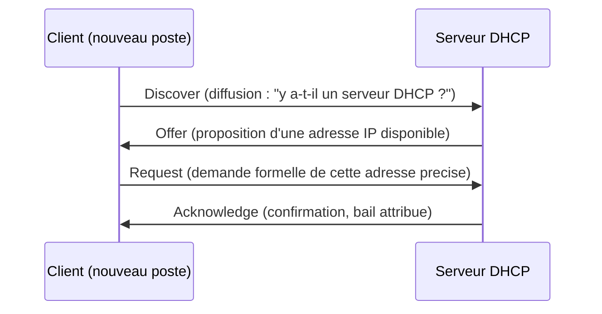
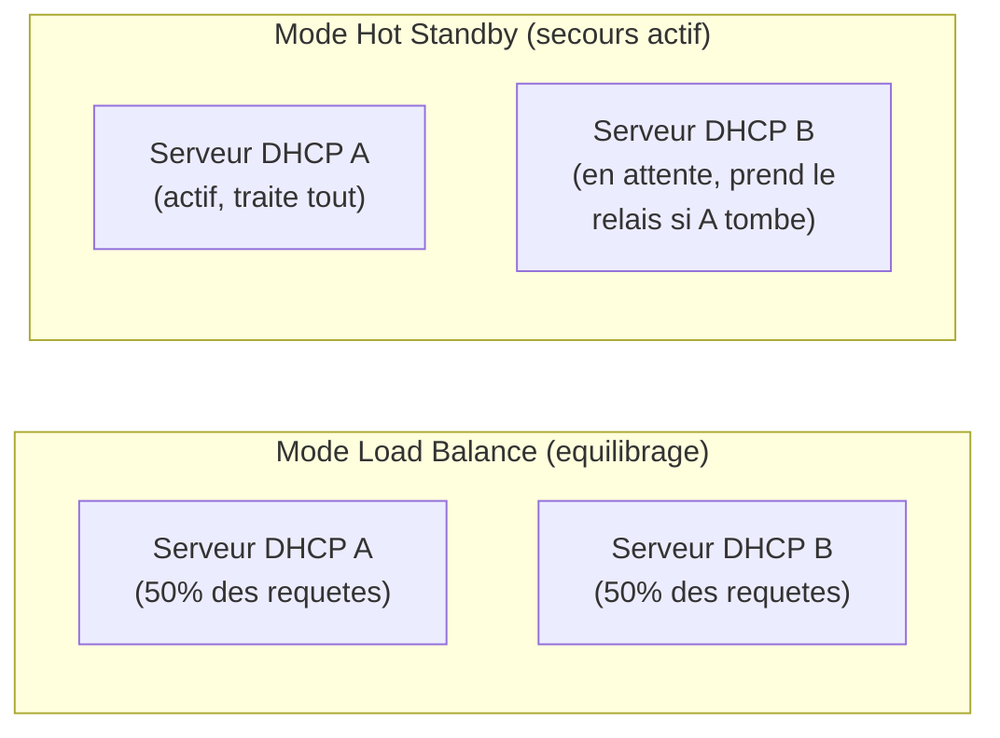

<div class="chapitre-titre-num">CHAPITRE 10</div>

# DHCP avancé : failover, réservations et scopes multiples

<div class="encadre objectif">
<span class="encadre-titre">🎯 Objectif du chapitre</span>
Comprendre le fonctionnement du DHCP au-delà de sa fonction de base (attribuer une adresse IP automatiquement), et savoir concevoir une configuration tolérante aux pannes avec des réservations fiables pour les équipements critiques. À la fin de ce chapitre, tu sauras expliquer le processus DORA, configurer un scope avec des réservations, et mettre en place un failover DHCP pour éviter qu'une panne de serveur ne prive tout un site de connectivité réseau.
</div>

<div class="encadre scenario">
<span class="encadre-titre">🎬 Mise en situation</span>
Dixième semaine. Le serveur DHCP du Cap-Haïtien — jusqu'ici un unique serveur, sans redondance — tombe en panne matérielle un mercredi après-midi. Les postes déjà connectés continuent à fonctionner (leur adresse IP reste valide jusqu'à expiration), mais tout nouvel appareil qui se connecte, ou tout poste qui redémarre, ne reçoit plus aucune adresse IP : impossible de se connecter au réseau. Le DSI, encore marqué par l'incident Active Directory du chapitre 6, te pose la question directe : <em>"On a réglé la redondance pour l'authentification. Pourquoi pas pour le DHCP ?"</em> Il a raison — et ce chapitre explique exactement comment corriger cet angle mort.
</div>

## 10.1 Le processus DORA : comment un poste obtient une adresse IP

Le protocole DHCP (*Dynamic Host Configuration Protocol*) attribue automatiquement une adresse IP (et d'autres paramètres réseau : passerelle, serveurs DNS) à un appareil qui rejoint le réseau, via un échange en quatre étapes résumé par l'acronyme **DORA** :



<div class="encadre astuce">
<span class="encadre-titre">💡 Analogie — la réception d'un hôtel</span>
DHCP fonctionne comme la réception d'un hôtel qui attribue automatiquement une chambre à chaque client qui arrive, pour une durée limitée (le <strong>bail</strong>, *lease*) : le client n'a pas besoin de connaître à l'avance quelle chambre sera libre, la réception s'en occupe et le lui communique. À la fin du séjour (l'expiration du bail), la chambre redevient disponible pour un autre client — sauf si le client renouvelle son séjour avant l'échéance, ce qu'un poste fait automatiquement en arrière-plan bien avant l'expiration de son bail DHCP.
</div>

<div class="encadre attention">
<span class="encadre-titre">⚠️ Ce qui explique le symptôme du scénario d'ouverture</span>
Un poste qui possède déjà un bail DHCP valide continue de fonctionner normalement même si le serveur DHCP tombe en panne, exactement comme un client d'hôtel déjà dans sa chambre n'a pas besoin de repasser par la réception tant que son séjour n'est pas terminé. C'est seulement un **nouveau** poste (ou un poste dont le bail a expiré, ou qui redémarre en réclamant une nouvelle adresse) qui échoue à obtenir une adresse — expliquant précisément pourquoi seuls certains appareils ont été affectés dans le scénario d'ouverture.
</div>

## 10.2 Les scopes DHCP

Un **scope** définit une plage d'adresses IP qu'un serveur DHCP peut distribuer, généralement une par sous-réseau ou par site — cohérent avec l'architecture de sites du chapitre 5.

| Site | Sous-réseau | Scope DHCP |
|---|---|---|
| Port-au-Prince | 10.10.1.0/24 | 10.10.1.50 – 10.10.1.200 |
| Cap-Haïtien | 10.10.2.0/24 | 10.10.2.50 – 10.10.2.200 |

<div class="encadre retenir">
<span class="encadre-titre">📌 À retenir</span>
Une bonne pratique de conception consiste à ne pas allouer 100% de la plage disponible d'un sous-réseau au scope DHCP — réserver une portion (souvent le début de la plage, comme <code>.1</code> à <code>.49</code> dans l'exemple ci-dessus) pour des adresses statiques manuelles (serveurs, équipements réseau) évite tout conflit d'adressage entre attribution automatique et configuration manuelle.
</div>

## 10.3 Les réservations : des adresses fixes gérées automatiquement

Une **réservation** DHCP attribue systématiquement la même adresse IP à un équipement précis (identifié par son adresse MAC), tout en conservant les avantages de la gestion centralisée du DHCP — contrairement à une adresse statique configurée manuellement sur l'équipement lui-même.

<div class="encadre bonne-pratique">
<span class="encadre-titre">✅ Bonne pratique — réservation plutôt qu'adresse statique manuelle pour les équipements semi-critiques</span>
Pour une imprimante réseau, une caméra de vidéosurveillance, ou tout équipement ayant besoin d'une adresse stable mais ne justifiant pas une configuration serveur complète, une réservation DHCP est généralement préférable à une adresse statique configurée manuellement : elle reste visible et modifiable de façon centralisée depuis la console DHCP (rejoignant directement l'inventaire du chapitre 3), plutôt que dispersée sur chaque équipement individuel, souvent oubliée avec le temps.
</div>

<div class="encadre securite">
<span class="encadre-titre">🔒 Sécurité — les serveurs critiques restent en adressage statique véritable</span>
Malgré l'avantage des réservations, les serveurs les plus critiques d'une infrastructure (contrôleurs de domaine, serveurs DHCP eux-mêmes) conservent généralement une adresse IP statique configurée directement sur le serveur, sans dépendre du tout du DHCP — un serveur DHCP ne doit jamais être dans la position paradoxale de dépendre de lui-même ou d'un autre service potentiellement indisponible pour obtenir sa propre adresse.
</div>

## 10.4 Le failover DHCP : la réponse directe au scénario d'ouverture

Windows Server permet de configurer deux serveurs DHCP en **failover**, se partageant la responsabilité d'un même scope, selon deux modes principaux :



<div class="encadre memoriser">
<span class="encadre-titre">🧠 À mémoriser — les deux modes de failover DHCP</span>
<strong>Load Balance</strong> (équilibrage de charge) : les deux serveurs traitent activement les requêtes simultanément, selon une répartition configurable — adapté quand les deux serveurs sont sur le même site ou reliés par un lien rapide et fiable. <strong>Hot Standby</strong> (secours actif) : un serveur traite l'intégralité des requêtes en fonctionnement normal, le second ne prenant le relais qu'en cas de panne du premier — souvent préféré entre deux sites distants reliés par une liaison moins rapide, comme Port-au-Prince et le Cap-Haïtien.
</div>

<div class="encadre bonne-pratique">
<span class="encadre-titre">✅ Bonne pratique — recommandation pour le scénario d'ouverture</span>
Pour corriger l'incident du scénario d'ouverture, un second serveur DHCP au Cap-Haïtien (ou un serveur central accessible en secours, en mode Hot Standby) éliminerait le point de défaillance unique — exactement le même raisonnement que le second contrôleur de domaine recommandé au chapitre 6 pour la tolérance de panne matérielle, appliqué ici au DHCP plutôt qu'à l'authentification.
</div>

## 10.5 Options DHCP : au-delà de la simple adresse IP

Un bail DHCP transmet bien plus qu'une adresse IP : les **options DHCP** configurent automatiquement des paramètres réseau essentiels pour chaque client, évitant une configuration manuelle poste par poste.

| Option | Rôle |
|---|---|
| Option 3 | Passerelle par défaut (routeur) |
| Option 6 | Serveurs DNS (chapitre 9) à utiliser |
| Option 15 | Suffixe DNS du domaine |
| Option 66/67 | Serveur et fichier de démarrage réseau (PXE, pour le déploiement de systèmes) |

<div class="encadre performance">
<span class="encadre-titre">🚀 Performance — cohérence des options entre sites</span>
Une erreur de configuration fréquente consiste à laisser des options DHCP divergentes entre deux scopes de sites différents (par exemple, un mauvais serveur DNS configuré sur un site) — un problème qui, combiné aux enseignements du chapitre 9, peut provoquer des symptômes de résolution DNS incohérents selon le site depuis lequel un utilisateur se connecte, difficiles à diagnostiquer sans vérifier spécifiquement la configuration DHCP du site concerné.
</div>

## 10.6 Diagnostiquer un problème DHCP

```
# Afficher la configuration IP actuelle d'un poste, y compris
# l'adresse du serveur DHCP qui a fourni le bail
ipconfig /all

# Liberer le bail actuel
ipconfig /release

# Redemander immediatement un nouveau bail DHCP
ipconfig /renew
```

<div class="encadre attention">
<span class="encadre-titre">🩺 Situation : "Un nouveau poste ne reçoit aucune adresse IP"</span>

- **Diagnostic** : distingue d'abord si le problème touche un seul poste (probablement un problème local : câble, pilote réseau, port switch) ou plusieurs postes simultanément sur un même site (probablement le service DHCP lui-même, comme dans le scénario d'ouverture).
- **Comment vérifier** : sur un poste symptomatique, une adresse IP de type <code>169.254.x.x</code> (attribuée automatiquement par le système d'exploitation lui-même en l'absence de réponse DHCP) confirme sans ambiguïté l'échec de l'obtention d'un bail.
- **Résolution** : si le problème touche plusieurs postes, vérifier immédiatement la disponibilité du service DHCP lui-même (redémarrage du service, panne matérielle du serveur) plutôt que de perdre du temps à diagnostiquer chaque poste individuellement.
</div>

## Atelier — Concevoir un failover DHCP pour l'entreprise

<div class="encadre exercice">
<span class="encadre-titre">🛠️ Atelier 10 — Choisir un mode de failover adapté</span>

**Objectif** : s'entraîner à choisir et justifier un mode de failover DHCP adapté à un contexte donné, en réponse directe à la demande du DSI dans le scénario d'ouverture.

**Préparation** : aucune installation nécessaire.

**Étapes détaillées** :

1. Pour le site du Cap-Haïtien, propose un mode de failover (Load Balance ou Hot Standby) entre son serveur DHCP local et un second serveur, en justifiant ton choix à partir de la section 10.4 et des enseignements du chapitre 6 sur la fiabilité de la liaison inter-sites.
2. Explique où devrait se situer physiquement ce second serveur (localement au Cap-Haïtien, ou à Port-au-Prince) et pourquoi.
3. Compare ta proposition à la section "Résultat attendu".

**Résultat attendu** : le mode Hot Standby est généralement recommandé quand les deux serveurs ne sont pas sur le même site à haute fiabilité, ce qui est le cas ici. Concernant l'emplacement du second serveur, un second serveur physiquement présent au Cap-Haïtien serait idéal pour une résilience complète (y compris en cas de coupure de la liaison inter-sites), reprenant exactement le raisonnement du contrôleur de domaine local du chapitre 5 — un second serveur uniquement à Port-au-Prince laisserait le Cap-Haïtien sans DHCP fonctionnel pendant une coupure réseau simultanée à une panne du serveur local, un scénario de double panne moins probable mais pas à exclure selon la criticité réelle du site.

**Dépannage** : si tu hésites sur l'emplacement du second serveur, reviens à la question du chapitre 6 : "qu'est-ce qui se passe si les deux pannes (matérielle et réseau) surviennent en même temps ?"
</div>

## Erreurs fréquentes

<div class="encadre attention">
<span class="encadre-titre">⚠️ Erreur n°1 — un seul serveur DHCP par site critique, sans failover</span>
Exactement la situation du scénario d'ouverture — un point de défaillance unique qui prive tout nouveau poste de connectivité réseau dès la moindre panne du serveur.
</div>

<div class="encadre attention">
<span class="encadre-titre">⚠️ Erreur n°2 — chevauchement de scopes entre deux serveurs sans failover configuré</span>
Configurer manuellement deux serveurs DHCP distincts sur la même plage d'adresses, sans utiliser le mécanisme de failover officiel, peut provoquer l'attribution de la même adresse IP à deux appareils différents simultanément — un conflit d'adressage à l'origine de dysfonctionnements réseau difficiles à diagnostiquer.
</div>

<div class="encadre attention">
<span class="encadre-titre">⚠️ Erreur n°3 — utiliser des adresses statiques manuelles au lieu de réservations pour des équipements gérés en masse</span>
Comme vu en section 10.3, cette pratique disperse la configuration réseau sur chaque équipement individuellement, au lieu de la centraliser et de la documenter automatiquement via la console DHCP.
</div>

## En entreprise

- **Bonne pratique répandue** : surveiller le taux d'utilisation de chaque scope DHCP (proportion d'adresses attribuées par rapport à la plage totale disponible) pour anticiper une saturation avant qu'elle ne bloque de nouveaux appareils — un exemple direct de performance proactive (chapitre 1, section 1.4).
- **Bonne pratique répandue** : documenter (chapitre 3) l'ensemble des réservations DHCP avec leur justification (quel équipement, pourquoi une adresse fixe est nécessaire), plutôt que de laisser s'accumuler des réservations dont personne ne se souvient plus de la raison d'être.
- **Erreur classique observée** : un scope DHCP dimensionné pour l'effectif initial d'un site, jamais révisé après une croissance significative des effectifs — provoquant une pénurie d'adresses disponibles au pire moment (souvent un jour de forte affluence).

## Entretien technique

<div class="encadre exercice">
<span class="encadre-titre">💼 Questions fréquemment posées en entretien</span>

**Q1. "Explique le processus DORA."**
Réponse attendue : Discover (le client diffuse une demande), Offer (un serveur propose une adresse disponible), Request (le client demande formellement cette adresse), Acknowledge (le serveur confirme et attribue le bail) — les quatre étapes de l'obtention d'une adresse IP via DHCP.

**Q2. "Pourquoi un poste déjà connecté continue-t-il de fonctionner même si le serveur DHCP tombe en panne ?"**
Réponse attendue : parce qu'il possède déjà un bail valide, dont la durée n'est pas immédiatement affectée par une panne du serveur — seuls les nouveaux appareils, ou ceux dont le bail arrive à expiration ou qui redémarrent en réclamant une nouvelle adresse, sont affectés par l'indisponibilité du service.

**Q3. "Quelle est la différence entre une réservation DHCP et une adresse IP statique classique ?"**
Réponse attendue : une réservation reste gérée de façon centralisée depuis le serveur DHCP (visible, modifiable, documentée dans un seul endroit), tout en garantissant systématiquement la même adresse à un équipement précis identifié par son adresse MAC — contrairement à une adresse statique configurée manuellement et directement sur chaque équipement, plus dispersée et plus facilement oubliée.
</div>

## Optimisation, sécurité et maintenabilité — les réflexes dès ce chapitre

<div class="encadre securite">
<span class="encadre-titre">🔒 Sécurité</span>
Un serveur DHCP non autorisé (*rogue DHCP*), installé par erreur ou avec une intention malveillante sur le réseau, peut distribuer de fausses informations (notamment un faux serveur DNS ou une fausse passerelle) et rediriger discrètement le trafic des postes clients — Active Directory propose un mécanisme d'autorisation de serveur DHCP qui limite ce risque pour les serveurs légitimes intégrés au domaine, à activer systématiquement.
</div>

<div class="encadre bonne-pratique">
<span class="encadre-titre">✅ Maintenabilité</span>
Documente la configuration de chaque scope (plage, options, réservations, mode de failover) au même titre que l'architecture Active Directory du chapitre 5 — une configuration DHCP mal documentée devient rapidement un mystère pour quiconque doit la faire évoluer ou la dépanner sans son créateur d'origine.
</div>

<div class="encadre performance">
<span class="encadre-titre">🚀 Performance</span>
Ajuste la durée du bail DHCP selon le contexte réel : une durée courte convient à un réseau avec beaucoup d'appareils invités temporaires (renouvellement rapide du pool disponible), une durée plus longue réduit le trafic réseau de renouvellement pour un parc d'appareils stables et permanents.
</div>

## Résumé du chapitre

- Le processus DORA (Discover, Offer, Request, Acknowledge) attribue automatiquement une adresse IP et des paramètres réseau à un appareil qui rejoint le réseau.
- Un poste avec un bail valide continue de fonctionner même si le serveur DHCP tombe en panne ; seuls les nouveaux appareils ou les baux expirés sont affectés.
- Les réservations DHCP offrent une adresse fixe gérée de façon centralisée, préférable à une adresse statique manuelle pour les équipements semi-critiques.
- Le failover DHCP (Load Balance ou Hot Standby) élimine le point de défaillance unique d'un serveur DHCP isolé — un besoin de tolérance de panne directement comparable à celui étudié pour Active Directory au chapitre 6.
- Les options DHCP transmettent bien plus qu'une adresse IP (passerelle, DNS, suffixe de domaine), et leur cohérence entre sites évite des symptômes de dysfonctionnement difficiles à diagnostiquer.

## Quiz

<div class="encadre exercice">
<span class="encadre-titre">📝 QCM (une seule bonne réponse par question)</span>

1. L'ordre correct des étapes du processus DORA est :
   - a) Offer, Discover, Acknowledge, Request
   - b) Discover, Offer, Request, Acknowledge
   - c) Request, Discover, Offer, Acknowledge
   - d) Acknowledge, Request, Offer, Discover

2. Un poste déjà connecté au réseau, avec un bail DHCP valide, en cas de panne du serveur DHCP :
   - a) Perd immédiatement sa connectivité réseau
   - b) Continue de fonctionner normalement jusqu'à l'expiration de son bail
   - c) Reçoit automatiquement une adresse IP d'un serveur de secours, même sans failover configuré
   - d) Redémarre automatiquement

3. Le mode de failover DHCP le plus adapté entre deux sites distants reliés par une liaison moins fiable est généralement :
   - a) Load Balance
   - b) Hot Standby
   - c) Aucun failover n'est jamais recommandé entre deux sites distants
   - d) Une réservation DHCP unique

**Corrigé** : 1-b, 2-b, 3-b.
</div>

<div class="encadre exercice">
<span class="encadre-titre">📝 Vrai ou Faux</span>

1. Une réservation DHCP est identifiée par l'adresse MAC de l'équipement concerné. — **Vrai**.
2. Un serveur DHCP doit toujours obtenir sa propre adresse IP via DHCP, pour rester cohérent avec le reste du parc. — **Faux** (les serveurs critiques comme le DHCP lui-même conservent une adresse statique véritable, section 10.3).
3. Une adresse IP de type 169.254.x.x indique généralement un échec d'obtention de bail DHCP. — **Vrai**.
4. Le mode Load Balance répartit les requêtes DHCP entre deux serveurs actifs simultanément. — **Vrai**.
</div>

<div class="encadre exercice">
<span class="encadre-titre">📝 Questions ouvertes</span>

1. Explique pourquoi seuls certains appareils ont été affectés par la panne du scénario d'ouverture, et pas l'ensemble du site immédiatement.
2. Un collègue propose de résoudre le problème du scénario d'ouverture en configurant un second serveur DHCP totalement indépendant, sur la même plage d'adresses, sans utiliser le mécanisme de failover officiel. Explique-lui pourquoi c'est risqué, à partir de la section 10.4 et de l'erreur n°2 de ce chapitre.

**Corrigé 1** : les postes qui possédaient déjà un bail DHCP valide au moment de la panne ont continué à fonctionner normalement, ce bail restant valable jusqu'à son expiration naturelle (section 10.1) — seuls les nouveaux appareils, ou les postes dont le bail arrivait à expiration ou qui redémarraient en réclamant une nouvelle adresse, ont été immédiatement affectés par l'indisponibilité du serveur.

**Corrigé 2** : sans le mécanisme de failover officiel de Windows Server, les deux serveurs ne coordonnent pas entre eux les adresses déjà attribuées — un risque réel que les deux serveurs proposent, de façon indépendante, la même adresse IP à deux appareils différents, provoquant un conflit d'adressage (erreur n°2 de ce chapitre) qui peut désorganiser gravement la connectivité de plusieurs appareils simultanément, un problème potentiellement pire que la panne initiale que cette solution improvisée cherchait à corriger.
</div>

## Exercices

<div class="encadre exercice">
<span class="encadre-titre">📝 Exercice 10.1</span>

Une imprimante réseau du service comptabilité a besoin d'une adresse IP stable pour que les postes puissent la retrouver de façon fiable. Explique pourquoi une réservation DHCP est généralement préférable à une adresse IP statique configurée directement sur l'imprimante.
</div>

**Corrigé :** Une réservation DHCP reste visible et modifiable de façon centralisée depuis la console du serveur DHCP, aux côtés de l'ensemble des autres réservations documentées (chapitre 3) — un changement futur (nouveau sous-réseau, réorganisation IP) peut être appliqué depuis un seul endroit. Une adresse statique configurée directement sur l'imprimante nécessite en revanche un accès physique ou une interface d'administration propre à l'équipement pour tout changement, et son existence peut facilement être oubliée avec le temps si elle n'est pas documentée séparément — un risque de conflit d'adressage si la même adresse est plus tard attribuée par erreur à un autre équipement via le DHCP.

<div class="encadre exercice">
<span class="encadre-titre">📝 Exercice 10.2</span>

Rédige, en 3 à 5 phrases, la réponse que tu donnerais au DSI (question posée dans le scénario d'ouverture) sur la mise en place d'un failover DHCP, en expliquant simplement pourquoi c'est un investissement justifié malgré le coût d'un second serveur.
</div>

**Corrigé (exemple de réponse) :** Je lui expliquerais qu'un serveur DHCP unique représente exactement le même type de risque qu'un contrôleur de domaine unique par site (chapitre 6) : tant qu'il fonctionne, tout va bien, mais sa panne prive immédiatement tout nouvel appareil de connectivité réseau, un impact potentiellement paralysant pour toute une équipe. Le coût d'un second serveur en mode Hot Standby (section 10.4) reste généralement modeste comparé au coût opérationnel d'une interruption de plusieurs heures pour l'ensemble d'un site, surtout un jour de forte activité. C'est un investissement de résilience directement comparable à celui déjà validé pour Active Directory, appliqué cette fois à un service tout aussi essentiel au quotidien.

## Checklist de fin de chapitre

<ul class="checklist">
<li>☐ Je sais expliquer le processus DORA et ses quatre étapes.</li>
<li>☐ Je comprends pourquoi un poste déjà connecté continue de fonctionner pendant une panne DHCP.</li>
<li>☐ Je sais distinguer une réservation DHCP d'une adresse IP statique classique.</li>
<li>☐ Je connais les deux modes de failover DHCP (Load Balance et Hot Standby) et quand choisir l'un plutôt que l'autre.</li>
<li>☐ Je sais diagnostiquer un problème DHCP avec `ipconfig /all`, `/release` et `/renew`.</li>
<li>☐ Je comprends le risque d'un serveur DHCP non autorisé sur le réseau.</li>
</ul>

## FAQ

<dl class="faq">
<dt>Combien de temps un bail DHCP dure-t-il généralement ?</dt>
<dd>La durée par défaut est souvent de 8 jours sur Windows Server, mais elle est entièrement configurable selon le contexte (section "Performance" de ce chapitre) — il n'existe pas de valeur universelle correcte, seulement un compromis à ajuster selon le profil réel du réseau concerné.</dd>

<dt>Un poste peut-il avoir plusieurs baux DHCP simultanément sur des réseaux différents ?</dt>
<dd>Oui, chaque interface réseau (filaire, Wi-Fi) obtient son propre bail indépendamment des autres — un ordinateur portable connecté à la fois en Wi-Fi et en filaire peut avoir deux adresses IP simultanées, une par interface active.</dd>

<dt>Le failover DHCP nécessite-t-il une licence ou un composant supplémentaire ?</dt>
<dd>Non, le failover DHCP est une fonctionnalité native de Windows Server depuis plusieurs versions, sans coût de licence additionnel au-delà du serveur lui-même — un argument supplémentaire en faveur de son adoption, comme évoqué dans le corrigé de l'exercice 10.2.</dd>

<dt>Que se passe-t-il si les deux scopes DHCP de deux sites différents se chevauchent par erreur ?</dt>
<dd>Un risque réel de conflit d'adressage IP entre les deux sites, potentiellement difficile à diagnostiquer car les symptômes (deux appareils incapables de communiquer correctement) peuvent sembler sans lien évident avec une cause DHCP au premier abord — une bonne raison de documenter clairement (chapitre 3) et de faire relire la planification d'adressage avant tout déploiement.</dd>
</dl>

## Références et pour aller plus loin

- Microsoft Learn — Vue d'ensemble du DHCP sur Windows Server : [https://learn.microsoft.com/fr-fr/windows-server/networking/technologies/dhcp/dhcp-top](https://learn.microsoft.com/fr-fr/windows-server/networking/technologies/dhcp/dhcp-top)
- Microsoft Learn — Configurer le failover DHCP : [https://learn.microsoft.com/fr-fr/windows-server/networking/technologies/dhcp/dhcp-failover](https://learn.microsoft.com/fr-fr/windows-server/networking/technologies/dhcp/dhcp-failover)

*Chapitre suivant : services de fichiers et d'impression — DFS, quotas et FSRM, les briques qui permettent de partager et de gérer efficacement le stockage documentaire d'une organisation multi-sites.*
