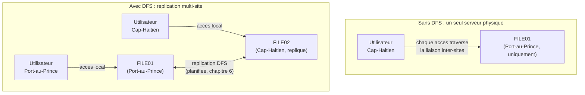
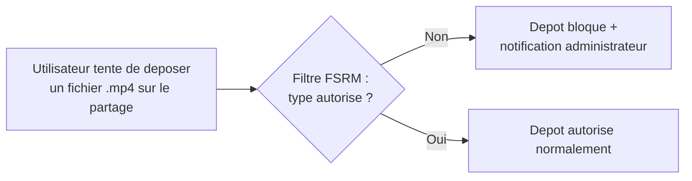

CHAPITRE 11

# Services de fichiers et d'impression : DFS, quotas et FSRM

🎯 Objectif du chapitre
Comprendre comment organiser un stockage de fichiers partagé cohérent à travers une organisation multi-sites, et comment prévenir la saturation d'espace disque avant qu'elle ne devienne un incident critique. À la fin de ce chapitre, tu sauras concevoir un espace de noms DFS unifié, configurer des quotas et des filtres de type de fichier avec FSRM, et comprendre les compromis entre réplication DFS synchrone et asynchrone.

🎬 Mise en situation
Onzième semaine. Depuis l'ouverture du bureau du Cap-Haïtien, les employés des deux sites accèdent au même serveur de fichiers partagé, physiquement situé à Port-au-Prince, via des chemins comme <code>\\FILE01\Sinistres</code>. Les utilisateurs du Cap-Haïtien se plaignent régulièrement de lenteurs pour ouvrir de gros documents. Par ailleurs, une alerte t'informe qu'un utilisateur du service marketing a rempli près de 40 Go de son quota avec des fichiers vidéo personnels, poussant le serveur de fichiers vers la saturation — exactement le type d'alerte "espace disque à 78%" évoqué dès le chapitre 1. Le DSI te demande de résoudre les deux problèmes : la lenteur d'accès distant, et la dérive d'usage du stockage. Ce chapitre couvre les deux réponses.

## 11.1 DFS : un espace de noms unifié, indépendant de l'emplacement physique

**DFS** (*Distributed File System*) se compose de deux briques complémentaires mais distinctes : l'**espace de noms DFS** (DFS Namespaces) et la **réplication DFS** (DFS Replication).

💡 Analogie — un standard téléphonique unique pour plusieurs bureaux
Un espace de noms DFS fonctionne comme un standard téléphonique unique qui redirige un appel vers le bureau le plus approprié, sans que l'appelant ait besoin de connaître le numéro direct de chaque bureau : les utilisateurs accèdent toujours au même chemin logique (<code>\\assuranceht.local\Documents\Sinistres</code>), quel que soit le serveur physique réel qui répond effectivement à cette demande selon leur emplacement.

📌 À retenir
L'**espace de noms** DFS masque l'emplacement physique réel des fichiers derrière un chemin logique unique et stable ; la **réplication** DFS synchronise le contenu entre plusieurs serveurs pour que ce chemin logique reste cohérent, quel que soit le serveur physique interrogé. Les deux briques se combinent généralement, mais peuvent aussi être utilisées séparément selon le besoin réel.

## 11.2 Résoudre la lenteur du scénario d'ouverture avec DFS

🚀 Performance — même principe que la réplication Active Directory
La solution au problème de lenteur du scénario d'ouverture reprend directement le raisonnement du chapitre 5 sur les contrôleurs de domaine locaux par site : un second serveur de fichiers physiquement présent au Cap-Haïtien, répliqué via DFS Replication, permet aux utilisateurs locaux d'accéder à une copie proche plutôt que de traverser systématiquement la liaison inter-sites pour chaque ouverture de fichier, en particulier les fichiers volumineux évoqués dans le scénario.

⚠️ Le risque introduit par la réplication multi-site : les conflits d'édition simultanée
Dès qu'un même fichier peut être modifié depuis deux sites différents entre deux cycles de réplication, un risque de conflit apparaît — similaire, dans son principe, au conflit de nommage Active Directory étudié au chapitre 6. DFS Replication détecte ce type de conflit (deux versions modifiées du même fichier avant synchronisation) et conserve généralement la version la plus récente tout en déplaçant l'autre dans un dossier de conflits caché, plutôt que de fusionner ou de perdre silencieusement des données — mais cela reste une situation à éviter autant que possible par une bonne organisation des usages (par exemple, un dosser par site pour les documents de travail en cours, partagé seulement une fois finalisé).

## 11.3 Les quotas : prévenir la saturation avant qu'elle ne devienne un incident

Rappel du chapitre 1 (section 1.4) : la performance proactive consiste à agir avant que le seuil critique soit atteint. Les **quotas** de stockage appliquent ce principe directement à l'espace disque, en limitant la quantité de données qu'un utilisateur ou un dossier peut occuper.

✅ Bonne pratique — un quota avec avertissement progressif, pas un blocage brutal
Une bonne configuration de quota ne se contente pas d'un blocage strict à un seuil unique : elle envoie un avertissement automatique à l'utilisateur (et souvent à l'administrateur) à 80% du quota, puis un second à 90%, avant le blocage effectif à 100% — laissant à l'utilisateur le temps de faire le ménage lui-même ou de solliciter une augmentation justifiée, plutôt que de découvrir un blocage bloquant en pleine tâche urgente.

## 11.4 FSRM : au-delà du simple quota

**FSRM** (*File Server Resource Manager*) étend la gestion du stockage bien au-delà du quota simple, avec deux fonctionnalités particulièrement utiles au scénario d'ouverture :

- **Filtrage de type de fichier** (*File Screening*) : bloque ou alerte sur le dépôt de types de fichiers non désirés (par exemple, des fichiers vidéo ou exécutables sur un partage destiné aux documents bureautiques) — exactement le type de contrôle qui aurait pu prévenir, ou au moins signaler rapidement, l'usage détourné du service marketing dans le scénario d'ouverture.
- **Rapports de stockage** : génère des rapports périodiques identifiant les plus gros consommateurs d'espace, les fichiers dupliqués, ou les fichiers non modifiés depuis longtemps (candidats à l'archivage).

🔒 Sécurité — FSRM comme outil de conformité, pas seulement de capacité
Au-delà de la gestion de l'espace disque, le filtrage de type de fichier constitue un contrôle de conformité utile : il empêche (ou du moins signale) le dépôt de contenus totalement étrangers à l'usage professionnel prévu d'un partage — un contrôle préventif qui rejoint la logique du principe du moindre privilège appliqué non pas aux accès, mais aux usages autorisés d'une ressource.

## 11.5 Concevoir la réponse complète au scénario d'ouverture

En combinant les outils de ce chapitre :

1. **Pour la lenteur** : ajout d'un second serveur de fichiers au Cap-Haïtien, intégré dans un espace de noms DFS unifié avec réplication planifiée vers Port-au-Prince (section 11.2).
2. **Pour la saturation** : configuration d'un quota avec avertissement progressif sur les dossiers personnels des utilisateurs (section 11.3).
3. **Pour prévenir la récidive** : filtrage de type de fichier FSRM interdisant les formats vidéo et exécutables sur les partages bureautiques, avec un rapport de stockage hebdomadaire envoyé automatiquement au DSI (section 11.4).

🧠 À mémoriser
Ce chapitre illustre un principe déjà rencontré à plusieurs reprises dans ce manuel : un même incident (lenteur perçue par l'utilisateur, saturation de stockage) révèle souvent plusieurs causes distinctes qui appellent des solutions différentes et complémentaires, plutôt qu'une seule réponse universelle — la démarche de diagnostic méthodique du chapitre 1 s'applique ici exactement de la même façon.

## Atelier — Concevoir un espace de noms DFS pour l'entreprise

🛠️ Atelier 11 — Structurer les partages de l'entreprise

**Objectif** : s'entraîner à concevoir un espace de noms DFS cohérent, en tenant compte à la fois de la structure organisationnelle et de la localisation géographique.

**Préparation** : aucune installation nécessaire.

**Étapes détaillées** :

1. Propose une structure d'espace de noms DFS pour l'entreprise d'assurance, avec au moins trois dossiers de premier niveau reflétant les grandes fonctions de l'entreprise (par exemple : Sinistres, Comptabilité, RH).
2. Pour chacun, indique s'il devrait être répliqué vers les deux sites (accès fréquent depuis les deux sites) ou rester sur un seul serveur physique (accès majoritairement local à un seul site).
3. Propose un quota par défaut raisonnable pour les dossiers personnels des utilisateurs, en justifiant ton choix.
4. Compare ta proposition à la section "Résultat attendu".

**Résultat attendu** : les dossiers à fort usage transversal entre les deux sites (comme "Sinistres", accédé quotidiennement par les deux bureaux) justifient une réplication complète comme au scénario d'ouverture ; un dossier "RH" avec un usage très majoritairement local à Port-au-Prince pourrait rester sur un seul serveur sans réplication complète, en fonction de la réalité organisationnelle réelle de l'entreprise. Un quota par défaut modéré (par exemple 5 à 10 Go par utilisateur pour des documents bureautiques standards) avec avertissement progressif (section 11.3) constitue un point de départ raisonnable, ajustable au cas par cas pour des besoins justifiés supérieurs.

**Dépannage** : si tu hésites sur la nécessité de répliquer un dossier donné, pose-toi la question : "à quelle fréquence les utilisateurs du site distant ont-ils réellement besoin d'y accéder, et la lenteur actuelle constitue-t-elle un problème réel pour eux ?"

## Erreurs fréquentes

⚠️ Erreur n°1 — répliquer tous les partages sans discernement
Répliquer un dossier peu utilisé depuis un site distant consomme de la bande passante et de l'espace disque sans bénéfice réel — la réplication DFS doit être appliquée avec discernement (section 11.5), pas systématiquement à l'ensemble des partages par réflexe.

⚠️ Erreur n°2 — un quota sans avertissement progressif
Un blocage brutal à 100% sans avertissement préalable surprend l'utilisateur au pire moment, souvent en pleine tâche urgente — rappel direct de la bonne pratique de la section 11.3.

⚠️ Erreur n°3 — ignorer les rapports de stockage FSRM une fois configurés
Configurer des rapports périodiques sans jamais les consulter revient à ne pas les avoir configurés du tout — la supervision proactive (chapitre 1) exige une consultation régulière, pas seulement une génération automatique ignorée.

## En entreprise

- **Bonne pratique répandue** : réviser périodiquement la pertinence de la structure d'espace de noms DFS et des politiques de réplication à mesure que l'organisation évolue (nouveaux sites, nouveaux usages), plutôt que de considérer une conception initiale comme définitive.
- **Bonne pratique répandue** : combiner quotas et filtrage de type de fichier plutôt que l'un sans l'autre — un quota seul n'empêche pas un usage détourné dans la limite autorisée, tandis qu'un filtrage seul n'empêche pas l'accumulation excessive de fichiers légitimes.
- **Erreur classique observée** : une réplication DFS mal planifiée qui sature une liaison inter-sites déjà limitée (rappel du chapitre 6 sur l'équilibre entre fraîcheur et charge réseau), provoquant paradoxalement une dégradation de performance plutôt que l'amélioration recherchée.

## Entretien technique

💼 Questions fréquemment posées en entretien

**Q1. "Quelle est la différence entre l'espace de noms DFS et la réplication DFS ?"**
Réponse attendue : l'espace de noms masque l'emplacement physique réel derrière un chemin logique unique ; la réplication synchronise le contenu entre plusieurs serveurs pour que ce chemin logique reste cohérent quel que soit le serveur physique interrogé — les deux se combinent généralement mais restent des briques distinctes.

**Q2. "Comment configurerais-tu un quota pour éviter de surprendre brutalement un utilisateur ?"**
Réponse attendue : en configurant des seuils d'avertissement progressifs (par exemple à 80% et 90% du quota) avant le blocage effectif à 100%, laissant à l'utilisateur le temps d'agir ou de solliciter une augmentation justifiée plutôt qu'un blocage sans préavis.

**Q3. "Que se passe-t-il si un même fichier est modifié simultanément sur deux sites différents avant que la réplication DFS n'ait eu lieu ?"**
Réponse attendue : un conflit est détecté au moment de la réplication ; la version la plus récente est généralement conservée sous le nom original, l'autre étant déplacée dans un dossier de conflits caché plutôt que fusionnée ou perdue silencieusement — un mécanisme de résolution proche, dans son principe, de celui des conflits de réplication Active Directory du chapitre 6.

## Optimisation, sécurité et maintenabilité — les réflexes dès ce chapitre

🔒 Sécurité
Le filtrage de type de fichier FSRM constitue une couche de défense supplémentaire, mais pas une garantie absolue (un utilisateur déterminé peut renommer l'extension d'un fichier pour contourner un filtre simple) — il complète, sans le remplacer, un contrôle d'accès basé sur les permissions NTFS et les groupes de sécurité (approfondi en Partie 4).

✅ Maintenabilité
Documente la structure de l'espace de noms DFS, la politique de réplication par dossier, et les quotas appliqués (chapitre 3) — une structure DFS complexe non documentée devient rapidement difficile à faire évoluer sereinement pour quiconque n'a pas participé à sa conception initiale.

🚀 Performance
La réplication DFS, comme la réplication Active Directory du chapitre 6, doit être planifiée en tenant compte de la bande passante réellement disponible sur chaque liaison inter-sites — une réplication de gros volumes de données mal planifiée peut saturer une liaison déjà sollicitée par d'autres usages critiques.

## Résumé du chapitre

- DFS combine un espace de noms unifié (chemin logique stable, indépendant de l'emplacement physique réel) et une réplication (synchronisation du contenu entre plusieurs serveurs).
- Un second serveur de fichiers local par site, répliqué via DFS, réduit la latence perçue pour les utilisateurs distants — le même raisonnement que les contrôleurs de domaine locaux du chapitre 5.
- La réplication multi-site introduit un risque de conflit d'édition simultanée, détecté et géré automatiquement, mais à limiter par une bonne organisation des usages.
- Les quotas avec avertissement progressif préviennent la saturation d'espace disque sans surprendre brutalement l'utilisateur.
- FSRM étend la gestion au-delà du simple quota : filtrage de type de fichier et rapports de stockage périodiques.

## Quiz

📝 QCM (une seule bonne réponse par question)

1. L'espace de noms DFS sert principalement à :
   - a) Chiffrer les fichiers partagés
   - b) Masquer l'emplacement physique réel derrière un chemin logique unique
   - c) Sauvegarder automatiquement les fichiers
   - d) Compresser les fichiers volumineux

2. FSRM permet notamment de :
   - a) Créer des comptes utilisateurs
   - b) Filtrer les types de fichiers autorisés sur un partage
   - c) Configurer le DNS
   - d) Gérer les rôles FSMO

3. La bonne pratique pour un quota de stockage est de :
   - a) Bloquer immédiatement à 100% sans avertissement préalable
   - b) Ne jamais imposer de quota, pour éviter de frustrer les utilisateurs
   - c) Envoyer des avertissements progressifs avant le blocage effectif
   - d) Appliquer un quota identique à tous les serveurs sans exception

**Corrigé** : 1-b, 2-b, 3-c.

📝 Vrai ou Faux

1. La réplication DFS élimine tout risque de conflit d'édition simultanée entre deux sites. — **Faux** (le risque existe, mais est détecté et géré, section 11.2).
2. Un espace de noms DFS et la réplication DFS sont deux briques distinctes, utilisables séparément ou ensemble. — **Vrai**.
3. FSRM peut générer des rapports périodiques identifiant les plus gros consommateurs d'espace disque. — **Vrai**.
4. Répliquer systématiquement tous les partages vers tous les sites est toujours la meilleure pratique. — **Faux** (à appliquer avec discernement, section 11.5).

📝 Questions ouvertes

1. Explique pourquoi la lenteur d'accès du scénario d'ouverture n'est pas un problème DNS (chapitre 9) ni DHCP (chapitre 10), mais un problème d'architecture de stockage.
2. Un collègue affirme qu'un quota suffit à lui seul pour empêcher un usage détourné comme celui du service marketing dans le scénario d'ouverture. Corrige cette affirmation à partir de la section 11.4.

**Corrigé 1** : le DNS (résolution de noms) et le DHCP (attribution d'adresses IP) fonctionnaient tous deux normalement dans ce scénario — les utilisateurs du Cap-Haïtien accédaient correctement au bon serveur, à la bonne adresse. Le problème provient de la distance physique et de la qualité de la liaison inter-sites que chaque accès devait traverser pour atteindre un serveur unique situé à Port-au-Prince — un problème d'architecture de distribution des données, pas de résolution de nom ou d'adressage réseau.

**Corrigé 2** : un quota limite uniquement la *quantité* totale d'espace utilisé, pas le *type* de contenu déposé — un utilisateur pourrait rester dans la limite de son quota tout en continuant à stocker des fichiers totalement étrangers à l'usage professionnel prévu. Le filtrage de type de fichier FSRM (section 11.4) est nécessaire en complément pour contrôler spécifiquement quels types de fichiers sont autorisés sur un partage donné, indépendamment de la quantité d'espace occupée.

## Exercices

📝 Exercice 11.1

Explique la différence entre un conflit de réplication DFS et un conflit de réplication Active Directory (chapitre 6), en termes de ce qui est en conflit et comment chacun est résolu.

**Corrigé :** Dans Active Directory (chapitre 6), un conflit survient typiquement quand deux objets portant le même nom sont créés indépendamment sur deux contrôleurs différents ; la résolution renomme automatiquement l'un des deux objets. Dans DFS Replication, un conflit survient quand un même fichier est modifié sur deux serveurs différents avant que la réplication n'ait eu lieu ; la résolution conserve généralement la version la plus récente sous le nom original et déplace l'autre version dans un dossier de conflits caché, plutôt que de la supprimer silencieusement — dans les deux cas, le principe commun est qu'aucune donnée n'est perdue silencieusement, mais le mécanisme précis de résolution diffère selon la nature de l'objet en conflit.

📝 Exercice 11.2

Rédige, en 3 à 5 phrases, un plan d'action complet (reprenant les trois mesures de la section 11.5) que tu présenterais au DSI pour résoudre à la fois la lenteur et la saturation évoquées dans le scénario d'ouverture.

**Corrigé (exemple de réponse) :** Je proposerais d'abord l'ajout d'un second serveur de fichiers au Cap-Haïtien, intégré dans un espace de noms DFS unifié avec réplication planifiée, pour que les utilisateurs locaux accèdent à une copie proche plutôt que de traverser systématiquement la liaison inter-sites. Ensuite, je configurerais des quotas avec avertissement progressif sur les dossiers personnels pour prévenir toute nouvelle saturation avant qu'elle ne devienne critique. Enfin, j'activerais un filtrage de type de fichier FSRM interdisant les formats non professionnels (vidéo, exécutables) sur les partages bureautiques, avec un rapport hebdomadaire automatique pour détecter rapidement toute nouvelle dérive d'usage similaire à celle du service marketing.

## Checklist de fin de chapitre

<ul class="checklist">
<li>☐ Je sais distinguer l'espace de noms DFS de la réplication DFS.</li>
<li>☐ Je comprends comment DFS résout un problème de lenteur d'accès distant multi-sites.</li>
<li>☐ Je sais expliquer comment un conflit d'édition simultanée est détecté et géré par DFS Replication.</li>
<li>☐ Je sais configurer un quota avec avertissement progressif plutôt qu'un blocage brutal.</li>
<li>☐ Je comprends le rôle de FSRM au-delà du simple quota (filtrage de type de fichier, rapports).</li>
</ul>

## FAQ

<dl class="faq">
<dt>Faut-il toujours utiliser DFS, même pour une entreprise avec un seul site ?</dt>
<dd>Non, l'espace de noms DFS reste utile même sur un site unique (simplification des chemins, migration transparente entre serveurs), mais la réplication multi-serveurs n'a d'intérêt réel que dès qu'il existe plusieurs sites ou plusieurs serveurs à synchroniser — pour une entreprise mono-site avec un seul serveur de fichiers, un partage classique suffit souvent.</dd>

<dt>La réplication DFS remplace-t-elle une sauvegarde ?</dt>
<dd>Non, absolument pas — une réplication synchronise les changements, y compris une suppression accidentelle ou une corruption, vers l'ensemble des copies répliquées. Une vraie sauvegarde (approfondie en Partie 5) conserve des versions historiques distinctes, permettant de revenir à un état antérieur, ce qu'une simple réplication ne permet pas par elle-même.</dd>

<dt>Peut-on appliquer un quota différent selon le service ou le rôle de l'utilisateur ?</dt>
<dd>Oui, FSRM permet des modèles de quotas différenciés, appliqués selon le dossier ou le groupe concerné — rien n'oblige à un quota strictement identique pour tous les utilisateurs de l'organisation, contrairement à ce que suggère à tort l'option d du QCM de ce chapitre.</dd>

<dt>Le filtrage de type de fichier bloque-t-il aussi les fichiers déjà existants sur le partage ?</dt>
<dd>Non, il s'applique aux nouveaux dépôts à partir du moment de son activation — un rapport de stockage FSRM (section 11.4) permet en complément d'identifier les fichiers déjà présents qui enfreindraient la nouvelle politique, pour un nettoyage manuel ou semi-automatisé ultérieur.</dd>
</dl>

## Références et pour aller plus loin

- Microsoft Learn — Vue d'ensemble de DFS Namespaces et DFS Replication : [https://learn.microsoft.com/fr-fr/windows-server/storage/dfs-namespaces/dfs-overview](https://learn.microsoft.com/fr-fr/windows-server/storage/dfs-namespaces/dfs-overview)
- Microsoft Learn — File Server Resource Manager (FSRM) : [https://learn.microsoft.com/fr-fr/windows-server/storage/fsrm/fsrm-overview](https://learn.microsoft.com/fr-fr/windows-server/storage/fsrm/fsrm-overview)

*Chapitre suivant : WSUS et gestion des mises à jour — comment déployer les correctifs de sécurité de façon contrôlée à l'ensemble du parc, sans jamais reproduire les risques d'un déploiement non testé étudiés au chapitre 2.*
