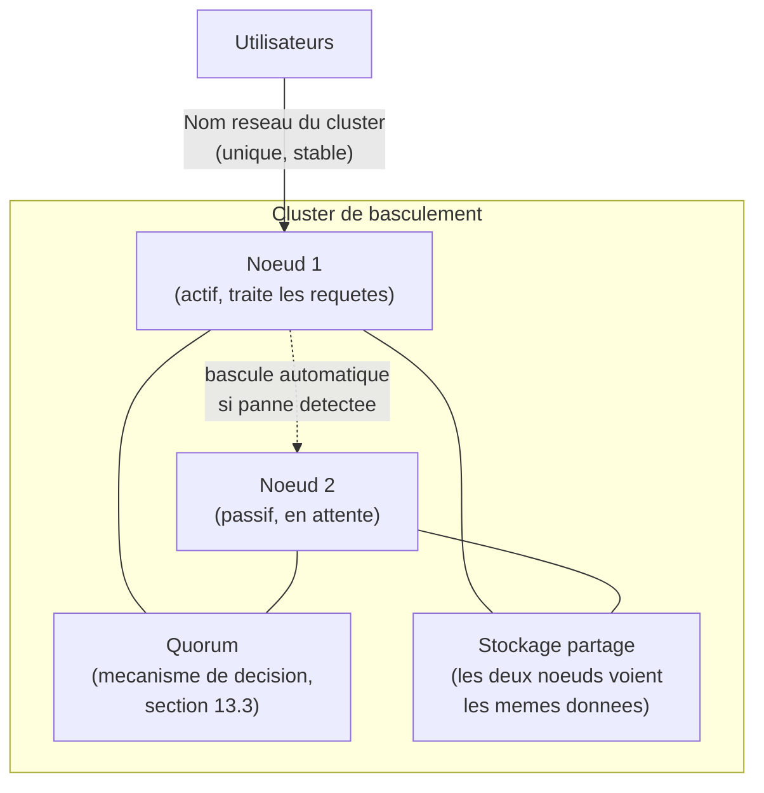
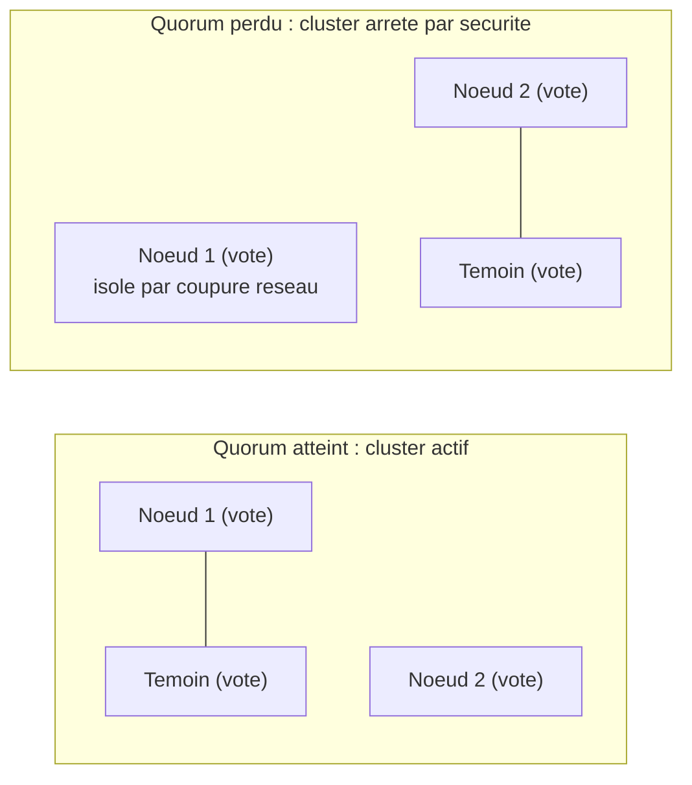

CHAPITRE 13

# Clustering et haute disponibilité Windows Server

🎯 Objectif du chapitre
Comprendre comment garantir la continuité d'un service critique même en cas de panne totale d'un serveur, en allant au-delà des mécanismes de tolérance de panne déjà rencontrés (Active Directory au chapitre 6, DHCP au chapitre 10). À la fin de ce chapitre, tu sauras expliquer le fonctionnement d'un cluster de basculement (*Failover Clustering*), le rôle du quorum, et pourquoi la haute disponibilité ne se résume pas à "ajouter un second serveur".

🎬 Mise en situation
Treizième semaine, dernière de cette partie consacrée à Windows Server. Le service de gestion des sinistres — l'application la plus critique de l'entreprise, mentionnée dès le chapitre 1 — tourne sur un seul serveur applicatif. Un vendredi soir, une panne matérielle immobilise ce serveur pendant six heures, bloquant tout traitement de sinistre jusqu'au lundi matin puisque personne n'était d'astreinte pour ce système précis (contrairement à Active Directory et au DHCP, désormais couverts par les mesures des chapitres 6 et 10). Le DSI, désormais bien formé aux principes de tolérance de panne rencontrés dans cette partie, te pose une question directe : <em>"Peut-on faire pour cette application ce qu'on a fait pour Active Directory et le DHCP — un second serveur qui prend le relais automatiquement ?"</em> La réponse est oui, mais avec une nuance importante que ce chapitre explique : la haute disponibilité applicative est un problème plus complexe que la simple duplication d'un serveur.

## 13.1 Pourquoi "ajouter un second serveur" ne suffit pas toujours

⚠️ La différence entre redondance et haute disponibilité automatique
Les mécanismes vus aux chapitres 6 et 10 (plusieurs contrôleurs de domaine, failover DHCP) fonctionnent parce qu'Active Directory et DHCP sont conçus, nativement, pour fonctionner en parallèle sur plusieurs serveurs simultanément, avec une coordination intégrée. Une application métier classique, comme le service de gestion des sinistres du scénario d'ouverture, n'est généralement <strong>pas</strong> conçue de cette façon par défaut : deux instances indépendantes de l'application, chacune avec sa propre copie de données, risqueraient une incohérence grave (deux sinistres enregistrés en parallèle sur deux bases différentes, jamais réconciliées). Un mécanisme spécifique — le cluster de basculement — est nécessaire pour garantir qu'un seul serveur traite activement les requêtes à un instant donné, tout en permettant un basculement automatique en cas de panne.

💡 Analogie — une équipe de garde, pas deux équipes simultanées
Un cluster de basculement fonctionne comme une équipe de garde dans un hôpital : à un instant donné, une seule équipe est officiellement "de service" et prend les décisions, même si une seconde équipe est présente et prête à prendre immédiatement le relais si la première devient indisponible. Les deux équipes ne traitent jamais les mêmes patients en même temps de façon indépendante, ce qui créerait un chaos organisationnel — exactement le risque qu'un cluster de basculement évite pour une application.

## 13.2 Les briques d'un cluster de basculement Windows Server

📌 À retenir
Un cluster de basculement repose sur trois éléments essentiels : plusieurs <strong>nœuds</strong> (serveurs physiques ou virtuels membres du cluster), un <strong>stockage partagé</strong> (ou répliqué) accessible par tous les nœuds pour garantir la cohérence des données, et un mécanisme de <strong>quorum</strong> qui détermine qui a le droit d'être actif à un instant donné — les utilisateurs, eux, se connectent toujours à un <strong>nom réseau unique</strong> du cluster, sans avoir besoin de savoir quel nœud physique traite réellement leur requête à ce moment précis.

## 13.3 Le quorum : éviter le scénario du "cerveau divisé"

Le **quorum** est le mécanisme qui empêche un problème particulièrement dangereux, appelé *split-brain* (cerveau divisé) : une situation où, suite à une coupure réseau entre les nœuds (et non une vraie panne d'un nœud), **chaque** nœud croit à tort être le seul survivant et devient actif simultanément — provoquant exactement l'incohérence de données évoquée en section 13.1.

🔒 Sécurité — pourquoi le split-brain est plus dangereux qu'une simple panne
Une panne franche d'un nœud est un problème simple à gérer : l'autre nœud prend le relais, sans ambiguïté. Un split-brain est bien plus insidieux, car <strong>les deux nœuds semblent fonctionner correctement</strong> à leurs propres yeux, chacun ignorant l'existence de l'autre — un risque de corruption de données bien plus difficile à détecter et à corriger après coup qu'une simple interruption de service.

Windows Server Failover Clustering utilise un système de "votes" : chaque nœud dispose d'un vote, et un **témoin** (*witness*) — souvent un partage de fichiers désigné ou un service cloud dédié — peut apporter un vote supplémentaire pour départager une situation à effectifs pairs. Le cluster ne reste opérationnel (actif) que s'il dispose de la **majorité** des votes disponibles.

🧠 À mémoriser
Face à une ambiguïté (coupure réseau entre nœuds, par exemple), un cluster bien conçu préfère <strong>s'arrêter par sécurité</strong> plutôt que de risquer une incohérence de données en laissant deux nœuds actifs simultanément — un choix qui peut sembler contre-intuitif ("pourquoi le cluster s'arrête-t-il alors que les deux serveurs fonctionnent individuellement ?"), mais qui protège l'intégrité des données au prix d'une indisponibilité temporaire, un compromis presque toujours préférable à une corruption silencieuse.

## 13.4 Le stockage partagé : la contrainte la plus structurante

Rappel de la section 13.1 : le vrai défi d'un cluster n'est pas de dupliquer le serveur applicatif, mais de garantir que les données restent cohérentes entre les nœuds. Plusieurs approches existent :

| Approche | Fonctionnement | Cas d'usage typique |
|---|---|---|
| **Stockage partagé physique** (SAN) | Les deux nœuds accèdent physiquement au même stockage externe | Environnements avec infrastructure SAN existante (Partie 5) |
| **Espaces de stockage partagés** (*Storage Spaces Direct*) | Réplication du stockage local entre nœuds, sans SAN dédié | PME sans infrastructure SAN, coût réduit |
| **Réplication applicative propre** | L'application elle-même gère sa propre cohérence entre instances (cas de nombreuses bases de données modernes) | Applications conçues nativement pour la haute disponibilité |

✅ Bonne pratique — vérifier la compatibilité de l'application avant de promettre une solution
Avant de répondre au DSI que le clustering "résoudra" le problème du service de gestion des sinistres, une étape indispensable consiste à vérifier si cette application supporte réellement un fonctionnement en cluster (beaucoup d'applications legacy ne le supportent pas nativement) — une vérification similaire, dans l'esprit, à celle recommandée avant tout changement au chapitre 2 : comprendre l'impact réel avant d'agir, plutôt que de promettre une solution technique sans l'avoir validée pour ce cas précis.

## 13.5 Répondre honnêtement à la question du DSI

🎯 Une réponse nuancée, pas un simple "oui"
La bonne réponse au DSI n'est ni un "oui" simpliste, ni un refus — c'est une réponse structurée : <em>"Techniquement possible, à condition de vérifier d'abord que l'application le supporte, et d'investir dans un stockage partagé ou répliqué adapté. C'est un projet plus complexe que l'ajout d'un second contrôleur de domaine, avec un coût et un délai de mise en œuvre à évaluer précisément avant de s'engager."</em> Cette honnêteté professionnelle rejoint directement la compétence humaine du chapitre 1 (section 1.6) : admettre la complexité réelle plutôt que promettre une solution simplifiée à l'excès.

## Atelier — Évaluer la faisabilité du clustering pour le scénario d'ouverture

🛠️ Atelier 13 — Poser les bonnes questions avant de s'engager

**Objectif** : s'entraîner à identifier les vérifications préalables nécessaires avant de proposer une solution de clustering, plutôt que de promettre une solution sans l'avoir validée.

**Préparation** : aucune installation nécessaire.

**Étapes détaillées** :

1. Liste au moins quatre questions que tu poserais avant de confirmer au DSI que le clustering est une solution viable pour le service de gestion des sinistres, en t'appuyant sur les sections 13.4 et 13.5.
2. Pour chaque question, explique brièvement pourquoi la réponse influence directement la faisabilité ou le coût du projet.
3. Compare ta liste à la section "Résultat attendu".

**Résultat attendu** : les questions attendues incluent au minimum : "L'application supporte-t-elle nativement un fonctionnement en cluster ?" (sans quoi le projet est irréalisable tel quel) ; "Quel type de stockage partagé est disponible ou budgétisable ?" (SAN existant, Storage Spaces Direct, ou aucun investissement prévu) ; "Où sera positionné le témoin de quorum, et est-il lui-même suffisamment fiable ?" (un témoin unique mal placé peut lui-même devenir un point de défaillance) ; "Quelle indisponibilité l'entreprise est-elle prête à accepter en attendant la mise en œuvre complète ?" (une mesure de mitigation temporaire, comme une astreinte dédiée à cette application, pourrait combler l'écart en attendant le projet complet).

**Dépannage** : si tu as du mal à formuler ces questions, relis la section 13.5 — l'objectif est d'éviter de promettre une solution avant d'avoir confirmé qu'elle est réellement applicable à ce cas précis.

## Erreurs fréquentes

⚠️ Erreur n°1 — croire que "ajouter un serveur" suffit à garantir la haute disponibilité
Comme vu en section 13.1, sans mécanisme de coordination (cluster, quorum, stockage cohérent), deux serveurs indépendants créent un risque d'incohérence plutôt qu'une vraie protection.

⚠️ Erreur n°2 — un témoin de quorum mal positionné
Placer le témoin de quorum sur le même site physique qu'un seul des deux nœuds (plutôt que dans un emplacement réellement indépendant) recrée un point de défaillance unique : si ce site précis tombe, le nœud restant ailleurs perd potentiellement le quorum malgré son bon fonctionnement individuel.

⚠️ Erreur n°3 — négliger de tester réellement un basculement
Comme pour une sauvegarde jamais testée (chapitre 1) ou un runbook jamais éprouvé (chapitre 3), un cluster configuré mais jamais soumis à un test réel de basculement (provoquer volontairement l'arrêt d'un nœud actif en environnement contrôlé) reste une garantie théorique, pas prouvée.

## En entreprise

- **Bonne pratique répandue** : planifier des tests de basculement réguliers en dehors des heures de forte activité, pour vérifier que le mécanisme fonctionne réellement comme prévu, plutôt que de découvrir un défaut de configuration au moment précis d'une vraie panne.
- **Bonne pratique répandue** : documenter (chapitre 3) la procédure de basculement manuel, pour le cas rare où le basculement automatique échouerait lui-même — un plan de secours au plan de secours.
- **Erreur classique observée** : un cluster mis en place dans l'urgence après un incident majeur, sans validation préalable de la compatibilité applicative, aboutissant à un projet abandonné ou fortement retardé une fois la complexité réelle découverte en cours de route.

## Entretien technique

💼 Questions fréquemment posées en entretien

**Q1. "Qu'est-ce que le quorum dans un cluster de basculement, et pourquoi est-il nécessaire ?"**
Réponse attendue : un mécanisme de vote qui détermine si le cluster dispose d'une majorité suffisante pour rester actif en toute sécurité, évitant un scénario de split-brain où plusieurs nœuds deviendraient actifs simultanément suite à une coupure de communication entre eux, plutôt qu'une vraie panne.

**Q2. "Pourquoi 'ajouter un second serveur' ne suffit-il pas toujours à garantir la haute disponibilité d'une application ?"**
Réponse attendue : sans mécanisme de coordination (cluster, quorum) et sans cohérence des données garantie (stockage partagé ou réplication applicative propre), deux instances indépendantes risquent de traiter des requêtes en parallèle sans jamais se synchroniser, créant une incohérence de données plutôt qu'une vraie protection contre la panne.

**Q3. "Que se passe-t-il si un cluster perd le quorum suite à une coupure réseau entre ses nœuds ?"**
Réponse attendue : le cluster s'arrête par sécurité plutôt que de risquer un fonctionnement simultané non coordonné de plusieurs nœuds — un choix qui privilégie l'intégrité des données au prix d'une indisponibilité temporaire.

## Optimisation, sécurité et maintenabilité — les réflexes dès ce chapitre

🔒 Sécurité
Le stockage partagé d'un cluster devient un point de concentration critique pour la sécurité : sa compromission affecterait simultanément l'ensemble des nœuds qui en dépendent — un actif à protéger avec une rigueur au moins équivalente à celle des serveurs eux-mêmes, jamais négligée au profit de la seule redondance applicative.

✅ Maintenabilité
Documente précisément l'architecture du cluster (nombre de nœuds, emplacement du témoin de quorum, type de stockage partagé, procédure de basculement manuel de secours) — une configuration de haute disponibilité complexe et non documentée devient un risque en soi le jour où elle doit être maintenue par quelqu'un d'autre que son concepteur initial.

🚀 Performance
Un basculement automatique, même réussi, entraîne généralement une brève interruption de service (le temps que le nœud de secours prenne le relais) — à mesurer et documenter précisément plutôt que de supposer une continuité parfaitement invisible, une attente parfois irréaliste selon la technologie de cluster utilisée.

## Résumé du chapitre

- La haute disponibilité applicative va au-delà de la simple duplication d'un serveur — elle exige un mécanisme de coordination (cluster) et une cohérence garantie des données.
- Un cluster de basculement repose sur plusieurs nœuds, un stockage partagé ou répliqué, et un mécanisme de quorum.
- Le quorum évite le scénario dangereux du split-brain, où plusieurs nœuds deviendraient actifs simultanément suite à une coupure de communication.
- Face à une ambiguïté, un cluster bien conçu préfère s'arrêter par sécurité plutôt que de risquer une incohérence de données.
- Avant de proposer le clustering comme solution, il est indispensable de vérifier que l'application cible le supporte réellement, et d'évaluer le coût du stockage partagé nécessaire.

## Quiz

📝 QCM (une seule bonne réponse par question)

1. Le split-brain dans un cluster désigne :
   - a) Une panne matérielle simultanée des deux nœuds
   - b) Une situation où plusieurs nœuds deviennent actifs simultanément suite à une perte de communication
   - c) Un type de sauvegarde corrompue
   - d) Une erreur de configuration DNS

2. Le rôle principal du quorum est de :
   - a) Accélérer les performances du cluster
   - b) Déterminer si le cluster dispose d'une majorité suffisante pour rester actif en sécurité
   - c) Chiffrer les données du stockage partagé
   - d) Remplacer le besoin de sauvegardes

3. Avant de proposer le clustering comme solution pour une application existante, il faut impérativement vérifier :
   - a) Uniquement le budget disponible
   - b) Que l'application supporte réellement un fonctionnement en cluster
   - c) Rien, le clustering fonctionne avec n'importe quelle application
   - d) Uniquement la version de Windows Server utilisée

**Corrigé** : 1-b, 2-b, 3-b.

📝 Vrai ou Faux

1. Ajouter simplement un second serveur indépendant garantit automatiquement la haute disponibilité d'une application. — **Faux** (section 13.1, un mécanisme de coordination est nécessaire).
2. Un cluster bien conçu préfère s'arrêter par sécurité plutôt que de risquer une incohérence de données en cas de perte de quorum. — **Vrai**.
3. Un témoin de quorum placé sur le même site qu'un des deux nœuds offre une protection équivalente à un emplacement réellement indépendant. — **Faux** (erreur n°2 de ce chapitre, cela recrée un point de défaillance unique).
4. Un cluster configuré doit être testé par un basculement réel avant d'être considéré fiable. — **Vrai**.

📝 Questions ouvertes

1. Explique, avec tes propres mots, pourquoi un split-brain est plus dangereux qu'une simple panne franche d'un nœud.
2. Reprends le scénario d'ouverture. Explique pourquoi promettre immédiatement une solution de clustering au DSI, sans vérification préalable, serait imprudent.

**Corrigé 1** : dans une panne franche, un seul nœud reste actif sans ambiguïté, et le système continue de fonctionner de façon cohérente. Dans un split-brain, les deux nœuds continuent de fonctionner indépendamment tout en croyant chacun être le seul actif, ce qui peut conduire à des écritures divergentes et incohérentes sur les mêmes données — un problème bien plus difficile à détecter (les deux nœuds semblent fonctionner normalement) et à corriger après coup (réconcilier deux versions divergentes des mêmes données) qu'une simple interruption de service.

**Corrigé 2** : comme vu en section 13.4, de nombreuses applications, en particulier les applications legacy, ne supportent pas nativement un fonctionnement en cluster — proposer cette solution sans l'avoir vérifiée risquerait de créer une attente irréaliste chez le DSI, suivie d'une déception ou d'un changement de plan coûteux une fois cette incompatibilité découverte en cours de projet. Une réponse honnête et nuancée (section 13.5), reconnaissant la complexité réelle avant de s'engager, est professionnellement plus solide qu'une promesse précipitée.

## Exercices

📝 Exercice 13.1

Explique pourquoi le stockage partagé (ou une réplication applicative équivalente) est considéré comme "la contrainte la plus structurante" d'un projet de clustering, plus encore que le nombre de nœuds ou le choix du témoin de quorum.

**Corrigé :** Le nombre de nœuds et le témoin de quorum sont des choix de configuration relativement flexibles, ajustables après coup sans remettre en cause l'architecture fondamentale. Le stockage partagé, en revanche, détermine si les données restent réellement cohérentes entre les nœuds actifs et passifs — un choix structurel qui dépend souvent de l'infrastructure existante (SAN disponible ou non, budget pour Storage Spaces Direct) et de la compatibilité de l'application elle-même (section 13.4), rendant ce choix beaucoup plus difficile et coûteux à revoir une fois le projet engagé.

📝 Exercice 13.2

Rédige, en 3 à 5 phrases, un plan de mitigation temporaire (en attendant un éventuel projet de clustering complet) pour réduire le risque d'une panne prolongée comme celle du scénario d'ouverture, sans mettre en place un cluster complet.

**Corrigé (exemple de réponse) :** En attendant une éventuelle mise en œuvre du clustering, j'intégrerais le service de gestion des sinistres au planning d'astreinte existant (chapitre 1), pour qu'une panne un vendredi soir soit détectée et traitée rapidement plutôt que découverte seulement le lundi matin. Je m'assurerais aussi qu'une sauvegarde régulière et testée (chapitre 1, section 1.4) du serveur applicatif existe, avec une procédure de restauration rapide documentée (runbook, chapitre 3) sur un serveur de secours même non clusterisé, réduisant le temps de récupération en cas de panne matérielle sans nécessiter l'investissement complet d'une architecture en cluster.

## Checklist de fin de chapitre

<ul class="checklist">
<li>☐ Je comprends pourquoi ajouter simplement un second serveur ne suffit pas à garantir la haute disponibilité.</li>
<li>☐ Je sais expliquer les trois briques essentielles d'un cluster (nœuds, stockage partagé, quorum).</li>
<li>☐ Je comprends ce qu'est un split-brain et pourquoi le quorum existe pour l'éviter.</li>
<li>☐ Je sais pourquoi vérifier la compatibilité applicative est indispensable avant de proposer le clustering.</li>
<li>☐ Je sais formuler une réponse honnête et nuancée face à une demande de haute disponibilité, plutôt qu'une promesse précipitée.</li>
</ul>

## FAQ

<dl class="faq">
<dt>Un cluster nécessite-t-il toujours au moins trois nœuds ?</dt>
<dd>Non, un cluster à deux nœuds est courant et parfaitement viable, à condition d'avoir un témoin de quorum correctement positionné (section 13.3) pour départager une situation à effectifs pairs — trois nœuds ou plus offrent une tolérance supplémentaire (le cluster peut perdre un nœud tout en gardant une majorité claire sans témoin), un choix à évaluer selon le budget et le niveau de criticité réel.</dd>

<dt>Le clustering remplace-t-il le besoin de sauvegardes ?</dt>
<dd>Non, absolument pas — un cluster protège contre la panne d'un nœud, mais pas contre une corruption de données, une suppression accidentelle, ou un rançongiciel qui affecterait le stockage partagé lui-même, accessible par tous les nœuds. Les sauvegardes (Partie 5) restent indispensables même avec un cluster en place.</dd>

<dt>Toutes les versions de Windows Server supportent-elles le Failover Clustering ?</dt>
<dd>La fonctionnalité est disponible sur les éditions Standard et Datacenter de Windows Server, avec certaines différences de limites et de fonctionnalités avancées entre les deux — un point à vérifier précisément selon la licence déjà en place dans l'organisation avant de planifier un projet de clustering.</dd>

<dt>Combien de temps dure typiquement un basculement automatique ?</dt>
<dd>Cela varie fortement selon l'application et la configuration, de quelques secondes à quelques minutes — un délai à mesurer précisément lors des tests de basculement recommandés en section "En entreprise", plutôt que de supposer une continuité instantanée et parfaitement invisible pour les utilisateurs.</dd>
</dl>

## Références et pour aller plus loin

- Microsoft Learn — Vue d'ensemble du Failover Clustering sur Windows Server : [https://learn.microsoft.com/fr-fr/windows-server/failover-clustering/failover-clustering-overview](https://learn.microsoft.com/fr-fr/windows-server/failover-clustering/failover-clustering-overview)
- Microsoft Learn — Configurer et gérer le quorum d'un cluster : [https://learn.microsoft.com/fr-fr/windows-server/failover-clustering/manage-cluster-quorum](https://learn.microsoft.com/fr-fr/windows-server/failover-clustering/manage-cluster-quorum)
- Microsoft Learn — Storage Spaces Direct : [https://learn.microsoft.com/fr-fr/windows-server/storage/storage-spaces/storage-spaces-direct-overview](https://learn.microsoft.com/fr-fr/windows-server/storage/storage-spaces/storage-spaces-direct-overview)

*Fin de la Partie 2. La Partie 3 commence maintenant l'administration Linux avancée, en partant du choix fondamental de toute infrastructure Linux d'entreprise : quelle distribution serveur adopter, et pourquoi.*
