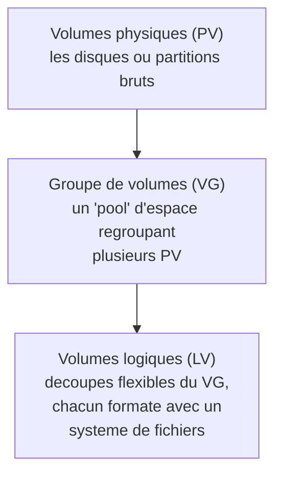
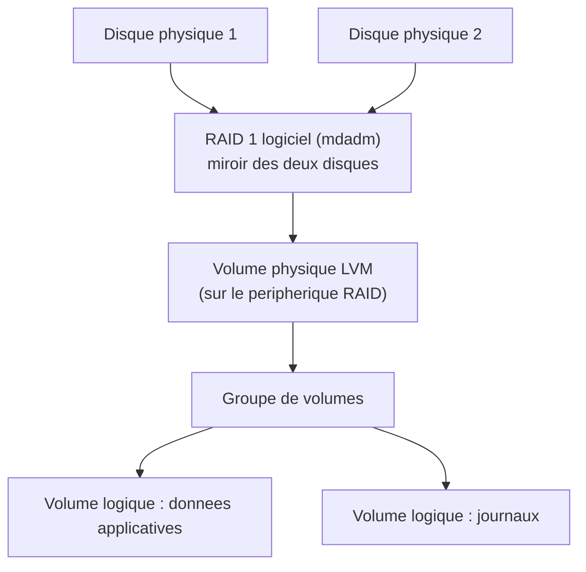

<div class="chapitre-titre-num">CHAPITRE 17</div>

# Stockage Linux : partitionnement, LVM et RAID logiciel

<div class="encadre objectif">
<span class="encadre-titre">🎯 Objectif du chapitre</span>
Comprendre comment l'espace disque est organisé sur un serveur Linux, au-delà du simple partitionnement traditionnel : les volumes logiques (LVM), qui permettent d'étendre l'espace disque sans interruption de service, et le RAID logiciel, qui protège contre la panne d'un disque physique. À la fin de ce chapitre, tu sauras étendre un volume LVM à chaud, expliquer les niveaux de RAID courants, et comprendre pourquoi LVM aurait pu éviter une situation critique vécue par beaucoup d'administrateurs débutants.
</div>

<div class="encadre scenario">
<span class="encadre-titre">🎬 Mise en situation</span>
Le portail client connaît un succès croissant : de plus en plus de documents (photos de sinistres, pièces justificatives) sont téléversés par les clients. Un vendredi après-midi, une alerte que tu as configurée (Partie 10, anticipée dès maintenant par bon réflexe) signale que la partition de stockage du serveur applicatif atteint 90% de sa capacité. Le serveur a été installé avec un partitionnement classique, sans LVM : la partition concernée fait exactement la taille qui lui a été allouée à l'installation, gravée dans le marbre. Étendre cet espace signifierait, en partitionnement traditionnel, une réinstallation complète ou une manipulation risquée de la table de partitions en production. Ce chapitre explique comment LVM, s'il avait été utilisé dès le départ, aurait transformé ce vendredi après-midi stressant en une opération de quelques minutes, sans interruption de service.
</div>

## 17.1 Le partitionnement traditionnel : simple, mais rigide

Le partitionnement traditionnel divise un disque physique en zones fixes (partitions), chacune avec une taille déterminée à la création. C'est simple à comprendre, mais rigide : agrandir une partition existante, une fois d'autres partitions créées après elle sur le même disque, est une opération délicate, parfois impossible sans réinstallation.

<div class="encadre astuce">
<span class="encadre-titre">💡 Analogie — des pièces aux murs porteurs fixes</span>
Un partitionnement traditionnel ressemble à un appartement dont tous les murs sont porteurs : agrandir une pièce signifie casser un mur porteur, une opération risquée qui peut fragiliser toute la structure. LVM, à l'inverse, fonctionne comme un appartement à cloisons amovibles : agrandir une pièce (un volume logique) en réduisant une autre, ou en ajoutant de l'espace disponible, devient une opération simple et sûre, réalisable sans "casser" quoi que ce soit.
</div>

## 17.2 LVM : la flexibilité du stockage

**LVM** (*Logical Volume Manager*) ajoute une couche d'abstraction entre les disques physiques et les systèmes de fichiers, à travers trois niveaux :



<div class="encadre retenir">
<span class="encadre-titre">📌 À retenir — la hiérarchie LVM</span>
Un ou plusieurs disques physiques deviennent des <strong>volumes physiques</strong> (PV), regroupés dans un <strong>groupe de volumes</strong> (VG) qui agit comme un réservoir d'espace commun, lui-même découpé en <strong>volumes logiques</strong> (LV) — c'est sur ces LV, et non directement sur les disques, que les systèmes de fichiers sont créés et montés. Cette indirection est précisément ce qui permet d'étendre un LV à chaud, en piochant dans l'espace disponible du VG, sans jamais toucher à la structure physique des disques eux-mêmes.
</div>

```
# Creer un volume physique a partir d'un disque brut (ou d'une partition)
sudo pvcreate /dev/sdb

# Creer un groupe de volumes regroupant ce volume physique
sudo vgcreate vg_data /dev/sdb

# Creer un volume logique de 50 Go dans ce groupe
sudo lvcreate -L 50G -n lv_documents vg_data

# Formater ce volume logique avec un systeme de fichiers
sudo mkfs.ext4 /dev/vg_data/lv_documents

# Monter le volume logique a un emplacement du systeme de fichiers
sudo mount /dev/vg_data/lv_documents /var/portail/documents
```

## 17.3 Résoudre le scénario d'ouverture : étendre un volume LVM à chaud

Si le serveur du scénario d'ouverture avait été configuré avec LVM dès l'installation, voici comment l'espace aurait pu être étendu sans interruption :

```
# Ajouter un nouveau disque physique au groupe de volumes existant
# (suppose qu'un nouveau disque a ete ajoute au serveur, physiquement
# ou via une extension de disque virtuel)
sudo pvcreate /dev/sdc
sudo vgextend vg_data /dev/sdc

# Etendre le volume logique de 20 Go supplementaires, en piochant
# dans l'espace nouvellement disponible du groupe de volumes
sudo lvextend -L +20G /dev/vg_data/lv_documents

# Etendre le systeme de fichiers lui-meme pour utiliser le nouvel
# espace du volume logique (etape distincte et INDISPENSABLE :
# etendre le LV seul n'agrandit pas automatiquement le systeme
# de fichiers qu'il contient)
sudo resize2fs /dev/vg_data/lv_documents
```

<div class="encadre attention">
<span class="encadre-titre">⚠️ Étendre le volume logique ne suffit pas : il faut aussi étendre le système de fichiers</span>
Une erreur fréquente chez les débutants consiste à s'arrêter après `lvextend`, en supposant que l'espace supplémentaire est immédiatement utilisable. Le volume logique est bien plus grand, mais le système de fichiers qu'il contient (ext4, XFS...) ignore cet espace tant qu'il n'a pas été explicitement étendu avec `resize2fs` (pour ext4) ou `xfs_growfs` (pour XFS) — une étape distincte, facile à oublier, mais indispensable.
</div>

<div class="encadre bonne-pratique">
<span class="encadre-titre">✅ Bonne pratique — utiliser LVM par défaut dès l'installation, même sans besoin immédiat</span>
Le coût d'utiliser LVM dès l'installation initiale d'un serveur est quasiment nul (une case à cocher dans la plupart des installateurs modernes), alors que le bénéfice se révèle précisément dans des situations comme celle du scénario d'ouverture. Configurer LVM "au cas où" dès le départ est l'une des décisions à faible coût et fort bénéfice les plus systématiquement recommandées en administration Linux moderne.
</div>

## 17.4 Le RAID logiciel : protéger contre la panne d'un disque

Le **RAID** (*Redundant Array of Independent Disks*) combine plusieurs disques physiques pour améliorer la performance, la tolérance de panne, ou les deux. Le RAID **logiciel** (par opposition au RAID matériel, géré par un contrôleur dédié) est directement pris en charge par le noyau Linux via `mdadm`.

| Niveau RAID | Fonctionnement | Tolérance de panne | Espace utilisable |
|---|---|---|---|
| **RAID 0** | Répartition des données sur plusieurs disques (striping) | Aucune — la panne d'un seul disque perd toutes les données | 100% de la capacité totale |
| **RAID 1** | Duplication intégrale des données sur deux disques (mirroring) | Un disque peut tomber en panne sans perte de données | 50% de la capacité totale |
| **RAID 5** | Répartition avec parité distribuée | Un disque peut tomber en panne sans perte de données | Capacité totale moins un disque |
| **RAID 10** | Combinaison de mirroring et striping | Tolère la panne d'un disque par paire miroir | 50% de la capacité totale |

<div class="encadre attention">
<span class="encadre-titre">⚠️ Erreur de compréhension fréquente : "RAID 0 protège les données"</span>
C'est l'inverse exact : RAID 0 améliore uniquement la performance (répartition de la charge de lecture/écriture sur plusieurs disques), mais **aggrave** le risque de perte de données par rapport à un disque unique — la panne d'un seul disque du groupe RAID 0 rend l'ensemble des données inutilisables, car chaque fichier est fragmenté à travers tous les disques du groupe. Le "R" de RAID (*Redundant*) ne s'applique pas au niveau 0, malgré le nom générique de la technologie.
</div>

<div class="encadre securite">
<span class="encadre-titre">🔒 Sécurité — le RAID n'est jamais un substitut à une sauvegarde</span>
Rappel direct du chapitre 1 (section 1.4) et de la Partie 5 à venir sur la continuité d'activité : le RAID protège contre la panne **matérielle** d'un disque, mais ne protège absolument pas contre une suppression accidentelle de fichier, une corruption logique, un rançongiciel, ou une erreur humaine — ces événements se répliquent instantanément sur tous les disques du groupe RAID, y compris les disques "de secours". Un RAID 1 avec un fichier supprimé par erreur perd ce fichier sur les deux disques miroirs simultanément, sans aucune protection. Le RAID et la sauvegarde répondent à deux risques complètement différents, et l'un ne remplace jamais l'autre.
</div>

## 17.5 LVM et RAID ensemble : une combinaison courante

En pratique, LVM et RAID logiciel se combinent fréquemment : le RAID assure la tolérance de panne matérielle au niveau des disques physiques, tandis que LVM apporte la flexibilité de gestion de l'espace au niveau logique, par-dessus les disques déjà protégés par RAID.



<div class="encadre performance">
<span class="encadre-titre">🚀 Performance — répartir les volumes logiques selon leur usage réel</span>
Séparer les journaux applicatifs (écriture continue, souvent volumineuse) des données applicatives elles-mêmes dans des volumes logiques distincts, comme dans le schéma ci-dessus, permet d'éviter qu'une explosion soudaine de la taille des journaux (un bug applicatif qui génère des journaux excessifs, par exemple) ne sature l'espace disponible pour les données réellement critiques — une bonne pratique de conception à anticiper dès l'installation initiale.
</div>

## Atelier — Planifier le stockage du serveur du scénario d'ouverture

<div class="encadre exercice">
<span class="encadre-titre">🛠️ Atelier 17 — Concevoir une architecture de stockage résiliente et flexible</span>

**Objectif** : appliquer LVM et RAID ensemble pour concevoir un stockage à la fois résilient et flexible pour le prochain serveur du portail client.

**Préparation** : aucune installation nécessaire, un schéma sur papier suffit.

**Étapes détaillées** :

1. Le nouveau serveur dispose de quatre disques physiques identiques. Propose une configuration RAID adaptée à un serveur de production où la tolérance de panne prime sur la capacité maximale brute, en justifiant ton choix parmi les niveaux de la section 17.4.
2. Par-dessus ce RAID, propose une organisation LVM avec au moins deux volumes logiques distincts, en justifiant leur séparation.
3. Explique comment cette architecture aurait évité le problème vécu dans le scénario d'ouverture.
4. Compare ta proposition à la section "Résultat attendu".

**Résultat attendu** : RAID 10 (ou RAID 1 si seuls deux disques sont réellement dédiés à la tolérance de panne, les deux autres pouvant servir à un second groupe) offre un bon compromis performance/tolérance de panne pour un serveur de production avec quatre disques. Par-dessus, deux volumes logiques distincts — un pour les données applicatives (documents téléversés), un pour les journaux — évitent qu'une croissance imprévue de l'un n'affecte l'autre. Cette architecture aurait permis d'étendre le volume logique des documents à chaud (section 17.3) dès l'alerte à 90%, sans le stress ni le risque d'une intervention en urgence sur un partitionnement rigide.

**Dépannage** : si tu hésites sur le niveau RAID à choisir, reviens au tableau de la section 17.4 et pose-toi la question centrale : combien de disques ce serveur peut-il perdre simultanément sans perte de données, et quelle capacité utile cela laisse-t-il réellement disponible ?
</div>

## Erreurs fréquentes

<div class="encadre attention">
<span class="encadre-titre">⚠️ Erreur n°1 — installer un serveur de production sans LVM par défaut</span>
Comme vu en section 17.3, ce choix initial en apparence anodin peut transformer une extension de stockage triviale en opération risquée et potentiellement impossible sans interruption de service, exactement le piège du scénario d'ouverture.
</div>

<div class="encadre attention">
<span class="encadre-titre">⚠️ Erreur n°2 — confondre RAID et sauvegarde</span>
Rappel de la section 17.4 : le RAID protège contre une panne matérielle, jamais contre une suppression accidentelle, une corruption logique, ou un rançongiciel — une confusion dangereuse qui peut donner un faux sentiment de sécurité complète.
</div>

<div class="encadre attention">
<span class="encadre-titre">⚠️ Erreur n°3 — oublier d'étendre le système de fichiers après avoir étendu un volume logique</span>
Rappel de la section 17.3 : `lvextend` seul n'agrandit pas l'espace réellement utilisable — `resize2fs` ou l'équivalent selon le système de fichiers reste une étape distincte et indispensable.
</div>

## En entreprise

- **Bonne pratique répandue** : documenter (chapitre 3) l'architecture de stockage de chaque serveur — quels disques physiques, quel niveau RAID, quels groupes et volumes LVM, avec leur usage prévu — un schéma indispensable avant toute intervention future sur le stockage.
- **Bonne pratique répandue** : surveiller proactivement l'espace disque disponible (rejoignant directement la supervision proactive du chapitre 1, section 1.4) plutôt que de découvrir une saturation via une alerte critique à 90%, déjà trop tardive pour agir sereinement.
- **Erreur classique observée** : un serveur historique installé sans LVM des années auparavant, jamais migré depuis faute de fenêtre de maintenance suffisante, devenant une contrainte récurrente à chaque nouvelle demande d'extension de stockage.

## Entretien technique

<div class="encadre exercice">
<span class="encadre-titre">💼 Questions fréquemment posées en entretien</span>

**Q1. "Quel est l'avantage principal de LVM par rapport au partitionnement traditionnel ?"**
Réponse attendue : LVM permet d'étendre (ou de redimensionner) l'espace disque à chaud, sans interruption de service et sans les contraintes rigides du partitionnement traditionnel, grâce à sa couche d'abstraction entre les disques physiques et les systèmes de fichiers (volumes physiques, groupes de volumes, volumes logiques).

**Q2. "Pourquoi RAID 0 n'offre-t-il aucune protection des données ?"**
Réponse attendue : RAID 0 répartit les données sur plusieurs disques uniquement pour améliorer la performance (striping), sans aucune redondance — la panne d'un seul disque du groupe rend l'ensemble des données inutilisables, puisque chaque fichier est fragmenté à travers tous les disques.

**Q3. "Le RAID remplace-t-il le besoin de sauvegardes ?"**
Réponse attendue : non, absolument pas — le RAID protège uniquement contre une panne matérielle de disque, jamais contre une suppression accidentelle, une corruption logique ou un rançongiciel, qui se répliquent instantanément sur tous les disques du groupe RAID. Les deux mécanismes répondent à des risques différents et sont complémentaires, jamais substituables l'un à l'autre.
</div>

## Optimisation, sécurité et maintenabilité — les réflexes dès ce chapitre

<div class="encadre securite">
<span class="encadre-titre">🔒 Sécurité</span>
Ne considère jamais un RAID (quel que soit son niveau) comme une stratégie de sauvegarde à lui seul — la Partie 5 de ce manuel détaille la stratégie de sauvegarde réelle nécessaire en complément, jamais en remplacement.
</div>

<div class="encadre bonne-pratique">
<span class="encadre-titre">✅ Maintenabilité</span>
Configure LVM par défaut sur tout nouveau serveur, même en l'absence de besoin d'extension immédiatement anticipé (section 17.3) — le coût de cette précaution est quasiment nul au moment de l'installation, et son absence peut coûter cher des mois ou des années plus tard.
</div>

<div class="encadre performance">
<span class="encadre-titre">🚀 Performance</span>
Sépare les volumes logiques selon leur profil d'usage réel (données applicatives, journaux, bases de données) plutôt qu'un unique volume générique fourre-tout — une organisation qui facilite à la fois la supervision ciblée (Partie 10) et la limitation de l'impact d'une saturation localisée à un seul type de données.
</div>

## Résumé du chapitre

- Le partitionnement traditionnel est simple mais rigide ; LVM ajoute une couche d'abstraction (volumes physiques, groupes de volumes, volumes logiques) qui permet d'étendre l'espace disque à chaud.
- Étendre un volume logique LVM nécessite deux étapes distinctes : `lvextend` (le volume logique lui-même) puis `resize2fs` ou équivalent (le système de fichiers qu'il contient).
- Le RAID protège contre la panne matérielle d'un ou plusieurs disques, avec des niveaux offrant des compromis différents entre performance, tolérance de panne et capacité utilisable.
- RAID 0 améliore uniquement la performance, sans aucune protection — une confusion fréquente et dangereuse à éviter.
- Le RAID ne remplace jamais une stratégie de sauvegarde : il protège contre des risques matériels, pas contre une suppression, une corruption logique ou un rançongiciel.
- LVM et RAID se combinent couramment : le RAID au niveau physique, LVM au niveau logique par-dessus.

## Quiz

<div class="encadre exercice">
<span class="encadre-titre">📝 QCM (une seule bonne réponse par question)</span>

1. LVM permet principalement de :
   - a) Chiffrer automatiquement les disques
   - b) Étendre l'espace disque à chaud, sans les contraintes du partitionnement traditionnel
   - c) Remplacer entièrement le besoin de sauvegardes
   - d) Accélérer le démarrage du système

2. RAID 0 offre :
   - a) Une tolérance de panne d'un disque
   - b) Une amélioration de performance sans aucune tolérance de panne
   - c) Une duplication intégrale des données
   - d) Une protection contre les rançongiciels

3. Après avoir étendu un volume logique LVM avec `lvextend`, l'étape supplémentaire indispensable est :
   - a) Redémarrer le serveur
   - b) Reformater entièrement le volume
   - c) Étendre le système de fichiers avec `resize2fs` ou équivalent
   - d) Aucune, l'espace est immédiatement utilisable

**Corrigé** : 1-b, 2-b, 3-c.
</div>

<div class="encadre exercice">
<span class="encadre-titre">📝 Vrai ou Faux</span>

1. Un RAID 1 protège contre une suppression accidentelle de fichier. — **Faux** (la suppression se réplique instantanément sur tous les disques du miroir).
2. LVM peut regrouper plusieurs disques physiques dans un même groupe de volumes. — **Vrai**.
3. RAID 5 tolère la panne d'un disque grâce à la parité distribuée. — **Vrai**.
4. Configurer LVM dès l'installation d'un serveur a un coût généralement élevé et complexe. — **Faux** (le coût est quasiment nul, souvent une simple case à cocher à l'installation).
</div>

<div class="encadre exercice">
<span class="encadre-titre">📝 Questions ouvertes</span>

1. Explique pourquoi le RAID et la sauvegarde répondent à deux risques différents, et pourquoi l'un ne remplace jamais l'autre.
2. Reprends le scénario d'ouverture. Explique, en 3 à 5 phrases, ce que tu recommanderais pour le prochain serveur afin d'éviter que ce type de situation stressante ne se reproduise.

**Corrigé 1** : le RAID protège contre une défaillance **matérielle** d'un disque physique — un composant qui tombe réellement en panne. La sauvegarde protège contre une perte **logique** des données elles-mêmes — suppression accidentelle, corruption, rançongiciel, erreur humaine — des événements qui se répliquent instantanément et fidèlement sur tous les disques d'un groupe RAID, y compris les disques redondants, précisément parce que le RAID réplique fidèlement tout ce qui est écrit, y compris les erreurs. Les deux mécanismes se complètent pour couvrir des risques distincts, jamais l'un au détriment de l'autre.

**Corrigé 2** : je recommanderais de configurer LVM dès l'installation du prochain serveur, même sans besoin d'extension immédiatement identifié, pour permettre une extension à chaud future sans stress ni risque (section 17.3). J'ajouterais une supervision proactive de l'espace disque avec des seuils d'alerte plus précoces (par exemple 70% plutôt que d'attendre 90%), laissant davantage de temps pour planifier une extension sereinement plutôt que dans l'urgence d'un vendredi après-midi. Enfin, je documenterais cette architecture de stockage dans la CMDB du chapitre 3, pour que toute personne intervenant plus tard comprenne immédiatement la configuration en place.
</div>

## Exercices

<div class="encadre exercice">
<span class="encadre-titre">📝 Exercice 17.1</span>

Un serveur dispose d'un groupe de volumes LVM avec 100 Go d'espace total, dont 80 Go déjà alloués à des volumes logiques existants. Un administrateur souhaite créer un nouveau volume logique de 30 Go. Explique pourquoi cette opération échouera telle quelle, et propose deux solutions possibles.
</div>

**Corrigé :** Le groupe de volumes ne dispose que de 20 Go d'espace libre (100 Go moins les 80 Go déjà alloués), insuffisant pour créer un nouveau volume logique de 30 Go. Deux solutions possibles : (1) ajouter un nouveau disque physique au groupe de volumes existant via `pvcreate` puis `vgextend` (section 17.3), augmentant l'espace total disponible avant de créer le nouveau volume logique ; (2) réduire un volume logique existant sous-utilisé (une opération plus délicate, qui nécessite généralement de démonter le volume et de réduire d'abord le système de fichiers avant le volume logique lui-même, dans l'ordre inverse de l'extension) pour libérer de l'espace au sein du groupe de volumes actuel.

<div class="encadre exercice">
<span class="encadre-titre">📝 Exercice 17.2</span>

Rédige, en 3 à 5 phrases, pourquoi séparer les volumes logiques "données applicatives" et "journaux" (section 17.5) constitue une bonne pratique, en donnant un exemple concret de problème que cette séparation permettrait d'éviter.
</div>

**Corrigé (exemple de réponse) :** Séparer ces volumes logiques limite l'impact d'un problème localisé à un seul type de données. Par exemple, si un bug applicatif provoque une explosion soudaine du volume de journaux générés (un cas fréquent, notamment lors d'une boucle d'erreur répétée), un volume logique dédié aux journaux saturerait sans affecter l'espace disponible pour les données applicatives critiques — alors qu'un volume unique partagé verrait les deux types de données menacés simultanément par le même incident, risquant de bloquer l'application elle-même faute d'espace disponible pour ses propres données.

## Checklist de fin de chapitre

<ul class="checklist">
<li>☐ Je comprends la différence entre partitionnement traditionnel et LVM.</li>
<li>☐ Je connais la hiérarchie LVM : volumes physiques, groupes de volumes, volumes logiques.</li>
<li>☐ Je sais étendre un volume logique LVM à chaud, y compris l'étape d'extension du système de fichiers.</li>
<li>☐ Je connais les niveaux RAID courants (0, 1, 5, 10) et leurs compromis performance/tolérance de panne.</li>
<li>☐ Je comprends pourquoi RAID 0 n'offre aucune protection des données.</li>
<li>☐ Je comprends pourquoi le RAID ne remplace jamais une stratégie de sauvegarde.</li>
</ul>

## FAQ

<dl class="faq">
<dt>Peut-on convertir un serveur déjà installé en partitionnement traditionnel vers LVM sans réinstallation ?</dt>
<dd>C'est techniquement possible dans certains cas avec des outils spécialisés, mais généralement complexe et risqué sur un système déjà en production — c'est précisément pourquoi la bonne pratique de la section 17.3 recommande de configurer LVM dès l'installation initiale, plutôt que de compter sur une migration ultérieure incertaine.</dd>

<dt>Le RAID logiciel (`mdadm`) est-il moins performant que le RAID matériel ?</dt>
<dd>Le RAID matériel dédié peut offrir de meilleures performances dans certains scénarios intensifs grâce à un processeur dédié sur le contrôleur, mais le RAID logiciel moderne reste largement suffisant pour la grande majorité des besoins d'un serveur d'entreprise standard, avec l'avantage d'une plus grande flexibilité et d'une absence de dépendance à un contrôleur matériel propriétaire spécifique.</dd>

<dt>Combien de disques physiques faut-il au minimum pour chaque niveau RAID ?</dt>
<dd>RAID 0 et RAID 1 nécessitent un minimum de deux disques ; RAID 5 nécessite un minimum de trois disques (pour bénéficier réellement de la parité distribuée) ; RAID 10 nécessite un minimum de quatre disques, par paires de deux.</dd>

<dt>Faut-il toujours combiner LVM et RAID, ou l'un seul peut-il suffire ?</dt>
<dd>Cela dépend du contexte : un petit serveur de test sans exigence de tolérance de panne peut se contenter de LVM seul pour sa flexibilité ; un serveur de production critique bénéficie généralement des deux ensemble, comme illustré dans l'atelier de ce chapitre, pour cumuler flexibilité et résilience matérielle.</dd>
</dl>

## Références et pour aller plus loin

- Documentation officielle Red Hat — Gestion du stockage LVM : [https://access.redhat.com/documentation/fr-fr/red_hat_enterprise_linux/9/html/configuring_and_managing_logical_volumes/index](https://access.redhat.com/documentation/fr-fr/red_hat_enterprise_linux/9/html/configuring_and_managing_logical_volumes/index)
- Documentation officielle du RAID logiciel Linux (`mdadm`) : [https://raid.wiki.kernel.org/index.php/Linux_Raid](https://raid.wiki.kernel.org/index.php/Linux_Raid)
- Documentation Ubuntu Server — LVM : [https://ubuntu.com/server/docs/lvm-basic-volume-management](https://ubuntu.com/server/docs/lvm-basic-volume-management)

*Chapitre suivant : utilisateurs, groupes et permissions avancées — ACL et sudo, pour comprendre comment contrôler précisément qui peut faire quoi sur un serveur Linux.*
