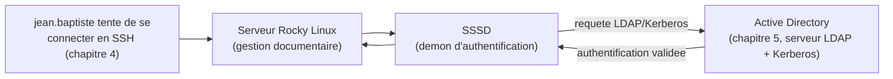

<div class="chapitre-titre-num">CHAPITRE 22</div>

# LDAP en profondeur : schéma et OpenLDAP

<div class="encadre objectif">
<span class="encadre-titre">🎯 Objectif du chapitre</span>
Comprendre LDAP comme le protocole d'annuaire sous-jacent qu'Active Directory utilise déjà (Partie 2), et savoir l'interroger et le structurer indépendamment de Windows. À la fin de ce chapitre, tu sauras lire et écrire un DN (*Distinguished Name*), interroger un annuaire avec `ldapsearch`, comprendre le rôle d'un schéma LDAP, et décider quand un annuaire OpenLDAP autonome a du sens plutôt que de dépendre systématiquement d'Active Directory.
</div>

<div class="encadre scenario">
<span class="encadre-titre">🎬 Mise en situation</span>
Le nouveau serveur Rocky Linux hébergeant le système de gestion documentaire (chapitre 19) a besoin d'authentifier ses utilisateurs. Plutôt que de créer des comptes locaux distincts sur chaque serveur Linux — une solution qui romprait avec toute la discipline d'identité centralisée déjà construite autour d'Active Directory depuis le chapitre 5 — le DSI demande : <em>"Peut-on simplement faire en sorte que les serveurs Linux utilisent les mêmes comptes que Windows ?"</em> La réponse tient en un mot que tu as déjà croisé sans jamais l'expliquer en détail : LDAP, le protocole sur lequel Active Directory lui-même repose. Ce chapitre lève le voile sur ce protocole, indépendamment de Windows.
</div>

## 22.1 LDAP : le protocole qu'Active Directory utilise déjà

<div class="encadre retenir">
<span class="encadre-titre">📌 À retenir — une révélation qui éclaire tout ce qui précède</span>
**Active Directory EST, entre autres choses, un serveur LDAP.** Depuis le chapitre 5, chaque forêt, domaine, UO et objet utilisateur qu'Active Directory gère est en réalité structuré et interrogeable via LDAP (*Lightweight Directory Access Protocol*) — Microsoft a construit Active Directory par-dessus LDAP (et Kerberos, chapitre 23), pas à côté. Comprendre LDAP directement, indépendamment de Windows, explique donc rétrospectivement une bonne partie de ce qui a semblé spécifique à Active Directory dans les chapitres précédents.
</div>

<div class="encadre astuce">
<span class="encadre-titre">💡 Analogie — LDAP comme langage, Active Directory comme un des dialectes</span>
Si LDAP était une langue commune, Active Directory en serait un dialecte très répandu, avec son propre vocabulaire additionnel (les GPO, les rôles FSMO du chapitre 5) — mais la grammaire de base, celle qui permet de nommer et de retrouver un objet dans l'annuaire, reste du LDAP pur. OpenLDAP, que ce chapitre présente aussi, parle exactement la même langue de base, sans le dialecte propriétaire de Microsoft ajouté par-dessus.
</div>

## 22.2 La structure d'un annuaire LDAP : DN, attributs, schéma

Un annuaire LDAP organise ses données en une arborescence hiérarchique d'**entrées**, chacune identifiée de façon unique par son **DN** (*Distinguished Name*) — exactement le même concept que le chemin complet d'une UO qu'Active Directory manipule déjà depuis le chapitre 5, simplement rendu explicite ici.

```
# Le DN d'un utilisateur dans l'annuaire Active Directory de l'entreprise
# (rappel : c'est litteralement du LDAP, deja utilise sans le nommer ainsi)
cn=Jean Baptiste,ou=Comptabilite,dc=assuranceht,dc=local
```

<div class="encadre astuce">
<span class="encadre-titre">💡 Décomposer ce DN, de la fin vers le début</span>
<code>dc=assuranceht,dc=local</code> (*Domain Component*) correspond exactement au domaine <code>assuranceht.local</code> du chapitre 5. <code>ou=Comptabilite</code> correspond à l'unité d'organisation "Comptabilité", tout aussi familière depuis le chapitre 5. <code>cn=Jean Baptiste</code> (*Common Name*) identifie l'objet précis à l'intérieur de cette UO. Le DN complet se lit comme une adresse postale, du plus spécifique (la personne) au plus général (le domaine) — dans l'ordre inverse d'une adresse postale française, mais avec la même logique de hiérarchie.
</div>

Chaque entrée LDAP possède un ou plusieurs **objectClass**, qui déterminent quels **attributs** elle peut ou doit porter — c'est le **schéma** de l'annuaire, sa définition structurelle.

| Concept LDAP | Rôle | Exemple |
|---|---|---|
| **DN** | Identifiant unique complet d'une entrée | `cn=Jean Baptiste,ou=Comptabilite,dc=assuranceht,dc=local` |
| **objectClass** | Détermine le type d'une entrée et ses attributs possibles | `person`, `organizationalUnit`, `groupOfNames` |
| **Attribut** | Une propriété précise d'une entrée | `mail`, `telephoneNumber`, `memberOf` |
| **Base DN** | Le point de départ de l'arborescence de l'annuaire | `dc=assuranceht,dc=local` |

## 22.3 Interroger un annuaire LDAP avec `ldapsearch`

```
# Rechercher tous les utilisateurs de l'UO Comptabilite dans
# l'Active Directory de l'entreprise (rappel : c'est un serveur LDAP)
ldapsearch -x -H ldap://dc-pap-01.assuranceht.local \
  -D "cn=compte_lecture,ou=ServiceAccounts,dc=assuranceht,dc=local" \
  -W \
  -b "ou=Comptabilite,dc=assuranceht,dc=local" \
  "(objectClass=person)"
```

<div class="encadre astuce">
<span class="encadre-titre">💡 Explication des options clés</span>
<code>-H</code> précise le serveur LDAP à interroger. <code>-D</code> indique le DN du compte utilisé pour se connecter (le "bind DN") — jamais un compte administrateur pour une simple lecture, principe du moindre privilège du chapitre 1. <code>-W</code> demande le mot de passe de façon interactive plutôt que de le passer en clair sur la ligne de commande (visible dans l'historique shell sinon, un risque de sécurité réel). <code>-b</code> définit la base de recherche (ici, l'UO Comptabilité) — inutile de chercher dans tout l'annuaire quand seule une UO précise nous intéresse. Le filtre entre parenthèses (<code>(objectClass=person)</code>) restreint les résultats aux entrées de type utilisateur.
</div>

## 22.4 OpenLDAP : quand un annuaire autonome a du sens

**OpenLDAP** est une implémentation open source d'un serveur LDAP, indépendante d'Active Directory. Elle a du sens dans des scénarios précis, différents de celui du scénario d'ouverture :

<div class="encadre astuce">
<span class="encadre-titre">💡 Quand choisir OpenLDAP plutôt que de dépendre d'Active Directory</span>
- Une organisation **entièrement Linux**, sans aucune infrastructure Windows Server existante, pour laquelle déployer Active Directory uniquement pour l'identité serait disproportionné.
- Un besoin d'annuaire **applicatif dédié**, séparé de l'identité des employés (par exemple, un annuaire de comptes de service pour des applications, isolé de l'annuaire du personnel).
- Un environnement **multi-plateforme** où l'écosystème Microsoft n'est délibérément pas souhaité, pour des raisons de coût ou de stratégie technique.
</div>

<div class="encadre attention">
<span class="encadre-titre">⚠️ Pour le scénario d'ouverture, OpenLDAP n'est PAS la bonne réponse</span>
Créer un second annuaire OpenLDAP autonome pour les serveurs Linux, séparé de l'Active Directory déjà en place, romprait précisément la centralisation d'identité déjà construite depuis le chapitre 5 — deux annuaires distincts à synchroniser manuellement, deux sources de vérité pour les mêmes personnes, un risque direct de dérive similaire à celui déjà évoqué pour les conflits de réplication (chapitre 6). La bonne réponse, développée en section 22.5, consiste à faire authentifier les serveurs Linux directement contre l'Active Directory existant.
</div>

## 22.5 Authentifier Linux contre Active Directory via LDAP : SSSD

**SSSD** (*System Security Services Daemon*) est le service standard sur les distributions Linux modernes qui permet à un serveur Linux de s'authentifier contre un annuaire LDAP externe — y compris Active Directory — sans dupliquer les comptes localement.



<div class="encadre bonne-pratique">
<span class="encadre-titre">✅ Bonne pratique — un seul annuaire d'identité pour toute l'entreprise</span>
Avec SSSD configuré, un employé désactivé dans Active Directory (départ, suspension) perd immédiatement l'accès à TOUS les systèmes de l'entreprise — Windows ET Linux — sans qu'un administrateur n'ait besoin de penser séparément à désactiver un compte local sur chaque serveur Linux. C'est exactement la réponse à la question du DSI dans le scénario d'ouverture, et une application directe du principe de documentation et de gestion des actifs du chapitre 3 : une seule source de vérité, jamais deux annuaires à synchroniser manuellement.
</div>

```
# Installation et configuration simplifiee (les details precis varient
# selon la distribution et la version d'Active Directory) :
sudo dnf install sssd sssd-ad realmd oddjob-mkhomedir

# Rejoindre le domaine Active Directory, de facon similaire dans l'esprit
# a l'ajout d'un poste de travail Windows a un domaine
sudo realm join assuranceht.local -U administrateur_domaine
```

## 22.6 Sécuriser LDAP : ne jamais transmettre en clair

<div class="encadre securite">
<span class="encadre-titre">🔒 Sécurité — LDAP en clair (port 389) expose les identifiants sur le réseau</span>
Le port LDAP standard (389) transmet les requêtes, y compris les tentatives d'authentification, **sans chiffrement** par défaut — un identifiant et un mot de passe transitant en clair peuvent être interceptés par quiconque a accès au trafic réseau, un risque de sécurité sérieux, en particulier sur un réseau partagé ou mal segmenté (Partie 11). Deux solutions existent : **LDAPS** (LDAP directement chiffré via TLS, port 636) ou **StartTLS** (une connexion initiée en clair sur le port 389, puis élevée vers une session chiffrée avant tout échange de données sensibles).
</div>

<div class="encadre bonne-pratique">
<span class="encadre-titre">✅ Bonne pratique — désactiver le bind anonyme</span>
Un annuaire LDAP mal configuré peut permettre un "bind anonyme" — une connexion sans aucun identifiant, autorisant potentiellement la lecture de tout ou partie de l'annuaire par n'importe qui sur le réseau. Vérifier et désactiver cette possibilité, sauf besoin explicitement justifié et restreint, est un réflexe de durcissement de base, dans le même esprit que la revue des accès distants du chapitre 4.
</div>

## 22.7 Diagnostiquer un problème de connexion LDAP

<div class="encadre attention">
<span class="encadre-titre">🩺 Symptôme : "Invalid credentials" lors d'un `ldapsearch` ou d'une tentative de connexion SSSD</span>

- **Diagnostic** : ce message précis indique que le DN utilisé pour se connecter existe, mais que le mot de passe fourni est incorrect — une cause différente de "No such object", qui indiquerait que le DN lui-même n'existe pas dans l'annuaire.
- **Comment vérifier** : reconfirmer le DN exact du compte de service utilisé (une erreur de casse ou de virgule mal placée dans le DN produit souvent "No such object" plutôt que ce message précis) avant de suspecter le mot de passe lui-même.
- **Résolution** : si le DN est confirmé exact et que le mot de passe semble correct, vérifier que le compte n'est pas verrouillé ou expiré côté Active Directory — un blocage de compte (après plusieurs tentatives échouées, chapitre 4) produit souvent ce même message générique, sans distinction explicite pour ne pas révéler d'information exploitable à un attaquant potentiel.
</div>

## Atelier — Concevoir la solution d'authentification du scénario d'ouverture

<div class="encadre exercice">
<span class="encadre-titre">🛠️ Atelier 22 — Justifier SSSD plutôt qu'OpenLDAP autonome</span>

**Objectif** : synthétiser les concepts de ce chapitre pour répondre formellement à la demande du DSI dans le scénario d'ouverture.

**Préparation** : aucune installation nécessaire.

**Étapes détaillées** :

1. Rédige une note de 5 à 8 lignes recommandant SSSD plutôt qu'un OpenLDAP autonome pour authentifier le serveur Rocky Linux, en t'appuyant sur les sections 22.4 et 22.5.
2. Explique un bénéfice concret en termes de sécurité (rejoignant le chapitre 3 sur la gestion des comptes) qu'apporte cette solution par rapport à des comptes locaux créés manuellement sur chaque serveur Linux.
3. Compare ta note à la section "Résultat attendu".

**Résultat attendu** : la note recommande SSSD en s'appuyant sur l'existence déjà établie d'Active Directory (Partie 2) comme source unique d'identité de l'entreprise — créer un second annuaire OpenLDAP dupliquerait cette source et introduirait un risque de désynchronisation (section 22.4). Le bénéfice de sécurité central est qu'un compte désactivé dans Active Directory (départ d'un employé) perd immédiatement l'accès à tous les systèmes, Windows et Linux confondus, sans dépendre de la mémoire d'un administrateur pour désactiver manuellement un compte local oublié sur un serveur Linux périphérique — exactement le risque de "compte fantôme" évoqué au chapitre 3.

**Dépannage** : si tu hésites entre les deux solutions pour un contexte différent (par exemple une organisation entièrement Linux, sans aucun Active Directory), reviens à la section 22.4 et vérifie si l'un des critères qui justifient OpenLDAP s'applique réellement à ce contexte précis.
</div>

## Erreurs fréquentes

<div class="encadre attention">
<span class="encadre-titre">⚠️ Erreur n°1 — créer un second annuaire d'identité par facilité</span>
Exactement le piège du scénario d'ouverture, section 22.4 — dupliquer une source de vérité déjà existante crée un risque de désynchronisation, plutôt que de connecter directement les nouveaux systèmes à l'annuaire déjà en place.
</div>

<div class="encadre attention">
<span class="encadre-titre">⚠️ Erreur n°2 — utiliser LDAP en clair (port 389) pour transmettre des identifiants</span>
Rappel de la section 22.6 : une pratique qui expose les identifiants à une interception réseau, à corriger systématiquement par LDAPS ou StartTLS.
</div>

<div class="encadre attention">
<span class="encadre-titre">⚠️ Erreur n°3 — laisser le bind anonyme actif sans raison justifiée</span>
Rappel de la section 22.6 : une configuration par défaut sur certains serveurs LDAP, à vérifier et désactiver systématiquement lors d'un audit de sécurité.
</div>

## En entreprise

- **Bonne pratique répandue** : utiliser des comptes de service dédiés, à privilèges strictement limités à la lecture (jamais un compte administrateur), pour toute application ou script interrogeant l'annuaire LDAP — exactement le compte `compte_lecture` de l'exemple `ldapsearch` de la section 22.3.
- **Bonne pratique répandue** : documenter (chapitre 3) la structure de l'annuaire (DN de base, convention de nommage des UO) pour que tout script ou intégration future puisse s'y référer sans deviner.
- **Erreur classique observée** : une intégration LDAP ancienne configurée en clair (port 389) des années auparavant, jamais migrée vers LDAPS/StartTLS, découverte lors d'un audit de sécurité alors qu'elle transmet des identifiants en clair depuis longtemps sans que personne ne s'en soit rendu compte.

## Entretien technique

<div class="encadre exercice">
<span class="encadre-titre">💼 Questions fréquemment posées en entretien</span>

**Q1. "Quelle est la relation entre Active Directory et LDAP ?"**
Réponse attendue : Active Directory est construit par-dessus LDAP (et Kerberos) — c'est littéralement un serveur LDAP, avec des fonctionnalités additionnelles propriétaires de Microsoft (GPO, rôles FSMO). Toute la structure d'objets et d'UO d'Active Directory est interrogeable directement via des outils LDAP standards comme `ldapsearch`.

**Q2. "Qu'est-ce qu'un DN (Distinguished Name) en LDAP ?"**
Réponse attendue : l'identifiant unique complet d'une entrée dans l'annuaire, construit hiérarchiquement du plus spécifique (souvent un CN) au plus général (les composants de domaine, DC), séparés par des virgules — l'équivalent d'une adresse complète permettant de localiser précisément une entrée dans l'arborescence de l'annuaire.

**Q3. "Comment ferais-tu authentifier un serveur Linux contre un Active Directory existant, sans créer de comptes locaux ?"**
Réponse attendue : via SSSD (et `realmd` pour rejoindre le domaine), qui permet à un serveur Linux de s'authentifier directement contre Active Directory par LDAP/Kerberos — évitant la duplication de comptes et garantissant qu'un compte désactivé côté Active Directory perd immédiatement l'accès partout, Linux compris.
</div>

## Optimisation, sécurité et maintenabilité — les réflexes dès ce chapitre

<div class="encadre securite">
<span class="encadre-titre">🔒 Sécurité</span>
N'utilise jamais LDAP en clair (port 389 sans StartTLS) pour transmettre des identifiants — LDAPS ou StartTLS doivent être la norme systématique, jamais une amélioration reportée à plus tard.
</div>

<div class="encadre bonne-pratique">
<span class="encadre-titre">✅ Maintenabilité</span>
Privilégie toujours une source d'identité unique et centralisée (section 22.5) plutôt que de multiplier les annuaires — chaque nouvel annuaire créé est une nouvelle source à synchroniser, à sécuriser et à auditer séparément, un coût de maintenance qui s'accumule silencieusement.
</div>

<div class="encadre performance">
<span class="encadre-titre">🚀 Performance</span>
Restreins la base de recherche (`-b`) de toute requête LDAP au périmètre réellement nécessaire (comme l'UO Comptabilité de l'exemple de la section 22.3), plutôt que d'interroger systématiquement l'annuaire entier — une pratique qui réduit la charge sur les contrôleurs de domaine, particulièrement sensible sur le lien inter-sites plus lent du chapitre 6.
</div>

## Résumé du chapitre

- Active Directory est construit par-dessus LDAP — comprendre LDAP directement éclaire rétrospectivement une bonne partie du fonctionnement d'Active Directory déjà vu en Partie 2.
- Un DN identifie de façon unique une entrée dans l'arborescence LDAP ; le schéma (objectClass, attributs) définit sa structure possible.
- `ldapsearch` permet d'interroger n'importe quel annuaire LDAP, y compris Active Directory, indépendamment des outils Windows habituels.
- OpenLDAP a du sens pour une organisation sans Active Directory existant ou un besoin d'annuaire applicatif isolé — pas pour dupliquer un annuaire d'entreprise déjà en place.
- SSSD permet à un serveur Linux de s'authentifier directement contre Active Directory, évitant la duplication de comptes et centralisant la désactivation d'accès.
- LDAP doit toujours être chiffré (LDAPS ou StartTLS) ; le bind anonyme doit être désactivé sauf besoin justifié.

## Quiz

<div class="encadre exercice">
<span class="encadre-titre">📝 QCM (une seule bonne réponse par question)</span>

1. Active Directory est :
   - a) Totalement indépendant de LDAP
   - b) Construit par-dessus LDAP et Kerberos
   - c) Une alternative concurrente à LDAP
   - d) Une version obsolète de LDAP

2. Le DN `cn=Marie,ou=RH,dc=exemple,dc=local` se lit :
   - a) Du plus général au plus spécifique
   - b) Du plus spécifique (Marie) au plus général (le domaine)
   - c) Dans un ordre aléatoire sans hiérarchie
   - d) Uniquement de gauche à droite sans signification

3. SSSD permet principalement de :
   - a) Créer des comptes locaux automatiquement sur chaque serveur
   - b) Authentifier un serveur Linux directement contre un annuaire externe comme Active Directory
   - c) Remplacer entièrement Active Directory
   - d) Chiffrer uniquement les mots de passe locaux

**Corrigé** : 1-b, 2-b, 3-b.
</div>

<div class="encadre exercice">
<span class="encadre-titre">📝 Vrai ou Faux</span>

1. LDAP sur le port 389 standard transmet les données, y compris les identifiants, en clair par défaut. — **Vrai**.
2. Créer un annuaire OpenLDAP séparé est toujours préférable à connecter des serveurs Linux à un Active Directory déjà existant. — **Faux** (dupliquer une source de vérité existante crée un risque de désynchronisation, section 22.4).
3. `ldapsearch` peut être utilisé pour interroger un Active Directory, pas seulement un serveur OpenLDAP. — **Vrai**.
4. Le bind anonyme LDAP devrait rester activé par défaut sur tout annuaire de production. — **Faux** (à désactiver sauf besoin justifié, section 22.6).
</div>

<div class="encadre exercice">
<span class="encadre-titre">📝 Questions ouvertes</span>

1. Explique pourquoi comprendre LDAP directement aide à mieux comprendre Active Directory, plutôt que de le traiter comme deux sujets totalement séparés.
2. Reprends le scénario d'ouverture. Explique pourquoi la solution SSSD répond mieux à l'esprit de la discipline de gestion des comptes du chapitre 3 qu'une création manuelle de comptes locaux sur chaque serveur Linux.

**Corrigé 1** : Active Directory étant littéralement construit par-dessus LDAP, une bonne partie de sa structure (DN, UO, attributs) et de son comportement (comment un objet est localisé et interrogé) s'explique directement par les mécanismes LDAP sous-jacents, plutôt que par des règles propriétaires arbitraires de Microsoft. Comprendre LDAP en profondeur permet donc de raisonner sur Active Directory avec une compréhension plus fondamentale, transférable aussi à d'autres systèmes utilisant LDAP indépendamment de Windows.

**Corrigé 2** : la discipline du chapitre 3 insiste sur une source de vérité unique et fiable pour l'inventaire et les comptes — des comptes locaux créés manuellement sur chaque serveur Linux créeraient autant de sources distinctes à maintenir et à désactiver individuellement lors d'un départ d'employé, un risque direct de "compte fantôme" oublié. SSSD, en connectant directement les serveurs Linux à Active Directory, préserve cette source de vérité unique : désactiver un compte dans Active Directory suffit à révoquer l'accès partout, sans dépendre de la mémoire d'un administrateur pour répéter cette action sur chaque serveur Linux individuellement.
</div>

## Exercices

<div class="encadre exercice">
<span class="encadre-titre">📝 Exercice 22.1</span>

Décompose le DN suivant en identifiant chacun de ses composants et ce qu'ils représentent : `cn=Sophie Pierre,ou=Sinistres,ou=Cap-Haitien,dc=assuranceht,dc=local`.
</div>

**Corrigé :** `dc=assuranceht,dc=local` représente le domaine `assuranceht.local` (chapitre 5). `ou=Cap-Haitien` représente une unité d'organisation de premier niveau, probablement liée au site du Cap-Haïtien (rappel du chapitre 5 sur l'architecture à deux sites). `ou=Sinistres` représente une unité d'organisation imbriquée à l'intérieur de celle-ci, probablement le service concerné. `cn=Sophie Pierre` identifie l'entrée précise (l'utilisatrice Sophie Pierre) à l'intérieur de cette structure hiérarchique complète.

<div class="encadre exercice">
<span class="encadre-titre">📝 Exercice 22.2</span>

Rédige, en 3 à 5 phrases, pourquoi un compte de service utilisé pour des requêtes `ldapsearch` automatisées (comme dans un script de supervision) ne devrait jamais être un compte administrateur du domaine.
</div>

**Corrigé (exemple de réponse) :** Un compte de service utilisé uniquement pour lire l'annuaire (rechercher des utilisateurs, vérifier des attributs) n'a besoin que de droits de lecture, jamais de droits d'écriture ni d'administration — lui accorder des privilèges administrateur du domaine violerait directement le principe du moindre privilège du chapitre 1. Si ce compte de service est compromis (par exemple, ses identifiants exposés dans un script mal sécurisé, chapitre 20), un attaquant obtiendrait un accès disproportionné par rapport au besoin réel du script, transformant un incident mineur potentiel en compromission majeure de tout le domaine Active Directory.

## Checklist de fin de chapitre

<ul class="checklist">
<li>☐ Je comprends qu'Active Directory est construit par-dessus LDAP, pas un système totalement séparé.</li>
<li>☐ Je sais lire et décomposer un DN LDAP.</li>
<li>☐ Je sais utiliser `ldapsearch` pour interroger un annuaire LDAP, y compris Active Directory.</li>
<li>☐ Je sais quand un annuaire OpenLDAP autonome a du sens, et quand il ne l'a pas.</li>
<li>☐ Je comprends le rôle de SSSD pour authentifier un serveur Linux contre Active Directory.</li>
<li>☐ Je sais pourquoi LDAP doit toujours être chiffré (LDAPS/StartTLS) et le bind anonyme désactivé.</li>
</ul>

## FAQ

<dl class="faq">
<dt>Faut-il connaître LDAP pour administrer Active Directory au quotidien ?</dt>
<dd>Pas nécessairement pour les tâches courantes (les consoles graphiques du chapitre 4 suffisent largement), mais cette compréhension devient précieuse dès qu'un besoin dépasse les outils Windows standards — intégration Linux (ce chapitre), scripts d'automatisation avancés, ou diagnostic de problèmes plus profonds.</dd>

<dt>SSSD fonctionne-t-il aussi avec un serveur OpenLDAP, pas seulement Active Directory ?</dt>
<dd>Oui, SSSD est conçu pour fonctionner avec différents types de fournisseurs d'identité, y compris OpenLDAP directement — utile dans un contexte où OpenLDAP autonome (section 22.4) a effectivement été choisi comme source d'identité principale de l'organisation.</dd>

<dt>Les mots de passe sont-ils visibles dans l'annuaire LDAP lui-même ?</dt>
<dd>Non, jamais en clair sur un annuaire correctement configuré — les mots de passe sont stockés sous forme hachée (un concept approfondi au chapitre 25 avec le hachage bcrypt côté applicatif, transposable au principe général), et l'attribut correspondant est généralement protégé contre toute lecture, même par des comptes disposant par ailleurs d'un accès en lecture large à l'annuaire.</dd>

<dt>Peut-on migrer d'OpenLDAP vers Active Directory, ou l'inverse, sans tout reconstruire ?</dt>
<dd>Des outils de migration existent pour exporter et réimporter les entrées d'un annuaire à l'autre, mais la conversion n'est jamais totalement automatique en raison des différences de schéma et de fonctionnalités propriétaires (comme les GPO d'Active Directory, sans équivalent direct dans OpenLDAP) — un projet de migration mérite la même rigueur de planification qu'un changement majeur du chapitre 2.</dd>
</dl>

## Références et pour aller plus loin

- Documentation officielle OpenLDAP : [https://www.openldap.org/doc/](https://www.openldap.org/doc/)
- Microsoft Learn — Active Directory et LDAP : [https://learn.microsoft.com/fr-fr/windows/win32/ad/active-directory-and-lightweight-directory-access-protocol](https://learn.microsoft.com/fr-fr/windows/win32/ad/active-directory-and-lightweight-directory-access-protocol)
- Documentation officielle SSSD : [https://sssd.io/docs/](https://sssd.io/docs/)
- RFC 4511 — spécification officielle du protocole LDAPv3 : [https://www.rfc-editor.org/rfc/rfc4511](https://www.rfc-editor.org/rfc/rfc4511)

*Chapitre suivant : Kerberos — le protocole d'authentification qu'Active Directory (et SSSD, ce chapitre) utilisent en coulisses, pour comprendre précisément comment un mot de passe se transforme en accès effectif au réseau, sans jamais transiter en clair.*
