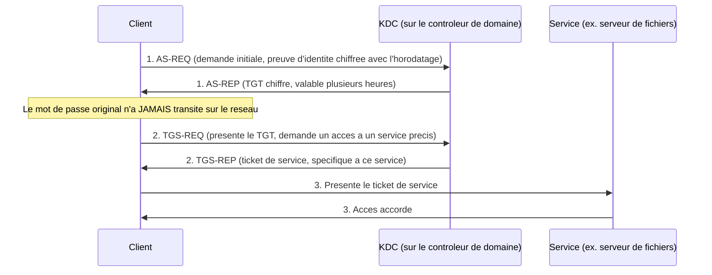

<div class="chapitre-titre-num">CHAPITRE 23</div>

# Kerberos : fonctionnement et dépannage

<div class="encadre objectif">
<span class="encadre-titre">🎯 Objectif du chapitre</span>
Comprendre Kerberos, le protocole d'authentification qui fonctionne en coulisses derrière Active Directory (Partie 2) et SSSD (chapitre 22) depuis le début de ce manuel, sans jamais avoir été expliqué directement. À la fin de ce chapitre, tu sauras décrire le flux d'authentification Kerberos en trois temps, expliquer pourquoi la synchronisation de l'horloge est absolument critique pour son fonctionnement, et diagnostiquer l'erreur Kerberos la plus fréquente et la plus déroutante pour un débutant.
</div>

<div class="encadre scenario">
<span class="encadre-titre">🎬 Mise en situation</span>
Une coupure de courant prolongée au Cap-Haïtien (rappel du chapitre 6) a fait redémarrer le serveur Rocky Linux du service de gestion documentaire sans onduleur suffisant pour maintenir l'horloge système à jour pendant l'arrêt. Le lendemain matin, les employés du Cap-Haïtien ne peuvent plus se connecter à ce serveur via SSSD (chapitre 22), alors que leur mot de passe est pourtant correct — ils l'ont vérifié en se connectant sans problème à leur poste Windows. Le message d'erreur exact, incompréhensible pour eux, est : <em>"Clock skew too great"</em>. Ce message n'a rien à voir avec le mot de passe — il révèle un fonctionnement fondamental de Kerberos que ce chapitre explique en détail.
</div>

## 23.1 Kerberos, le protocole invisible derrière Active Directory

<div class="encadre retenir">
<span class="encadre-titre">📌 À retenir</span>
Rappel direct du chapitre 22 : Active Directory repose sur LDAP **et** Kerberos. Chaque fois qu'un utilisateur ouvre une session Windows depuis le chapitre 5, ou qu'un serveur Linux authentifie un utilisateur via SSSD depuis le chapitre 22, Kerberos travaille en coulisses — sans jamais avoir été nommé explicitement jusqu'ici. Ce chapitre lève enfin le voile sur ce mécanisme central.
</div>

**Kerberos** est un protocole d'authentification réseau qui permet à un utilisateur de prouver son identité **sans jamais transmettre son mot de passe sur le réseau**, même sous forme chiffrée — une propriété de sécurité fondamentale qui distingue Kerberos de méthodes plus simples.

## 23.2 Les trois acteurs de Kerberos

<div class="encadre astuce">
<span class="encadre-titre">💡 Analogie — le parc d'attractions à bracelets</span>
Imagine un grand parc d'attractions. À l'entrée, tu montres ton billet une seule fois à la billetterie centrale (le KDC), qui te donne un bracelet (le TGT, *Ticket Granting Ticket*) prouvant que tu es entré légitimement — tu n'as plus besoin de remontrer ton billet original à chaque attraction. Pour chaque attraction précise (un service, comme un serveur de fichiers), tu présentes ton bracelet à un guichet dédié qui te donne un jeton spécifique à cette attraction (le ticket de service) — sans jamais revoir la billetterie centrale ni redonner ton billet original. C'est exactement le principe de Kerberos : une seule authentification initiale, puis des tickets réutilisables pour accéder à différents services, sans jamais retransmettre le mot de passe original.
</div>

| Acteur | Rôle | Équivalent dans l'analogie |
|---|---|---|
| **Client** | L'utilisateur ou la machine qui demande l'accès | Le visiteur du parc |
| **KDC** (*Key Distribution Center*) | Le serveur central de confiance (sur un contrôleur de domaine, chapitre 5) | La billetterie centrale |
| **Service** | La ressource finale demandée (serveur de fichiers, application) | Une attraction précise |

## 23.3 Le flux d'authentification Kerberos en trois temps



<div class="encadre astuce">
<span class="encadre-titre">💡 Explication du schéma</span>
À l'étape 1, le client prouve son identité en chiffrant un horodatage avec une clé dérivée de son mot de passe (jamais le mot de passe lui-même) — le KDC vérifie que ce chiffrement est correct sans que le mot de passe n'ait jamais circulé. En échange, il reçoit un TGT, valable plusieurs heures, qui évite d'avoir à ressaisir son mot de passe pour chaque nouvelle ressource demandée pendant cette période. À l'étape 2, ce TGT est échangé contre un ticket spécifique au service demandé. À l'étape 3, ce ticket de service, présenté directement au service concerné, prouve l'identité du client sans que le service lui-même n'ait besoin de contacter le KDC pour vérifier.
</div>

## 23.4 Pourquoi l'horloge compte autant : la tolérance d'horloge

Reprenons directement le scénario d'ouverture. L'étape 1 du flux Kerberos repose sur un **horodatage chiffré** pour prouver l'identité du client — un mécanisme qui suppose implicitement que l'horloge du client et celle du KDC sont raisonnablement synchronisées.

<div class="encadre attention">
<span class="encadre-titre">⚠️ La cause exacte du message "Clock skew too great"</span>
Par défaut, Kerberos tolère un écart maximal de **5 minutes** entre l'horloge du client et celle du KDC. Au-delà de cet écart, le KDC rejette la demande d'authentification, précisément pour se protéger contre une attaque par rejeu (*replay attack*) : un horodatage chiffré intercepté et réutilisé plus tard par un attaquant serait rejeté, exactement de la même façon qu'un horodatage simplement décalé par une horloge dérivée. Le serveur Rocky Linux du scénario d'ouverture, ayant perdu la synchronisation de son horloge pendant la coupure de courant prolongée, dépasse ce seuil de 5 minutes — et Kerberos rejette systématiquement toute authentification, quelle que soit la validité réelle du mot de passe fourni.
</div>

<div class="encadre memoriser">
<span class="encadre-titre">🧠 À mémoriser — la leçon la plus importante de ce chapitre</span>
"Clock skew too great" n'est **jamais** un problème de mot de passe, de compte, ou de permission — c'est **toujours** un problème de synchronisation d'horloge entre le client et le KDC. Reconnaître immédiatement ce message et savoir qu'il pointe systématiquement vers l'horloge évite des heures de diagnostic inutile sur de fausses pistes (vérification du mot de passe, de l'appartenance aux groupes, des permissions), exactement le réflexe de diagnostic ciblé enseigné au chapitre 1.
</div>

## 23.5 Diagnostiquer et résoudre le scénario d'ouverture

```
# Verifier l'heure actuelle du serveur affecte
timedatectl

# Verifier si la synchronisation NTP (Network Time Protocol) est active
# -- NTP est le protocole standard qui maintient l'horloge d'un serveur
# alignee sur une source de temps fiable, en continu
timedatectl show -p NTP -p NTPSynchronized

# Forcer une resynchronisation immediate si NTP est configure mais
# desynchronise (une commande specifique existe selon le service NTP
# utilise, chronyd etant courant sur les distributions recentes)
sudo chronyc makestep

# Une fois l'horloge corrigee, verifier qu'un ticket Kerberos peut
# maintenant etre obtenu normalement
kinit jean.baptiste
klist
```

<div class="encadre bonne-pratique">
<span class="encadre-titre">✅ Bonne pratique — NTP actif et surveillé sur tout serveur Kerberos-dépendant</span>
La véritable correction durable de ce chapitre n'est pas de resynchroniser manuellement l'horloge une seule fois après l'incident, mais de s'assurer qu'un service de synchronisation temporelle (NTP, via `chronyd` ou `systemd-timesyncd`) tourne en continu et est **surveillé** (Partie 10) — exactement le réflexe proactif du chapitre 1 plutôt qu'une correction réactive après que le problème a déjà causé une interruption de service.
</div>

<div class="encadre securite">
<span class="encadre-titre">🔒 Sécurité — pourquoi la tolérance de 5 minutes ne doit jamais être élargie "pour simplifier"</span>
Une réaction tentante mais dangereuse face à ce type d'incident consiste à élargir la tolérance d'horloge Kerberos pour éviter que le problème ne se reproduise — une mauvaise idée, car cela affaiblirait directement la protection contre les attaques par rejeu qui justifie cette tolérance stricte en premier lieu (section 23.4). La bonne réponse est toujours de corriger la cause réelle (la synchronisation NTP), jamais d'affaiblir la protection pour contourner un symptôme.
</div>

## 23.6 Autres erreurs Kerberos courantes

| Message d'erreur | Cause probable | Piste de résolution |
|---|---|---|
| `Clock skew too great` | Désynchronisation d'horloge (section 23.4) | Vérifier et corriger NTP, jamais élargir la tolérance |
| `Ticket expired` | Le TGT ou le ticket de service a dépassé sa durée de validité | Ré-authentifier avec `kinit` ; normal après une longue session inactive |
| `KDC has no support for encryption type` | Incompatibilité entre les types de chiffrement supportés par le client et le KDC | Vérifier la configuration de chiffrement, souvent liée à un système très ancien ou mal mis à jour |
| `Server not found in Kerberos database` | Le SPN (*Service Principal Name*) attendu n'existe pas ou est mal enregistré | Vérifier l'enregistrement du SPN correspondant au service concerné |

## Atelier — Diagnostiquer le scénario d'ouverture de bout en bout

<div class="encadre exercice">
<span class="encadre-titre">🛠️ Atelier 23 — De l'incident à la résolution durable</span>

**Objectif** : reconstituer la démarche complète de diagnostic et de correction du scénario d'ouverture, y compris la mesure préventive durable.

**Préparation** : aucune installation nécessaire pour cet atelier conceptuel, ou un accès à un serveur Linux de test pour le pratiquer réellement.

**Étapes détaillées** :

1. Rédige la commande pour confirmer que l'horloge du serveur Rocky Linux est effectivement désynchronisée.
2. Rédige les commandes pour corriger cette désynchronisation et confirmer qu'un ticket Kerberos peut de nouveau être obtenu.
3. Propose une mesure préventive durable, en t'appuyant sur la section 23.5 et sur la discipline de supervision proactive du chapitre 1.
4. Compare ta démarche à la section "Résultat attendu".

**Résultat attendu** : `timedatectl` révèle l'écart d'horloge. `sudo chronyc makestep` corrige l'écart immédiatement, suivi d'un `kinit` réussi confirmé par `klist`. La mesure préventive durable consiste à vérifier que `chronyd` (ou l'équivalent) est activé et actif en permanence (`systemctl is-enabled chronyd`, rappel direct du chapitre 16), et à ajouter une vérification de la synchronisation NTP au script de santé quotidien du chapitre 20 ou 21, pour détecter une future désynchronisation avant qu'elle ne bloque réellement les utilisateurs.

**Dépannage** : si `chronyc makestep` ne suffit pas à résoudre le problème, vérifie que le service `chronyd` est bien actif (`systemctl status chronyd`, chapitre 16) — un service de synchronisation temporelle arrêté ne peut évidemment maintenir aucune synchronisation, peu importe les commandes ponctuelles exécutées.
</div>

## Erreurs fréquentes

<div class="encadre attention">
<span class="encadre-titre">⚠️ Erreur n°1 — chercher un problème de mot de passe face à "Clock skew too great"</span>
Exactement le piège du scénario d'ouverture — ce message ne concerne jamais l'identité ou le mot de passe, uniquement la synchronisation d'horloge, comme détaillé en section 23.4.
</div>

<div class="encadre attention">
<span class="encadre-titre">⚠️ Erreur n°2 — élargir la tolérance d'horloge Kerberos pour "éviter le problème"</span>
Rappel de la section 23.5 : cette approche affaiblit directement la protection contre les attaques par rejeu, sans jamais corriger la cause réelle du problème.
</div>

<div class="encadre attention">
<span class="encadre-titre">⚠️ Erreur n°3 — ne pas surveiller activement la synchronisation NTP</span>
Un service NTP qui s'arrête silencieusement (après une mise à jour, un redémarrage, ou comme dans le scénario d'ouverture, une coupure de courant prolongée) peut passer inaperçu jusqu'à ce qu'il cause un incident réel — la supervision proactive de ce service (Partie 10) évite cette découverte tardive.
</div>

## Diagnostiquer d'autres symptômes liés à Kerberos

<div class="encadre attention">
<span class="encadre-titre">🩺 Symptôme : authentification qui fonctionne le matin mais échoue en fin de journée</span>

- **Diagnostic** : un TGT a une durée de validité limitée (généralement 10 heures par défaut sur Active Directory) — une session ouverte depuis longtemps peut voir son ticket expirer en cours de journée.
- **Comment vérifier** : `klist` affiche la date d'expiration du ticket actuellement détenu.
- **Résolution** : normalement, le système renouvelle automatiquement le ticket avant son expiration si la session reste active (*ticket renewal*) — un échec de ce renouvellement automatique mérite une investigation plus poussée du service SSSD ou de la configuration Kerberos locale, plutôt qu'une simple reconnexion répétée sans en comprendre la cause.
</div>

## En entreprise

- **Bonne pratique répandue** : synchroniser l'horloge de tous les serveurs et postes de travail sur une source NTP fiable et unique, souvent le contrôleur de domaine lui-même agissant comme source de référence pour le reste de l'infrastructure — une architecture cohérente plutôt qu'une multitude de sources NTP non coordonnées.
- **Bonne pratique répandue** : inclure la vérification de la synchronisation d'horloge dans toute checklist de mise en service d'un nouveau serveur (chapitre 3) — un réflexe simple qui évite exactement le type d'incident du scénario d'ouverture.
- **Erreur classique observée** : un environnement de test ou une machine virtuelle clonée depuis une image ancienne, dont l'horloge reste figée à la date de création de l'image — une source fréquente et déroutante d'erreurs Kerberos dans des environnements de développement, souvent mal comprise par des équipes moins familières avec ce mécanisme.

## Entretien technique

<div class="encadre exercice">
<span class="encadre-titre">💼 Questions fréquemment posées en entretien</span>

**Q1. "Explique le flux d'authentification Kerberos en quelques phrases."**
Réponse attendue : le client prouve son identité au KDC sans jamais transmettre son mot de passe, reçoit un TGT réutilisable ; ce TGT est ensuite échangé contre un ticket spécifique à chaque service demandé ; ce ticket de service est présenté directement au service concerné, qui accorde l'accès sans recontacter le KDC.

**Q2. "Qu'est-ce que le message 'Clock skew too great' signifie, et comment le résous-tu ?"**
Réponse attendue : il indique un écart d'horloge trop important (généralement plus de 5 minutes) entre le client et le KDC, rejeté par Kerberos comme mesure de protection contre les attaques par rejeu — jamais un problème de mot de passe. La résolution consiste à corriger la synchronisation NTP du serveur concerné, jamais à élargir la tolérance d'horloge elle-même.

**Q3. "Pourquoi Kerberos est-il considéré comme plus sûr qu'une authentification par simple mot de passe transmis au serveur ?"**
Réponse attendue : le mot de passe original ne transite jamais sur le réseau, même sous forme chiffrée directement — seule une preuve dérivée (l'horodatage chiffré) circule, rendant une interception réseau beaucoup moins exploitable qu'avec un protocole transmettant directement un mot de passe ou son hachage.
</div>

## Optimisation, sécurité et maintenabilité — les réflexes dès ce chapitre

<div class="encadre securite">
<span class="encadre-titre">🔒 Sécurité</span>
Ne considère jamais un écart d'horloge Kerberos comme un problème purement technique isolé — dans de rares cas, un décalage d'horloge délibérément provoqué peut faire partie d'une tentative d'attaque par rejeu ; un écart soudain et inexpliqué, hors contexte connu comme une coupure de courant, mérite une vérification de sécurité, pas seulement une correction technique automatique.
</div>

<div class="encadre bonne-pratique">
<span class="encadre-titre">✅ Maintenabilité</span>
Documente (chapitre 3) la source NTP de référence de l'infrastructure et la hiérarchie de synchronisation entre les serveurs — une information simple, mais qui accélère considérablement le diagnostic futur d'un incident similaire à celui du scénario d'ouverture.
</div>

<div class="encadre performance">
<span class="encadre-titre">🚀 Performance</span>
Intègre une vérification de synchronisation d'horloge dans le script de supervision quotidien des chapitres 20-21 — un contrôle rapide et peu coûteux qui peut détecter une désynchronisation avant qu'elle ne bloque réellement des utilisateurs, exactement la discipline proactive du chapitre 1.
</div>

## Résumé du chapitre

- Kerberos est le protocole d'authentification qui fonctionne en coulisses derrière Active Directory et SSSD, permettant de prouver une identité sans jamais transmettre le mot de passe sur le réseau.
- Le flux Kerberos se déroule en trois temps : obtention d'un TGT auprès du KDC, échange de ce TGT contre un ticket de service, présentation de ce ticket au service demandé.
- Kerberos tolère un écart maximal de 5 minutes entre l'horloge du client et celle du KDC, une protection contre les attaques par rejeu.
- Le message "Clock skew too great" indique toujours un problème de synchronisation d'horloge, jamais un problème de mot de passe ou de permission.
- La correction durable passe par la synchronisation NTP active et surveillée, jamais par un élargissement de la tolérance d'horloge Kerberos elle-même.

## Quiz

<div class="encadre exercice">
<span class="encadre-titre">📝 QCM (une seule bonne réponse par question)</span>

1. Kerberos permet à un client de prouver son identité :
   - a) En transmettant son mot de passe chiffré sur le réseau
   - b) En transmettant son mot de passe en clair
   - c) Sans jamais transmettre son mot de passe original sur le réseau
   - d) Uniquement via une adresse IP fixe

2. Le message "Clock skew too great" indique :
   - a) Un mot de passe incorrect
   - b) Un compte désactivé
   - c) Un écart d'horloge trop important entre le client et le KDC
   - d) Une permission insuffisante

3. La tolérance d'horloge par défaut de Kerberos est généralement de :
   - a) 5 minutes
   - b) 1 heure
   - c) 24 heures
   - d) Aucune tolérance, l'horloge doit être parfaitement identique

**Corrigé** : 1-c, 2-c, 3-a.
</div>

<div class="encadre exercice">
<span class="encadre-titre">📝 Vrai ou Faux</span>

1. Un TGT (Ticket Granting Ticket) doit être redemandé pour chaque nouveau service accédé pendant une session. — **Faux** (le TGT est réutilisé pour obtenir des tickets de service successifs, section 23.3).
2. Élargir la tolérance d'horloge Kerberos est une bonne pratique pour éviter les incidents de type "Clock skew too great". — **Faux** (cela affaiblit la protection contre les attaques par rejeu, section 23.5).
3. La synchronisation NTP doit être surveillée en continu, pas seulement corrigée après un incident. — **Vrai**.
4. Kerberos transmet le mot de passe de l'utilisateur, mais chiffré, à chaque authentification. — **Faux** (le mot de passe original ne transite jamais, même chiffré, section 23.1).
</div>

<div class="encadre exercice">
<span class="encadre-titre">📝 Questions ouvertes</span>

1. Explique pourquoi la protection contre les attaques par rejeu justifie une tolérance d'horloge stricte plutôt que généreuse.
2. Reprends le scénario d'ouverture. Explique pourquoi ce type d'incident est particulièrement pertinent à anticiper dans le contexte spécifique d'Haïti évoqué depuis le début de ce manuel.

**Corrigé 1** : une attaque par rejeu consiste à intercepter un message d'authentification légitime et à le renvoyer plus tard pour usurper l'identité de l'expéditeur original. L'horodatage chiffré de Kerberos rend ce type d'attaque détectable, à condition que la fenêtre de tolérance reste courte — un horodatage rejoué plusieurs heures après son émission originale serait immédiatement identifiable comme invalide avec une tolérance stricte de 5 minutes, alors qu'une tolérance élargie (par exemple plusieurs heures) donnerait à un attaquant une fenêtre bien plus large pour exploiter un message intercepté.

**Corrigé 2** : les coupures de courant fréquentes évoquées dès le chapitre 1 (plan du manuel) et le chapitre 6 (coupure réseau du Cap-Haïtien) rendent ce type d'incident de désynchronisation d'horloge particulièrement probable dans ce contexte précis — un serveur sans onduleur suffisant ou avec une horloge matérielle imprécise peut dériver significativement après chaque coupure prolongée. Anticiper ce risque par une synchronisation NTP robuste et surveillée (section 23.5) est donc une mesure directement pertinente pour ce contexte opérationnel réel, pas une précaution théorique abstraite.
</div>

## Exercices

<div class="encadre exercice">
<span class="encadre-titre">📝 Exercice 23.1</span>

Un utilisateur signale qu'il pouvait accéder normalement à une application ce matin, mais reçoit maintenant une erreur d'authentification en fin d'après-midi, sans avoir changé de mot de passe ni redémarré son poste. Propose une hypothèse de cause probable, différente de celle du scénario d'ouverture, en t'appuyant sur la section 23.6.
</div>

**Corrigé :** L'hypothèse la plus probable, différente d'un problème d'horloge, est l'expiration du ticket Kerberos (TGT) après une session prolongée sans renouvellement automatique réussi (section "Diagnostiquer d'autres symptômes liés à Kerberos") — une durée de validité de ticket généralement fixée à plusieurs heures peut expirer en cours de journée si le renouvellement automatique échoue pour une raison quelconque. `klist` permettrait de vérifier la date d'expiration du ticket actuellement détenu par l'utilisateur pour confirmer cette hypothèse avant d'explorer d'autres pistes.

<div class="encadre exercice">
<span class="encadre-titre">📝 Exercice 23.2</span>

Rédige, en 3 à 5 phrases, une entrée de checklist de mise en service d'un nouveau serveur (chapitre 3) destinée à prévenir l'incident du scénario d'ouverture avant qu'il ne se produise sur un futur serveur.
</div>

**Corrigé (exemple de réponse) :** "Avant la mise en production, vérifier que le service de synchronisation temporelle (chronyd ou équivalent) est activé et actif (`systemctl is-enabled` et `systemctl status`, chapitre 16), et confirmer avec `timedatectl` que l'horloge du serveur est correctement synchronisée avec la source NTP de référence de l'infrastructure. Ajouter également ce serveur à la liste des vérifications du script de supervision quotidien (chapitres 20-21), pour détecter proactivement toute dérive future plutôt que de découvrir le problème via une plainte d'utilisateur."

## Checklist de fin de chapitre

<ul class="checklist">
<li>☐ Je comprends que Kerberos permet une authentification sans jamais transmettre le mot de passe original sur le réseau.</li>
<li>☐ Je sais décrire le flux d'authentification Kerberos en trois temps (AS, TGS, service).</li>
<li>☐ Je sais expliquer pourquoi la synchronisation d'horloge est critique pour Kerberos.</li>
<li>☐ Je reconnais immédiatement "Clock skew too great" comme un problème d'horloge, jamais de mot de passe.</li>
<li>☐ Je sais diagnostiquer et corriger une désynchronisation d'horloge avec `timedatectl` et `chronyc`.</li>
<li>☐ Je sais pourquoi élargir la tolérance d'horloge Kerberos est une mauvaise pratique de sécurité.</li>
</ul>

## FAQ

<dl class="faq">
<dt>Kerberos est-il spécifique à Windows et Active Directory ?</dt>
<dd>Non, Kerberos est un protocole ouvert et standardisé, utilisé aussi bien par Active Directory que par des systèmes purement Linux (via SSSD contre un KDC MIT Kerberos ou Active Directory lui-même, chapitre 22) — sa portée dépasse largement l'écosystème Microsoft, même si Active Directory reste son déploiement le plus répandu en entreprise.</dd>

<dt>Que se passe-t-il si le KDC (le contrôleur de domaine) lui-même est indisponible ?</dt>
<dd>Un client avec un TGT déjà valide peut continuer à obtenir des tickets de service tant que ce TGT n'a pas expiré, mais toute nouvelle authentification initiale (un nouvel utilisateur qui se connecte) échouera tant qu'aucun KDC n'est disponible — un argument supplémentaire en faveur de plusieurs contrôleurs de domaine par site, comme recommandé au chapitre 6.</dd>

<dt>La tolérance de 5 minutes est-elle universelle ou configurable ?</dt>
<dd>Elle est configurable techniquement, mais 5 minutes est la valeur par défaut largement répandue et recommandée — la modifier nécessite une justification de sécurité solide, jamais une simple commodité pour éviter des incidents de synchronisation (rappel de la section 23.5).</dd>

<dt>Un ticket Kerberos volé (intercepté) présente-t-il un risque ?</dt>
<dd>Oui, un ticket volé pendant sa période de validité peut être réutilisé par un attaquant (un scénario connu sous le nom de "pass-the-ticket") — une raison supplémentaire de limiter la durée de vie des tickets et de surveiller les comportements d'authentification suspects, un sujet approfondi en Partie 12 (cybersécurité).</dd>
</dl>

## Références et pour aller plus loin

- MIT Kerberos — documentation de référence du protocole : [https://web.mit.edu/kerberos/](https://web.mit.edu/kerberos/)
- Microsoft Learn — Fonctionnement de l'authentification Kerberos dans Windows : [https://learn.microsoft.com/fr-fr/windows-server/security/kerberos/kerberos-authentication-overview](https://learn.microsoft.com/fr-fr/windows-server/security/kerberos/kerberos-authentication-overview)
- RFC 4120 — spécification officielle du protocole Kerberos V5 : [https://www.rfc-editor.org/rfc/rfc4120](https://www.rfc-editor.org/rfc/rfc4120)

*Chapitre suivant : PKI, certificats et TLS — un autre mécanisme cryptographique fondamental, cette fois pour chiffrer les communications et authentifier des serveurs, indépendamment de Kerberos.*
