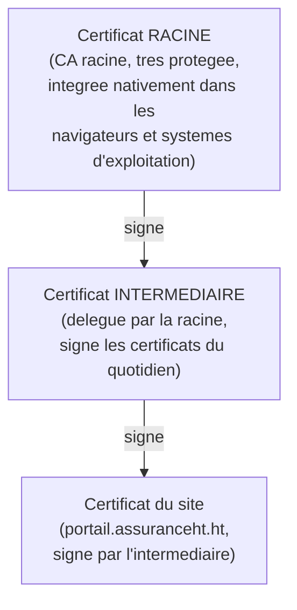

<div class="chapitre-titre-num">CHAPITRE 24</div>

# PKI, certificats et TLS

<div class="encadre objectif">
<span class="encadre-titre">🎯 Objectif du chapitre</span>
Comprendre l'infrastructure à clés publiques (PKI), les certificats numériques et le protocole TLS qui chiffre et authentifie la quasi-totalité des communications web modernes — y compris le portail client de ce manuel. À la fin de ce chapitre, tu sauras diagnostiquer un certificat expiré ou mal configuré, comprendre la chaîne de confiance qui permet à un navigateur de faire confiance à un site, et automatiser le renouvellement des certificats pour ne plus jamais revivre l'incident de ce chapitre.
</div>

<div class="encadre scenario">
<span class="encadre-titre">🎬 Mise en situation</span>
Un lundi matin, plusieurs clients signalent qu'ils ne peuvent plus accéder au portail en ligne : leur navigateur affiche un avertissement de sécurité effrayant ("Votre connexion n'est pas privée") au lieu du site habituel. Le développeur, paniqué, se demande si le site a été piraté. En quelques secondes de vérification, tu identifies la cause réelle, bien plus banale mais tout aussi bloquante : le certificat TLS du site a expiré la veille à minuit, personne ne l'ayant renouvelé à temps. Ce chapitre explique ce qu'est réellement ce certificat, pourquoi son expiration bloque tout accès, et surtout comment ne plus jamais dépendre d'un renouvellement manuel oubliable.
</div>

## 24.1 Pourquoi HTTPS est indispensable, pas optionnel

**TLS** (*Transport Layer Security*, le successeur de SSL) chiffre les communications entre un client (navigateur) et un serveur, et authentifie l'identité du serveur — la brique qui transforme HTTP en HTTPS. Pour un portail client manipulant potentiellement des données sensibles (informations d'assurance, documents personnels), TLS n'est jamais une option facultative.

<div class="encadre securite">
<span class="encadre-titre">🔒 Sécurité — ce que TLS protège concrètement</span>
Sans TLS, toute donnée échangée entre un client et le portail (identifiants de connexion, numéros de police d'assurance, documents téléversés) circule en clair sur le réseau — interceptable par quiconque a accès au trafic, exactement le même risque déjà évoqué pour LDAP en clair au chapitre 22. TLS résout ce problème par deux garanties distinctes : la <strong>confidentialité</strong> (le contenu est chiffré, illisible en cas d'interception) et l'<strong>authentification</strong> (le client peut vérifier qu'il communique bien avec le serveur légitime, pas un imposteur).
</div>

## 24.2 Les briques de la PKI

<div class="encadre astuce">
<span class="encadre-titre">💡 Analogie — le passeport et l'autorité qui le délivre</span>
Un **certificat** numérique fonctionne comme un passeport : il affirme une identité (le nom de domaine du site), et sa crédibilité repose entièrement sur l'autorité qui l'a délivré. Une **autorité de certification** (CA, *Certificate Authority*) joue le rôle du gouvernement qui délivre le passeport — un navigateur fait confiance à un certificat parce qu'il fait confiance, au préalable, à l'autorité qui l'a signé, exactement comme un douanier fait confiance à un passeport parce qu'il reconnaît et fait confiance au pays émetteur.
</div>

| Élément | Rôle |
|---|---|
| **Clé privée** | Reste secrète sur le serveur, jamais partagée — sert à prouver l'identité et à déchiffrer |
| **Clé publique** | Intégrée au certificat, partagée librement — sert à chiffrer et à vérifier une signature |
| **Certificat** | Associe une clé publique à une identité (un nom de domaine), signé par une CA |
| **Autorité de certification (CA)** | Signe les certificats, garantissant leur authenticité aux yeux des navigateurs qui lui font confiance |

## 24.3 La chaîne de confiance



<div class="encadre astuce">
<span class="encadre-titre">💡 Explication du schéma — pourquoi un intermédiaire plutôt qu'une signature directe</span>
Le certificat racine est délibérément gardé hors ligne et protégé avec la plus grande rigueur possible, car sa compromission remettrait en cause la confiance de millions de certificats dans le monde. Un certificat intermédiaire, délégué par la racine, signe les certificats individuels au quotidien — s'il est un jour compromis, seul cet intermédiaire (et les certificats qu'il a signés) doit être révoqué, sans affecter la racine elle-même. Un navigateur vérifie toute la chaîne, du certificat du site jusqu'à une racine en laquelle il a déjà confiance, avant d'accepter la connexion comme sécurisée.
</div>

<div class="encadre attention">
<span class="encadre-titre">⚠️ Une erreur fréquente de configuration : la chaîne incomplète</span>
Un serveur mal configuré peut présenter uniquement son certificat de site (la feuille), sans le certificat intermédiaire qui le relie à une racine reconnue. La plupart des navigateurs modernes affichent alors une erreur de confiance, même si le certificat du site lui-même est parfaitement valide — une cause fréquente et souvent mal diagnostiquée de "certificat qui ne marche pas", distincte d'une véritable expiration.
</div>

## 24.4 Diagnostiquer le scénario d'ouverture

```
# Verifier les dates de validite d'un certificat directement en ligne
# de commande, sans dependre du navigateur
echo | openssl s_client -connect portail.assuranceht.ht:443 2>/dev/null | openssl x509 -noout -dates

# Verifier la chaine complete presentee par le serveur (utile pour
# diagnostiquer une chaine incomplete, section 24.3)
openssl s_client -connect portail.assuranceht.ht:443 -showcerts
```

<div class="encadre attention">
<span class="encadre-titre">🩺 Symptôme : "Votre connexion n'est pas privée" ou avertissement de sécurité dans le navigateur</span>

- **Diagnostic** : ce message générique recouvre plusieurs causes distinctes — certificat expiré (le cas du scénario d'ouverture), certificat auto-signé non reconnu, chaîne incomplète (section 24.3), ou nom de domaine ne correspondant pas au certificat présenté.
- **Comment vérifier** : `openssl x509 -noout -dates` (ci-dessus) affiche précisément la date d'expiration — si elle est dépassée, la cause est confirmée immédiatement, sans ambiguïté ni besoin d'explorer d'autres hypothèses.
- **Résolution** : pour une expiration confirmée, renouveler le certificat immédiatement (section 24.6) ; pour une chaîne incomplète, reconfigurer le serveur pour inclure le certificat intermédiaire ; pour un nom ne correspondant pas, vérifier que le certificat couvre bien le domaine exact utilisé par les clients.
</div>

## 24.5 Automatiser le renouvellement : ne plus jamais revivre cet incident

<div class="encadre mauvaise-pratique">
<span class="encadre-titre">❌ Mauvaise pratique — un renouvellement manuel, planifié "dans la tête" de quelqu'un</span>
Compter sur la mémoire d'une personne pour renouveler un certificat une fois par an (ou selon sa durée de validité) est exactement le type de fragilité dénoncée depuis le chapitre 1 : une seule personne, un seul rappel manuel, aucune garantie systémique. C'est précisément ce qui a causé l'incident du scénario d'ouverture.
</div>

**Let's Encrypt**, une autorité de certification gratuite, a rendu l'automatisation complète du cycle de vie des certificats accessible à toute organisation, via des outils comme **certbot** :

```
# Installation de certbot (exemple sur Ubuntu, chapitre 15)
sudo apt install certbot python3-certbot-nginx

# Obtenir et installer automatiquement un certificat pour le portail,
# configurant directement Nginx pour l'utiliser
sudo certbot --nginx -d portail.assuranceht.ht

# Certbot installe automatiquement une tache planifiee (rappel du
# chapitre 20 sur cron, ou un timer systemd, chapitre 16) qui tente
# le renouvellement automatique bien avant l'expiration reelle
sudo certbot renew --dry-run
```

<div class="encadre bonne-pratique">
<span class="encadre-titre">✅ Bonne pratique — automatiser, puis surveiller l'automatisation elle-même</span>
L'automatisation seule ne suffit pas totalement : ajouter une vérification de la date d'expiration du certificat au script de supervision quotidien des chapitres 20-21 (exactement comme la vérification NTP ajoutée au chapitre 23) offre une seconde ligne de défense si, pour une raison quelconque, le renouvellement automatique échouait silencieusement — une alerte des semaines avant l'expiration réelle laisse largement le temps d'intervenir manuellement si besoin.
</div>

## 24.6 Protéger la clé privée : la règle absolue

<div class="encadre securite">
<span class="encadre-titre">🔒 Sécurité — une clé privée compromise invalide toute la confiance du certificat</span>
Si la clé privée associée à un certificat est un jour exposée (permissions de fichier trop larges, committée par erreur dans un dépôt Git comme évoqué au chapitre 20, ou volée lors d'une intrusion), un attaquant peut techniquement usurper l'identité du site — créer un site malveillant se faisant passer pour le portail légitime, indétectable par les clients sans moyen de vérification supplémentaire. La clé privée doit être protégée par des permissions Unix strictes (chapitre 18 : lecture réservée au seul compte du service concerné), jamais partagée par email ou stockée dans un dépôt de code, et **révoquée immédiatement** si sa compromission est ne serait-ce que suspectée.
</div>

## 24.7 Certificats internes : quand une CA d'entreprise a du sens

Pour des services purement internes (comme LDAPS mentionné au chapitre 22, ou une console d'administration interne), une **autorité de certification interne** à l'entreprise peut être préférable à un certificat public : elle ne nécessite pas d'exposition sur Internet et permet de contrôler entièrement le cycle de vie des certificats internes, à condition de déployer le certificat racine interne sur tous les postes de l'entreprise qui doivent lui faire confiance.

<div class="encadre astuce">
<span class="encadre-titre">💡 Certificat public vs certificat interne — un choix selon l'audience</span>
Un certificat public (Let's Encrypt ou une CA commerciale) est indispensable dès qu'un service est accessible par des personnes extérieures à l'organisation (comme le portail client de ce manuel), car leurs navigateurs doivent faire confiance au certificat sans configuration préalable. Un certificat interne convient à des services strictement internes, où l'entreprise contrôle déjà tous les postes clients et peut y déployer son certificat racine interne — exactement le même principe de périmètre de confiance que le bastion du chapitre 4.
</div>

## Atelier — Diagnostiquer et corriger le scénario d'ouverture

<div class="encadre exercice">
<span class="encadre-titre">🛠️ Atelier 24 — De l'incident à la prévention durable</span>

**Objectif** : appliquer la démarche complète de ce chapitre, du diagnostic initial à la prévention durable de récurrence.

**Préparation** : aucune installation nécessaire pour cet atelier conceptuel, ou un accès à un serveur de test avec Nginx pour le pratiquer réellement.

**Étapes détaillées** :

1. Rédige la commande pour confirmer, sans dépendre du navigateur, que le certificat du portail a effectivement expiré.
2. Rédige les commandes pour installer certbot et obtenir un nouveau certificat automatiquement renouvelable.
3. Propose une mesure de supervision complémentaire pour détecter une future expiration bien avant qu'elle ne bloque les clients.
4. Compare ta démarche à la section "Résultat attendu".

**Résultat attendu** : `openssl s_client ... | openssl x509 -noout -dates` confirme la date d'expiration dépassée. `sudo certbot --nginx -d portail.assuranceht.ht` obtient un nouveau certificat et configure automatiquement son renouvellement. La mesure de supervision complémentaire ajoute une vérification de date d'expiration (avec une alerte si moins de 30 jours restants, par exemple) au script de santé des chapitres 20-21 — une double protection qui ne dépend plus uniquement de l'automatisation de certbot fonctionnant silencieusement sans jamais être vérifiée.

**Dépannage** : si `certbot --nginx` échoue avec une erreur de validation de domaine, vérifie que le DNS du domaine concerné (chapitre 9) pointe bien vers ce serveur — Let's Encrypt doit pouvoir joindre le serveur via ce nom de domaine précis pour valider que la demande de certificat est légitime, avant de l'émettre.
</div>

## Erreurs fréquentes

<div class="encadre attention">
<span class="encadre-titre">⚠️ Erreur n°1 — compter sur un renouvellement manuel</span>
Exactement la cause du scénario d'ouverture, détaillée en section 24.5 — l'automatisation via certbot élimine ce risque presque entièrement.
</div>

<div class="encadre attention">
<span class="encadre-titre">⚠️ Erreur n°2 — négliger la protection de la clé privée</span>
Rappel de la section 24.6 : une clé privée exposée invalide toute la confiance du certificat, un risque bien plus grave qu'une simple expiration.
</div>

<div class="encadre attention">
<span class="encadre-titre">⚠️ Erreur n°3 — accepter un certificat auto-signé en production sans en comprendre les implications</span>
Un certificat auto-signé (non signé par une CA reconnue) déclenche systématiquement un avertissement navigateur — acceptable pour un environnement de test isolé, mais jamais pour un service accessible par de vrais clients externes, qui apprendraient alors à ignorer les avertissements de sécurité par habitude, un risque de sécurité comportemental plus large que le certificat lui-même.
</div>

## En entreprise

- **Bonne pratique répandue** : automatiser systématiquement le renouvellement de tout certificat de production via des outils comme certbot, avec une supervision de secours indépendante (section 24.5) — jamais un renouvellement manuel comme seul filet de sécurité.
- **Bonne pratique répandue** : maintenir un inventaire (chapitre 3) de tous les certificats en usage dans l'organisation, avec leurs dates d'expiration, y compris les certificats internes moins visibles qu'un site public.
- **Erreur classique observée** : un certificat interne (section 24.7) oublié parce qu'invisible depuis l'extérieur, expirant silencieusement et bloquant un service interne critique, découvert seulement quand des employés commencent à signaler des erreurs.

## Entretien technique

<div class="encadre exercice">
<span class="encadre-titre">💼 Questions fréquemment posées en entretien</span>

**Q1. "Qu'est-ce qu'une chaîne de confiance en PKI ?"**
Réponse attendue : la séquence de certificats (feuille, intermédiaire, racine) qu'un navigateur remonte pour vérifier qu'un certificat de site est signé, directement ou indirectement, par une autorité de certification en laquelle il a déjà confiance — chaque maillon signant le suivant, jusqu'à une racine reconnue nativement.

**Q2. "Un client te signale un avertissement 'certificat expiré'. Comment le confirmes-tu rapidement, sans ouvrir un navigateur ?"**
Réponse attendue : `openssl s_client -connect domaine:443 | openssl x509 -noout -dates`, qui affiche précisément les dates de validité du certificat présenté par le serveur, confirmant ou infirmant l'hypothèse immédiatement.

**Q3. "Pourquoi l'automatisation du renouvellement de certificat est-elle considérée comme une bonne pratique essentielle, pas seulement un confort ?"**
Réponse attendue : un renouvellement manuel dépend de la mémoire humaine, un point de défaillance unique similaire au "bus factor" du chapitre 1 — l'automatisation (certbot) élimine ce risque systémique, tandis qu'une supervision complémentaire de la date d'expiration ajoute une seconde ligne de défense en cas d'échec silencieux de l'automatisation elle-même.
</div>

## Optimisation, sécurité et maintenabilité — les réflexes dès ce chapitre

<div class="encadre securite">
<span class="encadre-titre">🔒 Sécurité</span>
Protège systématiquement toute clé privée avec des permissions Unix strictes (chapitre 18) et ne la committe jamais dans un dépôt Git (chapitre 20) — une clé privée compromise doit être immédiatement révoquée et remplacée, jamais simplement "espérée non découverte".
</div>

<div class="encadre bonne-pratique">
<span class="encadre-titre">✅ Maintenabilité</span>
Maintiens un inventaire à jour de tous les certificats de l'organisation avec leurs dates d'expiration (chapitre 3), y compris les certificats internes moins visibles — un audit périodique simple qui aurait détecté le scénario d'ouverture bien avant l'expiration réelle.
</div>

<div class="encadre performance">
<span class="encadre-titre">🚀 Performance</span>
L'automatisation via certbot ne coûte quasiment rien en performance ou en complexité opérationnelle une fois configurée, contrairement au coût potentiellement élevé (perte de confiance client, interruption de service) d'un certificat expiré non détecté à temps — un rapport bénéfice/coût très favorable qui justifie sa mise en place systématique.
</div>

## Résumé du chapitre

- TLS chiffre les communications et authentifie l'identité d'un serveur, une exigence non négociable pour tout service manipulant des données sensibles.
- Un certificat associe une clé publique à une identité, signé par une autorité de certification (CA) ; la clé privée correspondante ne doit jamais être partagée.
- La chaîne de confiance (racine, intermédiaire, feuille) permet à un navigateur de vérifier l'authenticité d'un certificat sans connaître directement chaque site.
- Un certificat expiré, une chaîne incomplète, ou un certificat auto-signé non reconnu sont les causes les plus fréquentes d'avertissements de sécurité navigateur.
- L'automatisation du renouvellement (Let's Encrypt/certbot) élimine le risque de dépendre d'une mémoire humaine, complétée par une supervision indépendante de la date d'expiration.

## Quiz

<div class="encadre exercice">
<span class="encadre-titre">📝 QCM (une seule bonne réponse par question)</span>

1. TLS garantit principalement :
   - a) La vitesse de connexion
   - b) La confidentialité et l'authentification d'une communication
   - c) L'indexation par les moteurs de recherche
   - d) La sauvegarde automatique des données

2. Une chaîne de confiance en PKI part généralement :
   - a) De la racine vers la feuille uniquement
   - b) Du certificat du site (feuille), en remontant vers un intermédiaire, jusqu'à une racine reconnue
   - c) Uniquement d'un certificat auto-signé
   - d) Ne concerne que les certificats internes

3. La bonne pratique face au renouvellement de certificat est de :
   - a) Le planifier manuellement dans un calendrier personnel
   - b) L'automatiser (par exemple avec certbot) et le superviser indépendamment
   - c) Utiliser uniquement des certificats sans date d'expiration
   - d) Ignorer les avertissements d'expiration tant que le site fonctionne encore

**Corrigé** : 1-b, 2-b, 3-b.
</div>

<div class="encadre exercice">
<span class="encadre-titre">📝 Vrai ou Faux</span>

1. La clé privée d'un certificat peut être partagée sans risque tant que le certificat public reste secret. — **Faux** (c'est l'inverse : la clé privée doit rester secrète, le certificat public est destiné à être partagé).
2. Une chaîne de certificats incomplète peut provoquer un avertissement navigateur même si le certificat du site lui-même est valide. — **Vrai**.
3. Let's Encrypt est une autorité de certification payante réservée aux grandes entreprises. — **Faux** (elle est gratuite et largement accessible).
4. Un certificat auto-signé convient à un environnement de test isolé, mais pas à un service public de production. — **Vrai**.
</div>

<div class="encadre exercice">
<span class="encadre-titre">📝 Questions ouvertes</span>

1. Explique pourquoi une supervision indépendante de la date d'expiration reste utile même après avoir automatisé le renouvellement avec certbot.
2. Reprends le scénario d'ouverture. Explique ce que tu répondrais au développeur qui pense initialement que le site a été piraté.

**Corrigé 1** : l'automatisation peut échouer silencieusement pour des raisons variées (changement de configuration réseau bloquant la validation Let's Encrypt, erreur de permissions, service certbot lui-même désactivé sans que personne ne le remarque) — sans une vérification indépendante de la date d'expiration réelle du certificat en production, un tel échec silencieux ne serait découvert qu'au moment de l'expiration effective, exactement comme dans le scénario d'ouverture. La supervision complémentaire agit comme un filet de sécurité qui ne dépend pas du bon fonctionnement de l'automatisation elle-même.

**Corrigé 2** : je lui expliquerais qu'un certificat expiré et un piratage sont deux situations très différentes, immédiatement distinguables avec `openssl x509 -noout -dates` — un certificat expiré affiche une date de fin de validité clairement dépassée, sans aucun signe de compromission du serveur ou du code applicatif lui-même. Ce type d'incident, bien que bloquant et impressionnant pour l'utilisateur final à cause du message d'avertissement du navigateur, est une simple question de cycle de vie de certificat non renouvelé à temps, résolue en quelques minutes une fois diagnostiquée, sans rapport avec une intrusion ou une faille de sécurité réelle.
</div>

## Exercices

<div class="encadre exercice">
<span class="encadre-titre">📝 Exercice 24.1</span>

Un client signale un avertissement "NET::ERR_CERT_AUTHORITY_INVALID" en tentant d'accéder à un service interne de l'entreprise. Explique quelle configuration de la section 24.7 pourrait expliquer ce message, et pourquoi ce ne serait pas nécessairement une erreur de configuration côté serveur.
</div>

**Corrigé :** Ce message indique généralement que le certificat présenté a été signé par une autorité de certification que le navigateur du client ne reconnaît pas — exactement ce qui se produit avec un certificat signé par une CA interne d'entreprise (section 24.7) si le certificat racine de cette CA interne n'a pas été déployé sur le poste du client concerné. Ce n'est pas nécessairement une erreur du serveur lui-même (qui présente un certificat parfaitement valide selon sa propre CA interne), mais un problème de configuration côté client, résolu en déployant le certificat racine interne sur tous les postes qui doivent accéder à ce service, souvent via une GPO (chapitre 7) pour un déploiement centralisé.

<div class="encadre exercice">
<span class="encadre-titre">📝 Exercice 24.2</span>

Rédige, en 3 à 5 phrases, une entrée pour l'inventaire des actifs (chapitre 3) concernant le certificat du portail client, incluant les informations qui auraient permis de prévenir l'incident du scénario d'ouverture.
</div>

**Corrigé (exemple de réponse) :** "Certificat TLS — portail.assuranceht.ht : émis par Let's Encrypt, renouvellement automatique via certbot configuré le [date], vérification de la date d'expiration incluse dans le script de supervision quotidien depuis le [date], seuil d'alerte fixé à 30 jours avant expiration, dernier renouvellement réussi le [date la plus récente]." Cette entrée, consultée périodiquement ou déclenchée automatiquement par une alerte de supervision, aurait révélé l'approche de l'expiration bien avant le lundi matin du scénario d'ouverture, laissant le temps de diagnostiquer et corriger un éventuel échec de l'automatisation avant tout impact client.

## Checklist de fin de chapitre

<ul class="checklist">
<li>☐ Je comprends ce que TLS protège concrètement (confidentialité et authentification).</li>
<li>☐ Je sais expliquer les rôles de la clé privée, de la clé publique, du certificat et de la CA.</li>
<li>☐ Je comprends la chaîne de confiance (racine, intermédiaire, feuille).</li>
<li>☐ Je sais diagnostiquer un certificat expiré avec `openssl x509 -noout -dates`.</li>
<li>☐ Je sais automatiser le renouvellement d'un certificat avec certbot.</li>
<li>☐ Je comprends pourquoi la protection de la clé privée est absolument critique.</li>
</ul>

## FAQ

<dl class="faq">
<dt>Combien de temps un certificat Let's Encrypt reste-t-il valide ?</dt>
<dd>90 jours, une durée volontairement courte qui encourage fortement l'automatisation du renouvellement (section 24.5) plutôt qu'une gestion manuelle — certbot renouvelle généralement automatiquement bien avant cette échéance, dès qu'il reste environ 30 jours de validité.</dd>

<dt>Un certificat plus cher (payant, d'une CA commerciale) offre-t-il un meilleur chiffrement qu'un certificat Let's Encrypt gratuit ?</dt>
<dd>Non, le niveau de chiffrement technique est équivalent — la différence entre certificats payants et gratuits porte généralement sur des garanties contractuelles, une assurance en cas de faille, ou des fonctionnalités de validation étendue (affichage du nom de l'entreprise), pas sur la robustesse cryptographique elle-même.</dd>

<dt>Que faire si une clé privée est suspectée d'avoir été compromise ?</dt>
<dd>Révoquer immédiatement le certificat associé auprès de la CA qui l'a émis, générer une nouvelle paire de clés, et obtenir un nouveau certificat — ne jamais continuer à utiliser un certificat dont la clé privée est potentiellement entre de mauvaises mains, même temporairement le temps d'organiser le remplacement.</dd>

<dt>TLS protège-t-il contre toutes les formes d'attaques web ?</dt>
<dd>Non, TLS protège spécifiquement la communication en transit (confidentialité, authentification du serveur) — il ne protège pas contre des vulnérabilités applicatives comme les injections ou les failles de logique métier, des sujets abordés séparément dans la Partie 12 (cybersécurité) de ce manuel.</dd>
</dl>

## Références et pour aller plus loin

- Let's Encrypt — documentation officielle : [https://letsencrypt.org/fr/docs/](https://letsencrypt.org/fr/docs/)
- Documentation officielle certbot : [https://certbot.eff.org/](https://certbot.eff.org/)
- Documentation officielle OpenSSL : [https://www.openssl.org/docs/](https://www.openssl.org/docs/)
- Mozilla — Configuration TLS recommandée pour les serveurs web : [https://ssl-config.mozilla.org/](https://ssl-config.mozilla.org/)

*Chapitre suivant : MFA et authentification forte — comment ajouter une couche de protection supplémentaire au-delà du simple mot de passe, pour l'ensemble des accès de l'entreprise.*
