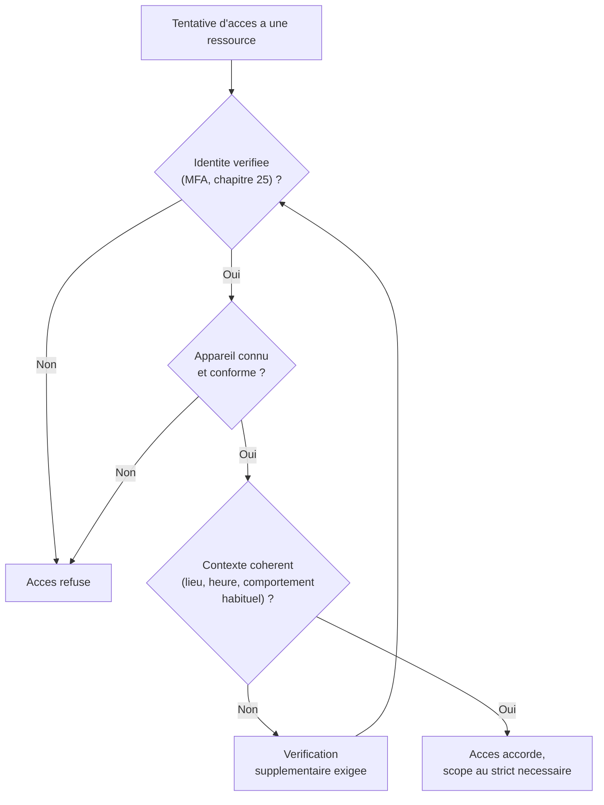
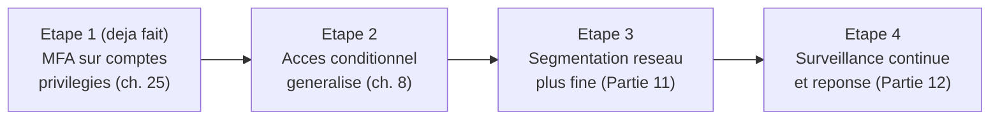

CHAPITRE 26

# Zero Trust : principes et mise en œuvre

🎯 Objectif du chapitre
Comprendre le Zero Trust non pas comme un produit à acheter, mais comme une philosophie de sécurité qui généralise tout ce que ce manuel a déjà construit depuis le chapitre 1 : ne jamais faire confiance par défaut, toujours vérifier explicitement. À la fin de ce chapitre, tu sauras expliquer pourquoi le modèle de sécurité périmétrique traditionnel ne suffit plus, identifier les piliers concrets du Zero Trust, et élaborer une feuille de route réaliste pour une organisation, plutôt qu'un projet "tout ou rien" voué à l'échec.

🎬 Mise en situation
Suite à l'incident du chapitre 25 (le compte protégé malgré le mot de passe compromis), le DSI est impressionné et te pose une question plus large : <em>"On a eu de la chance avec le MFA sur ce compte précis. Mais est-ce qu'on a la même protection partout ? Si quelqu'un se connecte au VPN avec des identifiants volés, qu'est-ce qui l'empêche ensuite de se promener librement sur tout notre réseau interne ?"</em> C'est une excellente question, qui révèle une faille conceptuelle du modèle de sécurité traditionnel : une fois "dans" le réseau, la confiance devient souvent implicite et large. Ce chapitre présente le Zero Trust, le cadre de pensée qui répond précisément à cette question — en assemblant des briques que ce manuel a déjà posées une à une depuis le premier chapitre.

## 26.1 Le modèle périmétrique traditionnel et sa limite fondamentale

💡 Analogie — le château fort et les douves
Le modèle de sécurité traditionnel ressemble à un château fort entouré de douves : une fois le pont-levis franchi (authentification au périmètre, comme une connexion VPN ou un badge d'entrée), un visiteur peut circuler relativement librement à l'intérieur des murs, avec une confiance largement implicite. Ce modèle fonctionnait raisonnablement bien tant que "l'intérieur" et "l'extérieur" étaient clairement délimités — mais le travail à distance, le cloud hybride (chapitre 8) et les partenaires externes ont rendu cette frontière de plus en plus floue et poreuse.

⚠️ La question du DSI révèle exactement cette limite
Dans un modèle périmétrique pur, un attaquant qui franchit une seule fois le périmètre (VPN compromis, identifiants volés) peut ensuite se déplacer relativement librement à l'intérieur du réseau — un mouvement latéral difficile à détecter si la confiance interne n'est jamais revérifiée. C'est précisément le scénario que redoute le DSI : le MFA a protégé le point d'entrée dans le chapitre 25, mais rien ne garantit qu'une compromission ailleurs ne donnerait pas un accès large une fois "dans" le réseau.

## 26.2 Le principe fondamental : "Never trust, always verify"

📌 À retenir — la définition du Zero Trust en une phrase
Le Zero Trust part du principe qu'aucune confiance ne doit être accordée implicitement, ni à l'intérieur ni à l'extérieur d'un réseau — chaque accès à chaque ressource doit être **explicitement vérifié**, à chaque fois, indépendamment de l'origine de la connexion. Ce n'est pas un produit unique à installer, mais une philosophie qui se traduit par un ensemble cohérent de pratiques — dont beaucoup ont déjà été posées, chapitre après chapitre, sans être nommées "Zero Trust" jusqu'ici.

## 26.3 Les piliers du Zero Trust, déjà construits au fil de ce manuel

| Pilier Zero Trust | Déjà couvert dans ce manuel |
|---|---|
| **Identité forte, vérifiée systématiquement** | MFA (chapitre 25), Kerberos (chapitre 23), comptes nominatifs (chapitre 4) |
| **Appareils vérifiés** | Accès conditionnel selon l'état de l'appareil (chapitre 8) |
| **Moindre privilège strict** | Principe posé dès le chapitre 1, appliqué aux GPO (chapitre 7), à sudo/ACL (chapitre 18) |
| **Micro-segmentation** | Le bastion (chapitre 4) comme première étape, approfondi en Partie 11 |
| **Chiffrement systématique** | TLS (chapitre 24), LDAPS (chapitre 22), jamais de service en clair |
| **Journalisation et surveillance continues** | Journalisation des accès distants (chapitre 4), des changements (chapitre 2) |

🧠 À mémoriser — le Zero Trust n'est pas une nouveauté radicale pour toi
Si tu as suivi ce manuel depuis le chapitre 1, tu as déjà appliqué la plupart des principes fondamentaux du Zero Trust sans les nommer ainsi. Ce chapitre ne t'enseigne pas des techniques entièrement nouvelles — il te donne le **vocabulaire et le cadre conceptuel** pour organiser et communiquer une stratégie cohérente à partir de pratiques déjà en place, exactement la question que pose le DSI dans le scénario d'ouverture.

## 26.4 L'accès conditionnel : la mise en œuvre concrète du "toujours vérifier"

Rappel direct du chapitre 8 : les politiques d'accès conditionnel d'Entra ID permettent d'exiger des conditions supplémentaires (MFA, appareil conforme, localisation) **selon le contexte réel** de chaque tentative d'accès, plutôt qu'une confiance uniforme une fois authentifié.

💡 Explication du schéma — vérifier à chaque étape, jamais une seule fois pour toute la session
Contrairement au modèle périmétrique où une authentification unique au périmètre suffit ensuite pour toute la session, le Zero Trust réévalue le contexte à chaque tentative d'accès à une ressource distincte — une connexion habituelle depuis le bureau de Port-au-Prince ne déclenche pas la même vigilance qu'une tentative soudaine depuis un pays inhabituel, même avec un mot de passe et un MFA techniquement valides.

## 26.5 Revisiter le bastion du chapitre 4 sous l'angle Zero Trust

⚠️ Le bastion seul n'est qu'une première étape, pas une solution Zero Trust complète
Le bastion du chapitre 4 réduit la surface d'attaque exposée à Internet à un seul point — une excellente pratique, mais qui, seule, reproduit encore une forme de modèle périmétrique à plus petite échelle : une fois le bastion franchi légitimement, quelle vérification supplémentaire s'applique à chaque serveur interne atteint ensuite ? Une architecture Zero Trust mature étend la vérification **au-delà** du bastion, jusqu'à chaque ressource individuelle — exactement la préoccupation soulevée par le DSI dans le scénario d'ouverture.

✅ Bonne pratique — combiner bastion ET vérification continue au-delà
Le bastion reste une brique utile et recommandée (il reste plus simple de sécuriser un seul point d'entrée qu'une multitude), mais il doit être complété par une segmentation réseau plus fine (Partie 11) et par des contrôles d'accès qui ne présument jamais qu'un utilisateur "déjà entré" a automatiquement le droit d'accéder à tout ce qui se trouve derrière — le principe du moindre privilège, appliqué non seulement aux comptes (chapitre 1) mais à l'architecture réseau elle-même.

## 26.6 Une feuille de route réaliste, pas un projet "big bang"

❌ Mauvaise pratique — annoncer "on passe au Zero Trust" comme un projet unique
Le Zero Trust n'est pas un interrupteur binaire qu'on active un jour donné — c'est un ensemble de pratiques qui se déploient progressivement, exactement comme la plupart des chantiers de sécurité de ce manuel (le durcissement RDP du chapitre 4, l'extension du MFA du chapitre 25). Annoncer un "projet Zero Trust" monolithique risque de créer des attentes irréalistes et un chantier qui s'enlise, plutôt que des progrès mesurables.

✅ Bonne pratique — répondre au DSI avec une feuille de route, pas une promesse
Face à la question du scénario d'ouverture, la bonne réponse n'est pas "on va installer du Zero Trust", mais une feuille de route concrète : ce qui est déjà en place (MFA sur les comptes privilégiés, bastion), ce qui vient ensuite (accès conditionnel étendu à tous les utilisateurs), et ce qui reste à construire (segmentation réseau plus fine, approfondie en Partie 11, et surveillance continue, approfondie en Partie 12) — exactement le principe directeur ITIL "progresser de manière itérative avec un retour d'information" du chapitre 2, appliqué ici à la stratégie de sécurité globale.

## 26.7 Le piège du Zero Trust comme argument marketing vide

⚠️ Se méfier des produits vendus comme "solution Zero Trust clé en main"
De nombreux fournisseurs commercialisent des produits sous l'étiquette "Zero Trust" — un vocabulaire qui s'est largement répandu dans le marketing de la cybersécurité. Aucun produit unique n'implémente à lui seul une véritable posture Zero Trust : c'est la combinaison cohérente de plusieurs pratiques (section 26.3), pas un achat ponctuel, qui construit réellement cette philosophie. Évaluer un outil selon ce qu'il apporte concrètement à l'un des piliers de la section 26.3, plutôt que selon son étiquette marketing, reste le réflexe critique à conserver.

## Atelier — Construire la feuille de route Zero Trust de l'entreprise

🛠️ Atelier 26 — Répondre au DSI avec une feuille de route concrète

**Objectif** : synthétiser l'ensemble des chapitres précédents en une feuille de route Zero Trust réaliste, répondant directement à la question du scénario d'ouverture.

**Préparation** : aucune installation nécessaire — cet atelier est un exercice de synthèse.

**Étapes détaillées** :

1. Liste, pour chaque pilier du tableau de la section 26.3, ce qui est déjà en place dans l'entreprise d'après les chapitres précédents de ce manuel.
2. Identifie, pour chaque pilier, une prochaine étape concrète et réaliste, en t'inspirant de la feuille de route de la section 26.6.
3. Rédige une réponse de 5 à 6 phrases au DSI, qui reconnaît la validité de sa préoccupation tout en présentant une feuille de route plutôt qu'une promesse de solution instantanée.
4. Compare ta démarche à la section "Résultat attendu".

**Résultat attendu** : le tableau de la section 26.3 sert de base directe. La réponse au DSI reconnaît que le mouvement latéral après une compromission du périmètre est un risque réel non encore entièrement couvert, présente les progrès déjà réalisés (MFA, bastion, chiffrement systématique) comme les fondations déjà posées, et propose une feuille de route progressive (accès conditionnel généralisé, puis segmentation réseau plus fine en Partie 11, puis surveillance continue en Partie 12) plutôt qu'un projet flou et non planifié.

**Dépannage** : si ta réponse au DSI ressemble à une promesse vague ("on va sécuriser tout ça"), reviens à la section 26.6 et transforme chaque affirmation en une étape concrète, avec une brique technique précise déjà couverte ou à venir dans ce manuel.

## Erreurs fréquentes

⚠️ Erreur n°1 — traiter le Zero Trust comme un produit à acheter
Rappel de la section 26.7 : aucun produit unique n'implémente à lui seul une posture Zero Trust complète — c'est la cohérence de plusieurs pratiques combinées qui compte.

⚠️ Erreur n°2 — annoncer un projet Zero Trust "big bang"
Rappel de la section 26.6 : un déploiement progressif, mesurable étape par étape, réussit bien mieux qu'une transformation annoncée comme instantanée et globale.

⚠️ Erreur n°3 — négliger les comptes de service dans une stratégie Zero Trust
Rappel indirect du chapitre 25 (section sur les comptes de service) : le Zero Trust doit s'appliquer autant aux comptes humains qu'aux comptes de service automatisés, souvent négligés parce qu'ils échappent au MFA interactif classique — une lacune fréquente d'une stratégie qui se concentre uniquement sur les utilisateurs humains.

## Diagnostiquer les hypothèses de confiance implicite existantes

🩺 Situation : "Comment savoir si notre organisation a encore des angles morts de confiance implicite ?"

- **Diagnostic** : identifier chaque endroit où un accès est accordé "parce qu'on est déjà à l'intérieur" du réseau, sans vérification supplémentaire — un audit de la CMDB (chapitre 3) et des règles de pare-feu internes (Partie 11) révèle souvent ces angles morts.
- **Comment vérifier** : se poser systématiquement la question "si un attaquant obtenait ce niveau d'accès précis, jusqu'où pourrait-il aller sans rencontrer de vérification supplémentaire ?" pour chaque segment du réseau et chaque type de compte.
- **Résolution** : prioriser la correction des angles morts les plus critiques en premier (comptes à privilège élevé, accès aux données les plus sensibles), suivant la même logique de priorisation impact/urgence déjà vue au chapitre 2, plutôt que de tenter de tout corriger simultanément.

## En entreprise

- **Bonne pratique répandue** : présenter le Zero Trust à la direction comme une feuille de route progressive avec des jalons mesurables, plutôt qu'un projet flou risquant de perdre en crédibilité s'il ne produit pas de résultat visible rapidement.
- **Bonne pratique répandue** : auditer régulièrement les comptes de service et les accès automatisés, souvent les grands oubliés d'une stratégie Zero Trust centrée uniquement sur les utilisateurs humains.
- **Erreur classique observée** : l'achat d'un produit marketé "Zero Trust" sans changement réel des pratiques internes (toujours des comptes partagés, toujours une confiance implicite une fois le VPN connecté) — un habillage cosmétique plutôt qu'une transformation réelle de la posture de sécurité.

## Entretien technique

💼 Questions fréquemment posées en entretien

**Q1. "Explique le principe du Zero Trust en une phrase, et donne un exemple concret de sa mise en œuvre."**
Réponse attendue : "Never trust, always verify" — ne jamais accorder de confiance implicite, vérifier explicitement chaque accès. Exemple concret : l'accès conditionnel Entra ID (chapitre 8), qui réévalue le contexte de chaque tentative de connexion plutôt que de faire confiance indéfiniment après une authentification unique.

**Q2. "Pourquoi le modèle de sécurité périmétrique traditionnel ('château fort et douves') ne suffit-il plus ?"**
Réponse attendue : le travail à distance, le cloud hybride et les partenaires externes ont rendu la frontière entre "intérieur" et "extérieur" du réseau de plus en plus floue ; de plus, un attaquant qui franchit une seule fois le périmètre peut ensuite se déplacer relativement librement si la confiance interne n'est jamais revérifiée (mouvement latéral).

**Q3. "Le Zero Trust est-il un produit qu'on peut acheter et installer ?"**
Réponse attendue : non, c'est une philosophie de sécurité qui se traduit par la combinaison cohérente de plusieurs pratiques (identité forte, appareils vérifiés, moindre privilège, segmentation, chiffrement, surveillance) — aucun produit unique ne peut, à lui seul, constituer une posture Zero Trust complète.

## Optimisation, sécurité et maintenabilité — les réflexes dès ce chapitre

🔒 Sécurité
Traite chaque nouvelle ressource, chaque nouveau service, avec la question systématique "qui devrait vraiment y avoir accès, et comment cet accès sera-t-il vérifié à chaque fois ?" plutôt que de présumer qu'une appartenance générale au réseau de l'entreprise suffit — le réflexe central de ce chapitre, applicable à toute décision d'architecture future.

✅ Maintenabilité
Documente (chapitre 3) la feuille de route Zero Trust de l'organisation comme un document vivant, mis à jour à chaque étape franchie — exactement le type de document stratégique qui justifie et oriente les décisions d'architecture futures, plutôt qu'une intention jamais formalisée.

🚀 Performance
Une vérification excessive et mal calibrée (redemander le MFA à chaque clic, par exemple) dégraderait l'expérience utilisateur au point de pousser à des contournements risqués — l'accès conditionnel (section 26.4) permet justement de calibrer la vérification selon le risque réel du contexte, plutôt que d'appliquer une friction uniforme et excessive partout.

## Résumé du chapitre

- Le Zero Trust part du principe qu'aucune confiance implicite ne doit être accordée, ni à l'intérieur ni à l'extérieur du réseau — chaque accès doit être explicitement vérifié.
- Le modèle périmétrique traditionnel ("château fort et douves") ne suffit plus face au travail à distance, au cloud hybride et au risque de mouvement latéral après une compromission du périmètre.
- Les piliers du Zero Trust (identité forte, appareils vérifiés, moindre privilège, segmentation, chiffrement, surveillance) ont déjà été construits progressivement tout au long de ce manuel.
- L'accès conditionnel réévalue le contexte à chaque tentative d'accès, plutôt qu'une confiance uniforme après une authentification unique.
- Le Zero Trust se déploie progressivement via une feuille de route mesurable, jamais comme un projet "big bang" ni un produit unique à acheter.

## Quiz

📝 QCM (une seule bonne réponse par question)

1. Le principe fondamental du Zero Trust est résumé par :
   - a) "Faire confiance mais vérifier occasionnellement"
   - b) "Never trust, always verify"
   - c) "Sécuriser uniquement le périmètre externe"
   - d) "Un seul produit suffit pour tout sécuriser"

2. Le modèle périmétrique traditionnel est limité principalement parce que :
   - a) Il est trop coûteux à mettre en place
   - b) Une fois le périmètre franchi, la confiance interne devient souvent implicite et large
   - c) Il ne fonctionne qu'avec Windows
   - d) Il empêche tout accès distant

3. La bonne approche pour déployer le Zero Trust dans une organisation est :
   - a) Un projet unique et instantané
   - b) L'achat d'un seul produit labellisé "Zero Trust"
   - c) Une feuille de route progressive, étape par étape
   - d) Ignorer les comptes de service, qui ne sont jamais concernés

**Corrigé** : 1-b, 2-b, 3-c.

📝 Vrai ou Faux

1. Le Zero Trust peut être entièrement implémenté par l'achat d'un seul produit de sécurité. — **Faux** (c'est une combinaison de pratiques, pas un produit unique, section 26.7).
2. L'accès conditionnel réévalue le contexte à chaque tentative d'accès, plutôt qu'une seule fois par session. — **Vrai**.
3. Un bastion (chapitre 4) constitue à lui seul une architecture Zero Trust complète. — **Faux** (c'est une première étape utile, mais insuffisante seule, section 26.5).
4. Les comptes de service automatisés doivent être exclus de toute réflexion Zero Trust, puisqu'ils ne peuvent pas utiliser le MFA interactif. — **Faux** (ils doivent être sécurisés par d'autres mécanismes adaptés, pas ignorés).

📝 Questions ouvertes

1. Explique pourquoi le MFA (chapitre 25) et l'accès conditionnel (chapitre 8), déjà couverts avant ce chapitre, constituent en réalité déjà des briques du Zero Trust.
2. Reprends le scénario d'ouverture. Explique pourquoi la préoccupation du DSI sur le mouvement latéral après compromission du VPN reste légitime, malgré les protections déjà en place.

**Corrigé 1** : le MFA garantit qu'une identité est vérifiée explicitement au-delà du simple mot de passe (le pilier "identité forte" de la section 26.3), tandis que l'accès conditionnel réévalue le contexte de chaque tentative de connexion plutôt que de faire confiance uniformément après une authentification unique — exactement le principe "toujours vérifier" du Zero Trust, déjà mis en pratique concrètement dans ces deux chapitres sans que le terme "Zero Trust" n'ait encore été utilisé.

**Corrigé 2** : le MFA du chapitre 25 protège spécifiquement le point d'entrée (empêcher une connexion initiale non autorisée), mais ne dit rien de ce qui se passe une fois qu'une connexion légitime (ou compromise malgré tout, par exemple via une fatigue MFA réussie) est établie — si la confiance interne reste large une fois "dans" le réseau, un mouvement latéral reste possible. La préoccupation du DSI est donc légitime précisément parce qu'elle pointe vers un pilier du Zero Trust (la segmentation et la vérification continue au-delà du point d'entrée) qui n'a pas encore été entièrement construit dans l'infrastructure de l'entreprise à ce stade du manuel.

## Exercices

📝 Exercice 26.1

Un collègue propose d'acheter un produit commercial "tout-en-un labellisé Zero Trust" pour résoudre d'un coup la préoccupation du DSI. Explique, en t'appuyant sur la section 26.7, pourquoi cette approche seule ne suffirait probablement pas.

**Corrigé :** Un produit unique, quelle que soit son étiquette marketing, ne peut à lui seul couvrir l'ensemble des piliers du Zero Trust (identité, appareils, moindre privilège, segmentation, chiffrement, surveillance, section 26.3) — la vraie posture Zero Trust résulte de la cohérence de plusieurs pratiques combinées, pas d'un seul achat. Sans changement des pratiques internes existantes (comptes partagés éventuels, confiance implicite non encore corrigée après le point d'entrée), même le meilleur produit du marché n'éliminerait pas les angles morts identifiés par le DSI — la réponse doit rester une feuille de route de pratiques, éventuellement outillée par un produit, mais jamais réductible au produit seul.

📝 Exercice 26.2

Rédige, en 3 à 5 phrases, les trois prochaines étapes concrètes que tu proposerais à l'entreprise pour avancer sur sa feuille de route Zero Trust, en te basant sur ce qui reste à couvrir dans les parties suivantes de ce manuel.

**Corrigé (exemple de réponse) :** Premièrement, étendre l'accès conditionnel Entra ID (chapitre 8) à l'ensemble des employés, pas seulement aux comptes déjà protégés par MFA. Deuxièmement, entreprendre une segmentation réseau plus fine (Partie 11) pour qu'un accès compromis sur un segment ne donne pas automatiquement accès à l'ensemble du réseau interne, complétant ainsi le bastion du chapitre 4. Troisièmement, mettre en place une surveillance continue des comportements d'authentification (Partie 12, notamment via un SIEM) pour détecter un mouvement latéral suspect même si un attaquant parvenait malgré tout à franchir les premières couches de vérification.

## Checklist de fin de chapitre

<ul class="checklist">
<li>☐ Je sais expliquer le principe "Never trust, always verify" du Zero Trust.</li>
<li>☐ Je comprends pourquoi le modèle périmétrique traditionnel ne suffit plus.</li>
<li>☐ Je sais identifier les piliers du Zero Trust et les relier aux chapitres déjà couverts dans ce manuel.</li>
<li>☐ Je comprends le rôle de l'accès conditionnel dans la mise en œuvre concrète du Zero Trust.</li>
<li>☐ Je sais pourquoi le bastion seul ne constitue pas une architecture Zero Trust complète.</li>
<li>☐ Je sais élaborer une feuille de route Zero Trust progressive plutôt qu'un projet "big bang".</li>
</ul>

## FAQ

<dl class="faq">
<dt>Le Zero Trust est-il uniquement pertinent pour les grandes entreprises ?</dt>
<dd>Non, les principes s'appliquent à toute taille d'organisation, même si leur mise en œuvre se fait à une échelle et avec des outils adaptés (rappel du chapitre 1 sur l'adaptation à la taille de la structure) — une PME peut appliquer le moindre privilège, le MFA et une segmentation basique sans nécessiter les mêmes outils qu'une multinationale.</dd>

<dt>Combien de temps prend un déploiement Zero Trust complet ?</dt>
<dd>Il n'y a pas de "complet" figé dans le temps — c'est un processus continu d'amélioration progressive (section 26.6), pas un projet avec une date de fin définitive, à l'image de la sécurité en général, qui reste un effort permanent plutôt qu'un état atteint une fois pour toutes.</dd>

<dt>Le Zero Trust remplace-t-il le besoin d'un pare-feu périmétrique ?</dt>
<dd>Non, un pare-feu périmétrique reste utile en défense en profondeur (plusieurs couches de protection qui se complètent), mais il ne doit plus être la seule ligne de défense sur laquelle repose toute la confiance de l'organisation, exactement le message central de ce chapitre.</dd>

<dt>Comment mesurer les progrès d'une stratégie Zero Trust ?</dt>
<dd>Via des indicateurs concrets liés à chaque pilier de la section 26.3 : pourcentage de comptes protégés par MFA, couverture de l'accès conditionnel, granularité de la segmentation réseau, délai de détection d'un comportement suspect — des métriques mesurables plutôt qu'une affirmation qualitative vague d'être "Zero Trust" ou non.</dd>
</dl>

## Références et pour aller plus loin

- NIST Special Publication 800-207 — Zero Trust Architecture : [https://csrc.nist.gov/pubs/sp/800/207/final](https://csrc.nist.gov/pubs/sp/800/207/final)
- Microsoft Learn — Adoption du Zero Trust : [https://learn.microsoft.com/fr-fr/security/zero-trust/](https://learn.microsoft.com/fr-fr/security/zero-trust/)
- CISA — Zero Trust Maturity Model : [https://www.cisa.gov/zero-trust-maturity-model](https://www.cisa.gov/zero-trust-maturity-model)

*Fin de la Partie 4. La Partie 5 aborde maintenant le stockage et la continuité d'activité à l'échelle de l'infrastructure entière — RAID matériel, NAS, SAN, stratégies de sauvegarde, PRA et PCA — pour garantir que tout ce qui a été sécurisé jusqu'ici reste aussi disponible et récupérable face à un incident majeur.*
