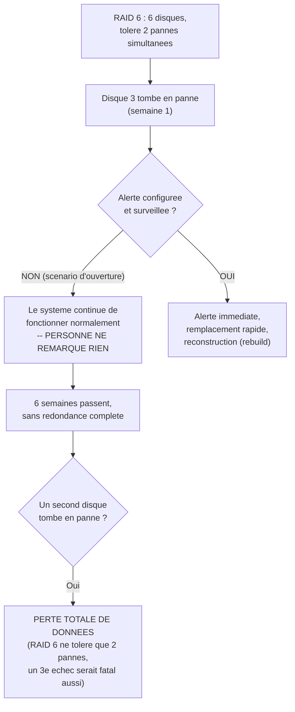

<div class="chapitre-titre-num">CHAPITRE 27</div>

# RAID matériel et logiciel

<div class="encadre objectif">
<span class="encadre-titre">🎯 Objectif du chapitre</span>
Approfondir le RAID au-delà de ce qui a été vu côté Linux (chapitre 17) : comprendre le RAID matériel, son contrôleur dédié et son cache protégé par batterie, le piège classique de la double panne de disque silencieuse, et l'équivalent Windows du RAID logiciel (Storage Spaces). À la fin de ce chapitre, tu sauras choisir entre RAID matériel et logiciel selon un contexte donné, et surtout mettre en place une surveillance qui évite le scénario le plus redouté de tout administrateur ayant déjà géré du RAID en production.
</div>

<div class="encadre scenario">
<span class="encadre-titre">🎬 Mise en situation</span>
L'entreprise achète un nouveau serveur physique pour héberger la base de données financière la plus critique, équipé d'un contrôleur RAID matériel dédié avec six disques en RAID 6. Le fournisseur du serveur mentionne, presque en passant, une "batterie de cache" (BBU) et un "disque de secours à chaud" (hot spare) — deux termes que personne dans l'équipe ne maîtrise vraiment. Trois mois plus tard, tu découvres par hasard, en consultant les journaux du contrôleur pour une tout autre raison, qu'un des six disques est en panne depuis **six semaines**, sans que personne ne s'en soit rendu compte — le serveur continuait de fonctionner normalement, RAID 6 tolérant la perte de deux disques simultanément. Tu réalises immédiatement le risque réel : un second disque tombant en panne pendant ces six semaines aurait causé une perte de données totale, sans qu'aucune alerte n'ait jamais été configurée. Ce chapitre explique comment ce risque, très réel et très fréquent, se prévient.
</div>

## 27.1 RAID matériel vs RAID logiciel : les vrais compromis

Rappel du chapitre 17 : le RAID logiciel (comme `mdadm` sur Linux) est géré directement par le système d'exploitation, sans matériel dédié. Le **RAID matériel** utilise un **contrôleur dédié**, une carte physique distincte qui gère elle-même les calculs RAID, indépendamment du système d'exploitation.

| Critère | RAID logiciel (chapitre 17) | RAID matériel |
|---|---|---|
| Coût matériel | Aucun composant supplémentaire | Contrôleur dédié, coût additionnel réel |
| Charge sur le CPU système | Oui, un peu (négligeable sur du matériel moderne) | Non, déchargée sur le contrôleur |
| Portabilité entre serveurs | Élevée (le tableau RAID peut être reconstruit sur un autre système compatible) | Limitée au même modèle ou une famille compatible de contrôleur |
| Protection en cas de coupure électrique | Dépend entièrement du système de fichiers et de l'UPS | Cache protégé par batterie (BBU, section 27.2) possible |
| Outils de gestion | Standards Linux (`mdadm`), bien documentés | Propriétaires au fournisseur (Dell PERC, HP Smart Array, etc.) |

<div class="encadre retenir">
<span class="encadre-titre">📌 À retenir</span>
Il n'existe pas de réponse universelle "matériel toujours meilleur que logiciel" ou l'inverse — exactement le même principe de décision contextuelle déjà appliqué au choix de distribution Linux (chapitre 14). Un serveur de base de données critique à fort volume d'écriture bénéficie souvent d'un contrôleur matériel avec cache protégé ; un serveur applicatif standard peut très bien se contenter d'un RAID logiciel, plus simple et plus portable.
</div>

## 27.2 Le cache protégé par batterie (BBU) : pourquoi il compte tant

Un contrôleur RAID matériel performant utilise un **cache en écriture** (*write-back cache*) : les données sont confirmées comme écrites dès qu'elles atteignent la mémoire rapide du contrôleur, avant même d'être physiquement écrites sur les disques — un gain de performance significatif. Le risque : si une coupure de courant survient avant que ce cache ne soit réellement transféré sur les disques, ces données sont **perdues**, malgré la confirmation d'écriture déjà envoyée au système.

<div class="encadre securite">
<span class="encadre-titre">🔒 Sécurité — le BBU (Battery Backup Unit) protège ce cache</span>
Une <strong>BBU</strong> (ou son équivalent moderne à supercondensateur, plus fiable dans la durée) maintient le cache du contrôleur alimenté pendant une coupure de courant, le temps que l'alimentation soit rétablie ou que les données soient transférées sur les disques via une capacité de secours — évitant la perte de données en cache. Dans le contexte des coupures de courant fréquentes déjà évoquées pour Haïti (chapitres 6 et 23), un contrôleur RAID matériel <strong>sans</strong> BBU fonctionnelle représente un risque réel et spécifique à ce contexte opérationnel, bien au-delà d'une simple case à cocher technique.
</div>

<div class="encadre attention">
<span class="encadre-titre">⚠️ Une BBU défaillante peut désactiver silencieusement le cache en écriture</span>
La plupart des contrôleurs RAID matériels détectent automatiquement une BBU défaillante ou déchargée et **désactivent le cache en écriture par mesure de précaution**, basculant en mode "write-through" (écriture directe sur disque, plus lente mais plus sûre) — un comportement de sécurité approprié, mais qui peut provoquer une chute de performance soudaine et déroutante si personne ne surveille l'état de la BBU elle-même, laissant croire à tort à un problème applicatif ou réseau.
</div>

## 27.3 Le piège du scénario d'ouverture : la double panne silencieuse



<div class="encadre attention">
<span class="encadre-titre">⚠️ Pourquoi la tolérance de panne RAID peut créer un faux sentiment de sécurité</span>
C'est exactement le piège du scénario d'ouverture : la force du RAID (continuer à fonctionner normalement malgré une panne de disque) devient une faiblesse si elle n'est jamais surveillée activement — un système "qui marche encore" masque parfaitement une dégradation réelle et croissante du risque. Rappel direct du chapitre 17 (section sécurité) : le RAID protège contre une panne matérielle, mais seulement s'il est activement surveillé ; sans surveillance, la protection devient un délai avant l'incident plutôt qu'une vraie garantie.
</div>

## 27.4 Surveiller activement la santé d'un RAID matériel

```
# Exemple avec storcli (outil courant pour les controleurs LSI/Broadcom,
# largement repandus) -- la commande exacte varie selon le fabricant
# du controleur (MegaCli, perccli pour Dell, hpssacli pour HP...)
storcli /c0 show

# Verifier specifiquement l'etat de chaque disque physique
storcli /c0/eall/sall show

# Verifier l'etat de la batterie du cache (BBU)
storcli /c0/bbu show
```

<div class="encadre bonne-pratique">
<span class="encadre-titre">✅ Bonne pratique — intégrer la surveillance RAID au script de supervision existant</span>
Exactement comme la vérification NTP ajoutée au chapitre 23 ou la vérification de certificat ajoutée au chapitre 24, l'état du RAID matériel doit être intégré au script de supervision quotidien des chapitres 20-21 (ou, mieux encore, à un outil de supervision dédié dès la Partie 10) — une alerte automatique dès la première panne de disque aurait évité les six semaines d'exposition silencieuse du scénario d'ouverture.
</div>

<div class="encadre performance">
<span class="encadre-titre">🚀 Performance — le délai de reconstruction (rebuild) comme fenêtre de risque</span>
Après remplacement d'un disque en panne, le contrôleur RAID doit reconstruire les données sur le nouveau disque (le "rebuild") — une opération qui peut prendre plusieurs heures selon la taille des disques, pendant laquelle la tolérance de panne réelle est réduite. Plus la détection d'une panne est rapide (grâce à la surveillance de la section 27.4), plus tôt le remplacement et donc le rebuild peuvent commencer, réduisant d'autant la fenêtre totale de vulnérabilité — le contraire exact des six semaines d'exposition non détectée du scénario d'ouverture.
</div>

## 27.5 Windows Storage Spaces : le RAID logiciel côté Windows

Pour compléter le parallèle avec `mdadm` et LVM (chapitre 17), Windows Server propose son propre RAID logiciel natif : **Storage Spaces**, combinant plusieurs disques physiques en un pool, puis en espaces de stockage logiques avec résilience configurable (simple, en miroir, ou avec parité — des équivalents directs des niveaux RAID 0, 1 et 5/6).

```powershell
# Creer un pool de stockage a partir de plusieurs disques physiques
New-StoragePool -FriendlyName "PoolDonnees" -StorageSubsystemFriendlyName "Windows Storage*" -PhysicalDisks (Get-PhysicalDisk -CanPool $true)

# Creer un espace de stockage resilient (miroir, equivalent RAID 1)
# a l'interieur de ce pool
New-VirtualDisk -StoragePoolFriendlyName "PoolDonnees" -FriendlyName "DonneesResilientes" -ResiliencySettingName Mirror -Size 500GB
```

<div class="encadre astuce">
<span class="encadre-titre">💡 Un principe transversal Windows/Linux, encore une fois</span>
Storage Spaces (Windows) et LVM+mdadm (Linux, chapitre 17) répondent au même besoin fondamental — flexibilité et résilience du stockage — avec une syntaxe différente mais une logique très proche : un pool regroupant des disques physiques, puis des volumes logiques configurés avec un niveau de résilience choisi. Comprendre l'un facilite grandement la compréhension de l'autre, exactement comme LDAP (chapitre 22) a éclairé rétrospectivement Active Directory.
</div>

## Atelier — Concevoir un plan de surveillance RAID pour le scénario d'ouverture

<div class="encadre exercice">
<span class="encadre-titre">🛠️ Atelier 27 — Éviter que les six semaines silencieuses ne se reproduisent</span>

**Objectif** : concevoir un plan de surveillance concret pour le serveur de base de données financière du scénario d'ouverture.

**Préparation** : aucune installation nécessaire pour cet atelier conceptuel.

**Étapes détaillées** :

1. Identifie deux informations distinctes que le plan de surveillance doit vérifier régulièrement, en t'appuyant sur les sections 27.2 et 27.4.
2. Propose une fréquence de vérification raisonnable, et justifie ton choix.
3. Propose un seuil de gravité qui justifierait une alerte immédiate versus une simple entrée de journal.
4. Compare ta démarche à la section "Résultat attendu".

**Résultat attendu** : le plan doit vérifier à la fois l'état de chaque disque physique (`storcli /c0/eall/sall show`, section 27.4) ET l'état de la batterie de cache (`storcli /c0/bbu show`, section 27.2) — les deux informations distinctes et toutes deux critiques, comme le montre le scénario d'ouverture où seule la panne de disque était en jeu, mais une BBU défaillante non détectée aurait pu créer un risque tout aussi silencieux. Une fréquence quotidienne (intégrée au script de supervision existant) est largement suffisante pour ce type de vérification peu coûteuse. Tout disque en état "Failed" ou "Degraded", ou toute BBU non "Optimal", doit déclencher une alerte immédiate — jamais une simple ligne de journal noyée parmi d'autres, exactement le type d'information qui est passée inaperçue pendant six semaines dans le scénario d'ouverture.

**Dépannage** : si tu ne sais pas quel outil de ligne de commande utiliser pour un contrôleur RAID précis, identifie d'abord le fabricant exact du contrôleur (souvent visible dans le BIOS/UEFI du serveur ou sa documentation) — chaque fabricant a son propre outil (`storcli`/`MegaCli` pour LSI/Broadcom, `perccli` pour Dell, `hpssacli`/`ssacli` pour HP/HPE), sans standard universel unifié contrairement à `mdadm` sur Linux.
</div>

## Erreurs fréquentes

<div class="encadre attention">
<span class="encadre-titre">⚠️ Erreur n°1 — ne jamais surveiller activement l'état du RAID matériel</span>
Exactement la cause du scénario d'ouverture — la tolérance de panne du RAID masque parfaitement une dégradation réelle tant que personne ne vérifie activement son état.
</div>

<div class="encadre attention">
<span class="encadre-titre">⚠️ Erreur n°2 — ignorer l'état de la BBU du contrôleur</span>
Rappel de la section 27.2 : une BBU défaillante peut désactiver silencieusement le cache en écriture, provoquant une chute de performance déroutante sans lien apparent avec sa cause réelle.
</div>

<div class="encadre attention">
<span class="encadre-titre">⚠️ Erreur n°3 — tarder à remplacer un disque en panne détecté</span>
Rappel de la section 27.4 : chaque jour de retard dans le remplacement d'un disque en panne prolonge la fenêtre de vulnérabilité réelle, même si le RAID continue apparemment de fonctionner normalement pendant ce délai.
</div>

## Diagnostiquer un RAID matériel dégradé

<div class="encadre attention">
<span class="encadre-titre">🩺 Symptôme : performance disque soudainement dégradée sur un serveur avec RAID matériel</span>

- **Diagnostic** : deux hypothèses principales à vérifier en priorité — un disque en cours de reconstruction (rebuild) après remplacement, ou une BBU défaillante ayant basculé le contrôleur en mode d'écriture directe non mis en cache (section 27.2).
- **Comment vérifier** : `storcli /c0 show` (ou l'équivalent du fabricant) révèle immédiatement l'état global du contrôleur, incluant tout rebuild en cours et l'état de la BBU.
- **Résolution** : un rebuild en cours se résorbe de lui-même avec le temps, sans action corrective nécessaire au-delà de patienter ; une BBU défaillante nécessite un remplacement physique, généralement sous garantie fournisseur si le serveur est encore couvert.
</div>

## En entreprise

- **Bonne pratique répandue** : intégrer la surveillance RAID matérielle dans le même outil de supervision centralisé que le reste de l'infrastructure (Partie 10), plutôt qu'un outil propriétaire isolé consulté occasionnellement et facilement oublié.
- **Bonne pratique répandue** : maintenir un contrat de garantie ou de support actif sur le matériel serveur critique, garantissant un remplacement rapide de disque en cas de panne détectée — la vitesse de remplacement étant directement liée à la fenêtre de risque réelle (section 27.4).
- **Erreur classique observée** : un serveur RAID matériel jamais revu depuis son installation initiale, dont personne ne sait plus si la surveillance a été correctement configurée à l'époque — un audit périodique (rejoignant l'esprit du chapitre 3) aurait détecté cette lacune bien avant qu'elle ne devienne critique.

## Entretien technique

<div class="encadre exercice">
<span class="encadre-titre">💼 Questions fréquemment posées en entretien</span>

**Q1. "Quel est l'avantage principal d'un contrôleur RAID matériel avec cache par rapport à un RAID logiciel ?"**
Réponse attendue : le contrôleur matériel décharge les calculs RAID du CPU système et peut offrir un cache en écriture protégé par batterie (BBU), améliorant significativement les performances d'écriture tout en protégeant contre la perte de données en cache lors d'une coupure de courant — au prix d'un coût matériel et d'une portabilité réduite.

**Q2. "Pourquoi une panne de disque sur un RAID tolérant aux pannes reste-t-elle un incident sérieux, même si le service continue de fonctionner normalement ?"**
Réponse attendue : la tolérance de panne du RAID réduit après chaque disque perdu — un RAID 6 tolérant deux pannes simultanées n'en tolère plus qu'une seule après une première panne, et zéro après une seconde. Sans surveillance et remplacement rapide, le système continue à fonctionner mais avec une marge de sécurité réduite, exposé à une perte totale de données si une nouvelle panne survient avant la correction de la première.

**Q3. "Que se passe-t-il si la batterie de cache (BBU) d'un contrôleur RAID matériel est défaillante ?"**
Réponse attendue : le contrôleur désactive généralement automatiquement le cache en écriture par mesure de précaution, basculant en mode d'écriture directe sur disque — plus lent mais plus sûr, évitant une perte de données en cache lors d'une coupure de courant, au prix d'une dégradation de performance qui peut sembler déroutante si l'état de la BBU n'est pas surveillé.
</div>

## Optimisation, sécurité et maintenabilité — les réflexes dès ce chapitre

<div class="encadre securite">
<span class="encadre-titre">🔒 Sécurité</span>
N'installe jamais un serveur avec RAID matériel sans configurer immédiatement une surveillance active de l'état des disques ET de la BBU — l'absence de surveillance transforme silencieusement une protection réelle en simple délai avant un incident majeur, exactement le piège du scénario d'ouverture.
</div>

<div class="encadre bonne-pratique">
<span class="encadre-titre">✅ Maintenabilité</span>
Documente (chapitre 3), pour chaque serveur avec RAID matériel, le modèle exact du contrôleur et l'outil de ligne de commande correspondant (`storcli`, `perccli`, `hpssacli`...) — une information simple qui accélère considérablement un diagnostic futur, en particulier pour une personne découvrant ce serveur pour la première fois.
</div>

<div class="encadre performance">
<span class="encadre-titre">🚀 Performance</span>
Un contrôleur RAID matériel avec cache en écriture actif et une BBU fonctionnelle offre un gain de performance réel sur les charges d'écriture intensive (comme une base de données transactionnelle) — un argument technique concret en faveur du RAID matériel pour ce type précis de charge de travail, au-delà de la seule question de tolérance de panne.
</div>

## Résumé du chapitre

- Le RAID matériel utilise un contrôleur dédié, offrant des performances supérieures via un cache en écriture, au prix d'un coût et d'une portabilité réduite par rapport au RAID logiciel (chapitre 17).
- Une BBU (ou équivalent à supercondensateur) protège le cache du contrôleur contre une coupure de courant — un enjeu particulièrement pertinent dans le contexte haïtien déjà évoqué.
- La tolérance de panne du RAID peut créer un faux sentiment de sécurité si elle n'est jamais surveillée activement — une panne de disque non détectée réduit silencieusement la marge de sécurité réelle.
- La surveillance active (outils spécifiques au fabricant du contrôleur) et l'intégration à un script ou outil de supervision existant sont indispensables, pas optionnelles.
- Windows Storage Spaces est l'équivalent direct de LVM+mdadm côté Windows, avec la même logique de pool et de résilience configurable.

## Quiz

<div class="encadre exercice">
<span class="encadre-titre">📝 QCM (une seule bonne réponse par question)</span>

1. La BBU (Battery Backup Unit) d'un contrôleur RAID matériel protège principalement :
   - a) L'alimentation générale du serveur
   - b) Le cache en écriture du contrôleur lors d'une coupure de courant
   - c) Les disques physiques eux-mêmes contre la surchauffe
   - d) La connexion réseau du serveur

2. Une panne de disque sur un RAID 6 (tolérant deux pannes) qui n'est jamais détectée ni corrigée :
   - a) N'a aucune conséquence, le RAID 6 protège indéfiniment
   - b) Réduit silencieusement la marge de tolérance de panne restante
   - c) Répare automatiquement le disque en panne
   - d) Bloque immédiatement tout le système

3. L'équivalent Windows du RAID logiciel Linux (mdadm/LVM) est :
   - a) Windows Admin Center
   - b) Storage Spaces
   - c) Server Manager
   - d) Active Directory

**Corrigé** : 1-b, 2-b, 3-b.
</div>

<div class="encadre exercice">
<span class="encadre-titre">📝 Vrai ou Faux</span>

1. Un RAID matériel décharge les calculs RAID du CPU du système d'exploitation. — **Vrai**.
2. Une BBU défaillante fait généralement planter immédiatement le serveur. — **Faux** (le contrôleur bascule généralement en mode d'écriture directe plus lent mais sûr, section 27.2).
3. La surveillance active de l'état du RAID matériel est optionnelle si le serveur "fonctionne normalement". — **Faux** (exactement le piège du scénario d'ouverture).
4. Storage Spaces sur Windows et LVM+mdadm sur Linux répondent au même besoin fondamental de résilience et de flexibilité du stockage. — **Vrai**.
</div>

<div class="encadre exercice">
<span class="encadre-titre">📝 Questions ouvertes</span>

1. Explique pourquoi la tolérance de panne du RAID peut, paradoxalement, retarder la détection d'un problème réel plutôt que la faciliter.
2. Reprends le scénario d'ouverture. Explique en 3-4 phrases ce que tu mettrais en place pour garantir qu'une telle situation ne se reproduise jamais, même sur un serveur futur dont personne n'aurait pensé à vérifier la configuration de surveillance.

**Corrigé 1** : le RAID est précisément conçu pour continuer à fonctionner normalement malgré une panne de disque — c'est sa raison d'être. Mais cette même propriété qui protège la disponibilité du service masque aussi visuellement le problème : sans symptôme perceptible pour les utilisateurs ou l'équipe, rien n'attire naturellement l'attention sur la panne sous-jacente, contrairement à un système sans RAID où une panne de disque provoquerait un arrêt immédiat et évident. La tolérance de panne doit donc toujours être complétée par une surveillance active, jamais présumée suffisante à elle seule.

**Corrigé 2** : je proposerais d'ajouter une vérification systématique et automatisée de l'état RAID (disques et BBU) à une checklist de mise en service obligatoire pour tout nouveau serveur (rejoignant directement le chapitre 3 sur la documentation), intégrée dès le départ au script ou à l'outil de supervision central plutôt que laissée à la discrétion de la personne qui installe le serveur. Je documenterais aussi explicitement, pour chaque serveur avec RAID matériel, l'outil de ligne de commande spécifique à utiliser et la fréquence de vérification attendue, pour qu'aucune ambiguïté ne subsiste sur qui est responsable de cette surveillance et comment elle doit être réalisée.
</div>

## Exercices

<div class="encadre exercice">
<span class="encadre-titre">📝 Exercice 27.1</span>

Un serveur RAID matériel affiche soudainement des performances d'écriture bien plus lentes que d'habitude, sans aucune panne de disque signalée. Propose une hypothèse et la commande pour la vérifier, en t'appuyant sur la section 27.2.
</div>

**Corrigé :** L'hypothèse la plus probable est une BBU défaillante ou déchargée ayant fait basculer le contrôleur en mode d'écriture directe sur disque (write-through), désactivant le gain de performance normalement apporté par le cache en écriture protégé — une cause de ralentissement totalement indépendante d'une panne de disque. La commande `storcli /c0/bbu show` (ou l'équivalent selon le fabricant du contrôleur) permettrait de confirmer immédiatement l'état de la batterie et de valider ou d'écarter cette hypothèse.

<div class="encadre exercice">
<span class="encadre-titre">📝 Exercice 27.2</span>

Rédige, en 3 à 5 phrases, pourquoi le contexte spécifique des coupures de courant fréquentes en Haïti (déjà évoqué aux chapitres 6 et 23) rend la BBU d'un contrôleur RAID matériel particulièrement importante, au-delà d'une simple case technique à cocher.
</div>

**Corrigé (exemple de réponse) :** Dans un contexte où les coupures de courant sont statistiquement plus fréquentes que dans d'autres régions moins sujettes à ce risque, un cache en écriture non protégé expose l'entreprise à des pertes de données répétées et régulières, chaque coupure représentant une occasion réelle de perte plutôt qu'un événement rare et exceptionnel. La BBU (ou son équivalent à supercondensateur) transforme ce risque récurrent en non-événement pour les données déjà en cache au moment de la coupure, à condition qu'elle soit elle-même fonctionnelle et surveillée — rendant sa vérification régulière non pas une précaution théorique, mais une mesure directement alignée sur une réalité opérationnelle concrète et fréquente de ce contexte précis.

## Checklist de fin de chapitre

<ul class="checklist">
<li>☐ Je sais comparer RAID matériel et RAID logiciel selon des critères concrets (coût, performance, portabilité).</li>
<li>☐ Je comprends le rôle du cache en écriture et de la BBU d'un contrôleur RAID matériel.</li>
<li>☐ Je comprends pourquoi la tolérance de panne du RAID nécessite une surveillance active, jamais présumée automatique.</li>
<li>☐ Je sais utiliser un outil de ligne de commande (storcli ou équivalent) pour vérifier l'état d'un RAID matériel.</li>
<li>☐ Je connais Windows Storage Spaces comme équivalent direct de LVM+mdadm côté Windows.</li>
<li>☐ Je sais diagnostiquer une dégradation de performance liée à une BBU défaillante.</li>
</ul>

## FAQ

<dl class="faq">
<dt>Peut-on migrer un RAID matériel vers un RAID logiciel, ou l'inverse, sans perte de données ?</dt>
<dd>Rarement de façon directe et simple — les deux approches structurent les données différemment au niveau bas, et une migration nécessite généralement une sauvegarde complète (Partie 5, chapitre suivant), une reconfiguration, puis une restauration, plutôt qu'une conversion transparente en place.</dd>

<dt>Un RAID matériel élimine-t-il complètement le besoin de sauvegardes ?</dt>
<dd>Non, absolument pas — rappel direct du chapitre 17 : le RAID (matériel ou logiciel) protège contre une panne matérielle de disque, jamais contre une suppression accidentelle, une corruption logique ou un rançongiciel. Ce principe reste entièrement valable pour le RAID matériel, sujet des prochains chapitres de cette partie sur les sauvegardes et la continuité d'activité.</dd>

<dt>Combien de temps prend généralement un rebuild après remplacement d'un disque ?</dt>
<dd>De quelques heures à plus d'une journée selon la taille des disques, le niveau RAID utilisé et la charge du serveur pendant l'opération — une variable importante à connaître pour évaluer la fenêtre de risque réelle après une panne, comme évoqué en section 27.4.</dd>

<dt>Faut-il toujours prévoir un disque de secours à chaud (hot spare) ?</dt>
<dd>C'est une bonne pratique fortement recommandée pour les serveurs critiques : un hot spare permet au contrôleur de démarrer automatiquement la reconstruction dès la détection d'une panne, sans attendre l'intervention humaine de remplacement physique — réduisant d'autant la fenêtre de vulnérabilité évoquée dans ce chapitre, même si une surveillance active reste indispensable pour détecter que le hot spare a lui-même été consommé et doit être remplacé à son tour.</dd>
</dl>

## Références et pour aller plus loin

- Documentation Broadcom/LSI — outil `storcli` : [https://docs.broadcom.com/](https://docs.broadcom.com/)
- Microsoft Learn — Vue d'ensemble de Storage Spaces : [https://learn.microsoft.com/fr-fr/windows-server/storage/storage-spaces/overview](https://learn.microsoft.com/fr-fr/windows-server/storage/storage-spaces/overview)
- Dell Technologies — documentation PERC (contrôleurs RAID Dell) : [https://www.dell.com/support/](https://www.dell.com/support/)

*Chapitre suivant : NAS — conception et déploiement d'un stockage en réseau, pour partager des fichiers et des volumes au-delà d'un seul serveur.*
