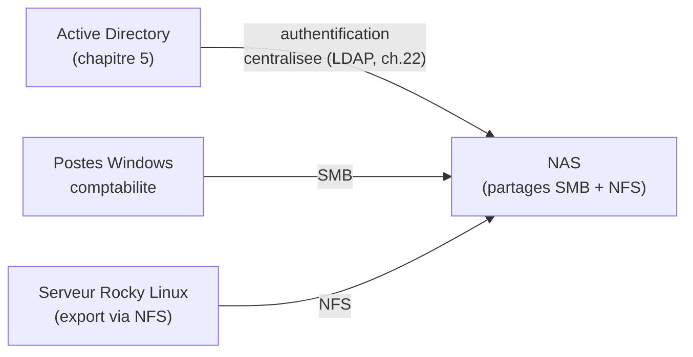

<div class="chapitre-titre-num">CHAPITRE 28</div>

# NAS : conception et déploiement

<div class="encadre objectif">
<span class="encadre-titre">🎯 Objectif du chapitre</span>
Comprendre le NAS (*Network Attached Storage*) comme solution de stockage centralisé accessible par le réseau, à la fois pour des clients Windows (SMB) et Linux (NFS) simultanément. À la fin de ce chapitre, tu sauras concevoir la structure de partages d'un NAS pour une organisation multi-sites, comprendre la différence entre un instantané (snapshot) et une sauvegarde réelle, et sécuriser l'accès au stockage partagé via l'identité déjà centralisée depuis la Partie 4.
</div>

<div class="encadre scenario">
<span class="encadre-titre">🎬 Mise en situation</span>
Chaque serveur de l'entreprise stocke ses propres fichiers localement, sur son propre RAID (chapitre 27) — mais le service comptabilité, réparti entre Port-au-Prince et le Cap-Haïtien, a besoin d'un espace de fichiers **partagé**, accessible aussi bien depuis les postes Windows du service que depuis un script d'export tournant sur le serveur Rocky Linux de gestion documentaire (chapitre 19). Le DFS du chapitre 11 réplique des données entre serveurs de fichiers Windows, mais ne résout pas ce besoin d'accès mixte Windows/Linux depuis une source de stockage unique et centralisée. C'est exactement le rôle d'un NAS — ce chapitre explique comment le concevoir et le déployer pour ce besoin précis.
</div>

## 28.1 Qu'est-ce qu'un NAS, et en quoi diffère-t-il du DFS

Un **NAS** (*Network Attached Storage*) est un système de stockage dédié, accessible via le réseau par plusieurs clients simultanément, à travers des protocoles de partage de fichiers standards. Contrairement au DFS (chapitre 11), qui réplique des dossiers entre plusieurs serveurs de fichiers Windows existants, un NAS est une **source de stockage centralisée unique**, à laquelle plusieurs types de clients (Windows, Linux, macOS) se connectent directement.

<div class="encadre retenir">
<span class="encadre-titre">📌 À retenir</span>
Le DFS (chapitre 11) résout "comment répliquer des fichiers entre plusieurs serveurs Windows existants". Le NAS résout un problème différent : "comment centraliser du stockage accessible nativement par des systèmes d'exploitation différents, sans dupliquer les données sur chaque serveur". Les deux solutions peuvent d'ailleurs coexister dans une même organisation, pour des besoins distincts.
</div>

## 28.2 Les protocoles NAS : SMB et NFS côte à côte

| Protocole | Origine | Client typique |
|---|---|---|
| **SMB/CIFS** | Windows (déjà rencontré au chapitre 11 pour DFS) | Postes et serveurs Windows |
| **NFS** (*Network File System*) | Unix/Linux | Serveurs et postes Linux |

<div class="encadre astuce">
<span class="encadre-titre">💡 Un NAS moderne sert les deux protocoles simultanément, sur les mêmes données</span>
La plupart des NAS professionnels (qu'il s'agisse d'une appliance dédiée ou d'un serveur Linux configuré avec Samba et NFS) peuvent exposer **le même volume de données** à la fois via SMB (pour les postes Windows du service comptabilité) et via NFS (pour le script d'export du serveur Rocky Linux) — exactement le besoin du scénario d'ouverture, résolu par un seul système de stockage plutôt que par une duplication entre deux systèmes distincts.
</div>

```
# Exemple de configuration Samba (protocole SMB) sur un NAS Linux,
# pour un partage accessible depuis les postes Windows
[comptabilite]
   path = /donnees/comptabilite
   valid users = @comptabilite
   read only = no

# Exemple de configuration NFS pour le meme volume physique,
# accessible depuis le serveur Rocky Linux
# (dans /etc/exports)
/donnees/comptabilite  10.10.2.0/24(rw,sync,no_subtree_check)
```

<div class="encadre attention">
<span class="encadre-titre">⚠️ Attention à la cohérence des permissions entre les deux protocoles</span>
SMB et NFS ont des modèles de permissions historiquement différents (SMB s'appuie souvent sur des ACL de style Windows, NFS traditionnellement sur les permissions Unix classiques du chapitre 18). Exposer le même volume via les deux protocoles simultanément exige une configuration cohérente entre les deux — un fichier créé via un accès Windows doit rester correctement accessible en lecture ou écriture via l'accès Linux, et inversement, sous peine de "Permission denied" déroutants d'un côté ou de l'autre.
</div>

## 28.3 Le RAID sous-jacent : un NAS n'est qu'une couche de partage

<div class="encadre memoriser">
<span class="encadre-titre">🧠 À mémoriser</span>
Un NAS n'élimine pas le besoin de RAID (chapitre 17 et 27) — il **s'appuie** dessus. Le stockage physique sous-jacent d'un NAS professionnel repose généralement sur un RAID (matériel ou logiciel) exactement comme n'importe quel serveur, la valeur ajoutée du NAS étant la couche de partage réseau multi-protocole par-dessus ce stockage redondant, pas un substitut à la redondance elle-même.
</div>

## 28.4 Snapshots : une protection complémentaire, pas une sauvegarde

Un **instantané** (*snapshot*) capture l'état d'un volume à un instant précis, permettant de revenir rapidement à cet état en cas d'erreur (fichier supprimé par erreur, modification indésirable) — une fonctionnalité native de la plupart des NAS modernes.

<div class="encadre securite">
<span class="encadre-titre">🔒 Sécurité — un snapshot n'est pas une sauvegarde, rappel du principe déjà posé au chapitre 17</span>
Exactement comme le RAID (chapitre 17, section sécurité) ne remplace jamais une sauvegarde, un snapshot stocké sur le **même NAS physique** que les données qu'il protège ne survit pas à une panne matérielle totale du NAS lui-même, ni à un rançongiciel suffisamment sophistiqué pour chiffrer aussi les snapshots accessibles depuis le système compromis. Un snapshot protège contre une erreur humaine récente et localisée, rapidement ; une vraie stratégie de sauvegarde (chapitre 30) protège contre une perte du NAS entier — les deux mécanismes sont complémentaires, jamais substituables l'un à l'autre.
</div>

<div class="encadre bonne-pratique">
<span class="encadre-titre">✅ Bonne pratique — snapshots fréquents ET sauvegardes régulières hors du NAS</span>
Une bonne architecture combine des snapshots fréquents (par exemple toutes les heures, pour une récupération rapide d'erreurs courantes) et des sauvegardes régulières vers un stockage physiquement distinct du NAS lui-même (chapitre 30) — une combinaison qui couvre à la fois les erreurs quotidiennes mineures et les scénarios de perte catastrophique du NAS entier.
</div>

## 28.5 Dimensionner un NAS selon le cas d'usage réel

<div class="encadre performance">
<span class="encadre-titre">🚀 Performance — fichiers partagés vs charge transactionnelle</span>
Un NAS convient très bien à des cas d'usage de partage de fichiers classiques (documents, images, exports, comme le besoin du scénario d'ouverture) — mais devient moins adapté à des charges transactionnelles intensives à faible latence (une base de données à très fort volume de transactions), pour lesquelles un SAN (chapitre 29) offre généralement de meilleures performances grâce à un accès en mode bloc plutôt qu'en mode fichier. Le choix entre NAS et SAN dépend directement de la nature réelle de la charge de travail, pas d'une préférence générale pour l'un ou l'autre.
</div>

## 28.6 Sécuriser l'accès au NAS via l'identité déjà centralisée

<div class="encadre bonne-pratique">
<span class="encadre-titre">✅ Bonne pratique — authentifier le NAS contre Active Directory, jamais des comptes locaux dupliqués</span>
Rappel direct du principe déjà établi au chapitre 22 (LDAP) et au chapitre 25 (identité unique) : le NAS doit s'authentifier contre l'annuaire Active Directory existant (via LDAP ou une intégration native selon le NAS utilisé) plutôt que de maintenir des comptes locaux dupliqués — un compte désactivé dans Active Directory doit immédiatement perdre l'accès au NAS, sans dépendre d'une désactivation manuelle séparée et potentiellement oubliée.
</div>



<div class="encadre securite">
<span class="encadre-titre">🔒 Sécurité — chiffrer les échanges avec le NAS</span>
SMB (versions récentes) et NFS (avec Kerberos, rappel du chapitre 23) supportent tous deux le chiffrement en transit — une exigence à ne jamais négliger pour des données sensibles comme celles de la comptabilité, exactement le même principe déjà appliqué à LDAP (chapitre 22) et à TLS (chapitre 24) : aucune donnée sensible ne devrait jamais circuler en clair sur le réseau.
</div>

## Atelier — Concevoir la structure de partages du scénario d'ouverture

<div class="encadre exercice">
<span class="encadre-titre">🛠️ Atelier 28 — Structurer l'accès partagé comptabilité</span>

**Objectif** : concevoir une structure de partage NAS répondant au besoin exact du scénario d'ouverture, en tenant compte de la sécurité et de la protection des données.

**Préparation** : aucune installation nécessaire pour cet atelier conceptuel.

**Étapes détaillées** :

1. Propose une structure de dossiers pour le partage comptabilité, en tenant compte des deux sites (Port-au-Prince et Cap-Haïtien).
2. Propose une politique d'accès (quel groupe Active Directory pour quel niveau de permission), en t'appuyant sur les principes du chapitre 18 (ACL) et 22 (LDAP/AD).
3. Propose une politique de snapshots et de sauvegarde pour ce partage, en distinguant clairement les deux mécanismes (section 28.4).
4. Compare ta démarche à la section "Résultat attendu".

**Résultat attendu** : la structure de dossiers peut inclure une distinction entre données communes aux deux sites et données spécifiques à un site, avec un groupe Active Directory dédié `comptabilite` (rappel du chapitre 18 sur les groupes plutôt que des permissions individuelles) donnant accès en lecture-écriture, exposé simultanément en SMB pour les postes Windows et en NFS pour le serveur Rocky Linux du script d'export (lecture seule pour ce dernier, suffisant à son besoin réel selon le principe du moindre privilège). Les snapshots horaires couvrent les erreurs quotidiennes ; une sauvegarde quotidienne vers un stockage physiquement distinct (approfondie au chapitre 30) couvre le risque de perte totale du NAS.

**Dépannage** : si tu hésites sur le niveau de permission à accorder au serveur Linux, reviens à la question centrale du principe du moindre privilège (chapitre 1) : ce script a-t-il réellement besoin d'écrire sur ce partage, ou seulement de le lire pour effectuer son export ?
</div>

## Erreurs fréquentes

<div class="encadre attention">
<span class="encadre-titre">⚠️ Erreur n°1 — confondre snapshot et sauvegarde</span>
Rappel de la section 28.4 : un snapshot stocké sur le même NAS ne protège pas contre une panne totale de ce NAS — une confusion aussi risquée que celle déjà dénoncée pour RAID et sauvegarde (chapitre 17).
</div>

<div class="encadre attention">
<span class="encadre-titre">⚠️ Erreur n°2 — un seul NAS sans aucune redondance à l'échelle du système entier</span>
Même avec un RAID interne robuste (section 28.3), un NAS reste un point de défaillance unique si aucune sauvegarde externe ni redondance de plus haut niveau n'existe — la même erreur conceptuelle que celle du contrôleur de domaine unique par site, déjà dénoncée au chapitre 6.
</div>

<div class="encadre attention">
<span class="encadre-titre">⚠️ Erreur n°3 — permissions incohérentes entre accès SMB et NFS sur le même volume</span>
Rappel de la section 28.2 : une configuration mal alignée entre les deux protocoles peut provoquer des refus d'accès déroutants d'un côté du système alors que l'autre côté fonctionne normalement, un symptôme fréquemment mal diagnostiqué.
</div>

## Diagnostiquer un problème d'accès NAS

<div class="encadre attention">
<span class="encadre-titre">🩺 Situation : "Un fichier créé depuis un poste Windows n'est pas accessible en écriture depuis le serveur Linux, et inversement"</span>

- **Diagnostic** : cause quasiment systématique — une incohérence entre les permissions appliquées côté SMB et côté NFS sur le même volume physique (section 28.2), souvent liée à une correspondance d'identité incorrecte entre les comptes Windows et Linux (l'utilisateur Windows et l'utilisateur Linux ne sont pas mappés à la même identité effective sur le système de fichiers).
- **Comment vérifier** : comparer les permissions effectives observées via chaque protocole (`getfacl` côté Linux, rappel du chapitre 18 ; propriétés de sécurité côté Windows) pour le même fichier concerné.
- **Résolution** : aligner la configuration d'identité entre les deux protocoles (souvent via l'intégration Active Directory du NAS, section 28.6, qui unifie la résolution d'identité des deux côtés) plutôt que de corriger manuellement chaque fichier individuellement, une solution non pérenne qui se reproduirait à chaque nouveau fichier créé.
</div>

## En entreprise

- **Bonne pratique répandue** : documenter (chapitre 3) la structure de partages du NAS, avec les groupes Active Directory associés à chaque niveau de permission — une information indispensable pour tout audit d'accès futur.
- **Bonne pratique répandue** : tester périodiquement une restauration à partir d'un snapshot ET à partir d'une sauvegarde externe (chapitre 1, section 1.4), pour confirmer que les deux mécanismes fonctionnent réellement comme prévu, pas seulement en théorie.
- **Erreur classique observée** : un NAS déployé initialement pour un besoin simple, dont les permissions et la structure de dossiers se complexifient organiquement au fil des années sans jamais être revues ni documentées, devenant difficile à auditer avec confiance.

## Entretien technique

<div class="encadre exercice">
<span class="encadre-titre">💼 Questions fréquemment posées en entretien</span>

**Q1. "Quelle est la différence entre un NAS et le DFS de Windows Server ?"**
Réponse attendue : le DFS (chapitre 11) réplique des dossiers entre plusieurs serveurs de fichiers Windows existants ; un NAS est un système de stockage centralisé unique, accessible nativement par plusieurs types de clients (Windows via SMB, Linux via NFS) simultanément, sans dupliquer les données sur chaque serveur.

**Q2. "Pourquoi un snapshot ne remplace-t-il jamais une sauvegarde ?"**
Réponse attendue : un snapshot stocké sur le même système physique que les données protégées ne survit pas à une panne totale de ce système, ni nécessairement à un rançongiciel suffisamment sophistiqué. Une vraie sauvegarde doit résider sur un support physiquement distinct pour protéger contre ces scénarios de perte plus catastrophiques.

**Q3. "Comment sécuriserais-tu l'accès à un NAS partagé entre des postes Windows et des serveurs Linux ?"**
Réponse attendue : authentifier le NAS contre l'annuaire Active Directory existant plutôt que de maintenir des comptes locaux dupliqués, chiffrer les échanges en transit (SMB récent, NFS avec Kerberos), et vérifier la cohérence des permissions entre les protocoles SMB et NFS exposant le même volume.
</div>

## Optimisation, sécurité et maintenabilité — les réflexes dès ce chapitre

<div class="encadre securite">
<span class="encadre-titre">🔒 Sécurité</span>
Authentifie systématiquement l'accès au NAS via l'identité centralisée déjà en place (Active Directory/LDAP), jamais via des comptes locaux dupliqués — un rappel direct et concret du principe de source de vérité unique déjà établi au chapitre 22.
</div>

<div class="encadre bonne-pratique">
<span class="encadre-titre">✅ Maintenabilité</span>
Documente la structure de partages, les groupes associés et la politique de snapshots/sauvegardes de chaque volume NAS dans la CMDB (chapitre 3) — une information qui évite bien des devinettes lors d'un futur audit ou d'une intervention par une personne découvrant le système pour la première fois.
</div>

<div class="encadre performance">
<span class="encadre-titre">🚀 Performance</span>
Choisis le NAS pour des charges de partage de fichiers classiques, et envisage un SAN (chapitre 29) pour des charges transactionnelles à faible latence — un mauvais choix initial de technologie de stockage peut coûter cher à corriger une fois le système en production et adopté par les utilisateurs.
</div>

## Résumé du chapitre

- Un NAS centralise le stockage et l'expose via des protocoles standards (SMB pour Windows, NFS pour Linux), souvent simultanément sur le même volume.
- Le NAS s'appuie sur du RAID sous-jacent (chapitres 17 et 27) — il ne remplace pas le besoin de redondance physique, il ajoute une couche de partage réseau par-dessus.
- Un snapshot protège rapidement contre une erreur récente localisée, mais ne remplace jamais une sauvegarde vers un stockage physiquement distinct.
- Le choix entre NAS et SAN dépend de la nature de la charge de travail : partage de fichiers pour le NAS, charge transactionnelle à faible latence pour le SAN.
- L'accès au NAS doit s'authentifier contre l'identité déjà centralisée (Active Directory/LDAP), avec un chiffrement systématique en transit.

## Quiz

<div class="encadre exercice">
<span class="encadre-titre">📝 QCM (une seule bonne réponse par question)</span>

1. Le protocole de partage de fichiers typiquement utilisé par les clients Linux pour accéder à un NAS est :
   - a) SMB
   - b) NFS
   - c) RDP
   - d) LDAP

2. Un snapshot stocké sur le même NAS que les données qu'il protège :
   - a) Remplace entièrement le besoin de sauvegarde
   - b) Ne protège pas contre une panne totale de ce NAS
   - c) Est automatiquement répliqué sur un autre site
   - d) Chiffre automatiquement les données

3. Le NAS est généralement mieux adapté que le SAN pour :
   - a) Une base de données transactionnelle à très faible latence
   - b) Le partage de fichiers classiques (documents, exports)
   - c) Le stockage en mode bloc exclusivement
   - d) Un usage exclusivement local, sans réseau

**Corrigé** : 1-b, 2-b, 3-b.
</div>

<div class="encadre exercice">
<span class="encadre-titre">📝 Vrai ou Faux</span>

1. Un NAS peut exposer le même volume de données à la fois en SMB et en NFS simultanément. — **Vrai**.
2. Un NAS élimine complètement le besoin de RAID sous-jacent. — **Faux** (il s'appuie sur du RAID, il ne le remplace pas, section 28.3).
3. Authentifier un NAS contre Active Directory est préférable à des comptes locaux dupliqués. — **Vrai**.
4. Le DFS et un NAS répondent exactement au même besoin, de façon interchangeable. — **Faux** (des besoins différents, section 28.1).
</div>

<div class="encadre exercice">
<span class="encadre-titre">📝 Questions ouvertes</span>

1. Explique pourquoi un NAS accessible à la fois en SMB et en NFS nécessite une attention particulière à la cohérence des permissions.
2. Reprends le scénario d'ouverture. Explique pourquoi un NAS répond mieux au besoin exprimé qu'une simple réplication DFS entre deux serveurs Windows.

**Corrigé 1** : SMB et NFS ont des modèles de permissions historiquement différents, et le NAS doit résoudre une correspondance d'identité cohérente entre un utilisateur accédant via l'un ou l'autre protocole pour que les mêmes règles d'accès s'appliquent réellement des deux côtés — sans cette cohérence, un fichier créé via un protocole peut devenir inaccessible ou mal protégé via l'autre, un risque de sécurité ou de fonctionnement selon le sens de l'incohérence.

**Corrigé 2** : le DFS réplique des dossiers uniquement entre des serveurs Windows — il ne résoudrait pas le besoin du serveur Rocky Linux d'accéder aux mêmes données via NFS, nécessitant une solution supplémentaire distincte pour ce client Linux. Un NAS, en exposant nativement les deux protocoles sur la même source de données centralisée, répond directement et simultanément aux deux besoins (postes Windows du service comptabilité et script d'export Linux) sans duplication ni synchronisation supplémentaire à maintenir entre deux systèmes de stockage distincts.
</div>

## Exercices

<div class="encadre exercice">
<span class="encadre-titre">📝 Exercice 28.1</span>

Explique pourquoi un NAS unique, même avec un RAID 6 robuste en interne (chapitre 27), reste un point de défaillance unique à l'échelle de l'organisation, et propose une mesure pour réduire ce risque.
</div>

**Corrigé :** Le RAID 6 protège contre la panne d'un ou deux disques individuels à l'intérieur du NAS, mais ne protège pas contre une panne totale du NAS lui-même (alimentation électrique défaillante, carte mère du NAS en panne, incendie ou dégât des eaux dans la salle serveur) — dans tous ces scénarios, l'ensemble des données du NAS deviendrait inaccessible ou perdu, malgré la robustesse de son RAID interne. Une mesure de réduction de ce risque consiste à maintenir des sauvegardes régulières vers un stockage physiquement distinct (chapitre 30), voire à envisager une réplication vers un second NAS sur un site différent pour les données les plus critiques, réduisant le risque d'un point de défaillance unique à l'échelle de l'organisation entière.

<div class="encadre exercice">
<span class="encadre-titre">📝 Exercice 28.2</span>

Rédige, en 3 à 5 phrases, pourquoi le script d'export du serveur Rocky Linux du scénario d'ouverture ne devrait recevoir qu'un accès en lecture seule au partage NAS, plutôt qu'un accès en lecture-écriture "pour plus de simplicité".
</div>

**Corrigé (exemple de réponse) :** Le principe du moindre privilège (chapitre 1) exige de n'accorder que les droits strictement nécessaires à la tâche réelle — si le script d'export ne fait que lire des données pour les exporter ailleurs, il n'a aucun besoin réel d'écrire sur ce partage. Accorder un accès en écriture "par simplicité" créerait un risque disproportionné : si ce script contient un bug ou si le compte de service qu'il utilise est un jour compromis, un accès en écriture non nécessaire permettrait une modification ou une suppression accidentelle ou malveillante des données comptables, un risque totalement absent avec un accès limité à la lecture seule.

## Checklist de fin de chapitre

<ul class="checklist">
<li>☐ Je comprends la différence entre un NAS et le DFS (chapitre 11).</li>
<li>☐ Je sais expliquer comment SMB et NFS peuvent exposer le même volume simultanément.</li>
<li>☐ Je comprends que le NAS s'appuie sur du RAID sous-jacent, sans le remplacer.</li>
<li>☐ Je sais pourquoi un snapshot ne remplace jamais une sauvegarde.</li>
<li>☐ Je sais choisir entre NAS et SAN selon la nature de la charge de travail.</li>
<li>☐ Je sais sécuriser l'accès à un NAS via l'identité centralisée déjà en place.</li>
</ul>

## FAQ

<dl class="faq">
<dt>Un NAS grand public convient-il à un usage professionnel d'entreprise ?</dt>
<dd>Pour un usage critique en entreprise, un NAS professionnel (avec support, RAID matériel robuste, intégration Active Directory native) reste largement préférable à un NAS grand public, souvent limité en performance, en fonctionnalités de sécurité et en support en cas de panne — un choix à évaluer selon la criticité réelle des données concernées, dans le même esprit que le choix de distribution du chapitre 14.</dd>

<dt>Combien de temps un snapshot doit-il être conservé ?</dt>
<dd>Cela dépend du besoin réel : des snapshots fréquents (horaires) sont généralement conservés peu de temps (quelques jours), tandis que des snapshots moins fréquents (quotidiens) peuvent être conservés plus longtemps — un compromis entre l'espace de stockage consommé par les snapshots eux-mêmes et la profondeur de récupération souhaitée.</dd>

<dt>Le chiffrement en transit (SMB/NFS) suffit-il à sécuriser complètement un NAS ?</dt>
<dd>Non, c'est une couche parmi plusieurs nécessaires — le chiffrement au repos (des données stockées sur les disques eux-mêmes), les permissions correctement configurées (section 28.6), et l'authentification centralisée restent tout aussi indispensables pour une sécurité complète, aucune mesure seule n'étant suffisante.</dd>

<dt>Un NAS peut-il servir de cible de sauvegarde pour d'autres serveurs ?</dt>
<dd>Oui, c'est un usage courant, mais attention à ne pas confondre ce rôle avec la protection de ses propres données (section 28.4) — si le NAS sert à la fois de stockage primaire ET de cible de sauvegarde pour d'autres systèmes, une panne du NAS affecterait les deux fonctions simultanément, un risque à considérer sérieusement dans la conception globale de la stratégie de sauvegarde (chapitre 30).</dd>
</dl>

## Références et pour aller plus loin

- Documentation officielle Samba (protocole SMB sur Linux) : [https://www.samba.org/samba/docs/](https://www.samba.org/samba/docs/)
- Documentation officielle NFS sur Red Hat Enterprise Linux : [https://access.redhat.com/documentation/fr-fr/red_hat_enterprise_linux/9/html/managing_file_systems/exporting-nfs-shares_managing-file-systems](https://access.redhat.com/documentation/fr-fr/red_hat_enterprise_linux/9/html/managing_file_systems/exporting-nfs-shares_managing-file-systems)
- Microsoft Learn — Vue d'ensemble de SMB : [https://learn.microsoft.com/fr-fr/windows-server/storage/file-server/file-server-smb-overview](https://learn.microsoft.com/fr-fr/windows-server/storage/file-server/file-server-smb-overview)

*Chapitre suivant : SAN — concepts et protocoles, pour les charges de travail transactionnelles à faible latence que le NAS ne couvre pas de façon optimale.*
