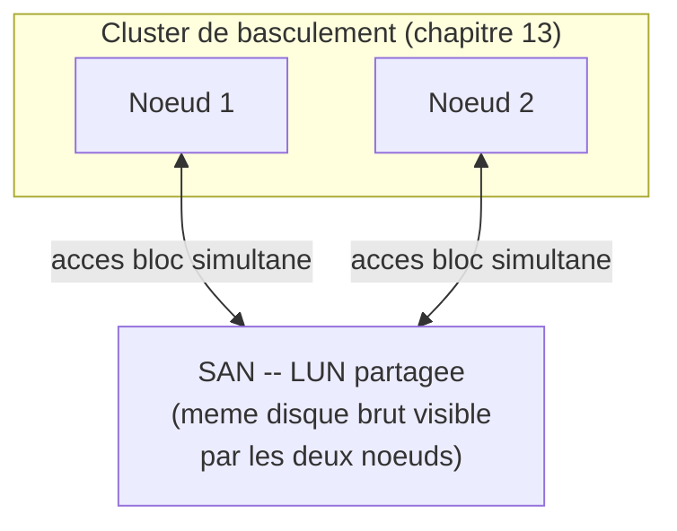
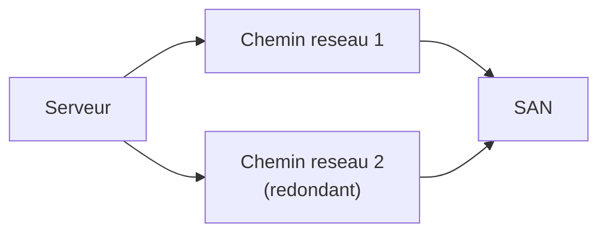

<div class="chapitre-titre-num">CHAPITRE 29</div>

# SAN : concepts et protocoles

<div class="encadre objectif">
<span class="encadre-titre">🎯 Objectif du chapitre</span>
Comprendre le SAN (*Storage Area Network*) et la différence fondamentale entre le mode bloc et le mode fichier (chapitre 28), et pourquoi certains besoins — en particulier le clustering (chapitre 13) — exigent spécifiquement un stockage partagé en mode bloc. À la fin de ce chapitre, tu sauras choisir entre iSCSI et Fibre Channel selon un contexte donné, comprendre le rôle du multipathing, et éviter les erreurs de conception les plus coûteuses d'une infrastructure SAN.
</div>

<div class="encadre scenario">
<span class="encadre-titre">🎬 Mise en situation</span>
L'entreprise planifie la virtualisation de son infrastructure (un projet abordé en détail dans la Partie 6 de ce manuel), avec un cluster de basculement — exactement le type d'architecture déjà présentée au chapitre 13. Le DSI se souvient d'une phrase de ce chapitre, restée jusqu'ici abstraite : "le clustering exige un stockage partagé accessible simultanément par plusieurs nœuds". Il te demande : <em>"Le NAS qu'on vient de déployer au chapitre précédent peut-il servir à ça ?"</em> La réponse révèle une distinction fondamentale entre deux façons d'accéder au stockage réseau — le sujet de ce chapitre.
</div>

## 29.1 Mode bloc vs mode fichier : la distinction fondamentale

<div class="encadre retenir">
<span class="encadre-titre">📌 À retenir — la différence qui répond à la question du DSI</span>
Un NAS (chapitre 28) fonctionne en <strong>mode fichier</strong> : le client demande un fichier par son nom (via SMB ou NFS), et c'est le NAS lui-même qui gère l'organisation physique des données sur ses disques. Un SAN fonctionne en <strong>mode bloc</strong> : il expose un espace de stockage brut (un "disque" virtuel) directement au serveur client, qui y installe lui-même son propre système de fichiers, exactement comme s'il s'agissait d'un disque physique local. Cette différence explique directement pourquoi le NAS du chapitre 28 ne convient pas au besoin de clustering : un cluster de basculement (chapitre 13) a besoin que chaque nœud voie le même disque brut au niveau bloc, pas un partage de fichiers.
</div>

<div class="encadre astuce">
<span class="encadre-titre">💡 Analogie — louer un appartement meublé contre louer un espace vide</span>
Un NAS ressemble à un appartement meublé et déjà organisé : tu demandes "la chaise dans le salon" (un fichier par son nom), sans te soucier de comment l'espace est structuré en coulisses. Un SAN ressemble à un espace de stockage totalement vide, que tu aménages toi-même de A à Z (ton propre système de fichiers, comme si c'était un disque physique neuf) — le SAN se contente de fournir l'espace brut, sans connaître ni se soucier de son organisation interne.
</div>

## 29.2 Pourquoi le clustering (chapitre 13) exige spécifiquement du mode bloc



<div class="encadre astuce">
<span class="encadre-titre">💡 Explication du schéma</span>
Pour qu'un cluster de basculement fonctionne (chapitre 13), les deux nœuds doivent pouvoir accéder au **même disque brut**, avec une coordination stricte au niveau bloc pour éviter toute corruption en cas d'accès simultané — un mécanisme que le SAN fournit nativement, et que le mode fichier d'un NAS ne fournit pas de la même manière (un NAS gère lui-même la coordination des accès fichiers, une architecture différente, pas interchangeable avec les mécanismes de clustering bas niveau).
</div>

## 29.3 iSCSI : le SAN accessible via Ethernet standard

**iSCSI** (*Internet Small Computer System Interface*) transporte des commandes de stockage en mode bloc par-dessus le réseau Ethernet standard déjà existant dans l'entreprise — pas besoin de matériel réseau dédié supplémentaire.

```
# Cote client (initiator iSCSI) : decouvrir les cibles disponibles
# sur un serveur SAN iSCSI
iscsiadm -m discovery -t sendtargets -p 10.10.5.10

# Se connecter a une cible decouverte
iscsiadm -m node -T iqn.2026-01.ht.assuranceht:san01.lun01 -p 10.10.5.10 --login
```

<div class="encadre bonne-pratique">
<span class="encadre-titre">✅ Bonne pratique — isoler le trafic iSCSI sur un réseau dédié</span>
Même si iSCSI utilise l'Ethernet standard, le faire transiter sur le même réseau que le trafic utilisateur habituel expose le stockage à une congestion imprévisible (un pic de trafic web ralentissant soudainement l'accès disque d'un serveur critique) et à un risque de sécurité (le trafic de stockage devrait rester isolé, dans le même esprit que la segmentation déjà recommandée au chapitre 26 sur le Zero Trust). Un VLAN dédié (Partie 11) ou, idéalement, un réseau physiquement séparé, reste la bonne pratique standard pour tout déploiement iSCSI sérieux.
</div>

## 29.4 Fibre Channel : le SAN dédié haute performance

**Fibre Channel** (FC) utilise une infrastructure réseau entièrement dédiée au stockage — câblage optique spécifique, commutateurs FC dédiés, cartes HBA (*Host Bus Adapter*) sur chaque serveur — offrant une latence et une fiabilité généralement supérieures à iSCSI, au prix d'un coût matériel et d'une complexité de déploiement bien plus élevés.

| Critère | iSCSI | Fibre Channel |
|---|---|---|
| Infrastructure réseau | Ethernet standard existant | Réseau dédié (câblage, commutateurs FC) |
| Coût | Modéré | Élevé |
| Performance/latence | Bonne, dépend du réseau Ethernet | Excellente, réseau dédié optimisé |
| Complexité de déploiement | Relativement accessible | Plus complexe, expertise spécialisée requise |
| Cas d'usage typique | PME, budgets contraints, la majorité des cas | Datacenters à très forte exigence de performance |

<div class="encadre astuce">
<span class="encadre-titre">💡 Recommandation pour le contexte de ce manuel</span>
Pour une entreprise de la taille de la compagnie d'assurance de ce manuel, iSCSI représente presque toujours le choix le plus pragmatique — il réutilise l'infrastructure réseau existante (avec l'isolation recommandée en section 29.3), évite l'investissement matériel conséquent du Fibre Channel, et offre des performances largement suffisantes pour un cluster de virtualisation de cette envergure. Fibre Channel se justifie surtout dans des environnements à très grande échelle avec des exigences de latence extrêmes, rarement le cas pour une infrastructure de cette taille.
</div>

## 29.5 LUN : l'unité d'allocation d'un SAN

Une **LUN** (*Logical Unit Number*) est l'unité de stockage brut qu'un SAN expose à un serveur client — l'équivalent, dans le monde du SAN, du volume logique LVM du chapitre 17, mais accessible potentiellement par plusieurs serveurs simultanément (avec la coordination nécessaire, comme dans le clustering).

<div class="encadre attention">
<span class="encadre-titre">⚠️ Dimensionner une LUN nécessite d'anticiper, comme pour LVM au chapitre 17</span>
Exactement le même principe déjà vu au chapitre 17 pour LVM : sous-dimensionner une LUN dès sa création peut nécessiter une extension délicate plus tard, tandis qu'une extension à chaud (souvent possible, selon le SAN et le système de fichiers utilisés) reste préférable à une reconstruction complète en urgence. Le réflexe de la section 17.3 (préférer LVM par défaut pour permettre une extension à chaud) s'applique de la même façon au niveau du système de fichiers créé par-dessus une LUN.
</div>

## 29.6 Le multipathing : éviter le point de défaillance unique

<div class="encadre securite">
<span class="encadre-titre">🔒 Sécurité — un seul chemin réseau vers le SAN est un point de défaillance unique</span>
Rappel direct du principe du chapitre 6 (tolérance de panne, au-delà de la simple réplication) : un serveur connecté au SAN via un seul câble/port réseau reste vulnérable à la panne de ce composant unique, malgré toute la redondance interne du SAN lui-même. Le <strong>multipathing</strong> (MPIO, *Multipath I/O*) configure plusieurs chemins réseau redondants entre le serveur et le SAN, avec bascule automatique en cas de panne d'un chemin — exactement le même principe que "plusieurs contrôleurs de domaine par site" du chapitre 6, appliqué ici à l'accès réseau au stockage.
</div>



## 29.7 Sécuriser l'accès au SAN

<div class="encadre securite">
<span class="encadre-titre">🔒 Sécurité — CHAP pour l'authentification iSCSI</span>
iSCSI supporte l'authentification **CHAP** (*Challenge Handshake Authentication Protocol*), qui vérifie l'identité d'un serveur avant de lui accorder l'accès à une LUN précise — sans cette authentification, tout serveur ayant un accès réseau au SAN pourrait potentiellement découvrir et monter une LUN qui ne lui est pas destinée. L'isolation réseau (section 29.3) reste la première ligne de défense, mais CHAP ajoute une vérification d'identité complémentaire, dans le même esprit de défense en profondeur déjà appliqué tout au long de ce manuel.
</div>

## Atelier — Concevoir le SAN pour le projet de virtualisation

<div class="encadre exercice">
<span class="encadre-titre">🛠️ Atelier 29 — Répondre à la question du DSI</span>

**Objectif** : synthétiser les concepts de ce chapitre pour concevoir une architecture SAN adaptée au projet de clustering de virtualisation du scénario d'ouverture.

**Préparation** : aucune installation nécessaire pour cet atelier conceptuel.

**Étapes détaillées** :

1. Réponds directement à la question du DSI ("le NAS peut-il servir à ça ?"), en t'appuyant sur la section 29.1.
2. Recommande iSCSI ou Fibre Channel pour ce projet, en justifiant ton choix à partir de la section 29.4.
3. Liste deux mesures de résilience et de sécurité indispensables pour cette architecture SAN, en t'appuyant sur les sections 29.6 et 29.7.
4. Compare ta démarche à la section "Résultat attendu".

**Résultat attendu** : le NAS ne convient pas au besoin de clustering, car il fonctionne en mode fichier alors que le clustering exige un accès partagé en mode bloc (section 29.1 et 29.2). iSCSI est recommandé pour ce projet, réutilisant l'infrastructure Ethernet existante à moindre coût, suffisant pour la taille de ce cluster (section 29.4). Les deux mesures indispensables sont le multipathing (au moins deux chemins réseau redondants entre chaque nœud du cluster et le SAN, section 29.6) et l'isolation réseau du trafic iSCSI sur un VLAN dédié avec authentification CHAP activée (section 29.3 et 29.7).

**Dépannage** : si tu hésites entre iSCSI et Fibre Channel, reviens au tableau comparatif de la section 29.4 et pose-toi la question centrale : ce projet a-t-il un budget et des exigences de performance qui justifient le coût significativement plus élevé du Fibre Channel ?
</div>

## Erreurs fréquentes

<div class="encadre attention">
<span class="encadre-titre">⚠️ Erreur n°1 — confondre NAS et SAN, et tenter d'utiliser un NAS pour du clustering</span>
Exactement la question initiale du DSI dans le scénario d'ouverture — une confusion fréquente chez les débutants, corrigée par la distinction fondamentale mode fichier / mode bloc de la section 29.1.
</div>

<div class="encadre attention">
<span class="encadre-titre">⚠️ Erreur n°2 — déployer iSCSI sans isolation réseau ni multipathing</span>
Rappel des sections 29.3 et 29.6 : ces deux mesures ne sont pas des options facultatives pour un déploiement de production, mais des exigences de base pour éviter respectivement une congestion imprévisible et un point de défaillance unique.
</div>

<div class="encadre attention">
<span class="encadre-titre">⚠️ Erreur n°3 — sous-dimensionner une LUN sans anticiper la croissance future</span>
Rappel de la section 29.5 : le même piège déjà rencontré pour LVM au chapitre 17, avec les mêmes conséquences d'une extension délicate en production si elle n'a pas été anticipée dès la conception initiale.
</div>

## Diagnostiquer une latence SAN inhabituelle

<div class="encadre attention">
<span class="encadre-titre">🩺 Symptôme : latence disque soudainement élevée sur un serveur connecté à un SAN iSCSI</span>

- **Diagnostic** : vérifier en priorité si le trafic iSCSI transite bien sur un réseau isolé (section 29.3) — une congestion du réseau partagé, causée par un pic de trafic totalement indépendant du stockage, est une cause fréquente et facilement corrigible si l'isolation n'était pas encore en place.
- **Comment vérifier** : surveiller l'utilisation du réseau sur le segment iSCSI au moment de la latence observée, et vérifier l'état de chaque chemin du multipathing (un chemin en panne peut faire basculer tout le trafic sur un seul chemin restant, doublant sa charge sans que cela soit immédiatement évident).
- **Résolution** : isoler le trafic iSCSI si ce n'était pas déjà fait, ou investiguer et réparer un chemin de multipathing défaillant — deux causes bien plus fréquentes qu'une réelle limite de performance du SAN lui-même.
</div>

## En entreprise

- **Bonne pratique répandue** : documenter (chapitre 3) l'architecture SAN complète — LUN, leur allocation à quels serveurs, la configuration de multipathing — un schéma indispensable pour tout diagnostic ou extension future.
- **Bonne pratique répandue** : tester le basculement du multipathing en conditions contrôlées (débrancher volontairement un chemin réseau lors d'une fenêtre de maintenance) pour confirmer qu'il fonctionne réellement comme prévu, plutôt que de découvrir un défaut de configuration lors d'une vraie panne.
- **Erreur classique observée** : un SAN déployé initialement avec une isolation réseau et un multipathing corrects, mais dont la configuration se dégrade au fil du temps (un technicien reconnecte temporairement un câble sur le mauvais VLAN "pour dépanner rapidement", sans jamais revenir à la configuration correcte) — un rappel direct de la discipline de documentation et de revue périodique du chapitre 3.

## Entretien technique

<div class="encadre exercice">
<span class="encadre-titre">💼 Questions fréquemment posées en entretien</span>

**Q1. "Quelle est la différence fondamentale entre un NAS et un SAN ?"**
Réponse attendue : un NAS fonctionne en mode fichier (le client demande un fichier par son nom, le NAS gère l'organisation physique) ; un SAN fonctionne en mode bloc (il expose un espace de stockage brut, le client y installe son propre système de fichiers) — une distinction qui détermine directement les cas d'usage adaptés à chacun, notamment le clustering qui exige spécifiquement du mode bloc.

**Q2. "Dans quel cas choisirais-tu iSCSI plutôt que Fibre Channel ?"**
Réponse attendue : iSCSI convient à la grande majorité des cas, réutilisant l'infrastructure Ethernet existante à moindre coût — Fibre Channel se justifie surtout pour des environnements à très grande échelle avec des exigences de latence extrêmes, où son coût matériel plus élevé se justifie par un besoin de performance réel et mesuré.

**Q3. "Pourquoi le multipathing est-il indispensable pour un déploiement SAN de production ?"**
Réponse attendue : sans plusieurs chemins réseau redondants, un serveur connecté au SAN via un seul chemin reste vulnérable à la panne de ce composant unique, malgré toute la redondance interne du SAN lui-même — exactement le même principe de tolérance de panne déjà appliqué à plusieurs contrôleurs de domaine par site au chapitre 6.
</div>

## Optimisation, sécurité et maintenabilité — les réflexes dès ce chapitre

<div class="encadre securite">
<span class="encadre-titre">🔒 Sécurité</span>
Active systématiquement CHAP pour toute connexion iSCSI de production, et isole le trafic de stockage sur un réseau dédié — deux mesures de base non négociables, jamais des options facultatives à considérer "plus tard".
</div>

<div class="encadre bonne-pratique">
<span class="encadre-titre">✅ Maintenabilité</span>
Documente l'architecture SAN complète (chapitre 3) — LUN, allocation, multipathing — et teste régulièrement le basculement du multipathing en conditions contrôlées plutôt que de présumer qu'il fonctionne sans jamais le vérifier réellement.
</div>

<div class="encadre performance">
<span class="encadre-titre">🚀 Performance</span>
Dimensionne les LUN en anticipant la croissance future (section 29.5), exactement comme pour LVM au chapitre 17 — une extension à chaud planifiée coûte toujours moins cher qu'une reconstruction en urgence sur un système déjà en production.
</div>

## Résumé du chapitre

- Un SAN fonctionne en mode bloc (le client gère son propre système de fichiers), contrairement au NAS (chapitre 28) qui fonctionne en mode fichier.
- Le clustering (chapitre 13) exige spécifiquement un stockage partagé en mode bloc, ce qu'un NAS ne fournit pas nativement.
- iSCSI réutilise l'Ethernet standard à moindre coût ; Fibre Channel offre une performance supérieure au prix d'une infrastructure dédiée bien plus coûteuse.
- Une LUN est l'unité d'allocation d'un SAN, à dimensionner en anticipant la croissance future, comme pour LVM.
- Le multipathing élimine le point de défaillance unique d'un seul chemin réseau vers le SAN.
- CHAP et l'isolation réseau sont des mesures de sécurité de base indispensables pour tout déploiement iSCSI de production.

## Quiz

<div class="encadre exercice">
<span class="encadre-titre">📝 QCM (une seule bonne réponse par question)</span>

1. Un SAN se distingue d'un NAS car il fonctionne :
   - a) En mode fichier
   - b) En mode bloc
   - c) Uniquement via SMB
   - d) Uniquement en local, sans réseau

2. Le clustering (chapitre 13) exige spécifiquement :
   - a) Un NAS en mode fichier
   - b) Un stockage partagé en mode bloc
   - c) Aucun stockage partagé
   - d) Une connexion RDP entre les nœuds

3. Le multipathing sert principalement à :
   - a) Accélérer la vitesse d'écriture sur un seul disque
   - b) Éliminer le point de défaillance unique d'un seul chemin réseau vers le SAN
   - c) Chiffrer le trafic iSCSI
   - d) Réduire la taille des LUN

**Corrigé** : 1-b, 2-b, 3-b.
</div>

<div class="encadre exercice">
<span class="encadre-titre">📝 Vrai ou Faux</span>

1. iSCSI nécessite une infrastructure réseau entièrement dédiée, distincte de l'Ethernet standard. — **Faux** (c'est Fibre Channel qui nécessite une infrastructure dédiée, iSCSI réutilise l'Ethernet standard, section 29.3-29.4).
2. Un NAS peut techniquement remplacer un SAN pour tout besoin de clustering. — **Faux** (le clustering exige du mode bloc, section 29.2).
3. CHAP authentifie l'accès à une LUN iSCSI. — **Vrai**.
4. Une LUN sous-dimensionnée dès sa création peut nécessiter une extension délicate plus tard, exactement comme pour un volume LVM. — **Vrai**.
</div>

<div class="encadre exercice">
<span class="encadre-titre">📝 Questions ouvertes</span>

1. Explique pourquoi un cluster de basculement (chapitre 13) ne peut pas simplement utiliser un partage NAS classique pour son stockage partagé.
2. Reprends le scénario d'ouverture. Explique pourquoi iSCSI, plutôt que Fibre Channel, est le choix le plus pragmatique pour ce projet précis.

**Corrigé 1** : un cluster de basculement nécessite que plusieurs nœuds accèdent simultanément au même disque brut avec une coordination stricte au niveau bloc, pour garantir l'intégrité des données en cas de basculement d'un nœud à l'autre — un mécanisme fondamentalement différent de l'accès en mode fichier d'un NAS, où c'est le NAS lui-même (un système unique) qui gère la coordination des accès, pas les serveurs clients directement entre eux au niveau du disque.

**Corrigé 2** : iSCSI réutilise l'infrastructure Ethernet déjà existante dans l'entreprise, évitant l'investissement matériel conséquent du Fibre Channel (câblage optique dédié, commutateurs FC, cartes HBA) — un coût difficile à justifier pour un cluster de virtualisation de la taille de cette entreprise, dont les exigences de performance restent largement dans la capacité qu'iSCSI peut offrir avec une isolation réseau et un multipathing correctement configurés (sections 29.3 et 29.6).
</div>

## Exercices

<div class="encadre exercice">
<span class="encadre-titre">📝 Exercice 29.1</span>

Un serveur connecté à un SAN iSCSI via un seul câble réseau subit une panne de sa carte réseau. Explique la conséquence immédiate, et comment le multipathing aurait changé ce résultat.
</div>

**Corrigé :** Sans multipathing, la panne de l'unique carte réseau connectée au SAN coupe immédiatement tout accès au stockage pour ce serveur — une interruption de service totale et immédiate, malgré la redondance interne éventuelle du SAN lui-même (RAID, alimentations redondantes). Avec un multipathing correctement configuré (au moins deux chemins réseau distincts, section 29.6), la panne d'un des deux chemins ferait basculer automatiquement tout le trafic sur le chemin restant, sans interruption de service perceptible — exactement le même principe que la tolérance de panne matérielle déjà vue pour les contrôleurs de domaine au chapitre 6.

<div class="encadre exercice">
<span class="encadre-titre">📝 Exercice 29.2</span>

Rédige, en 3 à 5 phrases, pourquoi documenter l'architecture SAN (LUN, allocation, multipathing) est particulièrement important par rapport à d'autres types d'infrastructure plus simples, en t'appuyant sur le chapitre 3.
</div>

**Corrigé (exemple de réponse) :** Une architecture SAN implique plusieurs couches interdépendantes (LUN, chemins réseau, authentification CHAP, allocation à plusieurs serveurs potentiellement en cluster) dont la complexité dépasse largement celle d'un disque local simple — sans documentation, comprendre quelle LUN sert quel serveur, ou pourquoi une configuration de multipathing précise a été choisie, devient extrêmement difficile pour quiconque n'a pas participé à la conception initiale. Cette complexité rejoint directement le risque du "bus factor" de 1 évoqué au chapitre 1 : si la seule personne comprenant l'architecture SAN complète quitte l'organisation sans documentation laissée derrière elle, toute intervention future (extension, diagnostic de panne, migration) devient risquée et lente, potentiellement sur une infrastructure critique comme un cluster de virtualisation.

## Checklist de fin de chapitre

<ul class="checklist">
<li>☐ Je comprends la différence fondamentale entre mode bloc (SAN) et mode fichier (NAS).</li>
<li>☐ Je sais pourquoi le clustering exige spécifiquement un stockage en mode bloc.</li>
<li>☐ Je sais comparer iSCSI et Fibre Channel selon le coût et les besoins de performance.</li>
<li>☐ Je comprends le rôle d'une LUN et l'importance de son dimensionnement anticipé.</li>
<li>☐ Je sais pourquoi le multipathing élimine un point de défaillance unique.</li>
<li>☐ Je sais sécuriser un déploiement iSCSI avec CHAP et l'isolation réseau.</li>
</ul>

## FAQ

<dl class="faq">
<dt>Un même serveur peut-il utiliser à la fois un NAS et un SAN ?</dt>
<dd>Oui, couramment — un serveur peut stocker ses fichiers partagés classiques sur un NAS (chapitre 28) tout en utilisant une LUN SAN pour un besoin spécifique de mode bloc (comme le stockage de machines virtuelles dans un cluster) — les deux technologies répondent à des besoins différents et coexistent naturellement dans une même infrastructure.</dd>

<dt>Le SAN est-il toujours plus performant qu'un stockage local direct sur chaque serveur ?</dt>
<dd>Pas nécessairement en performance brute pure (un disque local ultra-rapide peut surpasser un SAN mal dimensionné), mais le SAN apporte une flexibilité et un partage impossibles avec du stockage purement local — le clustering (chapitre 13), qui exige un stockage partagé, ne peut simplement pas fonctionner avec des disques strictement locaux à chaque nœud.</dd>

<dt>Faut-il un SAN dès la première virtualisation d'une petite infrastructure ?</dt>
<dd>Pas nécessairement — une virtualisation simple sans clustering ni migration à chaud entre hôtes peut très bien fonctionner avec du stockage local, le SAN devenant nécessaire spécifiquement au moment où un besoin de clustering ou de migration à chaud (Partie 6) apparaît, exactement le déclencheur du scénario d'ouverture de ce chapitre.</dd>

<dt>NVMe over Fabrics (NVMe-oF) remplace-t-il iSCSI et Fibre Channel ?</dt>
<dd>NVMe-oF est une technologie plus récente offrant des performances supérieures, de plus en plus adoptée dans les déploiements à très haute performance, mais iSCSI et Fibre Channel restent largement répandus et pleinement adaptés à la grande majorité des besoins d'entreprise en 2026 — un sujet à surveiller pour l'avenir, mais hors du périmètre principal de ce chapitre introductif.</dd>
</dl>

## Références et pour aller plus loin

- Documentation officielle Red Hat — Configuration du stockage iSCSI : [https://access.redhat.com/documentation/fr-fr/red_hat_enterprise_linux/9/html/managing_storage_devices/configuring-an-iscsi-target_managing-storage-devices](https://access.redhat.com/documentation/fr-fr/red_hat_enterprise_linux/9/html/managing_storage_devices/configuring-an-iscsi-target_managing-storage-devices)
- Microsoft Learn — Initiateur iSCSI Windows : [https://learn.microsoft.com/fr-fr/windows-server/storage/iscsi/iscsi-target-server](https://learn.microsoft.com/fr-fr/windows-server/storage/iscsi/iscsi-target-server)
- SNIA (Storage Networking Industry Association) — ressources et standards du stockage réseau : [https://www.snia.org/](https://www.snia.org/)

*Chapitre suivant : stratégies de sauvegarde — la règle 3-2-1 et les outils qui protègent réellement toutes les données de l'infrastructure construite jusqu'ici, au-delà du RAID, des snapshots et de la redondance déjà couverts.*
