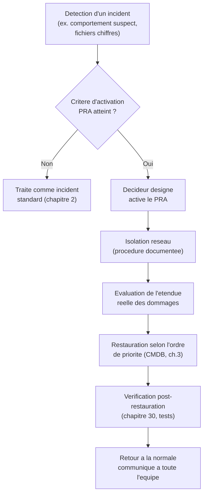

CHAPITRE 31

# Plan de Reprise d'Activité (PRA)

🎯 Objectif du chapitre
Transformer les moyens techniques de sauvegarde du chapitre 30 en un plan documenté, orchestré et testé — un Plan de Reprise d'Activité (PRA). À la fin de ce chapitre, tu sauras rédiger un PRA structuré, définir clairement qui décide de son activation et selon quels critères, choisir un type de site de repli adapté, et organiser un exercice de simulation qui teste le plan entier, pas seulement la technique.

🎬 Mise en situation
Une semaine après l'incident de rançongiciel du chapitre 30, restauré avec succès grâce à la copie air-gapped, le comité de direction convoque une réunion post-incident. Le DSI y présente ce qui s'est bien passé — mais reconnaît aussi une vérité inconfortable : la restauration a fonctionné, mais dans la confusion. Personne ne savait précisément qui devait décider d'isoler le réseau, dans quel ordre restaurer les systèmes, ni combien de temps l'ensemble prendrait réellement. <em>"On a eu de la chance que ça se termine bien,"</em> admet-il. <em>"La prochaine fois, je veux un plan écrit, que tout le monde connaît, pas une improvisation qui a fonctionné cette fois-ci."</em> C'est exactement la différence entre une bonne stratégie de sauvegarde technique (chapitre 30) et un vrai Plan de Reprise d'Activité — l'objet de ce chapitre.

## 31.1 Ce qu'un PRA ajoute à une stratégie de sauvegarde

📌 À retenir — la distinction centrale de ce chapitre
Le chapitre 30 a construit les **moyens techniques** de récupération (des sauvegardes fiables, testées, protégées). Le PRA orchestre **l'usage de ces moyens** dans une situation de crise réelle : qui décide, dans quel ordre, avec quelles procédures précises, en combien de temps. Une entreprise peut avoir d'excellentes sauvegardes techniques et pourtant improviser dangereusement au moment critique — exactement ce qui s'est produit dans le scénario d'ouverture, où la technique a fonctionné malgré l'absence de plan, pas grâce à un plan.

💡 Analogie — l'extincteur et le plan d'évacuation
Avoir des sauvegardes fiables sans PRA ressemble à avoir un extincteur dans un bâtiment sans jamais avoir défini de plan d'évacuation : l'outil existe, mais personne ne sait précisément quoi faire, dans quel ordre, ni qui est responsable de quoi au moment où un incendie se déclare réellement. Le PRA est ce plan d'évacuation — il ne remplace pas l'extincteur (les sauvegardes), il organise son usage efficace en situation de crise.

## 31.2 Les composantes essentielles d'un PRA

| Composante | Contenu | Chapitre déjà couvert |
|---|---|---|
| **Inventaire des systèmes critiques** | Quels systèmes, avec quelle priorité de restauration | CMDB, chapitre 3 |
| **RTO/RPO par système** | Objectifs de temps et de perte de données tolérables | Chapitre 30 |
| **Procédures de restauration détaillées** | Étapes précises, testées, pas de suppositions | Runbooks, chapitre 3 |
| **Rôles et responsabilités** | Qui fait quoi, qui décide, qui communique | Chaîne d'escalade, chapitre 1 |
| **Critères d'activation** | À partir de quel seuil le PRA est-il déclenché | Priorisation impact/urgence, chapitre 2 |
| **Coordonnées de contact** | Équipe interne, fournisseurs critiques, à jour en permanence | — |

🧠 À mémoriser — le PRA assemble ce que ce manuel a déjà construit
Comme le Zero Trust du chapitre 26, le PRA n'introduit pas de nouveaux concepts isolés — il **organise** des briques déjà posées (CMDB, runbooks, RTO/RPO, chaîne d'escalade) en un document unique, cohérent et activable en situation de crise réelle. C'est un exercice de synthèse et de structuration, pas une nouvelle discipline technique séparée.

## 31.3 Qui décide d'activer le PRA, et selon quels critères

⚠️ La confusion exacte du scénario d'ouverture
Sans critère d'activation clair et sans décideur désigné à l'avance, une équipe en pleine crise perd un temps précieux à déterminer **qui** a l'autorité de déclencher des actions potentiellement lourdes (isoler le réseau, basculer vers un site de secours) — exactement ce qu'a vécu l'entreprise du scénario d'ouverture. Un PRA robuste désigne, à l'avance et sans ambiguïté, une personne (et un remplaçant en cas d'indisponibilité) habilitée à activer le plan, avec des critères objectifs plutôt qu'une décision improvisée sous pression.

✅ Bonne pratique — des critères d'activation écrits à l'avance, jamais évalués pour la première fois en pleine crise
Exemple de critère explicite : "Le PRA est activé si un système classé critique dans la CMDB est indisponible depuis plus de 30 minutes sans cause identifiée, ou si une compromission de sécurité active est confirmée sur un système critique." Écrire ce type de critère à l'avance, en dehors de toute pression, permet une décision rapide et objective au moment où elle compte réellement, plutôt qu'un débat improvisé pendant que l'incident continue de s'aggraver.

## 31.4 Sites de repli : chaud, tiède, froid

Pour les systèmes les plus critiques nécessitant un RTO très court (chapitre 30), un **site de repli** — une infrastructure alternative capable de prendre le relais — peut être nécessaire au-delà de la simple restauration de sauvegarde sur le site principal.

| Type de site | Description | RTO typique | Coût |
|---|---|---|---|
| **Site froid** | Espace et infrastructure de base, sans systèmes préconfigurés | Plusieurs jours | Faible |
| **Site tiède** | Systèmes partiellement configurés, données non à jour en temps réel | Quelques heures | Modéré |
| **Site chaud** | Infrastructure complète, répliquée en temps réel ou quasi réel, bascule rapide | Minutes | Élevé |

💡 Le choix dépend directement du RTO défini au chapitre 30
Un système avec un RTO de plusieurs jours (comme le NAS comptabilité de l'atelier du chapitre 30) ne justifie pas l'investissement d'un site chaud — un site froid, voire une simple restauration de sauvegarde sur du matériel de remplacement, suffit largement. Un système avec un RTO de quelques minutes justifierait un site chaud, avec une réplication continue — le choix du type de site n'est jamais une décision isolée, il découle directement du RTO déjà défini pour chaque système.

## 31.5 Rédiger le PRA pour le scénario d'ouverture

💡 Explication du schéma — chaque étape a déjà été construite ailleurs dans ce manuel
La détection s'appuie sur la supervision (chapitre 1 et Partie 10) ; l'isolation réseau sur des procédures documentées comme un runbook (chapitre 3) ; la restauration selon un ordre de priorité s'appuie sur la CMDB (chapitre 3) et les RTO/RPO (chapitre 30) ; la vérification post-restauration reprend directement les principes de test du chapitre 30. Le PRA ne fait qu'enchaîner ces briques dans un ordre clair et documenté, avec un responsable identifié à chaque étape.

## 31.6 Tester le PRA : l'exercice de simulation

❌ Mauvaise pratique — un PRA rédigé une fois, jamais testé
Rappel direct du principe du chapitre 30 (tester une sauvegarde) appliqué ici à un niveau supérieur : un PRA jamais testé en conditions simulées reste une hypothèse non vérifiée, pas une garantie. Un document parfaitement rédigé peut contenir des erreurs de coordination, des contacts obsolètes, ou des étapes irréalistes qui ne se révèlent que lors d'une mise en pratique réelle ou simulée.

✅ Bonne pratique — l'exercice de simulation (tabletop exercise)
Un exercice de simulation réunit l'équipe concernée autour d'un scénario fictif réaliste (par exemple, une reprise du scénario d'ouverture de ce chapitre) et lui fait dérouler mentalement, étape par étape, sa réponse selon le PRA écrit — sans nécessairement toucher aux systèmes réels. Cet exercice révèle rapidement les zones floues du plan (qui contacte le fournisseur Internet en cas de coupure prolongée ? qui autorise officiellement la communication vers les clients ?) avant qu'elles ne deviennent un vrai problème lors d'un incident réel, exactement le type de confusion vécue dans le scénario d'ouverture.

🚀 Performance — mesurer le RTO réel lors d'un test, pas seulement le RTO théorique
Un exercice de simulation, ou mieux encore un test de restauration grandeur nature périodique (au-delà du simple test technique du chapitre 30), permet de mesurer le temps **réellement** nécessaire pour exécuter l'ensemble du plan — souvent plus long que l'estimation théorique initiale, une fois pris en compte le temps de coordination humaine, de communication et de vérification, pas seulement le temps technique de restauration des données elles-mêmes.

## 31.7 Le PRA comme document vivant

✅ Bonne pratique — réviser le PRA après chaque changement significatif
Rappel direct du chapitre 2 (le processus de changement) : tout changement d'infrastructure significatif (nouveau serveur critique, migration, ajout d'un site comme celui du Cap-Haïtien) doit déclencher une révision correspondante du PRA — un plan qui décrit une infrastructure obsolète depuis plusieurs mois est presque aussi dangereux qu'une absence totale de plan, car il donne une fausse confiance sans refléter la réalité actuelle.

## Atelier — Rédiger le PRA du scénario d'ouverture

🛠️ Atelier 31 — Documenter la réponse au rançongiciel

**Objectif** : rédiger un extrait de PRA pour le scénario du rançongiciel (chapitres 30-31), corrigeant précisément l'improvisation reconnue par le DSI.

**Préparation** : aucune installation nécessaire — cet atelier est un exercice de rédaction structurée.

**Étapes détaillées** :

1. Définis un critère d'activation explicite pour ce type d'incident (rançongiciel suspecté ou confirmé), en t'appuyant sur la section 31.3.
2. Désigne (de façon fictive) qui a l'autorité de décider l'isolation réseau, et qui l'exécute techniquement.
3. Liste, dans l'ordre, les trois premières actions concrètes à entreprendre après l'activation du PRA.
4. Compare ta démarche à la section "Résultat attendu".

**Résultat attendu** : un critère d'activation clair pourrait être "toute détection de chiffrement de fichiers en masse sur un partage réseau, confirmée par au moins deux indicateurs distincts (alerte de supervision + signalement utilisateur), déclenche l'activation immédiate". Le décideur désigné (par exemple, le RSSI ou le DSI en son absence, avec un remplaçant clairement identifié) autorise l'isolation réseau, exécutée techniquement par l'administrateur système d'astreinte selon un runbook déjà préparé. Les trois premières actions : (1) isoler le segment réseau concerné pour stopper la propagation, (2) évaluer l'étendue réelle des systèmes touchés via la CMDB, (3) identifier la dernière sauvegarde saine disponible et non compromise (chapitre 30) avant toute tentative de restauration.

**Dépannage** : si tu as du mal à formuler un critère d'activation suffisamment précis, évite les formulations vagues comme "en cas de problème grave" — reviens à des signaux objectifs et mesurables, comme dans l'exemple du "Résultat attendu".

## Erreurs fréquentes

⚠️ Erreur n°1 — confondre stratégie de sauvegarde technique et PRA
Rappel de la section 31.1 : d'excellentes sauvegardes ne garantissent pas une réponse coordonnée en situation de crise réelle, exactement la leçon du scénario d'ouverture.

⚠️ Erreur n°2 — aucun critère d'activation ni décideur clairement désigné
Rappel de la section 31.3 : cette ambiguïté fait perdre un temps précieux au moment où chaque minute compte, exactement la confusion vécue dans le scénario d'ouverture.

⚠️ Erreur n°3 — un PRA jamais testé ni mis à jour
Rappel des sections 31.6 et 31.7 : un plan non testé reste une hypothèse, et un plan non mis à jour après un changement d'infrastructure décrit une réalité qui n'existe plus.

## Diagnostiquer les lacunes d'un PRA existant

🩺 Situation : "Comment savoir si notre PRA existant serait réellement utilisable en cas de crise ?"

- **Diagnostic** : organiser un exercice de simulation (section 31.6) reste la méthode la plus fiable — la lecture seule du document, sans mise en pratique même simulée, laisse souvent passer des lacunes de coordination invisibles sur le papier.
- **Comment vérifier** : pendant l'exercice, noter chaque moment où l'équipe hésite, cherche une information manquante, ou n'est pas sûre de qui doit agir — chacune de ces hésitations révèle une lacune précise du document à corriger.
- **Résolution** : mettre à jour le PRA immédiatement après l'exercice, pendant que les lacunes identifiées sont encore fraîches et précises, plutôt que de repousser cette mise à jour à plus tard où le souvenir précis des difficultés rencontrées s'estompe.

## En entreprise

- **Bonne pratique répandue** : organiser un exercice de simulation PRA au moins une fois par an pour les systèmes les plus critiques, avec un compte-rendu écrit des lacunes identifiées et des actions correctives associées.
- **Bonne pratique répandue** : conserver une copie physique (papier) du PRA accessible même si l'ensemble des systèmes numériques de l'entreprise est indisponible — un PRA stocké uniquement sur un système qui pourrait lui-même être affecté par l'incident qu'il est censé résoudre est une contradiction risquée.
- **Erreur classique observée** : un PRA rédigé sous la pression d'un audit de conformité, jamais réellement approprié par l'équipe qui devrait l'exécuter en situation réelle — un document qui existe "sur le papier" sans réelle appropriation collective échoue souvent au moment critique.

## Entretien technique

💼 Questions fréquemment posées en entretien

**Q1. "Quelle est la différence entre une stratégie de sauvegarde et un Plan de Reprise d'Activité ?"**
Réponse attendue : la sauvegarde fournit les moyens techniques de récupération des données ; le PRA orchestre l'usage de ces moyens en situation de crise — qui décide, dans quel ordre, avec quelles procédures précises. Une organisation peut avoir d'excellentes sauvegardes et pourtant improviser dangereusement sans PRA structuré.

**Q2. "Comment choisirais-tu entre un site de repli froid, tiède et chaud pour un système donné ?"**
Réponse attendue : le choix découle directement du RTO défini pour ce système — un RTO de plusieurs jours ne justifie pas l'investissement d'un site chaud, tandis qu'un RTO de quelques minutes le justifierait, malgré son coût significativement plus élevé.

**Q3. "Pourquoi un exercice de simulation est-il important, même avec un PRA bien rédigé sur le papier ?"**
Réponse attendue : un exercice de simulation révèle des lacunes de coordination invisibles à la simple lecture du document (contacts obsolètes, ambiguïtés sur les responsabilités, étapes irréalistes en pratique) — exactement comme un test de restauration révèle des problèmes qu'une sauvegarde "sans erreur" ne révèle pas, un parallèle direct avec le chapitre 30.

## Optimisation, sécurité et maintenabilité — les réflexes dès ce chapitre

🔒 Sécurité
Assure-toi que le PRA lui-même reste accessible même en cas d'incident majeur touchant les systèmes numériques de l'entreprise — une copie physique ou un stockage totalement indépendant de l'infrastructure qu'il décrit, pour éviter la contradiction d'un plan de secours devenu lui-même inaccessible au moment où il est le plus nécessaire.

✅ Maintenabilité
Réviser le PRA après chaque changement significatif d'infrastructure (chapitre 2) et après chaque exercice de simulation (section 31.6) — un document vivant, jamais figé une fois rédigé.

🚀 Performance
Mesure le RTO réellement observé lors de chaque test ou incident réel, et compare-le au RTO théorique défini au chapitre 30 — un écart significatif révèle un besoin d'ajustement, soit du plan lui-même, soit des moyens techniques sous-jacents (site de repli plus rapide, automatisation accrue).

## Résumé du chapitre

- Le PRA orchestre l'usage des moyens de sauvegarde du chapitre 30 en situation de crise réelle — il ne remplace pas la sauvegarde technique, il organise sa mise en œuvre coordonnée.
- Un PRA robuste réunit un inventaire des systèmes critiques, des RTO/RPO définis, des procédures détaillées, des rôles clairement désignés et des critères d'activation objectifs.
- Un décideur désigné à l'avance, avec des critères d'activation écrits, évite la confusion et la perte de temps précieuse en pleine crise.
- Le choix entre site froid, tiède et chaud découle directement du RTO défini pour chaque système.
- Un PRA doit être testé régulièrement via des exercices de simulation, et mis à jour après chaque changement significatif d'infrastructure — jamais rédigé une fois puis oublié.

## Quiz

📝 QCM (une seule bonne réponse par question)

1. Un PRA se distingue d'une simple stratégie de sauvegarde car il :
   - a) Remplace le besoin de sauvegardes techniques
   - b) Orchestre l'usage coordonné des moyens de récupération en situation de crise
   - c) Concerne uniquement les très grandes entreprises
   - d) Ne nécessite jamais d'être testé

2. Un site de repli "chaud" se caractérise par :
   - a) Un RTO de plusieurs jours
   - b) Une infrastructure complète répliquée en temps quasi réel, pour un RTO très court
   - c) L'absence totale de systèmes préconfigurés
   - d) Un coût toujours faible

3. Un exercice de simulation (tabletop exercise) sert principalement à :
   - a) Remplacer le besoin de tester les sauvegardes techniques
   - b) Révéler les lacunes de coordination invisibles à la simple lecture du document
   - c) Former uniquement les nouveaux employés
   - d) Réduire le coût des sauvegardes

**Corrigé** : 1-b, 2-b, 3-b.

📝 Vrai ou Faux

1. D'excellentes sauvegardes techniques garantissent automatiquement une réponse coordonnée en cas de crise. — **Faux** (exactement la leçon du scénario d'ouverture, section 31.1).
2. Le choix du type de site de repli (froid/tiède/chaud) découle directement du RTO défini pour le système concerné. — **Vrai**.
3. Un PRA rédigé une fois n'a pas besoin d'être mis à jour tant qu'aucun incident ne survient. — **Faux** (il doit être révisé après chaque changement significatif, section 31.7).
4. Un critère d'activation du PRA écrit à l'avance permet une décision plus rapide et objective qu'une évaluation improvisée en pleine crise. — **Vrai**.

📝 Questions ouvertes

1. Explique pourquoi l'absence de décideur clairement désigné peut aggraver un incident, même si toutes les sauvegardes techniques fonctionnent parfaitement.
2. Reprends le scénario d'ouverture. Explique en 3-4 phrases pourquoi le DSI a raison de dire "on a eu de la chance", malgré la restauration réussie.

**Corrigé 1** : sans décideur désigné, chaque action potentiellement lourde (isoler le réseau, basculer vers un site de secours, communiquer publiquement sur l'incident) risque de rester en suspens pendant qu'un débat informel détermine qui a l'autorité d'agir — un délai qui peut aggraver considérablement l'impact réel de l'incident (propagation continue d'un rançongiciel, par exemple), indépendamment de la qualité technique des sauvegardes disponibles une fois la décision enfin prise.

**Corrigé 2** : la restauration a réussi grâce à la qualité technique de la sauvegarde air-gapped (chapitre 30), mais le déroulement réel de l'incident (confusion sur qui décide, absence de procédure claire pour l'isolation réseau) aurait pu tourner très différemment avec une équipe moins expérimentée, un incident légèrement plus complexe, ou simplement un moment de la journée où les bonnes personnes n'étaient pas immédiatement disponibles. Le succès de cette fois ne garantit en rien un succès similaire lors d'un prochain incident si la même improvisation se reproduit — exactement pourquoi un PRA écrit, testé et connu de toute l'équipe réduit cette dépendance à la chance.

## Exercices

📝 Exercice 31.1

Une entreprise a un excellent PRA écrit, mais ne l'a jamais testé depuis sa rédaction il y a deux ans, période durant laquelle l'infrastructure a considérablement évolué (nouveaux serveurs, nouveau site). Explique les risques concrets de cette situation.

**Corrigé :** Ce PRA, aussi bien rédigé soit-il initialement, décrit probablement une infrastructure qui n'existe plus dans sa forme actuelle — de nouveaux systèmes critiques pourraient ne pas y figurer du tout, tandis que des procédures décrites pourraient référencer des systèmes désormais obsolètes ou remplacés. Sans test récent, l'équipe n'a également aucune garantie que les contacts, les rôles désignés, ou les critères d'activation restent pertinents et à jour (des personnes ont pu changer de poste, par exemple). Ce PRA donne une fausse confiance dangereuse : l'entreprise croit disposer d'un plan fiable, alors qu'il pourrait s'avérer largement inapplicable ou incomplet au moment critique, un risque qui rejoint directement le principe du chapitre 30 sur les sauvegardes jamais testées.

📝 Exercice 31.2

Rédige, en 3 à 5 phrases, un critère d'activation explicite pour le PRA face à une panne prolongée de la liaison réseau entre Port-au-Prince et le Cap-Haïtien (rappel du chapitre 6), distinct du critère de rançongiciel déjà donné dans l'atelier de ce chapitre.

**Corrigé (exemple de réponse) :** "Le PRA est activé pour une panne de liaison inter-sites si celle-ci dépasse 4 heures consécutives ET affecte un système classé critique dans la CMDB dont la disponibilité au Cap-Haïtien ne peut être restaurée localement (rappel du chapitre 6 sur le fonctionnement autonome de chaque site en cas de coupure) — un seuil de 4 heures reflétant le délai typique de résolution d'un incident réseau standard, au-delà duquel une réponse plus structurée devient nécessaire plutôt que d'attendre indéfiniment un retour spontané à la normale." Ce critère reste distinct de celui du rançongiciel, car la nature du risque (disponibilité réseau plutôt que compromission de sécurité) appelle une réponse et des décideurs potentiellement différents.

## Checklist de fin de chapitre

<ul class="checklist">
<li>☐ Je comprends la différence entre une stratégie de sauvegarde technique et un Plan de Reprise d'Activité.</li>
<li>☐ Je sais lister les composantes essentielles d'un PRA.</li>
<li>☐ Je comprends pourquoi un critère d'activation et un décideur désigné doivent être définis à l'avance.</li>
<li>☐ Je sais choisir un type de site de repli (froid/tiède/chaud) selon le RTO d'un système.</li>
<li>☐ Je sais organiser un exercice de simulation pour tester un PRA.</li>
<li>☐ Je comprends pourquoi un PRA doit être révisé après chaque changement significatif d'infrastructure.</li>
</ul>

## FAQ

<dl class="faq">
<dt>Une petite entreprise a-t-elle vraiment besoin d'un PRA formel, avec tous ces éléments ?</dt>
<dd>L'ampleur du document doit être proportionnée à la taille de l'organisation (même principe que le CAB du chapitre 2 ou la gestion des accès du chapitre 4), mais l'esprit reste pertinent à toute taille : savoir qui décide, avoir des procédures écrites même simples, et tester périodiquement — une petite structure peut se contenter d'un document de quelques pages plutôt que d'un plan volumineux, sans pour autant se passer de ces principes essentiels.</dd>

<dt>Le PRA et le PCA (chapitre suivant) sont-ils la même chose ?</dt>
<dd>Non, ce sont des documents complémentaires mais distincts — le PRA se concentre sur la reprise technique après un sinistre (comment restaurer les systèmes), tandis que le PCA (Plan de Continuité d'Activité, chapitre 32) couvre un périmètre plus large incluant la continuité des activités métier elles-mêmes pendant et après l'incident, au-delà de la seule dimension technique.</dd>

<dt>Combien de temps prend la rédaction d'un premier PRA ?</dt>
<dd>Cela varie énormément selon la taille et la complexité de l'infrastructure, mais un point de départ réaliste consiste à documenter d'abord les systèmes les plus critiques (priorisés via la CMDB et les RTO/RPO du chapitre 30), plutôt que de viser l'exhaustivité immédiate pour l'ensemble de l'infrastructure — un PRA partiel mais réellement testé et fiable vaut mieux qu'un PRA exhaustif mais jamais vérifié.</dd>

<dt>Qui devrait être impliqué dans la rédaction d'un PRA ?</dt>
<dd>Au-delà de l'équipe technique, la direction (pour les décisions d'activation et de communication externe), et idéalement des représentants des métiers les plus critiques (pour comprendre l'impact réel d'une indisponibilité de leur point de vue) — un PRA rédigé uniquement par l'équipe technique, sans validation de la direction sur les critères d'activation et les responsabilités, risque de ne pas être suivi en situation réelle.</dd>
</dl>

## Références et pour aller plus loin

- NIST Special Publication 800-34 — Contingency Planning Guide for Federal Information Systems : [https://csrc.nist.gov/pubs/sp/800/34/r1/final](https://csrc.nist.gov/pubs/sp/800/34/r1/final)
- ITIL 4 — pratique "Service continuity management" (rejoignant le cadre déjà couvert au chapitre 2) : [https://www.axelos.com/certifications/itil-service-management](https://www.axelos.com/certifications/itil-service-management)
- CISA — ressources sur la planification de continuité et de reprise : [https://www.cisa.gov](https://www.cisa.gov)

*Chapitre suivant : le Plan de Continuité d'Activité (PCA) — élargir la perspective du PRA au-delà de la seule reprise technique, pour couvrir la continuité des activités métier de l'entreprise dans leur ensemble.*
