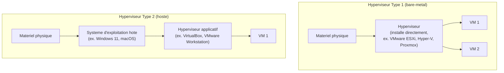

CHAPITRE 33

# Concepts de virtualisation

🎯 Objectif du chapitre
Comprendre les fondations de la virtualisation avant d'aborder un hyperviseur précis (VMware, Hyper-V, Proxmox, chapitres 34 à 36) : ce qu'est un hyperviseur, la différence entre type 1 et type 2, les composants virtuels de base, et les deux pièges les plus fréquents de la virtualisation en production — la surallocation mal maîtrisée et la confusion entre snapshot et sauvegarde. À la fin de ce chapitre, tu sauras justifier une décision de consolidation de serveurs physiques par des arguments concrets.

🎬 Mise en situation
En relisant l'inventaire de la CMDB (chapitre 3), le DSI compte les serveurs physiques accumulés au fil de ce manuel : les contrôleurs de domaine (chapitre 5), le serveur du portail client (chapitre 14), le serveur Rocky Linux de gestion documentaire (chapitre 19), sans compter les futurs projets à venir. Chacun tourne à une fraction de sa capacité réelle, mais consomme sa propre alimentation électrique, son propre onduleur, son propre espace en salle serveur — une réalité d'autant plus coûteuse dans un contexte où l'électricité elle-même représente une dépense et une contrainte opérationnelle significatives, rappel direct des coupures déjà évoquées aux chapitres 6 et 27. <em>"Est-ce qu'on a vraiment besoin d'un serveur physique séparé pour chaque projet ?"</em> demande-t-il. La réponse tient dans ce chapitre et les suivants : la virtualisation.

## 33.1 Le problème de la prolifération de serveurs physiques

💡 Analogie — l'immeuble de bureaux vs les maisons individuelles
Un serveur physique dédié à une seule charge de travail, utilisé à 15% de sa capacité réelle, ressemble à une maison individuelle entière louée pour y installer un seul petit bureau — l'espace, l'électricité, l'entretien du bâtiment tout entier sont mobilisés pour un usage qui n'en nécessite qu'une fraction. La virtualisation ressemble à un immeuble de bureaux partagé : plusieurs "locataires" (des machines virtuelles) partagent la même infrastructure physique sous-jacente, chacun avec son propre espace isolé, mais sans dupliquer les coûts fixes du bâtiment entier pour chacun.

## 33.2 Qu'est-ce qu'un hyperviseur

Un **hyperviseur** est le logiciel qui crée et gère des **machines virtuelles** (VM) — des systèmes d'exploitation complets, isolés les uns des autres, s'exécutant sur un même matériel physique partagé, chacun croyant disposer de son propre ordinateur dédié.

📌 À retenir
L'hyperviseur alloue et arbitre l'accès aux ressources physiques réelles (CPU, RAM, stockage, réseau) entre plusieurs machines virtuelles, chacune fonctionnant comme si elle possédait son propre matériel dédié, sans en avoir conscience. Cette abstraction est ce qui permet de consolider plusieurs des serveurs physiques accumulés dans le scénario d'ouverture sur un nombre bien plus restreint de machines physiques réelles.

## 33.3 Type 1 (bare-metal) vs Type 2 (hosted)

| Critère | Type 1 (bare-metal) | Type 2 (hébergé) |
|---|---|---|
| Installation | Directement sur le matériel, sans OS hôte intermédiaire | Comme une application classique, par-dessus un OS existant |
| Performance | Supérieure (accès direct au matériel) | Inférieure (une couche OS supplémentaire à traverser) |
| Cas d'usage typique | Production, serveurs (chapitres 34-36) | Laboratoire personnel, tests sur poste de travail (chapitre 37) |
| Exemples | VMware ESXi, Microsoft Hyper-V, Proxmox VE | VirtualBox, VMware Workstation |

🧠 À mémoriser
La production sérieuse (les serveurs du scénario d'ouverture) utilise systématiquement des hyperviseurs de <strong>Type 1</strong>, jamais de Type 2 — la différence de performance et de fiabilité entre les deux catégories est significative, pas une simple nuance théorique. Le Type 2 garde sa place légitime pour l'apprentissage et les tests (chapitre 37), pas pour héberger des charges de travail réelles d'entreprise.

## 33.4 Les composants virtuels de base

💡 Un vocabulaire qui reviendra dans les chapitres suivants
- <strong>vCPU</strong> : un processeur virtuel alloué à une VM, correspondant à une fraction (ou parfois à la totalité) de la capacité de calcul physique réelle.
- <strong>vRAM</strong> : la mémoire vive allouée à une VM, prélevée sur la mémoire physique totale du serveur hôte.
- <strong>Disque virtuel</strong> : un fichier (ou un ensemble de blocs, selon la technologie) qui simule un disque dur complet pour la VM, généralement stocké sur le SAN ou le NAS déjà couverts en Partie 5.
- <strong>Commutateur virtuel (vSwitch)</strong> : l'équivalent virtuel d'un switch réseau physique (chapitre 1, écosystème réseau), permettant aux VM de communiquer entre elles et avec le réseau physique.

## 33.5 La surallocation : puissante, mais risquée si mal maîtrisée

⚠️ La surallocation (overcommit) explique une bonne partie de l'intérêt économique de la virtualisation
Un hyperviseur peut allouer, à plusieurs VM, davantage de vCPU ou de vRAM que la capacité physique réelle du serveur — un pari raisonnable, car la plupart des charges de travail n'utilisent jamais 100% de leurs ressources allouées en permanence (rappel direct du scénario d'ouverture, où chaque serveur physique tournait à 15% de sa capacité). C'est précisément cette surallocation intelligente qui permet de consolider de nombreux serveurs physiques sous-utilisés sur un nombre restreint d'hôtes physiques réels.

🔒 Sécurité — une surallocation mal surveillée dégrade toutes les VM simultanément
Une surallocation excessive et non surveillée peut provoquer une contention de ressources : si plusieurs VM réclament simultanément plus de ressources que le matériel physique n'en possède réellement, **toutes** les VM concernées peuvent voir leurs performances dégradées en même temps — un risque qui rejoint directement le principe de supervision proactive du chapitre 1, appliqué ici à l'échelle de l'hôte de virtualisation tout entier plutôt qu'à un seul service.

🚀 Performance — surveiller, pas seulement dimensionner une fois
Le bon usage de la surallocation n'est jamais une configuration figée une fois pour toutes — elle nécessite une surveillance continue de l'utilisation réelle des ressources (Partie 10) et un ajustement progressif à mesure que les charges de travail évoluent, exactement le même principe déjà appliqué à l'espace disque au chapitre 17 (LVM, extension à chaud plutôt que dimensionnement figé).

## 33.6 Snapshots de VM : le même piège que les snapshots NAS

⚠️ Rappel direct du chapitre 28 : un snapshot de VM n'est pas une sauvegarde
Exactement le même principe déjà établi pour les snapshots NAS (chapitre 28) et implicitement pour le RAID (chapitres 17 et 27) : un instantané de machine virtuelle capture un état à un instant précis, utile pour revenir rapidement en arrière après un changement risqué (avant une mise à jour, par exemple) — mais un snapshot stocké sur le même stockage physique que la VM elle-même ne protège pas contre une panne de ce stockage. Une vraie stratégie de sauvegarde de VM (souvent intégrée aux outils de sauvegarde du chapitre 30, adaptés à la virtualisation) reste indispensable, jamais remplacée par les snapshots seuls.

❌ Mauvaise pratique — laisser un snapshot actif indéfiniment
Un snapshot actif pendant une longue période accumule les différences entre l'état capturé et l'état actuel de la VM, consommant un espace disque croissant et pouvant significativement dégrader les performances de la VM concernée — un snapshot devrait toujours être temporaire et supprimé (fusionné) dès que son utilité immédiate (généralement un test ou une opération risquée précise) est passée, jamais laissé "au cas où" indéfiniment.

## 33.7 Choisir son hyperviseur : un aperçu avant les chapitres dédiés

💡 Le même cadre de décision que pour le choix de distribution Linux (chapitre 14)
Comme pour le choix entre Ubuntu, Rocky Linux et RHEL au chapitre 14, le choix d'un hyperviseur dépend de critères concrets — coût (licences VMware historiquement significatives, Proxmox open source et gratuit, Hyper-V inclus avec certaines licences Windows Server), expertise déjà présente dans l'équipe, écosystème d'outils de gestion, support commercial disponible — jamais d'une préférence personnelle isolée. Les chapitres 34 à 36 détaillent chacun de ces trois hyperviseurs pour permettre une décision réellement informée.

## Atelier — Justifier un plan de consolidation pour le scénario d'ouverture

🛠️ Atelier 33 — Répondre au DSI avec des arguments concrets

**Objectif** : construire une argumentation de consolidation par la virtualisation, en s'appuyant sur l'inventaire déjà connu de ce manuel.

**Préparation** : aucune installation nécessaire — cet atelier est un exercice d'argumentation structurée.

**Étapes détaillées** :

1. Liste au moins quatre serveurs physiques déjà mentionnés dans ce manuel qui pourraient être de bons candidats à la virtualisation, en expliquant brièvement pourquoi pour chacun.
2. Identifie un serveur ou un cas d'usage qui pourrait, à l'inverse, justifier de rester sur du matériel physique dédié (indice : reviens à la section 27.1 du chapitre 27 sur les compromis matériel/logiciel, un principe transposable ici).
3. Rédige une réponse de 4 à 5 phrases au DSI, avec des arguments concrets plutôt qu'une simple affirmation que "la virtualisation, c'est mieux".
4. Compare ta démarche à la section "Résultat attendu".

**Résultat attendu** : les contrôleurs de domaine (chapitre 5), le serveur du portail (chapitre 14), le serveur de gestion documentaire (chapitre 19) et un futur serveur de supervision (Partie 10 à venir) sont tous de bons candidats — des charges de travail modérées, rarement utilisées à pleine capacité en permanence. Un serveur avec une charge transactionnelle extrêmement intensive à très faible latence pourrait, à l'inverse, justifier un accès direct au matériel sans la couche d'abstraction de l'hyperviseur, dans le même esprit que le choix RAID matériel du chapitre 27 pour des charges spécifiques. La réponse au DSI doit mentionner explicitement la réduction du nombre de serveurs physiques (donc de la consommation électrique et du besoin en onduleurs, pertinent dans le contexte haïtien), la flexibilité accrue (redimensionner une VM sans changer de matériel), et la nécessité corollaire d'une surveillance de la surallocation pour ne pas dégrader les performances.

**Dépannage** : si tu identifies difficilement un cas justifiant de rester sur du matériel physique dédié, reviens au tableau comparatif matériel/logiciel du chapitre 27 — la même logique de compromis (performance brute vs flexibilité) s'applique directement à la décision de virtualiser ou non.

## Erreurs fréquentes

⚠️ Erreur n°1 — surallouer sans jamais surveiller l'utilisation réelle
Rappel de la section 33.5 : la surallocation est un pari raisonnable statistiquement, mais devient dangereuse sans surveillance continue de l'utilisation réelle des ressources.

⚠️ Erreur n°2 — confondre snapshot et sauvegarde de VM
Rappel de la section 33.6 : exactement la même confusion déjà dénoncée pour le RAID (chapitre 17) et le NAS (chapitre 28), appliquée ici aux machines virtuelles.

⚠️ Erreur n°3 — utiliser un hyperviseur Type 2 pour une charge de production réelle
Rappel de la section 33.3 : le Type 2 garde sa place légitime pour l'apprentissage et les tests, jamais pour héberger une charge de travail d'entreprise réelle et critique.

## Diagnostiquer une dégradation de performance sur un hôte de virtualisation

🩺 Symptôme : plusieurs VM ralentissent simultanément, sans lien apparent entre elles

- **Diagnostic** : une dégradation simultanée touchant plusieurs VM différentes, plutôt qu'une seule, pointe presque toujours vers une contention de ressources au niveau de l'hôte physique lui-même (section 33.5), plutôt que vers un problème spécifique à chaque VM individuellement.
- **Comment vérifier** : consulter les métriques d'utilisation CPU/RAM au niveau de l'hôte (approfondi dans les chapitres 34-36 selon l'hyperviseur utilisé) plutôt qu'uniquement au niveau de chaque VM individuellement — un hôte proche de la saturation explique souvent un ralentissement généralisé qu'aucune VM prise isolément ne révélerait.
- **Résolution** : si la contention est confirmée, soit redistribuer les VM sur d'autres hôtes disponibles (si une infrastructure à plusieurs hôtes existe), soit revoir à la baisse le niveau de surallocation configuré, soit planifier une extension de capacité physique — jamais ignorer le symptôme en espérant qu'il se résorbe de lui-même.

## En entreprise

- **Bonne pratique répandue** : documenter (chapitre 3) pour chaque hôte de virtualisation son taux de surallocation configuré et ses seuils d'alerte, au même titre que tout autre actif critique de l'infrastructure.
- **Bonne pratique répandue** : planifier une marge de capacité physique non allouée sur chaque hôte, pour absorber une croissance progressive des besoins sans devoir réagir dans l'urgence à chaque nouvelle demande de VM.
- **Erreur classique observée** : une consolidation initiale bien pensée qui se dégrade progressivement au fil des années, chaque nouvelle VM étant ajoutée sans revalider la capacité globale réellement disponible sur l'hôte concerné.

## Entretien technique

💼 Questions fréquemment posées en entretien

**Q1. "Quelle est la différence entre un hyperviseur de Type 1 et de Type 2 ?"**
Réponse attendue : le Type 1 (bare-metal) s'installe directement sur le matériel physique, sans système d'exploitation hôte intermédiaire, offrant de meilleures performances — utilisé en production. Le Type 2 (hébergé) s'installe comme une application par-dessus un système d'exploitation existant, plus adapté à l'apprentissage et aux tests qu'à la production.

**Q2. "Qu'est-ce que la surallocation (overcommit), et pourquoi est-elle à la fois utile et risquée ?"**
Réponse attendue : la surallocation consiste à allouer plus de ressources virtuelles (vCPU, vRAM) que la capacité physique réelle du serveur, en pariant sur le fait que toutes les VM n'utiliseront jamais simultanément 100% de leurs ressources allouées — un pari économiquement avantageux, mais risqué sans surveillance continue, pouvant provoquer une contention dégradant toutes les VM concernées simultanément.

**Q3. "Pourquoi un snapshot de VM ne remplace-t-il jamais une sauvegarde ?"**
Réponse attendue : un snapshot capture un état à un instant précis mais reste généralement stocké sur le même support physique que la VM elle-même — il ne protège donc pas contre une panne de ce support, contrairement à une sauvegarde résidant sur un stockage physiquement distinct, exactement le même principe déjà établi pour le RAID et le NAS.

## Optimisation, sécurité et maintenabilité — les réflexes dès ce chapitre

🔒 Sécurité
Isole les VM sensibles (comme les contrôleurs de domaine) sur des hôtes ou des politiques de sécurité distinctes des VM moins critiques quand c'est possible — un principe de segmentation qui rejoint directement la philosophie Zero Trust du chapitre 26, appliquée ici à l'infrastructure de virtualisation elle-même.

✅ Maintenabilité
Documente (chapitre 3) la cartographie complète des VM par hôte physique, avec leur criticité respective — une information indispensable pour planifier une maintenance de l'hôte (chapitre 2) sans risquer d'interrompre plusieurs services critiques simultanément par accident.

🚀 Performance
Surveille en continu l'utilisation réelle des ressources de chaque hôte de virtualisation (Partie 10), pas seulement au moment du déploiement initial — la surallocation qui semblait raisonnable à la conception peut devenir problématique à mesure que les charges de travail évoluent et croissent dans le temps.

## Résumé du chapitre

- La virtualisation consolide plusieurs charges de travail sous-utilisées sur un nombre restreint de serveurs physiques, réduisant les coûts fixes (électricité, espace, matériel).
- Les hyperviseurs de Type 1 (bare-metal) dominent en production ; les hyperviseurs de Type 2 (hébergés) restent réservés à l'apprentissage et aux tests.
- vCPU, vRAM, disques virtuels et commutateurs virtuels constituent le vocabulaire de base de la virtualisation, repris dans les chapitres suivants.
- La surallocation permet une consolidation économiquement avantageuse, mais nécessite une surveillance continue pour éviter une contention dégradant plusieurs VM simultanément.
- Un snapshot de VM ne remplace jamais une sauvegarde, exactement le même principe déjà établi pour le RAID et le NAS en Partie 5.

## Quiz

📝 QCM (une seule bonne réponse par question)

1. Un hyperviseur de Type 1 se caractérise par :
   - a) Son installation par-dessus un système d'exploitation existant
   - b) Son installation directe sur le matériel physique, sans OS hôte intermédiaire
   - c) Son usage exclusif pour les tests personnels
   - d) L'absence totale de VM

2. La surallocation (overcommit) consiste à :
   - a) Toujours allouer exactement les ressources physiques disponibles, sans marge
   - b) Allouer plus de ressources virtuelles que la capacité physique réelle, en pariant sur une utilisation partielle simultanée
   - c) Interdire toute VM d'utiliser plus de 50% du CPU
   - d) Dupliquer chaque VM sur deux hôtes physiques

3. Un snapshot de VM :
   - a) Remplace entièrement le besoin de sauvegarde
   - b) Protège contre une panne du stockage physique sous-jacent
   - c) Capture un état précis, mais ne protège généralement pas contre une panne du support physique sous-jacent
   - d) Doit toujours rester actif indéfiniment pour une protection maximale

**Corrigé** : 1-b, 2-b, 3-c.

📝 Vrai ou Faux

1. Les hyperviseurs de Type 2 sont recommandés pour héberger des charges de travail de production critiques. — **Faux** (réservés à l'apprentissage et aux tests, section 33.3).
2. Une contention de ressources sur un hôte de virtualisation peut dégrader plusieurs VM simultanément. — **Vrai**.
3. Un snapshot de VM laissé actif indéfiniment n'a aucun impact sur les performances. — **Faux** (il consomme un espace croissant et peut dégrader les performances, section 33.6).
4. Le choix d'un hyperviseur devrait reposer sur des critères concrets (coût, expertise, écosystème), pas sur une préférence personnelle isolée. — **Vrai**.

📝 Questions ouvertes

1. Explique pourquoi la virtualisation est particulièrement pertinente dans un contexte où l'électricité est une ressource coûteuse et parfois instable, comme évoqué à plusieurs reprises dans ce manuel.
2. Reprends le scénario d'ouverture. Explique pourquoi la réponse au DSI ne devrait pas être "on virtualise tout, sans exception".

**Corrigé 1** : consolider plusieurs serveurs physiques sous-utilisés sur un nombre restreint d'hôtes réduit directement le nombre total de machines à alimenter, refroidir et protéger par onduleur — un bénéfice concret dans un contexte où chaque kilowattheure et chaque capacité d'onduleur représentent un coût et une contrainte réels, plutôt qu'un avantage purement théorique déconnecté du contexte opérationnel réel de l'entreprise.

**Corrigé 2** : comme évoqué en section 33.7 et dans l'atelier de ce chapitre, certaines charges de travail (transactionnelles très intensives à faible latence, ou nécessitant un accès matériel très spécifique) peuvent légitimement justifier de rester sur du matériel physique dédié — la virtualisation est un outil puissant et généralement avantageux, pas un dogme à appliquer aveuglément à toute situation sans évaluation au cas par cas, exactement le même principe de décision contextuelle déjà appliqué au choix de distribution Linux (chapitre 14) et au choix RAID matériel/logiciel (chapitre 27).

## Exercices

📝 Exercice 33.1

Un hôte de virtualisation dispose de 64 Go de RAM physique. Cinq VM y sont hébergées, chacune configurée avec 16 Go de vRAM allouée. Explique s'il s'agit d'une situation de surallocation, et si oui, pourquoi cela peut être un choix raisonnable ou risqué selon le contexte.

**Corrigé :** Oui, il s'agit d'une surallocation : 5 × 16 Go = 80 Go de vRAM allouée au total, contre seulement 64 Go de RAM physique réellement disponible sur l'hôte. Ce choix peut être raisonnable si les cinq VM n'utilisent statistiquement jamais simultanément la totalité de leur RAM allouée (par exemple, des serveurs applicatifs légers avec des pics d'usage décalés dans le temps) — mais deviendrait risqué si plusieurs de ces VM connaissaient des pics de charge simultanés, provoquant une contention de mémoire dégradant les performances de l'ensemble des VM concernées (section 33.5), une situation à surveiller activement plutôt qu'à simplement espérer qu'elle ne se produise jamais.

📝 Exercice 33.2

Rédige, en 3 à 5 phrases, pourquoi un serveur de test personnel sur un poste de travail individuel (comme un futur laboratoire d'apprentissage, chapitre 37) devrait utiliser un hyperviseur de Type 2, plutôt qu'un Type 1 comme en production.

**Corrigé (exemple de réponse) :** Un hyperviseur de Type 2 s'installe comme une application classique par-dessus le système d'exploitation déjà utilisé au quotidien sur le poste (Windows, macOS ou Linux), sans nécessiter de dédier une machine entière exclusivement à l'hyperviseur — un poste de travail individuel doit rester utilisable pour d'autres tâches quotidiennes, contrairement à un serveur de production dédié. La perte de performance du Type 2 par rapport au Type 1 (section 33.3) reste largement acceptable pour un usage d'apprentissage ou de test ponctuel, où la performance brute importe beaucoup moins que la simplicité d'installation et de cohabitation avec le reste de l'environnement de travail habituel.

## Checklist de fin de chapitre

<ul class="checklist">
<li>☐ Je comprends le principe de consolidation par la virtualisation et son intérêt économique.</li>
<li>☐ Je sais distinguer un hyperviseur de Type 1 (bare-metal) d'un Type 2 (hébergé), et leurs cas d'usage respectifs.</li>
<li>☐ Je connais le vocabulaire de base (vCPU, vRAM, disque virtuel, vSwitch).</li>
<li>☐ Je comprends le principe et les risques de la surallocation (overcommit).</li>
<li>☐ Je sais pourquoi un snapshot de VM ne remplace jamais une sauvegarde.</li>
<li>☐ Je sais diagnostiquer une contention de ressources sur un hôte de virtualisation.</li>
</ul>

## FAQ

<dl class="faq">
<dt>La virtualisation ajoute-t-elle une surcharge de performance significative par rapport au matériel physique nu ?</dt>
<dd>Pour un hyperviseur de Type 1 moderne, la surcharge est généralement minime (quelques pourcents) pour la grande majorité des charges de travail — un compromis largement acceptable au vu des bénéfices de flexibilité et de consolidation, sauf pour des cas très spécifiques à latence ultra-critique déjà évoqués en section 33.7.</dd>

<dt>Peut-on migrer une VM d'un hyperviseur vers un autre (par exemple de VMware vers Proxmox) ?</dt>
<dd>Oui, c'est possible mais rarement totalement transparent — le sujet est approfondi au chapitre 38 (migration et interopérabilité entre hyperviseurs), qui couvre les défis réels de ce type de migration.</dd>

<dt>Combien de VM peut-on raisonnablement héberger sur un seul hôte physique ?</dt>
<dd>Il n'existe pas de chiffre universel — cela dépend entièrement des ressources physiques disponibles, du profil de charge de chaque VM, et du niveau de surallocation jugé acceptable (section 33.5) — un dimensionnement à évaluer au cas par cas, jamais une règle générale applicable sans réflexion.</dd>

<dt>Faut-il toujours virtualiser les contrôleurs de domaine Active Directory ?</dt>
<dd>C'est une pratique très répandue et généralement recommandée, à condition de respecter certaines précautions spécifiques (éviter de restaurer un snapshot d'un contrôleur de domaine sans précaution particulière, un sujet qui touche à l'intégrité de la réplication du chapitre 6) — les chapitres 34 à 36 abordent ces nuances spécifiques à chaque hyperviseur.</dd>
</dl>

## Références et pour aller plus loin

- VMware — Vue d'ensemble des concepts de virtualisation : [https://www.vmware.com/topics/virtualization](https://www.vmware.com/topics/virtualization)
- Microsoft Learn — Vue d'ensemble de la virtualisation Hyper-V : [https://learn.microsoft.com/fr-fr/virtualization/hyper-v-on-windows/about/](https://learn.microsoft.com/fr-fr/virtualization/hyper-v-on-windows/about/)
- Documentation officielle Proxmox VE : [https://pve.proxmox.com/pve-docs/](https://pve.proxmox.com/pve-docs/)

*Chapitre suivant : VMware vSphere — le premier des trois hyperviseurs de production détaillés dans cette partie, avec ESXi et vCenter.*
