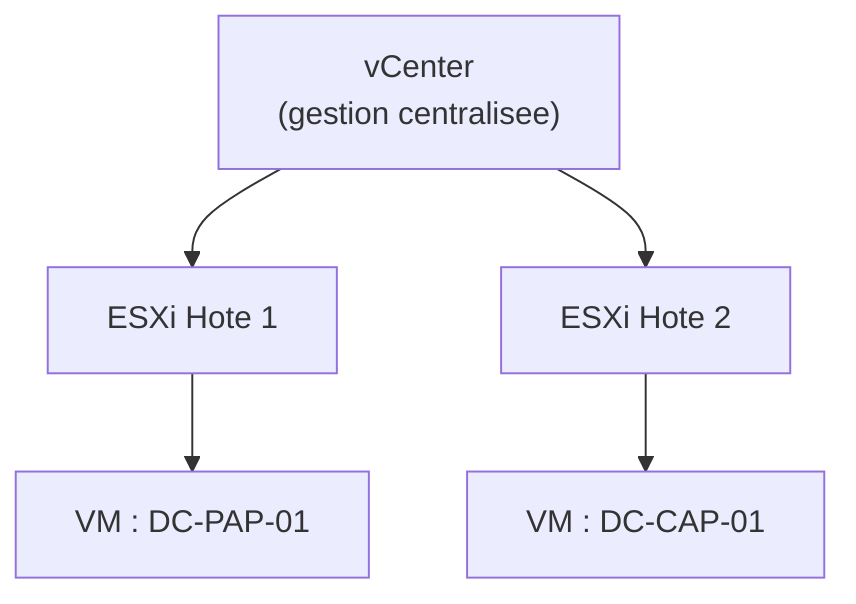

<div class="chapitre-titre-num">CHAPITRE 34</div>

# VMware vSphere : ESXi et vCenter

<div class="encadre objectif">
<span class="encadre-titre">🎯 Objectif du chapitre</span>
Découvrir VMware vSphere, la suite de virtualisation d'entreprise historiquement la plus mature et la plus répandue, à travers ses deux composants centraux : ESXi (l'hyperviseur) et vCenter (la gestion centralisée). À la fin de ce chapitre, tu sauras expliquer vMotion, DRS et HA, connecter vSphere au stockage partagé du chapitre 29, et éviter un piège classique et bien documenté qui affecte spécifiquement les contrôleurs de domaine virtualisés.
</div>

<div class="encadre scenario">
<span class="encadre-titre">🎬 Mise en situation</span>
Suite à la décision de consolidation du chapitre 33, le DSI valide un budget pour virtualiser en priorité l'infrastructure la plus critique : les deux contrôleurs de domaine (chapitre 5). Compte tenu de la criticité de ces systèmes — toute l'authentification de l'entreprise en dépend — l'entreprise choisit VMware vSphere plutôt qu'une alternative moins mature, en s'appuyant sur le cadre de décision du chapitre 33 (écosystème le plus établi, support commercial disponible, documentation abondante pour une première migration vers la virtualisation). Trois semaines après la migration, un problème étrange survient : les contrôleurs de domaine virtualisés affichent des erreurs d'authentification Kerberos intermittentes — exactement le symptôme "Clock skew too great" déjà rencontré au chapitre 23, alors que rien n'a changé côté NTP. Ce chapitre explique la cause exacte de ce piège, bien documenté chez les administrateurs VMware expérimentés, avant même d'aborder les fonctionnalités plus avancées de vSphere.
</div>

## 34.1 vSphere : la suite complète, ESXi et vCenter

**VMware vSphere** désigne l'ensemble de la suite de virtualisation, composée de deux briques distinctes mais complémentaires :

<div class="encadre retenir">
<span class="encadre-titre">📌 À retenir</span>
<strong>ESXi</strong> est l'hyperviseur lui-même — un hyperviseur de Type 1 (bare-metal, chapitre 33), installé directement sur chaque serveur physique. <strong>vCenter</strong> est la console de gestion centralisée, permettant d'administrer plusieurs hôtes ESXi comme un ensemble cohérent, plutôt que de se connecter individuellement à chacun — exactement le même besoin de gestion centralisée déjà rencontré avec Windows Admin Center (chapitre 4) ou Server Manager, appliqué ici à un parc d'hyperviseurs plutôt qu'à des serveurs physiques classiques.
</div>



## 34.2 ESXi : l'hyperviseur bare-metal de VMware

<div class="encadre astuce">
<span class="encadre-titre">💡 ESXi, minimaliste par conception</span>
ESXi est volontairement minimaliste : pas d'interface graphique complète comme un système d'exploitation classique, une empreinte disque réduite, une surface d'attaque limitée — exactement le même principe que Windows Server Core évoqué au chapitre 4, appliqué ici à un hyperviseur dédié plutôt qu'à un serveur généraliste. L'administration quotidienne se fait presque exclusivement via vCenter ou via des outils en ligne de commande (`esxcli`), rarement en se connectant directement à la console de chaque hôte.
</div>

## 34.3 vCenter : gestion centralisée de plusieurs hôtes

vCenter regroupe plusieurs hôtes ESXi en un **cluster**, permettant de gérer collectivement leurs ressources et d'activer les fonctionnalités avancées de vSphere détaillées ci-dessous — exactement le concept de cluster déjà rencontré au chapitre 13 (Windows Server Failover Clustering), mais appliqué ici à l'échelle des hôtes de virtualisation plutôt qu'aux services applicatifs individuels.

## 34.4 vMotion : la migration à chaud, sans interruption de service

<div class="encadre bonne-pratique">
<span class="encadre-titre">✅ vMotion permet de maintenir un service disponible pendant une maintenance planifiée</span>
**vMotion** déplace une machine virtuelle en cours d'exécution d'un hôte ESXi vers un autre, sans interruption perceptible pour les utilisateurs — une capacité précieuse pour appliquer un correctif de sécurité (chapitre 15) ou une maintenance matérielle sur un hôte physique, en migrant temporairement ses VM vers un autre hôte du cluster avant l'intervention, puis en les ramenant ensuite. Cette fonctionnalité rejoint directement l'esprit du déploiement progressif déjà valorisé au chapitre 2 (changement contrôlé) : une maintenance qui, sans vMotion, exigerait une fenêtre d'indisponibilité planifiée devient transparente pour les utilisateurs finaux.
</div>

## 34.5 DRS et HA : équilibrage automatique et tolérance de panne au niveau du cluster

| Fonctionnalité | Rôle |
|---|---|
| **DRS** (*Distributed Resource Scheduler*) | Équilibre automatiquement la charge des VM entre les hôtes du cluster, en utilisant vMotion en arrière-plan, selon l'utilisation réelle des ressources |
| **HA** (*High Availability*) | Redémarre automatiquement les VM d'un hôte tombé en panne sur un autre hôte disponible du cluster |

<div class="encadre astuce">
<span class="encadre-titre">💡 DRS et HA résolvent deux problèmes distincts</span>
DRS optimise en continu la répartition des charges pendant un fonctionnement normal (rejoignant directement la surveillance de la surallocation évoquée au chapitre 33) ; HA réagit à une panne matérielle imprévue d'un hôte, redémarrant automatiquement les VM affectées ailleurs — le même principe de tolérance de panne déjà vu pour le RAID (chapitres 17 et 27) et le clustering Windows (chapitre 13), appliqué ici au niveau des hôtes de virtualisation eux-mêmes plutôt qu'aux disques ou aux services.
</div>

## 34.6 Le piège du scénario d'ouverture : la synchronisation temporelle VMware Tools

<div class="encadre attention">
<span class="encadre-titre">⚠️ La cause exacte du problème Kerberos du scénario d'ouverture</span>
**VMware Tools**, le pilote et l'ensemble d'outils installés dans chaque VM pour améliorer les performances et l'intégration avec l'hôte, propose par défaut une option de **synchronisation temporelle** entre la VM et son hôte ESXi. Cette option, activée par défaut dans certaines configurations, entre directement en conflit avec le service NTP (chapitre 23) qui doit rester **l'autorité unique** de synchronisation temporelle pour un contrôleur de domaine — deux sources de synchronisation concurrentes peuvent produire de légers ajustements d'horloge contradictoires, provoquant exactement le type d'instabilité qui déclenche "Clock skew too great" de façon intermittente et déroutante, sans qu'aucune panne NTP réelle ne soit en cause.
</div>

```
# Sur un controleur de domaine virtualise sous VMware, la synchronisation
# temporelle VMware Tools doit etre DESACTIVEE -- le service de temps
# Windows (w32time, deja evoque implicitement au chapitre 23) doit
# rester l'unique autorite temporelle, jamais l'hote ESXi
# (configuration realisee via vSphere Client, options avancees de la VM :
#  tools.syncTime = "FALSE")
```

<div class="encadre memoriser">
<span class="encadre-titre">🧠 À mémoriser — une recommandation officielle documentée, pas une astuce obscure</span>
Ce n'est pas une découverte isolée : Microsoft et VMware documentent tous deux explicitement cette recommandation — désactiver la synchronisation temporelle VMware Tools sur tout contrôleur de domaine virtualisé. Ce piège illustre parfaitement pourquoi comprendre les fondations (Kerberos et la tolérance d'horloge, chapitre 23) avant d'aborder un outil précis permet de diagnostiquer bien plus vite un symptôme qui semblerait, sans ce contexte, totalement mystérieux.
</div>

## 34.7 Connecter vSphere au stockage partagé du chapitre 29

<div class="encadre astuce">
<span class="encadre-titre">💡 vMotion et HA exigent un stockage partagé accessible par tous les hôtes du cluster</span>
Pour que vMotion (section 34.4) et HA (section 34.5) fonctionnent, les disques virtuels des VM doivent être accessibles depuis **n'importe quel** hôte du cluster, pas seulement celui qui exécute la VM à un instant donné — exactement le rôle du SAN déjà déployé au chapitre 29, dont le mode d'accès en bloc à faible latence convient particulièrement bien à ce besoin, mieux qu'un stockage local individuel à chaque hôte qui rendrait la migration à chaud impossible.
</div>

## 34.8 Les licences VMware : un critère de décision à ne jamais négliger

<div class="encadre securite">
<span class="encadre-titre">🔒 Un critère économique réel, pas secondaire</span>
Rappel direct du cadre de décision du chapitre 33 (et du chapitre 14 sur le choix de distribution) : les licences VMware représentent historiquement un coût significatif, particulièrement pour les fonctionnalités avancées comme DRS et HA, qui nécessitent des niveaux de licence supérieurs. Ce coût doit être mis en balance avec la maturité et l'écosystème de support de VMware — une décision à documenter explicitement (chapitre 3), comme toute décision d'architecture significative, plutôt qu'un choix implicite jamais justifié par écrit.
</div>

## Atelier — Diagnostiquer et prévenir le piège du scénario d'ouverture

<div class="encadre exercice">
<span class="encadre-titre">🛠️ Atelier 34 — Corriger la synchronisation temporelle des contrôleurs de domaine virtualisés</span>

**Objectif** : appliquer la démarche de diagnostic du chapitre 23 à ce nouveau contexte de virtualisation, et corriger durablement la cause racine.

**Préparation** : aucune installation nécessaire pour cet atelier conceptuel, ou un accès à un environnement VMware de test pour le pratiquer réellement.

**Étapes détaillées** :

1. Explique pourquoi ce problème est particulièrement déroutant à diagnostiquer pour un administrateur qui ne connaît pas encore le comportement de VMware Tools.
2. Rédige les étapes de vérification qui confirmeraient cette hypothèse plutôt qu'un problème NTP classique (rappel du chapitre 23, section diagnostic).
3. Propose la correction précise à appliquer sur chaque contrôleur de domaine virtualisé.
4. Compare ta démarche à la section "Résultat attendu".

**Résultat attendu** : ce problème est déroutant car les symptômes ("Clock skew too great") sont identiques à un problème de désynchronisation NTP classique du chapitre 23, orientant naturellement le diagnostic vers `timedatectl`/`w32tm` plutôt que vers la configuration de la VM elle-même. La vérification doit inclure la consultation des paramètres avancés de la VM dans vCenter, en particulier `tools.syncTime`, en plus des vérifications NTP habituelles. La correction consiste à désactiver explicitement la synchronisation temporelle VMware Tools sur chaque contrôleur de domaine, en laissant le service de temps Windows (déjà configuré et fonctionnel avant la migration) rester l'unique source de vérité temporelle.

**Dépannage** : si la désactivation de `tools.syncTime` ne suffit pas à résoudre le problème, vérifie également que le service de temps Windows (`w32time`) est correctement configuré et actif sur chaque contrôleur de domaine — la virtualisation n'élimine jamais le besoin des bonnes pratiques déjà établies au chapitre 23, elle ajoute simplement une source de conflit potentielle supplémentaire à surveiller.
</div>

## Erreurs fréquentes

<div class="encadre attention">
<span class="encadre-titre">⚠️ Erreur n°1 — laisser VMware Tools synchroniser l'heure d'un contrôleur de domaine</span>
Exactement la cause du scénario d'ouverture, détaillée en section 34.6 — une recommandation officiellement documentée, mais fréquemment ignorée par méconnaissance.
</div>

<div class="encadre attention">
<span class="encadre-titre">⚠️ Erreur n°2 — déployer vSphere sans configurer DRS ni HA</span>
Installer ESXi et vCenter sans activer ces fonctionnalités revient à se priver d'une grande partie de la valeur ajoutée réelle de la virtualisation d'entreprise (section 34.5) — un oubli qui laisse l'infrastructure aussi vulnérable qu'un serveur physique unique face à une panne matérielle.
</div>

<div class="encadre attention">
<span class="encadre-titre">⚠️ Erreur n°3 — sous-estimer le coût des licences avant de s'engager</span>
Rappel de la section 34.8 : découvrir après coup que les fonctionnalités réellement nécessaires (DRS, HA) exigent un niveau de licence supérieur au budget initialement prévu peut compromettre tout un projet de virtualisation déjà engagé.
</div>

## Diagnostiquer un problème de temps sur une VM virtualisée

<div class="encadre attention">
<span class="encadre-titre">🩺 Situation : erreurs Kerberos intermittentes après une migration vers la virtualisation</span>

- **Diagnostic** : au-delà des causes déjà couvertes au chapitre 23 (NTP local mal configuré), vérifier systématiquement si la VM concernée est un contrôleur de domaine et si la synchronisation temporelle VMware Tools est active — une cause spécifique à l'environnement virtualisé, absente sur un serveur physique.
- **Comment vérifier** : consulter les paramètres avancés de la VM dans vCenter (`tools.syncTime`) en complément des vérifications `w32tm`/`timedatectl` déjà connues.
- **Résolution** : désactiver la synchronisation temporelle VMware Tools sur tout contrôleur de domaine (section 34.6), en confirmant que le service de temps natif de l'OS reste l'unique source de synchronisation.
</div>

## En entreprise

- **Bonne pratique répandue** : documenter explicitement (chapitre 3) la configuration de synchronisation temporelle de chaque VM critique lors de sa migration vers la virtualisation — un point de configuration facile à oublier mais aux conséquences bien documentées.
- **Bonne pratique répandue** : tester DRS et HA en conditions contrôlées (par exemple, mettre volontairement un hôte en mode maintenance pour observer la migration automatique des VM) avant de compter dessus en situation de panne réelle — le même principe de test déjà appliqué aux sauvegardes (chapitre 30) et au PRA (chapitre 31).
- **Erreur classique observée** : une migration vers la virtualisation réalisée sans revue préalable de la documentation officielle des bonnes pratiques pour les charges de travail spécifiques (comme les contrôleurs de domaine), reproduisant des pièges déjà bien connus et documentés par la communauté.

## Entretien technique

<div class="encadre exercice">
<span class="encadre-titre">💼 Questions fréquemment posées en entretien</span>

**Q1. "Quelle est la différence entre ESXi et vCenter ?"**
Réponse attendue : ESXi est l'hyperviseur lui-même, installé directement sur chaque serveur physique (Type 1, bare-metal) ; vCenter est la console de gestion centralisée permettant d'administrer plusieurs hôtes ESXi comme un ensemble cohérent, incluant les fonctionnalités avancées comme vMotion, DRS et HA.

**Q2. "Qu'est-ce que vMotion, et pourquoi est-ce utile pour la maintenance ?"**
Réponse attendue : vMotion migre une VM en cours d'exécution d'un hôte ESXi vers un autre sans interruption perceptible pour les utilisateurs, permettant d'effectuer une maintenance sur un hôte physique (mise à jour, réparation) en déplaçant temporairement ses VM ailleurs, sans fenêtre d'indisponibilité planifiée nécessaire.

**Q3. "Pourquoi faut-il désactiver la synchronisation temporelle VMware Tools sur un contrôleur de domaine virtualisé ?"**
Réponse attendue : cette synchronisation entre en conflit avec le service de temps natif de Windows, qui doit rester l'unique autorité temporelle d'un contrôleur de domaine — deux sources concurrentes peuvent produire des ajustements d'horloge contradictoires, provoquant des erreurs Kerberos intermittentes de type "Clock skew too great", une recommandation officiellement documentée par Microsoft et VMware.
</div>

## Optimisation, sécurité et maintenabilité — les réflexes dès ce chapitre

<div class="encadre securite">
<span class="encadre-titre">🔒 Sécurité</span>
Vérifie systématiquement, pour chaque VM critique migrée vers la virtualisation, si des recommandations spécifiques documentées existent pour son type de charge de travail (comme les contrôleurs de domaine, section 34.6) — la virtualisation n'est jamais un simple "copier-coller" transparent d'un serveur physique existant, elle introduit ses propres considérations spécifiques.
</div>

<div class="encadre bonne-pratique">
<span class="encadre-titre">✅ Maintenabilité</span>
Documente (chapitre 3) la configuration de cluster (nombre d'hôtes, niveau de licence, fonctionnalités DRS/HA activées) et les paramètres spécifiques appliqués à chaque VM critique — une information indispensable pour tout audit ou toute intervention future sur cette infrastructure.
</div>

<div class="encadre performance">
<span class="encadre-titre">🚀 Performance</span>
DRS équilibre automatiquement la charge entre les hôtes, mais reste soumis aux mêmes principes de surveillance de la surallocation déjà évoqués au chapitre 33 — l'automatisation de l'équilibrage ne dispense jamais d'une surveillance globale de la capacité réellement disponible à l'échelle du cluster entier.
</div>

## Résumé du chapitre

- VMware vSphere combine ESXi (l'hyperviseur bare-metal) et vCenter (la gestion centralisée de plusieurs hôtes en cluster).
- vMotion migre une VM en cours d'exécution sans interruption, facilitant la maintenance planifiée des hôtes physiques.
- DRS équilibre automatiquement la charge entre les hôtes ; HA redémarre automatiquement les VM d'un hôte tombé en panne.
- La synchronisation temporelle VMware Tools doit être désactivée sur tout contrôleur de domaine virtualisé, sous peine d'erreurs Kerberos intermittentes — une recommandation officiellement documentée.
- vMotion et HA exigent un stockage partagé accessible par tous les hôtes du cluster, typiquement fourni par le SAN du chapitre 29.
- Le coût des licences VMware, particulièrement pour DRS et HA, reste un critère de décision réel à documenter explicitement.

## Quiz

<div class="encadre exercice">
<span class="encadre-titre">📝 QCM (une seule bonne réponse par question)</span>

1. ESXi est :
   - a) La console de gestion centralisée de VMware
   - b) L'hyperviseur bare-metal installé sur chaque serveur physique
   - c) Un outil de sauvegarde
   - d) Un protocole réseau

2. vMotion permet de :
   - a) Sauvegarder automatiquement une VM chaque nuit
   - b) Migrer une VM en cours d'exécution vers un autre hôte, sans interruption perceptible
   - c) Chiffrer le disque d'une VM
   - d) Créer automatiquement des snapshots

3. La synchronisation temporelle VMware Tools doit être désactivée sur :
   - a) Toutes les VM sans exception
   - b) Les contrôleurs de domaine virtualisés
   - c) Uniquement les VM Linux
   - d) Aucune VM, elle est toujours recommandée

**Corrigé** : 1-b, 2-b, 3-b.
</div>

<div class="encadre exercice">
<span class="encadre-titre">📝 Vrai ou Faux</span>

1. vCenter est nécessaire pour installer un seul hôte ESXi isolé, sans aucune fonctionnalité de cluster. — **Faux** (ESXi peut fonctionner seul ; vCenter apporte la gestion centralisée et les fonctionnalités de cluster).
2. DRS et HA résolvent le même problème, de façon redondante. — **Faux** (DRS équilibre la charge en fonctionnement normal, HA réagit à une panne, section 34.5).
3. vMotion et HA nécessitent un stockage partagé accessible par tous les hôtes du cluster. — **Vrai**.
4. La désactivation de la synchronisation temporelle VMware Tools sur un contrôleur de domaine est une astuce non documentée officiellement. — **Faux** (c'est une recommandation officielle de Microsoft et VMware, section 34.6).
</div>

<div class="encadre exercice">
<span class="encadre-titre">📝 Questions ouvertes</span>

1. Explique pourquoi comprendre Kerberos (chapitre 23) avant d'aborder VMware facilite le diagnostic du piège de la section 34.6.
2. Reprends le scénario d'ouverture. Explique pourquoi ce type de piège illustre l'importance de consulter la documentation officielle avant une migration, plutôt que de simplement "copier" une configuration physique existante vers une VM.

**Corrigé 1** : sans la compréhension déjà construite au chapitre 23 (le mécanisme précis de la tolérance d'horloge Kerberos et pourquoi "Clock skew too great" pointe systématiquement vers un problème de synchronisation temporelle), un administrateur pourrait chercher la cause dans des directions totalement différentes (mots de passe, permissions, réseau) avant de penser à vérifier l'horloge — la compréhension du protocole sous-jacent transforme un symptôme déroutant en diagnostic rapide et ciblé, exactement l'objectif pédagogique de construire les fondations avant les outils spécifiques tout au long de ce manuel.

**Corrigé 2** : une migration vers la virtualisation n'est jamais un simple changement de support matériel transparent — elle introduit de nouveaux composants (VMware Tools, dans ce cas) avec leurs propres comportements par défaut, potentiellement en conflit avec des configurations déjà correctement établies sur le système physique d'origine. Consulter la documentation officielle spécifique à chaque type de charge de travail migrée (ici, les contrôleurs de domaine) permet d'anticiper ce type de piège avant la migration, plutôt que de le découvrir après coup via des symptômes déroutants comme dans le scénario d'ouverture.
</div>

## Exercices

<div class="encadre exercice">
<span class="encadre-titre">📝 Exercice 34.1</span>

Un administrateur souhaite effectuer une mise à jour de sécurité sur un hôte ESXi hébergeant plusieurs VM critiques, sans interrompre leur disponibilité. Explique la démarche à suivre, en t'appuyant sur les sections 34.4 et 34.5.
</div>

**Corrigé :** L'administrateur peut mettre l'hôte concerné en "mode maintenance" dans vCenter, ce qui déclenche automatiquement (si DRS est activé) la migration de toutes les VM hébergées vers d'autres hôtes disponibles du cluster via vMotion, sans interruption perceptible pour les utilisateurs (section 34.4). Une fois l'hôte vidé de ses VM, la mise à jour de sécurité peut être appliquée en toute sécurité, puis l'hôte peut être remis en service et DRS rééquilibrera automatiquement la charge entre tous les hôtes disponibles du cluster (section 34.5) — une procédure bien plus sûre et transparente qu'une interruption de service planifiée sur un serveur physique unique sans cette flexibilité.

<div class="encadre exercice">
<span class="encadre-titre">📝 Exercice 34.2</span>

Rédige, en 3 à 5 phrases, pourquoi le coût des licences VMware (section 34.8) devrait être évalué avant, et non après, le début d'un projet de migration vers la virtualisation.
</div>

**Corrigé (exemple de réponse) :** Découvrir après le début d'un projet que les fonctionnalités réellement indispensables (comme HA pour la tolérance de panne, jugée nécessaire pour les contrôleurs de domaine critiques du scénario d'ouverture) nécessitent un niveau de licence supérieur au budget initialement approuvé peut forcer un choix difficile en cours de route : soit renoncer à ces fonctionnalités essentielles, soit demander un budget supplémentaire non planifié, une situation bien plus délicate à gérer qu'une évaluation complète et honnête du coût total avant tout engagement. Cette évaluation préalable rejoint directement le cadre de décision du chapitre 33 (et du chapitre 14) : le coût est un critère à part entière, à documenter et à valider explicitement dès la phase de décision, jamais découvert a posteriori.

## Checklist de fin de chapitre

<ul class="checklist">
<li>☐ Je comprends la distinction entre ESXi (hyperviseur) et vCenter (gestion centralisée).</li>
<li>☐ Je sais expliquer vMotion et son intérêt pour la maintenance sans interruption.</li>
<li>☐ Je comprends la différence entre DRS (équilibrage) et HA (tolérance de panne).</li>
<li>☐ Je sais pourquoi et comment désactiver la synchronisation temporelle VMware Tools sur un contrôleur de domaine.</li>
<li>☐ Je comprends pourquoi vMotion et HA nécessitent un stockage partagé.</li>
<li>☐ Je sais que le coût des licences VMware est un critère de décision à évaluer explicitement avant tout engagement.</li>
</ul>

## FAQ

<dl class="faq">
<dt>Existe-t-il une version gratuite d'ESXi ?</dt>
<dd>Une version gratuite limitée a historiquement existé, mais sans les fonctionnalités avancées comme vMotion, DRS et HA — pour un usage de production sérieux nécessitant ces fonctionnalités, une licence payante reste généralement nécessaire, un point à considérer dans l'évaluation de coût de la section 34.8.</dd>

<dt>Combien d'hôtes minimum faut-il pour bénéficier de HA ?</dt>
<dd>Un minimum de deux hôtes est nécessaire, HA n'ayant de sens que s'il existe au moins un autre hôte disponible pour accueillir les VM redémarrées après une panne — plus le cluster compte d'hôtes, plus la marge de manœuvre en cas de panne multiple reste confortable.</dd>

<dt>La désactivation de la synchronisation temporelle VMware Tools s'applique-t-elle aussi aux serveurs Linux virtualisés ?</dt>
<dd>La même prudence s'applique à tout serveur ayant son propre service de synchronisation temporelle fiable déjà configuré (comme `chronyd` sur les serveurs Rocky Linux déjà rencontrés dans ce manuel) — le principe général reste : ne jamais laisser deux mécanismes de synchronisation temporelle entrer en conflit sur un même système, quel que soit son système d'exploitation.</dd>

<dt>Peut-on utiliser vMotion entre des hôtes ESXi de versions différentes ?</dt>
<dd>Une compatibilité existe généralement entre versions proches, mais avec des limitations selon l'écart de version — une vérification de la matrice de compatibilité officielle VMware reste indispensable avant de planifier une migration entre hôtes de versions significativement différentes.</dd>
</dl>

## Références et pour aller plus loin

- Documentation officielle VMware vSphere : [https://docs.vmware.com/fr/VMware-vSphere/index.html](https://docs.vmware.com/fr/VMware-vSphere/index.html)
- VMware Knowledge Base — Synchronisation temporelle et contrôleurs de domaine : [https://kb.vmware.com/](https://kb.vmware.com/)
- Microsoft — Recommandations pour la virtualisation des contrôleurs de domaine : [https://learn.microsoft.com/fr-fr/windows-server/identity/ad-ds/get-started/virtual-dc/virtualized-domain-controller-architecture](https://learn.microsoft.com/fr-fr/windows-server/identity/ad-ds/get-started/virtual-dc/virtualized-domain-controller-architecture)

*Chapitre suivant : Microsoft Hyper-V — l'alternative native à l'écosystème Windows Server déjà largement couvert dans ce manuel, avec ses propres compromis face à VMware.*
