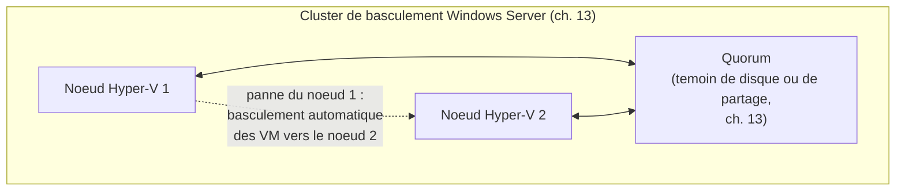

<div class="chapitre-titre-num">CHAPITRE 35</div>

# Microsoft Hyper-V

<div class="encadre objectif">
<span class="encadre-titre">🎯 Objectif du chapitre</span>
Découvrir Hyper-V, l'hyperviseur natif de Windows Server, et comprendre pourquoi son modèle de licence change fondamentalement l'équation économique par rapport à VMware (chapitre 34) pour une entreprise déjà investie dans l'écosystème Windows Server. À la fin de ce chapitre, tu sauras configurer un cluster Hyper-V en t'appuyant directement sur le Failover Clustering déjà couvert au chapitre 13, et éviter un piège de synchronisation temporelle remarquablement similaire à celui rencontré avec VMware.
</div>

<div class="encadre scenario">
<span class="encadre-titre">🎬 Mise en situation</span>
Fort du succès de la virtualisation des contrôleurs de domaine sous VMware (chapitre 34), le DSI souhaite maintenant virtualiser le reste du parc — le serveur du portail client, le serveur de gestion documentaire, et les futurs projets à venir. Mais le coût des licences VMware pour ce périmètre plus large inquiète le service financier. En creusant la question, tu découvres que l'entreprise possède déjà des licences **Windows Server Datacenter** pour plusieurs serveurs (achetées initialement pour d'autres raisons) — et que ces licences incluent, sans coût supplémentaire, le droit d'exécuter un **nombre illimité** de machines virtuelles Windows Server sur le matériel physique couvert. Hyper-V, déjà présent gratuitement dans Windows Server, devient soudain une option économiquement très différente de VMware pour ce second périmètre. Ce chapitre explore Hyper-V à travers cette réalité économique concrète, avant d'aborder ses capacités techniques.
</div>

## 35.1 Hyper-V : un rôle de Windows Server, pas un produit séparé

<div class="encadre retenir">
<span class="encadre-titre">📌 À retenir</span>
Contrairement à VMware ESXi (un système d'exploitation dédié à la virtualisation, chapitre 34), **Hyper-V** s'installe comme un **rôle** de Windows Server — exactement le même mécanisme d'activation de rôle déjà pratiqué au chapitre 9 (DNS) et au chapitre 10 (DHCP). Une fois ce rôle activé, le serveur devient lui-même un hyperviseur de Type 1 (chapitre 33), Windows Server s'exécutant alors techniquement comme la première VM privilégiée du système ("partition parente").
</div>

## 35.2 Le modèle de licence : le vrai argument économique du scénario d'ouverture

| Édition Windows Server | Droits de virtualisation inclus |
|---|---|
| **Standard** | 2 machines virtuelles Windows Server par licence |
| **Datacenter** | Nombre **illimité** de machines virtuelles Windows Server, sur le matériel physique couvert |

<div class="encadre bonne-pratique">
<span class="encadre-titre">✅ Bonne pratique — évaluer le modèle de licence avant de comparer les fonctionnalités techniques</span>
Rappel direct du chapitre 34 (coût des licences VMware) et du chapitre 14 (cadre de décision) : pour une entreprise déjà équipée en licences Windows Server Datacenter — souvent le cas dès qu'un nombre significatif de VM Windows est prévu — Hyper-V devient une option quasiment gratuite pour la virtualisation, contrairement à VMware qui facture ses fonctionnalités avancées séparément. C'est exactement la découverte du scénario d'ouverture, qui change fondamentalement l'équation économique pour ce second périmètre de virtualisation.
</div>

<div class="encadre attention">
<span class="encadre-titre">⚠️ Cette économie ne s'applique qu'aux VM Windows Server</span>
Le calcul change pour des VM Linux (comme le serveur Rocky Linux de gestion documentaire, chapitre 19) : les droits de virtualisation inclus dans les licences Windows Server Datacenter ne couvrent que les VM Windows Server elles-mêmes, pas les systèmes d'exploitation tiers — Hyper-V peut techniquement héberger des VM Linux sans coût de licence Microsoft additionnel (Hyper-V lui-même reste gratuit à utiliser), mais l'argument économique du scénario d'ouverture est spécifiquement le plus fort pour les charges Windows Server.
</div>

## 35.3 Live Migration : l'équivalent Hyper-V de vMotion

<div class="encadre astuce">
<span class="encadre-titre">💡 Le même concept, un nom différent</span>
**Live Migration** joue exactement le même rôle que vMotion (chapitre 34) : déplacer une VM en cours d'exécution d'un hôte Hyper-V vers un autre, sans interruption perceptible pour les utilisateurs — pour la maintenance planifiée d'un hôte physique, exactement le même bénéfice déjà expliqué au chapitre 34. Comme vMotion, Live Migration nécessite un stockage partagé accessible par tous les hôtes concernés (le NAS ou le SAN des chapitres 28-29).
</div>

## 35.4 Failover Clustering pour Hyper-V : rappel direct du chapitre 13

<div class="encadre memoriser">
<span class="encadre-titre">🧠 À mémoriser — Hyper-V s'appuie sur le clustering déjà appris</span>
Contrairement à VMware, qui a son propre mécanisme HA indépendant (chapitre 34), la haute disponibilité Hyper-V s'appuie directement sur **Failover Clustering**, le même mécanisme Windows Server déjà couvert en détail au chapitre 13 — un cluster de basculement, avec ses nœuds et son quorum, héberge cette fois des VM plutôt qu'un service applicatif classique. Comprendre le chapitre 13 en profondeur rend cette section presque entièrement familière : le concept de quorum (une majorité de nœuds doit s'accorder sur l'état du cluster pour éviter un split-brain) s'applique ici exactement de la même façon.
</div>



## 35.5 Checkpoints Hyper-V : le même principe et la même mise en garde que les snapshots

<div class="encadre attention">
<span class="encadre-titre">⚠️ Rappel direct du chapitre 33 : un checkpoint n'est pas une sauvegarde</span>
Hyper-V appelle **checkpoint** ce que VMware appelle snapshot (chapitre 33 et 34) — le même concept, la même mise en garde s'applique intégralement : un checkpoint capture un état précis, utile pour revenir en arrière rapidement après un changement risqué, mais ne protège pas contre une panne du stockage sous-jacent et ne doit jamais rester actif indéfiniment (accumulation d'espace disque, dégradation de performance).
</div>

## 35.6 Le même piège que VMware : la synchronisation de l'heure

<div class="encadre attention">
<span class="encadre-titre">⚠️ Un piège remarquablement similaire à celui du chapitre 34, chez un fournisseur différent</span>
Hyper-V propose, via les **Services d'intégration** installés dans chaque VM, un service de **synchronisation de l'heure** entre l'hôte et la VM — exactement le même mécanisme que VMware Tools (chapitre 34), avec exactement le même risque pour un contrôleur de domaine virtualisé : ce service doit être **désactivé** sur tout contrôleur de domaine, pour laisser le service de temps Windows natif (rappel du chapitre 23) rester l'unique autorité temporelle. Ce n'est pas une coïncidence : le problème sous-jacent (deux mécanismes de synchronisation concurrents) est structurel à la virtualisation elle-même, indépendant du fournisseur d'hyperviseur choisi.
</div>

```
# Sur un controleur de domaine virtualise sous Hyper-V, desactiver le
# service d'integration de synchronisation de l'heure via PowerShell
Disable-VMIntegrationService -VMName "DC-PAP-01" -Name "Time Synchronization"
```

<div class="encadre memoriser">
<span class="encadre-titre">🧠 À mémoriser — une leçon transversale à toute la virtualisation, pas propre à un seul produit</span>
Ce parallèle exact entre VMware (chapitre 34) et Hyper-V confirme une leçon plus large : les fondations comprises en profondeur (Kerberos et la synchronisation temporelle, chapitre 23) restent valables quel que soit l'hyperviseur choisi ensuite. Un administrateur qui change d'employeur, et donc potentiellement d'écosystème de virtualisation, retrouve les mêmes principes sous des noms différents — la compréhension des fondations vaut plus que la mémorisation d'une seule interface produit.
</div>

## 35.7 Choisir entre VMware et Hyper-V : synthèse

| Critère | VMware vSphere (chapitre 34) | Hyper-V |
|---|---|---|
| Coût pour des VM Windows Server, licences Datacenter déjà possédées | Coût de licence VMware séparé | Quasiment gratuit (inclus) |
| Maturité de l'écosystème et de la documentation | Historiquement très établie | Solide, en croissance continue |
| Intégration avec l'écosystème Windows déjà en place | Bonne, mais nécessite un produit tiers | Native, s'appuie directement sur des compétences déjà acquises (chapitre 13) |
| Support des charges de travail Linux | Excellent, agnostique | Bon, mais l'écosystème reste historiquement plus orienté Windows |

<div class="encadre bonne-pratique">
<span class="encadre-titre">✅ Bonne pratique — une coexistence des deux, plutôt qu'un choix exclusif</span>
Exactement comme le scénario de ce manuel le suggère (VMware pour les contrôleurs de domaine les plus critiques au chapitre 34, Hyper-V pour le reste du parc dans ce chapitre), de nombreuses organisations font coexister plusieurs hyperviseurs selon le contexte économique et technique de chaque périmètre — une décision à documenter explicitement (chapitre 3), avec sa justification, plutôt qu'un choix arbitraire ou hérité sans réflexion.
</div>

## Atelier — Comparer le coût réel des deux options pour le scénario d'ouverture

<div class="encadre exercice">
<span class="encadre-titre">🛠️ Atelier 35 — Justifier le choix d'Hyper-V pour le second périmètre</span>

**Objectif** : construire une comparaison économique concrète entre VMware et Hyper-V pour le scénario d'ouverture, et prévenir le piège de synchronisation temporelle si l'entreprise décide de virtualiser un futur contrôleur de domaine supplémentaire sous Hyper-V.

**Préparation** : aucune installation nécessaire — cet atelier est un exercice d'argumentation et de configuration préventive.

**Étapes détaillées** :

1. Liste les arguments économiques en faveur d'Hyper-V pour le second périmètre de virtualisation (serveur portail, serveur de gestion documentaire), en t'appuyant sur la section 35.2.
2. Identifie une limite ou une nuance à ne pas négliger dans cet argument (indice : reviens à l'encadré attention de la section 35.2).
3. Rédige la commande PowerShell nécessaire pour prévenir le piège de synchronisation temporelle, en anticipation d'un futur contrôleur de domaine sous Hyper-V.
4. Compare ta démarche à la section "Résultat attendu".

**Résultat attendu** : l'argument économique principal est que les licences Windows Server Datacenter déjà possédées incluent des droits de virtualisation illimités pour des VM Windows Server, rendant Hyper-V quasiment gratuit pour ce second périmètre par rapport à l'achat de licences VMware supplémentaires. La nuance à ne pas négliger : cet avantage économique ne s'applique qu'aux VM Windows Server, pas au serveur Rocky Linux de gestion documentaire, dont l'hébergement sous Hyper-V n'a pas le même impact de licence. La commande `Disable-VMIntegrationService -VMName "NomDuDC" -Name "Time Synchronization"` prévient exactement le même piège que celui rencontré avec VMware au chapitre 34.

**Dépannage** : si tu hésites sur la pertinence économique réelle pour le serveur Linux, rappelle-toi que le coût d'hébergement Hyper-V lui-même reste nul indépendamment du système d'exploitation invité — seul l'argument spécifique des licences Windows Server Datacenter ne s'applique pas à ce cas précis, sans que cela remette en cause la pertinence générale d'Hyper-V pour ce serveur.
</div>

## Erreurs fréquentes

<div class="encadre attention">
<span class="encadre-titre">⚠️ Erreur n°1 — oublier de désactiver la synchronisation de l'heure sur un contrôleur de domaine Hyper-V</span>
Exactement le même piège que celui rencontré avec VMware au chapitre 34, détaillé en section 35.6 — une erreur d'autant plus facile à commettre si l'administrateur suppose, à tort, qu'il s'agit d'un problème spécifique à VMware et non à la virtualisation en général.
</div>

<div class="encadre attention">
<span class="encadre-titre">⚠️ Erreur n°2 — appliquer l'argument économique des licences Datacenter à des VM non-Windows</span>
Rappel de la section 35.2 : les droits de virtualisation illimités ne couvrent que les VM Windows Server, une nuance à ne pas négliger dans un calcul économique global.
</div>

<div class="encadre attention">
<span class="encadre-titre">⚠️ Erreur n°3 — négliger le quorum de cluster en configurant Hyper-V en haute disponibilité</span>
Rappel direct du chapitre 13 : un cluster Hyper-V mal configuré côté quorum reste vulnérable aux mêmes risques de split-brain déjà expliqués pour le clustering Windows Server en général.
</div>

## Diagnostiquer un problème de temps sur une VM Hyper-V

<div class="encadre attention">
<span class="encadre-titre">🩺 Situation : erreurs Kerberos intermittentes sur un contrôleur de domaine virtualisé sous Hyper-V</span>

- **Diagnostic** : exactement la même démarche que celle du chapitre 34 pour VMware, adaptée à Hyper-V — vérifier si le service d'intégration de synchronisation de l'heure est actif, en plus des vérifications NTP/w32time classiques du chapitre 23.
- **Comment vérifier** : `Get-VMIntegrationService -VMName "NomDuDC"` affiche l'état de chaque service d'intégration, y compris la synchronisation de l'heure.
- **Résolution** : `Disable-VMIntegrationService` sur ce service précis, en confirmant que le service de temps Windows natif reste l'unique source de vérité temporelle.
</div>

## En entreprise

- **Bonne pratique répandue** : réévaluer périodiquement le modèle de licence Windows Server en vigueur à mesure que le nombre de VM augmente — le seuil de rentabilité entre licence Standard (2 VM) et Datacenter (illimité) se déplace naturellement avec la croissance de l'infrastructure.
- **Bonne pratique répandue** : documenter (chapitre 3) explicitement quel hyperviseur héberge quelle charge de travail et pourquoi, en particulier dans une infrastructure mixte VMware/Hyper-V comme celle du scénario de ce manuel.
- **Erreur classique observée** : une organisation qui découvre après plusieurs années qu'elle paie pour des licences VMware alors que des licences Windows Server Datacenter déjà possédées auraient couvert une partie significative du besoin sans coût additionnel — un audit de licences périodique (rejoignant l'esprit de l'inventaire du chapitre 3) évite cette découverte tardive et coûteuse.

## Entretien technique

<div class="encadre exercice">
<span class="encadre-titre">💼 Questions fréquemment posées en entretien</span>

**Q1. "Quelle est la différence fondamentale d'installation entre Hyper-V et VMware ESXi ?"**
Réponse attendue : Hyper-V s'installe comme un rôle de Windows Server, sur un système d'exploitation Windows Server existant ; ESXi est un système d'exploitation dédié à la virtualisation, installé directement sur le matériel physique — les deux restent des hyperviseurs de Type 1, mais avec des approches d'installation différentes.

**Q2. "Comment le modèle de licence Windows Server influence-t-il le choix entre VMware et Hyper-V ?"**
Réponse attendue : une licence Windows Server Datacenter inclut des droits de virtualisation illimités pour des VM Windows Server sur le matériel couvert, rendant Hyper-V quasiment gratuit pour ce cas d'usage par rapport à des licences VMware facturées séparément — un argument économique déterminant pour une entreprise déjà largement équipée en Windows Server.

**Q3. "Pourquoi le piège de synchronisation temporelle rencontré avec VMware se reproduit-il aussi sur Hyper-V ?"**
Réponse attendue : ce n'est pas une coïncidence propre à un fournisseur — tout hyperviseur propose typiquement un mécanisme de synchronisation temporelle entre l'hôte et la VM, qui entre en conflit avec le service de temps natif d'un contrôleur de domaine si les deux mécanismes restent actifs simultanément. Le problème est structurel à la virtualisation elle-même, pas spécifique à VMware ou à Microsoft.
</div>

## Optimisation, sécurité et maintenabilité — les réflexes dès ce chapitre

<div class="encadre securite">
<span class="encadre-titre">🔒 Sécurité</span>
Applique la même vigilance de synchronisation temporelle sur Hyper-V que sur VMware (section 35.6) — un réflexe à généraliser à tout hyperviseur rencontré à l'avenir, y compris Proxmox (chapitre suivant), plutôt qu'une correction ponctuelle propre à un seul produit.
</div>

<div class="encadre bonne-pratique">
<span class="encadre-titre">✅ Maintenabilité</span>
Documente (chapitre 3) le modèle de licence Windows Server en vigueur pour chaque hôte Hyper-V, avec le nombre de VM couvertes et la marge disponible avant d'atteindre une limite de licence — une information qui évite une surprise de conformité lors d'un futur audit de licences.
</div>

<div class="encadre performance">
<span class="encadre-titre">🚀 Performance</span>
Live Migration, comme vMotion, nécessite un stockage partagé performant (chapitres 28-29) — un stockage sous-dimensionné limiterait la fréquence à laquelle des migrations à chaud peuvent raisonnablement être effectuées sans dégrader les performances des VM concernées pendant le transfert.
</div>

## Résumé du chapitre

- Hyper-V s'installe comme un rôle de Windows Server, contrairement à VMware ESXi qui est un système d'exploitation dédié.
- Une licence Windows Server Datacenter inclut des droits de virtualisation illimités pour des VM Windows Server, un argument économique déterminant face à VMware pour ce cas d'usage.
- Live Migration (Hyper-V) et vMotion (VMware) jouent le même rôle : migration à chaud sans interruption de service.
- Le clustering Hyper-V s'appuie directement sur le Failover Clustering déjà couvert au chapitre 13, y compris le concept de quorum.
- Les checkpoints Hyper-V suivent exactement la même logique et la même mise en garde que les snapshots VMware (chapitre 33) : jamais un substitut à une sauvegarde.
- Le piège de synchronisation temporelle sur un contrôleur de domaine virtualisé n'est pas spécifique à VMware — il se reproduit à l'identique sur Hyper-V, un problème structurel à la virtualisation elle-même.

## Quiz

<div class="encadre exercice">
<span class="encadre-titre">📝 QCM (une seule bonne réponse par question)</span>

1. Hyper-V s'installe :
   - a) Comme un système d'exploitation dédié, directement sur le matériel
   - b) Comme un rôle de Windows Server
   - c) Uniquement sur Linux
   - d) Comme une extension de navigateur

2. Une licence Windows Server Datacenter inclut :
   - a) Deux VM Windows Server maximum
   - b) Un nombre illimité de VM Windows Server sur le matériel couvert
   - c) Aucun droit de virtualisation
   - d) Uniquement des VM Linux

3. Le piège de synchronisation temporelle sur un contrôleur de domaine virtualisé :
   - a) Ne concerne que VMware
   - b) Ne concerne que Hyper-V
   - c) Concerne tout hyperviseur proposant un mécanisme de synchronisation hôte-VM
   - d) N'existe pas réellement, c'est un mythe

**Corrigé** : 1-b, 2-b, 3-c.
</div>

<div class="encadre exercice">
<span class="encadre-titre">📝 Vrai ou Faux</span>

1. Live Migration et vMotion jouent exactement le même rôle, sous des noms différents. — **Vrai**.
2. Le clustering Hyper-V utilise un mécanisme totalement indépendant du Failover Clustering du chapitre 13. — **Faux** (il s'appuie directement dessus, section 35.4).
3. Les droits de virtualisation d'une licence Windows Server Datacenter s'appliquent aussi bien aux VM Windows qu'aux VM Linux. — **Faux** (uniquement aux VM Windows Server, section 35.2).
4. Un checkpoint Hyper-V laissé actif indéfiniment peut dégrader les performances de la VM. — **Vrai** (même principe que les snapshots, chapitre 33).
</div>

<div class="encadre exercice">
<span class="encadre-titre">📝 Questions ouvertes</span>

1. Explique pourquoi la découverte du scénario d'ouverture (licences Datacenter déjà possédées) change fondamentalement le calcul économique de la virtualisation du second périmètre.
2. Reprends la section 35.6. Explique pourquoi ce parallèle exact avec le chapitre 34 renforce la valeur pédagogique d'avoir étudié Kerberos (chapitre 23) avant les hyperviseurs spécifiques.

**Corrigé 1** : sans cette découverte, l'entreprise aurait probablement envisagé d'étendre ses licences VMware existantes pour couvrir le second périmètre, un coût significatif et récurrent. La découverte que des licences Windows Server Datacenter déjà possédées incluent des droits de virtualisation illimités transforme Hyper-V en option quasiment gratuite pour ce même besoin (au moins pour les VM Windows Server) — un changement d'équation économique qui aurait pu passer inaperçu sans un audit attentif des droits déjà acquis, exactement le type de vérification qu'un bon administrateur système devrait effectuer avant tout nouvel investissement.

**Corrigé 2** : si le chapitre 34 avait présenté le piège de synchronisation temporelle comme une simple bizarrerie propre à VMware, sa réapparition à l'identique sur Hyper-V pourrait sembler être une coïncidence surprenante. Mais ayant compris au chapitre 23 le mécanisme précis de la tolérance d'horloge Kerberos (pourquoi deux sources de synchronisation concurrentes posent structurellement problème), ce chapitre confirme que le piège n'est ni propre à VMware ni à Microsoft — c'est une conséquence logique et prévisible de la virtualisation elle-même, applicable à tout futur hyperviseur rencontré, y compris Proxmox au chapitre suivant.
</div>

## Exercices

<div class="encadre exercice">
<span class="encadre-titre">📝 Exercice 35.1</span>

Une entreprise possède 5 licences Windows Server Standard (2 VM chacune) et envisage d'héberger 15 VM Windows Server sur son infrastructure. Calcule si ces licences suffisent, et propose une alternative si ce n'est pas le cas.
</div>

**Corrigé :** 5 licences Standard × 2 VM chacune = 10 VM Windows Server couvertes au maximum — insuffisant pour les 15 VM envisagées (un déficit de 5 VM non couvertes). Deux alternatives possibles : acheter des licences Standard supplémentaires pour couvrir les 5 VM manquantes, ou migrer vers des licences Datacenter (qui deviennent économiquement plus avantageuses au-delà d'un certain seuil de VM par serveur physique, un calcul à effectuer précisément selon les tarifs en vigueur) pour bénéficier de droits de virtualisation illimités sur le matériel physique couvert, éliminant ce type de contrainte pour toute croissance future du nombre de VM.

<div class="encadre exercice">
<span class="encadre-titre">📝 Exercice 35.2</span>

Rédige, en 3 à 5 phrases, pourquoi une infrastructure mixte VMware/Hyper-V (comme celle envisagée dans ce manuel) nécessite une documentation particulièrement rigoureuse, en t'appuyant sur le chapitre 3.
</div>

**Corrigé (exemple de réponse) :** Une infrastructure mixte introduit une complexité supplémentaire par rapport à un environnement homogène : chaque hyperviseur a son propre vocabulaire (vMotion vs Live Migration, snapshot vs checkpoint), ses propres outils de gestion, et ses propres pièges spécifiques à connaître. Sans documentation claire (chapitre 3) indiquant quel hyperviseur héberge quelle charge de travail et pourquoi, une personne intervenant sur cette infrastructure pourrait perdre un temps précieux à identifier quel ensemble de compétences et d'outils s'applique à quel serveur, ou pire, appliquer par erreur une procédure adaptée à un hyperviseur sur un serveur hébergé par l'autre.

## Checklist de fin de chapitre

<ul class="checklist">
<li>☐ Je comprends qu'Hyper-V s'installe comme un rôle de Windows Server, contrairement à ESXi.</li>
<li>☐ Je sais expliquer l'impact du modèle de licence Windows Server Datacenter sur le coût de la virtualisation.</li>
<li>☐ Je sais que Live Migration joue le même rôle que vMotion.</li>
<li>☐ Je comprends que le clustering Hyper-V s'appuie directement sur le Failover Clustering du chapitre 13.</li>
<li>☐ Je sais désactiver le service d'intégration de synchronisation de l'heure sur un contrôleur de domaine Hyper-V.</li>
<li>☐ Je sais comparer VMware et Hyper-V selon des critères concrets, pas une préférence de marque.</li>
</ul>

## FAQ

<dl class="faq">
<dt>Hyper-V peut-il gérer plusieurs hôtes de façon centralisée, comme vCenter pour VMware ?</dt>
<dd>Oui, via Windows Admin Center (déjà rencontré au chapitre 4) ou System Center Virtual Machine Manager (SCVMM) pour une gestion plus avancée à grande échelle — un équivalent fonctionnel à vCenter, avec ses propres spécificités d'écosystème Microsoft.</dd>

<dt>Peut-on faire tourner des VM Linux sur Hyper-V aussi efficacement que sur VMware ?</dt>
<dd>Oui, Hyper-V supporte officiellement de nombreuses distributions Linux avec de bonnes performances via ses propres services d'intégration Linux — l'écart de maturité historique par rapport à VMware sur ce terrain s'est considérablement réduit ces dernières années.</dd>

<dt>Le quorum de cluster Hyper-V fonctionne-t-il exactement comme celui du chapitre 13 ?</dt>
<dd>Oui, c'est littéralement le même mécanisme sous-jacent de Failover Clustering Windows Server — un cluster Hyper-V est un cas d'usage particulier de la technologie de clustering déjà détaillée au chapitre 13, pas un mécanisme distinct à réapprendre.</dd>

<dt>Faut-il désactiver la synchronisation de l'heure sur toutes les VM, ou seulement les contrôleurs de domaine ?</dt>
<dd>La recommandation stricte s'applique spécifiquement aux contrôleurs de domaine (et plus généralement à tout système possédant déjà son propre service de temps fiable et faisant autorité) — pour une VM standard sans rôle de serveur de temps particulier, la synchronisation via l'hyperviseur reste généralement sans risque et même pratique.</dd>
</dl>

## Références et pour aller plus loin

- Microsoft Learn — Vue d'ensemble d'Hyper-V : [https://learn.microsoft.com/fr-fr/windows-server/virtualization/hyper-v/hyper-v-technology-overview](https://learn.microsoft.com/fr-fr/windows-server/virtualization/hyper-v/hyper-v-technology-overview)
- Microsoft Learn — Droits d'utilisation des licences Windows Server : [https://learn.microsoft.com/fr-fr/windows-server/get-started/licensing-editions](https://learn.microsoft.com/fr-fr/windows-server/get-started/licensing-editions)
- Microsoft Learn — Services d'intégration Hyper-V et synchronisation de l'heure : [https://learn.microsoft.com/fr-fr/windows-server/virtualization/hyper-v/manage/manage-hyper-v-integration-services](https://learn.microsoft.com/fr-fr/windows-server/virtualization/hyper-v/manage/manage-hyper-v-integration-services)

*Chapitre suivant : Proxmox VE — l'alternative open source et gratuite, pour compléter la comparaison des trois grands hyperviseurs de ce manuel.*
