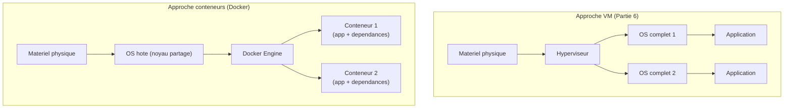

<div class="chapitre-titre-num">CHAPITRE 39</div>

# Concepts Docker

<div class="encadre objectif">
<span class="encadre-titre">🎯 Objectif du chapitre</span>
Comprendre la conteneurisation comme un niveau d'abstraction distinct de la virtualisation (Partie 6) : plus léger, plus rapide à déployer, mais avec un modèle d'isolation différent. À la fin de ce chapitre, tu sauras expliquer la différence entre une image et un conteneur, comprendre pourquoi les conteneurs partagent le noyau de l'hôte, et choisir consciemment entre un conteneur et une VM selon le besoin réel.
</div>

<div class="encadre scenario">
<span class="encadre-titre">🎬 Mise en situation</span>
Le développeur du portail client (chapitre 15) se plaint d'un problème récurrent : l'application fonctionne parfaitement sur son poste de développement, mais échoue régulièrement lors du déploiement sur le serveur de test, puis à nouveau différemment en production — une version de Node.js légèrement différente ici, une bibliothèque système manquante là. <em>"Ça marche sur ma machine"</em> devient une phrase récurrente et frustrante pour toute l'équipe. Installer manuellement chaque dépendance sur chaque environnement (rappel du chapitre 15) fonctionne, mais reste lent et sujet à l'erreur humaine à chaque reproduction. Ce chapitre présente Docker, la technologie qui résout précisément ce problème en empaquetant une application avec exactement son environnement d'exécution.
</div>

## 39.1 Le problème que Docker résout

<div class="encadre astuce">
<span class="encadre-titre">💡 Analogie — le kit de meuble complet vs les pièces détachées commandées séparément</span>
Installer une application en suivant une liste de dépendances (chapitre 15) ressemble à assembler un meuble en achetant chaque pièce séparément dans différents magasins, en espérant qu'elles soient toutes exactement compatibles entre elles. Un conteneur Docker ressemble à un kit de meuble complet, avec absolument toutes les pièces nécessaires incluses dans la même boîte, testées ensemble par le fabricant — l'assemblage final produit un résultat identique, peu importe qui l'assemble ou où.
</div>

## 39.2 Conteneurs vs VM : rappel et distinction

<div class="encadre retenir">
<span class="encadre-titre">📌 À retenir — le contraste fondamental avec la Partie 6</span>
Une VM (Partie 6) virtualise un **matériel complet**, exécutant son propre noyau de système d'exploitation indépendant — l'isolation est totale, mais le coût en ressources et en temps de démarrage est réel. Un conteneur virtualise à un niveau plus élevé : il **partage le noyau de l'hôte**, isolant uniquement les processus, le système de fichiers et le réseau de l'application elle-même — beaucoup plus léger et rapide à démarrer (en millisecondes plutôt qu'en minutes), au prix d'une isolation moins complète que celle d'une VM.
</div>

<div class="encadre memoriser">
<span class="encadre-titre">🧠 À mémoriser — un principe déjà rencontré au chapitre 36</span>
Ce compromis exact (légèreté et rapidité contre isolation moindre) a déjà été présenté au chapitre 36 en comparant LXC (conteneurs Linux système) à KVM (VM complètes) sur Proxmox. Docker applique la même logique fondamentale, mais avec un objectif différent : LXC conteneurise un **système Linux complet** (proche d'une VM légère) ; Docker conteneurise une **application unique** avec ses dépendances précises, pas un système d'exploitation entier.
</div>



## 39.3 Image et conteneur : une distinction fondamentale

<div class="encadre retenir">
<span class="encadre-titre">📌 À retenir</span>
Une **image** est un modèle immuable, en lecture seule, contenant l'application et toutes ses dépendances — comparable au fichier ISO d'installation d'un système d'exploitation. Un **conteneur** est une **instance en cours d'exécution** de cette image, avec sa propre couche d'écriture temporaire par-dessus — exactement comme plusieurs VM peuvent être créées à partir du même modèle de VM, plusieurs conteneurs peuvent être lancés à partir de la même image, chacun s'exécutant indépendamment des autres.
</div>

```
# Lister les images Docker disponibles localement
docker images

# Lister les conteneurs actuellement en cours d'execution
docker ps

# Lancer un conteneur a partir d'une image (ici, Nginx, deja
# rencontre au chapitre 15)
docker run -d --name mon-nginx nginx
```

## 39.4 Le Docker Engine : une architecture en couches

<div class="encadre astuce">
<span class="encadre-titre">💡 Un aperçu suffisant pour ce chapitre introductif</span>
Le **Docker Engine** orchestre plusieurs composants : `dockerd` (le démon principal qui reçoit les commandes), `containerd` (qui gère le cycle de vie des conteneurs) et `runc` (qui crée réellement l'isolation au niveau du noyau, via les mécanismes détaillés en section 39.6). Cette architecture en couches n'a pas besoin d'être maîtrisée en détail pour utiliser Docker efficacement au quotidien — elle explique cependant pourquoi Docker s'appuie sur des standards ouverts (OCI, *Open Container Initiative*) plutôt que sur une implémentation propriétaire fermée.
</div>

## 39.5 Les registries : rappel direct du chapitre 15 sur la provenance des paquets

<div class="encadre securite">
<span class="encadre-titre">🔒 Sécurité — le même principe de confiance que pour les dépôts de paquets</span>
Un **registry** (comme **Docker Hub**, le plus utilisé) héberge des images Docker, exactement comme un dépôt APT ou DNF héberge des paquets (chapitre 15). Le même principe de vigilance s'applique intégralement : privilégier les **images officielles** (vérifiées et maintenues par l'éditeur du logiciel ou par Docker lui-même) plutôt qu'une image publiée par un utilisateur anonyme sans garantie de provenance ni de maintenance — une image Docker compromise ou piégée présente exactement le même risque qu'un paquet ou qu'un script `curl | bash` non vérifié, déjà dénoncés au chapitre 15.
</div>

```
# Rechercher une image sur Docker Hub, en privilegiant les
# images officielles (marquees "Official Image")
docker search postgres

# Toujours preferer une version precise (un "tag") a "latest",
# pour une reproductibilite garantie entre environnements --
# exactement le probleme du scenario d'ouverture
docker pull postgres:16
```

<div class="encadre attention">
<span class="encadre-titre">⚠️ Le piège du tag "latest"</span>
Utiliser systématiquement le tag `latest` (la version la plus récente disponible au moment du téléchargement, sans précision) reproduit exactement le problème du scénario d'ouverture : l'image téléchargée aujourd'hui peut différer de celle téléchargée la semaine prochaine, sans qu'aucun changement explicite n'ait été demandé — épinglé une version précise (`postgres:16` plutôt que `postgres:latest`) garantit une reproductibilité réelle entre les environnements de développement, de test et de production.
</div>

## 39.6 Isolation : namespaces et cgroups, en bref

<div class="encadre astuce">
<span class="encadre-titre">💡 Deux mécanismes du noyau Linux, pas une invention de Docker</span>
Docker s'appuie sur deux fonctionnalités natives du noyau Linux, pas sur une technologie propriétaire : les **namespaces** isolent ce qu'un processus peut *voir* (son propre système de fichiers, ses propres processus, son propre réseau, sans visibilité sur ceux des autres conteneurs) ; les **cgroups** (*control groups*) limitent ce qu'un processus peut *consommer* (CPU, mémoire), empêchant un conteneur de monopoliser toutes les ressources de l'hôte — un mécanisme de limitation qui rejoint directement l'esprit de la surallocation surveillée déjà évoquée au chapitre 33, appliqué ici au niveau du conteneur plutôt qu'à celui de la VM.
</div>

## 39.7 Docker ou VM : un choix contextuel, pas un dogme

<div class="encadre bonne-pratique">
<span class="encadre-titre">✅ Le même cadre de décision contextuelle que tout au long de ce manuel</span>
Docker n'est pas objectivement "meilleur" qu'une VM — c'est un outil adapté à un besoin différent. Docker excelle pour des applications qui doivent être déployées rapidement et de façon reproductible sur plusieurs environnements (exactement le besoin du scénario d'ouverture) ; une VM reste préférable pour isoler complètement un système nécessitant son propre noyau, sa propre configuration réseau bas niveau, ou un niveau de sécurité maximal (comme un contrôleur de domaine, section 39.2) — le même principe de décision contextuelle déjà appliqué à chaque choix technologique de ce manuel, du chapitre 14 au chapitre 36.
</div>

## Atelier — Choisir Docker ou VM pour les services du manuel

<div class="encadre exercice">
<span class="encadre-titre">🛠️ Atelier 39 — Appliquer le cadre de décision aux services déjà rencontrés</span>

**Objectif** : s'entraîner à choisir consciemment entre conteneurisation et virtualisation pour des services déjà connus de ce manuel.

**Préparation** : aucune installation nécessaire.

**Étapes détaillées** :

1. Pour chacun des services suivants, recommande Docker ou une VM (rappel de la Partie 6), en justifiant ton choix : (a) un contrôleur de domaine Active Directory (chapitre 5) ; (b) l'application Node.js du portail client (chapitre 15) ; (c) une base de données PostgreSQL pour un environnement de test rapide, recréé plusieurs fois par jour pendant le développement.
2. Compare tes réponses à la section "Résultat attendu".

**Résultat attendu** : (a) une VM reste indispensable pour un contrôleur de domaine, qui nécessite son propre noyau Windows Server complet et une isolation maximale (section 39.2) — Docker ne convient pas à ce cas d'usage. (b) Docker est bien adapté à l'application Node.js, exactement le besoin exprimé dans le scénario d'ouverture : reproductibilité garantie entre environnements de développement, test et production. (c) Docker excelle particulièrement pour ce cas : un conteneur PostgreSQL peut être créé et détruit en quelques secondes pour chaque cycle de test, un gain de temps considérable comparé au provisionnement d'une VM complète pour le même usage répétitif.

**Dépannage** : si tu hésites entre les deux options pour un cas donné, pose-toi la question centrale de la section 39.2 — ce service a-t-il besoin de son propre noyau et d'une isolation complète, ou principalement d'une reproductibilité rapide de son environnement applicatif ?
</div>

## Erreurs fréquentes

<div class="encadre attention">
<span class="encadre-titre">⚠️ Erreur n°1 — confondre image et conteneur</span>
Rappel de la section 39.3 : l'image est le modèle immuable, le conteneur est son instance en cours d'exécution — une confusion fréquente chez les débutants qui peut mener à des commandes incorrectes ou des attentes erronées sur la persistance des données.
</div>

<div class="encadre attention">
<span class="encadre-titre">⚠️ Erreur n°2 — penser qu'un conteneur offre la même isolation qu'une VM</span>
Rappel de la section 39.2 : le partage du noyau hôte signifie une isolation moins complète qu'une VM — un service nécessitant une sécurité maximale ne devrait jamais reposer uniquement sur l'isolation d'un conteneur.
</div>

<div class="encadre attention">
<span class="encadre-titre">⚠️ Erreur n°3 — utiliser systématiquement le tag `latest` sans version précise</span>
Rappel de la section 39.5 : exactement le problème "ça marche sur ma machine" du scénario d'ouverture, reproduit à l'identique si les versions d'images ne sont jamais épinglées explicitement.
</div>

## Diagnostiquer un conteneur qui ne démarre pas

<div class="encadre attention">
<span class="encadre-titre">🩺 Symptôme : un conteneur se lance puis s'arrête immédiatement (quitte avec un code d'erreur)</span>

- **Diagnostic** : contrairement à une VM qui reste allumée même sans processus actif, un conteneur Docker s'arrête dès que son processus principal se termine — un conteneur qui "quitte immédiatement" indique presque toujours que ce processus principal a rencontré une erreur ou s'est terminé normalement trop tôt.
- **Comment vérifier** : `docker logs nom-du-conteneur` affiche la sortie du processus principal, révélant généralement directement la cause de l'arrêt — une erreur de configuration, une dépendance manquante, ou un port déjà utilisé.
- **Résolution** : corriger la cause identifiée dans les journaux (souvent une variable d'environnement manquante ou une commande de démarrage incorrecte, approfondi au chapitre 40) avant de relancer le conteneur.
</div>

## En entreprise

- **Bonne pratique répandue** : épingler systématiquement une version précise pour chaque image utilisée en production, jamais `latest`, garantissant une reproductibilité fiable entre tous les environnements.
- **Bonne pratique répandue** : maintenir une liste d'images approuvées et vérifiées (chapitre 3), plutôt que de laisser chaque développeur choisir librement des images de provenance inconnue sur Docker Hub.
- **Erreur classique observée** : une équipe qui adopte Docker pour résoudre le problème "ça marche sur ma machine", mais qui continue d'utiliser `latest` partout — reproduisant exactement le même problème sous une forme légèrement différente, sans en avoir réellement traité la cause racine.

## Entretien technique

<div class="encadre exercice">
<span class="encadre-titre">💼 Questions fréquemment posées en entretien</span>

**Q1. "Quelle est la différence entre une image Docker et un conteneur ?"**
Réponse attendue : une image est un modèle immuable en lecture seule contenant l'application et ses dépendances ; un conteneur est une instance en cours d'exécution de cette image, avec sa propre couche d'écriture temporaire — plusieurs conteneurs peuvent être lancés à partir de la même image.

**Q2. "Pourquoi un conteneur démarre-t-il tellement plus vite qu'une VM ?"**
Réponse attendue : un conteneur partage le noyau du système d'exploitation hôte plutôt que de démarrer son propre noyau complet — il n'y a pas de séquence de démarrage d'un système d'exploitation entier à attendre, seulement le lancement du processus applicatif lui-même.

**Q3. "Dans quel cas préférerais-tu une VM à un conteneur Docker ?"**
Réponse attendue : pour tout service nécessitant son propre noyau (un système d'exploitation différent de l'hôte), une isolation de sécurité maximale (comme un contrôleur de domaine), ou un contrôle bas niveau sur le matériel virtuel — les conteneurs restent mieux adaptés à des applications nécessitant une reproductibilité et une légèreté de déploiement, pas une isolation totale.
</div>

## Optimisation, sécurité et maintenabilité — les réflexes dès ce chapitre

<div class="encadre securite">
<span class="encadre-titre">🔒 Sécurité</span>
Privilégie systématiquement les images officielles et vérifiées, avec une version précise épinglée — le même réflexe de vigilance sur la provenance déjà établi pour les paquets système au chapitre 15, appliqué ici aux images de conteneurs.
</div>

<div class="encadre bonne-pratique">
<span class="encadre-titre">✅ Maintenabilité</span>
Documente (chapitre 3) les images et versions utilisées pour chaque service conteneurisé — une information indispensable pour reproduire fidèlement un environnement, diagnostiquer un problème, ou planifier une mise à jour de version de façon contrôlée.
</div>

<div class="encadre performance">
<span class="encadre-titre">🚀 Performance</span>
La légèreté des conteneurs permet une densité bien supérieure à des VM sur le même matériel physique — un avantage direct pour des environnements de test ou de développement nécessitant de nombreuses instances éphémères, comme l'exemple PostgreSQL de l'atelier de ce chapitre.
</div>

## Résumé du chapitre

- Docker résout le problème "ça marche sur ma machine" en empaquetant une application avec exactement ses dépendances, garantissant une reproductibilité entre environnements.
- Un conteneur partage le noyau de l'hôte (isolation moindre mais démarrage quasi instantané), contrairement à une VM qui virtualise un matériel complet avec son propre noyau.
- Une image est un modèle immuable ; un conteneur est son instance en cours d'exécution — plusieurs conteneurs peuvent naître de la même image.
- Le même principe de vigilance sur la provenance déjà établi pour les paquets système (chapitre 15) s'applique aux images Docker : privilégier les images officielles, épingler une version précise plutôt que `latest`.
- Le choix entre Docker et VM reste contextuel, jamais un dogme — chacun répond à un besoin différent selon le niveau d'isolation requis.

## Quiz

<div class="encadre exercice">
<span class="encadre-titre">📝 QCM (une seule bonne réponse par question)</span>

1. Un conteneur Docker, contrairement à une VM :
   - a) Exécute son propre noyau complet et indépendant
   - b) Partage le noyau du système d'exploitation hôte
   - c) Nécessite toujours un hyperviseur de Type 1
   - d) Ne peut jamais accéder au réseau

2. Une image Docker est :
   - a) Une instance en cours d'exécution
   - b) Un modèle immuable, en lecture seule, contenant l'application et ses dépendances
   - c) Un fichier de configuration réseau
   - d) Un type de VM

3. Utiliser systématiquement le tag `latest` pour une image Docker :
   - a) Garantit toujours la même version entre les environnements
   - b) Peut provoquer des différences de version imprévues entre environnements, reproduisant "ça marche sur ma machine"
   - c) Est la seule pratique recommandée en production
   - d) Améliore automatiquement la sécurité

**Corrigé** : 1-b, 2-b, 3-b.
</div>

<div class="encadre exercice">
<span class="encadre-titre">📝 Vrai ou Faux</span>

1. Un conteneur offre exactement le même niveau d'isolation qu'une VM. — **Faux** (isolation moindre, partage du noyau hôte, section 39.2).
2. Plusieurs conteneurs peuvent être créés à partir de la même image. — **Vrai**.
3. Les cgroups limitent les ressources (CPU, mémoire) qu'un conteneur peut consommer. — **Vrai**.
4. Un contrôleur de domaine Active Directory est un bon candidat pour la conteneurisation Docker plutôt qu'une VM. — **Faux** (nécessite une isolation complète et son propre noyau, section 39.2).
</div>

<div class="encadre exercice">
<span class="encadre-titre">📝 Questions ouvertes</span>

1. Explique pourquoi le problème "ça marche sur ma machine" du scénario d'ouverture n'est pas résolu par Docker si l'équipe continue d'utiliser le tag `latest` sans discipline.
2. Reprends l'atelier de ce chapitre. Explique pourquoi la légèreté de Docker est particulièrement avantageuse pour un environnement de test recréé plusieurs fois par jour, par rapport à une VM.

**Corrigé 1** : Docker résout le problème de reproductibilité de l'environnement d'exécution (mêmes dépendances, mêmes versions de bibliothèques) uniquement si l'image utilisée reste identique entre les environnements — utiliser `latest` réintroduit exactement la même incertitude que le problème initial, puisque l'image téléchargée peut différer d'un environnement à l'autre selon le moment du téléchargement. La discipline d'épingler une version précise (section 39.5) est ce qui transforme réellement Docker en solution au problème, pas la simple adoption de l'outil en elle-même.

**Corrigé 2** : une VM nécessite de démarrer un système d'exploitation complet à chaque création, un processus qui prend généralement plusieurs dizaines de secondes à quelques minutes — un coût de temps significatif s'il doit être répété plusieurs fois par jour pour des cycles de test rapides. Un conteneur, partageant le noyau de l'hôte, démarre en quelques millisecondes à quelques secondes, rendant les cycles de création/destruction répétés bien plus efficaces et moins coûteux en temps pour l'équipe de développement, exactement le gain recherché dans ce cas d'usage précis.
</div>

## Exercices

<div class="encadre exercice">
<span class="encadre-titre">📝 Exercice 39.1</span>

Un développeur télécharge une image Docker trouvée sur un forum, publiée par un utilisateur individuel non vérifié, pour accélérer son travail. Explique le risque de cette pratique, en t'appuyant sur la section 39.5 et le chapitre 15.
</div>

**Corrigé :** Exactement le même risque que l'exécution d'un script `curl | bash` non vérifié (chapitre 15) : une image Docker publiée par un utilisateur non vérifié n'offre aucune garantie de provenance ni d'absence de code malveillant intégré — elle pourrait contenir une porte dérobée, un mineur de cryptomonnaie caché, ou simplement une configuration non sécurisée. La bonne pratique reste de privilégier les images officielles (marquées comme telles sur Docker Hub) ou de construire sa propre image à partir d'une base officielle vérifiée (approfondi au chapitre 40), plutôt que de faire confiance à une source non vérifiée par simple gain de temps immédiat.

<div class="encadre exercice">
<span class="encadre-titre">📝 Exercice 39.2</span>

Rédige, en 3 à 5 phrases, pourquoi la distinction entre "ce qu'un conteneur peut voir" (namespaces) et "ce qu'un conteneur peut consommer" (cgroups) est utile à comprendre, même sans maîtriser les détails techniques du noyau Linux.
</div>

**Corrigé (exemple de réponse) :** Cette distinction aide à diagnostiquer deux catégories de problèmes différentes : un conteneur qui accède à des données qu'il ne devrait pas voir relève d'un problème de namespaces (isolation de visibilité) ; un conteneur qui ralentit tout l'hôte en consommant excessivement les ressources relève d'un problème de cgroups (limitation de consommation), un sujet directement lié à la surveillance de la surallocation déjà évoquée au chapitre 33. Comprendre cette distinction, même sans maîtriser l'implémentation exacte au niveau du noyau, permet d'orienter rapidement un diagnostic vers la bonne catégorie de cause, plutôt que de chercher au hasard entre des symptômes de nature très différente.

## Checklist de fin de chapitre

<ul class="checklist">
<li>☐ Je comprends le problème "ça marche sur ma machine" que Docker résout.</li>
<li>☐ Je sais expliquer la différence entre un conteneur et une VM en termes d'isolation et de partage du noyau.</li>
<li>☐ Je sais distinguer une image (modèle immuable) d'un conteneur (instance en cours d'exécution).</li>
<li>☐ Je sais pourquoi privilégier une image officielle avec une version épinglée plutôt que `latest`.</li>
<li>☐ Je comprends le rôle des namespaces (isolation de visibilité) et des cgroups (limitation de ressources).</li>
<li>☐ Je sais choisir consciemment entre Docker et une VM selon le besoin réel d'isolation.</li>
</ul>

## FAQ

<dl class="faq">
<dt>Docker fonctionne-t-il nativement sur Windows ?</dt>
<dd>Docker sur Windows s'appuie généralement sur une couche de virtualisation légère (WSL2 ou une VM Hyper-V légère en arrière-plan, rappel du chapitre 35) pour fournir un noyau Linux, les conteneurs Linux restant les plus répandus — Docker propose aussi des conteneurs Windows natifs pour des cas d'usage spécifiques, mais avec un écosystème moins développé.</dd>

<dt>Un conteneur peut-il exécuter plusieurs processus, comme une VM ?</dt>
<dd>Techniquement possible, mais fortement déconseillé comme pratique standard — la convention Docker recommande un processus principal par conteneur, favorisant la modularité et la facilité de diagnostic (un conteneur, une responsabilité claire), un principe approfondi au chapitre 40.</dd>

<dt>Que devient les données créées à l'intérieur d'un conteneur quand il s'arrête ?</dt>
<dd>Par défaut, les données créées dans la couche d'écriture temporaire du conteneur sont perdues à sa suppression — un point crucial à connaître avant de conteneuriser un service avec des données à conserver, un sujet central du chapitre 40 (volumes).</dd>

<dt>Docker remplace-t-il le besoin de scripts Bash ou Python (chapitres 20-21) ?</dt>
<dd>Non, ces outils restent complémentaires — Docker empaquette et exécute une application, tandis que les scripts continuent de servir à l'automatisation de tâches d'administration système, y compris la gestion des conteneurs eux-mêmes.</dd>
</dl>

## Références et pour aller plus loin

- Documentation officielle Docker : [https://docs.docker.com/](https://docs.docker.com/)
- Open Container Initiative (standards ouverts sous-jacents à Docker) : [https://opencontainers.org/](https://opencontainers.org/)
- Docker Hub — registry officiel : [https://hub.docker.com/](https://hub.docker.com/)

*Chapitre suivant : Docker en pratique — Dockerfile, volumes et réseaux, pour construire ses propres images et faire persister des données au-delà de la durée de vie d'un conteneur.*
