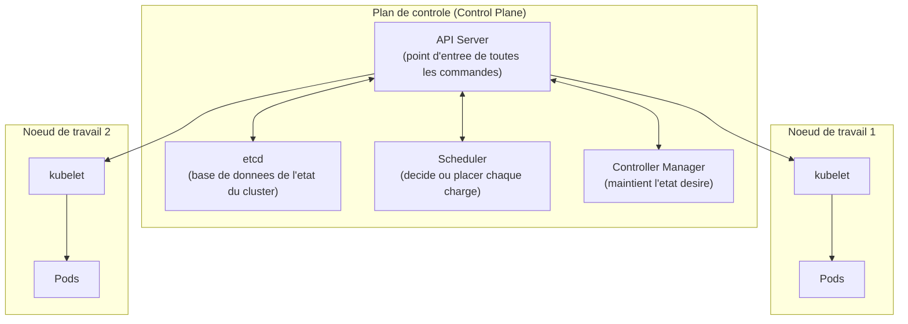

<div class="chapitre-titre-num">CHAPITRE 42</div>

# Introduction à Kubernetes

<div class="encadre objectif">
<span class="encadre-titre">🎯 Objectif du chapitre</span>
Comprendre pourquoi et quand Kubernetes prend le relais de Docker Compose (chapitre 41), et découvrir son vocabulaire fondamental : Pod, Deployment, Service. À la fin de ce chapitre, tu sauras expliquer l'architecture de base d'un cluster Kubernetes, comprendre l'auto-guérison et les mises à jour progressives, et surtout juger honnêtement si Kubernetes est réellement nécessaire pour un contexte donné, plutôt que de l'adopter par pure mode technologique.
</div>

<div class="encadre scenario">
<span class="encadre-titre">🎬 Mise en situation</span>
Le succès du portail client dépasse les attentes : l'entreprise signe un partenariat avec un courtier régional, multipliant le trafic par plusieurs fois du jour au lendemain. Le serveur unique hébergeant l'architecture Docker Compose du chapitre 41 commence à saturer aux heures de pointe. Pire, une mise à jour de routine déployée un mardi après-midi (`docker compose up -d --build`) a provoqué une coupure de service de plusieurs minutes — le temps que l'ancien conteneur s'arrête et que le nouveau démarre, sans aucune continuité de service entre les deux. Le DSI demande une solution qui encaisse la charge sur plusieurs serveurs et qui élimine cette coupure lors des déploiements. C'est exactement ce que Kubernetes résout — à un coût de complexité qu'il faut aussi honnêtement évaluer, l'objet de ce chapitre.
</div>

## 42.1 Les limites de Docker Compose à cette échelle

<div class="encadre retenir">
<span class="encadre-titre">📌 À retenir — rappel direct de la FAQ du chapitre 41</span>
Docker Compose orchestre des conteneurs sur **une seule machine** — il ne peut pas répartir la charge du portail client sur plusieurs serveurs physiques ou virtuels. Il ne propose pas non plus nativement de mise à jour progressive (*rolling update*) sans interruption — exactement les deux limites qui bloquent l'entreprise dans le scénario d'ouverture, et exactement les deux problèmes que Kubernetes est conçu pour résoudre.
</div>

## 42.2 Qu'est-ce que Kubernetes

**Kubernetes** (souvent abrégé K8s) est un système d'**orchestration de conteneurs** à travers plusieurs machines, automatisant le déploiement, la mise à l'échelle et la gestion de la disponibilité des applications conteneurisées.

<div class="encadre astuce">
<span class="encadre-titre">💡 Analogie — le chef d'orchestre d'un ensemble de machines, pas d'une seule</span>
Si Docker orchestre des conteneurs sur une seule machine, Kubernetes est un chef d'orchestre à une échelle supérieure : il coordonne des conteneurs répartis sur un ensemble de machines (appelées **nœuds**, ou *nodes*), décidant automatiquement où placer chaque charge de travail, redémarrant ce qui tombe en panne, et redistribuant le trafic entre plusieurs instances d'une même application — exactement le besoin du scénario d'ouverture, à l'échelle de plusieurs serveurs plutôt que d'un seul.
</div>

## 42.3 L'architecture de base : plan de contrôle et nœuds de travail



<div class="encadre astuce">
<span class="encadre-titre">💡 Explication simplifiée, suffisante pour ce chapitre introductif</span>
Le **plan de contrôle** (*control plane*) prend les décisions : l'API Server reçoit toutes les commandes (via `kubectl`, section 42.8), <code>etcd</code> stocke l'état complet et actuel du cluster (rappel du principe déjà rencontré avec Corosync au chapitre 36 pour Proxmox), le Scheduler décide sur quel nœud placer chaque nouvelle charge de travail, et le Controller Manager travaille en permanence à maintenir l'état réel du cluster identique à l'état désiré déclaré. Chaque **nœud de travail** exécute un <code>kubelet</code> (l'agent qui applique localement les décisions du plan de contrôle) et héberge les Pods eux-mêmes.
</div>

## 42.4 Le Pod : l'unité de base de Kubernetes

<div class="encadre retenir">
<span class="encadre-titre">📌 À retenir</span>
Un **Pod** est la plus petite unité déployable dans Kubernetes — le plus souvent un seul conteneur (rappel du chapitre 39), mais techniquement capable d'en regrouper plusieurs partageant le même réseau et le même stockage, pour des cas d'usage précis (un conteneur principal et un conteneur "side-car" d'assistance, par exemple). Pour l'usage courant, retenir l'équivalence simplifiée "un Pod héberge généralement un conteneur applicatif" suffit largement à ce stade introductif.
</div>

## 42.5 Le Deployment : réplicas et mise à jour progressive

<div class="encadre bonne-pratique">
<span class="encadre-titre">✅ La réponse directe à la coupure du scénario d'ouverture</span>
Un **Deployment** déclare combien de **réplicas** (copies identiques) d'un Pod doivent tourner simultanément, et Kubernetes maintient continuellement ce nombre — si un Pod tombe en panne, un autre est automatiquement recréé pour compenser (section 42.7). Lors d'une mise à jour, un Deployment effectue par défaut une **mise à jour progressive** (*rolling update*) : de nouveaux Pods avec la nouvelle version démarrent progressivement, tandis que les anciens sont retirés un par un, **jamais tous simultanément** — éliminant exactement la coupure de service subie dans le scénario d'ouverture avec `docker compose up -d --build`.
</div>

```yaml
# Exemple simplifie d'un Deployment pour l'application du portail
apiVersion: apps/v1
kind: Deployment
metadata:
  name: portail-app
spec:
  replicas: 3
  selector:
    matchLabels:
      app: portail
  template:
    metadata:
      labels:
        app: portail
    spec:
      containers:
        - name: portail
          image: portail-client:1.0
          ports:
            - containerPort: 3000
```

## 42.6 Le Service : exposer les Pods de façon stable

<div class="encadre astuce">
<span class="encadre-titre">💡 Un problème déjà résolu une fois, au chapitre 40</span>
Les Pods sont par nature éphémères — recréés, remplacés, déplacés entre nœuds, chacun avec une adresse changeante. Un **Service** Kubernetes fournit un point d'accès stable et un nom DNS constant vers un ensemble de Pods correspondant à un label donné, répartissant automatiquement le trafic entre les réplicas disponibles — exactement le même besoin de résolution de noms stable déjà résolu par le réseau Docker au chapitre 40, mais à l'échelle de plusieurs nœuds physiques plutôt que d'un seul hôte.
</div>

## 42.7 L'auto-guérison : Kubernetes redémarre ce qui échoue

<div class="encadre securite">
<span class="encadre-titre">🔒 Sécurité — un principe de haute disponibilité déjà rencontré, à un niveau différent</span>
Rappel direct des chapitres 34-35 (HA VMware/Hyper-V, au niveau de la VM) et du chapitre 13 (Failover Clustering) : Kubernetes applique le même principe de tolérance de panne, mais au niveau applicatif plutôt qu'au niveau de la machine virtuelle ou physique entière. Si un Pod échoue (crash de l'application, healthcheck échoué), Kubernetes le redémarre automatiquement ; si un nœud entier tombe en panne, les Pods qu'il hébergeait sont recréés sur les nœuds restants disponibles — un mécanisme d'auto-guérison continu, sans intervention humaine nécessaire pour ce type d'incident courant.
</div>

## 42.8 `kubectl` : premiers pas

```
# Voir l'etat des noeuds du cluster
kubectl get nodes

# Voir l'etat des Pods en cours d'execution
kubectl get pods

# Voir l'etat des Deployments
kubectl get deployments

# Consulter les journaux d'un Pod precis, exactement le meme
# reflexe de diagnostic que "docker compose logs" (chapitre 41)
kubectl logs nom-du-pod
```

## Le principe le plus important de ce chapitre : Kubernetes n'est pas toujours la bonne réponse

<div class="encadre attention">
<span class="encadre-titre">⚠️ Un coût de complexité réel, à ne jamais sous-estimer</span>
Kubernetes résout des problèmes réels (section 42.1), mais introduit une complexité opérationnelle significative — un plan de contrôle à maintenir, un vocabulaire entièrement nouveau, une courbe d'apprentissage réelle pour l'équipe. Exactement le même principe de décision contextuelle appliqué à chaque choix technologique de ce manuel (chapitres 14, 27, 33, 36) : Kubernetes se justifie pour une application dont la charge, la criticité ou le besoin de haute disponibilité dépasse réellement ce que Docker Compose peut raisonnablement gérer — pas par défaut, et certainement pas "parce que c'est la technologie la plus discutée du moment".
</div>

<div class="encadre memoriser">
<span class="encadre-titre">🧠 À mémoriser — le scénario d'ouverture justifie réellement ce choix</span>
Le scénario d'ouverture de ce chapitre — un trafic qui dépasse la capacité d'un seul serveur, une exigence réelle de continuité de service pendant les déploiements — représente exactement le type de justification concrète qui rend Kubernetes pertinent, par opposition à une adoption anticipée "au cas où", pour une application qui n'aurait jamais réellement dépassé les capacités de Docker Compose.
</div>

## Atelier — Décider si Kubernetes se justifie pour d'autres services du manuel

<div class="encadre exercice">
<span class="encadre-titre">🛠️ Atelier 42 — Appliquer le principe de décision contextuelle</span>

**Objectif** : s'entraîner à juger objectivement si Kubernetes se justifie pour un service donné, plutôt que par réflexe technologique.

**Préparation** : aucune installation nécessaire.

**Étapes détaillées** :

1. Pour chacun des services suivants déjà rencontrés dans ce manuel, juge si une migration vers Kubernetes se justifierait : (a) le portail client après la croissance de trafic du scénario d'ouverture ; (b) le serveur Rocky Linux de gestion documentaire (chapitre 19), à usage interne stable, sans pic de trafic notable ; (c) un environnement de test PostgreSQL recréé plusieurs fois par jour (atelier du chapitre 39).
2. Compare tes réponses à la section "Résultat attendu".

**Résultat attendu** : (a) Kubernetes se justifie clairement — la croissance de trafic et l'exigence de continuité de service pendant les déploiements correspondent exactement aux problèmes qu'il résout. (b) Kubernetes ne se justifie probablement pas pour ce service à usage interne stable, sans besoin de mise à l'échelle ni de déploiements fréquents sans interruption — Docker Compose, voire une installation directe (chapitre 15), resterait suffisant et plus simple à maintenir. (c) Kubernetes serait disproportionné pour un simple environnement de test éphémère — Docker seul (chapitre 39), sans même Compose, suffit largement à ce besoin ponctuel et léger.

**Dépannage** : si tu hésites sur un cas, reviens à la question centrale de la section "Le principe le plus important de ce chapitre" — le besoin dépasse-t-il réellement ce qu'un seul serveur avec Docker Compose peut gérer, ou l'attrait de Kubernetes vient-il principalement de sa popularité plutôt que d'un besoin concret démontré ?
</div>

## Erreurs fréquentes

<div class="encadre attention">
<span class="encadre-titre">⚠️ Erreur n°1 — adopter Kubernetes sans besoin réel démontré</span>
Rappel de la section "Le principe le plus important de ce chapitre" — une des erreurs les plus fréquentes et les plus coûteuses en complexité opérationnelle inutile dans l'industrie, largement documentée.
</div>

<div class="encadre attention">
<span class="encadre-titre">⚠️ Erreur n°2 — confondre Pod et conteneur systématiquement</span>
Rappel de la section 42.4 : bien que souvent équivalents en pratique courante, un Pod est un concept Kubernetes distinct, capable techniquement de regrouper plusieurs conteneurs.
</div>

<div class="encadre attention">
<span class="encadre-titre">⚠️ Erreur n°3 — sous-estimer la courbe d'apprentissage de l'équipe</span>
Kubernetes introduit un vocabulaire et des concepts entièrement nouveaux — une migration réussie nécessite un investissement réel de formation de l'équipe, jamais une simple bascule technique du jour au lendemain sans préparation.
</div>

## Diagnostiquer un Pod qui ne démarre pas

<div class="encadre attention">
<span class="encadre-titre">🩺 Symptôme : un Pod reste en état "CrashLoopBackOff"</span>

- **Diagnostic** : cet état indique que le conteneur du Pod démarre puis s'arrête de façon répétée, exactement le même symptôme déjà rencontré au chapitre 39 pour un conteneur Docker isolé, mais avec le mécanisme de redémarrage automatique de Kubernetes rendant le cycle visible et répété.
- **Comment vérifier** : `kubectl logs nom-du-pod` révèle la sortie du conteneur au moment de son échec — la même démarche de diagnostic que `docker logs` déjà pratiquée au chapitre 39, transposée à Kubernetes.
- **Résolution** : corriger la cause identifiée dans les journaux (configuration manquante, dépendance non disponible, erreur applicative) avant que Kubernetes ne retente automatiquement le démarrage du Pod.
</div>

## En entreprise

- **Bonne pratique répandue** : ne migrer vers Kubernetes qu'après avoir concrètement rencontré les limites de Docker Compose (section 42.1), jamais par anticipation d'un besoin hypothétique non démontré.
- **Bonne pratique répandue** : investir dans la formation de l'équipe avant une migration Kubernetes en production — une adoption précipitée sans compétence suffisante génère souvent plus d'incidents que le problème initial qu'elle était censée résoudre.
- **Erreur classique observée** : des organisations qui migrent vers Kubernetes pour une seule petite application à faible trafic, "pour suivre la tendance du marché", supportant ensuite une complexité opérationnelle disproportionnée par rapport au bénéfice réel obtenu.

## Entretien technique

<div class="encadre exercice">
<span class="encadre-titre">💼 Questions fréquemment posées en entretien</span>

**Q1. "Quand choisirais-tu Kubernetes plutôt que Docker Compose ?"**
Réponse attendue : quand le besoin dépasse réellement ce qu'un seul serveur peut gérer — répartition de charge sur plusieurs machines, exigence de continuité de service pendant les déploiements (rolling update), auto-guérison automatique en cas de panne — jamais par défaut ou par simple popularité de l'outil.

**Q2. "Qu'est-ce qu'un Deployment Kubernetes, et en quoi diffère-t-il d'un simple Pod ?"**
Réponse attendue : un Deployment déclare un nombre désiré de réplicas d'un Pod et maintient continuellement cet état, gérant automatiquement les mises à jour progressives et le remplacement des Pods défaillants — un Pod seul, sans Deployment, ne bénéficie ni de la réplication ni de l'auto-guérison automatique.

**Q3. "Pourquoi un Service Kubernetes est-il nécessaire, alors que les Pods pourraient communiquer directement ?"**
Réponse attendue : les Pods sont éphémères, recréés avec une adresse potentiellement différente à chaque fois — un Service fournit un point d'accès stable et un nom DNS constant vers un ensemble de Pods, indépendant des changements individuels de chaque Pod sous-jacent.
</div>

## Optimisation, sécurité et maintenabilité — les réflexes dès ce chapitre

<div class="encadre securite">
<span class="encadre-titre">🔒 Sécurité</span>
N'adopte Kubernetes qu'avec une équipe suffisamment formée pour le sécuriser correctement — un cluster mal configuré (accès non restreints, secrets mal gérés, un sujet approfondi au chapitre 44) peut introduire des risques de sécurité significatifs, plus complexes à maîtriser qu'une architecture Docker Compose plus simple.
</div>

<div class="encadre bonne-pratique">
<span class="encadre-titre">✅ Maintenabilité</span>
Documente (chapitre 3) explicitement la justification du choix de Kubernetes pour chaque application migrée — le besoin concret démontré (comme la croissance de trafic du scénario d'ouverture), pas une décision implicite ou héritée sans réflexion consciente.
</div>

<div class="encadre performance">
<span class="encadre-titre">🚀 Performance</span>
L'auto-guérison et la répartition de charge de Kubernetes (sections 42.6-42.7) n'ont de valeur réelle que si le cluster dispose de suffisamment de nœuds et de ressources pour absorber la perte d'un nœud — un cluster à un seul nœud n'offre aucune des garanties de haute disponibilité qui justifient normalement l'adoption de Kubernetes.
</div>

## Résumé du chapitre

- Kubernetes orchestre des conteneurs à travers plusieurs machines, résolvant les limites de Docker Compose : répartition de charge multi-serveurs et mises à jour progressives sans interruption.
- L'architecture de base distingue le plan de contrôle (décisions) des nœuds de travail (exécution des Pods).
- Un Pod est la plus petite unité déployable ; un Deployment gère ses réplicas et ses mises à jour progressives ; un Service fournit un point d'accès stable.
- L'auto-guérison redémarre automatiquement un Pod défaillant ou le recrée sur un autre nœud en cas de panne — le même principe de haute disponibilité déjà rencontré en Partie 6, appliqué au niveau applicatif.
- Kubernetes introduit une complexité opérationnelle réelle — son adoption doit toujours répondre à un besoin concret démontré, jamais par défaut ou par simple tendance du marché.

## Quiz

<div class="encadre exercice">
<span class="encadre-titre">📝 QCM (une seule bonne réponse par question)</span>

1. Kubernetes résout principalement les limites de Docker Compose liées à :
   - a) La sécurité des images
   - b) L'orchestration sur une seule machine et l'absence de mise à jour progressive native
   - c) Le coût des licences
   - d) La compatibilité avec Windows

2. Un Deployment Kubernetes sert à :
   - a) Créer un seul conteneur isolé
   - b) Gérer un nombre désiré de réplicas et les mises à jour progressives d'un Pod
   - c) Configurer uniquement le réseau
   - d) Remplacer entièrement un Service

3. La bonne pratique concernant l'adoption de Kubernetes est de :
   - a) L'adopter systématiquement pour toute nouvelle application
   - b) L'adopter uniquement face à un besoin concret démontré, jamais par défaut
   - c) L'éviter dans tous les cas au profit de Docker Compose
   - d) L'utiliser uniquement pour des environnements de test

**Corrigé** : 1-b, 2-b, 3-b.
</div>

<div class="encadre exercice">
<span class="encadre-titre">📝 Vrai ou Faux</span>

1. Un Pod héberge généralement un seul conteneur, bien qu'il puisse techniquement en regrouper plusieurs. — **Vrai**.
2. Docker Compose peut nativement répartir des conteneurs sur plusieurs serveurs physiques distincts. — **Faux** (limité à une seule machine, section 42.1).
3. Un Service Kubernetes fournit un point d'accès stable, indépendant des changements individuels de chaque Pod. — **Vrai**.
4. Kubernetes devrait être adopté par défaut pour toute nouvelle application, quelle que soit sa charge attendue. — **Faux** (uniquement face à un besoin concret démontré).
</div>

<div class="encadre exercice">
<span class="encadre-titre">📝 Questions ouvertes</span>

1. Explique pourquoi la coupure de service du scénario d'ouverture ne se serait pas produite avec un Deployment Kubernetes correctement configuré.
2. Reprends l'atelier de ce chapitre. Explique pourquoi migrer le serveur de gestion documentaire (chapitre 19) vers Kubernetes serait probablement une mauvaise décision, malgré les capacités réelles et impressionnantes de l'outil.

**Corrigé 1** : un Deployment Kubernetes effectue par défaut une mise à jour progressive — de nouveaux Pods avec la nouvelle version démarrent avant que les anciens ne soient retirés, garantissant qu'au moins certains Pods restent disponibles pour servir le trafic à tout moment pendant la transition. La commande `docker compose up -d --build` du scénario d'ouverture, à l'inverse, remplace le conteneur en une seule opération, créant nécessairement une fenêtre sans aucune instance disponible entre l'arrêt de l'ancien conteneur et le démarrage du nouveau.

**Corrigé 2** : ce serveur, à usage interne et sans pic de trafic notable, ne rencontre aucune des limites que Kubernetes est conçu pour résoudre (section 42.1) — ni besoin de répartition de charge sur plusieurs serveurs, ni exigence de continuité de service pendant des déploiements fréquents. Migrer ce service vers Kubernetes ajouterait une complexité opérationnelle réelle (plan de contrôle à maintenir, nouveau vocabulaire à apprendre par l'équipe) sans bénéfice concret correspondant, exactement le piège dénoncé dans la section "Le principe le plus important de ce chapitre" — une adoption technologique motivée par la tendance plutôt que par un besoin réel.
</div>

## Exercices

<div class="encadre exercice">
<span class="encadre-titre">📝 Exercice 42.1</span>

Un Deployment Kubernetes est configuré avec `replicas: 3`. Un nœud du cluster tombe en panne, emportant avec lui un des trois Pods. Explique ce que Kubernetes fait automatiquement, sans intervention humaine.
</div>

**Corrigé :** Le Controller Manager (section 42.3) détecte que l'état réel du cluster (2 Pods actifs) ne correspond plus à l'état désiré déclaré par le Deployment (3 réplicas) — il demande alors au Scheduler de placer un nouveau Pod sur un des nœuds encore disponibles, restaurant automatiquement le nombre de réplicas à 3, sans qu'aucun administrateur n'ait besoin d'intervenir manuellement. C'est exactement le mécanisme d'auto-guérison de la section 42.7, un principe de haute disponibilité appliqué au niveau applicatif plutôt qu'au niveau de la machine virtuelle ou physique entière.

<div class="encadre exercice">
<span class="encadre-titre">📝 Exercice 42.2</span>

Rédige, en 3 à 5 phrases, une recommandation à donner à une petite équipe de deux développeurs qui envisage d'adopter Kubernetes pour une application interne à faible trafic, "pour être prêt si ça grandit un jour".
</div>

**Corrigé (exemple de réponse) :** Je recommanderais de rester sur Docker Compose (chapitre 41) tant que le besoin réel ne dépasse pas ce qu'il peut gérer — anticiper une croissance hypothétique en adoptant une complexité opérationnelle réelle dès maintenant coûte plus cher, en temps de formation et en risque d'erreur de configuration, que le bénéfice incertain d'être "prêt" pour un scénario qui pourrait ne jamais se matérialiser. Si la croissance survient réellement un jour (comme dans le scénario d'ouverture de ce chapitre), la migration de Docker Compose vers Kubernetes reste tout à fait réalisable à ce moment-là, avec une justification concrète et un dimensionnement d'équipe adapté à ce nouveau besoin démontré, plutôt qu'une adoption prématurée et disproportionnée par rapport à la réalité actuelle du projet.

## Checklist de fin de chapitre

<ul class="checklist">
<li>☐ Je comprends les limites de Docker Compose qui justifient l'adoption de Kubernetes.</li>
<li>☐ Je sais expliquer l'architecture de base (plan de contrôle, nœuds de travail).</li>
<li>☐ Je sais distinguer Pod, Deployment et Service.</li>
<li>☐ Je comprends le principe de mise à jour progressive (rolling update) et son bénéfice concret.</li>
<li>☐ Je comprends le principe d'auto-guérison de Kubernetes.</li>
<li>☐ Je sais juger objectivement si Kubernetes se justifie pour un contexte donné, sans céder à l'effet de mode.</li>
</ul>

## FAQ

<dl class="faq">
<dt>Faut-il maîtriser Docker avant d'aborder Kubernetes ?</dt>
<dd>Oui, fortement recommandé — Kubernetes orchestre des conteneurs, sans en réinventer les concepts fondamentaux déjà couverts aux chapitres 39-41 (images, volumes, réseaux). Aborder Kubernetes sans cette base rendrait l'apprentissage significativement plus difficile.</dd>

<dt>Existe-t-il des alternatives plus simples à Kubernetes pour un besoin intermédiaire, entre Docker Compose et Kubernetes complet ?</dt>
<dd>Oui, plusieurs solutions existent (Docker Swarm, des services d'orchestration managés simplifiés par certains fournisseurs cloud) — un compromis à évaluer selon le même principe contextuel de ce chapitre, avant de s'engager directement vers la complexité complète de Kubernetes si un besoin intermédiaire suffit réellement.</dd>

<dt>Combien de nœuds minimum faut-il pour un cluster Kubernetes de production sérieux ?</dt>
<dd>Il n'existe pas de chiffre universel, mais un minimum de trois nœuds est une référence courante pour bénéficier réellement de la tolérance de panne — un cluster à un seul ou deux nœuds n'offre qu'une fraction limitée des garanties de haute disponibilité qui justifient normalement l'adoption de Kubernetes.</dd>

<dt>Kubernetes peut-il tourner sur les hyperviseurs déjà présentés dans ce manuel (VMware, Hyper-V, Proxmox) ?</dt>
<dd>Oui, un cluster Kubernetes s'installe couramment sur des VM hébergées par n'importe lequel de ces hyperviseurs (Partie 6) — Kubernetes orchestre des conteneurs à l'intérieur de machines qui, elles-mêmes, peuvent tout à fait être des VM virtualisées, les deux niveaux d'abstraction se combinant naturellement.</dd>
</dl>

## Références et pour aller plus loin

- Documentation officielle Kubernetes : [https://kubernetes.io/fr/docs/home/](https://kubernetes.io/fr/docs/home/)
- Kubernetes — Concepts de base (Pods, Deployments, Services) : [https://kubernetes.io/fr/docs/concepts/](https://kubernetes.io/fr/docs/concepts/)
- CNCF (Cloud Native Computing Foundation) — ressources sur l'écosystème Kubernetes : [https://www.cncf.io/](https://www.cncf.io/)

*Chapitre suivant : Kubernetes en pratique — déployer réellement l'application du portail sur un cluster, avec pods, services et deployments manipulés concrètement via kubectl.*
