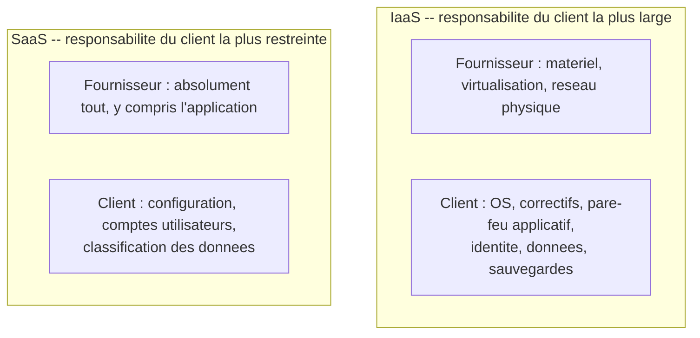

CHAPITRE 45

# Fondamentaux du Cloud

🎯 Objectif du chapitre
Comprendre le cloud computing non pas comme une solution magique à tous les risques déjà couverts dans ce manuel, mais comme une extension du raisonnement PRA/PCA du chapitre 32 : les modèles IaaS/PaaS/SaaS, le modèle de responsabilité partagée, et les critères objectifs pour décider quoi migrer et quoi garder sur site. À la fin de ce chapitre, tu sauras situer chaque brique déjà construite dans ce manuel (RAID, NAS/SAN, virtualisation, Kubernetes) dans son équivalent cloud, et évaluer honnêtement les compromis réels d'une migration.

🎬 Mise en situation
Après l'évacuation forcée du chapitre 32, le DSI se demande si héberger une partie de l'infrastructure critique dans le cloud — géographiquement hors de la trajectoire des cyclones, sur des générateurs et une alimentation bien plus robustes que ce que l'entreprise peut se permettre localement — résoudrait définitivement les problèmes de continuité déjà rencontrés. <em>"Si nos serveurs les plus critiques ne sont plus physiquement à Port-au-Prince, est-ce qu'on n'élimine pas simplement le problème ?"</em> C'est une question légitime, mais qui appelle une réponse nuancée : le cloud déplace certains risques, en réduit d'autres, mais n'élimine jamais la nécessité de la discipline déjà construite tout au long de ce manuel. Ce chapitre pose les bases pour répondre à cette question avec rigueur, plutôt que par enthousiasme.

## 45.1 Le cloud comme extension du raisonnement PRA/PCA

📌 À retenir
Le cloud computing consiste à louer, à la demande et via Internet, des ressources informatiques (calcul, stockage, réseau, services managés) hébergées et maintenues par un fournisseur tiers, plutôt que de posséder et d'exploiter soi-même le matériel physique. Le raisonnement qui justifie de considérer le cloud rejoint directement celui du site de repli du chapitre 31 : un site chaud éloigné réduit certains risques géographiques (un cyclone localisé, une coupure de courant régionale) — le cloud pousse cette logique plus loin, en externalisant entièrement la responsabilité de l'infrastructure physique à un fournisseur disposant d'une échelle et d'une redondance qu'une organisation de la taille de cette entreprise ne peut pas reproduire seule.

## 45.2 IaaS, PaaS, SaaS : trois niveaux d'abstraction, déjà rencontrés sans les nommer

| Modèle | Ce que le fournisseur gère | Ce que le client gère | Exemple déjà rencontré dans ce manuel |
|---|---|---|---|
| **IaaS** (*Infrastructure as a Service*) | Matériel physique, virtualisation, réseau | OS, mises à jour, applications, données | Une VM louée équivalente à celles du chapitre 33 |
| **PaaS** (*Platform as a Service*) | Infrastructure + système d'exploitation + runtime | Uniquement le code applicatif et les données | Un service de base de données managée (rappel PostgreSQL, chapitre 15) |
| **SaaS** (*Software as a Service*) | Absolument tout, y compris l'application elle-même | Uniquement la configuration et les données utilisateur | **Microsoft 365, déjà rencontré au chapitre 8** |

💡 Un exemple déjà vécu dans ce manuel, sans le nommer
Le déploiement hybride Entra ID du chapitre 8 était déjà, sans le nommer explicitement, une adoption de **SaaS** — Microsoft gère absolument tout de Microsoft 365 (serveurs, application, mises à jour), l'entreprise ne gérant que la configuration et les comptes utilisateurs. Ce chapitre donne simplement le vocabulaire pour nommer précisément ce qui a déjà été pratiqué.

## 45.3 Le modèle de responsabilité partagée

🔒 Sécurité — le piège le plus fréquent et le plus coûteux du cloud
Une confusion extrêmement répandue, et responsable de nombreuses failles de sécurité réelles documentées dans l'industrie : croire que confier une charge de travail au cloud transfère **automatiquement** l'entière responsabilité de sa sécurité au fournisseur. En réalité, chaque modèle de service définit une ligne de partage précise — un fournisseur IaaS sécurise le matériel physique et la virtualisation sous-jacente, mais **jamais** la configuration du système d'exploitation, les correctifs applicatifs, ni les permissions d'accès aux données, qui restent la responsabilité du client, exactement les mêmes disciplines déjà construites tout au long de ce manuel (chapitres 12, 18, 25, 26).

🧠 À mémoriser — le client reste TOUJOURS responsable de l'identité et des données
Quel que soit le modèle de service choisi, une responsabilité ne se délègue jamais entièrement au fournisseur cloud : la gestion des identités et des accès (rappel direct des Parties 4, notamment MFA et Zero Trust), et la classification/protection des données elles-mêmes. Un fournisseur cloud, aussi robuste soit son infrastructure physique, ne protège jamais un compte compromis par un mot de passe faible ou l'absence de MFA — exactement le même principe déjà établi au chapitre 25.

## 45.4 Ce que le cloud ne résout pas

⚠️ Répondre honnêtement à la question du DSI
Le cloud réduit certains risques physiques (un cyclone localisé n'affecte pas un centre de données situé sur un autre continent), mais n'élimine ni le besoin de sauvegardes réellement testées (chapitre 30, un compte cloud peut aussi être victime d'une suppression accidentelle ou d'un rançongiciel), ni le besoin de sécuriser l'identité et l'accès (chapitres 22-26), ni le besoin de documenter et de tester un plan de reprise (chapitre 31) — un fournisseur cloud en panne reste un scénario possible, statistiquement rare mais déjà survenu chez les plus grands fournisseurs mondiaux. Le cloud déplace et réduit certains risques ; il ne dispense jamais de la discipline déjà construite tout au long de ce manuel.

⚠️ Une nouvelle dépendance : la connectivité Internet elle-même
Rappel direct du contexte déjà établi depuis le chapitre 1 : une infrastructure entièrement basée dans le cloud dépend entièrement de la qualité de la connexion Internet locale pour y accéder — dans un contexte où les coupures réseau restent une réalité opérationnelle fréquente (chapitres 6, 23), une dépendance totale au cloud sans aucune capacité de fonctionnement local dégradé peut, paradoxalement, introduire un nouveau risque plutôt que de le supprimer.

## 45.5 Cloud public, privé, hybride : un aperçu avant le chapitre 49

💡 Une classification à retenir brièvement, approfondie plus loin
Le **cloud public** (AWS, Azure, GCP — chapitres 46-48) mutualise l'infrastructure entre de nombreux clients. Le **cloud privé** reste dédié à une seule organisation (parfois hébergé sur ses propres serveurs virtualisés, chapitres 33-38). Le **cloud hybride** combine les deux — exactement le type d'architecture qu'une réponse mesurée à la question du DSI impliquerait probablement, un sujet développé en détail au chapitre 49.

## 45.6 Les grandes catégories de services cloud : traduire ce que ce manuel a déjà construit

| Brique déjà construite dans ce manuel | Équivalent cloud managé |
|---|---|
| RAID matériel (chapitre 27) | Stockage géré par le fournisseur, redondance transparente |
| NAS/SAN (chapitres 28-29) | Service de stockage de fichiers ou de blocs managé |
| VM sur hyperviseur (Partie 6) | Instance de calcul IaaS |
| Cluster Kubernetes (Partie 7) | Service Kubernetes managé (le fournisseur gère le plan de contrôle) |
| Sauvegarde vers un support distinct (chapitre 30) | Stockage d'objets avec réplication géographique |

🚀 Performance — un service Kubernetes managé allège une charge réelle
Rappel direct du chapitre 42 : maintenir soi-même le plan de contrôle d'un cluster Kubernetes représente une charge opérationnelle réelle. Un service Kubernetes managé (EKS chez AWS, AKS chez Azure, GKE chez Google Cloud — chapitres 46-48) délègue cette responsabilité précise au fournisseur, l'entreprise ne gérant plus que les nœuds de travail et les charges applicatives elles-mêmes — un exemple concret de la ligne de partage de responsabilité de la section 45.3.

## 45.7 Une décision pragmatique : quoi migrer, quoi garder

✅ Le même cadre de décision contextuelle que tout au long de ce manuel
Exactement le même principe déjà appliqué au choix de distribution (chapitre 14), à Docker (chapitre 39) et à Kubernetes (chapitre 42) : la question n'est jamais "faut-il migrer vers le cloud ?" dans l'absolu, mais "quel système bénéficierait réellement de cette migration, et à quel coût ?" Un système à faible criticité et à faible trafic (comme le serveur de gestion documentaire interne du chapitre 19) tire peu de bénéfice d'une migration coûteuse ; un système à forte exigence de continuité géographique (comme le portail client, déjà exposé publiquement, chapitre 24) est un bien meilleur candidat.

## Atelier — Répondre à la question du DSI avec un cadre de décision

🛠️ Atelier 45 — Identifier de bons candidats à la migration cloud

**Objectif** : appliquer le cadre de décision de la section 45.7 à des systèmes déjà rencontrés dans ce manuel.

**Préparation** : aucune installation nécessaire.

**Étapes détaillées** :

1. Pour chacun des systèmes suivants, juge si une migration cloud se justifie, en tenant compte de la criticité, de l'exposition publique et du besoin de continuité géographique : (a) le portail client (chapitre 24) ; (b) le serveur de gestion documentaire interne Rocky Linux (chapitre 19) ; (c) l'Active Directory local (chapitre 5).
2. Pour chaque cas, précise si un modèle IaaS, PaaS ou SaaS serait le plus adapté.
3. Compare tes réponses à la section "Résultat attendu".

**Résultat attendu** : (a) le portail client est un excellent candidat — exposition publique, besoin de continuité géographique face aux cyclones, trafic variable bénéficiant de l'élasticité déjà présentée aux chapitres 42-44 ; un modèle PaaS ou un service Kubernetes managé (section 45.6) réduirait la charge opérationnelle. (b) le serveur de gestion documentaire interne, à faible trafic et sans exposition publique, tire peu de bénéfice d'une migration coûteuse — rester sur site reste défendable, sauf besoin spécifique non couvert par l'infrastructure actuelle. (c) Active Directory local peut rester on-premise, mais l'intégration hybride déjà construite au chapitre 8 (Entra ID) montre qu'un compromis intermédiaire existe déjà, sans migration complète nécessaire.

**Dépannage** : si tu hésites sur un cas, reviens à la question centrale de la section 45.7 — le bénéfice réel démontré (pas hypothétique) dépasse-t-il le coût et la complexité d'une migration ?

## Erreurs fréquentes

⚠️ Erreur n°1 — croire que le cloud élimine tout risque
Rappel de la section 45.4 : le cloud déplace et réduit certains risques, mais ne dispense jamais des disciplines déjà construites tout au long de ce manuel (sauvegardes, identité, PRA/PCA).

⚠️ Erreur n°2 — ignorer le modèle de responsabilité partagée
Rappel de la section 45.3 : une des causes les plus fréquentes de failles de sécurité cloud documentées dans l'industrie, provenant d'une confusion sur qui est réellement responsable de quoi.

⚠️ Erreur n°3 — migrer sans analyse de bénéfice réel
Rappel de la section 45.7 : le même piège déjà dénoncé pour Kubernetes au chapitre 42 — une adoption motivée par la tendance plutôt que par un besoin concret démontré.

## Diagnostiquer une confusion de responsabilité

🩺 Situation : "Une donnée sensible a été exposée dans le cloud — le fournisseur est-il responsable ?"

- **Diagnostic** : vérifier précisément à quel niveau de la ligne de partage (section 45.3) l'exposition s'est produite — une mauvaise configuration de permissions d'accès (responsabilité du client, quel que soit le modèle de service) diffère fondamentalement d'une faille dans l'infrastructure physique du fournisseur (responsabilité du fournisseur).
- **Comment vérifier** : consulter la documentation du modèle de responsabilité partagée du fournisseur concerné, qui précise explicitement cette ligne de partage pour chaque service utilisé.
- **Résolution** : dans la grande majorité des incidents cloud documentés dans l'industrie, la cause relève d'une erreur de configuration côté client (permissions trop larges, absence de MFA) — un audit des pratiques déjà établies en Partie 4 de ce manuel reste le premier réflexe, avant de chercher une faille côté fournisseur.

## En entreprise

- **Bonne pratique répandue** : documenter (chapitre 3) précisément la ligne de responsabilité partagée pour chaque service cloud adopté, évitant toute ambiguïté sur qui doit appliquer un correctif, configurer une sauvegarde, ou sécuriser un accès.
- **Bonne pratique répandue** : conserver localement une capacité de fonctionnement dégradé pour les fonctions les plus critiques, plutôt qu'une dépendance totale et sans alternative au cloud, particulièrement pertinent dans un contexte de connectivité Internet parfois instable.
- **Erreur classique observée** : une migration cloud entreprise principalement par mode ou pression concurrentielle, sans analyse de coût réelle ni cadre de décision contextuelle, aboutissant à des coûts imprévus largement supérieurs aux estimations initiales — un sujet approfondi au chapitre 50 (FinOps).

## Entretien technique

💼 Questions fréquemment posées en entretien

**Q1. "Quelle est la différence entre IaaS, PaaS et SaaS ?"**
Réponse attendue : IaaS fournit l'infrastructure de base (calcul, stockage, réseau), le client gérant l'OS et l'application ; PaaS ajoute la gestion du système d'exploitation et du runtime, le client ne gérant que le code et les données ; SaaS fournit l'application complète, le client ne gérant que sa configuration et ses données utilisateur.

**Q2. "Qu'est-ce que le modèle de responsabilité partagée, et pourquoi est-il si souvent mal compris ?"**
Réponse attendue : il définit précisément qui, du fournisseur ou du client, est responsable de chaque couche de sécurité selon le modèle de service utilisé — souvent mal compris car les clients supposent à tort qu'utiliser le cloud délègue automatiquement toute la sécurité au fournisseur, alors que l'identité, les accès et la configuration restent toujours de la responsabilité du client.

**Q3. "Le cloud élimine-t-il le besoin d'un PRA ou d'une stratégie de sauvegarde ?"**
Réponse attendue : non — un compte cloud reste vulnérable à une suppression accidentelle, un rançongiciel, ou une mauvaise configuration côté client ; les mêmes disciplines de sauvegarde testée (chapitre 30) et de plan de reprise documenté (chapitre 31) restent nécessaires, simplement appliquées à un environnement différent.

## Optimisation, sécurité et maintenabilité — les réflexes dès ce chapitre

🔒 Sécurité
Ne suppose jamais qu'un service cloud élimine le besoin de MFA, de moindre privilège ou de sauvegarde testée — ces disciplines, déjà construites tout au long de ce manuel, s'appliquent avec la même rigueur dans le cloud que sur site.

✅ Maintenabilité
Documente (chapitre 3) la justification de chaque décision de migration ou de maintien sur site, avec le cadre de décision de la section 45.7 explicitement appliqué — une décision d'architecture cloud non documentée devient, comme toute autre, une question sans réponse claire des années plus tard.

🚀 Performance
Un service managé (section 45.6) réduit la charge opérationnelle de l'équipe, mais à un coût financier direct — un compromis à évaluer selon le temps réel que l'équipe économiserait, approfondi au chapitre 50 (FinOps).

## Résumé du chapitre

- Le cloud computing étend le raisonnement du site de repli (chapitre 31) en externalisant l'infrastructure physique à un fournisseur tiers.
- IaaS, PaaS et SaaS définissent trois niveaux d'abstraction, avec une part croissante de responsabilité déléguée au fournisseur.
- Le modèle de responsabilité partagée précise que l'identité, les accès et les données restent toujours de la responsabilité du client, quel que soit le modèle de service.
- Le cloud réduit certains risques physiques mais ne dispense jamais des disciplines déjà construites (sauvegardes, identité, PRA/PCA) ; il introduit aussi une nouvelle dépendance à la connectivité Internet.
- La décision de migrer doit toujours s'appuyer sur un cadre de décision contextuelle, jamais par tendance ou pression concurrentielle.

## Quiz

📝 QCM (une seule bonne réponse par question)

1. Dans le modèle SaaS, le client gère principalement :
   - a) Le matériel physique
   - b) La configuration et les données utilisateur
   - c) Le système d'exploitation
   - d) Le réseau physique du centre de données

2. Le modèle de responsabilité partagée précise que :
   - a) Le fournisseur cloud est toujours entièrement responsable de la sécurité
   - b) L'identité et les accès restent toujours de la responsabilité du client
   - c) Le client n'a jamais de responsabilité en IaaS
   - d) Seul le SaaS implique une responsabilité du client

3. Le cloud computing :
   - a) Élimine tout besoin de sauvegarde et de PRA
   - b) Réduit certains risques physiques sans éliminer le besoin des disciplines déjà établies dans ce manuel
   - c) Garantit une disponibilité de 100% sans exception
   - d) Ne dépend jamais de la connectivité Internet

**Corrigé** : 1-b, 2-b, 3-b.

📝 Vrai ou Faux

1. Un service Kubernetes managé délègue la gestion du plan de contrôle au fournisseur cloud. — **Vrai**.
2. Migrer vers le cloud devrait toujours être une priorité par défaut pour tout système, quelle que soit sa criticité. — **Faux** (une décision contextuelle, section 45.7).
3. L'identité et les accès restent toujours de la responsabilité du client, quel que soit le modèle de service cloud. — **Vrai**.
4. Une infrastructure entièrement cloud élimine toute dépendance à la connectivité Internet locale. — **Faux** (elle en crée une nouvelle dépendance, section 45.4).

📝 Questions ouvertes

1. Explique pourquoi la question du DSI dans le scénario d'ouverture appelle une réponse nuancée plutôt qu'un simple "oui" ou "non".
2. Reprends le tableau de la section 45.6. Explique pourquoi comprendre les fondations techniques (RAID, NAS/SAN, virtualisation, Kubernetes) déjà construites dans ce manuel facilite la compréhension de leurs équivalents cloud managés.

**Corrigé 1** : le cloud réduit effectivement certains risques géographiques spécifiques (un cyclone localisé, une coupure de courant régionale) mais introduit de nouveaux compromis (dépendance à la connectivité Internet, coût récurrent, nécessité de toujours appliquer les disciplines de sécurité et de sauvegarde déjà établies) — répondre simplement "oui, ça résout le problème" ignorerait ces compromis réels, tandis que répondre "non, ça ne change rien" ignorerait les bénéfices réels de réduction de risque géographique. La réponse nuancée reconnaît les deux dimensions.

**Corrigé 2** : chaque service cloud managé n'est pas une technologie magique inventée par le fournisseur, mais une implémentation du même concept déjà appris dans ce manuel, opérée par quelqu'un d'autre — un stockage géré cloud reste fondamentalement basé sur les mêmes principes de redondance déjà expliqués pour le RAID (chapitre 27), un service Kubernetes managé reste le même Kubernetes déjà pratiqué aux chapitres 42-44, simplement avec le plan de contrôle opéré par le fournisseur. Cette compréhension préalable permet de poser les bonnes questions à un fournisseur cloud (quel niveau de redondance, quelle garantie de durabilité) plutôt que d'accepter aveuglément un service dont on ne comprend pas les fondations.

## Exercices

📝 Exercice 45.1

Une entreprise migre sa base de données vers un service PaaS managé, puis subit une perte de données suite à une erreur humaine (une commande de suppression accidentelle exécutée par un employé). Explique, selon le modèle de responsabilité partagée, si le fournisseur cloud est responsable de cette perte.

**Corrigé :** Même en PaaS, où le fournisseur gère l'infrastructure, le système d'exploitation et le runtime de la base de données, les **données elles-mêmes et leur protection** (via des sauvegardes correctement configurées et testées, chapitre 30) restent de la responsabilité du client, selon le principe de la section 45.3. Le fournisseur n'est donc pas responsable de cette perte spécifique, causée par une action humaine côté client — la responsabilité de l'entreprise est d'avoir configuré une stratégie de sauvegarde adaptée pour ce service PaaS, exactement la même discipline déjà établie pour les systèmes on-premise, indépendamment du fait que l'infrastructure sous-jacente soit gérée par un tiers.

📝 Exercice 45.2

Rédige, en 3 à 5 phrases, la réponse complète que tu donnerais au DSI du scénario d'ouverture, en synthétisant les bénéfices réels et les limites du cloud pour la continuité d'activité.

**Corrigé (exemple de réponse) :** Héberger les systèmes les plus critiques dans le cloud réduirait effectivement l'exposition aux risques géographiques locaux comme les cyclones, en s'appuyant sur l'infrastructure et la redondance d'un grand fournisseur plutôt que sur nos propres moyens limités. Cela ne remplace cependant pas le besoin de sauvegardes testées, d'une gestion rigoureuse de l'identité et des accès, ni d'un plan de reprise documenté — ces disciplines restent entièrement de notre responsabilité selon le modèle de responsabilité partagée, quel que soit le fournisseur choisi. Je recommanderais une approche progressive et ciblée, migrant en priorité le portail client (déjà exposé publiquement) plutôt qu'une migration complète et immédiate de toute l'infrastructure, en évaluant le coût réel face au bénéfice concret pour chaque système.

## Checklist de fin de chapitre

<ul class="checklist">
<li>☐ Je sais distinguer IaaS, PaaS et SaaS, avec un exemple concret pour chacun.</li>
<li>☐ Je comprends le modèle de responsabilité partagée et pourquoi l'identité/les données restent toujours de la responsabilité du client.</li>
<li>☐ Je sais expliquer ce que le cloud résout et ce qu'il ne résout pas en matière de continuité d'activité.</li>
<li>☐ Je sais situer les briques déjà construites dans ce manuel (RAID, NAS/SAN, virtualisation, Kubernetes) dans leurs équivalents cloud managés.</li>
<li>☐ Je sais appliquer un cadre de décision contextuelle pour juger si une migration cloud se justifie pour un système donné.</li>
</ul>

## FAQ

<dl class="faq">
<dt>Le cloud est-il toujours plus cher que l'infrastructure sur site ?</dt>
<dd>Pas nécessairement — cela dépend fortement du profil d'usage (charge constante vs variable), un sujet précisément couvert au chapitre 50 (FinOps). Une charge très variable peut bénéficier économiquement du modèle à la demande du cloud ; une charge stable et prévisible peut rester plus économique sur du matériel possédé, amorti sur plusieurs années.</dd>

<dt>Une PME haïtienne peut-elle réalistement adopter le cloud, malgré les défis de connectivité déjà évoqués dans ce manuel ?</dt>
<dd>Oui, mais avec une approche hybride réfléchie plutôt qu'une migration totale — conserver une capacité locale de fonctionnement dégradé pour les fonctions les plus critiques, tout en tirant parti du cloud pour les bénéfices de continuité géographique qu'il offre réellement, un compromis approfondi au chapitre 49.</dd>

<dt>Faut-il choisir un seul fournisseur cloud, ou en combiner plusieurs ?</dt>
<dd>Les deux approches existent et ont leurs propres compromis (simplicité opérationnelle contre réduction de la dépendance à un seul fournisseur) — un sujet développé en détail au chapitre 49 sur les stratégies hybrides et multi-cloud.</dd>

<dt>Le cloud est-il plus sécurisé que l'infrastructure sur site par défaut ?</dt>
<dd>Ni plus ni moins par défaut — un grand fournisseur cloud dispose généralement de ressources de sécurité physique et d'expertise que peu d'organisations peuvent égaler seules, mais cet avantage ne compense jamais une mauvaise configuration côté client (section 45.3), la cause la plus fréquente d'incidents de sécurité cloud documentés dans l'industrie.</dd>
</dl>

## Références et pour aller plus loin

- NIST Special Publication 800-145 — définition officielle du cloud computing : [https://csrc.nist.gov/pubs/sp/800/145/final](https://csrc.nist.gov/pubs/sp/800/145/final)
- AWS — Modèle de responsabilité partagée (exemple documenté par un fournisseur majeur) : [https://aws.amazon.com/fr/compliance/shared-responsibility-model/](https://aws.amazon.com/fr/compliance/shared-responsibility-model/)
- CISA — recommandations de sécurité pour les environnements cloud : [https://www.cisa.gov](https://www.cisa.gov)

*Chapitre suivant : AWS — architecture et services essentiels du fournisseur cloud le plus utilisé au monde, pour rendre concrets les concepts de ce chapitre.*
