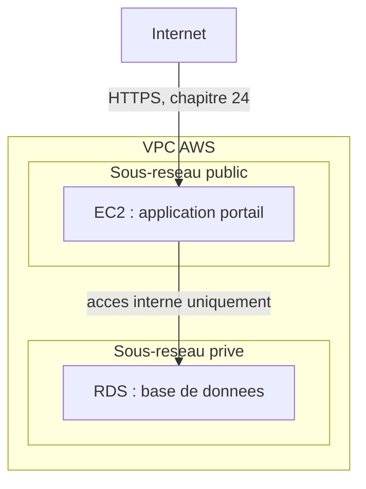

<div class="chapitre-titre-num">CHAPITRE 46</div>

# AWS : architecture et services essentiels

<div class="encadre objectif">
<span class="encadre-titre">🎯 Objectif du chapitre</span>
Rendre concrets les concepts du chapitre 45 en découvrant les services essentiels d'AWS (Amazon Web Services), le fournisseur cloud le plus répandu au monde. À la fin de ce chapitre, tu sauras situer EC2, S3, VPC, IAM et RDS par rapport aux briques déjà construites dans ce manuel, et concevoir une première architecture AWS pour le portail client, en évitant l'erreur de sécurité la plus documentée et la plus coûteuse de la plateforme.
</div>

<div class="encadre scenario">
<span class="encadre-titre">🎬 Mise en situation</span>
Suite à la réponse nuancée du chapitre 45, le DSI valide un projet pilote : migrer le portail client vers AWS, le fournisseur le plus répandu et le mieux documenté, avant d'envisager une stratégie plus large. Il demande une esquisse d'architecture concrète — pas seulement des concepts abstraits. Ce chapitre construit cette architecture pièce par pièce, en s'appuyant systématiquement sur ce qui a déjà été appris.
</div>

## 46.1 Pourquoi commencer par AWS

<div class="encadre astuce">
<span class="encadre-titre">💡 Le même raisonnement pragmatique qu'au chapitre 14</span>
Rappel direct du cadre de décision du choix de distribution (chapitre 14) : AWS n'est pas objectivement "meilleur" qu'Azure ou GCP (chapitres 47-48), mais son ancienneté, sa part de marché dominante et sa documentation abondante en font un point de départ pragmatique pour une équipe qui découvre le cloud — exactement le même raisonnement qui avait orienté vers Ubuntu Server LTS pour le portail au chapitre 14, plutôt qu'une supériorité technique absolue.
</div>

## 46.2 Régions et zones de disponibilité : la réponse concrète au risque cyclone

<div class="encadre retenir">
<span class="encadre-titre">📌 À retenir</span>
Une **région** AWS est un emplacement géographique distinct (par exemple, la région US East, historiquement proche et pertinente pour une entreprise haïtienne). Chaque région contient plusieurs **zones de disponibilité** (*Availability Zones*, AZ) — des centres de données physiquement séparés au sein de la même région, avec leur propre alimentation électrique et connectivité réseau. Répartir une application sur plusieurs AZ répond directement au principe du site de repli déjà établi au chapitre 31, à une échelle qu'une seule entreprise ne pourrait jamais reproduire elle-même.
</div>

<div class="encadre securite">
<span class="encadre-titre">🔒 Sécurité — la réponse directe au scénario d'ouverture du chapitre 45</span>
En choisissant une région suffisamment éloignée de la trajectoire cyclonique habituelle, et en répartissant les ressources critiques sur plusieurs zones de disponibilité au sein de cette région, l'entreprise répond concrètement à la préoccupation du DSI au chapitre 45 — sans pour autant se dispenser des disciplines de sauvegarde et de PRA déjà établies (rappel direct de la section 45.4).
</div>

## 46.3 EC2 : l'équivalent IaaS d'une VM déjà connue

<div class="encadre astuce">
<span class="encadre-titre">💡 Rien de fondamentalement nouveau, un fournisseur différent</span>
**EC2** (*Elastic Compute Cloud*) loue des instances de calcul — l'équivalent direct d'une VM déjà créée manuellement sur VMware, Hyper-V ou Proxmox (Partie 6), simplement hébergée sur l'infrastructure d'AWS plutôt que sur du matériel possédé par l'entreprise. Le choix de distribution Linux (chapitre 14), la gestion des paquets (chapitre 15), systemd (chapitre 16) — tout ce qui a été appris sur l'administration Linux s'applique **sans modification** à une instance EC2 une fois provisionnée.
</div>

## 46.4 VPC : le réseau virtuel, rappel direct de la segmentation

<div class="encadre bonne-pratique">
<span class="encadre-titre">✅ Le principe du bastion, appliqué au cloud</span>
Un **VPC** (*Virtual Private Cloud*) est un réseau virtuel isolé au sein d'AWS, avec des sous-réseaux publics et privés — exactement le même principe déjà établi pour le bastion du chapitre 4 : les ressources sensibles (comme une base de données) résident dans un sous-réseau **privé**, sans exposition directe à Internet, accessibles uniquement depuis les ressources applicatives du sous-réseau public via des règles réseau strictement définies.
</div>



<div class="encadre astuce">
<span class="encadre-titre">💡 Un écho direct du réseau Docker du chapitre 40</span>
Cette architecture rappelle directement le réseau Docker dédié du chapitre 40, où l'application et sa base de données communiquaient sur un réseau isolé, sans exposition directe de la base de données — le même principe de segmentation, appliqué ici au niveau du réseau virtuel du fournisseur cloud plutôt qu'à un seul hôte Docker.
</div>

## 46.5 S3 : stockage d'objets, différent du NAS déjà connu

<div class="encadre retenir">
<span class="encadre-titre">📌 À retenir — une distinction technique importante</span>
**S3** (*Simple Storage Service*) est un stockage **d'objets**, différent du stockage de fichiers (NAS, chapitre 28) ou de blocs (SAN, chapitre 29) déjà rencontrés. Le stockage d'objets ne s'organise pas en dossiers hiérarchiques traditionnels mais en une structure plate de "buckets" contenant des objets identifiés par une clé unique — un modèle particulièrement adapté au stockage de documents, images ou sauvegardes (rappel direct du chapitre 30), moins adapté à un système de fichiers partagé nécessitant un accès concurrent en écriture comme un NAS traditionnel.
</div>

<div class="encadre attention">
<span class="encadre-titre">⚠️ L'erreur de sécurité la plus documentée et la plus coûteuse d'AWS</span>
Un **bucket S3 configuré par erreur en accès public** est l'une des causes les plus fréquentes de fuites de données massives documentées dans l'industrie du cloud — des données sensibles, censées rester privées, devenant accessibles à quiconque connaît ou devine l'adresse du bucket. Cette erreur illustre exactement le piège du modèle de responsabilité partagée déjà dénoncé au chapitre 45 : AWS sécurise l'infrastructure physique du service S3, mais **jamais** la configuration d'accès du bucket lui-même, qui reste entièrement de la responsabilité du client.
</div>

## 46.6 IAM : identité et permissions, rappel direct du moindre privilège

<div class="encadre securite">
<span class="encadre-titre">🔒 Sécurité — ne jamais utiliser le compte root AWS au quotidien</span>
**IAM** (*Identity and Access Management*) gère les identités et les permissions au sein d'un compte AWS. Rappel direct du chapitre 18 (sudo granulaire plutôt que <code>ALL=(ALL) NOPASSWD: ALL</code>) et du chapitre 44 (RBAC Kubernetes plutôt que <code>cluster-admin</code> par défaut) : le compte "root" d'un compte AWS dispose d'un accès total et ne devrait **jamais** être utilisé pour les opérations quotidiennes. Des utilisateurs IAM nominatifs, avec des permissions strictement limitées à leur besoin réel, doivent être créés dès la mise en place du compte — exactement le même principe du moindre privilège appliqué sans exception depuis le chapitre 1.
</div>

```
# Exemple simplifie d'une politique IAM restreinte : lecture seule
# sur un bucket S3 precis, rien de plus
{
  "Version": "2012-10-17",
  "Statement": [
    {
      "Effect": "Allow",
      "Action": ["s3:GetObject"],
      "Resource": "arn:aws:s3:::portail-documents/*"
    }
  ]
}
```

## 46.7 RDS : base de données managée, un exemple concret de PaaS

<div class="encadre astuce">
<span class="encadre-titre">💡 L'exemple PaaS du chapitre 45, rendu concret</span>
**RDS** (*Relational Database Service*) gère une base de données relationnelle (PostgreSQL, rappel du chapitre 15) sans que l'entreprise n'ait à administrer elle-même le système d'exploitation ou les correctifs du moteur de base de données — exactement l'exemple PaaS du tableau de la section 45.2, rendu concret. RDS gère aussi automatiquement les sauvegardes et la réplication entre zones de disponibilité, un service qui rejoint directement le principe de sauvegarde testée déjà établi au chapitre 30, bien qu'une vérification indépendante reste toujours recommandée.
</div>

## 46.8 Un aperçu de la question du coût, développée au chapitre 50

<div class="encadre performance">
<span class="encadre-titre">🚀 Performance — une élasticité qui a un prix direct</span>
Contrairement à un serveur physique déjà amorti (Partie 6), chaque ressource AWS a un coût continu, facturé selon l'usage réel — l'élasticité déjà présentée pour Kubernetes (chapitres 42-44) a ici un prix directement mesurable en temps réel, un sujet approfondi au chapitre 50 (FinOps), essentiel avant tout engagement financier significatif.
</div>

## Atelier — Esquisser l'architecture AWS du portail

<div class="encadre exercice">
<span class="encadre-titre">🛠️ Atelier 46 — Répondre à la demande du DSI</span>

**Objectif** : assembler les services de ce chapitre en une architecture cohérente pour le portail client.

**Préparation** : aucune installation nécessaire — cet atelier est un exercice de conception.

**Étapes détaillées** :

1. Dessine ou décris une architecture combinant VPC, EC2, RDS et S3 pour le portail, en respectant le principe de segmentation de la section 46.4.
2. Précise quelle ressource se trouve dans le sous-réseau public, laquelle dans le sous-réseau privé.
3. Propose une politique IAM minimale pour un développeur ayant besoin de déployer l'application, sans accès administrateur complet.
4. Compare ta démarche à la section "Résultat attendu".

**Résultat attendu** : l'instance EC2 hébergeant l'application se trouve dans le sous-réseau public (accessible via HTTPS, rappel du chapitre 24), tandis que RDS reste dans le sous-réseau privé, accessible uniquement depuis EC2 (section 46.4). S3 stocke les documents téléversés par les clients, avec un accès strictement contrôlé (jamais public, section 46.5). La politique IAM du développeur se limite aux actions nécessaires au déploiement (par exemple, mise à jour de l'instance EC2 et lecture/écriture sur le bucket S3 concerné), jamais un accès administrateur complet au compte AWS — exactement le principe déjà illustré par l'exemple de politique de la section 46.6.

**Dépannage** : si tu hésites sur le placement d'une ressource, reviens à la question centrale déjà posée au chapitre 4 pour le bastion — cette ressource a-t-elle réellement besoin d'être exposée directement à Internet, ou seulement accessible depuis une autre ressource déjà exposée ?
</div>

## Erreurs fréquentes

<div class="encadre attention">
<span class="encadre-titre">⚠️ Erreur n°1 — utiliser le compte root AWS pour les opérations quotidiennes</span>
Rappel de la section 46.6 : exactement l'équivalent AWS de `ALL=(ALL) NOPASSWD: ALL` déjà dénoncé au chapitre 18, ou de `cluster-admin` par défaut déjà dénoncé au chapitre 44.
</div>

<div class="encadre attention">
<span class="encadre-titre">⚠️ Erreur n°2 — configurer un bucket S3 en accès public par erreur</span>
Rappel de la section 46.5 : l'une des causes les plus documentées de fuites de données massives dans l'industrie du cloud — une vérification systématique de la configuration d'accès de chaque bucket est indispensable.
</div>

<div class="encadre attention">
<span class="encadre-titre">⚠️ Erreur n°3 — placer une base de données dans un sous-réseau public par simplicité</span>
Rappel de la section 46.4 : exactement le même risque déjà dénoncé pour un serveur RDP exposé directement sur Internet au chapitre 4 — aucune ressource sensible ne devrait être directement accessible sans passer par une couche intermédiaire contrôlée.
</div>

## Diagnostiquer un bucket S3 exposé publiquement

<div class="encadre attention">
<span class="encadre-titre">🩺 Situation : "Comment vérifier qu'aucun bucket S3 n'est accidentellement exposé publiquement ?"</span>

- **Diagnostic** : AWS propose un outil natif, **S3 Block Public Access**, qui peut être activé au niveau du compte entier pour empêcher structurellement toute exposition publique accidentelle, même en cas d'erreur de configuration individuelle sur un bucket précis.
- **Comment vérifier** : la console AWS ou la commande `aws s3api get-public-access-block` révèle l'état de cette protection pour chaque bucket ou pour le compte entier.
- **Résolution** : activer cette protection par défaut sur l'ensemble du compte, puis ne la désactiver que consciemment et de façon documentée (chapitre 3) pour les rares buckets nécessitant réellement un accès public (comme des ressources statiques d'un site web, par exemple) — jamais par défaut ou par facilité.
</div>

## En entreprise

- **Bonne pratique répandue** : activer systématiquement S3 Block Public Access au niveau du compte entier, plutôt que de compter sur une vigilance manuelle bucket par bucket.
- **Bonne pratique répandue** : créer des rôles IAM dédiés à chaque service ou application (plutôt que des identifiants personnels partagés), suivant le même principe déjà établi pour les comptes de service au chapitre 16.
- **Erreur classique observée** : une entreprise qui découvre, lors d'un audit de sécurité externe, qu'un bucket S3 contenant des données clients est resté accessible publiquement pendant des mois, sans qu'aucune alerte n'ait jamais été configurée pour détecter ce type d'exposition.

## Entretien technique

<div class="encadre exercice">
<span class="encadre-titre">💼 Questions fréquemment posées en entretien</span>

**Q1. "Quelle est la différence entre une région et une zone de disponibilité AWS ?"**
Réponse attendue : une région est un emplacement géographique distinct ; une zone de disponibilité est un centre de données physiquement séparé au sein de cette même région, avec sa propre alimentation et connectivité — répartir une charge sur plusieurs AZ protège contre une panne localisée sans changer de région entière.

**Q2. "Pourquoi le compte root AWS ne devrait-il jamais être utilisé au quotidien ?"**
Réponse attendue : il dispose d'un accès total et irrévocable au compte, sans possibilité de restriction — exactement le même risque déjà dénoncé pour un accès sudo total non granulaire (chapitre 18) ou un accès cluster-admin Kubernetes par défaut (chapitre 44) ; des utilisateurs IAM nominatifs à privilèges limités doivent être utilisés à la place.

**Q3. "Pourquoi un bucket S3 exposé publiquement par erreur est-il un incident si fréquent dans l'industrie ?"**
Réponse attendue : la configuration d'accès d'un bucket reste entièrement de la responsabilité du client selon le modèle de responsabilité partagée (chapitre 45) — une erreur de configuration, souvent lors d'une création rapide sans revue de sécurité, expose directement des données potentiellement sensibles à Internet, un piège suffisamment fréquent pour qu'AWS ait développé un outil natif (S3 Block Public Access) spécifiquement pour le prévenir structurellement.
</div>

## Optimisation, sécurité et maintenabilité — les réflexes dès ce chapitre

<div class="encadre securite">
<span class="encadre-titre">🔒 Sécurité</span>
Active S3 Block Public Access par défaut sur l'ensemble du compte, et n'utilise jamais le compte root AWS pour les opérations courantes — les deux réflexes de sécurité les plus importants de ce chapitre, directement transposés de principes déjà établis aux chapitres 18 et 44.
</div>

<div class="encadre bonne-pratique">
<span class="encadre-titre">✅ Maintenabilité</span>
Documente (chapitre 3) l'architecture VPC complète, les rôles IAM créés et leur justification — une information indispensable pour tout audit futur ou toute personne reprenant la gestion du compte AWS après toi.
</div>

<div class="encadre performance">
<span class="encadre-titre">🚀 Performance</span>
Choisis une région géographiquement pertinente selon la latence réelle observée depuis Haïti, pas uniquement selon le coût affiché — un compromis entre performance perçue par les utilisateurs et coût, à évaluer concrètement plutôt que supposé.
</div>

## Résumé du chapitre

- AWS est un point de départ pragmatique pour découvrir le cloud, sans supériorité technique absolue sur ses concurrents (chapitres 47-48).
- Les régions et zones de disponibilité offrent une réponse concrète au risque géographique déjà discuté au chapitre 45, en s'appuyant sur les mêmes principes que le site de repli du chapitre 31.
- EC2 (calcul), VPC (réseau segmenté), S3 (stockage d'objets), IAM (identité) et RDS (base de données managée) transposent au cloud des concepts déjà maîtrisés dans ce manuel.
- Un bucket S3 exposé publiquement par erreur est l'une des failles de sécurité cloud les plus documentées et les plus coûteuses de l'industrie.
- Le compte root AWS ne devrait jamais être utilisé au quotidien — des utilisateurs IAM nominatifs à privilèges limités appliquent le même principe du moindre privilège déjà établi depuis le chapitre 1.

## Quiz

<div class="encadre exercice">
<span class="encadre-titre">📝 QCM (une seule bonne réponse par question)</span>

1. EC2 est l'équivalent AWS de :
   - a) Un service de stockage d'objets
   - b) Une instance de calcul (VM)
   - c) Un service de base de données managée
   - d) Un annuaire d'identité

2. S3 est un service de :
   - a) Stockage de blocs
   - b) Stockage d'objets
   - c) Calcul virtuel
   - d) Gestion des identités

3. La bonne pratique concernant le compte root AWS est de :
   - a) L'utiliser pour toutes les opérations quotidiennes
   - b) Ne jamais l'utiliser au quotidien, au profit d'utilisateurs IAM nominatifs limités
   - c) Le partager entre tous les membres de l'équipe
   - d) Le supprimer complètement après création du compte

**Corrigé** : 1-b, 2-b, 3-b.
</div>

<div class="encadre exercice">
<span class="encadre-titre">📝 Vrai ou Faux</span>

1. Une zone de disponibilité et une région AWS désignent exactement la même chose. — **Faux** (une région contient plusieurs zones de disponibilité, section 46.2).
2. La configuration d'accès d'un bucket S3 reste de la responsabilité du client, jamais d'AWS. — **Vrai**.
3. RDS est un exemple concret du modèle PaaS déjà présenté au chapitre 45. — **Vrai**.
4. Une base de données RDS devrait, par bonne pratique, être placée dans un sous-réseau public pour un accès plus simple. — **Faux** (elle doit rester dans un sous-réseau privé, section 46.4).
</div>

<div class="encadre exercice">
<span class="encadre-titre">📝 Questions ouvertes</span>

1. Explique pourquoi répartir une application sur plusieurs zones de disponibilité rejoint directement le principe du site de repli déjà établi au chapitre 31.
2. Reprends l'atelier de ce chapitre. Explique pourquoi placer RDS dans un sous-réseau privé, plutôt que public, rejoint directement le principe déjà appliqué au bastion du chapitre 4.

**Corrigé 1** : le site de repli du chapitre 31 (froid, tiède, chaud) vise à garantir la continuité d'un service en cas de sinistre affectant un site physique précis — répartir une application sur plusieurs zones de disponibilité applique exactement ce même principe à l'échelle du cloud : si une zone de disponibilité subit une panne (matérielle, électrique), les autres zones continuent de servir l'application sans interruption majeure, un site de repli "chaud" intégré nativement au service, sans que l'entreprise n'ait à le construire elle-même.

**Corrigé 2** : le bastion du chapitre 4 réduit la surface d'attaque exposée directement à Internet à un seul point contrôlé, plutôt que d'exposer chaque serveur individuellement. Placer RDS dans un sous-réseau privé applique exactement ce principe : la base de données n'est jamais directement accessible depuis Internet, uniquement depuis l'instance EC2 de l'application elle-même (déjà exposée et sécurisée séparément) — réduisant la surface d'attaque de la base de données à ce seul chemin d'accès contrôlé, plutôt que de la rendre directement joignable et donc vulnérable à un scan ou une attaque directe depuis l'extérieur.
</div>

## Exercices

<div class="encadre exercice">
<span class="encadre-titre">📝 Exercice 46.1</span>

Un développeur crée un bucket S3 pour stocker temporairement des fichiers de test, en activant l'accès public "pour aller plus vite" pendant son développement, avec l'intention de le désactiver plus tard. Explique le risque de cette pratique.
</div>

**Corrigé :** Cette pratique reproduit exactement le piège de la section 46.5 — un bucket rendu public "temporairement" reste souvent exposé bien plus longtemps que prévu, l'intention de le sécuriser "plus tard" étant une promesse fréquemment rompue, comme déjà observé pour d'autres pratiques similaires dans ce manuel (chapitre 4, section sur l'exposition RDP "temporaire"). Si ce bucket contient, même accidentellement, des données sensibles ou des informations exploitables (identifiants de test, structure interne de l'application), cette exposition devient une vulnérabilité réelle et immédiatement exploitable par quiconque scanne les buckets S3 publics, une pratique malheureusement courante chez les attaquants.

<div class="encadre exercice">
<span class="encadre-titre">📝 Exercice 46.2</span>

Rédige, en 3 à 5 phrases, pourquoi la compréhension préalable du bastion (chapitre 4) et du réseau Docker (chapitre 40) facilite la compréhension du VPC AWS, plutôt que de devoir apprendre ce concept entièrement de zéro.
</div>

**Corrigé (exemple de réponse) :** Le VPC applique exactement le même principe déjà rencontré deux fois dans ce manuel : isoler les ressources sensibles derrière une couche contrôlée, plutôt que de les exposer directement — le bastion limitait l'accès administratif distant à un seul point, le réseau Docker isolait la communication entre conteneurs sur un seul hôte, le VPC applique cette même logique à l'échelle d'un réseau cloud complet, avec des sous-réseaux publics et privés. Comprendre cette récurrence évite de traiter chaque nouvelle technologie comme un concept isolé à mémoriser séparément, et permet au contraire de reconnaître un principe de sécurité fondamental qui se retrouve, sous des formes différentes, à chaque échelle de l'infrastructure déjà étudiée dans ce manuel.

## Checklist de fin de chapitre

<ul class="checklist">
<li>☐ Je comprends la différence entre région et zone de disponibilité AWS.</li>
<li>☐ Je sais situer EC2, VPC, S3, IAM et RDS par rapport aux concepts déjà appris dans ce manuel.</li>
<li>☐ Je sais concevoir une architecture VPC avec sous-réseaux public et privé correctement segmentés.</li>
<li>☐ Je comprends pourquoi un bucket S3 exposé publiquement est une faille de sécurité fréquente et documentée.</li>
<li>☐ Je sais pourquoi le compte root AWS ne devrait jamais être utilisé au quotidien.</li>
<li>☐ Je sais esquisser une politique IAM minimale, limitée au besoin réel.</li>
</ul>

## FAQ

<dl class="faq">
<dt>Faut-il maîtriser la ligne de commande AWS (CLI) pour administrer efficacement ces services ?</dt>
<dd>La console web AWS suffit pour découvrir et gérer manuellement ces services, mais la CLI (et plus largement l'Infrastructure as Code, approfondie en Partie 9) devient indispensable pour une gestion reproductible et versionnée à mesure que l'infrastructure grandit — le même principe déjà établi pour Docker Compose (chapitre 41) et les manifestes Kubernetes (chapitre 43).</dd>

<dt>EC2 est-il toujours plus économique qu'un serveur physique possédé par l'entreprise ?</dt>
<dd>Pas nécessairement — un compromis à évaluer précisément selon le profil d'usage, un sujet central du chapitre 50 (FinOps), plutôt qu'une réponse universelle.</dd>

<dt>RDS remplace-t-il le besoin de connaître PostgreSQL en profondeur ?</dt>
<dd>Non, RDS gère l'infrastructure et les correctifs du moteur de base de données, mais la conception du schéma, l'optimisation des requêtes et la logique applicative restent entièrement de la responsabilité du client, selon le modèle de responsabilité partagée déjà établi au chapitre 45.</dd>

<dt>Combien de comptes AWS une entreprise devrait-elle utiliser ?</dt>
<dd>De nombreuses organisations séparent leurs environnements (développement, production) en comptes AWS distincts plutôt qu'un seul compte unique, réduisant l'impact d'une erreur de configuration dans un environnement sur les autres — un principe qui rejoint directement les namespaces Kubernetes déjà présentés au chapitre 43, à une échelle organisationnelle plus large.</dd>
</dl>

## Références et pour aller plus loin

- Documentation officielle AWS : [https://docs.aws.amazon.com/](https://docs.aws.amazon.com/)
- AWS — Bonnes pratiques de sécurité S3 : [https://docs.aws.amazon.com/AmazonS3/latest/userguide/security-best-practices.html](https://docs.aws.amazon.com/AmazonS3/latest/userguide/security-best-practices.html)
- AWS Well-Architected Framework : [https://aws.amazon.com/architecture/well-architected/](https://aws.amazon.com/architecture/well-architected/)

*Chapitre suivant : Microsoft Azure — architecture et services essentiels, pour comparer une seconde approche du cloud, particulièrement pertinente pour une entreprise déjà investie dans l'écosystème Microsoft (Active Directory, Entra ID).*
