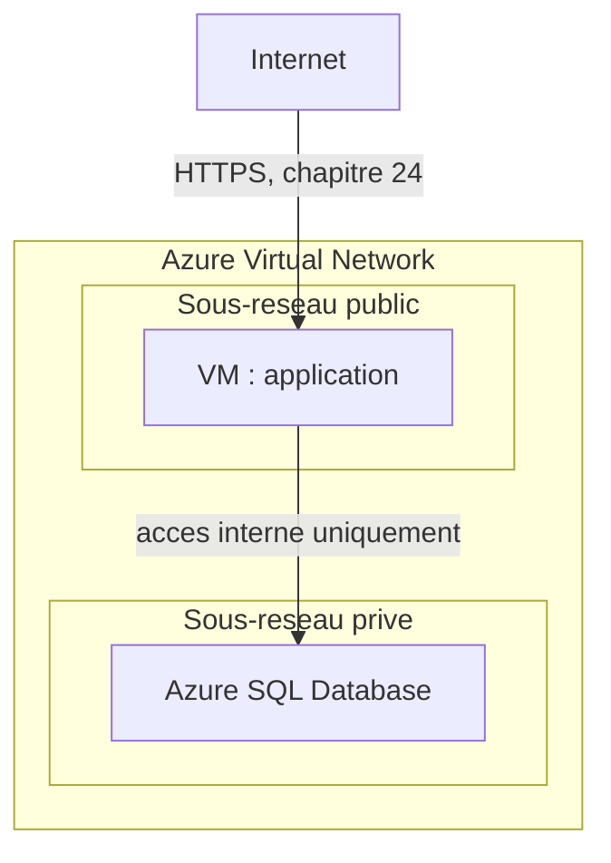

CHAPITRE 47

# Microsoft Azure : architecture et services essentiels

🎯 Objectif du chapitre
Découvrir Azure non pas comme une simple répétition d'AWS avec un vocabulaire différent, mais en identifiant son véritable argument différenciateur : l'intégration native avec l'écosystème Microsoft déjà en place dans ce manuel depuis le chapitre 5. À la fin de ce chapitre, tu sauras situer les équivalents Azure des services AWS déjà appris, et surtout juger objectivement quand Azure constitue un choix plus pertinent qu'AWS pour une organisation donnée.

🎬 Mise en situation
Le pilote AWS du portail client (chapitre 46) progresse bien. Le DSI se demande maintenant si un futur système plus étroitement lié à l'identité interne de l'entreprise — par exemple, une extension du système de gestion documentaire du chapitre 19, actuellement authentifié via SSSD contre l'Active Directory local (chapitre 22) — devrait suivre la même voie AWS, ou si Azure, déjà partiellement en jeu depuis l'intégration Entra ID du chapitre 8, ne serait pas un choix plus naturel. Ce chapitre répond à cette question précise en présentant Azure comme un choix contextuel, pas par défaut.

## 47.1 L'argument différenciateur d'Azure : une intégration déjà commencée

📌 À retenir — un fait déjà établi au chapitre 8, pas une nouveauté
Rappel direct du chapitre 8 : l'entreprise utilise déjà **Microsoft Entra ID** en mode hybride, synchronisé avec l'Active Directory local via Microsoft Entra Connect. Azure partage nativement ce même système d'identité — contrairement à AWS (chapitre 46), où IAM constitue un système d'identité **entièrement séparé**, nécessitant une intégration ou une synchronisation supplémentaire pour rester cohérent avec l'annuaire d'entreprise déjà en place. C'est le véritable argument de décision entre les deux fournisseurs pour cette entreprise précise, pas une prétendue supériorité technique générale de l'un sur l'autre.

## 47.2 Régions et zones de disponibilité : le même principe, un vocabulaire quasi identique

💡 Rien de nouveau conceptuellement, rappel direct du chapitre 46
Azure utilise également des **régions** et des **zones de disponibilité**, avec exactement la même logique déjà expliquée au chapitre 46 pour AWS — répartir une charge critique sur plusieurs zones au sein d'une région applique le même principe de site de repli du chapitre 31, indépendamment du fournisseur choisi.

## 47.3 Correspondances directes avec les services AWS déjà appris

| Besoin déjà couvert | Service AWS (chapitre 46) | Service Azure équivalent |
|---|---|---|
| Instance de calcul (VM) | EC2 | Azure Virtual Machines |
| Réseau virtuel segmenté | VPC | Azure Virtual Network (VNet) |
| Stockage d'objets | S3 | Azure Blob Storage |
| Base de données relationnelle managée | RDS | Azure SQL Database |
| Identité et permissions | IAM | **Microsoft Entra ID** (la différence clé, section 47.1) |

🧠 À mémoriser — le vocabulaire change, les principes de sécurité restent identiques
Chaque service Azure de ce tableau applique exactement les mêmes principes déjà établis au chapitre 46 : un Azure Virtual Network sépare des sous-réseaux publics et privés comme un VPC (rappel du bastion, chapitre 4) ; un compte de stockage Azure Blob peut être exposé publiquement par erreur, exactement comme un bucket S3 (section 46.5) — le même risque, sous un nom différent, avec la même vigilance requise.

## 47.4 Azure Virtual Network : segmentation, rappel direct

🔒 Sécurité — le même piège que S3, sous un autre nom
Un **compte de stockage Azure** mal configuré peut, exactement comme un bucket S3 (chapitre 46), exposer publiquement des données censées rester privées — la même vigilance de vérification de configuration s'applique, indépendamment de l'étiquette du fournisseur. Le modèle de responsabilité partagée (chapitre 45) reste identique : Azure sécurise l'infrastructure physique, jamais la configuration d'accès choisie par le client.

## 47.5 Microsoft Entra ID comme IAM natif : la réponse concrète au scénario d'ouverture

✅ Réutiliser l'identité existante plutôt que d'en reconstruire une nouvelle
Pour un système comme celui évoqué dans le scénario d'ouverture — une extension du serveur de gestion documentaire, déjà authentifié contre Active Directory via SSSD (chapitre 22) — héberger ce système sur Azure permettrait de réutiliser **directement** Microsoft Entra ID comme source d'identité, sans synchronisation supplémentaire à construire ni à maintenir. Sur AWS, la même cohérence nécessiterait une fédération d'identité entre IAM et Active Directory — techniquement possible, mais une couche de complexité supplémentaire qu'Azure évite nativement pour une entreprise déjà investie dans l'écosystème Microsoft.

⚠️ Un piège à éviter malgré cette intégration native
Cette intégration facilitée ne dispense jamais des principes déjà établis dans ce manuel : le moindre privilège (chapitre 1), le MFA (chapitre 25) et l'accès conditionnel (chapitre 8) doivent s'appliquer aux ressources Azure exactement comme ils s'appliquent déjà aux ressources on-premise — Azure facilite la cohérence de l'identité, il n'automatise jamais la rigueur de sa configuration.

## 47.6 Azure SQL Database : le même principe PaaS que RDS

💡 Rappel direct du chapitre 46
Azure SQL Database applique exactement le même principe PaaS déjà expliqué pour RDS (section 46.7) : Azure gère l'infrastructure et les correctifs, le client garde la responsabilité de la conception du schéma, de la logique applicative et de la protection des données elles-mêmes, selon le modèle de responsabilité partagée du chapitre 45.

## 47.7 Le vrai critère de décision entre AWS et Azure

✅ Le même cadre de décision contextuelle que tout au long de ce manuel
Exactement le même principe déjà appliqué au chapitre 14 (choix de distribution) et au chapitre 46 (pourquoi commencer par AWS) : le choix entre AWS et Azure ne repose pas sur une supériorité technique générale, mais sur des critères concrets — un système fortement lié à l'identité et aux outils Microsoft déjà en place (comme celui du scénario d'ouverture) penche naturellement vers Azure ; un système sans dépendance particulière à cet écosystème, comme le portail client déjà pilote sur AWS (chapitre 46), n'a aucune raison impérative de migrer.

## Atelier — Décider entre AWS et Azure pour le scénario d'ouverture

🛠️ Atelier 47 — Appliquer le critère de décision de la section 47.7

**Objectif** : trancher, avec des arguments concrets, la question posée par le DSI dans le scénario d'ouverture.

**Préparation** : aucune installation nécessaire.

**Étapes détaillées** :

1. Liste les arguments en faveur d'Azure pour l'extension du système de gestion documentaire, en t'appuyant sur les sections 47.1 et 47.5.
2. Liste les arguments qui justifieraient de rester sur AWS ou de ne pas migrer du tout.
3. Formule une recommandation tranchée, avec sa justification.
4. Compare ta démarche à la section "Résultat attendu".

**Résultat attendu** : les arguments en faveur d'Azure sont l'intégration native avec Entra ID déjà en place (section 47.1), évitant une synchronisation d'identité supplémentaire à construire et maintenir. Les arguments contre une migration précipitée incluent l'absence de besoin démontré de changement (rappel du principe du chapitre 45 : ne jamais migrer sans bénéfice concret) et le coût d'apprentissage d'un second fournisseur cloud pour l'équipe, déjà engagée sur AWS pour le portail. La recommandation tranchée dépend du contexte réel : si ce système nécessite réellement une authentification étroitement liée à Active Directory pour de nombreux utilisateurs internes, Azure se justifie ; s'il s'agit d'un service isolé à faible trafic, rester simple (voire ne pas migrer du tout, rappel du chapitre 45) reste tout aussi défendable.

**Dépannage** : si tu hésites, reviens à la question centrale déjà posée au chapitre 45 (section 45.7) — le bénéfice réel démontré dépasse-t-il le coût et la complexité d'introduire un second fournisseur cloud dans l'organisation ?

## Erreurs fréquentes

⚠️ Erreur n°1 — recréer une gestion d'identité séparée sur Azure au lieu de réutiliser Entra ID
Rappel de la section 47.5 : ignorer l'intégration native déjà disponible reproduit exactement la même erreur déjà dénoncée au chapitre 22 (créer un second annuaire OpenLDAP séparé plutôt que de connecter les serveurs Linux à l'Active Directory déjà en place).

⚠️ Erreur n°2 — supposer qu'Azure est "plus sûr" par défaut parce qu'il est signé Microsoft
Un raisonnement fallacieux — le modèle de responsabilité partagée (chapitre 45) s'applique de façon identique quel que soit le fournisseur ; un compte de stockage Azure mal configuré est tout aussi vulnérable qu'un bucket S3 mal configuré (section 47.4).

⚠️ Erreur n°3 — introduire un second fournisseur cloud sans besoin réel démontré
Rappel du principe déjà établi au chapitre 42 pour Kubernetes, et au chapitre 45 pour le cloud en général : une décision technologique doit répondre à un besoin concret, jamais par simple opportunité ou par habitude de marque.

## En entreprise

- **Bonne pratique répandue** : évaluer le choix entre fournisseurs cloud selon des critères d'intégration concrets avec l'infrastructure déjà en place, pas seulement selon des comparatifs génériques de fonctionnalités.
- **Bonne pratique répandue** : appliquer la même rigueur de configuration de sécurité (IAM/Entra ID, MFA, segmentation réseau) quel que soit le fournisseur choisi, sans relâcher la vigilance sous prétexte d'une marque perçue comme plus fiable.
- **Erreur classique observée** : des organisations qui adoptent Azure uniquement parce qu'elles utilisent déjà Microsoft 365, sans évaluer si le bénéfice d'intégration réel se matérialise pour le système précis concerné — une décision par habitude plutôt que par analyse contextuelle.

## Entretien technique

💼 Questions fréquemment posées en entretien

**Q1. "Pourquoi une entreprise déjà investie dans l'écosystème Microsoft choisirait-elle Azure plutôt qu'AWS ?"**
Réponse attendue : principalement pour l'intégration native avec Microsoft Entra ID, évitant une synchronisation ou une fédération d'identité supplémentaire à construire et maintenir avec un système d'identité cloud séparé comme AWS IAM — un avantage concret d'intégration, pas une supériorité technique générale.

**Q2. "Quels sont les équivalents Azure d'EC2, S3 et RDS ?"**
Réponse attendue : Azure Virtual Machines (calcul), Azure Blob Storage (stockage d'objets), Azure SQL Database (base de données managée) — les mêmes concepts fondamentaux que sur AWS, sous des noms différents.

**Q3. "Le choix entre AWS et Azure doit-il se faire uniquement sur des critères techniques ?"**
Réponse attendue : non, l'intégration avec l'écosystème existant (identité, outils déjà maîtrisés par l'équipe) pèse souvent davantage qu'une différence technique marginale entre fournisseurs offrant des services globalement équivalents — un principe de décision contextuelle déjà appliqué à chaque choix technologique de ce manuel.

## Optimisation, sécurité et maintenabilité — les réflexes dès ce chapitre

🔒 Sécurité
Applique la même rigueur de configuration (MFA, accès conditionnel, moindre privilège) à Entra ID sur Azure qu'à l'identité on-premise déjà sécurisée depuis les chapitres 22-26 — l'intégration native ne dispense jamais de cette vigilance.

✅ Maintenabilité
Documente (chapitre 3) la justification précise de chaque choix de fournisseur cloud pour chaque système migré — une décision d'architecture qui semble évidente aujourd'hui (comme "Azure parce qu'on a déjà Entra ID") mérite d'être explicitée pour toute personne reprenant ce projet plus tard.

🚀 Performance
Évalue le coût réel d'introduire un second fournisseur cloud (formation de l'équipe, complexité opérationnelle accrue) face au bénéfice d'intégration — un compromis à chiffrer concrètement plutôt que supposé, un sujet approfondi au chapitre 50 (FinOps) et au chapitre 49 (stratégies multi-cloud).

## Résumé du chapitre

- Azure offre les mêmes concepts fondamentaux qu'AWS (régions, zones de disponibilité, VM, stockage, réseau segmenté, base de données managée) sous un vocabulaire différent.
- Le véritable argument différenciateur d'Azure pour cette entreprise est l'intégration native avec Microsoft Entra ID, déjà en place depuis le chapitre 8.
- Le modèle de responsabilité partagée et les risques de configuration (comme un stockage exposé publiquement) restent identiques, indépendamment du fournisseur.
- Le choix entre AWS et Azure doit rester contextuel, basé sur un besoin réel d'intégration ou de compétence déjà en place, jamais sur une préférence de marque ou une supposition de sécurité supérieure par défaut.

## Quiz

📝 QCM (une seule bonne réponse par question)

1. L'équivalent Azure d'EC2 est :
   - a) Azure Blob Storage
   - b) Azure Virtual Machines
   - c) Azure SQL Database
   - d) Microsoft Entra ID

2. Le véritable argument différenciateur d'Azure pour une entreprise déjà investie dans l'écosystème Microsoft est :
   - a) Un prix systématiquement inférieur à AWS
   - b) L'intégration native avec Microsoft Entra ID
   - c) L'absence totale de risque de sécurité
   - d) Une meilleure documentation qu'AWS

3. Un compte de stockage Azure Blob mal configuré :
   - a) Ne peut jamais être exposé publiquement, contrairement à S3
   - b) Présente le même risque d'exposition publique qu'un bucket S3 mal configuré
   - c) Est automatiquement sécurisé par Microsoft
   - d) N'existe pas comme concept sur Azure

**Corrigé** : 1-b, 2-b, 3-b.

📝 Vrai ou Faux

1. Azure et AWS partagent globalement les mêmes concepts fondamentaux, sous un vocabulaire différent. — **Vrai**.
2. Une entreprise déjà utilisatrice de Microsoft Entra ID devrait automatiquement migrer tous ses systèmes vers Azure. — **Faux** (une décision contextuelle, section 47.7, pas une règle automatique).
3. Le modèle de responsabilité partagée diffère fondamentalement entre AWS et Azure. — **Faux** (le même principe s'applique, quel que soit le fournisseur).
4. L'intégration Entra ID d'Azure dispense de l'application du MFA et de l'accès conditionnel déjà établis. — **Faux** (ces principes restent tout aussi nécessaires, section 47.5).

📝 Questions ouvertes

1. Explique pourquoi le choix entre AWS et Azure ne devrait jamais se réduire à une simple préférence de marque.
2. Reprends le scénario d'ouverture. Explique pourquoi l'extension du système de gestion documentaire constitue un meilleur candidat pour Azure que ne l'était le portail client pour AWS.

**Corrigé 1** : les deux fournisseurs offrent des services globalement équivalents pour la grande majorité des besoins (section 47.3) — une préférence de marque sans critère concret ignore les véritables facteurs de décision pertinents (intégration avec l'existant, compétence déjà maîtrisée par l'équipe, coût réel), risquant une décision arbitraire difficile à justifier objectivement lors d'un futur audit ou d'une revue d'architecture.

**Corrigé 2** : le portail client (chapitre 46) est un système exposé publiquement, sans dépendance particulière à l'identité interne de l'entreprise — le choix d'AWS reposait sur sa popularité et sa documentation, pas sur un besoin d'intégration spécifique. Le système de gestion documentaire, à l'inverse, authentifie déjà ses utilisateurs via une chaîne directement liée à Active Directory (SSSD, chapitre 22) — un système fortement ancré dans l'identité interne de l'entreprise, exactement le profil qui bénéficie le plus de l'intégration native d'Azure avec Entra ID, contrairement au portail dont l'audience est principalement externe et sans lien avec cette identité interne.

## Exercices

📝 Exercice 47.1

Une équipe migre un système vers Azure en créant des comptes locaux distincts dans Entra ID, sans les synchroniser avec l'Active Directory local déjà en place depuis le chapitre 5. Explique le risque de cette approche, en t'appuyant sur la section 47.5 et le chapitre 22.

**Corrigé :** Cette approche recrée exactement le problème déjà résolu au chapitre 22 par SSSD — une seconde source de vérité pour l'identité, séparée de l'Active Directory local, nécessitant une gestion manuelle indépendante (création, désactivation de comptes) à chaque changement de personnel. Un employé désactivé dans Active Directory local conserverait alors son accès à ce système Azure tant que son compte Entra ID local distinct n'est pas désactivé séparément — exactement le risque de "compte fantôme" déjà dénoncé au chapitre 3, reproduit ici dans un nouveau contexte cloud malgré l'existence d'une intégration native qui aurait permis de l'éviter entièrement.

📝 Exercice 47.2

Rédige, en 3 à 5 phrases, une politique courte que tu proposerais à l'entreprise concernant le choix entre AWS et Azure pour tout futur système à migrer vers le cloud.

**Corrigé (exemple de réponse) :** Pour tout nouveau système à migrer, évaluer d'abord sa dépendance réelle à l'identité interne de l'entreprise (Active Directory/Entra ID) — un système fortement dépendant de cette identité doit privilégier Azure pour son intégration native, tandis qu'un système exposé publiquement sans lien particulier avec l'identité interne peut rester sur AWS, déjà maîtrisé par l'équipe depuis le pilote du portail client. Éviter systématiquement d'introduire un troisième fournisseur cloud sans justification aussi solide que celles déjà établies pour les deux premiers, afin de ne pas disperser inutilement la charge opérationnelle et la compétence de l'équipe sur trop d'écosystèmes distincts.

## Checklist de fin de chapitre

<ul class="checklist">
<li>☐ Je sais situer les équivalents Azure des services AWS déjà appris (VM, stockage, réseau, base de données).</li>
<li>☐ Je comprends pourquoi l'intégration Entra ID constitue le véritable argument différenciateur d'Azure pour cette entreprise.</li>
<li>☐ Je sais que le modèle de responsabilité partagée et les risques de configuration restent identiques, quel que soit le fournisseur.</li>
<li>☐ Je sais appliquer un critère de décision contextuel entre AWS et Azure, plutôt qu'une préférence de marque.</li>
<li>☐ Je comprends pourquoi recréer une identité séparée sur Azure, sans réutiliser Entra ID existant, reproduit une erreur déjà rencontrée au chapitre 22.</li>
</ul>

## FAQ

<dl class="faq">
<dt>Peut-on utiliser Microsoft Entra ID pour gérer l'identité sur des ressources AWS également ?</dt>
<dd>Oui, une fédération d'identité entre Entra ID et AWS IAM est techniquement possible — mais elle ajoute une couche de configuration supplémentaire à maintenir, contrairement à l'intégration native disponible directement sur Azure, exactement le compromis évoqué en section 47.1.</dd>

<dt>Azure est-il toujours plus cher ou moins cher qu'AWS ?</dt>
<dd>Il n'existe pas de réponse universelle — les deux fournisseurs proposent des modèles de tarification comparables, avec des variations selon le service précis et le volume d'usage, un sujet à évaluer concrètement au chapitre 50 (FinOps) plutôt que de supposer une différence générale.</dd>

<dt>Faut-il éviter complètement d'utiliser deux fournisseurs cloud différents dans la même entreprise ?</dt>
<dd>Pas nécessairement, mais chaque fournisseur ajouté représente un coût réel de complexité opérationnelle et de compétence à maintenir — un compromis à évaluer soigneusement, approfondi au chapitre 49 sur les stratégies hybrides et multi-cloud.</dd>

<dt>L'intégration Entra ID rend-elle Azure automatiquement plus sécurisé qu'AWS ?</dt>
<dd>Non — la sécurité réelle dépend entièrement de la configuration appliquée par le client (MFA, accès conditionnel, moindre privilège), pas du fournisseur choisi. L'intégration facilite la cohérence de gestion de l'identité, elle ne remplace jamais la rigueur de configuration nécessaire, rappel direct de la section 47.5.</dd>
</dl>

## Références et pour aller plus loin

- Documentation officielle Microsoft Azure : [https://learn.microsoft.com/fr-fr/azure/](https://learn.microsoft.com/fr-fr/azure/)
- Microsoft Learn — Azure Well-Architected Framework : [https://learn.microsoft.com/fr-fr/azure/well-architected/](https://learn.microsoft.com/fr-fr/azure/well-architected/)
- Microsoft Learn — Sécurité des comptes de stockage Azure : [https://learn.microsoft.com/fr-fr/azure/storage/blobs/security-recommendations](https://learn.microsoft.com/fr-fr/azure/storage/blobs/security-recommendations)

*Chapitre suivant : Google Cloud Platform — architecture et services essentiels, pour compléter la vue d'ensemble des trois grands fournisseurs cloud avant d'aborder les stratégies hybrides et multi-cloud.*
