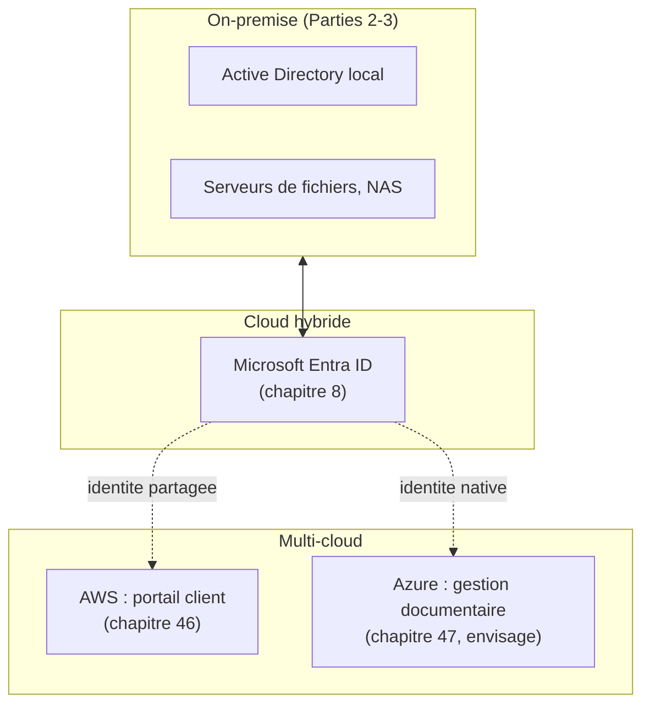

CHAPITRE 49

# Stratégies hybrides et multi-cloud

🎯 Objectif du chapitre
Reconnaître que l'entreprise de ce manuel est déjà, de fait, dans une situation hybride et potentiellement multi-cloud — et transformer cet état accidentel en une stratégie consciente et gouvernée. À la fin de ce chapitre, tu sauras distinguer cloud hybride et multi-cloud, comprendre le risque de dépendance à un fournisseur unique (vendor lock-in), et documenter une gouvernance claire de "quel système vit où, et pourquoi".

🎬 Mise en situation
Le DSI dresse un bilan de la situation actuelle de l'entreprise : Active Directory reste on-premise avec une synchronisation Entra ID (chapitre 8) ; le portail client tourne sur AWS (chapitre 46) ; le système de gestion documentaire envisage une migration vers Azure pour son intégration Entra ID (chapitre 47) ; l'Active Directory, les serveurs de fichiers et une partie de l'infrastructure Linux restent entièrement sur site. <em>"On n'a jamais décidé consciemment d'être hybride et multi-cloud,"</em> réalise-t-il, <em>"c'est arrivé projet par projet, sans qu'on documente une vraie stratégie d'ensemble."</em> Ce chapitre transforme cet état de fait en stratégie gouvernée, plutôt que de laisser cette dispersion s'accumuler sans contrôle.

## 49.1 L'état actuel de l'entreprise : hybride de facto, sans l'avoir décidé

📌 À retenir — un constat, pas un jugement
Chaque décision individuelle prise dans les chapitres précédents était rationnelle et bien justifiée (AWS pour le portail par pragmatisme, chapitre 46 ; Azure envisagé pour la gestion documentaire par intégration Entra ID, chapitre 47) — mais leur somme non coordonnée produit exactement la situation que le DSI observe : une infrastructure dispersée sans vue d'ensemble ni gouvernance explicite. Ce n'est pas nécessairement une erreur, mais cela nécessite désormais une reconnaissance consciente plutôt qu'une accumulation silencieuse.

## 49.2 Cloud hybride et multi-cloud : deux concepts distincts

💡 Ne pas confondre les deux termes
Le **cloud hybride** combine infrastructure on-premise (comme l'Active Directory local, la Partie 2 entière de ce manuel) et cloud public — exactement la situation déjà construite depuis le chapitre 8. Le **multi-cloud** combine plusieurs fournisseurs cloud publics entre eux (AWS pour le portail, potentiellement Azure pour la gestion documentaire) — un concept distinct, bien que les deux puissent coexister, comme c'est le cas pour cette entreprise.

## 49.3 Pourquoi rester hybride plutôt que "tout cloud"

✅ Rappel direct du chapitre 45
Le principe déjà établi au chapitre 45 reste entièrement valable : la connectivité Internet parfois instable (chapitres 6, 23), le coût d'une migration complète, et des systèmes comme Active Directory qui n'ont pas de bénéfice concret démontré à migrer entièrement (rappel de l'atelier du chapitre 45) justifient de conserver une infrastructure hybride plutôt qu'une migration totale et précipitée vers "tout cloud".

## 49.4 Les défis réels du multi-cloud

⚠️ Rappel direct de la section 48.7
Chaque fournisseur cloud supplémentaire représente un coût réel de compétence à maintenir dans l'équipe, de complexité opérationnelle (des outils de supervision, de déploiement et de facturation potentiellement différents selon le fournisseur), et de latence réseau entre environnements si des systèmes hébergés sur des fournisseurs différents doivent communiquer fréquemment entre eux — des coûts réels à mettre en balance avec les bénéfices d'intégration déjà identifiés (comme Entra ID pour Azure, chapitre 47).

## 49.5 Le vendor lock-in : le risque de dépendance à un fournisseur unique

🔒 Sécurité — un risque stratégique, pas seulement technique
Le **vendor lock-in** désigne la dépendance croissante à un fournisseur unique, rendant une migration future vers un autre fournisseur de plus en plus coûteuse et complexe à mesure que l'infrastructure s'appuie sur des services propriétaires spécifiques à ce fournisseur (au-delà des concepts génériques déjà comparés aux chapitres 46-48). Ce risque n'est pas purement technique — il touche au pouvoir de négociation de l'entreprise face à son fournisseur, à sa résilience face à une panne majeure chez ce seul fournisseur, et à sa capacité à réagir si les conditions tarifaires évoluent défavorablement.

💡 Un compromis, pas une réponse binaire
Le multi-cloud réduit ce risque de dépendance, mais au prix de la complexité déjà décrite en section 49.4 — exactement le même type de compromis déjà rencontré tout au long de ce manuel (RAID matériel vs logiciel, chapitre 27 ; Docker vs VM, chapitre 39). Une stratégie consciente pèse ce compromis explicitement, plutôt que de le subir par accumulation non coordonnée comme l'a réalisé le DSI dans le scénario d'ouverture.

## 49.6 Connecter les environnements en toute sécurité

✅ Rappel direct du chapitre 4
Quand des systèmes hébergés sur site, sur AWS et potentiellement sur Azure doivent communiquer entre eux (par exemple, une application cloud qui interroge l'Active Directory local), cette communication doit transiter par un canal sécurisé — un VPN site-à-site chiffré, voire une interconnexion réseau dédiée pour un trafic important et récurrent — jamais une exposition directe non chiffrée entre environnements, exactement le même principe déjà établi pour le bastion du chapitre 4 et le VPC segmenté du chapitre 46.

## 49.7 Une gouvernance claire : documenter "quel système vit où"

✅ La réponse structurelle au constat du DSI
Rappel direct du chapitre 3 : la CMDB doit désormais inclure, pour chaque système, non seulement ses caractéristiques techniques mais aussi son **environnement d'hébergement précis** (on-premise, AWS, Azure, GCP) et la **justification** de ce choix (rappel des critères déjà établis aux chapitres 46-48). Sans cette documentation centralisée, la dispersion déjà observée par le DSI continuera de s'accumuler silencieusement, projet après projet, sans jamais être visible dans son ensemble.

## Atelier — Documenter la stratégie hybride de l'entreprise

🛠️ Atelier 49 — Transformer l'état de fait en gouvernance consciente

**Objectif** : produire le document de gouvernance que le DSI aurait dû avoir depuis le début, à partir de l'état actuel de l'entreprise.

**Préparation** : aucune installation nécessaire — cet atelier est un exercice de synthèse et de documentation.

**Étapes détaillées** :

1. Liste chaque système majeur déjà rencontré dans ce manuel (Active Directory, portail client, gestion documentaire, etc.) avec son environnement d'hébergement actuel ou envisagé.
2. Pour chacun, rédige une justification en une phrase, en t'appuyant sur les critères déjà établis aux chapitres 45-48.
3. Propose une règle de gouvernance simple pour tout futur système, afin d'éviter que la dispersion ne continue de s'accumuler sans contrôle.
4. Compare ta démarche à la section "Résultat attendu".

**Résultat attendu** : le tableau reprend Active Directory (on-premise, aucun bénéfice démontré à migrer, chapitre 45), le portail client (AWS, pragmatisme et popularité, chapitre 46), la gestion documentaire (Azure envisagé, intégration Entra ID, chapitre 47). La règle de gouvernance proposée pourrait être : "Tout nouveau système doit documenter explicitement, avant son déploiement, son environnement d'hébergement choisi et sa justification selon les critères déjà établis, validé par une revue plutôt que décidé isolément par l'équipe projet du moment" — exactement la lacune de gouvernance identifiée par le DSI dans le scénario d'ouverture.

**Dépannage** : si tu as du mal à justifier un système en une seule phrase claire, c'est souvent le signe que sa localisation actuelle n'a jamais été réellement décidée consciemment — une bonne raison de la documenter maintenant, même rétroactivement, plutôt que de laisser cette ambiguïté perdurer.

## Erreurs fréquentes

⚠️ Erreur n°1 — un multi-cloud "par accident", sans stratégie consciente
Exactement le constat du DSI dans le scénario d'ouverture — chaque décision individuellement rationnelle, mais sans vue d'ensemble ni gouvernance, aboutissant à une dispersion non maîtrisée.

⚠️ Erreur n°2 — négliger la connectivité sécurisée entre environnements
Rappel de la section 49.6 : une communication non chiffrée entre systèmes on-premise et cloud reproduit exactement le même risque déjà dénoncé pour un service exposé directement sans bastion (chapitre 4).

⚠️ Erreur n°3 — ignorer le vendor lock-in jusqu'à ce qu'il devienne un problème réel
Rappel de la section 49.5 : une dépendance croissante et non anticipée à un fournisseur unique réduit progressivement la marge de manœuvre de l'entreprise, un risque souvent invisible jusqu'au jour où une migration devient nécessaire et se révèle bien plus coûteuse qu'anticipé.

## Diagnostiquer une dispersion non gouvernée

🩺 Situation : "Comment savoir si notre organisation est déjà dans la situation du DSI, sans le savoir ?"

- **Diagnostic** : vérifier si la CMDB (chapitre 3) documente réellement, pour chaque système, son environnement d'hébergement et sa justification — l'absence de cette information pour plusieurs systèmes est un signe clair de dispersion non gouvernée.
- **Comment vérifier** : dresser un inventaire simple de tous les systèmes connus de l'organisation avec leur hébergement réel, en interrogeant directement chaque équipe projet si la documentation centralisée est incomplète.
- **Résolution** : compléter la CMDB avec cette information (section 49.7), puis établir la règle de gouvernance pour tout futur système, exactement la démarche de l'atelier de ce chapitre.

## En entreprise

- **Bonne pratique répandue** : centraliser dans la CMDB (chapitre 3) l'environnement d'hébergement et la justification de chaque système, revue périodiquement pour détecter toute dérive non gouvernée.
- **Bonne pratique répandue** : limiter consciemment le nombre de fournisseurs cloud actifs, en exigeant une justification explicite avant d'en introduire un nouveau — jamais une accumulation projet par projet sans vue d'ensemble.
- **Erreur classique observée** : une organisation qui découvre, lors d'un audit de sécurité ou d'une négociation contractuelle, qu'elle dépend bien plus fortement d'un fournisseur cloud particulier qu'elle ne le pensait, faute d'avoir suivi cette dépendance de façon centralisée au fil du temps.

## Entretien technique

💼 Questions fréquemment posées en entretien

**Q1. "Quelle est la différence entre cloud hybride et multi-cloud ?"**
Réponse attendue : le cloud hybride combine infrastructure on-premise et cloud public (comme Active Directory local synchronisé avec Entra ID) ; le multi-cloud combine plusieurs fournisseurs cloud publics entre eux — les deux concepts sont distincts mais peuvent coexister dans la même organisation.

**Q2. "Qu'est-ce que le vendor lock-in, et comment s'en prémunir ?"**
Réponse attendue : la dépendance croissante à un fournisseur unique, rendant une migration future coûteuse et complexe — on s'en prémunit en privilégiant, quand c'est raisonnable, des services et standards portables (comme Kubernetes, déjà rencontré aux chapitres 42-44) plutôt que des services propriétaires spécifiques à un seul fournisseur, tout en acceptant que ce choix a lui-même un coût de complexité.

**Q3. "Comment éviter qu'une organisation ne devienne multi-cloud 'par accident', sans stratégie ?"**
Réponse attendue : par une gouvernance centralisée (documentée dans la CMDB, chapitre 3) exigeant une justification explicite pour tout nouveau fournisseur ou service adopté, plutôt que de laisser chaque équipe projet décider isolément sans vue d'ensemble ni validation croisée.

## Optimisation, sécurité et maintenabilité — les réflexes dès ce chapitre

🔒 Sécurité
Sécurise systématiquement toute communication entre environnements on-premise et cloud via un canal chiffré dédié (VPN site-à-site ou interconnexion directe) — jamais une exposition directe non protégée, quel que soit le nombre d'environnements impliqués.

✅ Maintenabilité
Centralise dans la CMDB l'environnement d'hébergement et la justification de chaque système — la mesure de gouvernance la plus directement actionnable de ce chapitre, qui transforme une dispersion accidentelle en une cartographie consciente et auditable.

🚀 Performance
Limite les échanges fréquents et volumineux entre environnements hébergés sur des fournisseurs différents — chaque traversée entre environnements ajoute une latence réseau réelle, un facteur à considérer explicitement lors de la conception d'une architecture multi-cloud.

## Résumé du chapitre

- Le cloud hybride combine infrastructure on-premise et cloud public ; le multi-cloud combine plusieurs fournisseurs cloud publics — deux concepts distincts, souvent combinés en pratique.
- Une entreprise peut devenir hybride et multi-cloud "par accident", décision par décision, sans jamais avoir arrêté de stratégie consciente d'ensemble.
- Le vendor lock-in représente un risque stratégique de dépendance croissante à un fournisseur unique, à mettre en balance avec la complexité opérationnelle du multi-cloud.
- Toute communication entre environnements doit transiter par un canal sécurisé, le même principe déjà établi pour le bastion du chapitre 4.
- Une gouvernance centralisée, documentant "quel système vit où et pourquoi" dans la CMDB, transforme une dispersion non maîtrisée en une stratégie consciente et auditable.

## Quiz

📝 QCM (une seule bonne réponse par question)

1. Le cloud hybride combine :
   - a) Deux fournisseurs cloud publics uniquement
   - b) Infrastructure on-premise et cloud public
   - c) Uniquement des services SaaS
   - d) Deux régions du même fournisseur cloud

2. Le vendor lock-in désigne :
   - a) Un mécanisme de sécurité renforcée
   - b) La dépendance croissante à un fournisseur unique, rendant une migration future coûteuse
   - c) Un type de pare-feu cloud
   - d) Une méthode de sauvegarde

3. La bonne pratique pour éviter un multi-cloud "par accident" est de :
   - a) Laisser chaque équipe projet décider isolément
   - b) Exiger une justification documentée avant l'adoption de tout nouveau fournisseur
   - c) Interdire totalement l'usage du cloud
   - d) Adopter systématiquement tous les fournisseurs disponibles

**Corrigé** : 1-b, 2-b, 3-b.

📝 Vrai ou Faux

1. Le cloud hybride et le multi-cloud désignent exactement le même concept. — **Faux** (deux concepts distincts, section 49.2).
2. Une communication entre un système on-premise et un système cloud devrait toujours transiter par un canal sécurisé. — **Vrai**.
3. Le vendor lock-in est un risque purement technique, sans impact stratégique. — **Faux** (impact sur le pouvoir de négociation et la résilience, section 49.5).
4. La CMDB devrait documenter l'environnement d'hébergement et la justification de chaque système. — **Vrai**.

📝 Questions ouvertes

1. Explique pourquoi chaque décision individuelle des chapitres 46-48 était rationnelle, alors que leur somme non coordonnée pose un problème au DSI.
2. Reprends l'atelier de ce chapitre. Explique pourquoi documenter rétroactivement la justification d'un système déjà déployé reste utile, même après coup.

**Corrigé 1** : chaque décision (AWS pour le portail par pragmatisme, chapitre 46 ; Azure envisagé pour la gestion documentaire par intégration Entra ID, chapitre 47) répondait à un besoin réel et à un critère de décision valide à son propre niveau. Le problème n'est pas la rationalité individuelle de chaque choix, mais l'absence de vue d'ensemble et de gouvernance consciente qui aurait permis d'évaluer collectivement le coût cumulé de complexité opérationnelle et de dispersion de compétence — exactement la distinction entre optimisation locale et optimisation globale, un piège classique dans toute organisation qui grandit progressivement sans jamais faire le point d'ensemble.

**Corrigé 2** : documenter rétroactivement, même après un déploiement déjà effectué, transforme une décision implicite (potentiellement bonne, mais non vérifiée) en une décision explicite et auditable — cela permet à quiconque examine ce système plus tard de comprendre s'il s'agissait d'un choix réfléchi ou d'une décision par défaut, et facilite une réévaluation future si le contexte change (rappel du principe de révision après changement déjà établi au chapitre 2). Sans cette documentation, même une bonne décision reste invisible et indéfendable objectivement lors d'un futur audit.

## Exercices

📝 Exercice 49.1

Une entreprise dépend fortement d'un service propriétaire spécifique à un seul fournisseur cloud, sans équivalent standard portable. Explique le risque concret si ce fournisseur augmente significativement ses tarifs, et propose une mesure d'atténuation partielle.

**Corrigé :** Une forte dépendance à un service propriétaire non portable place l'entreprise en position de faiblesse face à une hausse tarifaire — migrer vers un autre fournisseur nécessiterait de reconstruire cette fonctionnalité spécifique depuis zéro, un coût et un délai qui peuvent rendre cette hausse difficile à contester ou à éviter à court terme, exactement le risque de vendor lock-in de la section 49.5. Une mesure d'atténuation partielle consiste à privilégier, quand c'est raisonnable, des standards portables (comme Kubernetes plutôt qu'un service de calcul entièrement propriétaire) pour les composants les plus critiques, réduisant le coût d'une éventuelle migration future sans pour autant éliminer complètement cette dépendance, un compromis réaliste plutôt qu'une solution parfaite.

📝 Exercice 49.2

Rédige, en 3 à 5 phrases, une règle de gouvernance à proposer à la direction de l'entreprise pour éviter que la situation du scénario d'ouverture ne se reproduise à l'avenir.

**Corrigé (exemple de réponse) :** Toute décision d'hébergement d'un nouveau système (on-premise, ou choix d'un fournisseur cloud particulier) doit être documentée explicitement dans la CMDB avec sa justification, avant la mise en production, et non après coup. Une revue trimestrielle de l'ensemble des systèmes et de leur hébergement doit permettre de détecter toute dispersion non anticipée avant qu'elle ne s'accumule sur plusieurs années. L'introduction d'un nouveau fournisseur cloud, en particulier, doit être validée par une comparaison explicite avec les fournisseurs déjà en place, suivant les critères déjà établis dans ce manuel (chapitres 45-48), plutôt que décidée isolément par une seule équipe projet sans consultation transversale.

## Checklist de fin de chapitre

<ul class="checklist">
<li>☐ Je sais distinguer cloud hybride et multi-cloud.</li>
<li>☐ Je comprends comment une organisation peut devenir multi-cloud "par accident", sans stratégie consciente.</li>
<li>☐ Je sais expliquer le risque de vendor lock-in et les moyens de l'atténuer partiellement.</li>
<li>☐ Je sais pourquoi toute communication entre environnements doit transiter par un canal sécurisé.</li>
<li>☐ Je sais documenter une gouvernance claire de "quel système vit où et pourquoi" dans la CMDB.</li>
</ul>

## FAQ

<dl class="faq">
<dt>Le multi-cloud est-il toujours une bonne pratique de résilience à adopter systématiquement ?</dt>
<dd>Non, pas systématiquement — c'est un compromis (section 49.5) entre réduction de dépendance et complexité opérationnelle accrue, à évaluer selon le contexte réel de chaque organisation, pas une bonne pratique universelle à appliquer sans réflexion.</dd>

<dt>Comment réduire concrètement le vendor lock-in sans renoncer aux bénéfices d'intégration d'un fournisseur ?</dt>
<dd>En privilégiant les standards portables (Kubernetes, formats de données ouverts) pour les composants où cette portabilité compte réellement, tout en acceptant consciemment une dépendance plus forte pour les services où le bénéfice d'intégration (comme Entra ID sur Azure, chapitre 47) dépasse clairement ce risque — un équilibre à documenter explicitement, pas une règle absolue à appliquer uniformément partout.</dd>

<dt>Une interconnexion réseau dédiée est-elle toujours nécessaire entre environnements hybrides ?</dt>
<dd>Non, un VPN site-à-site chiffré suffit pour la plupart des besoins de communication modérée ; une interconnexion dédiée (plus coûteuse, mais plus performante et prévisible) se justifie pour un trafic important et récurrent entre environnements, un choix à évaluer selon le volume réel de données échangées.</dd>

<dt>Faut-il attendre d'avoir une stratégie parfaite avant de documenter la situation actuelle ?</dt>
<dd>Non, au contraire — documenter honnêtement l'état actuel, même imparfait ou accidentel comme celui du scénario d'ouverture, constitue la première étape indispensable avant toute amélioration ultérieure, exactement la démarche de l'atelier de ce chapitre.</dd>
</dl>

## Références et pour aller plus loin

- NIST Special Publication 800-145 (déjà référencée au chapitre 45, couvre aussi les modèles de déploiement hybride) : [https://csrc.nist.gov/pubs/sp/800/145/final](https://csrc.nist.gov/pubs/sp/800/145/final)
- CNCF — ressources sur la portabilité cloud-native (déjà référencée au chapitre 42) : [https://www.cncf.io/](https://www.cncf.io/)
- Gartner — recherches sur les stratégies multi-cloud (ressource générale de l'industrie, à consulter selon disponibilité) : recherche via un moteur de recherche professionnel spécialisé.

*Chapitre suivant : FinOps — maîtriser les coûts cloud, le prolongement naturel de ce chapitre sur la gouvernance, appliqué spécifiquement à la dimension financière d'une infrastructure hybride et multi-cloud.*
