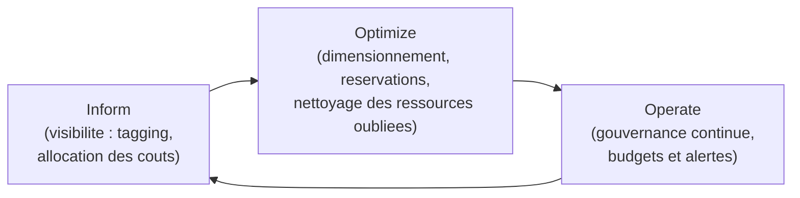

<div class="chapitre-titre-num">CHAPITRE 50</div>

# FinOps : maîtrise des coûts cloud

<div class="encadre objectif">
<span class="encadre-titre">🎯 Objectif du chapitre</span>
Comprendre le FinOps comme discipline collective, prolongeant directement la gouvernance déjà établie au chapitre 49, appliquée spécifiquement à la maîtrise des coûts cloud. À la fin de ce chapitre, tu sauras identifier les causes les plus fréquentes de gaspillage cloud, mettre en place un système de tagging et d'alertes budgétaires, et choisir entre instances à la demande, réservées et spot selon le profil de charge réel d'un service.
</div>

<div class="encadre scenario">
<span class="encadre-titre">🎬 Mise en situation</span>
Trois mois après le lancement du pilote AWS (chapitre 46), la première facture trimestrielle complète arrive sur le bureau du DSI — un montant presque le double de ce qui avait été estimé. En creusant avec l'équipe, plusieurs causes apparaissent : une instance EC2 de test, lancée pour l'atelier du chapitre 39, jamais arrêtée depuis des semaines ; l'instance de production du portail largement surdimensionnée "par précaution", consommée à 15% de sa capacité réelle en moyenne ; et surtout, impossible de savoir avec certitude quel service précis coûte quoi, faute d'avoir étiqueté les ressources dès leur création. <em>"On a la même discipline à appliquer aux coûts qu'à la sécurité,"</em> conclut le DSI. C'est exactement l'objet du FinOps — le sujet de ce chapitre.
</div>

## 50.1 Le choc de la première facture cloud : un phénomène extrêmement répandu

<div class="encadre retenir">
<span class="encadre-titre">📌 À retenir — rappel direct de la section 46.8</span>
Contrairement à un serveur physique déjà amorti (Partie 6), chaque ressource cloud a un coût continu, facturé selon l'usage réel — un modèle qui rend le gaspillage à la fois plus facile à créer (une ressource oubliée continue de facturer silencieusement) et plus facile à corriger une fois détecté, à condition de disposer des bons outils de visibilité. Le scénario d'ouverture, bien que frustrant, est extrêmement courant : la grande majorité des organisations découvrant le cloud vivent une surprise similaire lors de leur première facture réelle.
</div>

## 50.2 FinOps : une discipline collective, pas un simple outil

<div class="encadre bonne-pratique">
<span class="encadre-titre">✅ Le même principe multi-disciplinaire que le PCA du chapitre 32</span>
Rappel direct du chapitre 32 : exactement comme la continuité d'activité dépasse le seul périmètre de l'équipe IT, le **FinOps** (contraction de *Finance* et *Operations*) réunit l'équipe technique, la direction financière et les responsables métier autour d'une responsabilité partagée des coûts cloud — l'équipe IT ne peut pas, seule, décider des priorités budgétaires, mais elle seule dispose de la visibilité technique nécessaire pour identifier les sources réelles de gaspillage (rappel du même principe déjà établi pour le rôle de l'IT dans le PCA, section 32.5).
</div>

## 50.3 Les causes courantes de gaspillage cloud

| Cause de gaspillage | Exemple concret | Rappel du chapitre concerné |
|---|---|---|
| Ressources oubliées allumées | L'instance de test de l'atelier du chapitre 39, jamais arrêtée | Discipline de nettoyage déjà recommandée au chapitre 39 |
| Instances surdimensionnées | L'instance EC2 de production à 15% d'utilisation réelle | Rappel de `resources.requests` du chapitre 44, appliqué ici au dimensionnement cloud |
| Absence d'auto-scaling limité | Une charge qui grandit sans limite supérieure définie | Rappel du `maxReplicas` de l'HPA, chapitre 44 |
| Snapshots et volumes orphelins | Des sauvegardes de test jamais supprimées après usage | Rappel de la discipline de nettoyage déjà appliquée tout au long de ce manuel |

<div class="encadre attention">
<span class="encadre-titre">⚠️ Exactement les trois causes du scénario d'ouverture</span>
Les deux premières lignes de ce tableau correspondent précisément aux deux causes identifiées dans le scénario d'ouverture — une ressource de test oubliée, et une instance surdimensionnée par excès de prudence plutôt que par mesure réelle de la charge.
</div>

## 50.4 Le tagging : rappel direct de la CMDB du chapitre 3

<div class="encadre bonne-pratique">
<span class="encadre-titre">✅ Répondre à la troisième cause du scénario d'ouverture</span>
Un **tag** associe une étiquette (projet, service, environnement) à chaque ressource cloud dès sa création — l'absence de cette pratique explique directement pourquoi l'équipe du scénario d'ouverture ne pouvait pas attribuer les coûts à un service précis. Cette discipline rejoint exactement celle déjà établie pour la CMDB au chapitre 3 : chaque ressource doit être identifiable et rattachée à un propriétaire et à un objectif clair, dès sa création, jamais reconstituée après coup à partir d'une facture déjà reçue.
</div>

```
# Exemple de tagging systematique lors de la creation d'une instance
aws ec2 run-instances --image-id ami-xxxxx --instance-type t3.medium \
  --tag-specifications 'ResourceType=instance,Tags=[{Key=Projet,Value=PortailClient},{Key=Environnement,Value=Production},{Key=Proprietaire,Value=EquipeDev}]'
```

## 50.5 Réservations et instances spot : adapter le coût au profil de charge réel

<div class="encadre performance">
<span class="encadre-titre">🚀 Performance — rappel direct du HPA du chapitre 44</span>
Une charge **constante et prévisible** (comme une base de données de production, toujours active) bénéficie d'instances **réservées**, engagées sur une durée (souvent 1 à 3 ans) en échange d'une réduction tarifaire substantielle. Une charge **variable et interruptible** (comme un traitement de test, ou une charge de calcul non critique) peut exploiter des instances **spot**, vendues à prix réduit mais susceptibles d'être interrompues par le fournisseur à tout moment — un profil de risque acceptable uniquement pour des charges non critiques, jamais pour la base de données de production.
</div>

<div class="encadre astuce">
<span class="encadre-titre">💡 Un choix qui rejoint directement le HPA déjà présenté</span>
Cette décision rejoint directement le HPA du chapitre 44 : une charge dont le nombre de réplicas fluctue automatiquement selon la demande (rappel du `minReplicas`/`maxReplicas`) est un bon candidat pour un mélange d'instances réservées (pour la charge de base constante) et à la demande ou spot (pour les pics ponctuels au-delà du `minReplicas`), plutôt qu'un dimensionnement uniforme et statique pour la capacité maximale théorique.
</div>

## 50.6 Budgets et alertes : agir avant la facture, pas après

<div class="encadre bonne-pratique">
<span class="encadre-titre">✅ Rappel direct du principe de supervision proactive du chapitre 1</span>
Exactement le même principe déjà établi au chapitre 1 (agir avant la saturation, pas après) : un budget cloud avec des seuils d'alerte configurés à 50%, 80% et 100% du montant prévu permet de détecter une dérive de coût **avant** qu'elle ne se matérialise dans une facture surprise, plutôt que de la découvrir a posteriori comme dans le scénario d'ouverture — le même réflexe déjà appliqué au disque du chapitre 17 ou au certificat du chapitre 24, transposé ici au budget financier.
</div>

## 50.7 Le cycle FinOps : Inform, Optimize, Operate



<div class="encadre memoriser">
<span class="encadre-titre">🧠 À mémoriser — un cycle continu, pas une action ponctuelle</span>
Ce cycle en trois phases se répète en continu : **Inform** (savoir précisément qui consomme quoi, section 50.4), **Optimize** (agir sur le dimensionnement et les ressources oubliées, sections 50.3 et 50.5), **Operate** (gouverner en continu avec des budgets et alertes, section 50.6) — exactement le même esprit itératif déjà rencontré au chapitre 2 avec le principe directeur ITIL "progresser de manière itérative avec un retour d'information", appliqué ici à la maîtrise financière plutôt qu'à la seule technique.
</div>

## Atelier — Corriger la facture du scénario d'ouverture

<div class="encadre exercice">
<span class="encadre-titre">🛠️ Atelier 50 — Appliquer le cycle Inform-Optimize-Operate</span>

**Objectif** : proposer un plan d'action concret pour corriger les trois causes de gaspillage identifiées dans le scénario d'ouverture.

**Préparation** : aucune installation nécessaire.

**Étapes détaillées** :

1. Pour chacune des trois causes du scénario d'ouverture, propose une action corrective précise, en la classant dans la bonne phase du cycle (Inform, Optimize, Operate).
2. Propose un seuil d'alerte budgétaire raisonnable pour éviter qu'une telle surprise ne se reproduise au prochain trimestre.
3. Compare ta démarche à la section "Résultat attendu".

**Résultat attendu** : l'instance de test oubliée relève d'**Optimize** — un nettoyage immédiat, complété par une règle **Operate** (une alerte automatique sur toute ressource sans tag "Environnement=Production" active depuis plus de quelques jours). L'instance surdimensionnée relève d'**Optimize** — un redimensionnement basé sur l'utilisation réelle mesurée (rappel de `kubectl top pods`, chapitre 43, transposé ici à la mesure d'utilisation EC2). L'absence de tagging relève d'**Inform** — l'application systématique du tagging dès la création de toute nouvelle ressource (section 50.4). Un seuil d'alerte à 50% et 80% du budget mensuel prévu (section 50.6) permettrait de détecter une dérive bien avant la facture trimestrielle complète.

**Dépannage** : si tu hésites sur la classification d'une action, rappelle-toi que Inform précède toujours Optimize (on ne peut pas optimiser ce qu'on ne peut pas mesurer), et qu'Operate est ce qui empêche le problème de se reproduire une fois corrigé une première fois.
</div>

## Erreurs fréquentes

<div class="encadre attention">
<span class="encadre-titre">⚠️ Erreur n°1 — ne jamais nettoyer les ressources de test</span>
Exactement la première cause du scénario d'ouverture — une ressource créée pour un atelier ou un test ponctuel doit systématiquement être supprimée une fois son usage terminé, jamais laissée "au cas où".
</div>

<div class="encadre attention">
<span class="encadre-titre">⚠️ Erreur n°2 — surdimensionner "par précaution" sans mesure réelle</span>
Rappel de la section 50.5 : un dimensionnement basé sur une intuition plutôt que sur une mesure réelle d'utilisation gaspille systématiquement des ressources — la démarche correcte consiste toujours à mesurer avant de dimensionner, jamais l'inverse.
</div>

<div class="encadre attention">
<span class="encadre-titre">⚠️ Erreur n°3 — l'absence de tagging systématique</span>
Rappel de la section 50.4 : sans cette discipline dès la création de chaque ressource, l'attribution des coûts devient un exercice de reconstruction a posteriori, lent et souvent imprécis, exactement le problème rencontré par l'équipe dans le scénario d'ouverture.
</div>

## Diagnostiquer une facture cloud inattendue

<div class="encadre attention">
<span class="encadre-titre">🩺 Situation : "La facture cloud du mois est significativement plus élevée que d'habitude, sans explication évidente"</span>

- **Diagnostic** : consulter l'outil natif d'analyse des coûts du fournisseur (AWS Cost Explorer, ou équivalent Azure/GCP) pour identifier précisément quel service et quelle période concentrent la hausse.
- **Comment vérifier** : filtrer par tag (section 50.4) pour identifier le projet ou l'équipe concernée, puis croiser avec les changements récents connus (un nouveau déploiement, un test oublié) — rappel direct de la méthode de diagnostic du chapitre 1 (restreindre le problème avant d'agir).
- **Résolution** : une fois la ressource ou le service précis identifié, appliquer la correction appropriée (suppression, redimensionnement, passage en instance réservée) et documenter la cause dans la CMDB (chapitre 3) pour éviter sa répétition.
</div>

## En entreprise

- **Bonne pratique répandue** : réviser mensuellement les coûts cloud par tag et par projet, en réunion croisée entre l'équipe IT et la direction financière, exactement l'esprit collectif déjà établi pour le PCA au chapitre 32.
- **Bonne pratique répandue** : intégrer une étape de nettoyage systématique des ressources de test à la fin de chaque atelier ou expérimentation, rejoignant directement la discipline déjà recommandée depuis le chapitre 39.
- **Erreur classique observée** : une organisation qui découvre, des mois après coup, qu'une ressource de test représentait une part significative de sa facture cloud cumulée, faute d'alerte budgétaire ou de tagging permettant une détection précoce.

## Entretien technique

<div class="encadre exercice">
<span class="encadre-titre">💼 Questions fréquemment posées en entretien</span>

**Q1. "Qu'est-ce que le FinOps, et pourquoi ne s'agit-il pas uniquement d'un sujet pour l'équipe IT ?"**
Réponse attendue : le FinOps est une discipline collective réunissant l'équipe technique, la direction financière et les responsables métier autour d'une responsabilité partagée des coûts cloud — l'IT dispose de la visibilité technique nécessaire pour identifier le gaspillage, mais les priorités budgétaires restent une décision partagée, exactement le même principe multi-disciplinaire déjà établi pour le PCA au chapitre 32.

**Q2. "Quand recommanderais-tu des instances réservées plutôt que des instances à la demande ?"**
Réponse attendue : pour une charge constante et prévisible sur une durée engagée, les instances réservées offrent une réduction tarifaire substantielle en échange de cet engagement — une charge variable ou incertaine reste mieux adaptée à des instances à la demande, voire spot pour des charges non critiques et interruptibles.

**Q3. "Comment éviter la surprise d'une facture cloud inattendue ?"**
Réponse attendue : par un tagging systématique dès la création de chaque ressource, des budgets avec seuils d'alerte configurés en amont (50%, 80%, 100%), et une discipline de nettoyage des ressources temporaires — le même principe de supervision proactive déjà établi au chapitre 1, appliqué ici à la dimension financière.
</div>

## Optimisation, sécurité et maintenabilité — les réflexes dès ce chapitre

<div class="encadre securite">
<span class="encadre-titre">🔒 Sécurité</span>
Une ressource cloud oubliée n'est pas seulement un gaspillage financier — elle représente aussi une surface d'attaque non surveillée et potentiellement non corrigée (rappel du chapitre 3 sur le shadow IT) ; le nettoyage systématique sert donc à la fois la maîtrise des coûts et la posture de sécurité globale.
</div>

<div class="encadre bonne-pratique">
<span class="encadre-titre">✅ Maintenabilité</span>
Applique le tagging dès la création de toute ressource, sans exception, même pour un test ponctuel — une habitude prise dès le départ coûte infiniment moins cher qu'une reconstruction a posteriori de l'attribution des coûts, exactement l'esprit de la documentation au moment de l'action déjà établi au chapitre 1.
</div>

<div class="encadre performance">
<span class="encadre-titre">🚀 Performance</span>
Mesure toujours l'utilisation réelle avant de dimensionner ou redimensionner une ressource — un réflexe qui s'applique aussi bien au dimensionnement cloud de ce chapitre qu'aux `resources.requests`/`limits` Kubernetes déjà établies au chapitre 44.
</div>

## Résumé du chapitre

- Le choc de la première facture cloud est un phénomène extrêmement répandu, généralement causé par des ressources oubliées, un surdimensionnement par précaution, et l'absence de tagging.
- FinOps est une discipline collective, réunissant l'IT, la finance et les métiers, dans le même esprit multi-disciplinaire déjà établi pour le PCA au chapitre 32.
- Le tagging systématique dès la création de chaque ressource permet d'attribuer précisément les coûts, exactement le même principe que la CMDB du chapitre 3.
- Les instances réservées conviennent aux charges constantes et prévisibles ; les instances spot aux charges variables et non critiques.
- Des budgets avec seuils d'alerte permettent d'agir avant la facture, jamais après — le même principe de supervision proactive déjà établi au chapitre 1.
- Le cycle Inform-Optimize-Operate structure une amélioration continue de la maîtrise des coûts, jamais une action ponctuelle isolée.

## Quiz

<div class="encadre exercice">
<span class="encadre-titre">📝 QCM (une seule bonne réponse par question)</span>

1. Le FinOps est principalement :
   - a) Un outil logiciel unique à installer
   - b) Une discipline collective réunissant IT, finance et métiers
   - c) Une responsabilité exclusive de l'équipe IT
   - d) Une certification obligatoire pour utiliser le cloud

2. Les instances réservées conviennent le mieux à :
   - a) Une charge variable et imprévisible
   - b) Une charge constante et prévisible sur une durée engagée
   - c) Un test ponctuel de quelques heures
   - d) Une charge non critique et interruptible

3. Le tagging systématique des ressources cloud sert principalement à :
   - a) Améliorer la vitesse du réseau
   - b) Attribuer précisément les coûts à chaque projet ou service
   - c) Chiffrer automatiquement les données
   - d) Remplacer le besoin de sauvegardes

**Corrigé** : 1-b, 2-b, 3-b.
</div>

<div class="encadre exercice">
<span class="encadre-titre">📝 Vrai ou Faux</span>

1. Le choc de la première facture cloud élevée est un phénomène rare et inhabituel. — **Faux** (extrêmement répandu, section 50.1).
2. Les instances spot conviennent à une base de données de production critique. — **Faux** (elles conviennent aux charges non critiques et interruptibles, section 50.5).
3. Un budget avec seuils d'alerte permet de détecter une dérive de coût avant la facture finale. — **Vrai**.
4. Le cycle Inform-Optimize-Operate est une action ponctuelle, réalisée une seule fois. — **Faux** (un cycle continu, section 50.7).
</div>

<div class="encadre exercice">
<span class="encadre-titre">📝 Questions ouvertes</span>

1. Explique pourquoi le dimensionnement "par précaution" de l'instance de production du scénario d'ouverture constitue un gaspillage, même s'il semble prudent à première vue.
2. Reprends le cycle Inform-Optimize-Operate. Explique pourquoi Inform doit toujours précéder Optimize, et ce qui se passerait si une équipe tentait d'optimiser sans être passée par cette première étape.

**Corrigé 1** : un dimensionnement basé sur une intuition de prudence plutôt que sur une mesure réelle (comme l'instance à 15% d'utilisation moyenne du scénario d'ouverture) paie continuellement pour une capacité jamais réellement utilisée — la prudence légitime face à un pic de charge possible devrait s'exprimer via l'auto-scaling (rappel du HPA, chapitre 44), qui ajuste dynamiquement la capacité selon le besoin réel, plutôt que par un surdimensionnement statique et permanent qui gaspille des ressources sur l'écrasante majorité du temps où la charge réelle reste modérée.

**Corrigé 2** : sans Inform (savoir précisément quelle ressource coûte quoi, via le tagging), toute tentative d'optimisation devient une devinette risquée — une équipe pourrait réduire ou supprimer une ressource sans savoir avec certitude si elle est réellement inutilisée ou critique pour un service qu'elle ne peut pas identifier clairement. Le résultat serait soit une optimisation trop prudente (laissant du gaspillage réel en place par peur de casser quelque chose d'inconnu), soit au contraire une optimisation dangereuse (supprimant par erreur une ressource en réalité critique) — Inform élimine cette ambiguïté en rendant visible et attribuable chaque coût avant toute action corrective.
</div>

## Exercices

<div class="encadre exercice">
<span class="encadre-titre">📝 Exercice 50.1</span>

Une équipe configure une alerte budgétaire à 100% du montant prévu uniquement, sans seuil intermédiaire. Explique pourquoi cette configuration reste insuffisante, en t'appuyant sur la section 50.6.
</div>

**Corrigé :** Une alerte déclenchée uniquement à 100% du budget prévu arrive au moment où le dépassement est déjà consommé, ne laissant aucune marge d'action avant que le coût ne soit déjà engagé — exactement l'inverse du principe de supervision proactive déjà établi au chapitre 1 (agir avant la saturation, pas après). Des seuils intermédiaires (50%, 80%, comme suggéré en section 50.6) permettent de détecter une dérive de rythme de consommation suffisamment tôt dans le mois ou le trimestre pour investiguer et corriger la cause avant que le budget total ne soit effectivement dépassé, transformant une réaction tardive en une action préventive.

<div class="encadre exercice">
<span class="encadre-titre">📝 Exercice 50.2</span>

Rédige, en 3 à 5 phrases, une politique de nettoyage à proposer à l'équipe pour éviter que des ressources de test comme celle du scénario d'ouverture ne s'accumulent à l'avenir.
</div>

**Corrigé (exemple de réponse) :** Toute ressource créée pour un test, un atelier ou une expérimentation ponctuelle doit être taguée explicitement "Environnement=Test" dès sa création (section 50.4), avec un tag supplémentaire indiquant une date de suppression prévue. Une alerte automatique (Operate, section 50.7) doit signaler toute ressource taguée "Test" encore active au-delà de cette date prévue, sans dépendre de la mémoire d'une personne pour s'en souvenir. Cette politique rejoint directement la discipline de nettoyage déjà recommandée dès le chapitre 39, formalisée ici de façon systématique et vérifiable plutôt que comptée sur la seule bonne volonté individuelle de chaque membre de l'équipe.

## Checklist de fin de chapitre

<ul class="checklist">
<li>☐ Je comprends pourquoi le choc de la première facture cloud est un phénomène répandu.</li>
<li>☐ Je sais identifier les causes courantes de gaspillage cloud (ressources oubliées, surdimensionnement, absence de tagging).</li>
<li>☐ Je sais appliquer un tagging systématique pour attribuer précisément les coûts.</li>
<li>☐ Je sais choisir entre instances à la demande, réservées et spot selon le profil de charge.</li>
<li>☐ Je sais configurer des budgets avec seuils d'alerte pour agir de façon proactive.</li>
<li>☐ Je comprends le cycle Inform-Optimize-Operate et pourquoi il est continu plutôt que ponctuel.</li>
</ul>

## FAQ

<dl class="faq">
<dt>FinOps nécessite-t-il un outil logiciel dédié, ou peut-on commencer avec les outils natifs du fournisseur ?</dt>
<dd>Les outils natifs (AWS Cost Explorer, Azure Cost Management, GCP Billing) suffisent largement pour démarrer une démarche FinOps — des outils tiers spécialisés existent pour des besoins plus avancés (multi-cloud consolidé, rappel du chapitre 49), mais ne sont pas un prérequis pour appliquer les principes de base de ce chapitre.</dd>

<dt>Le FinOps s'applique-t-il uniquement au cloud public, ou aussi à l'infrastructure on-premise ?</dt>
<dd>Les principes de visibilité des coûts et d'optimisation continue restent pertinents pour toute infrastructure, mais le FinOps en tant que discipline formalisée s'est développé spécifiquement en réponse au modèle de facturation à l'usage du cloud, plus volatil et donc plus sujet à un gaspillage silencieux qu'un serveur physique déjà amorti (Partie 6).</dd>

<dt>Comment convaincre une équipe technique de prendre au sérieux la discipline de tagging, souvent perçue comme une contrainte administrative ?</dt>
<dd>En montrant concrètement, comme dans le scénario d'ouverture de ce chapitre, le coût réel de son absence (impossibilité d'attribuer une facture inattendue à sa cause précise) — une discipline qui semble contraignante en théorie devient rapidement évidente une fois son bénéfice concret démontré face à un incident réel.</dd>

<dt>Les instances spot présentent-elles un risque de sécurité, au-delà du risque d'interruption ?</dt>
<dd>Non, le risque des instances spot est purement opérationnel (interruption possible à tout moment par le fournisseur) — les mêmes principes de sécurité déjà établis dans ce manuel (IAM, chiffrement, segmentation) s'appliquent de façon identique, indépendamment du type d'instance choisi.</dd>
</dl>

## Références et pour aller plus loin

- FinOps Foundation — cadre de référence officiel de la discipline : [https://www.finops.org/](https://www.finops.org/)
- AWS Cost Explorer — documentation officielle : [https://docs.aws.amazon.com/cost-management/latest/userguide/ce-what-is.html](https://docs.aws.amazon.com/cost-management/latest/userguide/ce-what-is.html)
- Microsoft Learn — Azure Cost Management : [https://learn.microsoft.com/fr-fr/azure/cost-management-billing/](https://learn.microsoft.com/fr-fr/azure/cost-management-billing/)

*Fin de la Partie 8. La Partie 9 aborde maintenant l'automatisation et l'Infrastructure as Code — Git, Ansible et Terraform — pour transformer les architectures manuellement construites dans les Parties 6 à 8 en configurations reproductibles, versionnées et audités, prolongeant directement la discipline de gouvernance déjà établie dans cette partie.*
