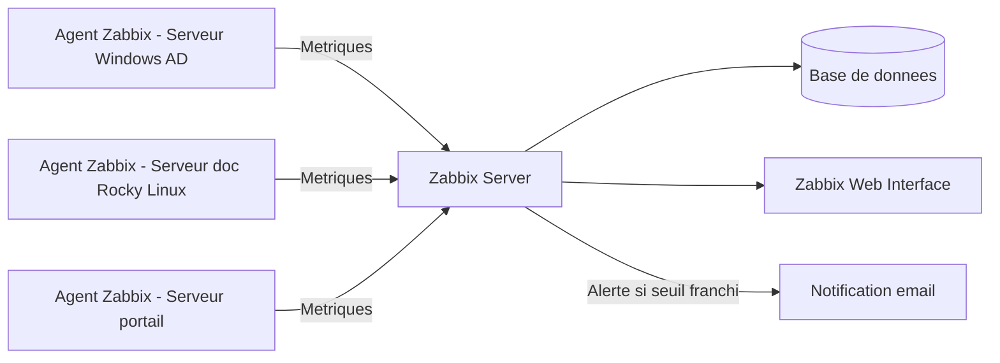

<div class="chapitre-titre-num">CHAPITRE 59</div>

# Zabbix

<div class="encadre objectif">
<span class="encadre-titre">🎯 Objectif du chapitre</span>
Mettre en pratique les principes de supervision du chapitre 58 avec Zabbix, une solution open source complète largement utilisée en entreprise pour superviser un parc de serveurs hétérogène. À la fin de ce chapitre, tu sauras installer un agent Zabbix, définir des éléments à surveiller (items), configurer des seuils d'alerte (triggers) sans reproduire l'erreur de fatigue d'alerte du chapitre précédent, et réutiliser une configuration standard sur plusieurs hôtes via des templates.
</div>

<div class="encadre scenario">
<span class="encadre-titre">🎬 Mise en situation</span>
Suite à l'incident du chapitre 58, le DSI demande la mise en place rapide d'une supervision sur l'ensemble du parc de serveurs — un mélange de serveurs Windows Server (chapitres 5-13) et de serveurs Linux (chapitres 14-21), avec une dizaine de machines au total entre Port-au-Prince et Cap-Haïtien. L'équipe cherche une solution capable de couvrir cette hétérogénéité avec un seul outil, sans devoir apprendre et maintenir des systèmes différents pour chaque famille de serveurs. Zabbix, avec son modèle client-serveur portable sur Windows comme sur Linux, correspond directement à ce besoin.
</div>

## 59.1 Pourquoi Zabbix : une solution tout-en-un pour un parc hétérogène

<div class="encadre bonne-pratique">
<span class="encadre-titre">✅ Un choix pragmatique, rappel du même raisonnement qu'aux chapitres 14 et 46</span>
Zabbix est choisi ici pour la même raison pragmatique qui avait guidé le choix d'Ubuntu Server au chapitre 14 ou d'AWS au chapitre 46 : une solution unique, largement documentée, capable de couvrir Windows et Linux sans outillage séparé, réduisant la charge d'apprentissage et de maintenance pour une équipe encore restreinte. Ce choix n'exclut pas l'usage complémentaire d'autres outils plus spécialisés pour des besoins précis, comme le chapitre suivant le montrera avec Prometheus pour l'environnement Kubernetes du portail client.
</div>

## 59.2 Architecture Zabbix : serveur, agents, base de données



<div class="encadre retenir">
<span class="encadre-titre">📌 À retenir</span>
Le **Zabbix Server** centralise la collecte et l'évaluation des seuils ; un **agent Zabbix**, installé sur chaque machine surveillée, remonte périodiquement ses métriques locales vers le serveur ; une **base de données** conserve l'historique des mesures ; une **interface web** permet de consulter l'état du parc et de configurer la supervision.
</div>

## 59.3 Installer et configurer un agent Zabbix

```bash
# Sur le serveur de gestion documentaire (Rocky Linux)
sudo dnf install zabbix-agent2
sudo systemctl enable --now zabbix-agent2
```

```ini
# /etc/zabbix/zabbix_agent2.conf
Server=10.10.1.5
ServerActive=10.10.1.5
Hostname=doc-cap-01
```

<div class="encadre securite">
<span class="encadre-titre">🔒 Sécurité</span>
Ouvre uniquement le port de l'agent Zabbix (10050/TCP par défaut) entre les hôtes surveillés et le serveur Zabbix, jamais vers Internet — la segmentation réseau déjà pratiquée par VLAN au chapitre 11 s'applique intégralement à ce trafic de supervision.
</div>

## 59.4 Items : définir quoi mesurer

<div class="encadre retenir">
<span class="encadre-titre">📌 À retenir</span>
Un **item** correspond à une métrique unique surveillée sur un hôte donné — l'espace disque disponible sur `/`, l'utilisation CPU, la disponibilité du service. Zabbix propose de nombreux items préconfigurés, notamment via ses templates (section 59.7), évitant de redéfinir manuellement chaque métrique élémentaire pour chaque nouvel hôte.
</div>

## 59.5 Triggers : configurer des seuils sans reproduire l'erreur du chapitre 58

<div class="encadre attention">
<span class="encadre-titre">⚠️ Application directe de la section 58.7</span>
Un **trigger** Zabbix définit la condition qui déclenche une alerte à partir d'un ou plusieurs items. Pour reprendre l'exemple du chapitre 58, un trigger mal conçu se contenterait de comparer instantanément l'espace disque à un seuil ; un trigger bien conçu exige un maintien de la condition pendant une durée minimale, exactement le principe déjà établi pour éviter la fatigue d'alerte.
</div>

```
last(/doc-cap-01/vfs.fs.size[/,pfree],#5)<15
```

<div class="encadre astuce">
<span class="encadre-titre">💡 Explication de l'expression</span>
Cette expression déclenche le trigger uniquement si les 5 dernières mesures consécutives de l'espace disque libre (`#5`) sont toutes inférieures à 15 %, plutôt que sur une seule mesure isolée potentiellement temporaire — une application concrète du principe "seuil maintenu dans le temps" de la section 58.7.
</div>

## 59.6 Actions : transformer un trigger en notification concrète

<div class="encadre bonne-pratique">
<span class="encadre-titre">✅ Rappel direct de la section 58.8</span>
Une **action** Zabbix relie un trigger déclenché à une notification effective (email, SMS, webhook) envoyée à un destinataire précis — sans action correctement configurée, un trigger déclenché reste invisible, reproduisant exactement le risque déjà dénoncé d'une supervision techniquement fonctionnelle mais jamais consultée.
</div>

## 59.7 Templates : réutiliser une configuration standard, encore le même principe

<div class="encadre astuce">
<span class="encadre-titre">💡 Rappel indirect des chapitres 53 et 55</span>
Un **template** Zabbix regroupe un ensemble d'items, de triggers et d'actions réutilisables, appliqué en un clic à n'importe quel hôte du même type — exactement le même principe déjà rencontré pour les rôles Ansible (chapitre 53) et les modules Terraform (chapitre 55) : définir une configuration standard une seule fois, puis l'appliquer de façon cohérente à plusieurs cibles, plutôt que de répéter manuellement la même configuration hôte par hôte, un risque de dérive déjà dénoncé au chapitre 52.
</div>

## 59.8 Tableaux de bord natifs : un aperçu avant Grafana

<div class="encadre retenir">
<span class="encadre-titre">📌 À retenir</span>
Zabbix propose ses propres tableaux de bord intégrés, suffisants pour un usage quotidien standard. Le chapitre 61 présentera Grafana, souvent connecté à Zabbix comme source de données pour produire des visualisations plus riches et personnalisées, particulièrement utiles pour une présentation à la direction ou un tableau de bord combinant plusieurs sources de supervision.
</div>

## Atelier — Superviser le serveur de gestion documentaire avec Zabbix

<div class="encadre exercice">
<span class="encadre-titre">🛠️ Atelier 59 — Mettre en œuvre le plan de supervision du chapitre 58</span>

**Objectif** : configurer dans Zabbix le plan de supervision minimal défini à l'atelier du chapitre 58 pour le serveur de gestion documentaire.

**Préparation** : un serveur Zabbix fonctionnel et un agent installé sur le serveur cible (section 59.3).

**Étapes détaillées** :

1. Vérifie que l'hôte `doc-cap-01` apparaît "disponible" dans l'interface Zabbix.
2. Configure un trigger sur l'espace disque disponible reprenant le seuil défini à l'atelier 58 (15 % pendant une durée maintenue).
3. Configure une action envoyant une notification email à l'équipe infrastructure dès le déclenchement de ce trigger.
4. Explique pourquoi la création d'un template regroupant ces éléments serait préférable à une configuration répétée manuellement sur chaque nouveau serveur Linux ajouté au parc.
5. Compare ta démarche à la section "Résultat attendu".

**Résultat attendu** : le trigger reprend l'expression de la section 59.5, avec un maintien de 5 mesures consécutives sous le seuil de 15 %, évitant une alerte sur une fluctuation normale et temporaire. L'action associée envoie une notification email uniquement au moment du déclenchement effectif du trigger, garantissant qu'un destinataire réel reçoit l'alerte (section 59.6). Un template regroupant cet item, ce trigger et cette action permettrait d'appliquer la même supervision standardisée à tout nouveau serveur Linux ajouté au parc en une seule opération, plutôt que de répéter manuellement cette configuration à chaque nouvel hôte — le même bénéfice de cohérence déjà obtenu avec les rôles Ansible au chapitre 53.

**Dépannage** : si l'hôte apparaît "non disponible" dans Zabbix malgré un agent installé et démarré, vérifie en priorité que le pare-feu de l'hôte surveillé autorise le port 10050/TCP depuis l'adresse du serveur Zabbix — la cause la plus fréquente de ce symptôme.
</div>

## Erreurs fréquentes

<div class="encadre attention">
<span class="encadre-titre">⚠️ Erreur n°1 — un pare-feu bloquant la communication entre l'agent et le serveur</span>
Rappel de la section 59.3 : sans ouverture explicite du port de l'agent, l'hôte apparaît systématiquement "non disponible" malgré une installation par ailleurs correcte.
</div>

<div class="encadre attention">
<span class="encadre-titre">⚠️ Erreur n°2 — des triggers sans durée minimale de maintien du seuil</span>
Rappel de la section 59.5 : reproduit exactement l'erreur de fatigue d'alerte déjà dénoncée au chapitre 58.
</div>

<div class="encadre attention">
<span class="encadre-titre">⚠️ Erreur n°3 — une configuration répétée manuellement, hôte par hôte, sans template</span>
Rappel de la section 59.7 : reproduit le même risque de dérive de configuration déjà dénoncé pour l'administration manuelle multi-serveurs au chapitre 52.
</div>

## Diagnostiquer un hôte affiché "non disponible"

<div class="encadre attention">
<span class="encadre-titre">🩺 Symptôme : un hôte configuré dans Zabbix apparaît "non disponible" (rouge) dans l'interface</span>

- **Diagnostic** : vérifier dans l'ordre : le service de l'agent est-il démarré sur l'hôte ? le pare-feu de l'hôte autorise-t-il le port 10050/TCP depuis l'adresse du serveur Zabbix ? l'adresse configurée dans Zabbix pour cet hôte correspond-elle bien à l'adresse réelle de la machine ?
- **Comment vérifier** : tenter une connexion réseau directe depuis le serveur Zabbix vers le port de l'agent (`telnet <ip_agent> 10050` ou équivalent).
- **Résolution** : la cause la plus fréquente reste un pare-feu bloquant, suivie d'un service agent non démarré — les deux se corrigent rapidement une fois identifiés.
</div>

## En entreprise

- **Bonne pratique répandue** : construire un template standard par famille de serveur (serveur Windows générique, serveur Linux générique, serveur de base de données) et l'appliquer systématiquement à chaque nouvel hôte du même type.
- **Bonne pratique répandue** : documenter la liste des destinataires de chaque type d'alerte, avec une astreinte claire en dehors des heures de bureau pour les alertes les plus critiques.
- **Erreur classique observée** : une supervision Zabbix mise en place avec enthousiasme au départ, puis abandonnée progressivement faute de maintenance des templates lors de l'ajout de nouveaux serveurs — la supervision doit rester un réflexe intégré au processus de mise en production, pas une action ponctuelle isolée.

## Entretien technique

<div class="encadre exercice">
<span class="encadre-titre">💼 Questions fréquemment posées en entretien</span>

**Q1. "Quels sont les composants principaux d'une architecture Zabbix ?"**
Réponse attendue : le serveur Zabbix (collecte et évaluation), les agents installés sur chaque hôte surveillé (remontée des métriques), une base de données (historique) et une interface web (consultation et configuration).

**Q2. "Pourquoi configurer un trigger avec un maintien de plusieurs mesures consécutives plutôt qu'une seule mesure instantanée ?"**
Réponse attendue : pour éviter de déclencher une alerte sur une fluctuation normale et temporaire, exactement le même principe de dosage des seuils déjà établi pour éviter la fatigue d'alerte.

**Q3. "Quel est l'intérêt d'un template Zabbix par rapport à une configuration manuelle hôte par hôte ?"**
Réponse attendue : garantir une configuration cohérente et reproductible sur tous les hôtes du même type, évitant la dérive de configuration, et permettant d'appliquer une supervision standardisée en une seule opération à tout nouvel hôte ajouté au parc.
</div>

## Optimisation, sécurité et maintenabilité — les réflexes dès ce chapitre

<div class="encadre securite">
<span class="encadre-titre">🔒 Sécurité</span>
N'ouvre le port de l'agent Zabbix qu'entre les hôtes surveillés et le serveur Zabbix, jamais plus largement, et restreins l'accès à l'interface web Zabbix elle-même aux seules personnes autorisées.
</div>

<div class="encadre bonne-pratique">
<span class="encadre-titre">✅ Maintenabilité</span>
Privilégie systématiquement les templates plutôt que la configuration manuelle répétée — un changement de seuil appliqué au template se propage automatiquement à tous les hôtes qui l'utilisent, plutôt que de nécessiter une modification répétée sur chaque hôte individuellement.
</div>

<div class="encadre performance">
<span class="encadre-titre">🚀 Performance</span>
Adapte l'intervalle de collecte de chaque item à sa criticité réelle — une métrique critique peut être collectée toutes les minutes, tandis qu'une métrique moins urgente peut l'être toutes les heures, réduisant la charge globale sur le serveur Zabbix et sur les hôtes surveillés.
</div>

## Résumé du chapitre

- Zabbix est choisi ici pour sa capacité à couvrir un parc hétérogène Windows/Linux avec un seul outil, pour une équipe encore restreinte.
- L'architecture Zabbix repose sur un serveur central, des agents locaux, une base de données et une interface web.
- Un item définit une métrique surveillée ; un trigger définit le seuil qui déclenche une alerte ; une action transforme ce déclenchement en notification effective.
- Un trigger doit exiger un maintien du seuil dans le temps, pas une simple mesure instantanée, pour éviter la fatigue d'alerte déjà dénoncée au chapitre 58.
- Un template regroupe une configuration standard réutilisable, appliquée en une seule opération à tout nouvel hôte du même type.
- Les tableaux de bord natifs de Zabbix suffisent à un usage quotidien ; Grafana (chapitre 61) permettra des visualisations plus riches.

## Quiz

<div class="encadre exercice">
<span class="encadre-titre">📝 QCM (une seule bonne réponse par question)</span>

1. Dans l'architecture Zabbix, l'agent est installé :
   - a) Uniquement sur le serveur Zabbix central
   - b) Sur chaque hôte à surveiller
   - c) Uniquement sur les postes des administrateurs
   - d) Dans le navigateur web

2. Un trigger Zabbix sert à :
   - a) Collecter une métrique brute
   - b) Définir la condition qui déclenche une alerte
   - c) Installer automatiquement un agent
   - d) Remplacer le besoin d'un item

3. L'intérêt principal d'un template Zabbix est de :
   - a) Réduire le nombre de serveurs à superviser
   - b) Appliquer une configuration standard et cohérente à plusieurs hôtes du même type
   - c) Remplacer complètement le besoin d'une base de données
   - d) Chiffrer automatiquement les communications entre agents

**Corrigé** : 1-b, 2-b, 3-b.
</div>

<div class="encadre exercice">
<span class="encadre-titre">📝 Vrai ou Faux</span>

1. Un hôte "non disponible" dans Zabbix est le plus souvent causé par un pare-feu bloquant la communication avec l'agent. — **Vrai**.
2. Un trigger déclenché sans action associée envoie automatiquement une notification par défaut. — **Faux** (une action doit être explicitement configurée, section 59.6).
3. Zabbix peut superviser à la fois des serveurs Windows et des serveurs Linux avec le même outil. — **Vrai**.
4. Un template Zabbix doit être reconfiguré intégralement pour chaque nouvel hôte auquel il est appliqué. — **Faux** (c'est précisément l'inverse, section 59.7).
</div>

<div class="encadre exercice">
<span class="encadre-titre">📝 Questions ouvertes</span>

1. Explique pourquoi Zabbix a été choisi dans le scénario d'ouverture plutôt qu'un outil spécialisé sur une seule famille de systèmes, en te référant au raisonnement déjà appliqué au chapitre 14.
2. Un collègue configure un trigger déclenchant une alerte dès qu'une seule mesure d'utilisation CPU dépasse 90 %. Explique le risque de cette configuration et propose une amélioration.

**Corrigé 1** : au chapitre 14, Ubuntu Server avait été choisi non pas parce qu'il était objectivement supérieur à toute alternative, mais parce qu'il correspondait au contexte réel de l'équipe (familiarité, documentation abondante) pour un besoin donné. Le choix de Zabbix suit exactement le même raisonnement pragmatique : plutôt que de déployer un outil spécialisé Windows et un outil spécialisé Linux séparément, doublant la charge d'apprentissage et de maintenance pour une équipe encore restreinte, un outil unique capable de couvrir les deux familles de systèmes réduit la complexité opérationnelle tout en répondant pleinement au besoin exprimé par le DSI.

**Corrigé 2** : un trigger déclenché sur une seule mesure instantanée capture également les pics de charge normaux et temporaires — un serveur peut légitimement atteindre 90 % de CPU pendant quelques secondes lors d'une tâche ponctuelle, sans que cela ne représente un problème réel. Cette configuration reproduit exactement l'erreur de fatigue d'alerte dénoncée à la section 58.7 et rappelée à la section 59.5. Une amélioration consisterait à exiger un maintien de ce seuil sur plusieurs mesures consécutives (par exemple 5 mesures, comme dans l'exemple de la section 59.5), filtrant les pics normaux tout en conservant la capacité de détecter une charge réellement anormale et prolongée.
</div>

## Exercices

<div class="encadre exercice">
<span class="encadre-titre">📝 Exercice 59.1</span>

Un nouveau serveur Linux rejoint le parc de l'entreprise. Décris, dans l'ordre, les étapes nécessaires pour le superviser via Zabbix en réutilisant au maximum la configuration existante plutôt qu'en la recréant manuellement.
</div>

**Corrigé :** 1) Installer l'agent Zabbix sur le nouveau serveur et le configurer pour pointer vers le serveur Zabbix central (section 59.3). 2) Ajouter le nouvel hôte dans l'interface Zabbix. 3) Appliquer le template standard déjà défini pour les serveurs Linux (section 59.7), qui applique automatiquement l'ensemble des items, triggers et actions déjà configurés pour ce type de serveur, plutôt que de les recréer un par un. 4) Vérifier que l'hôte apparaît "disponible" et que les premières métriques remontent correctement. Cette démarche garantit une supervision cohérente avec celle des autres serveurs Linux du parc dès la mise en production du nouveau serveur, sans effort de configuration répété.

<div class="encadre exercice">
<span class="encadre-titre">📝 Exercice 59.2</span>

Rédige, en 3 à 5 phrases, pourquoi restreindre l'accès réseau au port de l'agent Zabbix constitue une mesure de sécurité pertinente, même si l'agent lui-même ne fait que remonter des métriques.
</div>

**Corrigé (exemple de réponse) :** Un agent de supervision, même limité à la remontée de métriques, expose un service réseau supplémentaire sur chaque hôte surveillé — toute surface d'exposition réseau supplémentaire représente un point d'entrée potentiel à sécuriser, exactement le même principe déjà appliqué à tout service exposé dans ce manuel. Un accès non restreint au port de l'agent pourrait permettre à un attaquant ayant déjà accès au réseau interne de récupérer des informations sur l'état des systèmes (charge, services actifs), utiles pour préparer une attaque ultérieure plus ciblée. Restreindre ce port aux seules adresses légitimes du serveur Zabbix, via la segmentation VLAN déjà pratiquée au chapitre 11, réduit cette surface d'exposition sans compliquer le fonctionnement normal de la supervision.

## Checklist de fin de chapitre

<ul class="checklist">
<li>☐ Je comprends pourquoi Zabbix a été choisi pour couvrir un parc hétérogène Windows/Linux.</li>
<li>☐ Je sais installer et configurer un agent Zabbix.</li>
<li>☐ Je sais définir un item, un trigger et une action.</li>
<li>☐ Je sais configurer un trigger avec un maintien du seuil pour éviter la fatigue d'alerte.</li>
<li>☐ Je comprends l'intérêt d'un template par rapport à une configuration manuelle répétée.</li>
<li>☐ Je sais diagnostiquer un hôte affiché "non disponible" dans Zabbix.</li>
</ul>

## FAQ

<dl class="faq">
<dt>Zabbix peut-il superviser des équipements réseau (commutateurs, pare-feu), pas seulement des serveurs ?</dt>
<dd>Oui, via le protocole SNMP notamment, Zabbix peut également superviser des équipements réseau — une capacité qui sera pertinente lors de la Partie 11 consacrée au réseau d'entreprise avancé.</dd>

<dt>Faut-il un serveur Zabbix par site (Port-au-Prince et Cap-Haïtien), ou un seul serveur central suffit-il ?</dt>
<dd>Un seul serveur central reste généralement suffisant pour une infrastructure de cette taille, à condition que la liaison réseau entre les sites soit fiable — une architecture distribuée avec des proxys Zabbix par site devient pertinente pour des infrastructures plus grandes ou des liaisons réseau moins fiables.</dd>

<dt>Zabbix remplace-t-il le besoin de Prometheus présenté au chapitre suivant ?</dt>
<dd>Non, les deux répondent à des besoins souvent complémentaires plutôt que concurrents — Zabbix convient bien à la supervision classique d'un parc de serveurs, tandis que Prometheus s'intègre plus naturellement à un environnement cloud-native comme Kubernetes, comme le chapitre 60 le détaillera.</dd>

<dt>Les templates Zabbix officiels couvrent-ils la plupart des besoins courants ?</dt>
<dd>Oui, Zabbix fournit de nombreux templates officiels préconfigurés pour les systèmes d'exploitation courants et de nombreuses applications répandues, réduisant significativement le travail de configuration initial par rapport à une création entièrement manuelle.</dd>
</dl>

## Références et pour aller plus loin

- Documentation officielle Zabbix : [https://www.zabbix.com/documentation/current/en/manual](https://www.zabbix.com/documentation/current/en/manual)
- Zabbix — Bibliothèque de templates officiels : [https://www.zabbix.com/integrations](https://www.zabbix.com/integrations)

*Chapitre suivant : Prometheus — une approche différente de la supervision, particulièrement adaptée à l'environnement Kubernetes du portail client construit dans la Partie 7 de ce manuel.*
