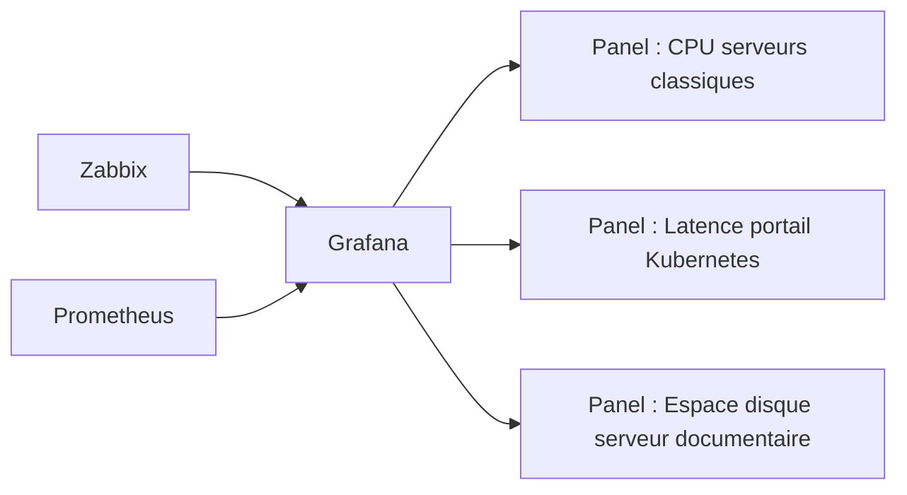

<div class="chapitre-titre-num">CHAPITRE 61</div>

# Grafana

<div class="encadre objectif">
<span class="encadre-titre">🎯 Objectif du chapitre</span>
Construire des tableaux de bord visuels combinant les données de Zabbix (chapitre 59) et de Prometheus (chapitre 60) dans une même interface, pour rendre l'état de santé de l'ensemble de l'infrastructure immédiatement lisible, y compris pour un public non technique. À la fin de ce chapitre, tu sauras connecter Grafana à plusieurs sources de données, construire un tableau de bord avec des variables réutilisables, et configurer les accès de façon appropriée selon le public visé.
</div>

<div class="encadre scenario">
<span class="encadre-titre">🎬 Mise en situation</span>
Après la mise en place de Zabbix et de Prometheus, la direction demande un point de situation mensuel sur la santé de l'infrastructure. L'administrateur se retrouve à basculer entre deux interfaces distinctes, à faire des captures d'écran séparées, et à expliquer pourquoi deux outils différents sont nécessaires. <em>"Je veux une seule page qui montre l'essentiel, sans devoir connaître Zabbix ni Prometheus pour la comprendre,"</em> résume le DSI. Grafana répond directement à ce besoin : une couche de visualisation unique, indépendante de l'outil de collecte sous-jacent.
</div>

## 61.1 Grafana : une couche de visualisation indépendante des sources

<div class="encadre astuce">
<span class="encadre-titre">💡 Analogie — un tableau de bord de pilotage unique pour plusieurs instruments</span>
Grafana ne collecte lui-même aucune métrique — il se connecte à des sources de données existantes (Zabbix, Prometheus, et bien d'autres) pour en afficher le contenu de façon unifiée. C'est l'équivalent d'un tableau de bord de pilotage centralisant l'affichage de plusieurs instruments indépendants (altimètre, radar, jauge de carburant), chacun produit par un fabricant différent, dans une seule vue cohérente pour le pilote.
</div>

## 61.2 Connecter plusieurs sources de données simultanément

<div class="encadre retenir">
<span class="encadre-titre">📌 À retenir — la réponse directe au problème du scénario d'ouverture</span>
Une même instance Grafana peut se connecter simultanément à Zabbix et à Prometheus (ainsi qu'à d'autres sources), et afficher leurs données côte à côte sur un même tableau de bord — éliminant le besoin de basculer entre deux interfaces distinctes pour obtenir une vision d'ensemble de l'infrastructure.
</div>

```
Configuration > Data sources > Add data source
  - Zabbix (via l'API Zabbix)
  - Prometheus (via son endpoint HTTP)
```

## 61.3 Construire un tableau de bord : panels et requêtes

<div class="encadre retenir">
<span class="encadre-titre">📌 À retenir</span>
Un tableau de bord Grafana est composé de **panels**, chacun affichant le résultat d'une requête vers une source de données donnée — un graphique de l'utilisation CPU issu de Zabbix, une jauge de latence issue d'une requête PromQL vers Prometheus, ou une simple valeur numérique mise en évidence. Chaque panel reste indépendant, permettant de composer librement une vue combinant plusieurs sources sur un même écran.


</div>

## 61.4 Variables de tableau de bord : un même dashboard pour plusieurs contextes

<div class="encadre astuce">
<span class="encadre-titre">💡 Rappel indirect des chapitres 53, 55 et 59 — encore le même principe de réutilisation</span>
Une **variable** de tableau de bord permet de construire un panel générique (par exemple "utilisation CPU du serveur sélectionné") plutôt qu'un panel figé pour un seul serveur précis — l'utilisateur choisit ensuite le serveur concerné via un menu déroulant, sans qu'aucune duplication de tableau de bord ne soit nécessaire. Ce principe rejoint exactement celui déjà rencontré pour les rôles Ansible, les modules Terraform et les templates Zabbix : définir une fois, réutiliser partout, plutôt que dupliquer une configuration presque identique pour chaque cas particulier — évitant ici la même erreur de duplication déjà dénoncée pour Terraform au chapitre 55.
</div>

## 61.5 Alerting Grafana : le même piège, une nouvelle fois

<div class="encadre attention">
<span class="encadre-titre">⚠️ Rappel direct — la troisième fois que ce principe apparaît dans ce manuel</span>
Grafana peut également déclencher ses propres alertes à partir des données affichées. Exactement le même principe déjà établi pour les triggers Zabbix (section 59.5) et les règles Prometheus (section 60.6) s'applique une nouvelle fois : une alerte doit exiger un maintien de la condition dans le temps, pas une seule mesure instantanée, sous peine de reproduire la même fatigue d'alerte déjà rencontrée à deux reprises.
</div>

## 61.6 Partager un tableau de bord avec un public non technique

<div class="encadre bonne-pratique">
<span class="encadre-titre">✅ Adapter le niveau de détail au public visé</span>
Un tableau de bord destiné à la direction devrait privilégier quelques indicateurs de haut niveau, clairement légendés et sans jargon technique — une disponibilité globale en pourcentage, un nombre d'incidents en cours — plutôt que de reproduire la densité d'information d'un tableau de bord destiné à l'équipe technique. Grafana permet de construire plusieurs tableaux de bord distincts à partir des mêmes sources de données, chacun adapté à son public.
</div>

## 61.7 Contrôler les accès aux tableaux de bord

<div class="encadre securite">
<span class="encadre-titre">🔒 Sécurité — rappel indirect du principe de moindre privilège déjà établi aux chapitres 22-25</span>
Tout le monde ne devrait pas avoir accès à tous les tableaux de bord, ni au même niveau de droits — un tableau de bord affichant des données de sécurité sensibles ne devrait être visible que par les personnes autorisées, et la capacité de modifier un tableau de bord partagé devrait rester limitée à l'équipe qui le maintient. Grafana permet de définir des rôles et des permissions par tableau de bord ou par dossier, exactement le même principe de moindre privilège déjà appliqué à Active Directory.
</div>

## Atelier — Construire le tableau de bord pour la direction

<div class="encadre exercice">
<span class="encadre-titre">🛠️ Atelier 61 — Répondre à la demande du scénario d'ouverture</span>

**Objectif** : construire un tableau de bord combinant Zabbix et Prometheus, adapté à une présentation mensuelle à la direction.

**Préparation** : Grafana installé, connecté aux sources de données Zabbix (chapitre 59) et Prometheus (chapitre 60).

**Étapes détaillées** :

1. Ajoute les deux sources de données à Grafana (section 61.2).
2. Construis un panel affichant l'espace disque disponible du serveur de gestion documentaire (source Zabbix).
3. Construis un panel affichant la latence moyenne du portail client (source Prometheus, requête PromQL de la section 60.5).
4. Ajoute une variable permettant de sélectionner le site (Port-au-Prince ou Cap-Haïtien) sans dupliquer le tableau de bord.
5. Explique pourquoi ce tableau de bord ne devrait pas inclure les mêmes détails techniques qu'un tableau de bord destiné à l'équipe infrastructure.
6. Compare ta démarche à la section "Résultat attendu".

**Résultat attendu** : le tableau de bord combine des panels issus de deux sources de données distinctes sur un seul écran, résolvant directement le problème du scénario d'ouverture — plus besoin de basculer entre deux interfaces séparées. La variable de site (section 61.4) évite de dupliquer le tableau de bord pour chaque site, un même dashboard générique s'adaptant au site sélectionné. Pour un public de direction, les indicateurs devraient rester simples et peu nombreux (section 61.6) — une disponibilité globale, un nombre d'incidents — plutôt que la densité de détails techniques qui submergerait un public non familier avec l'infrastructure.

**Dépannage** : si un panel affiche "No data" malgré une source de données correctement configurée, vérifie en priorité la plage temporelle sélectionnée en haut du tableau de bord — une cause fréquente de ce symptôme est une plage temporelle ne couvrant aucune donnée réellement collectée.
</div>

## Erreurs fréquentes

<div class="encadre attention">
<span class="encadre-titre">⚠️ Erreur n°1 — un accès total accordé à tout le monde sur tous les tableaux de bord</span>
Rappel de la section 61.7 : reproduit le même risque déjà dénoncé pour un accès administrateur non restreint dans Active Directory.
</div>

<div class="encadre attention">
<span class="encadre-titre">⚠️ Erreur n°2 — un tableau de bord surchargé de panels, illisible en un coup d'œil</span>
Rappel de la section 61.6 : un tableau de bord destiné à un public non technique doit rester simple, sous peine de perdre son utilité première.
</div>

<div class="encadre attention">
<span class="encadre-titre">⚠️ Erreur n°3 — un tableau de bord dupliqué pour chaque environnement au lieu d'utiliser des variables</span>
Rappel de la section 61.4 : reproduit exactement la même erreur de duplication déjà dénoncée pour Terraform au chapitre 55.
</div>

## Diagnostiquer un panel affichant "No data"

<div class="encadre attention">
<span class="encadre-titre">🩺 Symptôme : un panel Grafana affiche "No data" malgré une source de données a priori fonctionnelle</span>

- **Diagnostic** : vérifier dans l'ordre : la plage temporelle sélectionnée couvre-t-elle une période où des données existent réellement ? la requête du panel est-elle syntaxiquement correcte pour la source concernée ? la source de données elle-même répond-elle correctement en dehors de Grafana ?
- **Comment vérifier** : tester la requête directement dans l'outil source (interface Zabbix ou requête PromQL brute dans Prometheus) pour confirmer si le problème vient de la requête elle-même ou de la configuration Grafana.
- **Résolution** : la cause la plus fréquente reste une plage temporelle mal choisie, suivie d'une erreur de syntaxe dans la requête du panel.
</div>

## En entreprise

- **Bonne pratique répandue** : organiser les tableaux de bord par dossiers selon leur public (direction, équipe infrastructure, équipe sécurité), avec des permissions d'accès adaptées à chaque dossier.
- **Bonne pratique répandue** : limiter le nombre de tableaux de bord "officiels" largement partagés, en encourageant les tableaux de bord personnels ou d'équipe pour l'exploration ponctuelle, évitant une prolifération de tableaux de bord obsolètes et jamais maintenus.
- **Erreur classique observée** : un tableau de bord construit une fois pour une présentation ponctuelle, jamais mis à jour ensuite, présenté des mois plus tard comme s'il reflétait l'état actuel — une pratique risquée si les panels reposent sur des requêtes devenues obsolètes après un changement d'infrastructure.

## Entretien technique

<div class="encadre exercice">
<span class="encadre-titre">💼 Questions fréquemment posées en entretien</span>

**Q1. "Quel est le rôle de Grafana par rapport à des outils comme Zabbix ou Prometheus ?"**
Réponse attendue : Grafana ne collecte pas lui-même de métriques — il se connecte à des sources de données existantes pour en afficher le contenu de façon unifiée, permettant de combiner plusieurs outils de collecte dans une même interface visuelle.

**Q2. "Pourquoi utiliser des variables dans un tableau de bord Grafana plutôt que de dupliquer le tableau de bord pour chaque serveur ou environnement ?"**
Réponse attendue : une variable permet de construire un tableau de bord générique, sélectionnable dynamiquement par l'utilisateur, évitant la duplication et la dérive de configuration qui en découlerait — exactement le même principe de réutilisation déjà rencontré pour les rôles Ansible et les modules Terraform.

**Q3. "Pourquoi adapter le contenu d'un tableau de bord au public visé, plutôt que d'utiliser un seul et même tableau de bord pour tous ?"**
Réponse attendue : un public technique et un public de direction n'ont pas les mêmes besoins d'information — un tableau de bord surchargé de détails techniques perd son utilité pour un public non familier, tandis qu'un tableau de bord trop simplifié ne suffit pas aux besoins d'analyse fine de l'équipe technique.
</div>

## Optimisation, sécurité et maintenabilité — les réflexes dès ce chapitre

<div class="encadre securite">
<span class="encadre-titre">🔒 Sécurité</span>
Applique le principe de moindre privilège aux tableaux de bord Grafana, en particulier pour ceux affichant des données sensibles — tout le monde n'a pas besoin d'un accès en modification, ni même en lecture, à chaque tableau de bord existant.
</div>

<div class="encadre bonne-pratique">
<span class="encadre-titre">✅ Maintenabilité</span>
Privilégie systématiquement les variables de tableau de bord à la duplication manuelle — un changement de structure (nouveau panel, nouvelle métrique) appliqué à un tableau de bord générique se propage automatiquement à tous les contextes qui l'utilisent.
</div>

<div class="encadre performance">
<span class="encadre-titre">🚀 Performance</span>
Un tableau de bord avec un grand nombre de panels et un intervalle de rafraîchissement automatique très court peut générer une charge de requêtes significative sur les sources de données sous-jacentes — adapte l'intervalle de rafraîchissement à la criticité réelle du tableau de bord concerné.
</div>

## Résumé du chapitre

- Grafana ne collecte pas lui-même de métriques — il visualise les données de sources existantes comme Zabbix et Prometheus dans une interface unifiée.
- Un tableau de bord est composé de panels, chacun affichant le résultat d'une requête vers une source de données donnée.
- Les variables de tableau de bord permettent un dashboard générique réutilisable, plutôt qu'une duplication pour chaque contexte.
- L'alerting Grafana exige, comme Zabbix et Prometheus avant lui, un maintien de la condition dans le temps pour éviter la fatigue d'alerte.
- Le contenu d'un tableau de bord doit être adapté à son public — un public de direction a besoin de moins de détails qu'une équipe technique.
- L'accès aux tableaux de bord doit être contrôlé selon le principe de moindre privilège, particulièrement pour les données sensibles.

## Quiz

<div class="encadre exercice">
<span class="encadre-titre">📝 QCM (une seule bonne réponse par question)</span>

1. Grafana se distingue de Zabbix et Prometheus principalement parce qu'il :
   - a) Collecte lui-même les métriques du système
   - b) Visualise les données de sources existantes sans les collecter lui-même
   - c) Remplace complètement le besoin de Zabbix et Prometheus
   - d) Ne peut se connecter qu'à une seule source de données à la fois

2. Une variable de tableau de bord Grafana sert principalement à :
   - a) Chiffrer les données affichées
   - b) Construire un tableau de bord générique réutilisable pour plusieurs contextes
   - c) Remplacer le besoin de panels
   - d) Accélérer la collecte des métriques

3. Un tableau de bord destiné à la direction devrait :
   - a) Contenir autant de détails techniques que possible
   - b) Rester simple, avec quelques indicateurs de haut niveau clairement légendés
   - c) Être identique au tableau de bord de l'équipe technique
   - d) Ne jamais être partagé en dehors de l'équipe infrastructure

**Corrigé** : 1-b, 2-b, 3-b.
</div>

<div class="encadre exercice">
<span class="encadre-titre">📝 Vrai ou Faux</span>

1. Grafana peut afficher, sur un même tableau de bord, des données issues à la fois de Zabbix et de Prometheus. — **Vrai**.
2. Une alerte Grafana devrait se déclencher sur une seule mesure instantanée pour une réaction plus rapide. — **Faux** (fatigue d'alerte, section 61.5).
3. Tous les utilisateurs devraient disposer d'un accès en modification à tous les tableaux de bord, par souci de transparence. — **Faux** (section 61.7).
4. Un tableau de bord surchargé de panels reste tout aussi efficace pour un public non technique qu'un tableau de bord simplifié. — **Faux** (section 61.6).
</div>

<div class="encadre exercice">
<span class="encadre-titre">📝 Questions ouvertes</span>

1. Explique en quoi le problème rencontré par l'administrateur dans le scénario d'ouverture (basculer entre deux interfaces) est directement résolu par les sections 61.1 et 61.2.
2. Un collègue propose de créer un tableau de bord distinct pour chacun des dix serveurs du parc, plutôt qu'un seul tableau de bord générique avec une variable de sélection. Explique pourquoi cette approche pose un problème de maintenabilité à long terme.

**Corrigé 1** : le problème du scénario d'ouverture provenait du fait que Zabbix et Prometheus, bien que tous deux fonctionnels, restaient deux interfaces séparées, obligeant l'administrateur à consulter l'une puis l'autre pour obtenir une vision complète. Grafana, en se connectant simultanément aux deux sources de données (section 61.2) et en permettant d'afficher leurs résultats côte à côte sur un même tableau de bord (section 61.1), élimine ce besoin de bascule — une seule interface suffit désormais pour présenter une vision combinée et cohérente de l'infrastructure, répondant directement à la demande initiale du DSI.

**Corrigé 2** : dix tableaux de bord quasiment identiques, ne différant que par le serveur concerné, reproduisent exactement le même problème de duplication déjà dénoncé pour la configuration Terraform au chapitre 55 — toute modification de structure (ajout d'un panel, changement d'une requête) devrait alors être répétée manuellement sur les dix tableaux de bord, avec un risque élevé d'oubli et de dérive progressive entre eux. Un seul tableau de bord générique avec une variable de sélection de serveur (section 61.4) élimine ce risque : toute modification de structure s'applique automatiquement à l'ensemble des serveurs disponibles dans la variable, sans effort de duplication ni risque d'incohérence entre les différentes vues.
</div>

## Exercices

<div class="encadre exercice">
<span class="encadre-titre">📝 Exercice 61.1</span>

Propose une organisation de dossiers et de permissions Grafana pour l'entreprise du fil rouge, distinguant au minimum trois publics différents (direction, équipe infrastructure, équipe sécurité), en t'appuyant sur le principe de moindre privilège de la section 61.7.
</div>

**Corrigé :** Un dossier "Direction" contiendrait un nombre restreint de tableaux de bord simplifiés (disponibilité globale, incidents en cours), accessible en lecture seule à la direction et en modification uniquement à l'équipe infrastructure qui les maintient. Un dossier "Infrastructure" contiendrait des tableaux de bord détaillés issus de Zabbix et Prometheus, accessible en lecture et modification à l'équipe infrastructure uniquement. Un dossier "Sécurité", contenant des tableaux de bord potentiellement sensibles (tentatives d'authentification échouées, alertes de sécurité), resterait accessible uniquement à l'équipe sécurité et à la RSSI, en cohérence avec le principe de moindre privilège déjà appliqué à Active Directory depuis les chapitres 22-25 — chaque public accède exactement à ce dont il a besoin, ni plus ni moins.

<div class="encadre exercice">
<span class="encadre-titre">📝 Exercice 61.2</span>

Rédige, en 3 à 5 phrases, pourquoi un tableau de bord Grafana ne remplace pas le besoin de configurer des alertes directement dans Zabbix ou Prometheus, même s'il peut afficher visuellement les mêmes données.
</div>

**Corrigé (exemple de réponse) :** Un tableau de bord Grafana affiche visuellement un état, mais ne notifie personne activement tant qu'une personne ne le consulte pas elle-même — il complète les alertes de Zabbix et Prometheus sans les remplacer. Une alerte configurée directement dans l'outil de collecte (ou dans Grafana lui-même via son propre système d'alerting, section 61.5) reste nécessaire pour garantir qu'un problème soit signalé activement à un destinataire, même si personne ne consulte le tableau de bord au moment précis où le problème survient. Un tableau de bord sans alerte associée reproduit ainsi le même risque déjà dénoncé au chapitre 58 : une supervision techniquement fonctionnelle, mais dont personne n'est activement informé au bon moment.

## Checklist de fin de chapitre

<ul class="checklist">
<li>☐ Je comprends le rôle de Grafana comme couche de visualisation indépendante des sources de données.</li>
<li>☐ Je sais connecter Grafana à Zabbix et Prometheus simultanément.</li>
<li>☐ Je sais construire un tableau de bord avec plusieurs panels issus de sources différentes.</li>
<li>☐ Je sais utiliser une variable de tableau de bord pour éviter la duplication.</li>
<li>☐ Je comprends pourquoi le contenu d'un tableau de bord doit être adapté à son public.</li>
<li>☐ Je sais appliquer le principe de moindre privilège aux accès des tableaux de bord.</li>
</ul>

## FAQ

<dl class="faq">
<dt>Grafana peut-il se connecter à d'autres sources de données que Zabbix et Prometheus ?</dt>
<dd>Oui, Grafana prend en charge un grand nombre de sources de données (bases de données relationnelles, ELK présenté au chapitre suivant, services cloud), ce qui en fait souvent un point de convergence unique pour l'ensemble de la supervision d'une organisation, quel que soit le nombre d'outils de collecte utilisés.</dd>

<dt>Faut-il recréer manuellement chaque tableau de bord, ou existe-t-il des modèles prêts à l'emploi ?</dt>
<dd>De nombreux tableaux de bord communautaires prêts à l'emploi existent pour des sources courantes (métriques Kubernetes, métriques systèmes Linux), réduisant significativement le travail de conception initial par rapport à une création entièrement manuelle.</dd>

<dt>Grafana peut-il fonctionner sans Zabbix ni Prometheus, avec une seule source de données ?</dt>
<dd>Oui, Grafana fonctionne tout aussi bien avec une seule source de données — l'intérêt de combiner plusieurs sources, illustré dans ce chapitre, devient particulièrement net à mesure que l'infrastructure combine plusieurs outils de collecte différents.</dd>

<dt>Les tableaux de bord Grafana peuvent-ils être exportés et versionnés dans Git ?</dt>
<dd>Oui, un tableau de bord peut être exporté au format JSON et versionné dans un dépôt Git, rejoignant le même principe de configuration versionnée déjà établi pour l'infrastructure elle-même depuis le chapitre 51 — une pratique de plus en plus répandue pour garantir la traçabilité des tableaux de bord critiques.</dd>
</dl>

## Références et pour aller plus loin

- Documentation officielle Grafana : [https://grafana.com/docs/grafana/latest/](https://grafana.com/docs/grafana/latest/)
- Grafana — Bibliothèque de tableaux de bord communautaires : [https://grafana.com/grafana/dashboards/](https://grafana.com/grafana/dashboards/)

*Chapitre suivant : la pile ELK (Elasticsearch, Logstash, Kibana) — approfondir le pilier des logs déjà évoqué au chapitre 58, pour centraliser et analyser à grande échelle les journaux d'événements de l'ensemble de l'infrastructure.*
