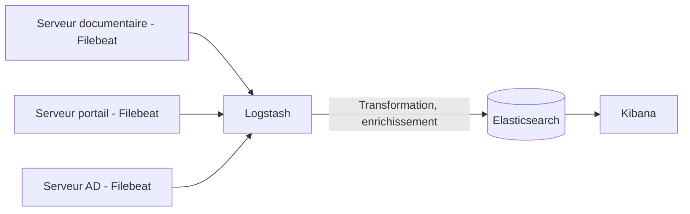

<div class="chapitre-titre-num">CHAPITRE 62</div>

# La pile ELK (Elasticsearch, Logstash, Kibana)

<div class="encadre objectif">
<span class="encadre-titre">🎯 Objectif du chapitre</span>
Approfondir le pilier des logs déjà évoqué au chapitre 58, en centralisant et en rendant recherchables les journaux d'événements de l'ensemble de l'infrastructure via la pile ELK (Elasticsearch, Logstash, Kibana). À la fin de ce chapitre, tu comprendras le rôle de chacun des trois composants, tu sauras centraliser les logs d'un serveur via un agent léger, et tu sauras rechercher un événement précis à travers l'ensemble du parc en une seule recherche plutôt que serveur par serveur.
</div>

<div class="encadre scenario">
<span class="encadre-titre">🎬 Mise en situation</span>
Un incident de sécurité mineur est suspecté : plusieurs tentatives de connexion échouées sur un compte administrateur. Pour comprendre l'ampleur du problème, l'équipe doit déterminer si ces tentatives concernent uniquement le serveur d'authentification ou si elles apparaissent également ailleurs dans le parc. La méthode actuelle consiste à se connecter en SSH ou en RDP à chacun des dix serveurs, un par un, et à consulter manuellement leurs journaux locaux — une opération lente, fastidieuse, et qui retarde dangereusement la compréhension d'un incident potentiellement en cours. <em>"On ne peut pas se permettre de perdre une heure à chercher un log pendant un incident de sécurité,"</em> observe la RSSI. La pile ELK résout précisément ce problème.
</div>

## 62.1 Le problème : chercher un événement dans dix journaux séparés

<div class="encadre retenir">
<span class="encadre-titre">📌 À retenir — le même pilier "logs" déjà introduit au chapitre 58, mais à l'échelle du parc entier</span>
Le chapitre 58 introduisait les logs comme l'un des trois piliers de l'observabilité, répondant à la question "que s'est-il passé, et quand". Sans centralisation, cette question devient très coûteuse à répondre dès que plusieurs serveurs sont potentiellement concernés — chaque serveur conserve ses propres journaux localement, invisibles depuis les autres. Centraliser ces journaux dans un même système consultable transforme une recherche qui prendrait une heure en une opération de quelques secondes.
</div>

## 62.2 Trois composants complémentaires

<div class="encadre astuce">
<span class="encadre-titre">💡 Analogie — le même schéma en couches déjà rencontré avec Prometheus et Grafana</span>
La pile ELK combine trois composants distincts, chacun avec un rôle précis : **Logstash** (ou une alternative plus légère comme Filebeat) collecte et transforme les logs à la source ; **Elasticsearch** les stocke et les indexe pour une recherche rapide ; **Kibana** offre l'interface de recherche et de visualisation. Cette séparation des responsabilités rejoint le même schéma en couches déjà rencontré entre les exporters, Prometheus et Grafana (chapitres 60-61) : collecter, stocker/indexer, visualiser — trois étapes distinctes confiées à des composants spécialisés plutôt qu'à un outil unique et monolithique.
</div>



## 62.3 Elasticsearch : un moteur de recherche et d'indexation

<div class="encadre retenir">
<span class="encadre-titre">📌 À retenir</span>
**Elasticsearch** stocke les logs sous une forme indexée, optimisée pour la recherche rapide sur de très grands volumes de texte — une recherche portant sur des millions de lignes de logs répartis sur plusieurs jours peut ainsi retourner un résultat en quelques centaines de millisecondes, une performance impossible à obtenir en parcourant manuellement des fichiers texte bruts.
</div>

## 62.4 Logstash : collecter, transformer et enrichir avant stockage

<div class="encadre retenir">
<span class="encadre-titre">📌 À retenir — un pipeline, au sens différent de celui du chapitre 56</span>
**Logstash** applique un pipeline de traitement aux logs bruts avant leur indexation — extraire des champs structurés d'une ligne de texte brute (adresse IP, nom d'utilisateur, code de retour), normaliser un format de date, ou enrichir un événement avec des informations complémentaires (localisation géographique d'une adresse IP, par exemple). Le terme "pipeline" ici désigne un enchaînement de transformations de données, à ne pas confondre avec le pipeline d'intégration continue Jenkins du chapitre 56 — même mot, deux contextes distincts dans ce manuel.
</div>

```ruby
# Exemple de configuration Logstash simplifiee
filter {
  grok {
    match => { "message" => "%{IP:client_ip} - %{WORD:utilisateur} - %{GREEDYDATA:action}" }
  }
}
```

## 62.5 Filebeat : un agent léger, comparable aux exporters et agents déjà rencontrés

<div class="encadre astuce">
<span class="encadre-titre">💡 Rappel direct des chapitres 59 et 60 — encore le même schéma d'agent léger</span>
**Filebeat** est un agent léger installé sur chaque serveur, chargé uniquement de transmettre les logs locaux vers Logstash ou directement vers Elasticsearch, sans effectuer lui-même de transformation lourde — exactement le même rôle qu'un agent Zabbix (section 59.3) ou un exporter Prometheus (section 60.3) : un composant local minimal, dont la seule responsabilité est de transmettre fidèlement des données brutes vers un système central plus lourd et plus riche en fonctionnalités.
</div>

```yaml
# filebeat.yml
filebeat.inputs:
  - type: log
    paths:
      - /var/log/secure
      - /var/log/gestion-documentaire/*.log
output.logstash:
  hosts: ["10.10.1.6:5044"]
```

## 62.6 Kibana : rechercher et visualiser les logs centralisés

<div class="encadre retenir">
<span class="encadre-titre">📌 À retenir</span>
**Kibana** offre l'interface permettant de rechercher, filtrer et visualiser les logs indexés dans Elasticsearch — une recherche comme "toutes les tentatives de connexion échouées sur le compte `admin` au cours des dernières 24 heures, tous serveurs confondus" devient une simple requête, plutôt qu'une inspection manuelle serveur par serveur.
</div>

## 62.7 Résoudre concrètement le scénario d'ouverture

<div class="encadre bonne-pratique">
<span class="encadre-titre">✅ Une recherche unique plutôt que dix connexions successives</span>
Avec les logs de l'ensemble du parc centralisés dans Elasticsearch, la recherche des tentatives de connexion échouées suspectées dans le scénario d'ouverture devient une seule requête Kibana, filtrée sur l'événement recherché et sur l'ensemble des hôtes du parc simultanément — révélant en quelques secondes si le problème est isolé à un seul serveur ou déjà répandu, une information critique pour évaluer la gravité réelle de l'incident.
</div>

## Atelier — Centraliser et rechercher un événement de sécurité

<div class="encadre exercice">
<span class="encadre-titre">🛠️ Atelier 62 — Reproduire l'investigation du scénario d'ouverture</span>

**Objectif** : centraliser les logs d'authentification du serveur documentaire et du serveur d'authentification, puis rechercher les tentatives de connexion échouées.

**Préparation** : une pile ELK fonctionnelle, avec Filebeat installé sur les deux serveurs concernés.

**Étapes détaillées** :

1. Configure Filebeat sur les deux serveurs pour transmettre leurs journaux d'authentification (section 62.5).
2. Vérifie dans Kibana que les logs des deux serveurs apparaissent bien dans le même index.
3. Construis une recherche Kibana filtrant les événements de connexion échouée sur le compte `admin`, tous serveurs confondus.
4. Explique comment cette recherche unique remplace la procédure manuelle décrite dans le scénario d'ouverture.
5. Compare ta démarche à la section "Résultat attendu".

**Résultat attendu** : une fois les deux serveurs configurés avec Filebeat, leurs logs apparaissent centralisés dans le même index Elasticsearch, consultable depuis une seule interface Kibana. La recherche filtrée sur les tentatives échouées du compte `admin` retourne en une seule requête l'ensemble des occurrences sur les deux serveurs, avec leur horodatage précis — une réponse obtenue en quelques secondes, contre potentiellement une heure avec la méthode manuelle décrite dans le scénario d'ouverture.

**Dépannage** : si les logs d'un serveur n'apparaissent pas dans Kibana malgré une configuration Filebeat apparemment correcte, vérifie que le service Filebeat est bien démarré sur ce serveur et que la connexion réseau vers Logstash (port 5044 par défaut) n'est pas bloquée par un pare-feu.
</div>

## Erreurs fréquentes

<div class="encadre attention">
<span class="encadre-titre">⚠️ Erreur n°1 — aucune politique de rétention des index Elasticsearch</span>
Sans politique de rétention, les index Elasticsearch grossissent indéfiniment, consommant un espace disque croissant — le même risque de disque plein silencieux déjà rencontré au chapitre 58 et pour la rétention Prometheus au chapitre 60, appliqué ici au stockage des logs centralisés.
</div>

<div class="encadre attention">
<span class="encadre-titre">⚠️ Erreur n°2 — des logs non structurés, difficiles à filtrer précisément</span>
Un log envoyé sans transformation Logstash (section 62.4) reste une simple chaîne de texte brute, rendant les recherches précises (comme filtrer uniquement sur une adresse IP donnée) beaucoup plus difficiles qu'avec des champs structurés extraits à l'avance.
</div>

<div class="encadre attention">
<span class="encadre-titre">⚠️ Erreur n°3 — des données sensibles journalisées en clair et centralisées sans protection</span>
Centraliser des logs contenant, par erreur, des mots de passe ou d'autres données sensibles en clair concentre ce risque en un seul endroit particulièrement attractif pour un attaquant — la centralisation des logs ne dispense pas de la vigilance déjà recommandée ailleurs dans ce manuel sur le contenu journalisé lui-même.
</div>

## Diagnostiquer des logs manquants pour un hôte donné

<div class="encadre attention">
<span class="encadre-titre">🩺 Symptôme : les logs d'un serveur spécifique n'apparaissent plus dans Kibana</span>

- **Diagnostic** : ce symptôme appartient à la même famille de diagnostic déjà rencontrée pour une cible Zabbix "non disponible" (section 59, diagnostic) ou une cible Prometheus "down" (section 60, diagnostic) — un agent local (ici Filebeat) qui ne transmet plus ses données.
- **Comment vérifier** : vérifier que le service Filebeat est actif sur l'hôte concerné, et que la connexion réseau vers Logstash ou Elasticsearch reste fonctionnelle.
- **Résolution** : redémarrer le service Filebeat si celui-ci s'est arrêté, ou corriger le blocage réseau identifié — la cause la plus fréquente reste un service arrêté après une mise à jour ou un redémarrage du serveur sans relance automatique configurée.
</div>

## En entreprise

- **Bonne pratique répandue** : définir une politique de rétention explicite pour chaque index Elasticsearch, en fonction des besoins réels de conservation (souvent différenciés entre logs applicatifs courants et logs de sécurité, ces derniers nécessitant généralement une conservation plus longue pour des raisons de conformité).
- **Bonne pratique répandue** : centraliser en priorité les logs de sécurité (authentification, pare-feu, accès administratifs) avant les logs applicatifs moins critiques, pour maximiser le bénéfice de la centralisation sur les cas d'usage les plus sensibles.
- **Erreur classique observée** : une pile ELK déployée avec enthousiasme, puis dont personne ne configure d'alerte sur les recherches critiques (comme les tentatives de connexion échouées répétées) — la centralisation existe, mais reste purement passive, nécessitant qu'un humain pense à effectuer la recherche, plutôt que d'être notifié automatiquement.

## Entretien technique

<div class="encadre exercice">
<span class="encadre-titre">💼 Questions fréquemment posées en entretien</span>

**Q1. "Quel est le rôle de chacun des trois composants de la pile ELK ?"**
Réponse attendue : Elasticsearch stocke et indexe les logs pour une recherche rapide ; Logstash (ou Filebeat) collecte et transforme les logs à la source ; Kibana offre l'interface de recherche et de visualisation.

**Q2. "Pourquoi centraliser les logs plutôt que de les laisser sur chaque serveur individuellement ?"**
Réponse attendue : une recherche portant sur l'ensemble du parc devient une seule requête plutôt qu'une inspection manuelle serveur par serveur, un gain de temps critique notamment lors d'un incident de sécurité où la rapidité de compréhension de l'ampleur du problème est essentielle.

**Q3. "Quelle est la différence entre Filebeat et Logstash ?"**
Réponse attendue : Filebeat est un agent léger dont le seul rôle est de transmettre les logs bruts, comparable à un agent Zabbix ou un exporter Prometheus ; Logstash effectue des transformations plus lourdes (extraction de champs, enrichissement) avant l'indexation.
</div>

## Optimisation, sécurité et maintenabilité — les réflexes dès ce chapitre

<div class="encadre securite">
<span class="encadre-titre">🔒 Sécurité</span>
Ne journalise jamais de mot de passe ou de donnée sensible en clair — la centralisation des logs concentre ce risque en un seul endroit particulièrement attractif pour un attaquant, plutôt que de le disperser à travers plusieurs serveurs isolés.
</div>

<div class="encadre bonne-pratique">
<span class="encadre-titre">✅ Maintenabilité</span>
Définis une politique de rétention explicite dès la mise en place de la pile ELK, plutôt que de laisser les index grossir indéfiniment jusqu'à provoquer un problème d'espace disque.
</div>

<div class="encadre performance">
<span class="encadre-titre">🚀 Performance</span>
Une extraction de champs structurés via Logstash (section 62.4), bien que plus coûteuse à configurer initialement, rend les recherches ultérieures dans Kibana significativement plus rapides et précises qu'une recherche en texte libre sur des logs non structurés.
</div>

## Résumé du chapitre

- Sans centralisation, rechercher un événement à travers plusieurs serveurs nécessite une inspection manuelle lente et fastidieuse, particulièrement problématique lors d'un incident de sécurité.
- La pile ELK combine trois composants complémentaires : Elasticsearch (stockage indexé), Logstash (collecte et transformation), Kibana (recherche et visualisation).
- Filebeat, un agent léger comparable à un agent Zabbix ou un exporter Prometheus, transmet les logs bruts depuis chaque serveur.
- Une recherche centralisée transforme une investigation qui prendrait une heure en une opération de quelques secondes.
- Une politique de rétention explicite reste indispensable pour éviter que les index ne grossissent indéfiniment.
- La centralisation des logs ne dispense pas de la vigilance sur leur contenu — aucune donnée sensible ne devrait jamais y être journalisée en clair.

## Quiz

<div class="encadre exercice">
<span class="encadre-titre">📝 QCM (une seule bonne réponse par question)</span>

1. Dans la pile ELK, le composant responsable du stockage indexé des logs est :
   - a) Kibana
   - b) Elasticsearch
   - c) Filebeat
   - d) Grafana

2. Filebeat est comparable, par son rôle, à :
   - a) Un tableau de bord Grafana
   - b) Un agent léger comme un agent Zabbix ou un exporter Prometheus
   - c) Un pipeline Jenkins
   - d) Une base de données relationnelle

3. Le principal bénéfice de la centralisation des logs illustré par le scénario d'ouverture est :
   - a) La réduction du coût de stockage
   - b) La possibilité de rechercher un événement sur l'ensemble du parc en une seule requête
   - c) Le remplacement complet du besoin de Zabbix
   - d) Le chiffrement automatique des données sensibles

**Corrigé** : 1-b, 2-b, 3-b.
</div>

<div class="encadre exercice">
<span class="encadre-titre">📝 Vrai ou Faux</span>

1. Sans centralisation, une recherche d'événement à travers plusieurs serveurs nécessite généralement une inspection manuelle serveur par serveur. — **Vrai**.
2. Logstash et le pipeline Jenkins du chapitre 56 désignent exactement le même concept technique. — **Faux** (même mot, deux contextes distincts, section 62.4).
3. Une politique de rétention n'est pas nécessaire pour Elasticsearch, contrairement à Prometheus. — **Faux** (le même risque s'applique, section "Erreur n°1").
4. Il est acceptable de journaliser un mot de passe en clair tant que les logs restent centralisés et sécurisés. — **Faux** (section "Erreur n°3").
</div>

<div class="encadre exercice">
<span class="encadre-titre">📝 Questions ouvertes</span>

1. Explique pourquoi la centralisation des logs était particulièrement critique dans le contexte précis du scénario d'ouverture (un incident de sécurité potentiellement en cours), au-delà du simple confort d'usage quotidien.
2. Compare le rôle de Filebeat à celui d'un agent Zabbix (section 59.3) et d'un exporter Prometheus (section 60.3) — pourquoi ce schéma d'agent léger revient-il systématiquement dans les outils de supervision et de centralisation présentés dans cette partie du manuel ?

**Corrigé 1** : lors d'un incident de sécurité potentiellement en cours, chaque minute passée à rassembler l'information retarde d'autant la compréhension de l'ampleur réelle du problème et la décision d'une réponse appropriée. Une méthode manuelle, nécessitant de se connecter successivement à chaque serveur, introduit un délai directement proportionnel au nombre de serveurs du parc — un délai qui grandit avec la taille de l'infrastructure, au moment précis où la rapidité compte le plus. La centralisation élimine ce délai en rendant la recherche instantanée sur l'ensemble du parc simultanément, une différence qui peut avoir un impact réel sur la capacité de l'équipe à contenir un incident avant qu'il ne s'aggrave.

**Corrigé 2** : les trois — Filebeat, l'agent Zabbix et l'exporter Prometheus — partagent la même philosophie architecturale : un composant local minimal, à faible impact sur le système surveillé, dont la seule responsabilité est de transmettre fidèlement des données brutes vers un système central plus riche en fonctionnalités (traitement, indexation, alerting). Ce schéma revient systématiquement parce qu'il répond au même besoin structurel : éviter de charger chaque serveur individuel d'une logique complexe de traitement ou de stockage, en la concentrant plutôt dans un composant central unique, plus facile à maintenir, à mettre à jour et à faire évoluer qu'une multitude d'agents dispersés.
</div>

## Exercices

<div class="encadre exercice">
<span class="encadre-titre">📝 Exercice 62.1</span>

Propose une politique de rétention différenciée pour deux catégories de logs centralisés dans Elasticsearch : les logs applicatifs courants du portail client, et les logs d'authentification et d'accès administratif.
</div>

**Corrigé :** Les logs applicatifs courants du portail (accès normaux, requêtes standards) pourraient être conservés pendant une durée relativement courte, par exemple 30 jours, suffisante pour le diagnostic technique courant sans nécessiter un stockage prolongé pour des données à faible valeur d'investigation à long terme. Les logs d'authentification et d'accès administratif, en revanche, mériteraient une rétention nettement plus longue, par exemple 12 mois ou plus selon les exigences de conformité applicables, car ils constituent une source d'information critique en cas d'investigation de sécurité rétrospective — un incident découvert plusieurs mois après les faits nécessiterait de pouvoir encore consulter ces journaux. Cette différenciation reflète le même principe déjà appliqué à la criticité des sauvegardes (chapitre 27) : le niveau de protection et de conservation doit être proportionnel à la valeur et à la sensibilité réelle de la donnée concernée.

<div class="encadre exercice">
<span class="encadre-titre">📝 Exercice 62.2</span>

Rédige, en 3 à 5 phrases, une règle d'équipe garantissant qu'aucune donnée sensible n'est journalisée en clair avant sa centralisation dans Elasticsearch, en t'appuyant sur le risque décrit à la section "Erreur n°3".
</div>

**Corrigé (exemple de réponse) :** Toute application déployée dans l'infrastructure devra faire l'objet d'une revue explicite de ses journaux avant sa mise en production, vérifiant qu'aucun mot de passe, jeton d'authentification ou autre donnée sensible n'apparaît en clair dans les lignes de logs générées. Cette revue s'ajoutera aux vérifications déjà réalisées lors de l'analyse de sécurité du pipeline DevSecOps (chapitre 57), plutôt que de constituer une étape totalement séparée. Toute donnée sensible détectée dans un journal existant sera considérée comme un incident de sécurité à corriger en priorité, et non comme un simple défaut esthétique à traiter ultérieurement, compte tenu du risque de concentration que représente la centralisation de ces logs dans un système unique.

## Checklist de fin de chapitre

<ul class="checklist">
<li>☐ Je comprends pourquoi la centralisation des logs est particulièrement critique lors d'un incident de sécurité.</li>
<li>☐ Je sais distinguer le rôle d'Elasticsearch, de Logstash et de Kibana.</li>
<li>☐ Je comprends pourquoi Filebeat suit le même schéma d'agent léger qu'un agent Zabbix ou un exporter Prometheus.</li>
<li>☐ Je sais rechercher un événement précis à travers plusieurs hôtes dans Kibana.</li>
<li>☐ Je sais pourquoi une politique de rétention explicite reste indispensable pour Elasticsearch.</li>
<li>☐ Je comprends pourquoi aucune donnée sensible ne devrait jamais être journalisée en clair.</li>
</ul>

## FAQ

<dl class="faq">
<dt>Faut-il toujours utiliser Logstash, ou Filebeat seul suffit-il ?</dt>
<dd>Filebeat seul, envoyant directement vers Elasticsearch, suffit pour des besoins simples sans transformation complexe des logs ; Logstash devient pertinent dès que des transformations plus riches (extraction de champs, enrichissement) sont nécessaires avant l'indexation.</dd>

<dt>La pile ELK remplace-t-elle le besoin de Prometheus et Zabbix ?</dt>
<dd>Non, chacun couvre un pilier différent de l'observabilité déjà introduit au chapitre 58 — Zabbix et Prometheus se concentrent sur les métriques, la pile ELK se concentre sur les logs ; les trois se complètent au sein d'une stratégie d'observabilité complète, chacun connectable à Grafana pour une visualisation combinée.</dd>

<dt>Combien de temps faut-il pour centraliser les logs de l'ensemble d'un parc de dix serveurs ?</dt>
<dd>L'installation de Filebeat sur chaque serveur reste rapide individuellement, mais la définition d'une structure de logs cohérente et d'une politique de rétention réfléchie prend davantage de temps — une centralisation progressive, en commençant par les serveurs les plus critiques, reste plus réaliste qu'une bascule totale immédiate.</dd>

<dt>Existe-t-il des alternatives à la pile ELK ?</dt>
<dd>Oui, plusieurs alternatives existent, dont Graylog, présenté au chapitre suivant, qui répond à un besoin similaire de centralisation des logs avec une approche et une complexité opérationnelle différentes.</dd>
</dl>

## Références et pour aller plus loin

- Documentation officielle Elastic (Elasticsearch, Logstash, Kibana, Filebeat) : [https://www.elastic.co/guide/index.html](https://www.elastic.co/guide/index.html)
- Elastic — Guide de gestion du cycle de vie des index (ILM) : [https://www.elastic.co/guide/en/elasticsearch/reference/current/index-lifecycle-management.html](https://www.elastic.co/guide/en/elasticsearch/reference/current/index-lifecycle-management.html)

*Chapitre suivant : Graylog et Syslog centralisé — une approche alternative et souvent plus simple à opérer pour la centralisation des logs, particulièrement répandue pour la collecte des journaux d'équipements réseau.*
