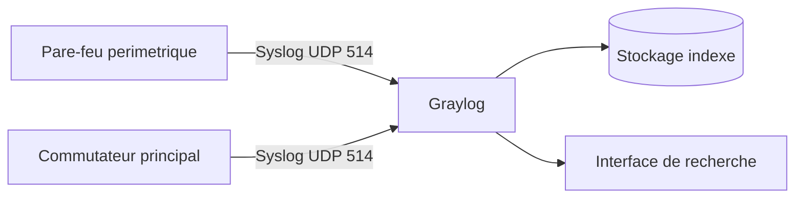

<div class="chapitre-titre-num">CHAPITRE 63</div>

# Graylog et Syslog centralisé

<div class="encadre objectif">
<span class="encadre-titre">🎯 Objectif du chapitre</span>
Étendre la centralisation des logs du chapitre 62 aux équipements qui ne peuvent pas exécuter un agent comme Filebeat — pare-feu, commutateurs, routeurs — via le protocole standard Syslog, et découvrir Graylog comme alternative plus légère à opérer que la pile ELK. À la fin de ce chapitre, tu sauras configurer un équipement réseau pour envoyer ses journaux vers un collecteur central, et tu sauras choisir entre ELK et Graylog selon le contexte réel de ton infrastructure.
</div>

<div class="encadre scenario">
<span class="encadre-titre">🎬 Mise en situation</span>
Après le succès de la centralisation des logs serveurs avec la pile ELK (chapitre 62), l'équipe souhaite étendre cette visibilité aux équipements réseau — le pare-feu périmétrique et les commutateurs principaux. Problème : ces équipements ne permettent pas d'installer Filebeat, l'agent utilisé jusqu'ici. Ils ne parlent qu'un protocole standard, ancien mais universellement supporté : Syslog. Par ailleurs, l'équipe, encore restreinte, trouve la pile ELK complète (trois composants distincts à maintenir) plus lourde à opérer qu'elle ne le souhaiterait pour ce besoin ciblé. Graylog, capable de recevoir nativement du Syslog avec une opération plus simple, répond aux deux contraintes.
</div>

## 63.1 Le problème : des équipements qui ne parlent pas le langage des agents modernes

<div class="encadre retenir">
<span class="encadre-titre">📌 À retenir</span>
Filebeat (section 62.5) suppose un système d'exploitation général capable d'exécuter un agent installé — un pare-feu ou un commutateur d'entreprise, souvent un système embarqué fermé, n'offre généralement pas cette possibilité. Ces équipements s'appuient à la place sur **Syslog**, un protocole de journalisation standardisé et supporté depuis des décennies par la quasi-totalité des équipements réseau, ce qui en fait le langage commun incontournable pour centraliser leurs journaux.
</div>

## 63.2 Syslog : le protocole standard de journalisation réseau

<div class="encadre retenir">
<span class="encadre-titre">📌 À retenir</span>
Syslog définit un format standard pour transmettre un message de journalisation d'un équipement source vers un serveur collecteur, généralement via le réseau (UDP ou TCP, port 514 par défaut). Chaque message Syslog inclut une **facility** (la catégorie source du message, comme "authentification" ou "système") et une **severity** (le niveau de gravité, de "debug" à "urgence"), permettant un filtrage standardisé indépendant du fabricant de l'équipement source.
</div>

```
<134>Jan 15 14:32:01 pare-feu-pap sshd[1234]: Failed password for admin from 41.20.15.3
```

<div class="encadre astuce">
<span class="encadre-titre">💡 Une classification, pas un seuil d'alerte</span>
La severity Syslog classe un message selon sa gravité intrinsèque au moment de son émission — elle ne doit pas être confondue avec les seuils d'alerte à maintien temporel déjà rencontrés à plusieurs reprises dans ce manuel (sections 58.7, 59.5, 60.6, 61.5). Un message Syslog de sévérité "critique" reste un événement ponctuel classé par l'équipement source ; une alerte de supervision, elle, se déclenche généralement sur une condition maintenue dans le temps à partir d'un ensemble de mesures.
</div>

## 63.3 Graylog : une alternative plus légère à opérer qu'ELK

<div class="encadre bonne-pratique">
<span class="encadre-titre">✅ Même finalité, complexité opérationnelle différente</span>
Graylog répond au même besoin fondamental que la pile ELK du chapitre précédent — centraliser, rechercher et analyser des logs — mais avec une architecture généralement perçue comme plus simple à opérer au quotidien pour une équipe restreinte, tout en conservant un support natif et particulièrement mature du protocole Syslog. Ce choix rejoint le même raisonnement pragmatique déjà appliqué à plusieurs reprises dans ce manuel (Ubuntu au chapitre 14, Zabbix au chapitre 59) : le bon outil est celui qui correspond au contexte réel de l'équipe, pas nécessairement celui qui offre objectivement le plus de fonctionnalités.
</div>



## 63.4 Configurer une source Syslog dans Graylog

```
Graylog > System > Inputs > Launch new input
  Type : Syslog UDP
  Port : 514
  Bind address : 0.0.0.0
```

```
# Sur le pare-feu (exemple generique)
logging host 10.10.1.8
logging trap informational
```

<div class="encadre securite">
<span class="encadre-titre">🔒 Sécurité</span>
Syslog transmis en UDP classique circule en clair sur le réseau, sans chiffrement ni authentification native — restreins ce trafic au VLAN d'administration déjà établi au chapitre 11, et privilégie une variante sécurisée (Syslog sur TLS) lorsque l'équipement source la supporte, particulièrement pour tout trafic traversant un segment réseau moins fiable.
</div>

## 63.5 Recherches et alertes dans Graylog

<div class="encadre attention">
<span class="encadre-titre">⚠️ Le même principe, une nouvelle fois</span>
Graylog permet de rechercher et de filtrer les messages Syslog reçus (par équipement source, par severity, par mot-clé) et de configurer des alertes sur des motifs récurrents — avec, comme pour tous les systèmes d'alerte déjà rencontrés dans cette partie du manuel, la même exigence de maintien dans le temps pour éviter la fatigue d'alerte plutôt qu'un déclenchement sur un seul message isolé.
</div>

## 63.6 Choisir entre ELK et Graylog : un choix de contexte, pas de supériorité absolue

<div class="encadre retenir">
<span class="encadre-titre">📌 À retenir — un tableau de décision honnête</span>

| Critère | Pile ELK (chapitre 62) | Graylog |
|---|---|---|
| Complexité opérationnelle | Plus élevée (trois composants distincts) | Généralement plus simple à opérer |
| Support natif Syslog | Correct, via configuration | Particulièrement mature et natif |
| Richesse de visualisation | Très riche (Kibana) | Correcte, moins étendue que Kibana |
| Écosystème et extensions | Très large | Plus restreint mais suffisant pour l'usage courant |

Aucun des deux outils n'est objectivement supérieur à l'autre dans l'absolu — le choix dépend du contexte réel : la richesse fonctionnelle d'ELK convient à une équipe disposant du temps nécessaire pour l'opérer pleinement ; la simplicité de Graylog convient à une équipe restreinte cherchant un résultat rapide et fiable, en particulier pour un besoin centré sur les équipements réseau via Syslog.
</div>

## Atelier — Centraliser les logs du pare-feu périmétrique

<div class="encadre exercice">
<span class="encadre-titre">🛠️ Atelier 63 — Répondre au besoin du scénario d'ouverture</span>

**Objectif** : configurer Graylog pour recevoir et rendre consultables les journaux du pare-feu périmétrique de l'entreprise.

**Préparation** : une instance Graylog fonctionnelle, un accès de configuration au pare-feu périmétrique.

**Étapes détaillées** :

1. Configure une source Syslog UDP dans Graylog (section 63.4).
2. Configure le pare-feu pour envoyer ses journaux vers l'adresse du serveur Graylog.
3. Vérifie que les messages apparaissent bien dans l'interface de recherche Graylog, avec leur facility et leur severity correctement identifiées.
4. Construis une recherche filtrant uniquement les messages de severity "critique" ou supérieure.
5. Explique pourquoi ce même besoin aurait été plus complexe à satisfaire directement avec Filebeat, tel qu'utilisé au chapitre 62.
6. Compare ta démarche à la section "Résultat attendu".

**Résultat attendu** : le pare-feu, incapable d'exécuter Filebeat, transmet nativement ses journaux via Syslog vers Graylog, qui les indexe et les rend immédiatement consultables. La recherche filtrée sur la severity permet d'isoler rapidement les événements les plus graves parmi le volume total de messages reçus. Ce besoin aurait nécessité un adaptateur ou une passerelle supplémentaire pour être satisfait via Filebeat, alors que Graylog le prend en charge nativement — illustrant concrètement pourquoi le choix de l'outil doit tenir compte du type de source à centraliser, pas seulement du besoin fonctionnel général de centralisation des logs.

**Dépannage** : si aucun message n'apparaît dans Graylog malgré une configuration apparemment correcte sur le pare-feu, vérifie en priorité que le port UDP 514 n'est pas bloqué entre le pare-feu et le serveur Graylog, et que l'input Syslog est bien démarré (statut "Running") dans l'interface Graylog.
</div>

## Erreurs fréquentes

<div class="encadre attention">
<span class="encadre-titre">⚠️ Erreur n°1 — du trafic Syslog non chiffré transitant sur un segment réseau non fiable</span>
Rappel de la section 63.4 : Syslog en UDP classique circule en clair, un risque à limiter au VLAN d'administration approprié.
</div>

<div class="encadre attention">
<span class="encadre-titre">⚠️ Erreur n°2 — aucune politique de rétention définie pour les index Graylog</span>
Le même risque de croissance indéfinie déjà dénoncé pour Elasticsearch au chapitre 62 s'applique tout autant au stockage sous-jacent de Graylog.
</div>

<div class="encadre attention">
<span class="encadre-titre">⚠️ Erreur n°3 — choisir un outil de centralisation unique sans considérer le type de sources à couvrir</span>
Rappel de la section 63.6 : un choix fait uniquement par préférence personnelle, sans considérer la nature réelle des sources (serveurs capables d'agents modernes contre équipements réseau limités à Syslog), risque de compliquer inutilement une partie de l'infrastructure.
</div>

## Diagnostiquer des logs Syslog qui n'arrivent jamais

<div class="encadre attention">
<span class="encadre-titre">🩺 Symptôme : un équipement configuré pour envoyer ses logs Syslog n'apparaît jamais dans Graylog</span>

- **Diagnostic** : vérifier dans l'ordre : l'input Syslog est-il bien démarré dans Graylog ? le port configuré sur l'équipement source correspond-il au port d'écoute de Graylog ? un pare-feu intermédiaire bloque-t-il le trafic UDP ou TCP concerné ?
- **Comment vérifier** : capturer le trafic réseau directement sur le serveur Graylog (une compétence approfondie au chapitre suivant) pour confirmer si les paquets Syslog atteignent réellement le serveur.
- **Résolution** : la cause la plus fréquente reste un pare-feu intermédiaire bloquant le port 514, suivie d'une erreur de configuration de l'adresse de destination sur l'équipement source.
</div>

## En entreprise

- **Bonne pratique répandue** : centraliser en priorité les journaux des équipements périmétriques (pare-feu, VPN) via Syslog, ces derniers constituant souvent la première source d'alerte en cas de tentative d'intrusion.
- **Bonne pratique répandue** : documenter clairement quel outil de centralisation couvre quelles sources, plutôt que de laisser cette décision implicite et sujette à confusion pour un nouvel arrivant dans l'équipe.
- **Erreur classique observée** : une organisation qui multiplie les outils de centralisation de logs sans jamais consolider une vue d'ensemble, se retrouvant avec des îlots d'information dispersés — l'objectif de centralisation initial se perd si chaque nouvel outil n'est pas positionné consciemment par rapport aux autres déjà en place.

## Entretien technique

<div class="encadre exercice">
<span class="encadre-titre">💼 Questions fréquemment posées en entretien</span>

**Q1. "Pourquoi le protocole Syslog reste-t-il incontournable pour la centralisation des logs d'équipements réseau ?"**
Réponse attendue : la plupart des équipements réseau (pare-feu, commutateurs, routeurs) sont des systèmes embarqués fermés qui ne permettent pas d'installer un agent moderne comme Filebeat, mais supportent presque universellement Syslog, un protocole standardisé depuis des décennies.

**Q2. "Quelle est la différence entre la severity d'un message Syslog et un seuil d'alerte de supervision ?"**
Réponse attendue : la severity Syslog classe un événement ponctuel selon sa gravité intrinsèque au moment de son émission par l'équipement source, tandis qu'un seuil d'alerte de supervision se déclenche généralement sur une condition maintenue dans le temps, calculée à partir de plusieurs mesures successives.

**Q3. "Comment choisir entre la pile ELK et Graylog pour un besoin de centralisation de logs ?"**
Réponse attendue : le choix dépend du contexte réel — la richesse fonctionnelle d'ELK convient à une équipe disposant du temps nécessaire pour opérer trois composants distincts ; la simplicité opérationnelle de Graylog et son support natif de Syslog conviennent mieux à une équipe restreinte ou à un besoin centré sur des équipements réseau.
</div>

## Optimisation, sécurité et maintenabilité — les réflexes dès ce chapitre

<div class="encadre securite">
<span class="encadre-titre">🔒 Sécurité</span>
Restreins le trafic Syslog au VLAN d'administration et privilégie une variante chiffrée lorsque l'équipement source la supporte — un flux de journalisation en clair reste une cible d'interception potentielle sur un réseau partagé.
</div>

<div class="encadre bonne-pratique">
<span class="encadre-titre">✅ Maintenabilité</span>
Documente explicitement quel outil de centralisation (ELK ou Graylog) couvre quelles sources, et pourquoi — une décision technique non documentée devient rapidement une source de confusion pour toute personne rejoignant l'équipe.
</div>

<div class="encadre performance">
<span class="encadre-titre">🚀 Performance</span>
Un volume élevé de messages Syslog en provenance d'équipements réseau très actifs peut rapidement saturer un serveur Graylog sous-dimensionné — adapte les ressources allouées au volume réel de messages attendu, particulièrement pour un pare-feu périmétrique recevant un trafic important.
</div>

## Résumé du chapitre

- Les équipements réseau ne peuvent généralement pas exécuter un agent moderne comme Filebeat, et s'appuient sur le protocole standard Syslog pour transmettre leurs journaux.
- Syslog classe chaque message par facility (catégorie source) et severity (gravité), un système de classification distinct des seuils d'alerte de supervision déjà rencontrés dans ce manuel.
- Graylog répond au même besoin de centralisation que la pile ELK, avec une complexité opérationnelle généralement moindre et un support Syslog particulièrement mature.
- Le choix entre ELK et Graylog dépend du contexte réel de l'équipe et du type de sources à centraliser, pas d'une supériorité absolue de l'un sur l'autre.
- Le trafic Syslog non chiffré doit être restreint à un segment réseau protégé, cohérent avec la segmentation VLAN déjà établie.
- Une politique de rétention explicite reste indispensable pour Graylog, comme pour tout système de centralisation de logs déjà rencontré dans ce manuel.

## Quiz

<div class="encadre exercice">
<span class="encadre-titre">📝 QCM (une seule bonne réponse par question)</span>

1. Le protocole Syslog est particulièrement pertinent pour centraliser les logs de :
   - a) Uniquement les serveurs Windows Server
   - b) Des équipements réseau comme les pare-feu et les commutateurs
   - c) Uniquement les applications conteneurisées
   - d) Uniquement les postes de travail utilisateurs

2. La severity d'un message Syslog représente :
   - a) Un seuil d'alerte maintenu dans le temps
   - b) La classification de gravité intrinsèque du message au moment de son émission
   - c) Le nombre de fois qu'un message a été répété
   - d) La durée de rétention du message

3. Le principal avantage de Graylog mis en avant dans ce chapitre est :
   - a) Une richesse fonctionnelle supérieure à celle de Kibana
   - b) Une complexité opérationnelle généralement moindre et un support natif mature de Syslog
   - c) Le remplacement complet du besoin de la pile ELK dans tous les contextes
   - d) L'absence totale de besoin de politique de rétention

**Corrigé** : 1-b, 2-b, 3-b.
</div>

<div class="encadre exercice">
<span class="encadre-titre">📝 Vrai ou Faux</span>

1. Un pare-feu d'entreprise peut généralement exécuter directement un agent Filebeat comme un serveur Linux classique. — **Faux** (section 63.1).
2. Le trafic Syslog en UDP classique circule en clair sur le réseau, sans chiffrement natif. — **Vrai**.
3. Graylog est objectivement supérieur à la pile ELK dans tous les contextes. — **Faux** (section 63.6, un choix de contexte).
4. La severity Syslog et un seuil d'alerte de supervision maintenu dans le temps désignent le même concept. — **Faux** (section 63.2).
</div>

<div class="encadre exercice">
<span class="encadre-titre">📝 Questions ouvertes</span>

1. Explique pourquoi l'équipe du scénario d'ouverture n'a pas simplement étendu son usage de la pile ELK et de Filebeat déjà en place au chapitre 62 pour couvrir également les équipements réseau.
2. Un collègue propose d'abandonner complètement la pile ELK au profit de Graylog pour l'ensemble de l'infrastructure, serveurs compris, "pour simplifier et n'avoir qu'un seul outil". Discute les avantages et les limites de cette proposition.

**Corrigé 1** : Filebeat suppose un système d'exploitation général capable d'exécuter un agent logiciel installé — un pare-feu ou un commutateur d'entreprise est généralement un système embarqué fermé, sans cette capacité. Ces équipements s'appuient à la place sur Syslog, un protocole de transmission réseau standard qu'ils supportent nativement, sans nécessiter d'installation logicielle. Bien que la pile ELK puisse également recevoir du Syslog via une configuration adaptée, l'équipe a choisi Graylog pour ce besoin spécifique en raison de son support Syslog particulièrement mature et de sa complexité opérationnelle moindre pour une équipe encore restreinte — un choix de contexte plutôt qu'une limitation technique absolue de la pile ELK.

**Corrigé 2** : un seul outil de centralisation présente l'avantage réel de réduire la charge de maintenance et d'apprentissage pour l'équipe, en évitant de devoir opérer deux systèmes distincts. Cependant, cette simplification a un coût : Kibana offre une richesse de visualisation et un écosystème d'extensions plus étendus que Graylog (section 63.6), un avantage réel pour des analyses de logs plus poussées sur les serveurs applicatifs. La décision ne devrait donc pas se limiter au seul critère de simplicité, mais prendre en compte les besoins réels d'analyse pour chaque catégorie de source — reproduisant le même arbitrage déjà rencontré au chapitre 60 entre Zabbix et Prometheus : deux outils bien positionnés selon leur contexte respectif restent souvent préférables à un outil unique imposé partout par simple souci d'uniformité.
</div>

## Exercices

<div class="encadre exercice">
<span class="encadre-titre">📝 Exercice 63.1</span>

Un nouveau commutateur réseau est installé sur le site de Cap-Haïtien. Décris les étapes nécessaires pour centraliser ses journaux dans Graylog, dans le même esprit que l'atelier de ce chapitre.
</div>

**Corrigé :** 1) Vérifier que l'input Syslog est actif dans Graylog (section 63.4), en le créant si ce n'est pas déjà fait pour ce type de source. 2) Configurer le commutateur pour envoyer ses journaux Syslog vers l'adresse IP du serveur Graylog, sur le port 514 par défaut. 3) Vérifier la connectivité réseau entre le commutateur et le serveur Graylog, en s'assurant qu'aucun pare-feu intermédiaire ne bloque ce trafic, particulièrement pertinent entre deux sites distincts (Port-au-Prince et Cap-Haïtien) reliés par un lien VPN site à site. 4) Confirmer que les messages apparaissent dans l'interface de recherche Graylog avec la facility et la severity correctement identifiées. Cette démarche reproduit celle déjà appliquée au pare-feu périmétrique dans l'atelier de ce chapitre, appliquée ici à un nouvel équipement et un site distant.

<div class="encadre exercice">
<span class="encadre-titre">📝 Exercice 63.2</span>

Rédige, en 3 à 5 phrases, une politique d'équipe définissant quand utiliser la pile ELK et quand utiliser Graylog pour un nouveau besoin de centralisation de logs, en t'appuyant sur le tableau de décision de la section 63.6.
</div>

**Corrigé (exemple de réponse) :** Pour toute nouvelle source de logs provenant d'un serveur capable d'exécuter un agent moderne comme Filebeat, avec un besoin d'analyse ou de visualisation poussé, la pile ELK déjà en place restera l'outil de référence. Pour toute source limitée au protocole Syslog, notamment les équipements réseau (pare-feu, commutateurs, routeurs), Graylog sera privilégié en raison de son support natif plus mature de ce protocole et de sa complexité opérationnelle moindre. Toute exception à cette répartition devra être documentée avec sa justification, évitant qu'une décision ponctuelle ne devienne une source de confusion pour l'équipe ultérieurement, dans le même esprit que la documentation déjà recommandée à la section "Maintenabilité" de ce chapitre.

## Checklist de fin de chapitre

<ul class="checklist">
<li>☐ Je comprends pourquoi les équipements réseau s'appuient sur Syslog plutôt que sur un agent comme Filebeat.</li>
<li>☐ Je sais distinguer la facility et la severity d'un message Syslog.</li>
<li>☐ Je sais configurer une source Syslog dans Graylog et un équipement pour y envoyer ses journaux.</li>
<li>☐ Je comprends la différence entre la severity Syslog et un seuil d'alerte de supervision maintenu dans le temps.</li>
<li>☐ Je sais argumenter un choix entre la pile ELK et Graylog selon le contexte réel d'un besoin donné.</li>
<li>☐ Je sais diagnostiquer une absence de réception de logs Syslog.</li>
</ul>

## FAQ

<dl class="faq">
<dt>Graylog peut-il également recevoir des logs depuis des serveurs, comme le fait la pile ELK ?</dt>
<dd>Oui, Graylog peut recevoir des logs depuis de nombreuses sources au-delà de Syslog, y compris depuis des agents dédiés — le choix entre ELK et Graylog pour les serveurs reste donc une question de contexte et de préférence d'équipe plutôt qu'une limitation technique stricte de l'un ou l'autre outil.</dd>

<dt>Faut-il faire confiance par défaut aux messages Syslog reçus, sans vérification supplémentaire ?</dt>
<dd>Non, un message Syslog peut en théorie être falsifié par une source malveillante ayant accès au réseau — restreindre l'accès réseau au port Syslog aux seules adresses légitimes des équipements source (section "Sécurité") reste une précaution nécessaire, au même titre que pour tout service exposé sur le réseau.</dd>

<dt>Existe-t-il une version sécurisée et chiffrée de Syslog ?</dt>
<dd>Oui, Syslog sur TLS (souvent sur le port 6514) ajoute le chiffrement et une authentification du flux, recommandé lorsque l'équipement source le supporte, en particulier pour tout trafic traversant un segment réseau moins fiable qu'un VLAN d'administration dédié.</dd>

<dt>Combien de temps conserve-t-on généralement les logs Syslog d'un pare-feu périmétrique ?</dt>
<dd>Une durée de conservation plus longue que pour des logs applicatifs courants est généralement recommandée, ces journaux constituant souvent une preuve clé lors d'une investigation de sécurité rétrospective — la durée exacte dépend des exigences de conformité applicables à l'organisation, un sujet approfondi à la Partie 12 de ce manuel.</dd>
</dl>

## Références et pour aller plus loin

- Documentation officielle Graylog : [https://go2docs.graylog.org/](https://go2docs.graylog.org/)
- RFC 5424 — The Syslog Protocol : [https://www.rfc-editor.org/rfc/rfc5424](https://www.rfc-editor.org/rfc/rfc5424)

*Chapitre suivant : Wireshark et analyse de trafic réseau — descendre un niveau plus bas que les logs applicatifs, pour observer et diagnostiquer directement ce qui circule sur le réseau, paquet par paquet.*
