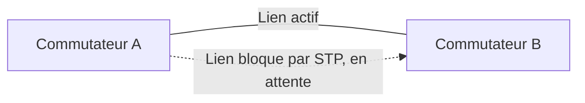

<div class="chapitre-titre-num">CHAPITRE 65</div>

# Cisco en environnement d'entreprise (niveau CCIE)

<div class="encadre objectif">
<span class="encadre-titre">🎯 Objectif du chapitre</span>
Ouvrir la Partie 11 de ce manuel en approfondissant les équipements réseau dont le chapitre 64 a montré comment observer et diagnostiquer le trafic — en particulier la résilience d'une infrastructure réseau d'entreprise, au-delà de la segmentation VLAN de base déjà couverte au chapitre 11. À la fin de ce chapitre, tu comprendras le rôle du Spanning Tree Protocol, de l'agrégation de liens (EtherChannel), de la redondance de passerelle (HSRP/VRRP), et du routage dynamique OSPF — les fondations d'un réseau d'entreprise conçu pour survivre à la panne d'un seul équipement.
</div>

<div class="encadre scenario">
<span class="encadre-titre">🎬 Mise en situation</span>
Le réseau du siège de Port-au-Prince repose actuellement sur un commutateur central unique et un routeur unique — la même architecture VLAN de base établie au chapitre 11, jamais remise en question depuis. Lors de la préparation du plan de continuité d'activité (PCA, chapitre 32), un exercice de simulation révèle que la panne de ce seul commutateur central couperait l'intégralité du réseau interne, y compris l'accès au serveur de gestion documentaire et à l'annuaire Active Directory — un point de défaillance unique que rien dans l'architecture actuelle ne protège. <em>"On a bâti toute une stratégie de sauvegarde et de reprise pour les serveurs,"</em> observe le DSI, <em>"mais le réseau lui-même reste un maillon fragile."</em> Ce chapitre corrige cette fragilité.
</div>

## 65.1 Le problème : un seul équipement, un seul point de défaillance

<div class="encadre retenir">
<span class="encadre-titre">📌 À retenir — rappel indirect du chapitre 32</span>
Exactement le même principe de continuité déjà appliqué aux serveurs (haute disponibilité, Partie 5) s'applique à l'infrastructure réseau elle-même : un réseau reposant sur un unique commutateur ou un unique routeur reste vulnérable à la panne de cet équipement, quelle que soit par ailleurs la robustesse des serveurs qu'il connecte. La redondance réseau consiste à ajouter des équipements et des liens physiques supplémentaires, sans jamais créer de nouveaux problèmes en retour — notamment les boucles réseau, abordées à la section suivante.
</div>

## 65.2 Spanning Tree Protocol : éviter les boucles en ajoutant de la redondance

<div class="encadre astuce">
<span class="encadre-titre">💡 Analogie — fermer les vannes en trop sur un réseau de tuyauterie en boucle</span>
Ajouter un second commutateur relié au premier par deux câbles distincts, pour la redondance, crée involontairement une boucle physique — un paquet Ethernet diffusé (broadcast) circulerait alors indéfiniment entre les deux liens, se multipliant à chaque passage jusqu'à saturer complètement le réseau (une "tempête de broadcast"). Le **Spanning Tree Protocol (STP)** détecte automatiquement cette boucle et désactive logiquement l'un des deux liens redondants, tout en le gardant prêt à reprendre le trafic instantanément si le lien actif tombe en panne — conservant ainsi le bénéfice de la redondance sans le risque de la boucle.
</div>



## 65.3 EtherChannel : agréger plusieurs liens physiques en un lien logique

<div class="encadre retenir">
<span class="encadre-titre">📌 À retenir</span>
**EtherChannel** regroupe plusieurs liens physiques entre deux équipements en un seul lien logique, combinant leur bande passante tout en offrant une tolérance de panne automatique : si l'un des câbles physiques est sectionné, le trafic continue de circuler sur les autres sans interruption ni reconfiguration manuelle. Contrairement à deux liens redondants classiques nécessitant le Spanning Tree Protocol pour éviter une boucle (section 65.2), les liens d'un EtherChannel sont traités comme un seul lien logique, ne créant donc aucune boucle à gérer.
</div>

```
interface range GigabitEthernet0/1-2
 channel-group 1 mode active
```

## 65.4 HSRP et VRRP : la redondance de la passerelle par défaut

<div class="encadre retenir">
<span class="encadre-titre">📌 À retenir — la réponse directe au problème du scénario d'ouverture</span>
**HSRP** (Hot Standby Router Protocol, propriétaire Cisco) et **VRRP** (Virtual Router Redundancy Protocol, standard ouvert) permettent à deux routeurs physiques de partager une seule adresse IP virtuelle, utilisée par l'ensemble des postes du réseau comme passerelle par défaut. Si le routeur actif tombe en panne, le routeur de secours prend automatiquement le relais sur cette même adresse virtuelle, en quelques secondes et sans qu'aucune configuration ne doive être modifiée sur les postes clients — résolvant directement le point de défaillance unique identifié dans le scénario d'ouverture pour la fonction de routage.
</div>

```
interface Vlan10
 ip address 10.10.10.2 255.255.255.0
 standby 1 ip 10.10.10.1
 standby 1 priority 110
 standby 1 preempt
```

<div class="encadre attention">
<span class="encadre-titre">⚠️ Le piège du "split brain"</span>
Une mauvaise configuration HSRP, où les deux routeurs se croient simultanément actifs (souvent après une coupure temporaire du lien qui les relie), peut provoquer des comportements réseau incohérents — un risque à surveiller particulièrement lors de la mise en service initiale et après tout changement de topologie.
</div>

## 65.5 Routage dynamique OSPF : au-delà des routes statiques

<div class="encadre astuce">
<span class="encadre-titre">💡 Rappel indirect du chapitre 11 — même principe de découverte automatique déjà rencontré</span>
Une route statique, configurée manuellement, doit être mise à jour à la main à chaque changement de topologie réseau — un risque de dérive et d'erreur similaire à celui déjà dénoncé pour toute configuration manuelle répétée dans ce manuel. **OSPF** (Open Shortest Path First) est un protocole de routage dynamique où les routeurs échangent automatiquement l'état de leurs liens et recalculent eux-mêmes le meilleur chemin vers chaque destination, y compris en cas de panne d'un lien — particulièrement pertinent pour relier les deux sites de Port-au-Prince et de Cap-Haïtien via plusieurs liens redondants, où une bascule automatique et rapide est préférable à une intervention manuelle en cas de coupure.
</div>

## 65.6 Segmentation avancée : le routage inter-VLAN redondant

<div class="encadre retenir">
<span class="encadre-titre">📌 À retenir</span>
Les VLAN déjà établis au chapitre 11 (segmentation par service ou par sensibilité) bénéficient directement de la redondance HSRP/VRRP : chaque VLAN dispose de sa propre passerelle virtuelle redondante, garantissant que la panne d'un routeur physique n'isole aucun segment du réseau, quel que soit le VLAN concerné.
</div>

## 65.7 Documentation rigoureuse : le niveau attendu d'une infrastructure d'entreprise

<div class="encadre bonne-pratique">
<span class="encadre-titre">✅ Rappel indirect du chapitre 2</span>
Une infrastructure réseau redondante, avec STP, EtherChannel, HSRP et OSPF combinés, devient significativement plus complexe à comprendre pour quiconque n'a pas participé à sa conception initiale. Une documentation à jour de la topologie physique et logique — schémas, priorités HSRP configurées, zones OSPF — reste indispensable, exactement le même principe de documentation déjà établi au chapitre 2 comme fondation du métier d'administrateur système.
</div>

## Atelier — Concevoir une topologie redondante pour le siège

<div class="encadre exercice">
<span class="encadre-titre">🛠️ Atelier 65 — Éliminer le point de défaillance unique du scénario d'ouverture</span>

**Objectif** : concevoir une architecture réseau redondante pour le siège de Port-au-Prince, éliminant le point de défaillance unique identifié dans le scénario d'ouverture.

**Préparation** : la topologie actuelle (un commutateur central, un routeur unique) comme point de départ.

**Étapes détaillées** :

1. Propose l'ajout d'un second commutateur central, relié au premier par deux liens physiques distincts en EtherChannel (section 65.3).
2. Propose l'ajout d'un second routeur, configuré en HSRP avec le routeur existant (section 65.4).
3. Explique pourquoi le Spanning Tree Protocol reste nécessaire même après la mise en place de l'EtherChannel, entre les deux commutateurs eux-mêmes reliés par ailleurs.
4. Explique comment cette nouvelle architecture répond directement à la préoccupation soulevée lors de l'exercice de simulation du PCA.
5. Compare ta démarche à la section "Résultat attendu".

**Résultat attendu** : avec un second commutateur et un second routeur configurés respectivement en EtherChannel et en HSRP, la panne d'un seul équipement (commutateur ou routeur) n'interrompt plus l'accès au réseau interne — le trafic bascule automatiquement vers l'équipement restant en quelques secondes. Le Spanning Tree Protocol reste nécessaire entre les deux commutateurs eux-mêmes s'ils sont reliés par des liens distincts de l'EtherChannel dédié à un autre usage, ou dans toute topologie où plusieurs chemins physiques distincts existent entre équipements. Cette architecture répond directement à la préoccupation du PCA en éliminant, pour la première fois, le point de défaillance unique identifié lors de l'exercice de simulation — le réseau lui-même bénéficie désormais du même niveau de continuité déjà appliqué aux serveurs critiques.

**Dépannage** : si les deux routeurs HSRP semblent tous deux actifs simultanément après un changement de configuration, vérifie en priorité la connectivité du lien qui les relie directement — une coupure temporaire de ce lien est la cause la plus fréquente d'un scénario de "split brain" (section 65.4).
</div>

## Erreurs fréquentes

<div class="encadre attention">
<span class="encadre-titre">⚠️ Erreur n°1 — des liens redondants ajoutés sans activer le Spanning Tree Protocol</span>
Rappel de la section 65.2 : provoque une tempête de broadcast pouvant rendre le réseau entier inutilisable en quelques secondes.
</div>

<div class="encadre attention">
<span class="encadre-titre">⚠️ Erreur n°2 — une configuration HSRP incohérente entre les deux routeurs</span>
Rappel de la section 65.4 : un risque de "split brain" si les deux routeurs se croient simultanément actifs.
</div>

<div class="encadre attention">
<span class="encadre-titre">⚠️ Erreur n°3 — une redondance mise en place sans documentation correspondante</span>
Rappel de la section 65.7 : une topologie redondante non documentée devient rapidement incompréhensible pour toute personne n'ayant pas participé à sa conception initiale.
</div>

## Diagnostiquer une tempête de broadcast

<div class="encadre attention">
<span class="encadre-titre">🩺 Symptôme : le réseau devient soudainement inutilisable, avec une charge CPU anormalement élevée sur les commutateurs</span>

- **Diagnostic** : ce symptôme est caractéristique d'une boucle réseau non gérée par le Spanning Tree Protocol, souvent provoquée par l'ajout récent d'un lien redondant ou d'un câble branché par erreur entre deux ports du même segment.
- **Comment vérifier** : consulter l'état du Spanning Tree Protocol sur les commutateurs concernés, et rechercher tout changement de câblage récent dans l'infrastructure.
- **Résolution** : débrancher le câble à l'origine de la boucle non gérée en priorité pour rétablir immédiatement le service, puis reconfigurer correctement le Spanning Tree Protocol avant de rebrancher toute redondance physique.
</div>

## En entreprise

- **Bonne pratique répandue** : ne jamais ajouter de câblage redondant sur un réseau de production sans vérifier au préalable que le Spanning Tree Protocol est correctement activé et fonctionnel sur l'ensemble des commutateurs concernés.
- **Bonne pratique répandue** : documenter systématiquement les priorités HSRP/VRRP configurées, pour qu'une personne intervenant en urgence puisse rapidement comprendre quel équipement devrait normalement être actif.
- **Erreur classique observée** : une redondance réseau mise en place avec succès lors de son installation initiale, mais jamais testée par la suite — la première panne réelle révèle alors que le mécanisme de bascule automatique ne fonctionnait plus, souvent à cause d'un changement de configuration ultérieur non coordonné entre les deux équipements redondants.

## Entretien technique

<div class="encadre exercice">
<span class="encadre-titre">💼 Questions fréquemment posées en entretien</span>

**Q1. "Pourquoi le Spanning Tree Protocol est-il nécessaire dès qu'un réseau comporte des liens redondants entre commutateurs ?"**
Réponse attendue : sans lui, une boucle physique créée par la redondance provoquerait une tempête de broadcast, un paquet diffusé circulant indéfiniment et se multipliant jusqu'à saturer le réseau ; STP détecte cette boucle et désactive logiquement le lien en trop, tout en le gardant prêt en cas de panne du lien actif.

**Q2. "Quelle est la différence entre EtherChannel et une redondance HSRP/VRRP ?"**
Réponse attendue : EtherChannel agrège plusieurs liens physiques entre deux mêmes équipements en un seul lien logique, pour la bande passante et la tolérance de panne d'un câble ; HSRP/VRRP assure la redondance entre deux équipements distincts (deux routeurs) partageant une même adresse IP virtuelle de passerelle.

**Q3. "Comment OSPF réagit-il à la panne d'un lien réseau, comparé à une route statique ?"**
Réponse attendue : OSPF détecte automatiquement la panne via l'échange continu d'informations entre routeurs voisins et recalcule lui-même un chemin alternatif si disponible, sans intervention manuelle — contrairement à une route statique qui resterait invalide jusqu'à une correction manuelle explicite.
</div>

## Optimisation, sécurité et maintenabilité — les réflexes dès ce chapitre

<div class="encadre securite">
<span class="encadre-titre">🔒 Sécurité</span>
Restreins l'accès administratif aux équipements réseau eux-mêmes (commutateurs, routeurs) selon le même principe de moindre privilège déjà appliqué à Active Directory — une mauvaise configuration accidentelle ou malveillante d'un équipement réseau central peut affecter l'ensemble de l'infrastructure qui en dépend.
</div>

<div class="encadre bonne-pratique">
<span class="encadre-titre">✅ Maintenabilité</span>
Teste périodiquement les mécanismes de bascule automatique (débrancher volontairement un lien ou arrêter un routeur en environnement contrôlé) plutôt que de supposer qu'ils fonctionneront le jour où une panne réelle surviendra — le même principe déjà appliqué aux tests de restauration de sauvegarde au chapitre 27.
</div>

<div class="encadre performance">
<span class="encadre-titre">🚀 Performance</span>
L'agrégation de liens via EtherChannel augmente la bande passante disponible entre deux équipements, un bénéfice distinct de la simple tolérance de panne — pertinent pour les liens supportant un trafic important, comme celui entre les commutateurs centraux et les serveurs les plus sollicités.
</div>

## Résumé du chapitre

- Un réseau reposant sur un seul commutateur ou un seul routeur reste vulnérable à un point de défaillance unique, au même titre que les serveurs sans haute disponibilité.
- Le Spanning Tree Protocol permet d'ajouter des liens redondants entre commutateurs sans provoquer de boucle réseau ni de tempête de broadcast.
- EtherChannel agrège plusieurs liens physiques entre deux équipements en un seul lien logique, combinant bande passante et tolérance de panne.
- HSRP et VRRP permettent à deux routeurs de partager une adresse IP virtuelle de passerelle, avec bascule automatique en cas de panne.
- OSPF recalcule automatiquement les routes en cas de changement de topologie, contrairement à une route statique nécessitant une correction manuelle.
- Une topologie redondante doit toujours être documentée et testée périodiquement pour garantir son efficacité réelle le jour d'une panne.

## Quiz

<div class="encadre exercice">
<span class="encadre-titre">📝 QCM (une seule bonne réponse par question)</span>

1. Le Spanning Tree Protocol sert principalement à :
   - a) Augmenter la bande passante entre deux commutateurs
   - b) Éviter les boucles réseau lorsque des liens redondants existent entre commutateurs
   - c) Remplacer le besoin d'un routeur
   - d) Chiffrer le trafic réseau

2. HSRP et VRRP permettent principalement de :
   - a) Agréger plusieurs liens physiques en un seul lien logique
   - b) Partager une adresse IP virtuelle de passerelle entre deux routeurs, avec bascule automatique
   - c) Détecter automatiquement les boucles réseau
   - d) Remplacer le besoin de VLAN

3. OSPF, comparé à une route statique, présente l'avantage de :
   - a) Ne jamais nécessiter de configuration initiale
   - b) Recalculer automatiquement les routes en cas de changement de topologie
   - c) Fonctionner uniquement sur des équipements Cisco
   - d) Remplacer le besoin de HSRP

**Corrigé** : 1-b, 2-b, 3-b.
</div>

<div class="encadre exercice">
<span class="encadre-titre">📝 Vrai ou Faux</span>

1. Ajouter un lien redondant entre deux commutateurs sans Spanning Tree Protocol peut provoquer une tempête de broadcast. — **Vrai**.
2. EtherChannel et HSRP répondent exactement au même besoin de redondance, l'un remplaçant l'autre. — **Faux** (deux besoins distincts, sections 65.3 et 65.4).
3. Un scénario de "split brain" HSRP se produit lorsque les deux routeurs se croient simultanément actifs. — **Vrai**.
4. Une topologie réseau redondante n'a pas besoin d'être testée une fois mise en place, tant que la configuration initiale est correcte. — **Faux** (section "Maintenabilité").
</div>

<div class="encadre exercice">
<span class="encadre-titre">📝 Questions ouvertes</span>

1. Explique pourquoi l'exercice de simulation du PCA (chapitre 32) a révélé un problème que les sauvegardes et la haute disponibilité des serveurs, déjà en place, ne suffisaient pas à résoudre.
2. Un collègue propose de simplement dupliquer le commutateur central sans activer le Spanning Tree Protocol, "pour gagner du temps". Explique le risque concret de cette proposition.

**Corrigé 1** : les sauvegardes et la haute disponibilité des serveurs, déjà couvertes dans la Partie 5 de ce manuel, protègent contre la perte ou la panne des serveurs eux-mêmes — mais elles supposent implicitement que le réseau permettant d'accéder à ces serveurs reste lui-même disponible. Si le commutateur central unique du siège tombe en panne, l'accès réseau à ces serveurs parfaitement sauvegardés et hautement disponibles devient tout aussi impossible que s'ils avaient eux-mêmes échoué — le point de défaillance s'est simplement déplacé d'un composant déjà protégé (les serveurs) vers un composant qui ne l'était pas encore (le réseau lui-même). L'exercice de simulation du PCA a révélé cet angle mort précisément parce qu'il testait l'ensemble de la chaîne de continuité, pas uniquement les composants déjà connus pour être protégés.

**Corrigé 2** : dupliquer physiquement le commutateur central en le reliant au premier par un ou plusieurs câbles crée une boucle physique dans le réseau. Sans Spanning Tree Protocol pour détecter et neutraliser logiquement cette boucle, un paquet diffusé (broadcast) circulerait indéfiniment entre les deux commutateurs, se multipliant à chaque passage jusqu'à saturer complètement la bande passante disponible et rendre le réseau entier inutilisable — un résultat exactement opposé à l'objectif de résilience recherché. Ce risque illustre pourquoi la redondance réseau ne peut jamais être ajoutée à la légère, sans les mécanismes de protection appropriés déjà connus et documentés pour ce type de changement.
</div>

## Exercices

<div class="encadre exercice">
<span class="encadre-titre">📝 Exercice 65.1</span>

Explique pourquoi une liaison OSPF entre les sites de Port-au-Prince et de Cap-Haïtien est préférable à une simple route statique, dans le contexte spécifique de deux sites reliés par plusieurs liens WAN redondants.
</div>

**Corrigé :** Avec une route statique, la panne d'un des liens WAN entre les deux sites nécessiterait une intervention manuelle pour rediriger le trafic vers le lien restant — un délai d'intervention pendant lequel la communication entre les deux sites resterait interrompue, un risque particulièrement problématique compte tenu de la vulnérabilité déjà identifiée aux intempéries pour le site concerné (rappel du chapitre 32). Avec OSPF, les routeurs des deux sites échangent en permanence l'état de leurs liens et détectent automatiquement toute panne, recalculant immédiatement le meilleur chemin disponible parmi les liens WAN redondants restants, sans aucune intervention manuelle ni délai d'attente pour une action humaine. Ce comportement automatique rejoint directement l'objectif de continuité d'activité déjà recherché pour ce lien inter-site.

<div class="encadre exercice">
<span class="encadre-titre">📝 Exercice 65.2</span>

Rédige, en 3 à 5 phrases, une règle d'équipe garantissant que tout changement de câblage réseau introduisant une redondance physique fait l'objet d'une vérification préalable du Spanning Tree Protocol, en t'appuyant sur le risque décrit à la section 65.2.
</div>

**Corrigé (exemple de réponse) :** Tout ajout de câblage créant un chemin physique redondant entre deux commutateurs devra faire l'objet d'une vérification explicite de l'état du Spanning Tree Protocol sur l'ensemble des commutateurs concernés avant sa mise en service définitive, plutôt qu'un simple branchement suivi d'une vérification a posteriori. Ce changement suivra le même processus de revue déjà établi pour tout changement d'infrastructure au chapitre 2, avec une étape spécifique dédiée à la vérification de l'absence de boucle non gérée. Toute anomalie de convergence du Spanning Tree Protocol détectée lors de cette vérification bloquera la mise en service du nouveau câblage jusqu'à sa résolution complète, évitant ainsi le risque de tempête de broadcast déjà documenté dans ce chapitre.

## Checklist de fin de chapitre

<ul class="checklist">
<li>☐ Je comprends pourquoi un réseau reposant sur un seul équipement reste un point de défaillance unique.</li>
<li>☐ Je sais expliquer le rôle du Spanning Tree Protocol face à une boucle réseau.</li>
<li>☐ Je sais distinguer EtherChannel (agrégation de liens) de HSRP/VRRP (redondance de passerelle).</li>
<li>☐ Je comprends l'avantage d'OSPF par rapport à une route statique en cas de panne de lien.</li>
<li>☐ Je sais diagnostiquer une tempête de broadcast.</li>
<li>☐ Je comprends pourquoi une topologie redondante doit être documentée et testée périodiquement.</li>
</ul>

## FAQ

<dl class="faq">
<dt>Faut-il toujours viser une redondance complète (STP, EtherChannel, HSRP, OSPF) pour tout réseau d'entreprise ?</dt>
<dd>Non, le niveau de redondance devrait être proportionnel à la criticité réelle du réseau concerné — un petit site secondaire avec peu d'utilisateurs peut justifier une architecture plus simple, tandis qu'un siège hébergeant des services critiques justifie pleinement l'investissement en redondance complète décrit dans ce chapitre.</dd>

<dt>HSRP et VRRP sont-ils interchangeables ?</dt>
<dd>Fonctionnellement proches, mais HSRP est une technologie propriétaire Cisco tandis que VRRP est un standard ouvert interopérable entre plusieurs fabricants — le choix dépend du parc d'équipements réseau réellement déployé dans l'organisation.</dd>

<dt>OSPF est-il adapté à une petite infrastructure, ou uniquement à de grands réseaux complexes ?</dt>
<dd>OSPF reste pertinent même pour une infrastructure de taille modeste dès qu'une redondance de liens existe et qu'une bascule automatique est souhaitée — sa complexité de configuration initiale reste raisonnable pour le bénéfice de continuité qu'il apporte.</dd>

<dt>La redondance réseau élimine-t-elle complètement le besoin d'un plan de continuité d'activité plus large ?</dt>
<dd>Non, elle traite spécifiquement la résilience de l'infrastructure réseau elle-même — le plan de continuité d'activité du chapitre 32 reste nécessaire pour couvrir l'ensemble des scénarios de panne, y compris ceux dépassant le cadre strictement réseau, comme une indisponibilité complète d'un site.</dd>
</dl>

## Références et pour aller plus loin

- Cisco — Documentation officielle sur le Spanning Tree Protocol : [https://www.cisco.com/c/en/us/tech/lan-switching/spanning-tree-protocol/index.html](https://www.cisco.com/c/en/us/tech/lan-switching/spanning-tree-protocol/index.html)
- Cisco — Documentation officielle sur HSRP : [https://www.cisco.com/c/en/us/tech/ip/hot-standby-router-protocol-hsrp/index.html](https://www.cisco.com/c/en/us/tech/ip/hot-standby-router-protocol-hsrp/index.html)
- RFC 2328 — OSPF Version 2 : [https://www.rfc-editor.org/rfc/rfc2328](https://www.rfc-editor.org/rfc/rfc2328)

*Chapitre suivant : Fortinet et les pare-feu nouvelle génération — au-delà du routage et de la commutation déjà couverts dans ce chapitre, sécuriser activement le trafic qui circule sur cette infrastructure désormais redondante.*
