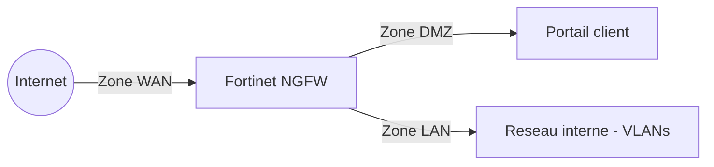

<div class="chapitre-titre-num">CHAPITRE 66</div>

# Fortinet : pare-feu nouvelle génération

<div class="encadre objectif">
<span class="encadre-titre">🎯 Objectif du chapitre</span>
Sécuriser activement le trafic qui circule sur l'infrastructure réseau désormais redondante du chapitre précédent, au-delà du simple routage et de la commutation. À la fin de ce chapitre, tu comprendras ce qui distingue un pare-feu nouvelle génération (NGFW) d'un pare-feu traditionnel à filtrage de ports, tu sauras construire des règles de sécurité par zones, et tu comprendras l'inspection applicative, le filtrage web et la prévention d'intrusion intégrée.
</div>

<div class="encadre scenario">
<span class="encadre-titre">🎬 Mise en situation</span>
Le pare-feu périmétrique actuel de l'entreprise se limite à autoriser ou bloquer du trafic selon le port et l'adresse IP — un modèle hérité qui ne distingue pas un flux HTTPS légitime vers le portail client d'un flux HTTPS malveillant exfiltrant discrètement des données vers un serveur externe, les deux utilisant le même port 443. Après l'incident de rançongiciel exploitant un accès RDP exposé (chapitre 4), la RSSI exige une visibilité plus fine sur le contenu réel du trafic, pas seulement sur son port et son adresse de destination. L'entreprise investit dans un pare-feu Fortinet nouvelle génération pour répondre à ce besoin.
</div>

## 66.1 Ce qui distingue un pare-feu nouvelle génération

<div class="encadre retenir">
<span class="encadre-titre">📌 À retenir — la réponse directe au problème du scénario d'ouverture</span>
Un pare-feu traditionnel filtre selon le port et l'adresse IP, sans jamais examiner le contenu réel du trafic autorisé — deux flux HTTPS légitime et malveillant, tous deux sur le port 443, lui paraissent identiques. Un **pare-feu nouvelle génération (NGFW)** inspecte le trafic au niveau applicatif, identifie l'application réelle derrière un flux (indépendamment du port utilisé), et peut appliquer des politiques de sécurité bien plus fines — autoriser le protocole HTTPS vers le portail client spécifiquement, tout en bloquant un usage détourné de ce même port pour un autre usage non autorisé.
</div>

## 66.2 Architecture en zones de sécurité

<div class="encadre astuce">
<span class="encadre-titre">💡 Rappel direct de la segmentation VLAN déjà établie au chapitre 11</span>
Un pare-feu Fortinet organise ses interfaces en **zones de sécurité** (WAN, LAN, DMZ) — un principe qui prolonge directement la logique de segmentation par VLAN déjà appliquée à l'infrastructure interne : chaque zone bénéficie d'un niveau de confiance distinct, et tout trafic entre deux zones différentes doit être explicitement autorisé par une règle, plutôt qu'implicitement permis par défaut.
</div>



## 66.3 Politiques de sécurité : le principe du refus par défaut

<div class="encadre bonne-pratique">
<span class="encadre-titre">✅ Rappel indirect du principe de moindre privilège déjà établi aux chapitres 22-25</span>
Une politique de sécurité Fortinet applique le même principe déjà établi pour les droits Active Directory : tout trafic est refusé par défaut entre deux zones, et seules les règles explicitement définies l'autorisent, précisant la source, la destination, le service et, pour un NGFW, l'application réellement identifiée dans le flux.
</div>

```
config firewall policy
    edit 10
        set srcintf "lan"
        set dstintf "dmz"
        set srcaddr "reseau-interne"
        set dstaddr "portail-client"
        set service "HTTPS"
        set application "Portail-Client-App"
        set action accept
    next
end
```

## 66.4 Inspection applicative profonde (DPI)

<div class="encadre retenir">
<span class="encadre-titre">📌 À retenir</span>
L'**inspection applicative profonde** (Deep Packet Inspection) examine le contenu réel des paquets autorisés par une règle, au-delà de leur simple en-tête — permettant de détecter une signature d'attaque connue, un fichier malveillant transitant dans un flux par ailleurs légitime, ou un comportement anormal, même lorsque le trafic emprunte un port et un protocole habituellement considérés comme sûrs.
</div>

## 66.5 Filtrage web et catégorisation

<div class="encadre retenir">
<span class="encadre-titre">📌 À retenir</span>
Un pare-feu nouvelle génération catégorise généralement les sites web accédés depuis le réseau interne (réseaux sociaux, hébergement de fichiers, sites malveillants connus), permettant de bloquer des catégories entières plutôt que des adresses individuelles — une protection notamment utile contre les sites de phishing nouvellement créés, qui échapperaient à une simple liste noire d'adresses déjà connues.
</div>

## 66.6 Prévention d'intrusion intégrée (IPS)

<div class="encadre securite">
<span class="encadre-titre">🔒 Sécurité — un aperçu avant la Partie 12</span>
Un module de **prévention d'intrusion (IPS)** intégré au pare-feu compare le trafic à une base de signatures d'attaques connues et peut bloquer automatiquement une tentative d'exploitation détectée, en complément du filtrage par règles. Ce mécanisme sera approfondi, aux côtés d'autres outils de détection, à la Partie 12 de ce manuel consacrée à la cybersécurité et à la gouvernance.
</div>

## 66.7 Journalisation et intégration à la supervision déjà en place

<div class="encadre astuce">
<span class="encadre-titre">💡 Rappel direct des chapitres 62-63</span>
Un pare-feu Fortinet génère ses propres journaux d'événements, transmissibles via Syslog (chapitre 63) vers Graylog, ou directement vers la pile ELK (chapitre 62) — ces journaux constituent souvent la source la plus riche d'information pour détecter une tentative d'intrusion, rejoignant directement le besoin déjà exprimé au chapitre 63 de centraliser en priorité les journaux des équipements périmétriques.
</div>

## Atelier — Sécuriser l'accès au portail client

<div class="encadre exercice">
<span class="encadre-titre">🛠️ Atelier 66 — Répondre au besoin du scénario d'ouverture</span>

**Objectif** : construire une politique de sécurité Fortinet distinguant un accès légitime au portail client d'un usage détourné du même port.

**Préparation** : un pare-feu Fortinet configuré avec les zones WAN, LAN et DMZ déjà établies (section 66.2).

**Étapes détaillées** :

1. Crée une politique de sécurité autorisant explicitement le trafic HTTPS identifié comme appartenant à l'application du portail client, entre la zone LAN et la zone DMZ (section 66.3).
2. Active l'inspection applicative profonde sur cette politique (section 66.4).
3. Explique pourquoi cette configuration bloquerait un flux tentant d'exfiltrer des données via le port 443 sans passer par l'application légitime du portail.
4. Configure la transmission des journaux de cette politique vers Graylog (section 66.7).
5. Compare ta démarche à la section "Résultat attendu".

**Résultat attendu** : la politique de sécurité, combinée à l'inspection applicative profonde, n'autorise que le trafic reconnu comme appartenant spécifiquement à l'application du portail client — un flux HTTPS générique sur le même port, mais ne correspondant pas à la signature applicative attendue, serait bloqué malgré l'utilisation d'un port et d'un protocole en apparence légitimes, résolvant directement la limite du pare-feu traditionnel décrite dans le scénario d'ouverture. La transmission des journaux vers Graylog permet à l'équipe de détecter et d'investiguer toute tentative bloquée, plutôt que de la laisser invisible.

**Dépannage** : si une application légitime se retrouve bloquée après l'activation de l'inspection applicative profonde, vérifie que la signature applicative configurée dans la politique correspond précisément à celle identifiée par le pare-feu pour ce trafic — un léger changement de comportement de l'application (mise à jour, nouveau certificat) peut parfois modifier la signature détectée.
</div>

## Erreurs fréquentes

<div class="encadre attention">
<span class="encadre-titre">⚠️ Erreur n°1 — des règles de pare-feu trop permissives, autorisant "tout vers tout" pour simplifier</span>
Rappel de la section 66.3 : reproduit exactement le même risque déjà dénoncé pour un accès administrateur non restreint dans Active Directory, ici appliqué au trafic réseau.
</div>

<div class="encadre attention">
<span class="encadre-titre">⚠️ Erreur n°2 — un pare-feu nouvelle génération utilisé uniquement comme un pare-feu traditionnel</span>
Déployer un NGFW sans jamais activer l'inspection applicative profonde ni le filtrage web revient à payer pour des fonctionnalités avancées sans jamais en bénéficier réellement.
</div>

<div class="encadre attention">
<span class="encadre-titre">⚠️ Erreur n°3 — des journaux de pare-feu jamais centralisés ni consultés</span>
Rappel indirect du chapitre 58 : un pare-feu qui journalise fidèlement chaque événement, mais dont personne ne consulte jamais les journaux, reproduit le même risque qu'une supervision techniquement fonctionnelle mais ignorée.
</div>

## Diagnostiquer un trafic légitime bloqué à tort

<div class="encadre attention">
<span class="encadre-titre">🩺 Symptôme : une application légitime cesse de fonctionner après la mise en place d'une politique de sécurité NGFW</span>

- **Diagnostic** : vérifier si l'application concernée est correctement identifiée par la signature applicative utilisée dans la politique, ou si l'inspection applicative profonde bloque le trafic faute de reconnaître précisément l'application.
- **Comment vérifier** : consulter les journaux du pare-feu pour l'événement de blocage correspondant, qui indique généralement la raison précise du refus (signature non reconnue, catégorie web bloquée, signature IPS déclenchée).
- **Résolution** : ajuster la politique pour reconnaître correctement l'application légitime, plutôt que d'assouplir excessivement la règle au point de perdre le bénéfice de l'inspection applicative.
</div>

## En entreprise

- **Bonne pratique répandue** : réviser périodiquement les politiques de sécurité existantes pour retirer les règles devenues obsolètes, un pare-feu accumulant souvent des règles historiques jamais nettoyées au fil des années.
- **Bonne pratique répandue** : activer systématiquement l'inspection applicative profonde et le filtrage web dès le déploiement d'un NGFW, plutôt que de le configurer initialement comme un simple pare-feu traditionnel par prudence excessive.
- **Erreur classique observée** : un pare-feu nouvelle génération acquis à grand coût, mais configuré de façon quasi identique à l'ancien équipement remplacé, sans jamais exploiter ses capacités d'inspection avancées — un investissement dont le bénéfice réel reste largement sous-exploité.

## Entretien technique

<div class="encadre exercice">
<span class="encadre-titre">💼 Questions fréquemment posées en entretien</span>

**Q1. "Qu'est-ce qui distingue fondamentalement un pare-feu nouvelle génération d'un pare-feu traditionnel ?"**
Réponse attendue : un pare-feu traditionnel filtre selon le port et l'adresse IP sans examiner le contenu réel du trafic ; un NGFW inspecte le trafic au niveau applicatif, identifie l'application réelle indépendamment du port utilisé, et applique des politiques de sécurité plus fines basées sur cette identification.

**Q2. "Pourquoi organiser un pare-feu en zones de sécurité (WAN, LAN, DMZ) plutôt qu'en une seule zone unique ?"**
Réponse attendue : chaque zone représente un niveau de confiance distinct, et le trafic entre deux zones différentes doit être explicitement autorisé par une règle — un principe qui prolonge la logique de segmentation VLAN, réduisant la surface d'exposition en cas de compromission d'une zone.

**Q3. "Pourquoi centraliser les journaux d'un pare-feu périmétrique reste-t-il particulièrement important pour la sécurité ?"**
Réponse attendue : le pare-feu périmétrique constitue souvent le premier point de détection d'une tentative d'intrusion externe, ses journaux représentant une source d'information critique pour toute investigation de sécurité, d'où l'importance de leur centralisation prioritaire déjà évoquée au chapitre 63.
</div>

## Optimisation, sécurité et maintenabilité — les réflexes dès ce chapitre

<div class="encadre securite">
<span class="encadre-titre">🔒 Sécurité</span>
Applique le principe de refus par défaut à toute politique de sécurité Fortinet — seul le trafic explicitement nécessaire devrait être autorisé, jamais l'inverse.
</div>

<div class="encadre bonne-pratique">
<span class="encadre-titre">✅ Maintenabilité</span>
Documente la justification de chaque règle de pare-feu au moment de sa création, facilitant la révision périodique et le retrait des règles devenues obsolètes sans risquer de couper un flux encore nécessaire mais mal documenté.
</div>

<div class="encadre performance">
<span class="encadre-titre">🚀 Performance</span>
L'inspection applicative profonde consomme davantage de ressources de traitement qu'un simple filtrage par port — dimensionne le pare-feu en conséquence du volume de trafic réel attendu, particulièrement pour les liens à fort débit comme celui vers le portail client.
</div>

## Résumé du chapitre

- Un pare-feu nouvelle génération inspecte le trafic au niveau applicatif, contrairement à un pare-feu traditionnel limité au port et à l'adresse IP.
- L'organisation en zones de sécurité (WAN, LAN, DMZ) prolonge la logique de segmentation VLAN déjà établie au chapitre 11.
- Le principe de refus par défaut s'applique aux politiques de sécurité réseau, comme il s'applique déjà aux droits d'accès Active Directory.
- L'inspection applicative profonde, le filtrage web et la prévention d'intrusion constituent les capacités distinctives d'un NGFW, souvent sous-exploitées si le pare-feu est configuré comme un équipement traditionnel.
- Les journaux du pare-feu périmétrique constituent une source d'information critique, à centraliser en priorité vers Graylog ou ELK.

## Quiz

<div class="encadre exercice">
<span class="encadre-titre">📝 QCM (une seule bonne réponse par question)</span>

1. Un pare-feu nouvelle génération se distingue d'un pare-feu traditionnel principalement par :
   - a) Un coût toujours inférieur
   - b) Sa capacité à inspecter le trafic au niveau applicatif, au-delà du port et de l'adresse IP
   - c) L'absence totale de besoin de règles de sécurité
   - d) Son incapacité à filtrer le trafic web

2. Le principe de refus par défaut appliqué à une politique de sécurité Fortinet signifie que :
   - a) Tout trafic est autorisé sauf mention contraire explicite
   - b) Tout trafic est refusé sauf autorisation explicite par une règle
   - c) Seul le trafic chiffré est autorisé
   - d) Aucune règle n'est nécessaire pour le trafic interne

3. Centraliser les journaux du pare-feu périmétrique est particulièrement important car :
   - a) Ils ne contiennent jamais d'information utile
   - b) Ils constituent souvent le premier point de détection d'une tentative d'intrusion externe
   - c) Ils remplacent le besoin de toute autre source de log
   - d) Ils ne peuvent être transmis que via Filebeat

**Corrigé** : 1-b, 2-b, 3-b.
</div>

<div class="encadre exercice">
<span class="encadre-titre">📝 Vrai ou Faux</span>

1. Un pare-feu traditionnel peut distinguer un flux HTTPS légitime d'un flux HTTPS malveillant utilisant le même port. — **Faux** (scénario d'ouverture, section 66.1).
2. L'organisation en zones de sécurité prolonge directement la logique de segmentation VLAN déjà établie au chapitre 11. — **Vrai**.
3. Un NGFW configuré exactement comme un pare-feu traditionnel exploite pleinement ses capacités avancées. — **Faux** (section "Erreur n°2").
4. L'inspection applicative profonde consomme davantage de ressources qu'un simple filtrage par port. — **Vrai**.
</div>

<div class="encadre exercice">
<span class="encadre-titre">📝 Questions ouvertes</span>

1. Explique pourquoi le pare-feu traditionnel initial de l'entreprise ne pouvait pas répondre à l'exigence formulée par la RSSI dans le scénario d'ouverture.
2. Un collègue propose de désactiver temporairement l'inspection applicative profonde "pour améliorer les performances", sans limiter cette désactivation à une politique spécifique. Discute les conséquences de cette proposition.

**Corrigé 1** : un pare-feu traditionnel filtre uniquement selon le port et l'adresse IP, sans jamais examiner le contenu réel du trafic autorisé. Un flux HTTPS légitime vers le portail client et un flux HTTPS malveillant exfiltrant des données vers un serveur externe utilisent tous deux le même port 443 — du point de vue d'un pare-feu traditionnel, ces deux flux paraissent identiques et seraient tous deux autorisés par la même règle générique. La RSSI exigeait une distinction plus fine, basée sur l'application réellement identifiée dans le flux plutôt que sur son seul port — une capacité que seul un pare-feu nouvelle génération, via l'inspection applicative profonde (section 66.4), peut offrir.

**Corrigé 2** : désactiver l'inspection applicative profonde de façon globale, plutôt que sur une politique ciblée, annule le principal bénéfice ayant justifié l'investissement dans un NGFW — le pare-feu redeviendrait fonctionnellement équivalent à l'ancien équipement traditionnel qu'il a remplacé, incapable de distinguer un usage légitime d'un usage détourné d'un même port, exactement le problème identifié dans le scénario d'ouverture. Si un problème de performance réel existe, une approche plus mesurée consisterait à dimensionner correctement le pare-feu pour le volume de trafic attendu (section "Performance"), ou à cibler la désactivation uniquement sur les flux internes les moins sensibles, plutôt que d'affaiblir uniformément la sécurité de l'ensemble du périmètre pour un gain de performance généralisé et disproportionné.
</div>

## Exercices

<div class="encadre exercice">
<span class="encadre-titre">📝 Exercice 66.1</span>

Propose une politique de sécurité Fortinet pour le serveur de gestion documentaire (Rocky Linux, chapitre 19), autorisant uniquement les flux strictement nécessaires depuis le réseau interne, en t'appuyant sur le principe de refus par défaut de la section 66.3.
</div>

**Corrigé :** La politique autoriserait spécifiquement le trafic HTTPS depuis la zone LAN vers l'adresse du serveur documentaire dans la zone DMZ ou LAN selon son positionnement réel, avec l'application identifiée comme celle du logiciel de gestion documentaire. Le trafic SSH d'administration serait autorisé uniquement depuis un sous-réseau restreint dédié aux postes des administrateurs, jamais depuis l'ensemble du réseau interne. Tout autre trafic vers ce serveur, non explicitement couvert par ces deux règles, serait refusé par défaut — reproduisant pour ce serveur spécifique le même principe de moindre privilège déjà appliqué à l'ensemble de l'infrastructure de sécurité de ce manuel, plutôt qu'une règle générique autorisant l'ensemble du trafic interne vers ce serveur par simplicité.

<div class="encadre exercice">
<span class="encadre-titre">📝 Exercice 66.2</span>

Rédige, en 3 à 5 phrases, une règle d'équipe garantissant une révision périodique des politiques de sécurité du pare-feu Fortinet, en t'appuyant sur le risque décrit à la section "En entreprise".
</div>

**Corrigé (exemple de réponse) :** L'ensemble des politiques de sécurité du pare-feu périmétrique fera l'objet d'une révision trimestrielle, examinant chaque règle existante pour vérifier qu'elle correspond toujours à un besoin réel et documenté. Toute règle dont la justification n'est plus claire ou dont le trafic associé n'a montré aucune activité récente sera signalée pour investigation avant sa suppression ou sa conservation justifiée. Cette révision périodique sera intégrée au même processus de gouvernance déjà établi pour la revue des accès Active Directory, évitant que le pare-feu n'accumule silencieusement des règles obsolètes représentant une surface d'exposition inutile au fil des années.

## Checklist de fin de chapitre

<ul class="checklist">
<li>☐ Je comprends ce qui distingue un pare-feu nouvelle génération d'un pare-feu traditionnel.</li>
<li>☐ Je sais organiser une architecture de pare-feu en zones de sécurité.</li>
<li>☐ Je sais construire une politique de sécurité appliquant le principe de refus par défaut.</li>
<li>☐ Je comprends le rôle de l'inspection applicative profonde et du filtrage web.</li>
<li>☐ Je sais pourquoi centraliser les journaux du pare-feu périmétrique reste une priorité de sécurité.</li>
<li>☐ Je sais diagnostiquer un trafic légitime bloqué à tort par une politique NGFW.</li>
</ul>

## FAQ

<dl class="faq">
<dt>Un NGFW remplace-t-il complètement le besoin d'un IPS ou d'un antivirus dédié ?</dt>
<dd>Pas nécessairement complètement — de nombreux NGFW intègrent un module IPS et parfois un antivirus réseau, mais une défense en profondeur combinant plusieurs couches de protection complémentaires reste généralement recommandée plutôt qu'une dépendance exclusive à un seul équipement, un principe approfondi à la Partie 12.</dd>

<dt>Fortinet est-il le seul fabricant de pare-feu nouvelle génération disponible ?</dt>
<dd>Non, plusieurs fabricants proposent des NGFW comparables (Palo Alto, Check Point, entre autres) — les concepts présentés dans ce chapitre (zones de sécurité, inspection applicative, refus par défaut) restent largement transférables d'un fabricant à l'autre, seule la syntaxe de configuration diffère.</dd>

<dt>Un NGFW ralentit-il significativement le trafic par rapport à un pare-feu traditionnel ?</dt>
<dd>L'inspection applicative profonde introduit une charge de traitement supplémentaire, mais un équipement correctement dimensionné pour le volume de trafic réel de l'organisation absorbe généralement cette charge sans impact perceptible pour les utilisateurs.</dd>

<dt>Faut-il activer l'inspection applicative profonde sur l'ensemble du trafic, y compris interne ?</dt>
<dd>Une approche progressive, en priorisant d'abord le trafic entrant et sortant vers Internet (le plus exposé), puis en étendant progressivement au trafic inter-VLAN interne selon les ressources disponibles, reste souvent plus réaliste qu'une activation complète immédiate sur l'ensemble du trafic.</dd>
</dl>

## Références et pour aller plus loin

- Documentation officielle Fortinet FortiGate : [https://docs.fortinet.com/product/fortigate](https://docs.fortinet.com/product/fortigate)
- NIST — Guidelines on Firewalls and Firewall Policy (SP 800-41) : [https://csrc.nist.gov/publications/detail/sp/800-41/rev-1/final](https://csrc.nist.gov/publications/detail/sp/800-41/rev-1/final)

*Chapitre suivant : Mikrotik et le routage avancé — une alternative accessible pour approfondir les concepts de routage déjà rencontrés avec Cisco, particulièrement répandue pour les sites secondaires et les budgets plus restreints.*
