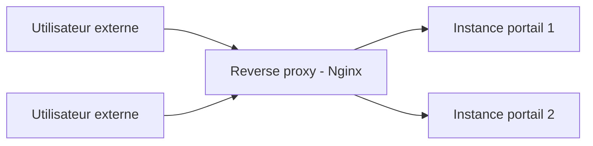

<div class="chapitre-titre-num">CHAPITRE 68</div>

# Proxy et reverse proxy (Nginx, Apache, IIS)

<div class="encadre objectif">
<span class="encadre-titre">🎯 Objectif du chapitre</span>
Exposer de façon contrôlée et sécurisée les services internes de l'entreprise, comme le portail client, vers l'extérieur — sans jamais exposer directement les serveurs qui les hébergent. À la fin de ce chapitre, tu comprendras la différence entre un proxy direct et un reverse proxy, tu sauras configurer Nginx comme reverse proxy avec terminaison TLS, répartir la charge entre plusieurs instances backend, et diagnostiquer les erreurs courantes de ce type d'architecture.
</div>

<div class="encadre scenario">
<span class="encadre-titre">🎬 Mise en situation</span>
Rappel du chapitre 4 : l'incident de rançongiciel initial de l'entreprise avait été causé par un accès RDP exposé directement sur Internet, sans aucune couche intermédiaire de protection. Des années plus tard, alors que le portail client doit désormais être accessible depuis Internet, un nouveau développeur propose la solution la plus simple : exposer directement l'adresse IP du serveur applicatif. La RSSI s'y oppose immédiatement, reconnaissant le même schéma de risque que l'incident fondateur — exposer directement un service interne, sans intermédiaire, laisse le serveur backend directement accessible à quiconque scanne Internet. Un reverse proxy s'impose comme intermédiaire obligatoire.
</div>

## 68.1 Proxy direct et reverse proxy : deux directions opposées

<div class="encadre astuce">
<span class="encadre-titre">💡 Analogie — un guichet unique dans les deux sens</span>
Un **proxy direct** (forward proxy) agit pour le compte des clients internes accédant à des ressources externes — il masque l'identité de chaque poste individuel vis-à-vis d'Internet. Un **reverse proxy** agit à l'inverse pour le compte des serveurs internes recevant des requêtes externes — il masque l'existence et l'adresse réelle de ces serveurs vis-à-vis des utilisateurs externes. Ce chapitre se concentre sur le second, directement pertinent pour exposer le portail client en toute sécurité.
</div>



## 68.2 Ce que le reverse proxy résout dans le scénario d'ouverture

<div class="encadre bonne-pratique">
<span class="encadre-titre">✅ La réponse directe à la proposition du développeur</span>
Avec un reverse proxy, seule son adresse est exposée sur Internet — l'adresse réelle et l'existence même des serveurs backend restent invisibles depuis l'extérieur, inaccessibles directement même si un attaquant scanne l'ensemble des ports d'Internet. Cette architecture rejoint exactement la leçon de l'incident du chapitre 4 : ne jamais exposer directement un service interne sans une couche intermédiaire contrôlée entre Internet et l'infrastructure réelle.
</div>

## 68.3 Configuration de base d'un reverse proxy Nginx

```nginx
server {
    listen 443 ssl;
    server_name portail.assuranceht.ht;

    location / {
        proxy_pass http://10.10.1.30:8080;
        proxy_set_header Host $host;
        proxy_set_header X-Real-IP $remote_addr;
    }
}
```

<div class="encadre retenir">
<span class="encadre-titre">📌 À retenir</span>
Le reverse proxy reçoit la requête externe sur le domaine public, puis la retransmet vers l'adresse interne réelle du serveur applicatif (`proxy_pass`), en conservant les informations utiles pour le serveur backend (adresse d'origine réelle du visiteur, nom d'hôte demandé).
</div>

## 68.4 Terminaison TLS : rappel direct du chapitre 24

<div class="encadre securite">
<span class="encadre-titre">🔒 Sécurité — le reverse proxy comme point unique de gestion des certificats</span>
Le reverse proxy gère généralement seul le chiffrement TLS (chapitre 24) avec les utilisateurs externes, puis communique en clair ou avec un chiffrement plus léger vers les serveurs backend internes, déjà protégés par la segmentation réseau. Cette centralisation simplifie considérablement le renouvellement des certificats — plutôt que de gérer un certificat sur chaque serveur backend individuel, un seul point de gestion centralisé au niveau du reverse proxy suffit, réduisant le risque d'un certificat expiré oublié comme celui déjà rencontré au chapitre 24.
</div>

## 68.5 Répartition de charge entre plusieurs instances

<div class="encadre astuce">
<span class="encadre-titre">💡 Rappel indirect du chapitre 44 — un niveau différent de répartition</span>
Un reverse proxy peut répartir les requêtes entrantes entre plusieurs instances backend identiques, un principe complémentaire à la mise à l'échelle automatique par HPA déjà rencontrée au chapitre 44 dans un contexte Kubernetes — le reverse proxy assure ici la distribution du trafic vers ces instances, quel que soit leur nombre exact à un instant donné.
</div>

```nginx
upstream portail_backend {
    server 10.10.1.30:8080;
    server 10.10.1.31:8080;
}

server {
    location / {
        proxy_pass http://portail_backend;
    }
}
```

## 68.6 Reverse proxy et authentification centralisée

<div class="encadre astuce">
<span class="encadre-titre">💡 Rappel indirect des chapitres 22 et 25</span>
Un reverse proxy peut également centraliser une étape d'authentification avant même que la requête n'atteigne l'application interne — une pratique fréquente pour les applications internes de l'entreprise, s'appuyant sur l'annuaire LDAP (chapitre 22) déjà en place, plutôt que de dupliquer une logique d'authentification propre à chaque application interne.
</div>

## 68.7 Limitation de débit : une protection supplémentaire

<div class="encadre bonne-pratique">
<span class="encadre-titre">✅ Une protection simple contre une surcharge</span>
Un reverse proxy peut limiter le nombre de requêtes acceptées par adresse source dans un intervalle donné, une protection simple mais efficace contre une tentative de surcharge ou un usage anormal, complémentaire aux mécanismes de sécurité plus avancés du pare-feu nouvelle génération déjà couvert au chapitre 66.
</div>

```nginx
limit_req_zone $binary_remote_addr zone=portail_limit:10m rate=10r/s;

server {
    location / {
        limit_req zone=portail_limit burst=20;
        proxy_pass http://portail_backend;
    }
}
```

## Atelier — Exposer le portail client en toute sécurité

<div class="encadre exercice">
<span class="encadre-titre">🛠️ Atelier 68 — Répondre au scénario d'ouverture</span>

**Objectif** : configurer un reverse proxy Nginx exposant le portail client de façon sécurisée, sans jamais révéler l'adresse réelle des serveurs backend.

**Préparation** : un serveur Nginx accessible depuis Internet, deux instances backend du portail sur le réseau interne.

**Étapes détaillées** :

1. Configure le reverse proxy avec terminaison TLS pour le domaine public du portail (section 68.4).
2. Configure la répartition de charge entre les deux instances backend (section 68.5).
3. Ajoute une limitation de débit protégeant contre une surcharge anormale (section 68.7).
4. Explique pourquoi cette configuration répond directement à l'objection de la RSSI dans le scénario d'ouverture.
5. Compare ta démarche à la section "Résultat attendu".

**Résultat attendu** : les utilisateurs externes n'interagissent jamais qu'avec l'adresse publique du reverse proxy — les adresses internes réelles des deux instances backend restent invisibles et inaccessibles directement depuis Internet, contrairement à la proposition initiale du développeur. La répartition de charge distribue les requêtes entre les deux instances sans que l'utilisateur n'ait besoin de connaître leur existence individuelle. La limitation de débit protège contre une tentative de surcharge, complétant la protection déjà apportée par le pare-feu nouvelle génération en amont. Cette architecture élimine directement le risque d'exposition d'un service interne sans intermédiaire, exactement le schéma de risque à l'origine de l'incident du chapitre 4.

**Dépannage** : si les utilisateurs reçoivent une erreur "502 Bad Gateway" après la mise en place du reverse proxy, vérifie en priorité que les serveurs backend sont bien accessibles depuis le reverse proxy sur l'adresse et le port configurés dans `proxy_pass` — la cause la plus fréquente de cette erreur.
</div>

## Erreurs fréquentes

<div class="encadre attention">
<span class="encadre-titre">⚠️ Erreur n°1 — exposer directement l'adresse d'un serveur backend, sans reverse proxy</span>
Rappel du scénario d'ouverture : reproduit exactement le schéma de risque à l'origine de l'incident du chapitre 4.
</div>

<div class="encadre attention">
<span class="encadre-titre">⚠️ Erreur n°2 — une terminaison TLS mal configurée, avec des protocoles ou algorithmes obsolètes</span>
Rappel indirect du chapitre 24 : un reverse proxy configuré avec des paramètres TLS faibles offre une fausse impression de sécurité malgré la présence apparente du chiffrement.
</div>

<div class="encadre attention">
<span class="encadre-titre">⚠️ Erreur n°3 — aucune limitation de débit, laissant le service vulnérable à une simple surcharge</span>
Rappel de la section 68.7 : sans cette protection, une simple accumulation de requêtes, malveillante ou non, peut rendre le service indisponible pour l'ensemble des utilisateurs légitimes.
</div>

## Diagnostiquer une erreur 502 Bad Gateway

<div class="encadre attention">
<span class="encadre-titre">🩺 Symptôme : les utilisateurs reçoivent une erreur "502 Bad Gateway" en tentant d'accéder au portail</span>

- **Diagnostic** : cette erreur indique que le reverse proxy a reçu la requête, mais n'a pas pu obtenir de réponse valide du serveur backend configuré — vérifier si le serveur backend est démarré, accessible réseau depuis le reverse proxy, et répond bien sur le port attendu.
- **Comment vérifier** : tenter une connexion directe depuis le reverse proxy vers l'adresse et le port du serveur backend configuré dans `proxy_pass`.
- **Résolution** : redémarrer le service backend s'il est arrêté, ou corriger la configuration réseau ou de pare-feu bloquant la communication entre le reverse proxy et le backend.
</div>

## En entreprise

- **Bonne pratique répandue** : n'exposer jamais directement un service interne sur Internet — un reverse proxy (ou un équivalent, comme l'Ingress Kubernetes déjà rencontré au chapitre 43) devrait systématiquement s'interposer.
- **Bonne pratique répandue** : centraliser la gestion des certificats TLS au niveau du reverse proxy, simplifiant leur renouvellement et réduisant le risque d'un certificat oublié sur un serveur backend individuel.
- **Erreur classique observée** : un reverse proxy correctement configuré au départ, mais dont la configuration de limitation de débit ou de sécurité TLS n'est jamais revue à mesure que le trafic ou les recommandations de sécurité évoluent — une configuration figée dans le temps, sans révision périodique.

## Entretien technique

<div class="encadre exercice">
<span class="encadre-titre">💼 Questions fréquemment posées en entretien</span>

**Q1. "Quelle est la différence entre un proxy direct (forward proxy) et un reverse proxy ?"**
Réponse attendue : un proxy direct agit pour le compte des clients internes accédant à des ressources externes, masquant leur identité vis-à-vis d'Internet ; un reverse proxy agit pour le compte des serveurs internes recevant des requêtes externes, masquant leur existence et leur adresse réelle vis-à-vis des utilisateurs externes.

**Q2. "Pourquoi ne jamais exposer directement un serveur applicatif sur Internet, plutôt que de passer par un reverse proxy ?"**
Réponse attendue : exposer directement un serveur applicatif révèle son adresse réelle et le rend directement accessible à toute tentative de scan ou d'exploitation ; un reverse proxy s'interpose comme couche de protection, masquant l'infrastructure réelle et centralisant les contrôles de sécurité (TLS, limitation de débit).

**Q3. "Comment un reverse proxy simplifie-t-il la gestion des certificats TLS par rapport à leur déploiement sur chaque serveur backend ?"**
Réponse attendue : en centralisant la terminaison TLS au niveau du reverse proxy, un seul point de gestion et de renouvellement de certificat suffit, plutôt que de gérer un certificat distinct sur chaque serveur backend individuel, réduisant le risque d'un certificat expiré oublié.
</div>

## Optimisation, sécurité et maintenabilité — les réflexes dès ce chapitre

<div class="encadre securite">
<span class="encadre-titre">🔒 Sécurité</span>
N'expose jamais directement un serveur backend sur Internet — un reverse proxy devrait systématiquement constituer le seul point de contact visible depuis l'extérieur, conformément à la leçon tirée de l'incident du chapitre 4.
</div>

<div class="encadre bonne-pratique">
<span class="encadre-titre">✅ Maintenabilité</span>
Verse la configuration du reverse proxy dans le même dépôt Git que le reste de l'infrastructure versionnée (chapitre 51), permettant une traçabilité complète de toute modification apportée à ce composant critique.
</div>

<div class="encadre performance">
<span class="encadre-titre">🚀 Performance</span>
La répartition de charge entre plusieurs instances backend améliore la résilience et les performances perçues par les utilisateurs, particulièrement bénéfique lors de pics de trafic sur le portail client.
</div>

## Résumé du chapitre

- Un proxy direct protège l'identité des clients internes ; un reverse proxy protège l'existence et l'adresse des serveurs internes.
- Exposer directement un serveur backend sur Internet reproduit exactement le schéma de risque à l'origine de l'incident du chapitre 4.
- Le reverse proxy centralise la terminaison TLS, simplifiant significativement la gestion des certificats.
- Un reverse proxy peut répartir la charge entre plusieurs instances backend et limiter le débit des requêtes acceptées.
- Une erreur 502 Bad Gateway indique généralement un problème de communication entre le reverse proxy et le serveur backend, pas un problème côté utilisateur.
- La configuration du reverse proxy devrait être versionnée et revue périodiquement, comme tout composant critique de l'infrastructure.

## Quiz

<div class="encadre exercice">
<span class="encadre-titre">📝 QCM (une seule bonne réponse par question)</span>

1. Un reverse proxy agit principalement pour le compte :
   - a) Des clients internes accédant à des ressources externes
   - b) Des serveurs internes recevant des requêtes externes
   - c) Uniquement des équipements réseau comme les commutateurs
   - d) Du pare-feu périmétrique

2. Exposer directement un serveur backend sur Internet, sans reverse proxy, reproduit principalement le risque déjà rencontré :
   - a) Au chapitre 24, avec un certificat TLS expiré
   - b) Au chapitre 4, avec un accès RDP exposé directement
   - c) Au chapitre 58, avec un disque plein non détecté
   - d) Au chapitre 60, avec une cible Prometheus "down"

3. Une erreur "502 Bad Gateway" indique généralement :
   - a) Un problème de résolution DNS côté client
   - b) Un problème de communication entre le reverse proxy et le serveur backend
   - c) Un certificat TLS expiré
   - d) Une limitation de débit atteinte

**Corrigé** : 1-b, 2-b, 3-b.
</div>

<div class="encadre exercice">
<span class="encadre-titre">📝 Vrai ou Faux</span>

1. Un reverse proxy masque l'adresse réelle des serveurs backend vis-à-vis des utilisateurs externes. — **Vrai**.
2. La terminaison TLS centralisée au niveau du reverse proxy complique la gestion des certificats par rapport à un déploiement sur chaque serveur backend. — **Faux** (elle la simplifie, section 68.4).
3. Une limitation de débit au niveau du reverse proxy protège contre une simple surcharge de requêtes. — **Vrai**.
4. La répartition de charge entre plusieurs instances backend nécessite que l'utilisateur connaisse leur existence individuelle. — **Faux** (section 68.5).
</div>

<div class="encadre exercice">
<span class="encadre-titre">📝 Questions ouvertes</span>

1. Explique pourquoi la RSSI a immédiatement reconnu, dans le scénario d'ouverture, le même schéma de risque que l'incident du chapitre 4, malgré des technologies très différentes (RDP contre HTTP applicatif).
2. Un collègue propose de configurer une limitation de débit extrêmement stricte, "pour maximiser la protection contre toute surcharge". Discute le risque potentiel de cette proposition.

**Corrigé 1** : le point commun entre les deux situations n'est pas la technologie spécifique utilisée (RDP contre HTTP applicatif), mais le principe architectural sous-jacent : exposer directement un service interne sur Internet, sans aucune couche intermédiaire de contrôle. Dans les deux cas, un attaquant scannant Internet peut découvrir directement l'adresse et le service exposé, et tenter de l'exploiter sans obstacle intermédiaire. La RSSI a reconnu ce schéma de risque au niveau architectural, indépendamment du protocole spécifique concerné — une capacité à généraliser une leçon de sécurité au-delà du cas particulier qui l'a initialement révélée, plutôt que de la considérer comme limitée au seul contexte RDP d'origine.

**Corrigé 2** : une limitation de débit excessivement stricte risque de bloquer des utilisateurs légitimes dont l'usage normal dépasserait le seuil configuré, en particulier lors de pics d'activité légitimes (période de forte affluence, campagne commerciale). Ce risque rejoint le même principe de dosage déjà rencontré à plusieurs reprises dans ce manuel pour les seuils d'alerte (chapitres 58 à 61) : une protection mal calibrée peut nuire autant, voire davantage, que l'absence totale de protection, en pénalisant l'usage normal du service plutôt que de cibler spécifiquement un usage anormal. Un seuil raisonnable, déterminé à partir de l'usage normal réellement observé, reste préférable à une limitation arbitrairement stricte.
</div>

## Exercices

<div class="encadre exercice">
<span class="encadre-titre">📝 Exercice 68.1</span>

Un serveur backend du portail client doit être remplacé par un nouveau serveur avec une adresse IP différente. Explique pourquoi ce changement peut se faire de façon transparente pour les utilisateurs externes, grâce à l'architecture reverse proxy déjà en place.
</div>

**Corrigé :** Les utilisateurs externes n'interagissent jamais directement avec l'adresse du serveur backend — ils accèdent uniquement à l'adresse publique du reverse proxy, qui retransmet ensuite la requête vers le serveur backend configuré. Remplacer un serveur backend par un autre, avec une adresse IP différente, ne nécessite donc qu'une modification de la configuration `proxy_pass` (ou de la liste `upstream` en cas de répartition de charge, section 68.5) au niveau du reverse proxy lui-même — aucune modification n'est nécessaire côté utilisateur, qui continue d'accéder au même domaine public sans interruption perceptible. Cette transparence constitue l'un des bénéfices structurels majeurs de l'architecture reverse proxy, au-delà de son rôle de protection déjà mis en avant dans ce chapitre.

<div class="encadre exercice">
<span class="encadre-titre">📝 Exercice 68.2</span>

Rédige, en 3 à 5 phrases, une règle d'équipe garantissant qu'aucun nouveau service applicatif n'est jamais exposé directement sur Internet sans passer par un reverse proxy, en t'appuyant sur la leçon du scénario d'ouverture de ce chapitre.
</div>

**Corrigé (exemple de réponse) :** Tout nouveau service applicatif destiné à être accessible depuis Internet devra systématiquement être positionné derrière un reverse proxy, jamais exposé directement via son adresse propre, quelle que soit l'urgence ou la simplicité apparente de la demande initiale. Cette règle s'appliquera sans exception, y compris pour des déploiements temporaires ou de test, la tentation de "simplifier temporairement" ayant déjà été identifiée comme un facteur de risque récurrent dans ce manuel. Toute demande de mise en production d'un nouveau service accessible depuis Internet fera l'objet d'une vérification explicite de cette exigence avant validation finale, reproduisant le même principe de contrôle déjà appliqué à d'autres changements critiques d'infrastructure décrits dans ce manuel.

## Checklist de fin de chapitre

<ul class="checklist">
<li>☐ Je comprends la différence entre un proxy direct et un reverse proxy.</li>
<li>☐ Je sais pourquoi exposer directement un serveur backend reproduit le risque de l'incident du chapitre 4.</li>
<li>☐ Je sais configurer un reverse proxy Nginx avec terminaison TLS.</li>
<li>☐ Je sais configurer une répartition de charge entre plusieurs instances backend.</li>
<li>☐ Je sais configurer une limitation de débit raisonnable pour protéger contre une surcharge.</li>
<li>☐ Je sais diagnostiquer une erreur 502 Bad Gateway.</li>
</ul>

## FAQ

<dl class="faq">
<dt>Apache et IIS peuvent-ils également remplir le rôle de reverse proxy, comme Nginx ?</dt>
<dd>Oui, les trois peuvent être configurés comme reverse proxy, avec des syntaxes de configuration propres à chacun — Nginx reste particulièrement répandu pour ce rôle spécifique en raison de ses performances reconnues sur ce type de charge, mais les concepts présentés dans ce chapitre restent transférables aux deux autres solutions.</dd>

<dt>Un reverse proxy remplace-t-il le besoin d'un pare-feu nouvelle génération déjà couvert au chapitre 66 ?</dt>
<dd>Non, les deux se complètent — le pare-feu opère à un niveau réseau plus large, filtrant et inspectant l'ensemble du trafic périmétrique, tandis que le reverse proxy opère spécifiquement au niveau applicatif pour les services web exposés, chacun apportant une couche de protection distincte.</dd>

<dt>L'Ingress Kubernetes déjà rencontré au chapitre 43 est-il un type de reverse proxy ?</dt>
<dd>Oui, un Ingress Kubernetes remplit exactement le même rôle fonctionnel qu'un reverse proxy classique, adapté spécifiquement à l'environnement Kubernetes — les concepts de ce chapitre (masquage des backends, terminaison TLS, répartition de charge) s'y retrouvent directement, sous une forme native à l'écosystème conteneurisé.</dd>

<dt>Faut-il toujours limiter le débit de chaque service exposé, même à faible trafic ?</dt>
<dd>La limitation de débit reste une bonne pratique générale, mais son seuil devrait être calibré selon le trafic réel attendu pour chaque service — un service à très faible trafic mérite néanmoins une limitation raisonnable, ne serait-ce que pour se protéger d'une tentative d'abus, même peu probable.</dd>
</dl>

## Références et pour aller plus loin

- Documentation officielle Nginx : [https://nginx.org/en/docs/](https://nginx.org/en/docs/)
- Documentation officielle Apache HTTP Server, module mod_proxy : [https://httpd.apache.org/docs/current/mod/mod_proxy.html](https://httpd.apache.org/docs/current/mod/mod_proxy.html)
- Microsoft — Documentation IIS Application Request Routing : [https://learn.microsoft.com/en-us/iis/extensions/planning-for-arr/](https://learn.microsoft.com/en-us/iis/extensions/planning-for-arr/)

*Chapitre suivant : le VPN d'entreprise (site à site et accès distant) — étendre le réseau de confiance de l'entreprise à travers Internet, entre les sites de Port-au-Prince et Cap-Haïtien, et pour les collaborateurs en déplacement.*
