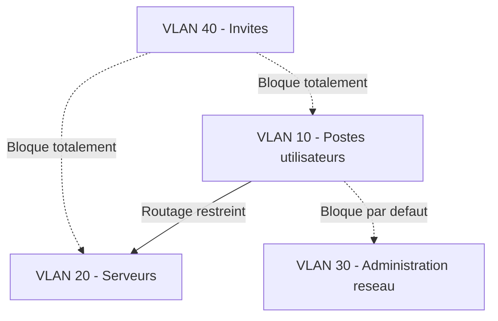

<div class="chapitre-titre-num">CHAPITRE 70</div>

# Segmentation VLAN

<div class="encadre objectif">
<span class="encadre-titre">🎯 Objectif du chapitre</span>
Clore la Partie 11 de ce manuel en formalisant la logique de segmentation déjà rencontrée à plusieurs reprises — les VLAN de base du chapitre 11, les zones de sécurité Fortinet du chapitre 66, le VLAN d'administration recommandé pour Zabbix, Syslog et Mikrotik. À la fin de ce chapitre, tu sauras concevoir une politique de segmentation cohérente pour l'ensemble d'un réseau d'entreprise, appliquer le refus par défaut au routage inter-VLAN, et comprendre la micro-segmentation comme prolongement naturel du principe Zero Trust déjà introduit au chapitre 26.
</div>

<div class="encadre scenario">
<span class="encadre-titre">🎬 Mise en situation</span>
Un audit de sécurité externe, commandé par la RSSI, examine la segmentation réseau de l'entreprise. Le constat est sans appel : des VLAN ont été créés au fil des années, service par service, sans politique cohérente d'ensemble — certains VLAN mélangent des postes utilisateurs et des serveurs, le routage inter-VLAN autorise "tout vers tout" par simplicité historique, et aucun VLAN d'administration dédié n'isole la gestion des équipements réseau eux-mêmes. <em>"Vos VLAN existent,"</em> résume l'auditeur, <em>"mais ils ne segmentent presque rien dans les faits, puisque tout communique librement avec tout."</em> Ce chapitre reprend la segmentation depuis les principes, pour l'ensemble du réseau.
</div>

## 70.1 Le problème : des VLAN sans politique cohérente

<div class="encadre retenir">
<span class="encadre-titre">📌 À retenir — un VLAN n'est une protection que s'il est accompagné d'une politique de routage restrictive</span>
Un VLAN, à lui seul, ne fait que séparer un domaine de diffusion (broadcast) — il n'apporte aucune protection réelle si le routage entre VLAN autorise ensuite librement tout le trafic, comme le révèle l'audit du scénario d'ouverture. La segmentation efficace repose sur la combinaison de deux éléments indissociables : des VLAN correctement définis, et des règles de routage inter-VLAN appliquant le même principe de refus par défaut déjà établi pour le pare-feu périmétrique (chapitre 66) et pour le pare-feu Mikrotik (chapitre 67).
</div>

## 70.2 Principes de segmentation : par fonction, par sensibilité, par confiance

<div class="encadre retenir">
<span class="encadre-titre">📌 À retenir</span>
Une segmentation cohérente regroupe les équipements selon des critères explicites : par **fonction** (postes utilisateurs, serveurs, imprimantes), par **sensibilité** (données financières, données de santé si applicable, données publiques), ou par **niveau de confiance** (réseau interne de confiance, réseau invité non fiable, zone démilitarisée exposée). Ces trois critères, souvent combinés, formalisent ce qui était déjà appliqué de façon informelle dans les chapitres précédents — les zones WAN/LAN/DMZ du pare-feu Fortinet (section 66.2) constituent un exemple de segmentation par niveau de confiance appliqué à l'échelle du périmètre.
</div>



## 70.3 Le VLAN d'administration dédié : formaliser un principe déjà rencontré

<div class="encadre securite">
<span class="encadre-titre">🔒 Sécurité — rappel direct de plusieurs chapitres précédents</span>
Un **VLAN d'administration dédié**, isolant l'accès aux interfaces de gestion des équipements réseau (Winbox de Mikrotik, interface Fortinet, agents Zabbix), a déjà été recommandé de façon ponctuelle à plusieurs reprises dans cette partie du manuel — restriction du port de l'agent Zabbix (section 59.3), du trafic Syslog (section 63.4), et surtout de l'interface Winbox (section 67.7). Ce chapitre formalise ce principe : tout accès d'administration à un équipement réseau ou système devrait transiter exclusivement par ce VLAN dédié, jamais depuis le VLAN des postes utilisateurs standards.
</div>

## 70.4 ACL inter-VLAN : qui peut parler à qui, explicitement

<div class="encadre bonne-pratique">
<span class="encadre-titre">✅ Le même principe de refus par défaut, appliqué à l'ensemble du réseau interne</span>
Une **liste de contrôle d'accès (ACL)** inter-VLAN définit explicitement quels VLAN peuvent communiquer avec quels autres VLAN, sur quels ports et protocoles précis — exactement le même principe de refus par défaut déjà appliqué au pare-feu périmétrique et au pare-feu Mikrotik, mais désormais appliqué également au trafic interne, entre les propres VLAN de l'entreprise.
</div>

```
# Exemple de logique ACL inter-VLAN (syntaxe generique)
permit VLAN10 -> VLAN20 tcp port 443   ! Postes utilisateurs vers portail interne
deny   VLAN10 -> VLAN30                ! Postes utilisateurs vers VLAN administration : refuse
deny   VLAN40 -> any                   ! Reseau invite : aucun acces au reste du reseau
```

## 70.5 Micro-segmentation : le prolongement naturel du VLAN

<div class="encadre astuce">
<span class="encadre-titre">💡 Rappel direct des chapitres 26 et 69 — l'évolution du même principe</span>
La segmentation par VLAN reste un découpage relativement large — tous les serveurs d'un même VLAN communiquent généralement librement entre eux. La **micro-segmentation** va plus loin, en isolant le trafic jusqu'au niveau d'un flux individuel entre deux systèmes précis, indépendamment de leur VLAN d'appartenance — exactement le prolongement naturel du principe Zero Trust déjà établi au chapitre 26 et rappelé au chapitre 69 : ne jamais accorder de confiance implicite, même entre systèmes d'un même segment réseau apparemment homogène.
</div>

## 70.6 Documenter et auditer la segmentation

<div class="encadre bonne-pratique">
<span class="encadre-titre">✅ Rappel direct du chapitre 65</span>
Une politique de segmentation, aussi bien conçue soit-elle initialement, se dégrade avec le temps sans documentation et audit périodique — exactement le même risque déjà souligné pour la topologie réseau redondante au chapitre 65. Un schéma à jour des VLAN, de leur fonction, et des règles de routage inter-VLAN autorisées reste indispensable pour éviter de reproduire, dans quelques années, exactement le constat de l'audit du scénario d'ouverture de ce chapitre.
</div>

## Atelier — Réorganiser la segmentation suite à l'audit

<div class="encadre exercice">
<span class="encadre-titre">🛠️ Atelier 70 — Répondre au constat de l'audit du scénario d'ouverture</span>

**Objectif** : concevoir une politique de segmentation cohérente pour l'ensemble du réseau interne de l'entreprise, corrigeant les manquements identifiés par l'audit.

**Préparation** : l'inventaire des VLAN existants (postes utilisateurs, serveurs, équipements réseau) comme point de départ.

**Étapes détaillées** :

1. Propose une segmentation par fonction et par niveau de confiance pour l'ensemble des équipements de l'entreprise (section 70.2).
2. Ajoute un VLAN d'administration dédié, distinct des VLAN utilisateurs et serveurs (section 70.3).
3. Définis une liste d'ACL inter-VLAN explicites, appliquant le refus par défaut (section 70.4).
4. Explique pourquoi le réseau invité ne devrait bénéficier d'aucun accès, même limité, vers les autres VLAN de l'entreprise.
5. Compare ta démarche à la section "Résultat attendu".

**Résultat attendu** : la nouvelle segmentation distingue au minimum les postes utilisateurs, les serveurs, un VLAN d'administration dédié, et le réseau invité, chacun avec des règles de routage inter-VLAN explicites plutôt que le "tout vers tout" constaté par l'audit. Le VLAN d'administration formalise ce qui était déjà recommandé ponctuellement dans les chapitres précédents pour chaque équipement individuel. Le réseau invité ne devrait bénéficier d'aucun accès vers les autres VLAN, car il accueille par nature des appareils non maîtrisés par l'entreprise — tout accès, même limité, représenterait une porte d'entrée potentielle vers le reste de l'infrastructure depuis un appareil dont l'état de sécurité reste inconnu.

**Dépannage** : si un service légitime cesse de fonctionner après la mise en place des nouvelles ACL inter-VLAN, identifie précisément le flux nécessaire (source, destination, port) via une capture réseau (chapitre 64) plutôt que d'assouplir largement la règle par commodité — une règle trop générale annulerait le bénéfice de la segmentation nouvellement mise en place.
</div>

## Erreurs fréquentes

<div class="encadre attention">
<span class="encadre-titre">⚠️ Erreur n°1 — des VLAN existants sans politique de routage inter-VLAN restrictive</span>
Rappel du scénario d'ouverture : un VLAN sans ACL restrictive associée ne segmente presque rien dans les faits.
</div>

<div class="encadre attention">
<span class="encadre-titre">⚠️ Erreur n°2 — aucun VLAN d'administration dédié pour les équipements réseau</span>
Rappel de la section 70.3 : reproduit le risque déjà identifié à plusieurs reprises pour Zabbix, Syslog et Winbox, cette fois de façon généralisée.
</div>

<div class="encadre attention">
<span class="encadre-titre">⚠️ Erreur n°3 — un réseau invité disposant d'un accès, même limité, vers le reste du réseau interne</span>
Rappel de l'atelier : un appareil invité non maîtrisé par l'entreprise ne devrait jamais bénéficier d'un accès de confiance vers l'infrastructure interne.
</div>

## Diagnostiquer un mouvement latéral non contenu

<div class="encadre attention">
<span class="encadre-titre">🩺 Symptôme : un poste compromis dans un VLAN parvient à atteindre des systèmes dans d'autres VLAN sans restriction</span>

- **Diagnostic** : ce symptôme, révélateur d'un "mouvement latéral" en cybersécurité, indique généralement une segmentation VLAN existante mais non accompagnée d'ACL inter-VLAN restrictives — exactement le constat de l'audit du scénario d'ouverture de ce chapitre.
- **Comment vérifier** : examiner les règles de routage inter-VLAN actuellement en place, et confirmer si elles appliquent réellement un refus par défaut ou si elles autorisent implicitement l'ensemble du trafic.
- **Résolution** : appliquer une politique d'ACL inter-VLAN explicite (section 70.4), en autorisant uniquement les flux strictement nécessaires identifiés au préalable — un travail qui rejoint directement l'objectif de contenir la propagation d'un incident, déjà pertinent depuis l'incident de rançongiciel du chapitre 4.
</div>

## En entreprise

- **Bonne pratique répandue** : documenter et réviser périodiquement la politique de segmentation, avec un schéma à jour des VLAN, de leur fonction et des ACL inter-VLAN autorisées.
- **Bonne pratique répandue** : traiter le réseau invité comme fondamentalement non fiable, sans aucun accès aux ressources internes, quel que soit le contexte.
- **Erreur classique observée** : une segmentation initialement bien conçue, mais progressivement affaiblie au fil du temps par des exceptions ponctuelles accordées "temporairement" pour résoudre un problème urgent, jamais retirées ensuite — reproduisant progressivement, année après année, exactement le constat révélé par l'audit du scénario d'ouverture.

## Entretien technique

<div class="encadre exercice">
<span class="encadre-titre">💼 Questions fréquemment posées en entretien</span>

**Q1. "Pourquoi un VLAN, à lui seul, ne constitue-t-il pas une protection de sécurité suffisante ?"**
Réponse attendue : un VLAN ne fait que séparer un domaine de diffusion — sans règles de routage inter-VLAN restrictives, le trafic peut circuler librement entre VLAN, annulant tout bénéfice réel de segmentation, exactement le constat de l'audit du scénario d'ouverture.

**Q2. "Pourquoi recommande-t-on systématiquement un VLAN d'administration dédié pour les équipements réseau ?"**
Réponse attendue : isoler l'accès aux interfaces de gestion des équipements réseau (agents de supervision, interfaces d'administration) réduit la surface d'exposition de ces accès critiques, un principe déjà appliqué ponctuellement dans plusieurs chapitres précédents et formalisé ici pour l'ensemble de l'infrastructure.

**Q3. "Quelle est la différence entre la segmentation VLAN classique et la micro-segmentation ?"**
Réponse attendue : la segmentation VLAN classique isole des groupes d'équipements relativement larges, qui communiquent ensuite librement entre eux au sein du même VLAN ; la micro-segmentation isole le trafic jusqu'au niveau d'un flux individuel entre deux systèmes précis, prolongeant le principe Zero Trust au-delà du simple découpage par VLAN.
</div>

## Optimisation, sécurité et maintenabilité — les réflexes dès ce chapitre

<div class="encadre securite">
<span class="encadre-titre">🔒 Sécurité</span>
Applique systématiquement le refus par défaut au routage inter-VLAN — un VLAN sans ACL restrictive associée n'apporte qu'une segmentation illusoire, comme démontré par l'audit du scénario d'ouverture.
</div>

<div class="encadre bonne-pratique">
<span class="encadre-titre">✅ Maintenabilité</span>
Documente explicitement la justification de chaque règle d'ACL inter-VLAN, permettant une révision périodique sans risquer de retirer un flux encore réellement nécessaire mais insuffisamment documenté.
</div>

<div class="encadre performance">
<span class="encadre-titre">🚀 Performance</span>
Une segmentation trop fine sans réel besoin de sécurité correspondant peut complexifier inutilement la gestion du réseau — dose la granularité de segmentation selon la sensibilité réelle de chaque groupe de systèmes, plutôt que de viser une segmentation maximale sans discernement.
</div>

## Résumé du chapitre

- Un VLAN ne protège réellement que combiné à des règles de routage inter-VLAN restrictives, appliquant le refus par défaut.
- La segmentation devrait regrouper les équipements par fonction, par sensibilité ou par niveau de confiance, de façon cohérente et documentée.
- Un VLAN d'administration dédié, déjà recommandé ponctuellement dans plusieurs chapitres précédents, devrait isoler systématiquement l'accès aux équipements réseau.
- Les ACL inter-VLAN définissent explicitement quels flux sont autorisés entre VLAN, jamais un accès implicite total.
- La micro-segmentation prolonge le principe Zero Trust au-delà du simple découpage par VLAN, jusqu'au niveau du flux individuel.
- Une politique de segmentation doit être documentée et révisée périodiquement, sous peine de se dégrader progressivement au fil des exceptions accumulées.

## Quiz

<div class="encadre exercice">
<span class="encadre-titre">📝 QCM (une seule bonne réponse par question)</span>

1. Un VLAN sans règles de routage inter-VLAN restrictives associées :
   - a) Offre une protection de sécurité complète à lui seul
   - b) N'apporte qu'une segmentation illusoire, comme démontré dans le scénario d'ouverture
   - c) Remplace le besoin d'un pare-feu périmétrique
   - d) Chiffre automatiquement le trafic interne

2. Le VLAN d'administration dédié sert principalement à :
   - a) Héberger les postes utilisateurs standards
   - b) Isoler l'accès aux interfaces de gestion des équipements réseau et systèmes
   - c) Remplacer le besoin de VLAN invité
   - d) Accélérer le trafic réseau général

3. La micro-segmentation, comparée à la segmentation VLAN classique, :
   - a) Isole le trafic à un niveau plus large, par groupe entier
   - b) Isole le trafic jusqu'au niveau d'un flux individuel entre deux systèmes précis
   - c) Remplace complètement le besoin de VLAN
   - d) Ne s'applique qu'au réseau invité

**Corrigé** : 1-b, 2-b, 3-b.
</div>

<div class="encadre exercice">
<span class="encadre-titre">📝 Vrai ou Faux</span>

1. Un VLAN, à lui seul, sépare uniquement un domaine de diffusion, sans garantir de restriction de trafic vers d'autres VLAN. — **Vrai**.
2. Le réseau invité devrait bénéficier d'un accès limité mais réel vers les serveurs internes, pour faciliter certains usages. — **Faux** (section "Erreur n°3").
3. La micro-segmentation prolonge directement le principe Zero Trust déjà établi au chapitre 26. — **Vrai**.
4. Une politique de segmentation, une fois correctement mise en place, n'a pas besoin d'être révisée ultérieurement. — **Faux** (section 70.6).
</div>

<div class="encadre exercice">
<span class="encadre-titre">📝 Questions ouvertes</span>

1. Explique pourquoi l'auditeur du scénario d'ouverture a pu affirmer que les VLAN existants "ne segmentent presque rien dans les faits", malgré leur existence technique réelle.
2. Compare le VLAN d'administration dédié recommandé dans ce chapitre aux recommandations ponctuelles déjà formulées pour Zabbix (section 59.3), Syslog (section 63.4) et Winbox (section 67.7) — en quoi ce chapitre ne fait-il que formaliser un principe déjà appliqué ailleurs ?

**Corrigé 1** : les VLAN existants séparaient effectivement des domaines de diffusion distincts, un fonctionnement technique réel et vérifiable. Mais sans règles de routage inter-VLAN restrictives, le trafic pouvait circuler librement d'un VLAN à un autre malgré cette séparation — un poste compromis dans un VLAN pouvait ainsi atteindre sans obstacle des systèmes dans n'importe quel autre VLAN. La segmentation existait donc au niveau de l'architecture physique et logique, mais pas au niveau du contrôle réel du trafic, qui est précisément ce qui détermine si une segmentation apporte un bénéfice de sécurité concret ou reste purement théorique — d'où le constat sévère mais juste de l'auditeur.

**Corrigé 2** : chacune des recommandations citées appliquait déjà, de façon isolée, le même principe fondamental — restreindre l'accès à une interface d'administration ou de collecte sensible à un segment réseau spécifique et contrôlé, plutôt que de la laisser accessible depuis l'ensemble du réseau interne. Le VLAN d'administration dédié de ce chapitre ne fait que généraliser cette même logique à l'échelle de l'ensemble de l'infrastructure réseau, en un seul VLAN cohérent regroupant tous ces accès sensibles, plutôt que de traiter chaque cas individuellement et de façon dispersée comme cela avait été fait jusqu'ici. Cette généralisation illustre un schéma récurrent dans ce manuel : une bonne pratique appliquée ponctuellement à un cas précis révèle souvent, une fois plusieurs occurrences accumulées, un principe plus général qui mérite d'être formalisé explicitement plutôt que redécouvert à chaque nouveau cas particulier.
</div>

## Exercices

<div class="encadre exercice">
<span class="encadre-titre">📝 Exercice 70.1</span>

Propose une segmentation VLAN complète pour l'entreprise du fil rouge, couvrant au minimum les postes utilisateurs, les serveurs internes, le VLAN d'administration, la DMZ hébergeant le portail client, et le réseau invité, avec pour chaque paire de VLAN une indication explicite (autorisé ou refusé) du trafic inter-VLAN.
</div>

**Corrigé :** Postes utilisateurs → Serveurs internes : autorisé, restreint aux ports applicatifs strictement nécessaires (par exemple HTTPS vers le serveur de gestion documentaire). Postes utilisateurs → VLAN administration : refusé. Postes utilisateurs → DMZ : autorisé uniquement vers le portail client sur le port HTTPS, comme tout visiteur externe passerait par le reverse proxy (chapitre 68). Serveurs internes → VLAN administration : autorisé de façon très restreinte, pour la supervision (Zabbix, section 59.3). VLAN administration → tous les autres VLAN : autorisé pour la gestion des équipements, dans le sens administrateur vers équipement uniquement. Réseau invité → tout autre VLAN : refusé sans exception, seul un accès Internet direct via une DMZ dédiée aux invités serait autorisé. Cette matrice applique systématiquement le refus par défaut, n'autorisant que les flux dont la nécessité a été explicitement identifiée, conformément au principe établi à la section 70.4.

<div class="encadre exercice">
<span class="encadre-titre">📝 Exercice 70.2</span>

Rédige, en 3 à 5 phrases, une règle d'équipe garantissant qu'aucune exception "temporaire" aux règles de segmentation VLAN ne devient permanente sans révision, en t'appuyant sur le risque décrit à la section "En entreprise".
</div>

**Corrigé (exemple de réponse) :** Toute exception temporaire accordée à la politique de segmentation VLAN, quelle que soit son urgence initiale, sera systématiquement documentée avec une date d'expiration explicite au moment de sa création, jamais laissée sans limite de durée définie. Une revue trimestrielle de l'ensemble des exceptions actives sera réalisée, chaque exception encore active au-delà de sa date d'expiration initiale devant être soit formellement reconduite avec une nouvelle justification, soit immédiatement retirée. Cette discipline appliquée à la segmentation réseau rejoint le même principe déjà recommandé pour la révision des règles du pare-feu périmétrique au chapitre 66, évitant que la politique de segmentation ne se dégrade silencieusement au fil des années jusqu'à reproduire le constat sévère de l'audit du scénario d'ouverture de ce chapitre.

## Checklist de fin de chapitre

<ul class="checklist">
<li>☐ Je comprends pourquoi un VLAN sans ACL restrictive associée n'apporte qu'une segmentation illusoire.</li>
<li>☐ Je sais concevoir une segmentation par fonction, par sensibilité et par niveau de confiance.</li>
<li>☐ Je sais pourquoi un VLAN d'administration dédié formalise un principe déjà appliqué ponctuellement dans cette partie du manuel.</li>
<li>☐ Je sais construire des ACL inter-VLAN appliquant le refus par défaut.</li>
<li>☐ Je comprends la différence entre segmentation VLAN classique et micro-segmentation.</li>
<li>☐ Je sais diagnostiquer un mouvement latéral non contenu révélant une segmentation défaillante.</li>
</ul>

## FAQ

<dl class="faq">
<dt>Faut-il un VLAN distinct pour chaque service de l'entreprise (comptabilité, ressources humaines, informatique) ?</dt>
<dd>Pas nécessairement par service organisationnel — une segmentation par fonction technique ou par niveau de sensibilité des données (section 70.2) reste souvent plus pertinente et plus simple à maintenir qu'un découpage strictement calqué sur l'organigramme de l'entreprise, qui évolue plus fréquemment que l'architecture réseau elle-même.</dd>

<dt>La micro-segmentation nécessite-t-elle des équipements spécifiques, différents de ceux déjà présentés dans cette partie ?</dt>
<dd>Elle s'appuie souvent sur des capacités avancées déjà présentes dans les pare-feu nouvelle génération (chapitre 66) ou sur des solutions logicielles dédiées, particulièrement répandues dans les environnements virtualisés et cloud — un approfondissement qui dépasse le cadre de ce chapitre introductif à la segmentation.</dd>

<dt>Une segmentation VLAN complète élimine-t-elle le besoin des autres mesures de sécurité déjà couvertes dans ce manuel ?</dt>
<dd>Non, la segmentation reste une couche de défense parmi d'autres — elle limite la propagation d'un incident déjà survenu, mais ne remplace ni l'authentification multifacteur (chapitre 25), ni le pare-feu nouvelle génération (chapitre 66), ni aucune des autres mesures déjà présentées, chacune répondant à un risque distinct dans une approche de défense en profondeur.</dd>

<dt>Combien de temps faut-il pour corriger une segmentation défaillante comme celle révélée dans le scénario d'ouverture ?</dt>
<dd>Une réorganisation complète prend généralement plusieurs semaines à plusieurs mois selon la taille de l'infrastructure, nécessitant une identification préalable rigoureuse des flux réellement nécessaires avant toute restriction, pour éviter d'interrompre un service légitime par une règle trop restrictive appliquée prématurément.</dd>
</dl>

## Références et pour aller plus loin

- NIST — Guide to a Secure Enterprise Network Landscape (SP 800-215) : [https://csrc.nist.gov/publications/detail/sp/800-215/final](https://csrc.nist.gov/publications/detail/sp/800-215/final)
- CIS Controls — Control 12 : Network Infrastructure Management : [https://www.cisecurity.org/controls](https://www.cisecurity.org/controls)

*Cette partie du manuel se termine ici. La Partie 12 s'ouvre sur la cybersécurité et la gouvernance — NIST CSF, ISO 27001, CIS Benchmarks, SIEM, IDS/IPS, EDR, réponse à incident — pour formaliser à l'échelle de toute l'organisation les principes de sécurité déjà rencontrés au fil des chapitres précédents.*
