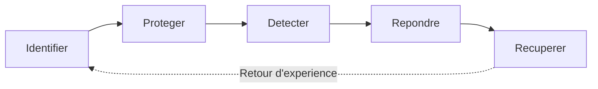

CHAPITRE 71

# Cadre NIST Cybersecurity Framework

🎯 Objectif du chapitre
Formaliser, à l'échelle de toute l'organisation, les principes de sécurité déjà rencontrés au fil des soixante-dix chapitres précédents — souvent introduits en réaction à un incident précis plutôt que dans un cadre structuré d'ensemble. À la fin de ce chapitre, tu comprendras les cinq fonctions du NIST Cybersecurity Framework (Identifier, Protéger, Détecter, Répondre, Récupérer), et tu sauras y rattacher les mesures déjà mises en place dans ce manuel pour identifier les lacunes restantes.

🎬 Mise en situation
La RSSI, forte du constat de l'audit de segmentation (chapitre 70), présente au comité de direction un rétrospectif éclairant : chaque mesure de sécurité de l'entreprise a été introduite en réaction à un incident précis — le MFA après le phishing (chapitre 25), la segmentation renforcée après l'audit, le plan de continuité après l'exercice de simulation d'ouragan (chapitre 32). <em>"Nous avons de bonnes mesures individuelles,"</em> résume-t-elle, <em>"mais aucun cadre commun ne nous dit si nous couvrons vraiment l'ensemble du risque, ou si nous avons simplement colmaté les brèches les plus visibles au fur et à mesure qu'elles sont apparues."</em> Le comité demande l'adoption d'un cadre reconnu internationalement. La RSSI propose le NIST Cybersecurity Framework.

## 71.1 Le problème : une sécurité construite par réaction, jamais par cadre

📌 À retenir — le constat de la RSSI, rendu explicite
Une sécurité construite exclusivement en réaction à des incidents successifs traite efficacement les problèmes déjà survenus, mais ne garantit rien sur les risques pas encore matérialisés — une organisation ne sait jamais si elle a couvert l'ensemble du risque réel, ou seulement les incidents qu'elle a eu la chance ou le malheur de rencontrer jusqu'ici. Un cadre structuré comme le NIST CSF permet d'évaluer la couverture de sécurité de façon systématique, plutôt que de dépendre du hasard des incidents passés.

## 71.2 Les cinq fonctions du NIST Cybersecurity Framework

📌 À retenir
Le **NIST Cybersecurity Framework** organise l'ensemble des activités de cybersécurité d'une organisation en cinq fonctions : **Identifier** (comprendre ce qu'il faut protéger), **Protéger** (mettre en œuvre des mesures de défense), **Détecter** (repérer un incident en cours), **Répondre** (contenir et traiter un incident détecté), **Récupérer** (restaurer les opérations normales après un incident). Ces cinq fonctions ne se succèdent pas de façon strictement linéaire — elles opèrent en continu et simultanément, chacune se renforçant mutuellement.

## 71.3 Identifier : rappel direct du chapitre 3

💡 Rattacher ce qui existe déjà
La fonction **Identifier** couvre l'inventaire des actifs, l'évaluation des risques et la compréhension du contexte métier — exactement le rôle déjà rempli par la documentation et la gestion des actifs établies au chapitre 3, la toute première fondation posée dans ce manuel. Sans un inventaire fiable de ce qu'il faut protéger, aucune des quatre fonctions suivantes ne peut être correctement dimensionnée.

## 71.4 Protéger : rappel direct de la majorité des chapitres précédents

💡 La fonction la plus richement couverte jusqu'ici
La fonction **Protéger** couvre l'ensemble des mesures préventives déjà déployées dans ce manuel : l'authentification multifacteur (chapitre 25), le principe de moindre privilège d'Active Directory (chapitres 22-25), le pare-feu nouvelle génération (chapitre 66), le VPN chiffré (chapitre 69), et la segmentation réseau (chapitre 70). Le constat de la RSSI dans le scénario d'ouverture révèle que cette fonction, bien que richement couverte, l'a été de façon dispersée plutôt que planifiée dans un cadre global.

## 71.5 Détecter : rappel direct de la Partie 10

💡 Rattacher ce qui existe déjà
La fonction **Détecter** couvre l'ensemble de la Partie 10 de ce manuel — la supervision (chapitre 58), Zabbix et Prometheus (chapitres 59-60), la centralisation des logs (chapitres 62-63), et l'analyse de trafic réseau (chapitre 64). Un incident non détecté reste un incident non contenu, quelle que soit par ailleurs la qualité des mesures de protection en place.

## 71.6 Répondre : un aperçu avant le chapitre 79

📌 À retenir
La fonction **Répondre** couvre les activités menées une fois un incident détecté — contenir sa propagation, communiquer avec les parties prenantes concernées, et documenter les actions entreprises. Ce manuel n'a jusqu'ici couvert cette fonction que ponctuellement, à travers le récit des incidents du fil rouge — un traitement formel et procédural de la réponse à incident sera présenté au chapitre 79, clôturant cette partie.

## 71.7 Récupérer : rappel direct des chapitres 30 à 32

💡 Rattacher ce qui existe déjà
La fonction **Récupérer** couvre le retour à un fonctionnement normal après un incident — exactement le rôle déjà rempli par les stratégies de sauvegarde (chapitre 30), le plan de reprise d'activité (chapitre 31) et le plan de continuité d'activité (chapitre 32). Une organisation qui détecte et contient efficacement un incident, mais sans capacité de récupération éprouvée, reste vulnérable à un impact prolongé bien après la neutralisation de la menace initiale.

## 71.8 Niveaux de maturité et profils : un usage pratique du cadre

📌 À retenir
Le NIST CSF définit également des **Tiers** (niveaux de maturité, de partiel à adaptatif) et permet de construire un **profil** — l'état actuel de sécurité de l'organisation comparé à un état cible souhaité. Cette comparaison rend visible, fonction par fonction, où se situent les lacunes réelles de l'organisation — exactement l'exercice que la RSSI propose de mener dans le scénario d'ouverture, plutôt que de continuer à ajouter des mesures ponctuelles sans vue d'ensemble.

## Atelier — Cartographier les mesures existantes selon le NIST CSF

🛠️ Atelier 71 — Répondre à la demande du comité de direction

**Objectif** : cartographier les mesures de sécurité déjà en place dans l'entreprise du fil rouge selon les cinq fonctions du NIST CSF, et identifier les lacunes.

**Préparation** : une revue des chapitres précédents pertinents pour chaque fonction (sections 71.3 à 71.7).

**Étapes détaillées** :

1. Liste, pour chacune des cinq fonctions, les mesures déjà couvertes dans ce manuel jusqu'ici.
2. Identifie la fonction la mieux couverte et la fonction la moins couverte.
3. Propose une priorité d'investissement pour la fonction identifiée comme la moins couverte.
4. Explique pourquoi une organisation qui investit exclusivement dans la fonction Protéger, en négligeant Détecter et Répondre, reste vulnérable malgré cet investissement.
5. Compare ta démarche à la section "Résultat attendu".

**Résultat attendu** : la fonction Protéger apparaît généralement la mieux couverte, ayant bénéficié du plus grand nombre de chapitres et de mesures dans ce manuel (Active Directory, MFA, pare-feu, VPN, segmentation). La fonction Répondre apparaît la moins formellement couverte à ce stade, traitée jusqu'ici uniquement à travers le récit des incidents plutôt que par une procédure structurée — une lacune que le chapitre 79 comblera. Une organisation exclusivement centrée sur la fonction Protéger reste vulnérable car aucune mesure préventive n'est efficace à 100 % : sans capacité de détection, un incident ayant contourné les défenses préventives peut se propager silencieusement pendant une durée prolongée avant d'être découvert, et sans procédure de réponse formalisée, sa contention dépend alors de l'improvisation plutôt que d'un processus éprouvé.

**Dépannage** : si la cartographie révèle qu'une fonction entière semble n'avoir aucune mesure associée, vérifie que le terme employé par le NIST CSF ne correspond pas simplement à un vocabulaire différent d'une mesure déjà en place sous un autre nom — les cinq fonctions couvrent des activités généralement déjà pratiquées, au moins partiellement, même sans référence explicite au cadre lui-même.

## Erreurs fréquentes

⚠️ Erreur n°1 — traiter le NIST CSF comme un document théorique jamais appliqué concrètement
Un cadre adopté formellement, mais jamais utilisé pour orienter réellement les priorités d'investissement en sécurité, n'apporte aucun bénéfice réel au-delà de sa simple existence documentaire.

⚠️ Erreur n°2 — sur-investir dans une seule fonction, au détriment des quatre autres
Rappel de l'atelier : un investissement déséquilibré, même dans une fonction légitimement importante comme Protéger, laisse les autres fonctions vulnérables et compromet l'efficacité globale de la posture de sécurité.

⚠️ Erreur n°3 — établir un profil une seule fois, sans jamais le réviser
Rappel indirect des chapitres 65 et 70 : une posture de sécurité, comme une topologie réseau ou une politique de segmentation, se dégrade avec le temps sans révision périodique du profil de maturité établi.

## Diagnostiquer une organisation sans cadre de sécurité commun

🩺 Symptôme : chaque mesure de sécurité de l'organisation semble décidée isolément, sans cohérence d'ensemble visible

- **Diagnostic** : ce symptôme, exactement celui identifié par la RSSI dans le scénario d'ouverture, indique généralement l'absence d'un cadre de référence partagé, chaque décision de sécurité étant prise en réaction à un événement précis plutôt qu'en cohérence avec une vision d'ensemble.
- **Comment vérifier** : tenter de cartographier les mesures existantes selon les cinq fonctions du NIST CSF (comme dans l'atelier de ce chapitre) — l'absence de mesures dans une ou plusieurs fonctions révèle concrètement les angles morts de l'organisation.
- **Résolution** : adopter formellement un cadre de référence comme le NIST CSF, établir un profil de maturité actuel, et prioriser les investissements futurs selon les lacunes identifiées plutôt que selon le prochain incident qui surviendra.

## En entreprise

- **Bonne pratique répandue** : réviser le profil de maturité NIST CSF de l'organisation au moins annuellement, en cohérence avec le cycle de revue déjà recommandé pour d'autres politiques de sécurité dans ce manuel.
- **Bonne pratique répandue** : utiliser le cadre pour communiquer l'état de la sécurité au comité de direction dans un langage structuré et reconnu internationalement, plutôt qu'à travers une liste de mesures techniques difficile à interpréter pour un public non technique.
- **Erreur classique observée** : un cadre de sécurité adopté à la suite d'une exigence contractuelle ou réglementaire, produit une fois pour satisfaire cette exigence ponctuelle, puis jamais intégré réellement dans le processus de décision courant de l'organisation.

## Entretien technique

💼 Questions fréquemment posées en entretien

**Q1. "Quelles sont les cinq fonctions du NIST Cybersecurity Framework, et comment s'articulent-elles entre elles ?"**
Réponse attendue : Identifier, Protéger, Détecter, Répondre, Récupérer — ces cinq fonctions opèrent en continu et simultanément plutôt que de façon strictement séquentielle, chacune se renforçant mutuellement ; un retour d'expérience après un incident nourrit généralement une amélioration de la fonction Identifier.

**Q2. "Pourquoi une organisation qui investit exclusivement dans la prévention (fonction Protéger) reste-t-elle vulnérable ?"**
Réponse attendue : aucune mesure préventive n'est efficace à 100 % ; sans capacité de détection, un incident ayant contourné les défenses préventives peut se propager silencieusement, et sans procédure de réponse formalisée, sa contention dépend de l'improvisation plutôt que d'un processus éprouvé.

**Q3. "À quoi sert un profil de maturité dans le cadre du NIST CSF ?"**
Réponse attendue : à comparer l'état actuel de sécurité de l'organisation, fonction par fonction, à un état cible souhaité, rendant visibles les lacunes réelles et permettant de prioriser les investissements futurs de façon structurée plutôt que réactive.

## Optimisation, sécurité et maintenabilité — les réflexes dès ce chapitre

🔒 Sécurité
Ne considère jamais une fonction du NIST CSF comme suffisamment couverte de façon permanente — chaque fonction nécessite un investissement continu, la menace et l'infrastructure évoluant constamment.

✅ Maintenabilité
Documente explicitement le rattachement de chaque mesure de sécurité existante à l'une des cinq fonctions du cadre, facilitant l'identification rapide des lacunes lors de toute revue future.

🚀 Performance
L'adoption d'un cadre structuré comme le NIST CSF améliore l'efficacité des investissements de sécurité en évitant la redondance de mesures similaires et en révélant les lacunes réellement prioritaires, plutôt que de disperser les ressources de façon réactive.

## Résumé du chapitre

- Une sécurité construite exclusivement en réaction aux incidents ne garantit rien sur les risques pas encore matérialisés.
- Le NIST CSF organise la cybersécurité en cinq fonctions continues et interdépendantes : Identifier, Protéger, Détecter, Répondre, Récupérer.
- La fonction Identifier correspond à l'inventaire des actifs déjà établi au chapitre 3.
- La fonction Protéger correspond à la majorité des mesures préventives déjà couvertes dans ce manuel.
- La fonction Détecter correspond à l'ensemble de la Partie 10 consacrée à la supervision.
- La fonction Récupérer correspond aux stratégies de sauvegarde et aux plans de continuité déjà établis aux chapitres 30 à 32.
- Un profil de maturité permet de comparer l'état actuel à un état cible, révélant les lacunes réelles pour prioriser les investissements futurs.

## Quiz

📝 QCM (une seule bonne réponse par question)

1. Les cinq fonctions du NIST Cybersecurity Framework sont :
   - a) Planifier, Construire, Tester, Déployer, Maintenir
   - b) Identifier, Protéger, Détecter, Répondre, Récupérer
   - c) Analyser, Concevoir, Implémenter, Vérifier, Clôturer
   - d) Prévenir, Détecter, Corriger, Documenter, Archiver

2. La fonction "Détecter" du NIST CSF correspond principalement, dans ce manuel, à :
   - a) La Partie 5 sur le stockage et la continuité
   - b) La Partie 10 sur la supervision, la journalisation et l'observabilité
   - c) La Partie 9 sur l'automatisation
   - d) La Partie 6 sur la virtualisation

3. Un profil de maturité NIST CSF sert principalement à :
   - a) Remplacer le besoin de toute mesure de sécurité technique
   - b) Comparer l'état actuel de sécurité à un état cible, révélant les lacunes réelles
   - c) Chiffrer automatiquement les données sensibles
   - d) Éliminer le besoin d'un plan de continuité d'activité

**Corrigé** : 1-b, 2-b, 3-b.

📝 Vrai ou Faux

1. Les cinq fonctions du NIST CSF se succèdent de façon strictement linéaire, l'une après l'autre. — **Faux** (elles opèrent en continu et simultanément, section 71.2).
2. Une organisation exclusivement centrée sur la prévention reste vulnérable en l'absence de capacité de détection et de réponse. — **Vrai**.
3. Un profil de maturité NIST CSF, une fois établi, n'a pas besoin d'être révisé ultérieurement. — **Faux** (section "Erreur n°3").
4. La fonction Récupérer correspond aux stratégies de sauvegarde et aux plans de continuité déjà couverts dans ce manuel. — **Vrai**.

📝 Questions ouvertes

1. Explique pourquoi le constat de la RSSI dans le scénario d'ouverture — une sécurité "construite par réaction successive" — n'est pas nécessairement le signe d'une mauvaise gestion, mais plutôt une évolution naturelle sans cadre structuré préalable.
2. Un collègue affirme que puisque l'entreprise du fil rouge dispose déjà de nombreuses mesures de sécurité solides (chapitres 22-26, 66-70), l'adoption formelle d'un cadre comme le NIST CSF n'apporterait aucune valeur supplémentaire. Discute cette affirmation.

**Corrigé 1** : chaque mesure de sécurité introduite au fil de ce manuel (MFA après le phishing, segmentation renforcée après l'audit, plan de continuité après l'exercice de simulation) constituait une réponse rationnelle et appropriée au risque identifié à ce moment précis. Le problème n'est pas la qualité individuelle de chaque mesure, mais l'absence d'un cadre permettant de savoir, à un instant donné, si l'ensemble de ces mesures couvre réellement l'ensemble du risque de l'organisation, ou seulement les incidents déjà rencontrés par chance ou par malheur. Une organisation qui n'a encore jamais eu de cadre structuré n'a généralement pas eu l'occasion de se poser cette question de couverture globale plus tôt — l'adoption d'un cadre comme le NIST CSF n'est donc pas une correction d'erreurs passées, mais une maturation naturelle de la gestion de la sécurité à mesure que l'organisation grandit.

**Corrigé 2** : cette affirmation sous-estime la valeur du cadre au-delà des mesures techniques elles-mêmes. Même avec des mesures individuellement solides, sans cadre de référence, l'organisation ne peut pas répondre avec certitude à la question "sommes-nous réellement couverts sur l'ensemble du risque, ou avons-nous simplement traité les incidents déjà survenus ?" — exactement la question posée par la RSSI dans le scénario d'ouverture. Le cadre apporte une valeur distincte des mesures techniques elles-mêmes : une vision structurée permettant d'identifier les lacunes invisibles (par exemple, une fonction Répondre peu formalisée malgré des mesures de Protéger très solides), et un langage commun pour communiquer l'état de la sécurité à des parties prenantes non techniques, comme le comité de direction du scénario d'ouverture.

## Exercices

📝 Exercice 71.1

Pour chacune des mesures suivantes déjà rencontrées dans ce manuel, indique à quelle fonction du NIST CSF elle appartient principalement : (a) l'inventaire des actifs du chapitre 3 ; (b) le pare-feu nouvelle génération Fortinet du chapitre 66 ; (c) la pile ELK du chapitre 62 ; (d) le plan de reprise d'activité du chapitre 31.

**Corrigé :** (a) Identifier — l'inventaire des actifs constitue la fondation même de cette fonction (section 71.3). (b) Protéger — le pare-feu nouvelle génération constitue une mesure de défense préventive (section 71.4). (c) Détecter — la centralisation des logs permet de repérer un incident en cours (section 71.5). (d) Récupérer — le plan de reprise d'activité vise le retour à un fonctionnement normal après un incident (section 71.7).

📝 Exercice 71.2

Rédige, en 3 à 5 phrases, une règle d'équipe garantissant que le profil de maturité NIST CSF de l'organisation est révisé au moins annuellement, en t'appuyant sur le risque décrit à la section "Erreur n°3".

**Corrigé (exemple de réponse) :** Le profil de maturité NIST CSF de l'organisation sera révisé formellement une fois par an, à l'occasion d'une réunion dédiée impliquant la RSSI et les responsables techniques concernés par chacune des cinq fonctions. Cette révision comparera l'état actuel des mesures en place à l'état cible précédemment défini, identifiant explicitement toute nouvelle lacune apparue depuis la dernière revue, qu'elle résulte d'une évolution de l'infrastructure ou d'un changement du paysage de menace. Les priorités d'investissement en sécurité pour l'année suivante seront directement dérivées des lacunes identifiées lors de cette revue, plutôt que fixées de façon ad hoc au fil des incidents rencontrés, évitant de reproduire le constat initial de la RSSI dans le scénario d'ouverture de ce chapitre.

## Checklist de fin de chapitre

<ul class="checklist">
<li>☐ Je comprends pourquoi une sécurité construite exclusivement en réaction aux incidents laisse des lacunes invisibles.</li>
<li>☐ Je sais nommer et expliquer les cinq fonctions du NIST Cybersecurity Framework.</li>
<li>☐ Je sais rattacher les mesures de sécurité déjà couvertes dans ce manuel à chacune des cinq fonctions.</li>
<li>☐ Je comprends pourquoi un investissement déséquilibré entre les fonctions laisse l'organisation vulnérable.</li>
<li>☐ Je sais expliquer l'usage pratique d'un profil de maturité NIST CSF.</li>
<li>☐ Je sais diagnostiquer une organisation dépourvue de cadre de sécurité commun.</li>
</ul>

## FAQ

<dl class="faq">
<dt>Le NIST CSF est-il une certification, comme ISO 27001 abordée au chapitre suivant ?</dt>
<dd>Non, le NIST CSF est un cadre de référence volontaire, sans processus de certification formelle associé — il diffère en cela d'ISO 27001, qui fait l'objet d'une certification par un organisme tiers, un contraste approfondi au chapitre 72.</dd>

<dt>Le NIST CSF est-il applicable uniquement aux grandes organisations ?</dt>
<dd>Non, le cadre reste applicable à des organisations de toute taille, avec un niveau de formalisme adaptable — une petite structure peut appliquer les mêmes cinq fonctions avec des mesures proportionnées à sa taille, sans nécessiter la même complexité procédurale qu'une grande entreprise.</dd>

<dt>Faut-il choisir entre le NIST CSF et d'autres cadres comme ISO 27001 ou les CIS Benchmarks ?</dt>
<dd>Non, ces cadres, présentés dans les chapitres suivants de cette partie, sont généralement complémentaires plutôt que concurrents — de nombreuses organisations combinent plusieurs cadres, chacun apportant une perspective ou un niveau de détail différent sur la même réalité de sécurité.</dd>

<dt>Combien de temps faut-il pour établir un premier profil de maturité NIST CSF pour une organisation ?</dt>
<dd>Un premier exercice de cartographie, comme celui réalisé dans l'atelier de ce chapitre, peut être mené en quelques semaines pour une organisation de taille moyenne, à condition de disposer déjà d'un inventaire des actifs et des mesures existantes suffisamment documenté.</dd>
</dl>

## Références et pour aller plus loin

- NIST — Cybersecurity Framework (CSF) 2.0 : [https://www.nist.gov/cyberframework](https://www.nist.gov/cyberframework)
- NIST — Quick Start Guide du CSF : [https://csrc.nist.gov/projects/cybersecurity-framework](https://csrc.nist.gov/projects/cybersecurity-framework)

*Chapitre suivant : la norme ISO/IEC 27001 — un cadre de gouvernance de la sécurité de l'information complémentaire au NIST CSF, avec un processus de certification formelle par un organisme tiers.*
