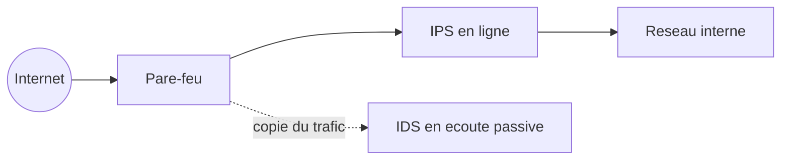

CHAPITRE 75

# IDS/IPS

🎯 Objectif du chapitre
Approfondir la détection et la prévention d'intrusion au niveau réseau, déjà mentionnée brièvement au chapitre 66, comme source d'événements précieuse à intégrer directement au SIEM construit au chapitre précédent. À la fin de ce chapitre, tu comprendras la différence entre un IDS et un IPS, la distinction entre détection par signature et par anomalie, le bon positionnement réseau de ces outils, et le risque spécifique de faux positifs en mode de blocage actif.

🎬 Mise en situation
Le SIEM du chapitre 74 corrèle efficacement les événements Active Directory et pare-feu déjà disponibles, mais reste aveugle à une catégorie entière de menaces : les tentatives d'exploitation de vulnérabilités réseau détectables uniquement par l'inspection fine du trafic lui-même — un scan de ports méthodique, une tentative d'exploitation d'une faille connue dans un service exposé, un motif de trafic caractéristique d'un outil d'attaque automatisé. <em>"Notre SIEM corrèle très bien ce qu'on lui donne,"</em> observe la RSSI, <em>"mais on ne lui donne rien sur ce qui se passe vraiment au niveau du réseau lui-même."</em> Un IDS/IPS comble directement cette lacune, en reprenant le fil laissé en suspens au chapitre 66.

## 75.1 Le problème : une source d'événements réseau manquante

📌 À retenir — rappel direct de la section 74.4
Un SIEM ne peut corréler que les sources qu'il ingère réellement — sans une source dédiée à l'inspection fine du trafic réseau, aucune règle de corrélation, aussi bien conçue soit-elle, ne peut détecter un scan de ports ou une tentative d'exploitation caractéristique au niveau du trafic lui-même. Un IDS/IPS comble exactement cette lacune, en fournissant au SIEM une nouvelle catégorie d'événements qu'aucune des sources déjà intégrées (Active Directory, pare-feu, logs applicatifs) ne peut produire.

## 75.2 IDS et IPS : détecter, ou détecter et bloquer

📌 À retenir
Un **IDS** (Intrusion Detection System) observe passivement le trafic réseau, détecte une activité suspecte et génère une alerte, sans intervenir directement sur ce trafic. Un **IPS** (Intrusion Prevention System) va plus loin : positionné directement dans le chemin du trafic, il peut bloquer activement une connexion identifiée comme malveillante, en temps réel, avant qu'elle n'atteigne sa destination — un rôle similaire à celui déjà entrevu pour le module IPS intégré au pare-feu Fortinet à la section 66.6.

## 75.3 Détection par signature et détection par anomalie

💡 Deux approches complémentaires
La **détection par signature** compare le trafic à une base de motifs d'attaque déjà connus et documentés — rapide et fiable pour des menaces déjà répertoriées, mais incapable de détecter une attaque totalement nouvelle dont aucune signature n'existe encore. La **détection par anomalie** établit un profil de comportement normal pour le réseau surveillé, et signale tout écart significatif par rapport à ce profil — capable de détecter des menaces inédites, mais avec un risque plus élevé de faux positifs face à un comportement légitime mais inhabituel.

## 75.4 Positionnement réseau : écoute passive ou en ligne

💡 Rappel direct du chapitre 64
Un IDS, fonctionnant en écoute passive, se positionne généralement via un port mirroring ou un TAP réseau — exactement le même principe déjà rencontré pour la capture de trafic avec Wireshark au chapitre 64, observant une copie du trafic sans jamais l'affecter directement. Un IPS, devant bloquer activement le trafic, doit impérativement être positionné directement dans le chemin de ce trafic (*inline*) — une différence de positionnement qui a des implications importantes en cas de panne de l'équipement lui-même, abordées à la section suivante.

## 75.5 Le risque spécifique de l'IPS : bloquer du trafic légitime

⚠️ Un enjeu plus sévère que pour un simple faux positif d'alerte
Un faux positif d'un IDS génère simplement une alerte inutile, examinée puis écartée par un analyste — une nuisance gérable. Un faux positif d'un IPS **bloque activement** une connexion légitime, avec un impact direct et immédiat sur l'activité de l'entreprise — un risque comparable, mais plus sévère, à celui déjà rencontré pour une politique de pare-feu nouvelle génération trop stricte au chapitre 66. Ce risque justifie une approche prudente et progressive avant d'activer le blocage automatique.

## 75.6 Intégrer les événements IDS/IPS au SIEM

✅ Boucler la boucle avec le chapitre précédent
Les événements générés par l'IDS/IPS, une fois intégrés au SIEM déjà construit au chapitre 74, enrichissent considérablement les règles de corrélation existantes — une tentative d'exploitation détectée par l'IDS, immédiatement suivie d'une authentification réussie sur le serveur ciblé, constitue un signal de compromission bien plus fort que chacun des deux événements pris isolément, exactement le même principe de corrélation multi-source déjà établi au chapitre 74.

## 75.7 Snort et Suricata : des références open source

💡 Le même schéma que les autres outils libres déjà rencontrés
**Snort** et **Suricata** sont deux moteurs IDS/IPS open source largement reconnus et documentés, comparables par leur maturité et leur adoption aux autres outils libres déjà rencontrés dans ce manuel (Zabbix, Prometheus, la pile ELK) — un choix pragmatique et bien établi, particulièrement pour une organisation cherchant une solution éprouvée sans dépendance à un fournisseur commercial spécifique.

## Atelier — Déployer un IDS et l'intégrer au SIEM

🛠️ Atelier 75 — Combler la lacune identifiée dans le scénario d'ouverture

**Objectif** : déployer un IDS en écoute passive entre le pare-feu et le réseau interne, et intégrer ses alertes au SIEM déjà construit au chapitre 74.

**Préparation** : un port mirroring configuré sur le commutateur central (rappel du chapitre 65), un IDS basé sur Suricata ou Snort.

**Étapes détaillées** :

1. Configure l'IDS en écoute passive via le port mirroring (section 75.4).
2. Simule un scan de ports depuis un poste de test et vérifie que l'IDS génère bien une alerte correspondante.
3. Configure la transmission des alertes de l'IDS vers le SIEM (section 75.6).
4. Explique pourquoi ce déploiement commence délibérément en mode IDS (écoute passive) plutôt qu'en mode IPS (blocage actif).
5. Compare ta démarche à la section "Résultat attendu".

**Résultat attendu** : l'IDS détecte et journalise le scan de ports simulé, sans interrompre aucun trafic — un choix délibéré pour cette première phase de déploiement, permettant d'observer le comportement réel de l'outil sur le trafic normal de l'entreprise, d'ajuster ses règles de détection, et de mesurer son taux de faux positifs avant d'envisager un passage en mode IPS avec blocage actif (section 75.5). L'intégration au SIEM enrichit les règles de corrélation existantes, capables désormais de croiser un événement réseau (détecté par l'IDS) avec un événement d'identité ou applicatif déjà intégré au chapitre 74.

**Dépannage** : si l'IDS ne détecte aucun événement malgré le scan de test effectué, vérifie que le port mirroring est bien configuré pour capturer le trafic pertinent — exactement le même type d'erreur de positionnement déjà rencontré pour une capture Wireshark lancée sur la mauvaise interface au chapitre 64.

## Erreurs fréquentes

⚠️ Erreur n°1 — déployer directement en mode IPS inline sans période d'observation préalable
Rappel de la section 75.5 : un risque élevé de bloquer du trafic légitime avant d'avoir eu l'occasion de calibrer correctement les règles de détection sur le trafic réel de l'organisation.

⚠️ Erreur n°2 — des signatures d'attaque jamais mises à jour
Un IDS/IPS reposant sur une base de signatures obsolète ne détecte pas les menaces documentées après sa dernière mise à jour, offrant une fausse impression de protection contre des menaces pourtant déjà bien connues.

⚠️ Erreur n°3 — un IDS positionné à un endroit du réseau où il ne voit pas le trafic pertinent
Rappel de l'atelier : un mauvais positionnement réseau, exactement le même type d'erreur déjà rencontré pour une capture réseau lancée sur la mauvaise interface au chapitre 64, rend l'outil totalement inefficace malgré une configuration par ailleurs correcte.

## Diagnostiquer un IDS silencieux malgré une attaque de test

🩺 Symptôme : une attaque de test ne déclenche aucune alerte sur l'IDS, malgré un déploiement apparemment fonctionnel

- **Diagnostic** : vérifier, dans l'ordre, si le positionnement réseau (port mirroring ou TAP) capture bien le trafic pertinent, si les signatures utilisées couvrent le type d'attaque testé, et si le moteur IDS lui-même est actif et fonctionnel.
- **Comment vérifier** : capturer directement le trafic sur l'interface d'écoute de l'IDS avec Wireshark (chapitre 64) pendant le test, confirmant si le trafic attendu atteint réellement l'outil.
- **Résolution** : la cause la plus fréquente reste un positionnement réseau incorrect, suivie d'une base de signatures obsolète ne couvrant pas le type d'attaque testé.

## En entreprise

- **Bonne pratique répandue** : toujours débuter le déploiement d'un IPS par une phase d'observation en mode IDS, mesurant le taux de faux positifs réel sur le trafic de l'organisation avant d'activer un blocage automatique.
- **Bonne pratique répandue** : maintenir les signatures d'attaque à jour selon un calendrier régulier, au même titre que les mises à jour de sécurité déjà couvertes pour les systèmes d'exploitation dans ce manuel.
- **Erreur classique observée** : un IPS activé en mode blocage dès son installation initiale, provoquant l'interruption d'une application métier critique quelques heures plus tard à cause d'un faux positif — un incident qui aurait été évité par la phase d'observation préalable recommandée à la section 75.5.

## Entretien technique

💼 Questions fréquemment posées en entretien

**Q1. "Quelle est la différence fondamentale entre un IDS et un IPS ?"**
Réponse attendue : un IDS observe passivement le trafic et génère une alerte sans intervenir ; un IPS, positionné directement dans le chemin du trafic, peut bloquer activement une connexion identifiée comme malveillante en temps réel.

**Q2. "Quelle est la différence entre la détection par signature et la détection par anomalie ?"**
Réponse attendue : la détection par signature compare le trafic à des motifs d'attaque déjà connus, rapide et fiable mais limitée aux menaces déjà documentées ; la détection par anomalie signale tout écart par rapport à un profil de comportement normal établi, capable de détecter des menaces inédites mais avec un risque plus élevé de faux positifs.

**Q3. "Pourquoi recommande-t-on de déployer un nouvel IPS d'abord en mode d'observation, plutôt qu'en mode de blocage actif dès le départ ?"**
Réponse attendue : un faux positif en mode blocage interrompt une connexion légitime avec un impact direct sur l'activité de l'entreprise ; une phase d'observation préalable permet de calibrer les règles et de mesurer le taux de faux positifs réel avant d'accepter le risque d'un blocage automatique.

## Optimisation, sécurité et maintenabilité — les réflexes dès ce chapitre

🔒 Sécurité
Intègre systématiquement les événements de l'IDS/IPS au SIEM déjà en place — leur valeur de détection augmente significativement lorsqu'ils sont corrélés avec d'autres sources, plutôt que consultés isolément.

✅ Maintenabilité
Planifie une mise à jour régulière des signatures d'attaque, avec une vérification périodique que ce processus fonctionne réellement — une base de signatures silencieusement obsolète offre une fausse impression de protection.

🚀 Performance
Un IPS en ligne introduit une latence supplémentaire sur le trafic qu'il inspecte, particulièrement sous forte charge — dimensionne l'équipement en fonction du volume de trafic réel attendu, pour éviter qu'il ne devienne lui-même un goulot d'étranglement sur des liens à fort débit.

## Résumé du chapitre

- Un SIEM ne peut corréler que les sources qu'il ingère ; un IDS/IPS fournit une source d'événements réseau indispensable, absente des sources déjà intégrées au chapitre 74.
- Un IDS observe passivement et alerte ; un IPS, positionné en ligne, peut bloquer activement le trafic malveillant en temps réel.
- La détection par signature couvre les menaces connues avec fiabilité ; la détection par anomalie couvre des menaces inédites avec un risque de faux positifs plus élevé.
- Un IDS se positionne en écoute passive, un IPS doit impérativement se positionner dans le chemin direct du trafic.
- Un faux positif en mode IPS bloque activement du trafic légitime, un risque plus sévère qu'une simple alerte inutile.
- Les événements IDS/IPS, intégrés au SIEM, enrichissent significativement les règles de corrélation existantes.

## Quiz

📝 QCM (une seule bonne réponse par question)

1. Un IPS, contrairement à un IDS, peut :
   - a) Uniquement générer des alertes sans intervenir sur le trafic
   - b) Bloquer activement une connexion identifiée comme malveillante en temps réel
   - c) Fonctionner uniquement en écoute passive
   - d) Remplacer complètement le besoin d'un pare-feu

2. La détection par anomalie, comparée à la détection par signature, présente l'avantage de :
   - a) Ne jamais générer de faux positif
   - b) Pouvoir détecter des menaces inédites, sans signature préexistante
   - c) Fonctionner uniquement sur du trafic chiffré
   - d) Ne nécessiter aucune mise à jour

3. Il est recommandé de déployer un nouvel IPS :
   - a) Directement en mode blocage actif, pour une protection immédiate maximale
   - b) D'abord en mode d'observation, avant d'activer le blocage automatique
   - c) Uniquement sur les réseaux sans trafic important
   - d) Sans jamais l'intégrer à un SIEM

**Corrigé** : 1-b, 2-b, 3-b.

📝 Vrai ou Faux

1. Un IDS peut fonctionner en écoute passive, de la même façon qu'une capture Wireshark via port mirroring. — **Vrai** (section 75.4).
2. Un faux positif d'un IPS a généralement le même impact qu'un faux positif d'un IDS. — **Faux** (section 75.5, l'IPS bloque activement le trafic).
3. Une base de signatures d'attaque jamais mise à jour continue de détecter efficacement les nouvelles menaces. — **Faux** (section "Erreur n°2").
4. Les événements générés par un IDS/IPS peuvent enrichir les règles de corrélation d'un SIEM déjà en place. — **Vrai** (section 75.6).

📝 Questions ouvertes

1. Explique pourquoi le SIEM du chapitre 74, aussi bien configuré soit-il, ne pouvait pas détecter le type de menace identifié dans le scénario d'ouverture de ce chapitre.
2. Un collègue, pressé par une exigence de sécurité urgente, souhaite activer immédiatement le mode blocage de l'IPS nouvellement déployé, sans phase d'observation préalable. Explique les risques et propose une alternative.

**Corrigé 1** : le SIEM du chapitre 74 corrèle les événements provenant des sources qu'il ingère réellement — Active Directory, pare-feu, logs applicatifs. Un scan de ports méthodique ou une tentative d'exploitation caractéristique au niveau du trafic réseau lui-même ne génère aucun événement dans ces sources existantes, ces activités n'étant visibles qu'à travers une inspection fine du trafic réseau — précisément ce qu'aucune des sources déjà intégrées ne fournit. Le SIEM ne peut corréler que ce qu'il reçoit ; sans une source IDS/IPS dédiée, cette catégorie entière de menaces reste structurellement invisible pour lui, quelle que soit la qualité de ses règles de corrélation.

**Corrigé 2** : activer immédiatement le blocage sans phase d'observation préalable expose l'organisation au risque déjà décrit à la section 75.5 — un faux positif bloquerait activement une connexion légitime, avec un impact direct et immédiat sur l'activité de l'entreprise, potentiellement plus dommageable dans l'urgence que le risque de sécurité que l'on cherche à traiter. Une alternative plus mesurée consisterait à activer le blocage uniquement pour les signatures présentant le plus haut niveau de confiance et le risque de faux positif le plus faible, en conservant le mode d'observation pour les signatures moins fiables — un compromis répondant partiellement à l'urgence exprimée tout en limitant le risque d'interruption de service, plutôt qu'un passage en blocage total et non calibré.

## Exercices

📝 Exercice 75.1

Propose une règle de corrélation SIEM combinant une alerte IDS de tentative d'exploitation détectée sur le serveur du portail client avec un second événement déjà disponible dans le SIEM du chapitre 74, pour distinguer une tentative isolée sans conséquence d'une compromission probable.

**Corrigé :** La règle pourrait se formuler ainsi : "une alerte IDS de tentative d'exploitation ciblant le serveur du portail client, suivie dans les dix minutes d'une connexion réseau inhabituelle initiée depuis ce même serveur vers une destination externe non répertoriée (événement pare-feu, chapitre 66), alors sévérité critique, alerter immédiatement l'équipe sécurité". Une tentative d'exploitation isolée, sans suite observable, reste fréquente et souvent sans conséquence réelle — de nombreuses tentatives échouent naturellement contre un système correctement à jour et durci (chapitre 73). En revanche, une tentative suivie d'un comportement réseau anormal en provenance du système ciblé constitue un indicateur bien plus fort d'une compromission effective, reproduisant exactement le même principe de corrélation multi-source déjà illustré au chapitre 74.

📝 Exercice 75.2

Rédige, en 3 à 5 phrases, une règle d'équipe garantissant qu'aucun IPS n'est activé en mode blocage sans une période d'observation préalable documentée, en t'appuyant sur le risque décrit à la section 75.5.

**Corrigé (exemple de réponse) :** Tout nouvel IPS déployé sur l'infrastructure de l'entreprise fonctionnera exclusivement en mode d'observation (IDS) pendant une période minimale de deux semaines, durant laquelle chaque alerte générée sera examinée pour distinguer les véritables positifs des faux positifs. Le passage en mode blocage actif ne sera autorisé qu'après validation explicite de la RSSI, sur la base d'un taux de faux positifs jugé suffisamment faible pour le trafic réel de l'organisation. Toute exception à cette règle, motivée par une urgence de sécurité avérée, nécessitera une justification documentée et se limitera si possible aux signatures présentant le plus haut niveau de confiance, plutôt qu'un blocage généralisé et non calibré de l'ensemble des signatures disponibles.

## Checklist de fin de chapitre

<ul class="checklist">
<li>☐ Je comprends pourquoi un SIEM nécessite une source d'événements réseau dédiée pour détecter certaines menaces.</li>
<li>☐ Je sais distinguer un IDS (détection passive) d'un IPS (blocage actif).</li>
<li>☐ Je sais expliquer la différence entre détection par signature et détection par anomalie.</li>
<li>☐ Je sais positionner correctement un IDS et un IPS sur le réseau.</li>
<li>☐ Je comprends le risque spécifique et plus sévère d'un faux positif en mode IPS.</li>
<li>☐ Je sais intégrer les événements IDS/IPS au SIEM pour enrichir les règles de corrélation.</li>
</ul>

## FAQ

<dl class="faq">
<dt>Un IDS/IPS remplace-t-il le besoin du pare-feu nouvelle génération du chapitre 66 ?</dt>
<dd>Non, les deux se complètent — le pare-feu filtre le trafic selon des politiques de zones et d'applications, tandis que l'IDS/IPS inspecte spécifiquement le trafic à la recherche de signatures ou d'anomalies d'attaque ; de nombreux NGFW intègrent d'ailleurs un module IPS, comme déjà mentionné à la section 66.6.</dd>

<dt>Faut-il déployer un IDS/IPS sur l'ensemble des segments réseau de l'entreprise ?</dt>
<dd>Une priorisation initiale sur les segments les plus exposés ou les plus critiques (comme la frontière avec Internet, ou l'accès aux serveurs les plus sensibles) reste généralement plus réaliste qu'un déploiement exhaustif immédiat, particulièrement pour une organisation débutant cette démarche.</dd>

<dt>Snort et Suricata sont-ils les seules options disponibles pour un IDS/IPS ?</dt>
<dd>Non, de nombreuses solutions commerciales existent également, souvent intégrées directement aux pare-feu nouvelle génération comme Fortinet — le choix entre une solution open source dédiée et une fonctionnalité intégrée à un équipement déjà en place dépend du contexte et des ressources de l'organisation.</dd>

<dt>Un IDS/IPS peut-il inspecter du trafic chiffré ?</dt>
<dd>Une inspection directe du contenu chiffré nécessite généralement un déchiffrement préalable (souvent via le pare-feu nouvelle génération lui-même), une inspection qui reste techniquement possible mais qui soulève des considérations de performance et de confidentialité à évaluer selon le contexte de l'organisation.</dd>
</dl>

## Références et pour aller plus loin

- Documentation officielle Suricata : [https://docs.suricata.io/en/latest/](https://docs.suricata.io/en/latest/)
- Documentation officielle Snort : [https://docs.snort.org/](https://docs.snort.org/)
- NIST — Guide to Intrusion Detection and Prevention Systems (SP 800-94) : [https://csrc.nist.gov/publications/detail/sp/800-94/final](https://csrc.nist.gov/publications/detail/sp/800-94/final)

*Chapitre suivant : l'EDR — étendre la détection et la protection au niveau des postes et des serveurs eux-mêmes, complétant la visibilité réseau déjà apportée par l'IDS/IPS de ce chapitre.*
