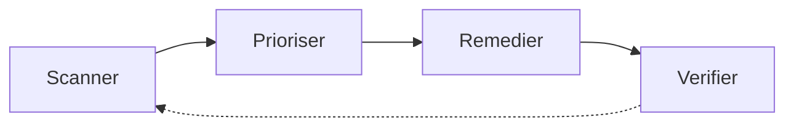

CHAPITRE 78

# Gestion des vulnérabilités et durcissement (hardening)

🎯 Objectif du chapitre
Traiter systématiquement, et pas seulement lors d'un test ponctuel comme celui du chapitre précédent, les failles de sécurité découvertes tout au long du cycle de vie de l'infrastructure. À la fin de ce chapitre, tu comprendras la gestion des vulnérabilités comme un cycle continu, le scoring CVSS pour prioriser objectivement, la discipline du patch management, et comment intégrer le durcissement du chapitre 73 de façon continue plutôt que ponctuelle.

🎬 Mise en situation
Six mois après le premier test d'intrusion (chapitre 77), un second test révèle un constat préoccupant : plusieurs vulnérabilités mineures identifiées lors du premier test, correctement corrigées à l'époque, sont réapparues — non pas les mêmes exactement, mais des variantes similaires sur de nouveaux serveurs déployés depuis. <em>"On corrige bien après chaque test,"</em> observe la RSSI, <em>"mais entre deux tests, rien ne surveille en continu l'apparition de nouvelles vulnérabilités sur les systèmes qu'on déploie."</em> Un test d'intrusion annuel ne suffit pas à couvrir les mois qui le séparent du suivant — une gestion continue des vulnérabilités devient nécessaire.

## 78.1 Le problème : un traitement ponctuel, pas continu

📌 À retenir — rappel direct de la section 77.7
Un test d'intrusion, même suivi rigoureusement d'un retest (section 77.7), n'offre qu'une photographie de la sécurité à un instant précis. Entre deux tests, de nouveaux serveurs sont déployés, de nouvelles versions logicielles publiées, de nouvelles vulnérabilités découvertes et documentées publiquement — un cycle continu de gestion des vulnérabilités devient nécessaire pour couvrir cet intervalle, plutôt que de dépendre uniquement de vérifications ponctuelles espacées de plusieurs mois.

## 78.2 La gestion des vulnérabilités : un cycle continu

💡 Rappel direct du chapitre 72 — encore la même roue d'amélioration continue
La gestion des vulnérabilités suit un cycle continu : **scanner** régulièrement l'infrastructure à la recherche de vulnérabilités connues, **prioriser** les résultats selon leur gravité réelle, **remédier** (corriger, atténuer, ou accepter le risque), **vérifier** que la remédiation a réellement fonctionné, puis recommencer — exactement le même cycle Planifier-Déployer-Contrôler-Améliorer déjà établi pour le SMSI d'ISO 27001 au chapitre 72, appliqué ici spécifiquement à la gestion des vulnérabilités techniques.

## 78.3 Scanner automatiquement, en continu

💡 Rappel direct des chapitres 57 et 73
Un scanner de vulnérabilités automatisé examine régulièrement l'infrastructure à la recherche de failles connues et documentées — exactement la même logique déjà rencontrée pour les scans de sécurité du pipeline DevSecOps (chapitre 57) et pour l'évaluation de conformité CIS-CAT (section 73.5), appliquée ici de façon continue et récurrente plutôt qu'une seule fois. Un scan planifié régulièrement (hebdomadaire ou mensuel selon la criticité des systèmes) détecte automatiquement l'apparition d'une nouvelle vulnérabilité sur un serveur, sans attendre le prochain test d'intrusion annuel pour la découvrir.

## 78.4 Le scoring CVSS : prioriser objectivement

📌 À retenir — rappel direct de la section 77.6
Le **CVSS** (Common Vulnerability Scoring System) attribue un score standardisé à chaque vulnérabilité connue, reflétant sa gravité selon des critères objectifs (facilité d'exploitation, impact potentiel, privilèges nécessaires). Ce score permet de prioriser objectivement les efforts de remédiation, exactement le même principe déjà établi pour prioriser les constats d'un rapport de test d'intrusion selon leur gravité réelle plutôt que leur ordre de découverte — une vulnérabilité au score CVSS élevé, facilement exploitable et à fort impact, mérite un traitement prioritaire par rapport à une vulnérabilité mineure au score faible.

## 78.5 Le patch management : une discipline, pas un réflexe ponctuel

💡 Rappel direct des chapitres 4 et 12
La gestion disciplinée des correctifs (**patch management**) s'appuie sur les outils déjà présentés dans ce manuel — WSUS pour les correctifs Windows (chapitre 12), les gestionnaires de paquets pour Linux (chapitre 15) — mais exige une discipline systématique plutôt qu'une application opportuniste : tester chaque correctif en environnement de test (rappel du chapitre 4) avant son déploiement en production, avec un délai raisonnable entre la publication d'un correctif critique et son application effective, proportionné à la gravité de la vulnérabilité qu'il corrige.

## 78.6 Intégrer le durcissement dans le cycle de vie continu

✅ Rappel direct de la section 73.7
Exactement le même principe déjà établi pour intégrer les CIS Benchmarks dans les images de base plutôt que de durcir manuellement chaque serveur (section 73.7) s'applique à l'ensemble du cycle de gestion des vulnérabilités : intégrer le scan de vulnérabilités et la vérification de durcissement directement dans le pipeline de déploiement (chapitre 56), garantissant qu'aucun nouveau serveur n'entre en production sans avoir traversé ces vérifications — répondant directement à la réapparition de vulnérabilités sur de nouveaux serveurs constatée dans le scénario d'ouverture.

## 78.7 La course contre la montre entre divulgation et exploitation

🔒 Sécurité — rappel indirect du chapitre 4
Dès qu'une vulnérabilité est publiquement divulguée, une course s'engage entre les défenseurs, qui doivent déployer le correctif, et les attaquants, qui cherchent à exploiter la vulnérabilité avant que les systèmes concernés ne soient corrigés — exactement le type de fenêtre d'exposition qui avait permis l'exploitation de l'accès RDP exposé au chapitre 4. Plus le délai entre la publication d'un correctif critique et son application réelle est long, plus cette fenêtre d'exposition reste ouverte à une exploitation potentielle.

## Atelier — Construire un processus continu pour le portail client

🛠️ Atelier 78 — Répondre au constat du scénario d'ouverture

**Objectif** : construire un processus de gestion des vulnérabilités continu pour le portail client, empêchant la réapparition de vulnérabilités déjà corrigées sur de nouveaux serveurs.

**Préparation** : le pipeline de déploiement du portail client déjà établi (chapitres 56-57).

**Étapes détaillées** :

1. Intègre un scan de vulnérabilités automatisé directement dans le pipeline de déploiement, avant toute mise en production d'un nouveau serveur (section 78.6).
2. Configure ce scan pour bloquer le déploiement en présence d'une vulnérabilité au score CVSS dépassant un seuil critique défini (section 78.4).
3. Planifie un scan récurrent de l'infrastructure déjà en production, indépendamment du pipeline de déploiement.
4. Explique pourquoi cette double approche (scan au déploiement et scan récurrent) couvre mieux le cycle de vie complet qu'une seule des deux mesures isolément.
5. Compare ta démarche à la section "Résultat attendu".

**Résultat attendu** : le scan intégré au pipeline de déploiement empêche qu'un nouveau serveur présentant une vulnérabilité critique connue n'entre en production, répondant directement au constat du scénario d'ouverture où des vulnérabilités similaires réapparaissaient sur de nouveaux déploiements. Le scan récurrent sur l'infrastructure déjà en production couvre un besoin distinct : détecter une vulnérabilité découverte et documentée après la mise en production d'un serveur, un système parfaitement sain au moment de son déploiement pouvant devenir vulnérable ultérieurement suite à la découverte d'une nouvelle faille dans un logiciel déjà installé. Aucune des deux mesures seules ne couvre l'ensemble du cycle de vie — leur combinaison, oui.

**Dépannage** : si le scan intégré au pipeline bloque un déploiement légitime à cause d'un score CVSS jugé disproportionné par rapport au risque réel dans le contexte spécifique de ce système, documente une exception justifiée plutôt que d'abaisser le seuil global de blocage pour l'ensemble du pipeline — exactement le même principe déjà établi pour les exceptions du pipeline DevSecOps au chapitre 57.

## Erreurs fréquentes

⚠️ Erreur n°1 — scanner sans jamais prioriser, submergé par le volume de résultats
Rappel de la section 78.4 : un scan produisant des centaines de résultats sans priorisation objective par score CVSS devient rapidement ingérable, l'équipe ne sachant par où commencer.

⚠️ Erreur n°2 — appliquer un correctif critique directement en production sans test préalable
Rappel du chapitre 4 : un correctif non testé peut introduire une régression inattendue, un risque à mettre en balance avec l'urgence réelle de la vulnérabilité corrigée.

⚠️ Erreur n°3 — aucune vérification après application d'un correctif
Rappel direct de la section 77.7 : le même piège déjà dénoncé pour un rapport de test d'intrusion jamais suivi de vérification s'applique à l'application d'un correctif de sécurité, potentiellement incomplète ou incorrecte sans confirmation.

## Diagnostiquer une vulnérabilité critique non corrigée depuis des mois

🩺 Symptôme : un scan révèle une vulnérabilité critique, connue et documentée publiquement depuis plusieurs mois, toujours non corrigée sur un système de production

- **Diagnostic** : vérifier si cette vulnérabilité avait déjà été identifiée par un scan précédent sans faire l'objet d'un suivi assigné, ou si le système concerné a échappé au périmètre des scans réguliers.
- **Comment vérifier** : consulter l'historique des scans précédents pour ce système, et le processus de suivi des remédiations déjà établi (rappel de la section "Diagnostiquer" du chapitre 77).
- **Résolution** : prioriser la correction immédiate compte tenu du délai d'exposition déjà écoulé (section 78.7), puis renforcer le processus de suivi ayant permis à cette vulnérabilité de rester non traitée aussi longtemps.

## En entreprise

- **Bonne pratique répandue** : planifier des scans de vulnérabilités récurrents à une fréquence proportionnée à la criticité de chaque système, plutôt qu'une fréquence uniforme pour l'ensemble de l'infrastructure.
- **Bonne pratique répandue** : définir des délais cibles de remédiation par niveau de score CVSS (par exemple, correction sous 48 heures pour une vulnérabilité critique activement exploitée, sous un mois pour une vulnérabilité mineure), formalisant la priorisation en engagement mesurable.
- **Erreur classique observée** : une organisation qui investit dans un scanner de vulnérabilités sophistiqué, produisant des rapports détaillés et réguliers, mais dont personne n'a la responsabilité claire de traiter effectivement ces résultats — reproduisant le même problème qu'un rapport de test d'intrusion jamais suivi de remédiation réelle.

## Entretien technique

💼 Questions fréquemment posées en entretien

**Q1. "Pourquoi un test d'intrusion annuel ne suffit-il pas à garantir une gestion efficace des vulnérabilités ?"**
Réponse attendue : un test d'intrusion offre une photographie à un instant précis ; entre deux tests, de nouveaux serveurs sont déployés et de nouvelles vulnérabilités découvertes, nécessitant un cycle continu de scan et de remédiation pour couvrir cet intervalle.

**Q2. "À quoi sert le score CVSS dans la gestion des vulnérabilités ?"**
Réponse attendue : il attribue un score standardisé et objectif à chaque vulnérabilité selon sa gravité réelle, permettant de prioriser les efforts de remédiation sur les risques les plus critiques plutôt que de traiter chaque constat avec la même priorité.

**Q3. "Pourquoi est-il important de tester un correctif de sécurité en environnement de test avant son application en production, même pour une vulnérabilité critique ?"**
Réponse attendue : un correctif non testé peut introduire une régression inattendue ; ce risque doit être mis en balance avec l'urgence réelle de la vulnérabilité corrigée, un délai de test raisonnable restant généralement préférable à une application non testée en urgence, sauf exploitation active avérée.

## Optimisation, sécurité et maintenabilité — les réflexes dès ce chapitre

🔒 Sécurité
Intègre le scan de vulnérabilités directement dans le pipeline de déploiement plutôt que de le traiter comme une vérification a posteriori — empêcher structurellement le déploiement d'un système vulnérable reste préférable à sa correction après mise en production.

✅ Maintenabilité
Définis des délais cibles de remédiation par niveau de score CVSS, transformant la priorisation théorique en engagement mesurable et suivi dans le temps.

🚀 Performance
Adapte la fréquence des scans récurrents à la criticité réelle de chaque système, évitant à la fois un scan trop rare sur un système critique et une charge de scan excessive sur des systèmes moins sensibles.

## Résumé du chapitre

- Un test d'intrusion ponctuel n'offre qu'une photographie à un instant précis ; un cycle continu de gestion des vulnérabilités couvre l'intervalle entre deux tests.
- Le cycle scanner-prioriser-remédier-vérifier reprend le même principe d'amélioration continue déjà établi pour le SMSI d'ISO 27001.
- Le scoring CVSS permet une priorisation objective des efforts de remédiation selon la gravité réelle de chaque vulnérabilité.
- Le patch management exige une discipline systématique de test préalable et de délai de correction proportionné à la gravité.
- Intégrer le scan de vulnérabilités et le durcissement directement dans le pipeline de déploiement empêche la réapparition de vulnérabilités déjà corrigées sur de nouveaux systèmes.
- Une vérification après application d'un correctif reste indispensable, reproduisant le même principe déjà établi pour le retest après un test d'intrusion.

## Quiz

📝 QCM (une seule bonne réponse par question)

1. Pourquoi un test d'intrusion annuel ne suffit-il pas seul à garantir une gestion efficace des vulnérabilités ?
   - a) Il coûte toujours trop cher pour être répété
   - b) De nouveaux serveurs et de nouvelles vulnérabilités apparaissent dans l'intervalle entre deux tests
   - c) Un test d'intrusion ne révèle jamais aucune vulnérabilité critique
   - d) Il remplace totalement le besoin de patch management

2. Le score CVSS sert principalement à :
   - a) Chiffrer automatiquement les données vulnérables
   - b) Prioriser objectivement les efforts de remédiation selon la gravité réelle
   - c) Remplacer le besoin d'un scanner de vulnérabilités
   - d) Éliminer le besoin de tester un correctif avant son application

3. Intégrer le scan de vulnérabilités dans le pipeline de déploiement permet principalement de :
   - a) Réduire le temps de compilation du code
   - b) Empêcher qu'un nouveau serveur vulnérable n'entre en production
   - c) Remplacer le besoin de scans récurrents sur l'infrastructure déjà en production
   - d) Éliminer le besoin du score CVSS

**Corrigé** : 1-b, 2-b, 3-b.

📝 Vrai ou Faux

1. Un scan de vulnérabilités intégré au pipeline de déploiement rend inutile tout scan récurrent sur l'infrastructure déjà en production. — **Faux** (section "Résultat attendu" de l'atelier, les deux couvrent des besoins distincts).
2. Le score CVSS permet de comparer objectivement la gravité de deux vulnérabilités différentes. — **Vrai**.
3. Un correctif de sécurité critique devrait toujours être appliqué immédiatement en production sans aucun test, quelle que soit la situation. — **Faux** (section "Erreur n°2", à mettre en balance avec le risque de régression).
4. Une vérification après application d'un correctif reste indispensable pour confirmer son efficacité réelle. — **Vrai** (section "Erreur n°3").

📝 Questions ouvertes

1. Explique pourquoi la RSSI, dans le scénario d'ouverture, ne considère pas les tests d'intrusion réguliers comme suffisants malgré leur utilité déjà démontrée au chapitre 77.
2. Un collègue propose de définir un seul délai de remédiation uniforme (par exemple, trente jours) pour toute vulnérabilité découverte, indépendamment de son score CVSS, "pour simplifier la gestion". Discute les limites de cette proposition.

**Corrigé 1** : les tests d'intrusion réguliers, tels que présentés au chapitre 77, restent des exercices ponctuels réalisés à intervalle généralement annuel — ils offrent une évaluation approfondie mais limitée dans le temps. Entre deux tests, l'infrastructure continue d'évoluer : de nouveaux serveurs sont déployés, de nouvelles versions logicielles installées, et de nouvelles vulnérabilités découvertes et documentées publiquement par la communauté de sécurité. Un test annuel ne peut, par construction, détecter une vulnérabilité apparue trois mois après sa réalisation — seule une gestion continue, via des scans récurrents et une intégration au pipeline de déploiement, peut couvrir cet intervalle et réduire la fenêtre d'exposition entre l'apparition d'une vulnérabilité et sa détection effective par l'organisation.

**Corrigé 2** : un délai uniforme, indépendant de la gravité réelle de chaque vulnérabilité, ignore précisément le principe de priorisation objective que le score CVSS est conçu pour apporter (section 78.4). Une vulnérabilité critique activement exploitée dans la nature, avec un score CVSS élevé, mérite une correction bien plus urgente qu'un délai uniforme de trente jours ne le permettrait — chaque jour de retard supplémentaire allongeant la fenêtre d'exposition décrite à la section 78.7. À l'inverse, une vulnérabilité mineure au score faible ne justifie pas nécessairement la même urgence, et un délai uniforme trop court pour toutes les vulnérabilités pourrait détourner des ressources limitées de remédiation vers des corrections à faible valeur ajoutée, au détriment des vulnérabilités réellement critiques.

## Exercices

📝 Exercice 78.1

Propose des délais cibles de remédiation différenciés pour trois niveaux de score CVSS (critique, élevé, moyen), en justifiant chaque choix par rapport au risque décrit à la section 78.7.

**Corrigé :** Pour une vulnérabilité critique (score CVSS élevé, exploitation active connue ou facilité d'exploitation très élevée), un délai de remédiation de 48 à 72 heures serait approprié, minimisant au maximum la fenêtre d'exposition décrite à la section 78.7, particulièrement si une exploitation est déjà documentée dans la nature. Pour une vulnérabilité élevée (impact significatif mais exploitation moins triviale ou nécessitant des conditions spécifiques), un délai de deux semaines resterait raisonnable, laissant le temps d'un test approprié en environnement de test avant application en production. Pour une vulnérabilité de sévérité moyenne (impact limité ou conditions d'exploitation peu réalistes dans le contexte de l'organisation), un délai d'un mois permettrait de l'intégrer dans un cycle de maintenance régulier plutôt qu'une intervention d'urgence, sans négliger sa correction pour autant.

📝 Exercice 78.2

Rédige, en 3 à 5 phrases, une règle d'équipe garantissant qu'aucun nouveau serveur n'entre en production sans avoir traversé le scan de vulnérabilités du pipeline de déploiement, en t'appuyant sur le constat du scénario d'ouverture.

**Corrigé (exemple de réponse) :** Tout nouveau serveur, quelle que soit l'urgence de son déploiement, devra impérativement traverser l'étape de scan de vulnérabilités intégrée au pipeline de déploiement avant sa mise en production effective, sans exception ni contournement manuel de cette étape. Cette exigence sera techniquement appliquée par le pipeline lui-même, bloquant automatiquement tout déploiement en présence d'une vulnérabilité critique non traitée, plutôt que de reposer sur la seule discipline volontaire de chaque équipe de déploiement. Cette règle vise directement à empêcher la réapparition de vulnérabilités déjà corrigées sur de nouveaux systèmes, exactement le constat qui avait motivé la mise en place de ce processus continu dans le scénario d'ouverture de ce chapitre.

## Checklist de fin de chapitre

<ul class="checklist">
<li>☐ Je comprends pourquoi un test d'intrusion ponctuel ne suffit pas seul à garantir une gestion efficace des vulnérabilités.</li>
<li>☐ Je sais décrire le cycle continu scanner-prioriser-remédier-vérifier.</li>
<li>☐ Je sais utiliser le score CVSS pour prioriser objectivement des vulnérabilités.</li>
<li>☐ Je comprends les principes d'une discipline de patch management rigoureuse.</li>
<li>☐ Je sais intégrer le scan de vulnérabilités et le durcissement dans un pipeline de déploiement.</li>
<li>☐ Je comprends pourquoi la fenêtre entre divulgation et correction d'une vulnérabilité constitue un risque à minimiser.</li>
</ul>

## FAQ

<dl class="faq">
<dt>Faut-il scanner l'intégralité de l'infrastructure à la même fréquence ?</dt>
<dd>Non, une fréquence proportionnée à la criticité de chaque système reste plus efficace qu'une fréquence uniforme — un système exposé publiquement comme le portail client justifie une fréquence plus élevée qu'un système interne à faible exposition.</dd>

<dt>Le score CVSS tient-il compte du contexte spécifique de chaque organisation ?</dt>
<dd>Le score CVSS de base reste générique ; certaines organisations ajustent leur priorisation avec un score contextualisé, tenant compte de facteurs propres à leur environnement (exposition réelle du système concerné, présence de mesures compensatoires déjà en place), plutôt que de se fier exclusivement au score générique publié.</dd>

<dt>Que faire lorsqu'aucun correctif n'est encore disponible pour une vulnérabilité critique découverte ?</dt>
<dd>Une mesure d'atténuation temporaire (restriction d'accès réseau via le pare-feu, désactivation de la fonctionnalité vulnérable si possible) reste souvent applicable en attendant la publication d'un correctif définitif, réduisant l'exposition sans attendre la solution complète.</dd>

<dt>La gestion des vulnérabilités remplace-t-elle le besoin de tests d'intrusion périodiques déjà couverts au chapitre 77 ?</dt>
<dd>Non, les deux restent complémentaires — les scans automatisés détectent efficacement les vulnérabilités déjà connues et documentées, tandis qu'un test d'intrusion évalue également l'exploitabilité réelle dans un scénario d'attaque combiné et peut révéler des faiblesses qu'un scan automatisé seul ne détecterait pas.</dd>
</dl>

## Références et pour aller plus loin

- FIRST — Common Vulnerability Scoring System (CVSS) : [https://www.first.org/cvss/](https://www.first.org/cvss/)
- NIST — National Vulnerability Database : [https://nvd.nist.gov/](https://nvd.nist.gov/)
- NIST — Guide to Enterprise Patch Management Planning (SP 800-40) : [https://csrc.nist.gov/publications/detail/sp/800-40/rev-4/final](https://csrc.nist.gov/publications/detail/sp/800-40/rev-4/final)

*Chapitre suivant : la réponse à incident et les notions de base du forensic — que faire concrètement lorsque, malgré toutes les mesures de prévention et de détection déjà construites dans cette partie du manuel, un incident survient réellement, clôturant la Partie 12 de ce manuel.*
