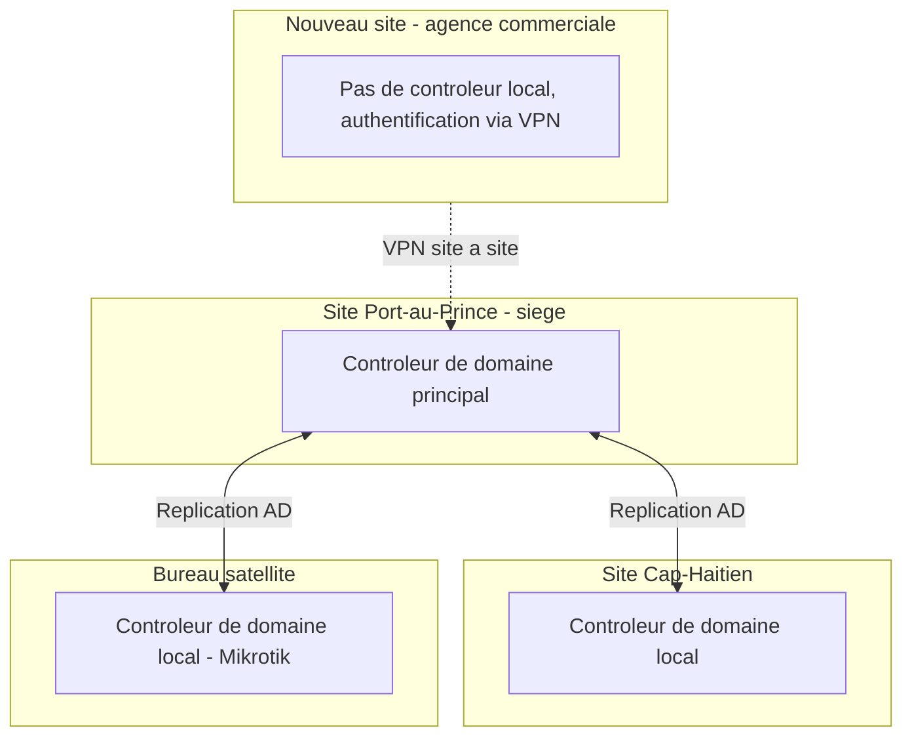

CHAPITRE 81

# Conception de l'architecture (AD, réseau, virtualisation)

🎯 Objectif du chapitre
Traduire le cahier des charges du chapitre précédent en choix techniques concrets d'Active Directory, de réseau et de virtualisation pour l'infrastructure à 300 employés et quatre sites. À la fin de ce chapitre, tu sauras concevoir une topologie de sites Active Directory pour un environnement multi-sites, une architecture réseau redondante reliant l'ensemble des sites, et des choix de virtualisation adaptés au contexte spécifique de chaque site.

🎬 Mise en situation
Le cahier des charges du chapitre 80 étant validé par le conseil d'administration, l'équipe technique doit désormais concevoir l'architecture concrète répondant à ces exigences — en particulier pour le quatrième site, une agence commerciale à ouvrir dans une ville secondaire, avec seulement une vingtaine d'employés prévus initialement. <em>"Le cahier des charges nous dit ce qu'on doit accomplir,"</em> résume le DSI, <em>"maintenant il faut décider concrètement comment."</em> Ce chapitre construit cette architecture, brique par brique, en s'appuyant systématiquement sur les choix déjà validés dans ce manuel plutôt que de repartir de zéro.

## 81.1 Traduire le cahier des charges en architecture concrète

📌 À retenir — rappel direct du chapitre 80
Chaque choix d'architecture de ce chapitre doit se justifier explicitement par rapport à une exigence précise du cahier des charges — l'exigence de disponibilité de 99,5 % pour le portail client (exemple de l'exercice 80.1) oriente vers une architecture réseau et une virtualisation redondantes ; la contrainte de compétences limitées de l'équipe technique (section 80.6) oriente vers des choix technologiques déjà maîtrisés plutôt que vers une sophistication technique inédite pour l'équipe.

## 81.2 Architecture Active Directory pour un environnement à quatre sites

💡 Rappel direct des chapitres 5 et 6
Chaque site physique de l'entreprise correspond à un **site Active Directory** distinct (chapitre 5), avec son propre sous-réseau associé et, pour les sites de taille significative (siège, agence de Cap-Haïtien), un contrôleur de domaine local — garantissant que l'authentification des employés locaux ne dépend pas de la disponibilité d'un lien réseau vers un autre site. La réplication entre sites (chapitre 6) est configurée selon un intervalle adapté à la criticité et à la bande passante de chaque lien, plutôt qu'un intervalle uniforme pour l'ensemble de l'infrastructure.

## 81.3 Le quatrième site : le même raisonnement contextuel qu'au chapitre 67

✅ Rappel direct de la section 67.1
Pour ce nouveau site de vingt employés seulement, un contrôleur de domaine local ne se justifie pas nécessairement — exactement le même raisonnement pragmatique déjà appliqué au choix de Mikrotik pour le bureau satellite (section 67.1) : le coût et la complexité de maintenir un contrôleur de domaine supplémentaire dépassent le bénéfice réel pour un site aussi restreint, tant que le lien VPN vers le siège reste suffisamment fiable pour l'authentification à distance.

## 81.4 Architecture réseau : redondance multi-sites

💡 Rappel direct des chapitres 65 et 69
Les sites principaux (siège et Cap-Haïtien) restent reliés par les liens WAN redondants déjà établis avec OSPF (chapitre 65), garantissant une bascule automatique en cas de panne d'un lien. Le nouveau site, plus modeste, se connecte via un VPN site à site simple (chapitre 69) — une redondance de lien pourrait être envisagée ultérieurement si l'activité de ce site venait à croître significativement, un choix à réévaluer plutôt qu'à imposer prématurément.

## 81.5 Virtualisation : un choix par site, pas un choix unique imposé

📌 À retenir — rappel direct de la Partie 6
Exactement le même principe déjà établi tout au long de ce manuel s'applique à la virtualisation : le siège, avec ses besoins de charge et de résilience les plus élevés, justifie une solution de virtualisation d'entreprise complète (VMware vSphere ou Hyper-V, chapitres 34-35) avec clustering haute disponibilité ; l'agence de Cap-Haïtien, de taille intermédiaire, peut s'appuyer sur Proxmox VE (chapitre 36), un compromis pragmatique déjà éprouvé dans ce manuel ; le nouveau site, plus modeste encore, pourrait ne nécessiter aucune virtualisation locale, s'appuyant entièrement sur les services centralisés du siège via le VPN.

## 81.6 Assembler la vue d'architecture globale

📌 À retenir
Une architecture globale cohérente rassemble ces décisions en une vue unique, documentée et compréhensible — exactement le même principe de documentation déjà établi au chapitre 2 comme fondation du métier, appliqué ici à l'échelle complète du projet. Cette vue globale devient la référence technique pour l'ensemble des chapitres suivants de la Partie 13, qui la mettront en œuvre concrètement.

## 81.7 Valider l'architecture face au cahier des charges

✅ Fermer la boucle avec le chapitre 80
Avant de considérer cette architecture comme définitive, chaque exigence du cahier des charges du chapitre 80 devrait être explicitement vérifiée par rapport à cette conception — une exigence de disponibilité non couverte par un choix de virtualisation suffisamment résilient révèle une lacune à corriger avant la mise en œuvre, plutôt qu'après, à un stade où la correction serait bien plus coûteuse.

## Atelier — Produire le schéma d'architecture global

🛠️ Atelier 81 — La brique technique du projet final

**Objectif** : produire un schéma d'architecture global couvrant Active Directory, réseau et virtualisation pour les quatre sites, validé par rapport au cahier des charges du chapitre 80.

**Préparation** : le cahier des charges rédigé à l'atelier du chapitre 80.

**Étapes détaillées** :

1. Représente les quatre sites et leurs contrôleurs de domaine (ou absence de contrôleur local) selon le raisonnement de la section 81.3.
2. Représente les liens réseau entre sites, en distinguant les liens redondants (OSPF) des liens simples (VPN).
3. Indique le choix de virtualisation retenu pour chaque site, en justifiant chaque choix par le contexte spécifique de ce site plutôt qu'un choix uniforme.
4. Reprends les exigences non-fonctionnelles rédigées à l'exercice 80.1 et vérifie explicitement si cette architecture les satisfait.
5. Compare ta démarche à la section "Résultat attendu".

**Résultat attendu** : l'architecture combine des contrôleurs de domaine locaux pour les sites significatifs et une authentification distante via VPN pour le nouveau site modeste, une redondance réseau OSPF pour les liens critiques et un VPN simple pour le lien vers le nouveau site, et des choix de virtualisation proportionnés à la taille et à la criticité de chaque site plutôt qu'une solution unique imposée partout. La vérification par rapport aux exigences non-fonctionnelles de l'exercice 80.1 (disponibilité de 99,5 % pour le portail client) devrait confirmer que le siège, hébergeant ce service critique, bénéficie bien du niveau de redondance nécessaire (clustering haute disponibilité, chapitre 13, et liens réseau redondants) pour atteindre cet objectif.

**Dépannage** : si la vérification révèle qu'une exigence du cahier des charges n'est pas clairement couverte par l'architecture proposée, ne force pas une justification a posteriori — révise explicitement l'architecture pour couvrir cette exigence, ou documente formellement pourquoi cette exigence est révisée ou reportée, plutôt que de laisser un écart silencieux entre le cahier des charges et l'architecture réelle.

## Erreurs fréquentes

⚠️ Erreur n°1 — une architecture conçue sans revenir explicitement aux exigences du cahier des charges
Rappel de la section 81.7 : une architecture séduisante techniquement mais déconnectée du cahier des charges risque de ne pas répondre au besoin réel ayant motivé le projet.

⚠️ Erreur n°2 — l'absence de sites Active Directory distincts pour des sites géographiquement séparés
Rappel direct du chapitre 6 : sans configuration de sites appropriée, le trafic de réplication et d'authentification peut emprunter des liens WAN de façon inefficace, dégradant les performances sans raison technique justifiée.

⚠️ Erreur n°3 — un même choix de virtualisation imposé uniformément à tous les sites, sans considérer leur contexte respectif
Rappel direct de la section 67.1 : reproduit l'erreur inverse du raisonnement pragmatique déjà établi à plusieurs reprises dans ce manuel — le bon choix technique dépend du contexte de chaque site, pas d'une préférence pour l'uniformité en soi.

## Diagnostiquer une latence de réplication AD élevée malgré une bonne bande passante

🩺 Symptôme : la réplication Active Directory entre deux sites distants prend un temps anormalement long, malgré un lien réseau disposant d'une bande passante suffisante

- **Diagnostic** : ce symptôme, rappel direct du même diagnostic déjà rencontré au chapitre 6, indique généralement une configuration incorrecte des sites Active Directory (sous-réseaux mal associés à leur site, ou intervalle de réplication mal calibré) plutôt qu'un problème de capacité réseau brute.
- **Comment vérifier** : vérifier que chaque sous-réseau est correctement associé à son site Active Directory correspondant, et consulter l'intervalle de réplication configuré pour le lien de site concerné.
- **Résolution** : corriger l'association des sous-réseaux aux sites, ou ajuster l'intervalle de réplication selon la criticité réelle de la synchronisation pour ce lien précis.

## En entreprise

- **Bonne pratique répandue** : concevoir l'architecture en partant explicitement de chaque exigence du cahier des charges, plutôt que de partir des technologies déjà connues et de vérifier après coup si elles couvrent le besoin.
- **Bonne pratique répandue** : documenter la justification de chaque choix d'architecture par rapport au contexte spécifique du site concerné, facilitant la compréhension future de décisions qui pourraient sinon sembler incohérentes entre sites.
- **Erreur classique observée** : une architecture conçue en réunion, sous forme de schéma convaincant, mais jamais formellement confrontée aux exigences précises du cahier des charges — révélant des lacunes seulement après la mise en œuvre, à un stade où leur correction devient significativement plus coûteuse.

## Entretien technique

💼 Questions fréquemment posées en entretien

**Q1. "Pourquoi chaque site physique d'une organisation multi-sites devrait-il généralement correspondre à un site Active Directory distinct ?"**
Réponse attendue : pour optimiser le trafic de réplication et d'authentification à travers les liens WAN, et pour permettre à un contrôleur de domaine local de continuer à authentifier les utilisateurs de ce site même en cas de coupure temporaire du lien vers les autres sites.

**Q2. "Pourquoi ne pas imposer le même choix de virtualisation sur l'ensemble des sites d'une organisation ?"**
Réponse attendue : le bon choix technique dépend du contexte de chaque site (taille, criticité, budget) — un choix uniforme risque soit de sur-investir dans des sites modestes, soit de sous-équiper des sites critiques, contrairement à une approche proportionnée au contexte réel de chacun.

**Q3. "Pourquoi est-il important de vérifier explicitement chaque exigence du cahier des charges par rapport à l'architecture conçue, plutôt que de supposer qu'elle est nécessairement couverte ?"**
Réponse attendue : une architecture techniquement séduisante peut néanmoins laisser des lacunes non couvertes par rapport aux exigences réelles ; une vérification explicite révèle ces lacunes avant la mise en œuvre, à un stade où leur correction reste significativement moins coûteuse.

## Optimisation, sécurité et maintenabilité — les réflexes dès ce chapitre

🔒 Sécurité
Intègre les principes de segmentation réseau et de moindre privilège déjà établis (chapitres 70 et 22-25) dès la conception de l'architecture pour le nouveau site, plutôt que de les ajouter après coup à une architecture déjà figée.

✅ Maintenabilité
Documente explicitement la justification de chaque choix d'architecture par rapport au contexte du site concerné et à l'exigence du cahier des charges qu'il satisfait, facilitant toute révision future de l'architecture.

🚀 Performance
Calibre l'intervalle de réplication Active Directory et le dimensionnement des liens réseau selon la criticité réelle de chaque site, évitant un sur-investissement sur des sites modestes ou un sous-dimensionnement sur des sites critiques.

## Résumé du chapitre

- Chaque choix d'architecture doit se justifier explicitement par rapport à une exigence précise du cahier des charges du chapitre 80.
- Chaque site physique correspond généralement à un site Active Directory distinct, avec un contrôleur de domaine local proportionné à sa taille et sa criticité.
- Le nouveau site modeste s'appuie sur une authentification distante via VPN plutôt qu'un contrôleur de domaine local, suivant le même raisonnement pragmatique déjà établi au chapitre 67.
- L'architecture réseau combine des liens redondants OSPF pour les sites critiques et un VPN simple pour les sites plus modestes.
- Le choix de virtualisation est déterminé site par site, selon le contexte réel de chacun, plutôt qu'imposé uniformément.
- Chaque exigence du cahier des charges doit être explicitement vérifiée par rapport à l'architecture finale avant de la considérer comme validée.

## Quiz

📝 QCM (une seule bonne réponse par question)

1. Chaque site physique d'une organisation multi-sites devrait généralement correspondre à :
   - a) Un seul site Active Directory unique pour toute l'organisation
   - b) Un site Active Directory distinct, avec son sous-réseau associé
   - c) Aucun site Active Directory, uniquement des groupes de sécurité
   - d) Une forêt Active Directory entièrement séparée

2. Le choix de virtualisation pour chaque site devrait être déterminé par :
   - a) Une préférence uniforme imposée sur l'ensemble de l'organisation
   - b) Le contexte spécifique de chaque site (taille, criticité, budget)
   - c) Uniquement le prix le plus bas disponible
   - d) La technologie la plus récente disponible sur le marché

3. Une latence de réplication Active Directory élevée malgré une bonne bande passante indique généralement :
   - a) Un problème matériel du lien réseau lui-même
   - b) Une configuration incorrecte des sites Active Directory
   - c) L'absence de VPN site à site
   - d) Un problème de virtualisation

**Corrigé** : 1-b, 2-b, 3-b.

📝 Vrai ou Faux

1. Chaque choix d'architecture devrait se justifier explicitement par rapport à une exigence du cahier des charges. — **Vrai** (section 81.1).
2. Un site de vingt employés justifie systématiquement l'installation d'un contrôleur de domaine local. — **Faux** (section 81.3).
3. Un même choix de virtualisation imposé uniformément à tous les sites constitue toujours la meilleure approche. — **Faux** (section "Erreur n°3").
4. L'architecture devrait être vérifiée explicitement par rapport au cahier des charges avant d'être considérée comme validée. — **Vrai** (section 81.7).

📝 Questions ouvertes

1. Explique pourquoi le raisonnement appliqué au choix de Mikrotik pour le bureau satellite au chapitre 67 s'applique également à la décision de ne pas installer de contrôleur de domaine local sur le nouveau site.
2. Un collègue propose d'installer VMware vSphere sur l'ensemble des quatre sites, "pour une cohérence technologique maximale et une seule compétence à maintenir dans l'équipe". Discute les avantages et les limites de cette proposition.

**Corrigé 1** : le raisonnement du chapitre 67 établissait que le bon choix technique dépend du contexte réel (taille, budget, besoin fonctionnel) plutôt que d'une hiérarchie absolue de sophistication technique — un choix modeste et pragmatique peut parfaitement convenir à un contexte modeste, sans que cela ne représente une solution de moindre qualité. La même logique s'applique à la décision Active Directory du nouveau site : avec seulement vingt employés et un lien VPN suffisamment fiable vers le siège, l'investissement et la complexité de maintenance d'un contrôleur de domaine local supplémentaire ne se justifient pas par rapport au bénéfice réel apporté, exactement le même arbitrage contexte-dépendant déjà appliqué au choix du routeur pour ce même type de site modeste.

**Corrigé 2** : une cohérence technologique maximale présente effectivement l'avantage réel de simplifier la formation et la maintenance pour une équipe technique restreinte, réduisant la nécessité de maîtriser plusieurs plateformes de virtualisation différentes. Cependant, cette proposition ignore le principe déjà établi à plusieurs reprises dans ce manuel : le bon outil dépend du contexte de chaque site, pas d'une préférence pour l'uniformité en soi. Imposer VMware vSphere, une solution de virtualisation d'entreprise complète et coûteuse, sur le nouveau site de vingt employés représenterait un investissement disproportionné par rapport au besoin réel de ce site modeste — un compromis comme Proxmox VE, voire l'absence de virtualisation locale (section 81.5), resterait plus proportionné à ce contexte spécifique, même au prix d'une légère perte de cohérence technologique globale.

## Exercices

📝 Exercice 81.1

Décris, pour chacun des quatre sites de l'entreprise, le choix de virtualisation retenu et sa justification, en t'appuyant sur les principes de la section 81.5.

**Corrigé :** Le siège (Port-au-Prince), hébergeant les services les plus critiques dont le portail client à haute disponibilité, justifie une solution de virtualisation d'entreprise complète avec clustering haute disponibilité (VMware vSphere ou Hyper-V, chapitres 34-35), garantissant la continuité de service même en cas de panne d'un hôte physique. L'agence de Cap-Haïtien, de taille intermédiaire avec des besoins réels mais moins critiques que le siège, s'appuie sur Proxmox VE (chapitre 36), un compromis pragmatique déjà éprouvé dans ce manuel entre fonctionnalité et coût de licence. Le bureau satellite, déjà équipé de Mikrotik pour son routage (chapitre 67), pourrait continuer sur une solution de virtualisation légère si un besoin local existe, ou s'appuyer également sur les services centralisés selon l'évolution de son activité. Le nouveau site, le plus modeste avec vingt employés, ne justifie probablement aucune virtualisation locale dans un premier temps, s'appuyant entièrement sur les services centralisés du siège via le VPN — une décision à réévaluer si l'activité de ce site venait à croître significativement.

📝 Exercice 81.2

Rédige, en 3 à 5 phrases, une règle d'équipe garantissant que toute architecture proposée est explicitement confrontée au cahier des charges avant sa validation définitive, en t'appuyant sur le risque décrit à la section "Erreur n°1".

**Corrigé (exemple de réponse) :** Toute proposition d'architecture technique devra être accompagnée d'un tableau de correspondance explicite, associant chaque exigence du cahier des charges à l'élément d'architecture qui la satisfait, avant sa présentation pour validation. Toute exigence sans correspondance claire dans ce tableau sera considérée comme une lacune à résoudre avant l'approbation définitive de l'architecture, plutôt qu'une omission découverte après le début de la mise en œuvre. Cette vérification systématique sera intégrée au processus de revue de changement déjà établi au chapitre 2, garantissant qu'aucune architecture n'est validée sur la seule base de sa qualité technique perçue, sans confrontation rigoureuse au besoin réel qu'elle est censée satisfaire.

## Checklist de fin de chapitre

<ul class="checklist">
<li>☐ Je sais concevoir une topologie de sites Active Directory pour un environnement multi-sites.</li>
<li>☐ Je comprends comment adapter le besoin d'un contrôleur de domaine local au contexte de chaque site.</li>
<li>☐ Je sais concevoir une architecture réseau combinant liens redondants et VPN simples selon la criticité de chaque site.</li>
<li>☐ Je sais justifier un choix de virtualisation différent selon le contexte de chaque site.</li>
<li>☐ Je sais assembler une vue d'architecture globale cohérente et documentée.</li>
<li>☐ Je sais vérifier explicitement une architecture par rapport aux exigences d'un cahier des charges.</li>
</ul>

## FAQ

<dl class="faq">
<dt>Faut-il concevoir l'architecture complète avant tout déploiement, ou peut-on procéder par itérations ?</dt>
<dd>Une vision d'architecture globale cohérente reste nécessaire dès le départ, mais sa mise en œuvre peut tout à fait procéder par phases successives (comme les chapitres 82 à 86 le montreront), plutôt que d'exiger un déploiement simultané de l'ensemble de l'infrastructure.</dd>

<dt>Que faire si deux exigences du cahier des charges semblent entrer en conflit lors de la conception de l'architecture ?</dt>
<dd>Un arbitrage explicite, documenté et si possible validé par les parties prenantes concernées, reste nécessaire — un conflit d'exigences non résolu et laissé implicite dans l'architecture se traduira généralement par une déception ultérieure pour l'une des deux exigences non pleinement satisfaites.</dd>

<dt>L'architecture conçue dans ce chapitre est-elle définitive pour le reste du projet ?</dt>
<dd>Elle sert de référence pour les chapitres suivants, mais reste susceptible d'ajustements mineurs à mesure que la mise en œuvre révèle des contraintes pratiques non anticipées — l'important reste que tout ajustement soit documenté et reste cohérent avec le cahier des charges du chapitre 80.</dd>

<dt>Pourquoi ne pas avoir simplement répliqué l'architecture du siège sur l'ensemble des sites, par simplicité ?</dt>
<dd>Une réplication uniforme ignorerait les différences réelles de taille, de criticité et de budget entre les sites, un choix déjà écarté à plusieurs reprises dans ce manuel au profit d'une approche proportionnée au contexte de chaque situation.</dd>
</dl>

## Références et pour aller plus loin

- Microsoft Learn — Concevoir une topologie de sites Active Directory : rappel des chapitres 5-6 de ce manuel.
- TOGAF — The Open Group Architecture Framework : [https://www.opengroup.org/togaf](https://www.opengroup.org/togaf)

*Chapitre suivant : le déploiement des services Windows et Linux — mettre en œuvre concrètement l'architecture conçue dans ce chapitre sur l'ensemble des quatre sites de l'entreprise.*
