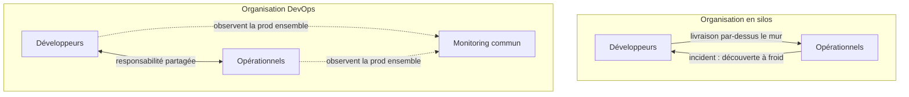

CHAPITRE 2 · 🟢 DÉBUTANT ABSOLU

# Culture DevOps

🎯 Objectif du chapitre
Comprendre pourquoi la culture DevOps (collaboration, responsabilité partagée, petits changements fréquents, feedback rapide, amélioration continue) est la condition qui rend tous les outils des chapitres suivants réellement efficaces — et pourquoi les mêmes outils, installés sans ce changement de culture, ne suffisent jamais. À la fin de ce chapitre, tu sauras reconnaître les signes d'une équipe qui pratique réellement DevOps par rapport à une équipe qui n'en a que le vocabulaire, et tu sauras expliquer pourquoi "on a mis Docker" n'est jamais une réponse suffisante à la question "est-ce que vous faites du DevOps ?".

🎬 Mise en situation
Deux entreprises installent exactement les mêmes outils la même année : Git, Docker, un pipeline GitHub Actions, un serveur de monitoring. Un an plus tard, la première déploie plusieurs fois par jour, ses incidents se résolvent en quelques minutes, et les développeurs consultent eux-mêmes les tableaux de bord de production sans attendre qu'on le leur demande. La seconde déploie toujours une fois par mois, dans le stress, avec la même personne "responsable de la prod" qui reste seule à comprendre le pipeline que plus personne n'ose modifier. Même outillage, résultats radicalement différents. Ce chapitre explique ce qui, en dehors des outils, fait toute la différence entre ces deux entreprises.

## 2.1 Pourquoi la culture prime sur les outils

Le chapitre précédent a introduit les cinq piliers de DevOps (section 1.5) : CI, CD, Infrastructure as Code, monitoring, et culture de collaboration. Ce dernier pilier n'est pas listé en dernier par hasard — c'est celui qui, en pratique, détermine si les quatre autres fonctionnent réellement ou restent des outils sous-utilisés.

📌 La loi de Conway, appliquée à DevOps
En 1967, l'informaticien Melvin Conway a formulé une observation restée célèbre : <em>"Toute organisation qui conçoit un système produira un système dont la structure reflète la structure de communication de cette organisation."</em> Concrètement : si les développeurs et les opérationnels ne communiquent presque jamais, le logiciel qu'ils produisent ensemble portera les traces de cette absence de communication — des interfaces mal pensées entre le code et son environnement d'exécution, des angles morts que personne des deux côtés ne couvre. Changer la culture de collaboration, ce n'est donc pas un supplément d'âme : c'est ce qui change directement la qualité du système produit.

Un outil ne fait qu'exécuter ce qu'on lui demande. Une équipe qui automatise ses déploiements sans jamais partager la responsabilité de la production a simplement construit **un mur automatisé** au lieu d'un mur manuel — le déploiement va plus vite, mais personne n'est plus concerné qu'avant par ce qui se passe une fois le code en production.

💡 Explication du schéma
Dans le modèle en silos, l'information circule dans un seul sens à la fois : le code part vers la production, et un incident revient vers le développement, souvent bien après coup et sans contexte partagé. Dans le modèle DevOps, développeurs et opérationnels partagent le même tableau de bord de monitoring et la même responsabilité de la production — l'information circule en continu dans les deux sens, pas seulement au moment d'un problème.

## 2.2 Collaboration réelle : "you build it, you run it"

L'une des formulations les plus citées de cette culture vient d'Amazon, popularisée par son CTO Werner Vogels : *"You build it, you run it"* — celui qui construit une fonctionnalité est aussi celui qui la fait tourner en production et qui répond aux incidents qui la concernent. Cette idée renverse le modèle historique où le développeur "livre" et l'opérationnel "porte seul" les conséquences.

Cela ne signifie pas que les développeurs remplacent les opérationnels, ni que les rôles disparaissent (le chapitre 5 couvrira l'administration serveur en détail, un vrai métier à part entière). Cela signifie que **la frontière de responsabilité se déplace** : plutôt que "mon travail s'arrête au commit", l'état d'esprit devient "mon travail inclut de savoir ce qui se passe une fois mon code en production".

| Pratique concrète | Ce qu'elle change |
|---|---|
| Les développeurs ont accès en lecture aux logs et métriques de production | Ils diagnostiquent eux-mêmes une partie des incidents, sans attendre un intermédiaire |
| Les astreintes incluent des développeurs, pas seulement des opérationnels | Écrire du code fragile a un coût direct et immédiat pour celui qui l'a écrit |
| Les stand-ups quotidiens mentionnent l'état de la production, pas seulement l'avancement des tâches | La santé de la production devient un sujet d'équipe visible, pas un sujet caché |
| Les décisions techniques (choix d'architecture, de librairie) intègrent dès le départ un avis "exploitation" | Moins de mauvaises surprises au moment du déploiement |

✅ Bonne pratique — la responsabilité ne veut pas dire l'isolement
"You build it, you run it" ne veut pas dire que chaque développeur doit devenir expert en administration système du jour au lendemain. Cela veut dire que la production n'est plus un territoire fermé et mystérieux réservé à une seule équipe — l'objectif de ce manuel entier est justement de donner à un développeur les bases suffisantes (Linux, Docker, CI/CD, monitoring) pour comprendre et agir sur cette partie du cycle, sans nécessairement devenir spécialiste de tout.

## 2.3 Responsabilité partagée et post-mortems sans blâme

Quand un incident survient dans une culture DevOps mature, la première question n'est jamais "qui a fait l'erreur ?" mais "qu'est-ce qui, dans notre système et notre processus, a permis à cette erreur d'atteindre la production ?". Cette pratique s'appelle le **post-mortem sans blâme** (*blameless postmortem*).

⚠️ Pourquoi chercher un coupable est contre-productif
Si un incident se termine systématiquement par la désignation d'un responsable, les membres de l'équipe apprennent rapidement à <strong>cacher</strong> leurs erreurs plutôt qu'à les signaler tôt — ce qui rend les erreurs suivantes plus difficiles à détecter et plus coûteuses à corriger. Une culture qui punit l'erreur individuelle obtient, presque toujours, moins de transparence, jamais moins d'erreurs.

Un post-mortem sans blâme suit généralement une structure simple, qui reviendra explicitement au chapitre 46 (catalogue de pannes) :

1. **Chronologie factuelle** : que s'est-il passé, dans quel ordre, avec quels horodatages ?
2. **Impact réel** : qui a été affecté, pendant combien de temps, avec quelle gravité ?
3. **Cause(s) racine(s)** : pas seulement "qui a cliqué sur quoi", mais quelles conditions du système ont permis à cette action d'avoir un tel impact.
4. **Actions correctives** : des changements concrets et suivis (souvent des automatisations, des alertes supplémentaires, des garde-fous) — pas seulement "faire plus attention la prochaine fois", qui n'est jamais une action vérifiable.

## 2.4 Petits changements fréquents plutôt que grosses livraisons risquées

📌 Le paradoxe de la taille des changements
Intuitivement, on pourrait penser qu'un gros déploiement, préparé longtemps, est plus sûr qu'un petit déploiement fréquent. En pratique, c'est l'inverse qui est vrai : plus un changement est petit, plus il est facile à tester, à comprendre, à déployer, et — si quelque chose se passe mal — à identifier et annuler (chapitre 29). Un déploiement qui regroupe trois semaines de changements mélange des dizaines de causes possibles en cas de problème ; un déploiement qui ne contient qu'un seul changement ciblé pointe immédiatement vers une seule cause possible.

Cette idée s'oppose directement au modèle historique du "big bang release" : une version massive, préparée pendant des mois, déployée en une seule fois avec beaucoup d'appréhension. Les entreprises qui pratiquent DevOps depuis longtemps (le cas Flickr évoqué au chapitre 1, avec plus de dix déploiements par jour, en est l'exemple fondateur) ont démontré que l'inverse fonctionne mieux : des changements petits, fréquents, chacun facile à valider isolément.

🚀 Lien avec les métriques DORA
La fréquence de déploiement est justement l'une des quatre métriques DORA évoquées au chapitre 1 — les équipes les plus performantes déploient plusieurs fois par jour, pas une fois par trimestre. Ce n'est pas un objectif de vanité : c'est une conséquence directe et mesurable de la pratique des petits changements fréquents.

## 2.5 Feedback rapide à chaque étape

Le cycle DevOps du chapitre 1 (section 1.4) ne vaut que si le retour d'information (FEEDBACK) circule vite entre chaque étape. Ce principe s'appelle parfois le **"shift-left"** : déplacer la détection des problèmes le plus tôt possible dans le cycle, plutôt que de les découvrir tard.

| Où le problème est détecté | Coût typique de la correction |
|---|---|
| Pendant que le développeur écrit le code (auto-complétion, linter) | Quelques secondes |
| Lors de l'exécution des tests automatisés (CI, chapitre 19) | Quelques minutes |
| Lors d'une revue de code avant fusion (pull request, chapitre 8) | Quelques heures |
| Une fois déployé en environnement de test (staging, chapitre 18) | Quelques heures à un jour |
| Une fois en production, détecté par le monitoring (chapitre 32) | Des heures, potentiellement un impact client réel |
| Une fois en production, signalé par un client mécontent | Le plus coûteux : impact client, réputation, urgence non planifiée |

💡 Analogie — le correcteur orthographique
Un correcteur orthographique qui souligne une faute pendant que tu écris est infiniment plus utile qu'un correcteur qui te renvoie, une semaine plus tard, la liste de toutes les fautes d'un document déjà envoyé. Le principe est exactement le même en DevOps : plus le retour arrive tôt, plus il est facile à exploiter, et moins il coûte cher.

## 2.6 Amélioration continue

DevOps n'est jamais un état "atteint" une fois pour toutes — c'est une pratique d'amélioration continue, souvent inspirée du concept japonais de **kaizen** (改善, "changement en mieux"), qui privilégie de nombreux petits ajustements réguliers plutôt qu'une transformation ponctuelle unique.

Concrètement, cela se traduit par des **rétrospectives régulières** : l'équipe se réunit périodiquement (souvent toutes les deux semaines) pour se demander, indépendamment de tout incident précis, ce qui a bien fonctionné et ce qui pourrait être amélioré dans le processus lui-même — pas seulement dans le produit livré.

✅ Bonne pratique — mesurer avant d'améliorer
Il est difficile d'améliorer ce qu'on ne mesure pas. Les métriques DORA (fréquence de déploiement, délai de mise en production, taux d'échec des déploiements, temps moyen de rétablissement) offrent un point de départ concret pour une rétrospective : plutôt que "on devrait déployer plus souvent" (ressenti), on peut dire "on déploie en moyenne une fois par semaine, l'objectif du trimestre est d'atteindre trois fois par semaine" (mesurable).

## 2.7 L'automatisation comme réducteur d'erreur humaine, pas seulement comme gain de vitesse

Le chapitre 1 a présenté l'automatisation comme un pilier de rapidité et de reproductibilité (section 1.2). Il faut ajouter un aspect tout aussi important, souvent sous-estimé : l'automatisation **réduit l'erreur humaine** sur les tâches répétitives.

Un être humain qui exécute manuellement la même procédure de déploiement pour la centième fois finit, statistiquement, par oublier une étape — surtout sous pression, surtout tard le soir, surtout après plusieurs incidents dans la même journée. Un script ou un pipeline automatisé (chapitre 10 et Partie VII) exécute exactement la même séquence, dans le même ordre, à chaque fois, sans fatigue et sans distraction.

🔒 Sécurité — l'automatisation réduit aussi le risque humain en sécurité
Une procédure manuelle de gestion des accès ("je retire l'accès de cette personne qui a quitté l'entreprise") dépend de la mémoire de quelqu'un. Une procédure automatisée (désactivation automatique liée à une date de fin de contrat, révocation automatique de secrets, chapitre 25) ne dépend d'aucune mémoire individuelle. Ce principe reviendra concrètement à la Partie XI (DevSecOps).

## 2.8 Reconnaître une culture DevOps mature

Le tableau suivant résume les signes distinctifs, utiles autant pour s'auto-évaluer en tant qu'équipe que pour poser les bonnes questions en entretien d'embauche (section "Entretien technique" ci-dessous) :

| Signe d'une culture immature (silo) | Signe d'une culture DevOps mature |
|---|---|
| "Ce n'est pas mon problème, c'est l'équipe prod qui gère" | "Je regarde ce qui se passe en production sur ce que j'ai livré" |
| Un incident cherche d'abord un responsable | Un incident cherche d'abord une cause racine, sans blâme |
| Les déploiements sont rares et redoutés | Les déploiements sont fréquents et banals |
| Une seule personne comprend le pipeline de déploiement | Toute l'équipe peut lire et faire évoluer le pipeline |
| Les rétrospectives n'existent pas ou ne débouchent sur rien de concret | Les rétrospectives produisent des actions suivies dans le temps |
| Automatiser est vu comme "le travail de quelqu'un d'autre" | Automatiser une tâche répétitive est un réflexe partagé |

## Atelier — Auto-évaluer une culture d'équipe

🛠️ Atelier 2.1 — Grille de maturité DevOps

**Objectif** : s'entraîner à évaluer une culture d'équipe (réelle ou fictive) à l'aide de la grille de la section 2.8, plutôt que de se fier à une impression générale.

**Préparation** : aucune installation nécessaire. Pense à une équipe que tu connais (un projet de groupe, un stage, une entreprise où tu as travaillé) ou reprends le scénario d'ouverture de ce chapitre.

**Étapes détaillées** :

1. Reprends les six lignes du tableau de la section 2.8. Pour chacune, note laquelle des deux colonnes correspond le mieux à l'équipe que tu as choisie.
2. Compte combien de lignes penchent vers la colonne "silo" et combien penchent vers "mature".
3. Pour les deux lignes les plus "silo", propose une action concrète (pas un vœu pieux) qui rapprocherait l'équipe de la colonne "mature" — inspire-toi des pratiques décrites dans ce chapitre (post-mortem sans blâme, accès partagé au monitoring, rétrospectives mesurées).

**Résultat attendu** : un diagnostic à six lignes plus deux actions concrètes. Il n'existe pas de "bonne" équipe qui coche toutes les cases dès le départ — l'objectif de l'exercice est la méthode de diagnostic, pas un jugement définitif.

**Dépannage** : si tu n'as aucune expérience d'équipe à évaluer, applique la grille au scénario d'ouverture du chapitre 1 (le déploiement de six heures) en imaginant les réponses les plus probables.

## Erreurs fréquentes

⚠️ Erreur n°1 — Croire qu'une "équipe DevOps" séparée règle le problème
Créer une équipe portant le nom "DevOps", chargée de tous les pipelines et de toute l'infrastructure, sans que les équipes de développement ne changent rien à leurs pratiques, reconstruit un silo avec un nouveau nom (déjà évoqué en section 1.6). Le nom de l'équipe n'est jamais la preuve de la culture réelle.

⚠️ Erreur n°2 — Confondre vitesse et précipitation
"Petits changements fréquents" (section 2.4) ne veut pas dire "sauter les tests pour aller plus vite". Chaque petit changement doit rester validé (par des tests automatisés, une revue de code) avant d'être déployé — la vitesse vient de la taille réduite et de l'automatisation de la validation, jamais de l'absence de validation.

⚠️ Erreur n°3 — Post-mortem sans blâme utilisé comme excuse à l'impunité
"Sans blâme" ne signifie pas "sans conséquence ni suivi". Un post-mortem sans blâme doit toujours déboucher sur des actions correctives concrètes et suivies dans le temps (section 2.3) — sinon, l'absence de blâme devient une absence totale de responsabilité, ce qui n'est pas non plus l'objectif.

## En entreprise

Dans la pratique professionnelle, quelques constats reviennent presque systématiquement autour de la culture DevOps :

**Réalité répandue** : la transformation culturelle prend généralement plus de temps que l'adoption des outils. Une entreprise peut migrer vers Docker et un pipeline CI/CD en quelques semaines, mais faire évoluer réellement les réflexes de collaboration et de responsabilité partagée prend souvent plusieurs mois, parfois plusieurs années, et rencontre régulièrement des résistances individuelles.

**Erreur classique observée** : mesurer le succès d'une "transformation DevOps" uniquement par le nombre d'outils déployés (avoir Docker, avoir Kubernetes, avoir un pipeline) plutôt que par des indicateurs de résultat réel (fréquence de déploiement, temps de résolution d'incident, satisfaction de l'équipe). Une checklist d'outils cochée ne garantit jamais, à elle seule, une culture réellement changée.

**Bonne pratique répandue** : les organisations qui réussissent leur transformation DevOps commencent souvent par une seule équipe pilote, sur un projet à enjeu modéré, plutôt que par une bascule générale du jour au lendemain — une application directe du principe "petits changements fréquents" (section 2.4), appliqué cette fois à l'organisation elle-même plutôt qu'au code.

## Entretien technique

💼 Questions fréquemment posées en entretien

**Q1. "Que signifie 'you build it, you run it' et pourquoi c'est important ?"**
Réponse attendue : le principe selon lequel l'équipe qui développe une fonctionnalité est aussi responsable de son fonctionnement en production, ce qui aligne les incitations (un code fragile a un coût direct et immédiat pour celui qui l'a écrit) et réduit le mur entre développement et exploitation (section 2.2).

**Q2. "Comment mènes-tu un post-mortem après un incident ?"**
Réponse attendue : une démarche factuelle et sans recherche de coupable — chronologie, impact réel, cause(s) racine(s), actions correctives concrètes et suivies (section 2.3). Éviter absolument de répondre en termes de "qui a fait l'erreur".

**Q3. "Pourquoi préfère-t-on des déploiements fréquents et petits plutôt que des grosses livraisons espacées ?"**
Réponse attendue : un changement petit est plus facile à tester, à comprendre, et à annuler en cas de problème ; un incident sur un petit changement pointe vers une cause unique identifiable, contrairement à un déploiement qui regroupe des semaines de changements (section 2.4).

## Optimisation, sécurité et maintenabilité — les réflexes dès ce chapitre

🔒 Sécurité
La responsabilité partagée (section 2.3) s'applique aussi à la sécurité : un incident de sécurité géré sans blâme et avec une chronologie factuelle transparente permet à toute l'équipe d'apprendre et de renforcer le système ; un incident caché par peur de sanction laisse la même faille exploitable pour la prochaine attaque.

✅ Maintenabilité
Documente chaque rétrospective (section 2.6) et chaque post-mortem (section 2.3), même de façon très courte. Une équipe qui répète les mêmes rétrospectives sans jamais consulter les précédentes perd l'essentiel de la valeur de l'amélioration continue : la mémoire collective des ajustements déjà tentés.

🚀 Performance
Le "temps moyen de rétablissement après un incident" (une des quatre métriques DORA) dépend directement de la culture décrite dans ce chapitre : une équipe où toute la connaissance de la production repose sur une seule personne aura toujours un temps de rétablissement plus long qu'une équipe où cette connaissance est partagée.

## Résumé du chapitre

- La culture prime sur les outils : les mêmes outils, sans changement de collaboration, ne produisent pas les mêmes résultats (loi de Conway, section 2.1).
- "You build it, you run it" déplace la responsabilité de la production vers ceux qui écrivent le code, sans supprimer le métier d'opérationnel.
- Les post-mortems sans blâme cherchent une cause racine et des actions correctives, jamais un coupable — mais restent suivis d'actions concrètes.
- Les petits changements fréquents sont plus sûrs que les grosses livraisons espacées, contrairement à l'intuition.
- Le feedback doit arriver le plus tôt possible dans le cycle ("shift-left") : plus un problème est détecté tôt, moins il coûte cher à corriger.
- L'amélioration continue (rétrospectives régulières, mesurées) et l'automatisation (qui réduit l'erreur humaine, pas seulement le temps) complètent cette culture.

## Quiz

📝 QCM (une seule bonne réponse par question)

1. La loi de Conway explique que :
   - a) Les grosses entreprises produisent toujours de meilleurs logiciels
   - b) La structure d'un système reflète la structure de communication de l'organisation qui l'a produit
   - c) Docker doit toujours être utilisé en production
   - d) Les tests automatisés remplacent totalement la revue de code

2. Un post-mortem sans blâme a pour objectif principal de :
   - a) Désigner la personne responsable de l'incident
   - b) Comprendre la cause racine et produire des actions correctives suivies
   - c) Éviter de documenter l'incident
   - d) Sanctionner l'équipe concernée

3. Pourquoi préfère-t-on de petits changements fréquents ?
   - a) Parce que c'est plus impressionnant pour la direction
   - b) Parce qu'ils sont plus faciles à tester, comprendre et annuler qu'un gros changement
   - c) Parce que les tests automatisés ne fonctionnent que sur de petits changements
   - d) Parce que cela évite complètement les incidents

**Corrigé** : 1-b, 2-b, 3-b.

📝 Vrai ou Faux

1. "You build it, you run it" signifie que les opérationnels disparaissent du processus. — **Faux** (la responsabilité se partage, le métier reste, section 2.2).
2. Un post-mortem sans blâme peut quand même déboucher sur des actions concrètes et suivies. — **Vrai**.
3. Un changement de culture DevOps se fait généralement plus vite que l'adoption des outils. — **Faux** (c'est l'inverse, section "En entreprise").
4. Automatiser une tâche répétitive réduit uniquement le temps qu'elle prend, jamais le risque d'erreur. — **Faux** (section 2.7 : l'automatisation réduit aussi l'erreur humaine).

📝 Questions ouvertes

1. Explique pourquoi une culture qui cherche systématiquement un coupable après un incident finit par obtenir moins de transparence, pas plus de rigueur.
2. Une collègue te dit : "Chez nous, on a Docker, Kubernetes et un pipeline CI/CD complet, donc on fait du DevOps." Que lui réponds-tu, en t'appuyant sur ce chapitre et le précédent ?

**Corrigé 1** : si chaque erreur signalée expose la personne à une sanction ou à une perte de crédibilité, l'intérêt individuel devient de cacher ou minimiser l'erreur plutôt que de la signaler tôt. Cela retarde la détection, complique le diagnostic, et prive l'équipe de la possibilité d'apprendre de l'incident — l'inverse exact de l'objectif recherché (section 2.3).

**Corrigé 2** : posséder des outils (chapitre 1, section 1.6) n'est pas la même chose que pratiquer une culture DevOps. Il faudrait lui demander si les développeurs consultent eux-mêmes le monitoring de production, si les incidents se terminent par des post-mortems sans blâme suivis d'actions concrètes, si les déploiements sont fréquents et banals plutôt que rares et redoutés, et si l'équipe organise des rétrospectives qui débouchent sur des changements mesurables (section 2.8). Sans ces éléments, elle décrit un outillage moderne appliqué à une culture qui n'a pas changé.

## Exercices

📝 Exercice 2.1

Reprends le tableau de la section 2.5 (où un problème est détecté et son coût de correction). Pour chacune des six lignes, propose une pratique ou un outil (déjà mentionné dans ce manuel ou que tu connais déjà) qui permettrait de détecter le problème à cette étape précise.

**Corrigé :** Pendant l'écriture du code → un linter ou l'auto-complétion de l'éditeur (chapitre 24). Tests automatisés en CI → une suite de tests unitaires/intégration exécutée à chaque push (chapitre 19 et 23). Revue de code → une pull request avec relecture obligatoire avant fusion (chapitre 8). Environnement de test → un déploiement automatique sur un environnement "staging" avant la production (chapitre 18). Monitoring en production → des alertes automatiques sur des métriques anormales (chapitre 32). Signalement client → un canal de support avec remontée rapide vers l'équipe technique, dernier filet et le plus coûteux.

📝 Exercice 2.2

En t'appuyant sur la grille de maturité de la section 2.8, rédige en 4 à 6 phrases un plan minimal pour faire évoluer une équipe où "une seule personne comprend le pipeline de déploiement" vers une équipe où toute l'équipe peut le lire et le faire évoluer.

**Corrigé (exemple de réponse) :** D'abord, documenter le pipeline existant dans le dépôt Git lui-même (un fichier README à côté du fichier de workflow), pour que sa logique ne dépende plus uniquement de la mémoire d'une personne. Ensuite, organiser une session où cette personne explique le pipeline au reste de l'équipe, idéalement en modifiant ensemble un petit changement dessus. Puis, répartir la propriété de petites parties du pipeline (les tests, le build, le déploiement) entre plusieurs membres de l'équipe plutôt que de la laisser centralisée. Enfin, mesurer le progrès en observant si d'autres personnes que celle d'origine proposent, avec le temps, des modifications au pipeline sans avoir besoin de son accord systématique.

## Checklist de fin de chapitre

<ul class="checklist">
<li>☐ Je peux expliquer la loi de Conway et son lien avec DevOps.</li>
<li>☐ Je sais résumer le principe "you build it, you run it" et ses limites.</li>
<li>☐ Je sais décrire les quatre étapes d'un post-mortem sans blâme.</li>
<li>☐ Je peux expliquer pourquoi les petits changements fréquents sont plus sûrs que les grosses livraisons.</li>
<li>☐ Je comprends le principe du "shift-left" et je sais donner un exemple à chaque étape du cycle.</li>
<li>☐ Je sais reconnaître, à l'aide de la grille de la section 2.8, les signes d'une culture DevOps mature ou non.</li>
</ul>

## FAQ

<dl class="faq">
<dt>Une petite équipe (2-3 personnes) a-t-elle vraiment besoin de "culture DevOps" ?</dt>
<dd>Oui, même si les pratiques se simplifient à cette échelle. Une équipe de deux ou trois personnes qui partage déjà naturellement la responsabilité de la production applique souvent, sans le savoir, une bonne partie de cette culture. Les principes (petits changements, feedback rapide, pas de recherche de coupable) restent valables à toute échelle.</dd>

<dt>Faut-il forcément un titre "Ingénieur DevOps" dans l'équipe pour appliquer cette culture ?</dt>
<dd>Non. Cette culture concerne toute l'équipe technique. Un poste dédié peut aider à construire et maintenir l'outillage partagé (Partie VII et suivantes), mais la responsabilité partagée et la collaboration ne dépendent d'aucun titre précis.</dd>

<dt>Comment mesurer si notre culture DevOps progresse réellement ?</dt>
<dd>Les quatre métriques DORA (fréquence de déploiement, délai de mise en production, taux d'échec des déploiements, temps moyen de rétablissement), mentionnées au chapitre 1 et reprises tout au long de ce chapitre, offrent un point de départ mesurable plutôt qu'un ressenti.</dd>
</dl>

## Références et pour aller plus loin

- Werner Vogels (Amazon CTO) — "A conversation with Werner Vogels" sur le principe "you build it, you run it" : [https://queue.acm.org/detail.cfm?id=1142065](https://queue.acm.org/detail.cfm?id=1142065)
- Google SRE Book — chapitre sur les post-mortems sans blâme (*Postmortem Culture: Learning from Failure*) : [https://sre.google/sre-book/postmortem-culture/](https://sre.google/sre-book/postmortem-culture/)
- DORA (DevOps Research and Assessment) — rapport annuel "State of DevOps" : [https://dora.dev](https://dora.dev)
- Melvin Conway — "How Do Committees Invent?" (texte original de 1968 sur la loi de Conway) : [http://www.melconway.com/Home/Committees_Paper.html](http://www.melconway.com/Home/Committees_Paper.html)

*Chapitre suivant : construire son environnement de travail — installation de VS Code, Git, Docker, Docker Compose, terminal et SSH, et mise en place du laboratoire reproductible utilisé dans tout le reste de ce manuel.*
