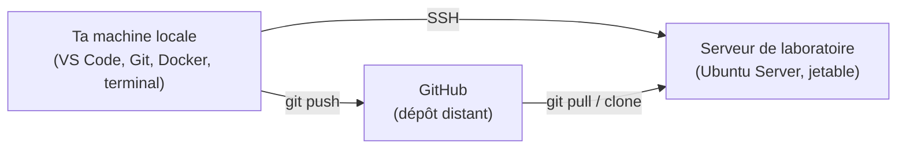

<div class="chapitre-titre-num">CHAPITRE 3 · 🟢 DÉBUTANT ABSOLU</div>

# Construire son environnement de travail

<div class="encadre objectif">
<span class="encadre-titre">🎯 Objectif du chapitre</span>
Installer et configurer, étape par étape, tous les outils utilisés dans le reste de ce manuel (VS Code, Git, Docker, Docker Compose, un terminal correctement configuré, SSH), puis mettre en place un <strong>laboratoire reproductible</strong> : un serveur Linux de test, séparé de ta machine personnelle, sur lequel tu pourras tout casser sans risque pendant tout le manuel. À la fin de ce chapitre, ta machine locale et ton serveur de laboratoire seront prêts, et tu sauras te connecter de l'un à l'autre.
</div>

<div class="encadre scenario">
<span class="encadre-titre">🎬 Mise en situation</span>
Avant de commencer un chantier de construction, un ouvrier ne se rend pas sur place les mains vides : il prépare sa caisse à outils, vérifie que chaque outil fonctionne, et s'assure d'avoir un endroit sûr où travailler sans déranger personne. Ce chapitre est ta caisse à outils. Tu vas installer exactement ce dont tu as besoin, ni plus ni moins, et te construire un "chantier" — un serveur de laboratoire — sur lequel tu pourras expérimenter librement à partir du chapitre 4. Aucune commande des chapitres suivants ne suppose un outil que ce chapitre n'a pas installé.
</div>

## 3.1 Vue d'ensemble : ce que tu vas construire

Ce manuel utilise en permanence deux environnements distincts, qu'il ne faut jamais confondre :



- **Ta machine locale** : là où tu écris le code, dans VS Code, versionné avec Git, testé avec Docker en local.
- **Le serveur de laboratoire** : une machine Linux séparée, à laquelle tu te connectes en SSH, qui simule un vrai serveur de production. C'est sur cette machine que les chapitres 4 à 6 (Linux, administration, SSH) et une grande partie du reste du manuel prendront tout leur sens.

<div class="encadre attention">
<span class="encadre-titre">⚠️ Pourquoi ne pas tout faire sur une seule machine</span>
Travailler uniquement en local donne une fausse impression de maîtrise : une application qui "marche" sur ta machine profite de tout ce que tu as déjà installé dessus, parfois sans même t'en rendre compte. Un vrai serveur de laboratoire, propre au départ, t'oblige à installer et configurer explicitement chaque dépendance — exactement le réflexe qui évite le fameux "ça marche sur ma machine" du chapitre 1.
</div>

## 3.2 Un terminal digne de ce nom

Tout ce manuel repose sur la ligne de commande. Un bon terminal, avant même d'apprendre les commandes elles-mêmes (chapitre 4), rend tout plus lisible et plus agréable.

**Windows** : installe **Windows Terminal**, l'application moderne de Microsoft (remplace l'ancienne fenêtre `cmd.exe` toute noire). Elle est déjà préinstallée sur Windows 11 ; sur Windows 10, installe-la depuis le Microsoft Store.

```powershell
# Sur Windows PowerShell — vérifier si Windows Terminal est déjà installé
wt --version
```

Si la commande échoue ("wt n'est pas reconnu"), ouvre le Microsoft Store, cherche "Windows Terminal", installe-le. Une fois ouvert, tu peux choisir PowerShell comme profil par défaut (Paramètres → Profil par défaut).

**macOS** : le Terminal intégré à macOS suffit amplement pour ce manuel. **iTerm2** (gratuit, [iterm2.com](https://iterm2.com)) est une alternative plus riche si tu veux davantage de confort, mais n'est jamais indispensable.

**Linux** : le terminal fourni par ta distribution (GNOME Terminal, Konsole...) suffit également.

<div class="encadre astuce">
<span class="encadre-titre">💡 Pourquoi PowerShell plutôt que l'invite de commandes (CMD) sur Windows</span>
PowerShell est plus proche, dans sa logique, des terminaux Linux/macOS que l'ancienne invite de commandes (`cmd.exe`) — et c'est l'outil que ce manuel utilise systématiquement pour toutes les commandes exécutées côté Windows. `cmd.exe` reste mentionné ponctuellement dans ce manuel uniquement quand une différence réelle existe.
</div>

## 3.3 VS Code

**Visual Studio Code** est l'éditeur de code utilisé dans tout ce manuel : gratuit, multiplateforme, avec un écosystème d'extensions qui couvre exactement les besoins DevOps (édition à distance via SSH, gestion Docker, intégration Git).

**Installation :**

```powershell
# Sur Windows PowerShell (avec winget, déjà inclus dans Windows 10/11 à jour)
winget install --id Microsoft.VisualStudioCode -e
```

```bash
# Sur macOS (avec Homebrew — https://brew.sh)
brew install --cask visual-studio-code
```

```bash
# Sur Ubuntu (via le dépôt officiel Microsoft)
sudo apt update
sudo apt install -y wget gpg
wget -qO- https://packages.microsoft.com/keys/microsoft.asc | gpg --dearmor > packages.microsoft.gpg
sudo install -D -o root -g root -m 644 packages.microsoft.gpg /etc/apt/keyrings/packages.microsoft.gpg
echo "deb [arch=amd64,arm64,armhf signed-by=/etc/apt/keyrings/packages.microsoft.gpg] https://packages.microsoft.com/repos/code stable main" | sudo tee /etc/apt/sources.list.d/vscode.list
sudo apt update
sudo apt install -y code
```

**Explication des commandes (Ubuntu) :** `wget` télécharge la clé publique de signature des paquets Microsoft ; `gpg --dearmor` la convertit dans le format binaire attendu par `apt` ; `install -D ... /etc/apt/keyrings/` la place au bon endroit avec les bonnes permissions ; la ligne `echo ... > /etc/apt/sources.list.d/vscode.list` ajoute le dépôt officiel de VS Code à la liste des sources connues d'`apt`, en indiquant explicitement quelle clé signe ce dépôt (`signed-by=`) ; `apt update` recharge la liste des paquets disponibles ; `apt install -y code` installe VS Code sans demander de confirmation (`-y`).

**Test de vérification :**

```powershell
code --version
```

**Résultat attendu** : un numéro de version s'affiche (par exemple `1.94.2`). Si la commande n'est pas reconnue juste après l'installation, ferme et rouvre ton terminal — l'ajout de `code` au PATH ne prend effet que dans une nouvelle session de terminal.

**Extensions indispensables pour ce manuel** (à installer depuis l'onglet Extensions de VS Code, icône de blocs empilés dans la barre latérale) :

| Extension | Éditeur | Utilité dans ce manuel |
|---|---|---|
| Docker | Microsoft | Visualiser et gérer images/conteneurs depuis VS Code (Partie V) |
| Remote - SSH | Microsoft | Éditer des fichiers directement sur le serveur de laboratoire, comme s'ils étaient locaux |
| GitLens | GitKraken | Voir l'historique et les auteurs de chaque ligne de code (Partie III) |
| YAML | Red Hat | Coloration syntaxique pour Docker Compose, GitHub Actions, Kubernetes (Parties V, VII, XIII) |

<div class="encadre bonne-pratique">
<span class="encadre-titre">✅ Bonne pratique — n'installe pas tout d'un coup</span>
Il existe des centaines d'extensions VS Code utiles. Ce manuel te dira, chapitre après chapitre, quand une extension supplémentaire devient pertinente. Installer les quatre du tableau ci-dessus suffit amplement pour commencer.
</div>

## 3.4 Git

Git sera couvert en profondeur au chapitre 7. Pour l'instant, seule l'installation et la configuration d'identité (utilisées par chaque commit que tu feras) sont nécessaires.

```powershell
# Sur Windows PowerShell
winget install --id Git.Git -e
```

```bash
# Sur macOS
brew install git
```

```bash
# Sur Ubuntu
sudo apt update
sudo apt install -y git
```

**Configuration d'identité (à faire une seule fois, sur ta machine locale) :**

```bash
git config --global user.name "Ton Nom"
git config --global user.email "ton.email@exemple.com"
git config --global init.defaultBranch main
```

**Explication des commandes :** `--global` applique ce réglage à tous les dépôts Git de la machine, pas seulement à un projet précis ; `user.name`/`user.email` identifient l'auteur de chaque commit (visible par toute personne qui consulte l'historique, y compris sur GitHub) ; `init.defaultBranch main` fixe le nom de la branche par défaut à `main` plutôt que l'ancien `master`, la convention actuelle de GitHub.

**Test de vérification :**

```bash
git --version
git config --global --list
```

**Résultat attendu** : un numéro de version Git, puis la liste des réglages effectués (`user.name=...`, `user.email=...`, `init.defaultbranch=main`).

## 3.5 Docker et Docker Compose

Docker sera détaillé en profondeur en Partie V. Ici, seule l'installation compte.

**Windows et macOS : Docker Desktop.**

Télécharge l'installateur officiel sur [docker.com/products/docker-desktop](https://www.docker.com/products/docker-desktop/), lance-le, redémarre la machine si demandé. Docker Compose est **inclus automatiquement** dans Docker Desktop, aucune installation séparée n'est nécessaire.

<div class="encadre attention">
<span class="encadre-titre">⚠️ Windows : Docker Desktop nécessite WSL2</span>
Sur Windows, Docker Desktop s'appuie sur WSL2 (Windows Subsystem for Linux version 2), une couche de compatibilité Linux intégrée à Windows. Si l'installateur le demande, exécute la commande suivante puis redémarre :

```powershell
# Sur Windows PowerShell (en administrateur)
wsl --install
```
</div>

**Linux (Ubuntu) : Docker Engine, en ligne de commande, sans interface graphique.**

```bash
# Sur Ubuntu — installation officielle via le dépôt Docker
sudo apt update
sudo apt install -y ca-certificates curl
sudo install -m 0755 -d /etc/apt/keyrings
sudo curl -fsSL https://download.docker.com/linux/ubuntu/gpg -o /etc/apt/keyrings/docker.asc
sudo chmod a+r /etc/apt/keyrings/docker.asc

echo \
  "deb [arch=$(dpkg --print-architecture) signed-by=/etc/apt/keyrings/docker.asc] https://download.docker.com/linux/ubuntu \
  $(. /etc/os-release && echo "$VERSION_CODENAME") stable" | \
  sudo tee /etc/apt/sources.list.d/docker.list > /dev/null
sudo apt update

sudo apt install -y docker-ce docker-ce-cli containerd.io docker-buildx-plugin docker-compose-plugin
```

**Explication des commandes :** les trois premières lignes récupèrent et installent la clé de signature officielle Docker, exactement selon le même principe que pour VS Code (section 3.3). La commande `echo ... | sudo tee` ajoute le dépôt Docker officiel, en détectant automatiquement l'architecture (`dpkg --print-architecture`, par exemple `amd64`) et le nom de code de la version Ubuntu (`VERSION_CODENAME`, par exemple `noble` pour Ubuntu 24.04). La dernière commande installe Docker Engine, son interface en ligne de commande, `containerd` (le moteur d'exécution sous-jacent), et **le plugin Compose** (`docker-compose-plugin`), qui fournit la commande `docker compose` (sans tiret, contrairement à l'ancienne commande `docker-compose`).

**Test de vérification (sur les trois systèmes) :**

```bash
docker --version
docker compose version
docker run hello-world
```

**Résultat attendu** : les deux premières commandes affichent un numéro de version. La troisième télécharge une petite image de test et affiche un message de bienvenue commençant par *"Hello from Docker!"* — la preuve que Docker peut télécharger une image, créer un conteneur, l'exécuter, et afficher son résultat.

<div class="encadre attention">
<span class="encadre-titre">⚠️ Erreur fréquente : "permission denied" sous Linux</span>
Sur Ubuntu, si `docker run hello-world` échoue avec un message de type `permission denied` en tentant de contacter le socket Docker, c'est que ton utilisateur n'appartient pas encore au groupe `docker`. Corrige avec :

```bash
sudo usermod -aG docker $USER
```

Puis **déconnecte-toi et reconnecte-toi** (ou redémarre la session) pour que ce nouveau groupe soit pris en compte — une simple nouvelle fenêtre de terminal ne suffit pas toujours.
</div>

## 3.6 Choisir et créer son serveur de laboratoire

C'est ici que ton environnement quitte ta seule machine locale. Deux options existent, selon ton budget :

| Option | Coût | Avantage | Limite |
|---|---|---|---|
| **A — VPS réel** (DigitalOcean, Vultr, OVH, Contabo...) | À partir de 4-6 $/mois | Conditions réelles (vraie IP publique, vraie latence réseau) — nécessaire à partir de la Partie VI (DNS, HTTPS) | Coût récurrent, même modeste |
| **B — VM locale gratuite** (VirtualBox + Ubuntu Server) | Gratuit | Aucun coût, fonctionne hors ligne | Pas d'IP publique réelle — les chapitres DNS/HTTPS (16-17) nécessiteront alors l'option A, au moins temporairement |

<div class="encadre astuce">
<span class="encadre-titre">💡 Recommandation</span>
Commence avec l'option B (gratuite) pour les chapitres 4 à 14 (Linux, SSH, Git, Docker) — elle suffit amplement. Bascule vers l'option A (VPS réel) à partir de la Partie VI (Nginx, HTTPS, DNS), qui a réellement besoin d'une adresse IP publique et d'un nom de domaine pour avoir un sens. Ce choix est repris explicitement au chapitre 26 (déploiement VPS).
</div>

**Option A — Créer un VPS réel.** La procédure varie selon le fournisseur, mais suit toujours le même schéma : créer un compte, choisir une image **Ubuntu Server 24.04 LTS**, choisir la configuration la plus petite disponible (1 vCPU / 1 Go de RAM suffit pour tout ce manuel), choisir une méthode d'authentification par **clé SSH** plutôt que par mot de passe (la clé sera générée au chapitre 6), puis créer la machine. Après quelques minutes, le fournisseur affiche une adresse IP publique — c'est celle-ci que tu utiliseras pour te connecter en SSH (section 3.7).

**Option B — Créer une VM locale gratuite avec VirtualBox.**

```powershell
# Sur Windows PowerShell
winget install --id Oracle.VirtualBox -e
```

```bash
# Sur macOS
brew install --cask virtualbox
```

Télécharge ensuite l'image ISO d'**Ubuntu Server 24.04 LTS** sur [ubuntu.com/download/server](https://ubuntu.com/download/server), crée une nouvelle machine virtuelle dans VirtualBox (1 vCPU, 1-2 Go de RAM, 20 Go de disque suffisent), démarre-la sur cette image ISO, et suis l'installateur graphique d'Ubuntu Server (choix de la langue, du clavier, du nom de machine, création d'un utilisateur, et surtout : **coche l'option "Install OpenSSH server"** proposée pendant l'installation — indispensable pour la section suivante).

<div class="encadre capture">
<span class="encadre-titre">📸 Capture recommandée</span>
Capture d'écran de l'étape "Featured Server Snaps" ou "SSH Setup" de l'installateur Ubuntu Server, avec l'option OpenSSH bien visible et cochée — c'est l'étape la plus souvent oubliée par les débutants qui suivent ce chapitre.
</div>

## 3.7 SSH : première connexion à ton laboratoire

Le chapitre 6 couvre SSH en profondeur (clés, sécurisation). Pour l'instant, seule une première connexion de vérification est nécessaire — la preuve que tout le montage fonctionne.

**Windows, macOS et Linux** disposent tous d'un client SSH intégré, aucune installation supplémentaire n'est nécessaire.

```bash
# Sur ta machine locale (PowerShell, Terminal macOS, ou terminal Linux)
ssh nom_utilisateur@adresse_ip_du_laboratoire
```

**Explication de la commande :** `ssh` initie une connexion sécurisée et chiffrée vers la machine distante ; `nom_utilisateur` est le compte créé lors de l'installation (option B) ou fourni par le fournisseur (option A, souvent `root` par défaut, à changer dès le chapitre 6) ; `adresse_ip_du_laboratoire` est l'adresse IP publique (option A) ou locale (option B, visible dans VirtualBox ou via `ip a` exécuté directement dans la VM).

**Résultat attendu** : après avoir tapé "yes" pour accepter l'empreinte du serveur la première fois, puis le mot de passe du compte, une invite de commande Linux apparaît (typiquement `nom_utilisateur@nom-machine:~$`) — tu es maintenant connecté à ton laboratoire.

**Test de vérification :**

```bash
# Sur le serveur de laboratoire, une fois connecté
whoami
cat /etc/os-release | grep PRETTY_NAME
```

**Résultat attendu** : ton nom d'utilisateur, puis une ligne du type `PRETTY_NAME="Ubuntu 24.04.1 LTS"`, confirmant la version exacte du système.

## 3.8 Vérification finale : le laboratoire est prêt

<div class="encadre exercice">
<span class="encadre-titre">🛠️ Atelier 3.1 — Bout en bout, machine locale vers laboratoire</span>

**Objectif** : valider que tous les outils installés dans ce chapitre fonctionnent ensemble, avant de commencer le chapitre 4.

**Prérequis** : avoir terminé les sections 3.2 à 3.7.

**Étapes détaillées** :

1. Ouvre VS Code, installe l'extension **Remote - SSH** si ce n'est pas déjà fait (section 3.3).
2. Depuis la palette de commandes de VS Code (`Ctrl+Shift+P` sur Windows/Linux, `Cmd+Shift+P` sur macOS), tape "Remote-SSH: Connect to Host", puis renseigne `nom_utilisateur@adresse_ip_du_laboratoire`.
3. Une fois connecté, ouvre un terminal intégré dans VS Code (menu Terminal → New Terminal) : ce terminal s'exécute directement **sur le serveur de laboratoire**, pas sur ta machine locale.
4. Dans ce terminal distant, exécute `docker --version`. Si la commande échoue ("command not found"), c'est normal : Docker n'a pas encore été installé sur le laboratoire à ce stade — reviens à la section 3.5 et installe Docker directement sur le serveur de laboratoire (procédure Ubuntu), pas seulement sur ta machine locale.

**Résultat attendu** : tu peux naviguer dans les fichiers du serveur de laboratoire directement depuis VS Code, et exécuter des commandes dessus via le terminal intégré — sans jamais avoir besoin d'un second terminal séparé pour te reconnecter en SSH manuellement.

**Dépannage** : si la connexion Remote-SSH échoue alors que `ssh` fonctionnait en ligne de commande (section 3.7), vérifie que le fichier `~/.ssh/config` n'a pas été mal généré par l'extension — supprime la ligne concernée et relance la connexion, qui la régénère automatiquement.
</div>

## Erreurs fréquentes

<div class="encadre attention">
<span class="encadre-titre">⚠️ Erreur n°1 — Installer Docker seulement en local, jamais sur le laboratoire</span>
Beaucoup de débutants installent Docker Desktop sur leur machine locale et s'arrêtent là, en oubliant que le serveur de laboratoire (une machine Linux séparée) a besoin de sa propre installation de Docker Engine (section 3.5, procédure Ubuntu). Les deux installations sont indépendantes.
</div>

<div class="encadre attention">
<span class="encadre-titre">⚠️ Erreur n°2 — Confondre l'IP publique et l'IP locale d'une VM VirtualBox</span>
Avec l'option B (VM locale), l'adresse IP affichée par défaut dans VirtualBox (mode NAT) n'est généralement **pas** directement joignable en SSH depuis l'extérieur de la VM sans configuration de redirection de port. Pour ce manuel, configure plutôt un réseau "Adaptateur uniquement hôte" ou "Pont" dans les paramètres réseau de la VM (section Réseau de VirtualBox) avant l'installation d'Ubuntu, pour obtenir une adresse IP directement joignable depuis ta machine locale.
</div>

<div class="encadre attention">
<span class="encadre-titre">⚠️ Erreur n°3 — Oublier de redémarrer la session après l'ajout au groupe docker</span>
Comme signalé en section 3.5, ajouter son utilisateur au groupe `docker` (`usermod -aG docker`) ne prend effet qu'à la prochaine connexion — une erreur "permission denied" persistante après cette commande signifie presque toujours que la session n'a pas été redémarrée.
</div>

## En entreprise

**Réalité répandue** : la plupart des entreprises fournissent un environnement de développement déjà préconfiguré (image VM standardisée, conteneur de développement, voire environnement cloud comme GitHub Codespaces) plutôt que de laisser chaque développeur installer manuellement ses outils comme dans ce chapitre. Comprendre ce que fait chaque outil manuellement, comme tu viens de le faire, reste indispensable pour diagnostiquer un problème quand cet environnement standardisé ne fonctionne pas comme prévu.

**Bonne pratique répandue** : documenter la procédure d'installation d'un nouvel environnement dans un fichier `SETUP.md` versionné avec le code du projet, pour qu'un nouveau membre de l'équipe puisse être opérationnel en une heure plutôt qu'en deux jours de tâtonnement.

**Erreur classique observée** : des environnements de développement locaux qui divergent lentement entre collègues (versions différentes de Docker, extensions VS Code différentes), invisibles jusqu'au jour où un bug "qui ne se reproduit que chez une seule personne" fait perdre des heures à toute l'équipe.

## Optimisation, sécurité et maintenabilité — les réflexes dès ce chapitre

<div class="encadre securite">
<span class="encadre-titre">🔒 Sécurité</span>
Ne connecte jamais un serveur de laboratoire avec un mot de passe root faible ou par défaut à Internet, même "juste pour tester" — les scans automatisés qui recherchent des serveurs mal protégés parcourent Internet en continu, et un laboratoire de test compromis peut servir de rebond pour d'autres attaques. Le chapitre 6 traite ce sujet en détail (désactivation de l'authentification par mot de passe au profit des clés SSH).
</div>

<div class="encadre bonne-pratique">
<span class="encadre-titre">✅ Maintenabilité</span>
Note quelque part (un simple fichier texte) l'adresse IP de ton laboratoire, le nom d'utilisateur utilisé, et la méthode choisie (option A ou B) — des détails triviaux aujourd'hui, mais que tu chercheras à nouveau dans plusieurs chapitres.
</div>

<div class="encadre performance">
<span class="encadre-titre">🚀 Performance</span>
Un serveur de laboratoire à 1 vCPU / 1 Go de RAM suffit pour la quasi-totalité de ce manuel. Ce n'est qu'à partir de la Partie XIII (Kubernetes, qui recommande généralement au moins 2 Go de RAM par nœud) que cette configuration minimale pourrait devenir limitante — signalé explicitement le moment venu.
</div>

## Résumé du chapitre

- Ce manuel utilise deux environnements distincts : la machine locale (VS Code, Git, Docker, terminal) et un serveur de laboratoire Linux séparé, accessible en SSH.
- VS Code, Git et Docker s'installent différemment selon le système (Windows, macOS, Ubuntu), mais offrent la même expérience une fois installés.
- Docker Compose est inclus dans Docker Desktop (Windows/macOS) et s'installe comme plugin séparé sur Linux (`docker-compose-plugin`).
- Deux options existent pour le laboratoire : un VPS réel (payant, conditions réelles) ou une VM locale gratuite (VirtualBox) — la seconde suffit jusqu'à la Partie VI.
- L'extension Remote-SSH de VS Code permet d'éditer et d'exécuter des commandes directement sur le laboratoire, sans jongler entre plusieurs fenêtres.

## Quiz

<div class="encadre exercice">
<span class="encadre-titre">📝 QCM (une seule bonne réponse par question)</span>

1. Docker Compose sur Ubuntu s'installe via :
   - a) Une interface graphique obligatoire
   - b) Le paquet `docker-compose-plugin`, fournissant la commande `docker compose`
   - c) Uniquement en compilant les sources
   - d) Il est impossible à installer sur Linux

2. Pourquoi utiliser un serveur de laboratoire séparé plutôt que tout faire en local ?
   - a) Parce que c'est obligatoire pour utiliser Git
   - b) Pour éviter le piège "ça marche sur ma machine" et travailler dans des conditions proches de la production
   - c) Parce que VS Code ne fonctionne pas en local
   - d) Parce que Docker ne peut pas être installé en local

3. Après `sudo usermod -aG docker $USER`, il faut :
   - a) Redémarrer immédiatement le serveur
   - b) Rien, la commande prend effet immédiatement
   - c) Se déconnecter et se reconnecter pour que le nouveau groupe soit pris en compte
   - d) Réinstaller Docker entièrement

**Corrigé** : 1-b, 2-b, 3-c.
</div>

<div class="encadre exercice">
<span class="encadre-titre">📝 Vrai ou Faux</span>

1. Docker Desktop installe automatiquement Docker Compose sur Windows et macOS. — **Vrai**.
2. Une VM VirtualBox en mode NAT est toujours directement joignable en SSH depuis l'extérieur sans configuration supplémentaire. — **Faux** (section "Erreurs fréquentes", erreur n°2).
3. L'extension Remote-SSH de VS Code permet d'exécuter des commandes directement sur le serveur distant depuis l'éditeur local. — **Vrai**.

</div>

## Exercices

<div class="encadre exercice">
<span class="encadre-titre">📝 Exercice 3.1</span>

Sur ton serveur de laboratoire (une fois connecté en SSH), exécute `docker run hello-world`. Si Docker n'y est pas encore installé, installe-le en suivant la procédure Ubuntu de la section 3.5, directement dans le terminal SSH. Note le message affiché.
</div>

**Corrigé :** le message commence par *"Hello from Docker!"* et explique en quatre étapes ce qui vient de se passer : le client Docker a contacté le démon Docker, qui a téléchargé l'image `hello-world` depuis Docker Hub, en a créé un nouveau conteneur, qui a exécuté un programme affichant ce message avant de s'arrêter. Ce mécanisme (client → démon → image → conteneur) est expliqué en détail au chapitre 11.

## Checklist de fin de chapitre

<ul class="checklist">
<li>☐ VS Code est installé, avec les extensions Docker, Remote-SSH, GitLens et YAML.</li>
<li>☐ Git est installé et configuré (`user.name`, `user.email`, `init.defaultBranch`).</li>
<li>☐ Docker et Docker Compose fonctionnent sur ma machine locale (`docker run hello-world` réussit).</li>
<li>☐ Mon serveur de laboratoire (VPS ou VM) est créé, avec Ubuntu Server 24.04 LTS et OpenSSH installés.</li>
<li>☐ Je peux me connecter à mon laboratoire en SSH depuis mon terminal local.</li>
<li>☐ Docker fonctionne aussi directement sur le serveur de laboratoire.</li>
<li>☐ Je peux me connecter au laboratoire directement depuis VS Code via Remote-SSH.</li>
</ul>

## FAQ

<dl class="faq">
<dt>Puis-je utiliser un Chromebook ou une tablette pour suivre ce manuel ?</dt>
<dd>C'est possible mais inconfortable pour les Parties V et suivantes (Docker local). Un Chromebook avec Linux activé peut suffire pour les commandes SSH et l'édition de code ; Docker devra alors tourner exclusivement sur le serveur de laboratoire.</dd>

<dt>Dois-je garder mon VPS allumé en permanence pendant tout le manuel ?</dt>
<dd>Non. La plupart des fournisseurs facturent à l'heure ou permettent de suspendre la machine. Tu peux l'éteindre entre deux sessions de travail pour limiter les coûts, et la rallumer au chapitre suivant.</dd>

<dt>Que faire si mon fournisseur de VPS ne propose pas Ubuntu 24.04 LTS ?</dt>
<dd>Une version LTS proche (22.04, ou la 24.04 sous un autre nom marketing chez certains fournisseurs) convient également ; les commandes de ce manuel resteront très majoritairement identiques, avec de rares écarts signalés le cas échéant.</dd>
</dl>

## Références et pour aller plus loin

- Documentation officielle Docker — installation par système : [https://docs.docker.com/get-started/get-docker/](https://docs.docker.com/get-started/get-docker/)
- Documentation officielle VS Code — Remote-SSH : [https://code.visualstudio.com/docs/remote/ssh](https://code.visualstudio.com/docs/remote/ssh)
- Ubuntu Server — guide d'installation officiel : [https://ubuntu.com/server/docs/installation](https://ubuntu.com/server/docs/installation)
- Documentation officielle Git — installation : [https://git-scm.com/downloads](https://git-scm.com/downloads)

*Chapitre suivant : Linux pour DevOps — les commandes essentielles pour naviguer, manipuler des fichiers, gérer des processus et interroger le système, directement sur ton nouveau serveur de laboratoire.*
