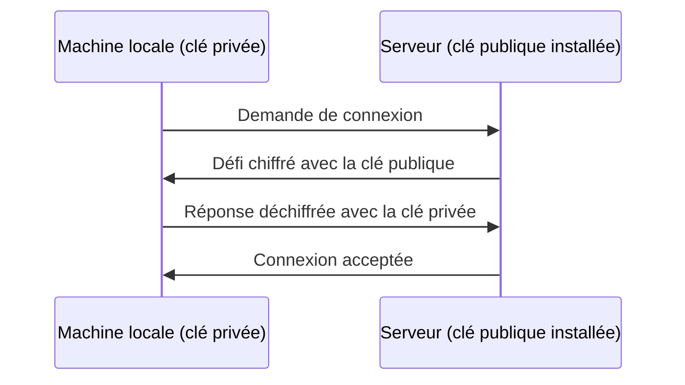

<div class="chapitre-titre-num">CHAPITRE 6 · 🟡 INTERMÉDIAIRE</div>

# SSH

<div class="encadre objectif">
<span class="encadre-titre">🎯 Objectif du chapitre</span>
Comprendre précisément comment fonctionne SSH (chiffrement, paire de clés), générer sa propre paire de clés, l'installer sur ton serveur de laboratoire, se connecter sans mot de passe, puis durcir sérieusement la configuration du serveur SSH — jusqu'à désactiver complètement l'authentification par mot de passe, la pratique standard de tout serveur de production. Ce chapitre referme la Partie II : à la fin, ton laboratoire sera à la fois administré (chapitre 5) et sécurisé en accès distant.
</div>

<div class="encadre scenario">
<span class="encadre-titre">🎬 Mise en situation</span>
Depuis le chapitre 3, tu te connectes à ton serveur de laboratoire avec `ssh utilisateur@ip`, en tapant un mot de passe à chaque fois. C'est fonctionnel, mais ce n'est ni la méthode la plus sûre, ni la plus pratique une fois qu'on automatise (les chapitres suivants, notamment le déploiement automatique, ne peuvent pas taper un mot de passe à ta place). Ce chapitre remplace cette habitude par la méthode professionnelle standard : une paire de clés cryptographiques.
</div>

## 6.1 Comment fonctionne SSH : chiffrement et paire de clés

SSH (*Secure Shell*) établit une connexion **chiffrée** entre ta machine et un serveur distant : tout ce qui transite (commandes tapées, réponses affichées) est illisible pour quiconque intercepterait le trafic réseau entre les deux.

L'authentification par **paire de clés** repose sur deux fichiers mathématiquement liés, mais qui ne se déduisent pas l'un de l'autre :

- **La clé privée** (`id_ed25519` par exemple) : ne quitte **jamais** ta machine, protège l'accès à tous les serveurs où sa clé publique correspondante est installée.
- **La clé publique** (`id_ed25519.pub`) : peut être partagée sans risque, installée sur autant de serveurs que nécessaire.



<div class="encadre astuce">
<span class="encadre-titre">💡 Analogie — le cadenas et la clé</span>
Imagine que tu distribues, à chaque endroit où tu veux entrer, un cadenas ouvert (la clé publique) que n'importe qui peut voir et installer sur sa porte. Seule ta clé personnelle (la clé privée, gardée sur toi en permanence) peut ouvrir ce cadenas précis. Même si quelqu'un examine le cadenas en détail, il ne peut pas en déduire la forme de ta clé — c'est exactement le principe mathématique de la cryptographie asymétrique derrière SSH.
</div>

<div class="encadre retenir">
<span class="encadre-titre">📌 À retenir absolument</span>
La clé privée ne se copie <strong>jamais</strong> sur un serveur, ne se partage <strong>jamais</strong>, ne s'envoie <strong>jamais</strong> par email ou messagerie. Seule la clé publique circule. Une clé privée compromise doit être immédiatement révoquée (retirée de tous les serveurs) et remplacée par une nouvelle paire.
</div>

## 6.2 Générer sa paire de clés

```bash
# Sur ta machine locale (pas sur le serveur de laboratoire)
ssh-keygen -t ed25519 -C "ton.email@exemple.com"
```

**Explication de la commande :** `-t ed25519` choisit l'algorithme Ed25519 — plus récent, plus rapide et au moins aussi sûr que l'ancien standard RSA, recommandé par défaut aujourd'hui ; `-C` ajoute un commentaire (généralement ton email) qui n'a aucun rôle cryptographique, seulement un repère visuel pratique quand plusieurs clés sont en jeu.

**Résultat attendu** : trois questions successives — l'emplacement du fichier (accepte la valeur par défaut, `~/.ssh/id_ed25519`, en appuyant simplement sur Entrée), puis une **phrase de passe** (*passphrase*) optionnelle.

<div class="encadre securite">
<span class="encadre-titre">🔒 Sécurité — pourquoi ajouter une phrase de passe malgré tout</span>
Une paire de clés sans phrase de passe fonctionne, mais si quelqu'un vole le fichier de clé privée (ordinateur volé, disque compromis), il peut immédiatement s'authentifier sur tous tes serveurs sans rien connaître d'autre. Une phrase de passe ajoute une seconde barrière : même en possession du fichier, il faut encore connaître cette phrase pour l'utiliser. Un gestionnaire d'agent SSH (section 6.3) évite d'avoir à la retaper à chaque connexion.
</div>

**Vérification :**

```bash
ls -la ~/.ssh/
```

**Résultat attendu** : deux nouveaux fichiers, `id_ed25519` (privé, permissions `600`) et `id_ed25519.pub` (public, lisible).

## 6.3 Installer sa clé publique sur le serveur

**Méthode automatique (recommandée) :**

```bash
ssh-copy-id utilisateur@adresse_ip_du_laboratoire
```

**Explication :** cette commande se connecte une dernière fois avec le mot de passe classique, puis ajoute automatiquement le contenu de ta clé publique locale au fichier `~/.ssh/authorized_keys` du compte distant.

**Méthode manuelle (si `ssh-copy-id` n'est pas disponible, notamment sur certains systèmes Windows) :**

```bash
# Sur ta machine locale — afficher la clé publique
cat ~/.ssh/id_ed25519.pub
```

Copie la ligne affichée, connecte-toi ensuite normalement par mot de passe, puis sur le serveur :

```bash
# Sur le serveur de laboratoire
mkdir -p ~/.ssh
chmod 700 ~/.ssh
echo "colle_ici_la_ligne_copiée" >> ~/.ssh/authorized_keys
chmod 600 ~/.ssh/authorized_keys
```

**Explication des permissions :** SSH refuse de faire confiance à un fichier `authorized_keys` trop ouvert — `700` sur le dossier `.ssh` (accès réservé au propriétaire) et `600` sur le fichier lui-même sont **obligatoires**, pas de simples recommandations.

<div class="encadre attention">
<span class="encadre-titre">⚠️ Erreur fréquente : permissions trop larges sur `.ssh`</span>
Si `~/.ssh` ou `authorized_keys` sont accessibles en écriture par le groupe ou par tout le monde, SSH refuse silencieusement d'utiliser la clé et retombe sur le mot de passe — un comportement qui semble être un bug alors que c'est une protection volontaire. `chmod 700 ~/.ssh` et `chmod 600 ~/.ssh/authorized_keys` corrigent ce cas presque systématiquement.
</div>

**Test de vérification :**

```bash
ssh utilisateur@adresse_ip_du_laboratoire
```

**Résultat attendu** : la connexion s'établit **sans demander de mot de passe** (uniquement la phrase de passe de la clé, si tu en as défini une à la section 6.2).

## 6.4 Agent SSH : ne plus retaper sa phrase de passe

```bash
# Sur ta machine locale
eval "$(ssh-agent -s)"
ssh-add ~/.ssh/id_ed25519
```

**Explication :** `ssh-agent` démarre un petit programme qui garde ta clé déchiffrée en mémoire, le temps de la session ; `ssh-add` lui confie ta clé, après une unique saisie de la phrase de passe. Toutes les connexions SSH suivantes, dans cette même session, réutilisent cette clé sans redemander la phrase.

**Résultat attendu** : `Identity added: /home/toi/.ssh/id_ed25519` — les connexions SSH suivantes ne redemandent plus rien.

## 6.5 Durcir la configuration du serveur SSH

Une fois la connexion par clé confirmée fonctionnelle (section 6.3), il faut **désactiver l'authentification par mot de passe**, qui reste, tant qu'elle est active, une porte d'entrée vulnérable aux attaques par force brute.

```bash
# Sur le serveur de laboratoire
sudo nano /etc/ssh/sshd_config
```

Modifie ou ajoute les lignes suivantes :

```ini
PasswordAuthentication no
PermitRootLogin no
PubkeyAuthentication yes
```

<div class="encadre attention">
<span class="encadre-titre">⚠️ Ne jamais fermer ta session avant d'avoir vérifié</span>
Avant de redémarrer le service SSH avec cette configuration, <strong>ouvre un second terminal</strong> et vérifie que la connexion par clé fonctionne toujours dans cette nouvelle fenêtre, <strong>sans fermer la session actuelle</strong>. Si quelque chose est mal configuré et que tu perds l'accès, la session encore ouverte dans le premier terminal reste ton seul filet de sécurité pour corriger l'erreur.
</div>

```bash
sudo systemctl restart sshd
```

**Explication des trois lignes :** `PasswordAuthentication no` désactive complètement la connexion par mot de passe — seule une clé valide permet désormais de se connecter ; `PermitRootLogin no` interdit toute connexion SSH directe avec le compte `root` (il faut se connecter avec un compte nominatif puis utiliser `sudo`, cohérent avec le chapitre 5) ; `PubkeyAuthentication yes` confirme explicitement que l'authentification par clé reste active (généralement déjà la valeur par défaut, mais explicite vaut mieux qu'implicite dans un fichier de sécurité).

**Test de vérification final :**

```bash
# Dans un troisième terminal, tenter une connexion par mot de passe forcé
ssh -o PubkeyAuthentication=no utilisateur@adresse_ip_du_laboratoire
```

**Résultat attendu** : la connexion est refusée (`Permission denied (publickey)`), preuve que seule l'authentification par clé fonctionne désormais.

<div class="encadre bonne-pratique">
<span class="encadre-titre">✅ Bonne pratique — changer le port SSH par défaut (optionnel)</span>
Changer le port 22 par un autre (`Port 2222` dans `sshd_config`, puis autoriser ce nouveau port dans UFW avant de fermer l'ancien, chapitre 5) réduit le volume de tentatives automatisées basiques, sans remplacer une vraie sécurité (clés + mot de passe désactivé restent l'essentiel). Cette mesure est un confort, jamais un substitut aux étapes précédentes de ce chapitre.
</div>

## Atelier — Durcissement complet du laboratoire

<div class="encadre exercice">
<span class="encadre-titre">🛠️ Atelier 6.1 — De la connexion par mot de passe à l'accès entièrement par clé</span>

**Objectif** : exécuter, dans l'ordre, la séquence complète de ce chapitre sur ton propre serveur de laboratoire.

**Étapes détaillées** :

1. Génère une paire de clés Ed25519 si ce n'est pas déjà fait (section 6.2).
2. Installe la clé publique sur ton laboratoire avec `ssh-copy-id` (section 6.3).
3. Vérifie la connexion sans mot de passe.
4. Édite `/etc/ssh/sshd_config` pour désactiver l'authentification par mot de passe et l'accès root direct (section 6.5) — **en gardant une session ouverte en filet de sécurité**.
5. Redémarre `sshd` et vérifie, dans un nouveau terminal, qu'une connexion par mot de passe forcé est bien refusée.

**Résultat attendu** : seule une clé valide permet désormais de se connecter à ton laboratoire — exactement la configuration attendue avant tout déploiement réel en production (chapitre 26).

**Dépannage** : si tu perds l'accès malgré la session de secours ouverte, corrige directement `PasswordAuthentication yes` dans cette session encore active, `sudo systemctl restart sshd`, et reprends le durcissement plus lentement, étape par étape.
</div>

## Erreurs fréquentes

<div class="encadre attention">
<span class="encadre-titre">⚠️ Erreur n°1 — Désactiver le mot de passe avant d'avoir vérifié la clé</span>
Rappel de la règle la plus importante de ce chapitre (section 6.5) : ne jamais désactiver `PasswordAuthentication` sans avoir d'abord confirmé, dans une connexion active séparée, que l'authentification par clé fonctionne réellement.
</div>

<div class="encadre attention">
<span class="encadre-titre">⚠️ Erreur n°2 — Copier accidentellement la clé privée au lieu de la clé publique</span>
Coller le contenu de `id_ed25519` (privé) au lieu de `id_ed25519.pub` (public) dans `authorized_keys` ne fonctionne pas et expose surtout inutilement la clé privée si elle finit copiée quelque part. Toujours vérifier que le fichier copié se termine par `.pub`.
</div>

<div class="encadre attention">
<span class="encadre-titre">⚠️ Erreur n°3 — Permissions incorrectes sur `.ssh` ou `authorized_keys`</span>
Comme détaillé en section 6.3, SSH ignore silencieusement une clé si les permissions du dossier ou du fichier sont trop ouvertes — vérifier `chmod 700 ~/.ssh` et `chmod 600 ~/.ssh/authorized_keys` en cas d'échec inexpliqué.
</div>

## En entreprise

**Réalité répandue** : dans la quasi-totalité des environnements professionnels sérieux, l'accès SSH par mot de passe est interdit par politique de sécurité, et l'accès root direct également — exactement la configuration de la section 6.5.

**Bonne pratique répandue** : les grandes équipes centralisent la gestion des clés autorisées (par exemple via un outil de gestion de configuration ou un service d'identité centralisé) plutôt que d'ajouter manuellement chaque clé sur chaque serveur — une pratique qui devient vite ingérable au-delà de quelques serveurs, abordée indirectement avec l'Infrastructure as Code (Partie XII).

**Erreur classique observée** : des clés SSH générées une fois, il y a des années, jamais renouvelées ni révoquées même après le départ d'un collaborateur qui y avait accès — un vrai risque de sécurité, à mettre en regard de la gestion des accès traitée au chapitre 25.

## Entretien technique

<div class="encadre exercice">
<span class="encadre-titre">💼 Questions fréquemment posées en entretien</span>

**Q1. "Explique la différence entre une clé SSH privée et publique."**
Réponse attendue : la clé privée reste sur la machine de l'utilisateur et ne se partage jamais ; la clé publique se distribue librement et s'installe sur chaque serveur où l'on souhaite se connecter (section 6.1). Le serveur utilise la clé publique pour vérifier que celui qui se connecte possède bien la clé privée correspondante, sans jamais voir cette clé privée elle-même.

**Q2. "Pourquoi désactive-t-on l'authentification par mot de passe SSH en production ?"**
Réponse attendue : un mot de passe, même complexe, reste vulnérable à des attaques automatisées par force brute menées à grande échelle sur Internet ; une clé cryptographique n'est pas devinable par cette méthode (section 6.5).

**Q3. "Que ferais-tu avant de redémarrer le service SSH après une modification de sa configuration ?"**
Réponse attendue : garder une session SSH active ouverte en parallèle, comme filet de sécurité, et vérifier dans un second terminal que la nouvelle configuration fonctionne avant de fermer la première session (section 6.5).
</div>

## Optimisation, sécurité et maintenabilité — les réflexes dès ce chapitre

<div class="encadre securite">
<span class="encadre-titre">🔒 Sécurité</span>
Le trio clé SSH + mot de passe désactivé + root direct interdit constitue, avec le pare-feu du chapitre 5, le socle non négociable de tout serveur exposé à Internet. Aucun chapitre suivant de ce manuel ne suppose un accès SSH par mot de passe.
</div>

<div class="encadre bonne-pratique">
<span class="encadre-titre">✅ Maintenabilité</span>
Nomme tes clés SSH de façon explicite si tu en gères plusieurs (`id_ed25519_labo`, `id_ed25519_perso`) plutôt que de toutes les appeler pareil — un fichier `~/.ssh/config` (non couvert en détail ici, mais mentionné pour référence) permet d'associer automatiquement la bonne clé au bon serveur.
</div>

<div class="encadre performance">
<span class="encadre-titre">🚀 Performance</span>
L'agent SSH (section 6.4) élimine la friction de retaper une phrase de passe à chaque connexion — un gain de confort qui, cumulé sur des dizaines de connexions par jour pendant ce manuel, compte réellement.
</div>

## Résumé du chapitre

- SSH chiffre toute la communication entre ta machine et un serveur distant.
- L'authentification par paire de clés (privée jamais partagée, publique installée sur le serveur) remplace avantageusement le mot de passe.
- `ssh-keygen -t ed25519` génère une paire de clés ; `ssh-copy-id` l'installe sur un serveur.
- `chmod 700 ~/.ssh` et `chmod 600 ~/.ssh/authorized_keys` sont des permissions obligatoires, pas optionnelles.
- `ssh-agent` + `ssh-add` évitent de retaper la phrase de passe à chaque connexion.
- Un serveur durci désactive `PasswordAuthentication` et `PermitRootLogin`, toujours en gardant une session de secours ouverte pendant la vérification.

## Quiz

<div class="encadre exercice">
<span class="encadre-titre">📝 QCM (une seule bonne réponse par question)</span>

1. Laquelle de ces affirmations est correcte ?
   - a) La clé privée doit être installée sur chaque serveur
   - b) La clé publique doit être installée sur chaque serveur, la clé privée reste locale
   - c) Les deux clés doivent être installées sur chaque serveur
   - d) Aucune clé n'est nécessaire si le mot de passe est fort

2. Avant de désactiver `PasswordAuthentication`, il faut :
   - a) Redémarrer le serveur entier
   - b) Vérifier, dans une session active séparée, que la connexion par clé fonctionne
   - c) Supprimer le compte root
   - d) Rien de particulier

3. Des permissions trop ouvertes sur `~/.ssh/authorized_keys` provoquent généralement :
   - a) Un message d'erreur explicite immédiat
   - b) Un refus silencieux d'utiliser la clé, avec retour au mot de passe
   - c) La suppression automatique du fichier
   - d) Aucun effet

**Corrigé** : 1-b, 2-b, 3-b.
</div>

<div class="encadre exercice">
<span class="encadre-titre">📝 Vrai ou Faux</span>

1. Il est acceptable d'envoyer sa clé privée par email à un collègue pour qu'il accède au même serveur. — **Faux** (chacun doit avoir sa propre paire de clés, section 6.1).
2. `ssh-agent` permet d'éviter de retaper la phrase de passe d'une clé à chaque connexion de la session. — **Vrai**.
3. Ed25519 est un algorithme de chiffrement plus récent et généralement recommandé par rapport à l'ancien RSA. — **Vrai**.

</div>

## Exercices

<div class="encadre exercice">
<span class="encadre-titre">📝 Exercice 6.1</span>

Explique, en tes propres mots, pourquoi il faut garder une session SSH active en parallèle avant de redémarrer `sshd` après une modification de configuration.
</div>

**Corrigé :** si la nouvelle configuration contient une erreur ou empêche toute nouvelle connexion (mauvaise syntaxe, clé mal installée, port fermé par erreur dans le pare-feu), la session déjà active ne sera pas coupée par ce redémarrage et reste le seul moyen de revenir sur la modification fautive sans perdre totalement l'accès au serveur — une fois toutes les sessions fermées, sans accès de secours (console fournie par l'hébergeur), un serveur mal configuré peut devenir inaccessible.

## Checklist de fin de chapitre

<ul class="checklist">
<li>☐ Je comprends le principe de la paire de clés (privée locale, publique distribuée).</li>
<li>☐ J'ai généré une paire de clés Ed25519 avec une phrase de passe.</li>
<li>☐ J'ai installé ma clé publique sur mon serveur de laboratoire et je m'y connecte sans mot de passe.</li>
<li>☐ J'utilise `ssh-agent` pour ne pas retaper ma phrase de passe à chaque connexion.</li>
<li>☐ J'ai désactivé `PasswordAuthentication` et `PermitRootLogin` sur mon laboratoire, en toute sécurité (session de secours vérifiée).</li>
<li>☐ Je sais expliquer pourquoi on ne redémarre jamais `sshd` sans filet de sécurité.</li>
</ul>

## FAQ

<dl class="faq">
<dt>Que faire si je perds ma clé privée ?</dt>
<dd>Génère immédiatement une nouvelle paire de clés, installe la nouvelle clé publique sur tous tes serveurs (via un accès de secours si le mot de passe est déjà désactivé), puis retire l'ancienne clé publique de chaque `authorized_keys`. Une clé perdue (sur un ordinateur volé, par exemple) doit être traitée comme potentiellement compromise.</dd>

<dt>Puis-je utiliser la même paire de clés pour tous mes serveurs ?</dt>
<dd>Techniquement oui, mais ce n'est pas recommandé au-delà d'un usage personnel très limité : une seule clé compromise donnerait accès à tous les serveurs à la fois. Une clé par contexte (personnel, professionnel, par client) limite l'impact d'une éventuelle compromission.</dd>

<dt>Le changement de port SSH (section 6.5) suffit-il comme mesure de sécurité à lui seul ?</dt>
<dd>Non, absolument pas. C'est une mesure de réduction de bruit (moins de tentatives automatisées basiques visibles dans les logs), jamais un substitut à la désactivation du mot de passe et de l'accès root direct, qui restent les vraies protections.</dd>
</dl>

## Références et pour aller plus loin

- Documentation officielle OpenSSH — configuration du serveur (`sshd_config`) : [https://www.openssh.com/manual.html](https://www.openssh.com/manual.html)
- DigitalOcean — "SSH Essentials: Working with SSH Servers, Clients, and Keys" (tutoriel très complet et régulièrement mis à jour) : [https://www.digitalocean.com/community/tutorials/ssh-essentials-working-with-ssh-servers-clients-and-keys](https://www.digitalocean.com/community/tutorials/ssh-essentials-working-with-ssh-servers-clients-and-keys)

*Chapitre suivant : Git de zéro — la Partie III commence, avec le premier dépôt versionné de ce manuel et le fonctionnement interne de Git expliqué en profondeur.*
