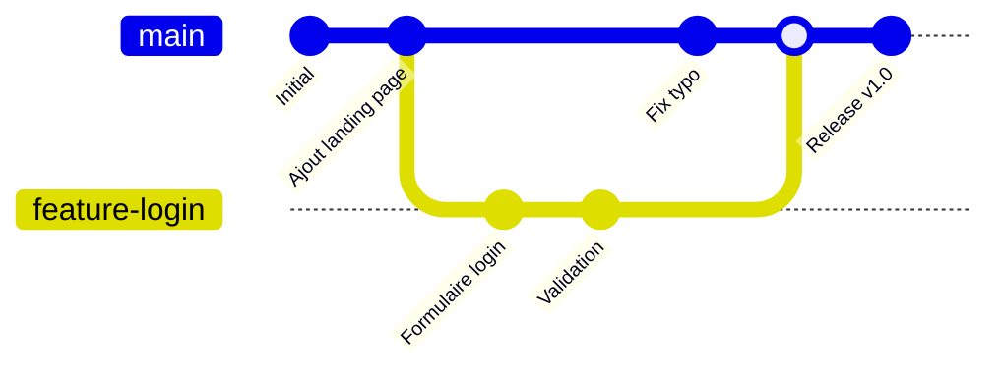
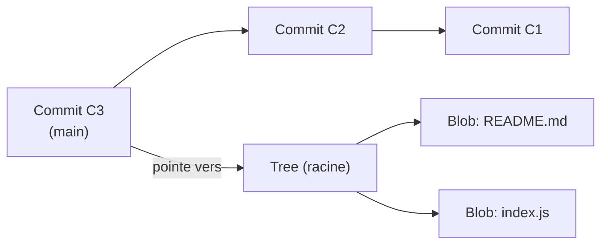

<div class="chapitre-titre-num">CHAPITRE 7 · 🟢 DÉBUTANT ABSOLU</div>

# Git de zéro

<div class="encadre objectif">
<span class="encadre-titre">🎯 Objectif du chapitre</span>
Comprendre ce que Git enregistre réellement (pas seulement "des fichiers", mais un historique complet et vérifiable de chaque changement), maîtriser les commandes du quotidien (`init`, `clone`, `status`, `add`, `commit`, `log`, `diff`, `branch`, `switch`, `merge`, `pull`, `push`, `fetch`, `remote`, `stash`, `tag`), et comprendre le fonctionnement interne de Git (objets, commits, arbre, index) suffisamment pour ne plus jamais être surpris par son comportement. Git est l'outil le plus utilisé de tout ce manuel — il apparaît, directement ou indirectement, dans presque tous les chapitres suivants.
</div>

<div class="encadre scenario">
<span class="encadre-titre">🎬 Mise en situation</span>
Sans Git, versionner du code ressemble souvent à ceci : `projet_final.zip`, `projet_final_v2.zip`, `projet_final_v2_CORRECTION.zip`, `projet_final_v2_CORRECTION_dernier.zip`. Chacun de ces noms de fichier est une tentative désespérée de faire, à la main, ce que Git fait automatiquement et de façon bien plus fiable : garder une trace de chaque état du projet, savoir ce qui a changé entre deux versions, et pouvoir revenir en arrière sans tout perdre. Ce chapitre remplace définitivement les dossiers "v2_final_vraiment_final" par un historique structuré.
</div>

## 7.1 Ce que Git enregistre réellement

Git n'est pas un simple outil de sauvegarde de fichiers : c'est un système de gestion de version **distribué**, qui enregistre l'historique complet d'un projet, chaque changement étant identifiable, comparable, et réversible.



<div class="encadre astuce">
<span class="encadre-titre">💡 Explication du schéma</span>
Chaque point de ce graphe est un <strong>commit</strong> : un instantané complet et daté du projet à un moment précis, avec un message expliquant ce qui a changé. La ligne <code>main</code> représente la version principale du projet ; <code>feature-login</code> est une <strong>branche</strong> (section 7.2 du chapitre 9) créée pour développer une fonctionnalité isolément, avant d'être fusionnée (<em>merge</em>) dans <code>main</code> une fois prête.
</div>

## 7.2 Initialiser un dépôt et faire son premier commit

```bash
mkdir mon-premier-projet
cd mon-premier-projet
git init
```

**Explication :** `git init` transforme un dossier ordinaire en dépôt Git, en créant un sous-dossier caché `.git/` qui contiendra tout l'historique — visible avec `ls -la` (chapitre 4).

```bash
echo "# Mon premier projet" > README.md
git status
```

**Résultat attendu** : Git signale un fichier `README.md` "untracked" (non suivi) — il existe sur le disque, mais Git ne l'a pas encore pris en charge.

```bash
git add README.md
git status
```

**Résultat attendu** : `README.md` apparaît maintenant en vert, "staged" (indexé) — prêt à être inclus dans le prochain commit, mais pas encore enregistré définitivement.

```bash
git commit -m "Premier commit : ajout du README"
```

**Explication :** `-m` fournit directement le message de commit en ligne de commande (sinon Git ouvre un éditeur de texte). Ce message devient une partie permanente de l'historique.

<div class="encadre retenir">
<span class="encadre-titre">📌 Les trois zones de Git</span>
Git distingue toujours trois états : le <strong>répertoire de travail</strong> (tes fichiers tels qu'ils sont sur le disque), la <strong>zone d'index / staging area</strong> (ce que tu as sélectionné avec <code>git add</code> pour le prochain commit), et l'<strong>historique</strong> (ce qui a été définitivement enregistré par <code>git commit</code>). Cette séparation en trois étapes, déroutante au début, permet de choisir précisément quels changements inclure dans chaque commit, plutôt que de tout enregistrer en bloc.
</div>

## 7.3 Consulter l'historique et les différences

```bash
git log
git log --oneline --graph
```

**Résultat attendu** : la première commande affiche chaque commit en détail (auteur, date, message complet) ; la seconde, bien plus utilisée au quotidien, condense chaque commit sur une ligne avec un graphe visuel des branches.

```bash
echo "Ligne ajoutée" >> README.md
git diff
```

**Résultat attendu** : Git affiche précisément quelles lignes ont changé (en rouge ce qui a été retiré, en vert ce qui a été ajouté) entre le répertoire de travail et le dernier commit — avant même de faire `git add`.

## 7.4 Branches : `branch`, `switch`, `merge`

```bash
git branch nouvelle-fonctionnalite
git switch nouvelle-fonctionnalite
```

**Explication :** `git branch nom` crée une nouvelle branche à partir du commit courant, sans y basculer ; `git switch nom` bascule dessus (`git checkout nom` fonctionne aussi, `switch` est la commande plus récente et plus explicite, recommandée aujourd'hui).

**Raccourci fréquent :**

```bash
git switch -c autre-fonctionnalite
```

**Explication :** `-c` (create) crée et bascule sur la nouvelle branche en une seule commande.

```bash
git switch main
git merge nouvelle-fonctionnalite
```

**Résultat attendu** : les commits de `nouvelle-fonctionnalite` s'intègrent dans `main`. Si les deux branches ont modifié les mêmes lignes du même fichier, Git signale un **conflit de fusion**, qu'il faut résoudre manuellement (marques `<<<<<<<`, `=======`, `>>>>>>>` insérées directement dans le fichier concerné) avant de finaliser la fusion avec un nouveau `git commit`.

## 7.5 Travailler avec un dépôt distant : `remote`, `push`, `pull`, `fetch`, `clone`

```bash
git remote add origin https://github.com/utilisateur/mon-premier-projet.git
git push -u origin main
```

**Explication :** `remote add origin` enregistre l'adresse d'un dépôt distant (typiquement GitHub, chapitre 8) sous le nom conventionnel `origin` ; `push -u origin main` envoie les commits locaux vers ce dépôt distant, `-u` mémorisant ce lien pour que les prochains `git push` suffisent seuls, sans répéter `origin main`.

```bash
git pull
git fetch
```

**Différence essentielle :** `git fetch` télécharge les derniers changements du dépôt distant **sans** les fusionner dans ta branche locale — utile pour regarder ce qui a changé avant de décider ; `git pull` fait `fetch` **puis** `merge` automatiquement, en une seule commande.

```bash
git clone https://github.com/utilisateur/projet-existant.git
```

**Résultat attendu** : `git clone` télécharge un dépôt distant existant dans son intégralité (tout l'historique, toutes les branches), créant un nouveau dossier local prêt à l'emploi — la façon la plus courante de commencer à travailler sur un projet déjà existant.

## 7.6 Mettre de côté un travail en cours : `stash`

```bash
git stash
git switch main
# ... traiter une urgence sur main ...
git switch nouvelle-fonctionnalite
git stash pop
```

**Explication :** `git stash` met de côté temporairement les modifications non commitées du répertoire de travail (sans créer de commit), permettant de changer de branche l'esprit tranquille ; `git stash pop` les restaure là où on les avait laissées.

**Cas pratique DevOps :** interrompre un travail en cours pour corriger en urgence un bug sur `main`, sans avoir à commiter un travail à moitié terminé juste pour changer de branche.

## 7.7 Marquer une version précise : `tag`

```bash
git tag -a v1.0.0 -m "Première version stable"
git push origin v1.0.0
```

**Explication :** un tag marque un commit précis d'un nom mémorable et permanent — typiquement un numéro de version. `-a` crée un tag "annoté" (avec message et métadonnées), préférable à un tag "léger" pour tout usage sérieux.

**Cas pratique DevOps :** les tags de version déclenchent souvent, dans un pipeline CI/CD (Partie VII), la construction et la publication d'une image Docker portant ce même numéro de version (chapitre 14).

## 7.8 Fonctionnement interne de Git : objets, commits, arbre, index

<div class="encadre memoriser">
<span class="encadre-titre">🧠 Ce que contient réellement `.git/`</span>
Git stocke tout son historique sous forme d'<strong>objets</strong>, chacun identifié par un hash SHA-1 (une empreinte unique calculée à partir de son contenu) : des <strong>blobs</strong> (le contenu brut d'un fichier), des <strong>trees</strong> (la structure d'un dossier, listant quels blobs et sous-trees il contient), et des <strong>commits</strong> (un tree précis, un message, un auteur, une date, et un pointeur vers le ou les commits précédents). Une <strong>branche</strong> n'est, techniquement, qu'un simple pointeur mobile vers un commit — c'est pour cela que créer une branche est instantané, quelle que soit la taille du projet.
</div>



<div class="encadre astuce">
<span class="encadre-titre">💡 Pourquoi comprendre ceci change tout</span>
Une fois qu'on sait qu'un commit n'est qu'un pointeur vers un arbre de contenu, et qu'une branche n'est qu'un pointeur mobile vers un commit, la plupart des commandes Git avancées (rebase, reset, cherry-pick — non détaillées dans ce chapitre volontairement introductif) deviennent des manipulations logiques de pointeurs, plutôt qu'une magie opaque à mémoriser par cœur.
</div>

## Atelier — Cycle de vie complet d'une fonctionnalité

<div class="encadre exercice">
<span class="encadre-titre">🛠️ Atelier 7.1 — Du dépôt vide à la fonctionnalité fusionnée</span>

**Objectif** : reproduire, sur ton propre dépôt local, le cycle complet illustré par le graphe de la section 7.1.

**Étapes détaillées** :

1. `git init` dans un nouveau dossier, crée un fichier `app.txt` avec le contenu "Version initiale", `git add` puis `git commit`.
2. Crée et bascule sur une branche `ajout-fonctionnalite` (`git switch -c`).
3. Modifie `app.txt` (ajoute une ligne), commit ce changement sur cette branche.
4. Reviens sur la branche principale (`git switch main` ou `master` selon ta configuration), modifie une **autre** ligne d'`app.txt`, commit.
5. Fusionne `ajout-fonctionnalite` dans la branche principale avec `git merge`.
6. Observe le résultat avec `git log --oneline --graph`.

**Résultat attendu** : un historique en forme de graphe, avec deux lignes qui divergent puis se rejoignent — visuellement identique au schéma de la section 7.1.

**Dépannage** : si l'étape 5 signale un conflit (les deux branches ont modifié la même ligne), ouvre `app.txt`, choisis quelle version garder entre les marques `<<<<<<<`/`=======`/`>>>>>>>`, supprime ces marques, puis `git add app.txt` et `git commit` pour finaliser la fusion.
</div>

## Erreurs fréquentes

<div class="encadre attention">
<span class="encadre-titre">⚠️ Erreur n°1 — Commiter sans `git add` préalable et être surpris que rien ne change</span>
`git commit` sans `-a` n'enregistre que ce qui a été explicitement ajouté avec `git add` (section 7.2) — un fichier modifié mais jamais "stagé" n'apparaît pas dans le commit, même s'il est bien modifié sur le disque.
</div>

<div class="encadre attention">
<span class="encadre-titre">⚠️ Erreur n°2 — Confondre `git pull` et `git fetch`</span>
`git fetch` ne modifie jamais ton répertoire de travail ; `git pull` fusionne automatiquement. Utiliser `pull` par réflexe sans comprendre ce qu'il fait peut créer des fusions inattendues sur une branche partagée.
</div>

<div class="encadre attention">
<span class="encadre-titre">⚠️ Erreur n°3 — Messages de commit inutiles ("fix", "wip", "test")</span>
Un historique rempli de messages sans information ("fix", "test", "wip2") perd l'essentiel de la valeur de Git : comprendre, des mois plus tard, pourquoi un changement précis a été fait. Un bon message de commit explique le **pourquoi**, pas seulement le "quoi" déjà visible dans le `diff`.
</div>

## En entreprise

**Réalité répandue** : la quasi-totalité des entreprises logicielles utilisent Git aujourd'hui, quel que soit le langage ou la stack. C'est, avec la ligne de commande Linux, la compétence la plus universellement attendue de tout ce manuel.

**Bonne pratique répandue** : des messages de commit suivant une convention partagée (par exemple `feat:`, `fix:`, `docs:`, connue sous le nom de "Conventional Commits") facilitent la génération automatique de notes de version et la lecture rapide de l'historique par toute l'équipe.

**Erreur classique observée** : des commits énormes regroupant des dizaines de changements sans rapport, rendant impossible de comprendre ou d'annuler un seul changement précis sans emporter tout le reste — un écho direct du principe des petits changements fréquents (chapitre 2, section 2.4), appliqué ici à l'échelle d'un commit individuel.

## Entretien technique

<div class="encadre exercice">
<span class="encadre-titre">💼 Questions fréquemment posées en entretien</span>

**Q1. "Quelle est la différence entre `git fetch` et `git pull` ?"**
Réponse attendue : `fetch` télécharge les changements distants sans les fusionner ; `pull` fait `fetch` puis `merge` automatiquement (section 7.5).

**Q2. "Qu'est-ce qu'une branche, techniquement, dans Git ?"**
Réponse attendue : un simple pointeur mobile vers un commit précis, pas une copie du projet — ce qui rend la création d'une branche quasi instantanée, quelle que soit la taille du dépôt (section 7.8).

**Q3. "Comment gères-tu un conflit de fusion ?"**
Réponse attendue : identifier les fichiers en conflit (indiqués par `git status`), ouvrir chacun, choisir quelle version garder entre les marques `<<<<<<<`/`=======`/`>>>>>>>`, supprimer ces marques, puis `git add` et `git commit` pour finaliser (section 7.4).
</div>

## Optimisation, sécurité et maintenabilité — les réflexes dès ce chapitre

<div class="encadre securite">
<span class="encadre-titre">🔒 Sécurité</span>
Ne commite jamais un secret réel (mot de passe, clé API) — une fois poussé sur un dépôt distant, même supprimé dans un commit ultérieur, il reste consultable dans l'historique tant que l'historique lui-même n'est pas réécrit (une opération délicate, à éviter). Ce sujet est traité en profondeur au chapitre 25.
</div>

<div class="encadre bonne-pratique">
<span class="encadre-titre">✅ Maintenabilité</span>
Commite souvent, avec des messages précis et de petite taille (chapitre 2, section 2.4) — un historique Git de qualité est l'une des meilleures formes de documentation d'un projet, à condition d'y investir un minimum de soin à chaque commit.
</div>

<div class="encadre performance">
<span class="encadre-titre">🚀 Performance</span>
`git log --oneline --graph --all` (avec `--all` pour voir toutes les branches, pas seulement la courante) reste la commande de diagnostic la plus rapide pour comprendre visuellement l'état d'un dépôt complexe, plutôt que de deviner à partir de `git status` seul.
</div>

## Résumé du chapitre

- Git enregistre un historique complet et vérifiable, organisé en trois zones : répertoire de travail, index (staging), historique (commits).
- `init`/`clone` démarrent un dépôt ; `add`/`commit` enregistrent des changements ; `status`/`diff`/`log` les inspectent.
- `branch`/`switch`/`merge` isolent et réintègrent du travail en parallèle.
- `remote`/`push`/`pull`/`fetch` synchronisent avec un dépôt distant, `fetch` sans fusion automatique, `pull` avec.
- `stash` met de côté un travail en cours sans commit ; `tag` marque un commit précis, souvent un numéro de version.
- Techniquement, un commit pointe vers un arbre de fichiers (blobs/trees), et une branche n'est qu'un pointeur mobile vers un commit.

## Quiz

<div class="encadre exercice">
<span class="encadre-titre">📝 QCM (une seule bonne réponse par question)</span>

1. Que fait `git add fichier.txt` ?
   - a) Supprime le fichier
   - b) L'ajoute à la zone d'index (staging), en préparation du prochain commit
   - c) L'envoie directement sur GitHub
   - d) Crée une nouvelle branche

2. Techniquement, une branche Git est :
   - a) Une copie complète du projet
   - b) Un pointeur mobile vers un commit
   - c) Un fichier de configuration
   - d) Un dossier séparé sur le disque

3. `git fetch`, contrairement à `git pull` :
   - a) Fusionne automatiquement les changements distants
   - b) Télécharge les changements distants sans les fusionner
   - c) Supprime l'historique local
   - d) Ne fonctionne que sur la branche principale

**Corrigé** : 1-b, 2-b, 3-b.
</div>

<div class="encadre exercice">
<span class="encadre-titre">📝 Vrai ou Faux</span>

1. Un fichier modifié mais jamais ajouté avec `git add` apparaît quand même dans le prochain commit standard. — **Faux** (section 7.2, erreur fréquente n°1).
2. `git stash` crée un commit permanent dans l'historique. — **Faux** (il met de côté sans commit, section 7.6).
3. Un secret commité puis supprimé dans un commit ultérieur reste consultable dans l'historique Git. — **Vrai** (section "Sécurité").

</div>

## Exercices

<div class="encadre exercice">
<span class="encadre-titre">📝 Exercice 7.1</span>

Explique la différence entre `git branch nouvelle-branche` et `git switch -c nouvelle-branche`.
</div>

**Corrigé :** `git branch nouvelle-branche` crée la branche à partir du commit courant, mais reste sur la branche actuelle — il faudrait ensuite `git switch nouvelle-branche` pour y basculer. `git switch -c nouvelle-branche` combine les deux actions (création et bascule) en une seule commande — c'est la méthode la plus utilisée en pratique quotidienne.

## Checklist de fin de chapitre

<ul class="checklist">
<li>☐ Je comprends les trois zones de Git (répertoire de travail, index, historique).</li>
<li>☐ Je sais initialiser un dépôt, ajouter et commiter des changements avec des messages clairs.</li>
<li>☐ Je sais consulter l'historique (`log`) et les différences (`diff`).</li>
<li>☐ Je sais créer une branche, basculer dessus, et fusionner (y compris résoudre un conflit simple).</li>
<li>☐ Je sais synchroniser avec un dépôt distant (`remote`, `push`, `pull`, `fetch`, `clone`).</li>
<li>☐ Je sais mettre de côté un travail en cours (`stash`) et marquer une version (`tag`).</li>
<li>☐ Je comprends, dans les grandes lignes, ce qu'un commit et une branche représentent techniquement.</li>
</ul>

## FAQ

<dl class="faq">
<dt>Dois-je apprendre `git rebase` dès maintenant ?</dt>
<dd>Non, pas dans ce chapitre volontairement introductif. `merge` (section 7.4) suffit largement pour tout ce manuel. `rebase` est une commande plus avancée, utile dans certains flux de travail (chapitre 9), mais pas un prérequis pour la suite.</dd>

<dt>Que faire si je commite quelque chose par erreur juste avant de le pousser ?</dt>
<dd>Tant que le commit n'a pas été poussé (`git push`) vers un dépôt distant, il est facile à corriger localement. Une fois poussé et potentiellement récupéré par d'autres, corriger l'historique devient plus délicat et sort du périmètre de ce chapitre introductif.</dd>

<dt>Faut-il toujours utiliser `git switch` plutôt que l'ancien `git checkout` ?</dt>
<dd>`switch` (et son équivalent `restore` pour les fichiers) a été introduit pour clarifier des usages que `checkout` mélangeait auparavant (changer de branche, restaurer un fichier). Ce manuel utilise systématiquement `switch`, mais tu croiseras encore très souvent `checkout` dans du code existant et des tutoriels plus anciens.</dd>
</dl>

## Références et pour aller plus loin

- Pro Git (livre officiel, intégralement gratuit en ligne, disponible en français) : [https://git-scm.com/book/fr/v2](https://git-scm.com/book/fr/v2)
- Documentation officielle Git : [https://git-scm.com/doc](https://git-scm.com/doc)
- `learngitbranching.js.org` — visualisation interactive du fonctionnement des branches Git : [https://learngitbranching.js.org](https://learngitbranching.js.org)

*Chapitre suivant : GitHub — repository, branches, pull requests, issues, releases, secrets, et le workflow professionnel complet qui s'appuie sur tout ce que ce chapitre vient de poser.*
