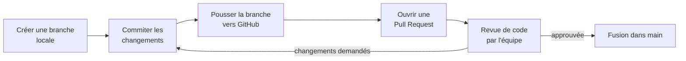

<div class="chapitre-titre-num">CHAPITRE 8 · 🟡 INTERMÉDIAIRE</div>

# GitHub

<div class="encadre objectif">
<span class="encadre-titre">🎯 Objectif du chapitre</span>
Comprendre ce que GitHub ajoute par-dessus Git (hébergement, collaboration, automatisation), maîtriser les concepts de repository, branches distantes, pull requests, issues, releases, tags, secrets, environments et permissions, et construire un workflow professionnel complet — du premier dépôt créé sur GitHub jusqu'à une fonctionnalité développée en branche, revue par pull request, et fusionnée dans `main`.
</div>

<div class="encadre scenario">
<span class="encadre-titre">🎬 Mise en situation</span>
Git (chapitre 7) fonctionne très bien sur une seule machine, pour une seule personne. Dès qu'une deuxième personne s'ajoute au projet — ou même simplement pour avoir une sauvegarde hors de ta machine locale — il faut un endroit central où le code peut vivre, être partagé, discuté et révisé avant d'être intégré. GitHub est cet endroit : pas un remplaçant de Git, mais un service construit autour de Git, qui ajoute l'hébergement et toute la couche de collaboration qui manque à Git seul.
</div>

## 8.1 GitHub n'est pas Git

<div class="encadre retenir">
<span class="encadre-titre">📌 Distinction essentielle</span>
<strong>Git</strong> est l'outil de gestion de version, installé sur ta machine (chapitre 7), qui fonctionne même hors ligne, sans aucun service tiers. <strong>GitHub</strong> est un service en ligne (parmi d'autres : GitLab, Bitbucket) qui héberge des dépôts Git et ajoute des fonctionnalités de collaboration par-dessus : interface web, revue de code, gestion de tickets, automatisation (chapitre 21). On peut utiliser Git sans jamais toucher à GitHub ; l'inverse n'a pas de sens, GitHub héberge et manipule des dépôts Git.
</div>

## 8.2 Créer un repository et le lier à un dépôt local

Sur [github.com](https://github.com), le bouton "New repository" crée un dépôt vide, avec un nom, une visibilité (public ou privé), et éventuellement un `README.md`, un `.gitignore` et une licence générés automatiquement.

```bash
# Sur ta machine locale — lier un dépôt Git local déjà existant à GitHub
git remote add origin https://github.com/ton-compte/nom-du-repo.git
git branch -M main
git push -u origin main
```

**Explication :** `remote add origin` (déjà vu au chapitre 7) enregistre l'URL du dépôt GitHub ; `branch -M main` renomme la branche courante en `main` si nécessaire (certaines configurations Git plus anciennes créent encore `master` par défaut) ; `push -u origin main` envoie l'historique complet et établit le lien de suivi entre la branche locale et distante.

<div class="encadre astuce">
<span class="encadre-titre">💡 HTTPS ou SSH pour se connecter à GitHub ?</span>
Deux méthodes existent pour authentifier `git push`/`git pull` vers GitHub : une URL HTTPS (avec un jeton d'accès personnel plutôt qu'un mot de passe, GitHub ayant supprimé l'authentification par mot de passe simple depuis 2021) ou une URL SSH (en réutilisant la paire de clés du chapitre 6, après l'avoir ajoutée dans les paramètres GitHub → SSH and GPG keys). SSH, une fois configuré, est généralement plus fluide au quotidien — c'est la méthode recommandée pour ce manuel.
</div>

## 8.3 Branches distantes et Pull Requests

Une **pull request** (PR) est une proposition formelle d'intégrer les changements d'une branche dans une autre (typiquement, une branche de fonctionnalité vers `main`), avec un espace de discussion, de revue ligne par ligne, et de validation avant fusion.

```bash
git switch -c ajout-page-contact
# ... modifications, commits ...
git push -u origin ajout-page-contact
```

Une fois la branche poussée, GitHub propose directement de créer une pull request depuis l'interface web (ou via `gh pr create` en ligne de commande, avec l'outil officiel `gh`).



<div class="encadre bonne-pratique">
<span class="encadre-titre">✅ Bonne pratique — une pull request ciblée</span>
Une pull request qui modifie 40 fichiers sans rapport entre eux est presque impossible à relire sérieusement. Applique le même principe que les petits changements fréquents (chapitre 2, section 2.4) : une pull request devrait, autant que possible, répondre à une seule question claire ("qu'est-ce que ce changement fait précisément ?").
</div>

## 8.4 Issues : suivre les tâches et les problèmes

Une **issue** est un ticket — un bug signalé, une fonctionnalité demandée, une tâche à faire — discutable, assignable à une personne, classable par étiquettes (*labels*), et reliable directement à une pull request qui la résout (en écrivant `Closes #12` dans le message de la pull request, l'issue n°12 se ferme automatiquement à la fusion).

<div class="encadre astuce">
<span class="encadre-titre">💡 Pourquoi les issues comptent en DevOps</span>
Une issue reliée à sa pull request crée une traçabilité complète : pourquoi ce changement de code existe-t-il ? Quelle discussion l'a précédé ? Cette traçabilité, anodine sur un petit projet personnel, devient précieuse des mois plus tard, ou lors d'un post-mortem (chapitre 2, section 2.3) cherchant à comprendre l'origine d'une décision technique.
</div>

## 8.5 Releases et tags

Une **release** GitHub s'appuie sur un tag Git (chapitre 7, section 7.7) mais y ajoute une page dédiée : notes de version (souvent rédigées à la main ou générées automatiquement à partir des pull requests fusionnées), fichiers binaires attachés (un exécutable compilé, une archive), et un historique consultable de toutes les versions publiées du projet.

```bash
git tag -a v1.2.0 -m "Ajout du module de paiement"
git push origin v1.2.0
```

Depuis GitHub, "Releases" → "Draft a new release" permet ensuite de transformer ce tag en release complète, visible et téléchargeable.

## 8.6 Secrets et Environments

<div class="encadre securite">
<span class="encadre-titre">🔒 Sécurité — GitHub Secrets, une introduction</span>
GitHub permet de stocker des valeurs sensibles (mots de passe, clés API, jetons) de façon chiffrée, jamais visibles dans les logs ni dans le code (Settings → Secrets and variables → Actions). Ces secrets sont utilisés par les workflows d'automatisation (chapitre 21) sans jamais apparaître en clair nulle part. Le chapitre 25 approfondit ce sujet en détail — retiens ici uniquement que GitHub propose un mécanisme dédié, à utiliser systématiquement plutôt que d'écrire un secret directement dans un fichier versionné.
</div>

Les **environments** (Settings → Environments) permettent de définir des environnements nommés (`staging`, `production`) avec leurs propres secrets, et surtout des **règles de protection** : par exemple, exiger l'approbation manuelle d'une personne précise avant qu'un déploiement vers `production` ne puisse s'exécuter — une porte de sécurité directement intégrée au pipeline (approfondi au chapitre 27).

## 8.7 Permissions

| Rôle GitHub (dépôt d'organisation) | Peut faire |
|---|---|
| **Read** | Consulter le code, cloner, ouvrir des issues |
| **Triage** | Read + gérer les issues et pull requests (labels, assignation) sans écrire de code |
| **Write** | Triage + pousser des branches, fusionner des pull requests |
| **Maintain** | Write + gérer certains paramètres du dépôt, sans accès aux plus sensibles |
| **Admin** | Contrôle complet, y compris suppression du dépôt et gestion des accès |

<div class="encadre bonne-pratique">
<span class="encadre-titre">✅ Bonne pratique — le moindre privilège, encore</span>
Comme pour `sudo` (chapitre 4) et les permissions Linux (chapitre 5), attribue à chaque collaborateur le rôle **minimum** nécessaire à son travail réel, pas "Admin" par simplicité. La plupart des contributeurs de code n'ont besoin que de "Write", jamais d'un accès administrateur au dépôt.
</div>

## 8.8 Un workflow professionnel type, de bout en bout

<div class="encadre exercice">
<span class="encadre-titre">🛠️ Atelier 8.1 — Cycle complet sur GitHub</span>

**Objectif** : reproduire, sur un vrai dépôt GitHub (crée-en un nouveau, public ou privé, pour cet exercice), le workflow professionnel complet.

**Étapes détaillées** :

1. Crée un dépôt sur GitHub, clone-le en local (`git clone`, chapitre 7).
2. Ouvre une issue décrivant une petite amélioration fictive ("Ajouter une section Contact au README").
3. Crée une branche dédiée (`git switch -c ajout-contact`), fais le changement, commite en référençant l'issue dans le message (`git commit -m "Ajout section Contact (closes #1)"`).
4. Pousse la branche, ouvre une pull request depuis GitHub.
5. Dans la description de la pull request, observe comment GitHub détecte automatiquement la mention `closes #1` et propose de fermer l'issue à la fusion.
6. Fusionne la pull request depuis l'interface GitHub, vérifie que l'issue s'est bien fermée automatiquement.
7. Crée un tag `v0.1.0` et transforme-le en release depuis l'onglet "Releases".

**Résultat attendu** : un historique GitHub complet et traçable — une issue, une pull request qui la référence, une fusion, une release — exactement le fil que suivra n'importe quel changement dans un projet professionnel réel.
</div>

## Erreurs fréquentes

<div class="encadre attention">
<span class="encadre-titre">⚠️ Erreur n°1 — Pousser directement sur `main` sans passer par une pull request</span>
Sur un projet collaboratif, pousser directement sur `main` (même avec les meilleures intentions) court-circuite la revue de code et casse la traçabilité par pull request (section 8.4). La plupart des équipes matures **protègent** la branche `main` (Settings → Branches → Branch protection rules) pour rendre cela techniquement impossible, pas seulement déconseillé.
</div>

<div class="encadre attention">
<span class="encadre-titre">⚠️ Erreur n°2 — Confondre GitHub Issues et un vrai outil de gestion de projet</span>
Les issues GitHub couvrent bien le suivi technique lié au code, mais ne remplacent pas toujours un outil de gestion de projet dédié pour une équipe non technique ou un produit complexe — un choix à faire selon le contexte, pas une règle absolue.
</div>

<div class="encadre attention">
<span class="encadre-titre">⚠️ Erreur n°3 — Croire qu'un dépôt privé rend un secret commité sûr</span>
Un secret commité par erreur dans un dépôt privé reste un problème : toute personne ayant accès au dépôt (actuel ou futur, y compris après un changement de permissions) y a accès, et un dépôt peut aussi être rendu public par erreur un jour. La règle du chapitre 7 (ne jamais commiter de secret) s'applique identiquement, privé ou public.
</div>

## En entreprise

**Réalité répandue** : la protection de branche (`main` non modifiable directement, pull request + au moins une approbation obligatoires) est la norme dans toute équipe au-delà d'une seule personne — souvent accompagnée de vérifications automatiques obligatoires (tests CI, chapitre 19) avant qu'une fusion ne soit même possible.

**Bonne pratique répandue** : les templates d'issue et de pull request (fichiers `.github/ISSUE_TEMPLATE/` et `.github/PULL_REQUEST_TEMPLATE.md`) standardisent l'information demandée à chaque contributeur, réduisant les allers-retours inutiles en revue.

**Erreur classique observée** : des permissions GitHub jamais révisées après le départ d'un collaborateur ou la fin d'une mission freelance, laissant un accès actif à un dépôt sensible bien après que la personne ait quitté le projet — un écho direct de la section 8.7.

## Entretien technique

<div class="encadre exercice">
<span class="encadre-titre">💼 Questions fréquemment posées en entretien</span>

**Q1. "Quelle est la différence entre Git et GitHub ?"**
Réponse attendue : Git est l'outil de gestion de version en lui-même, local et indépendant de tout service ; GitHub est un service d'hébergement de dépôts Git qui ajoute collaboration, revue de code et automatisation (section 8.1).

**Q2. "Pourquoi protéger la branche `main` d'un dépôt collaboratif ?"**
Réponse attendue : forcer le passage par une pull request garantit une revue de code systématique et une traçabilité complète de chaque changement, et empêche techniquement un push accidentel ou non revu (section "Erreurs fréquentes", erreur n°1).

**Q3. "Comment gérerais-tu un secret nécessaire à un pipeline GitHub Actions ?"**
Réponse attendue : via GitHub Secrets (Settings → Secrets and variables → Actions), jamais en clair dans le code ou les fichiers de configuration versionnés (section 8.6, approfondi au chapitre 25).
</div>

## Optimisation, sécurité et maintenabilité — les réflexes dès ce chapitre

<div class="encadre securite">
<span class="encadre-titre">🔒 Sécurité</span>
Active l'authentification à deux facteurs sur ton compte GitHub dès maintenant (Settings → Password and authentication) — un compte GitHub compromis peut donner accès à du code source, des secrets, et parfois des droits de déploiement.
</div>

<div class="encadre bonne-pratique">
<span class="encadre-titre">✅ Maintenabilité</span>
Écris des descriptions de pull request qui expliquent le "pourquoi", pas seulement le "quoi" (déjà visible dans le diff) — la question à laquelle répond la description est "pourquoi ce changement était-il nécessaire ?", pas "qu'est-ce qui a changé ?".
</div>

<div class="encadre performance">
<span class="encadre-titre">🚀 Performance</span>
L'outil en ligne de commande officiel `gh` (`gh pr create`, `gh issue list`...) accélère considérablement le workflow une fois maîtrisé, en évitant les allers-retours constants vers l'interface web pour des actions répétitives.
</div>

## Résumé du chapitre

- GitHub héberge des dépôts Git et ajoute collaboration, revue de code et automatisation — Git fonctionne sans GitHub, l'inverse n'a pas de sens.
- Une pull request propose formellement d'intégrer des changements, avec discussion et revue avant fusion.
- Les issues suivent tâches et bugs, reliables aux pull requests qui les résolvent (`closes #numéro`).
- Les releases s'appuient sur des tags Git et ajoutent notes de version et fichiers attachés.
- Les Secrets stockent des valeurs sensibles chiffrées ; les Environments ajoutent des règles de protection par contexte de déploiement.
- Les permissions GitHub suivent le principe du moindre privilège, du simple accès en lecture jusqu'à l'administration complète.

## Quiz

<div class="encadre exercice">
<span class="encadre-titre">📝 QCM (une seule bonne réponse par question)</span>

1. GitHub, par rapport à Git, est :
   - a) Un remplaçant complet qui rend Git inutile
   - b) Un service d'hébergement de dépôts Git qui ajoute la collaboration
   - c) Un langage de programmation
   - d) Une base de données

2. Écrire "Closes #12" dans une pull request a pour effet, à la fusion, de :
   - a) Supprimer la branche automatiquement
   - b) Fermer automatiquement l'issue n°12
   - c) Créer une nouvelle release
   - d) N'avoir aucun effet

3. Un secret GitHub Actions doit être stocké :
   - a) Directement dans le fichier de workflow YAML
   - b) Dans GitHub Secrets, jamais en clair dans le code
   - c) Dans le README du projet
   - d) Dans le message du dernier commit

**Corrigé** : 1-b, 2-b, 3-b.
</div>

<div class="encadre exercice">
<span class="encadre-titre">📝 Vrai ou Faux</span>

1. Un dépôt privé rend automatiquement sûr un secret commité par erreur. — **Faux** (section "Erreurs fréquentes", erreur n°3).
2. Une pull request peut être reliée à une issue existante. — **Vrai**.
3. Le rôle "Admin" devrait être attribué par défaut à tout nouveau collaborateur pour simplifier la gestion. — **Faux** (principe du moindre privilège, section 8.7).

</div>

## Exercices

<div class="encadre exercice">
<span class="encadre-titre">📝 Exercice 8.1</span>

Explique à quoi sert une "branch protection rule" sur `main`, et cite deux règles concrètes qu'elle peut imposer.
</div>

**Corrigé :** elle empêche des changements non revus d'atteindre directement la branche principale du projet. Deux règles concrètes courantes : exiger au moins une approbation de pull request avant fusion, et exiger que les vérifications automatiques (tests CI, chapitre 19) passent avec succès avant que le bouton de fusion ne devienne actif.

## Checklist de fin de chapitre

<ul class="checklist">
<li>☐ Je comprends la différence entre Git et GitHub.</li>
<li>☐ Je sais créer un dépôt GitHub et le lier à un dépôt local.</li>
<li>☐ Je sais ouvrir et fusionner une pull request, en la reliant à une issue.</li>
<li>☐ Je sais créer une release à partir d'un tag.</li>
<li>☐ Je sais où stocker un secret GitHub, et pourquoi jamais en clair dans le code.</li>
<li>☐ Je connais les différents niveaux de permissions GitHub et le principe du moindre privilège appliqué à un dépôt.</li>
</ul>

## FAQ

<dl class="faq">
<dt>GitHub est-il le seul service de ce type ?</dt>
<dd>Non. GitLab et Bitbucket sont des alternatives sérieuses, avec des concepts très proches (GitLab appelle "merge request" ce que GitHub appelle "pull request", par exemple). Ce manuel utilise GitHub car c'est le plus répandu, mais les principes de ce chapitre se transposent presque directement aux autres.</dd>

<dt>Dois-je payer pour utiliser GitHub ?</dt>
<dd>Non pour l'usage de ce manuel. Les dépôts publics et privés sont gratuits pour un usage individuel, avec des limites généreuses sur GitHub Actions (chapitre 21) largement suffisantes pour apprendre et pour la plupart des petits projets.</dd>

<dt>Puis-je utiliser GitHub sans jamais utiliser l'interface web, uniquement en ligne de commande ?</dt>
<dd>Oui, avec l'outil officiel `gh` (GitHub CLI), qui couvre la quasi-totalité des actions de ce chapitre (créer une pull request, une issue, une release) directement depuis le terminal.</dd>
</dl>

## Références et pour aller plus loin

- Documentation officielle GitHub : [https://docs.github.com](https://docs.github.com)
- GitHub CLI (`gh`) — documentation : [https://cli.github.com](https://cli.github.com)
- GitHub Skills — tutoriels interactifs officiels : [https://skills.github.com](https://skills.github.com)

*Chapitre suivant : stratégies de branches — Git Flow, GitHub Flow et trunk-based development, comparés pour choisir la stratégie adaptée à la taille et au rythme de ton équipe.*
