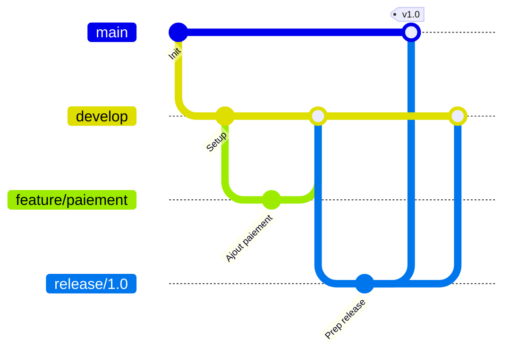
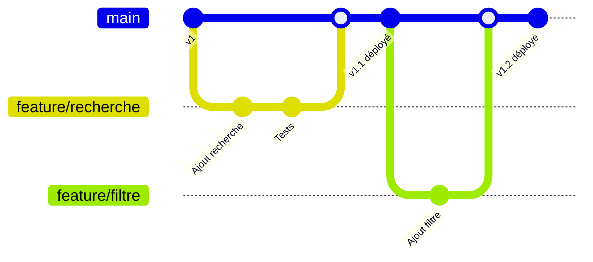
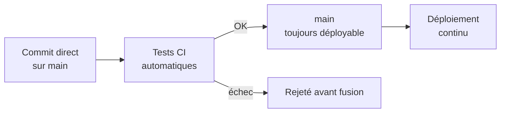

CHAPITRE 9 · 🟡 INTERMÉDIAIRE

# Stratégies de branches

🎯 Objectif du chapitre
Comparer les trois grandes stratégies d'organisation des branches Git utilisées en entreprise — Git Flow, GitHub Flow et trunk-based development — comprendre le problème que chacune résout, et savoir choisir la stratégie adaptée à la taille d'une équipe et à son rythme de déploiement. Ce chapitre clôt la Partie III : les chapitres suivants (CI/CD, Partie VII) supposent une stratégie de branches déjà choisie.

🎬 Mise en situation
Le chapitre 7 a montré comment créer une branche, la fusionner. Le chapitre 8 a montré comment cela s'articule avec une pull request sur GitHub. Ce que ces deux chapitres n'ont pas tranché, c'est une question bien plus organisationnelle : combien de branches long terme une équipe doit-elle maintenir, et selon quel rythme les fusionner ? Cette question a une réponse différente pour une équipe qui déploie une fois par trimestre et pour une équipe qui déploie dix fois par jour (le cas Flickr du chapitre 1) — ce chapitre présente les trois réponses les plus utilisées dans l'industrie.

## 9.1 Git Flow

Formalisé par Vincent Driessen en 2010, **Git Flow** définit un ensemble strict de branches à durée de vie longue et de règles de fusion :

| Branche | Rôle | Durée de vie |
|---|---|---|
| `main` | Toujours en état "production", chaque commit correspond à une version publiée | Permanente |
| `develop` | Intégration continue des fonctionnalités terminées, pas encore publiées | Permanente |
| `feature/*` | Une fonctionnalité en développement, isolée | Temporaire, fusionnée dans `develop` |
| `release/*` | Préparation finale d'une version (corrections mineures, pas de nouvelle fonctionnalité) | Temporaire, fusionnée dans `main` et `develop` |
| `hotfix/*` | Correction urgente directement sur la production | Temporaire, fusionnée dans `main` et `develop` |

✅ Quand Git Flow a du sens
Git Flow convient bien à des logiciels avec des cycles de publication espacés et formalisés (versions numérotées, plusieurs versions supportées en parallèle — un logiciel installé chez le client, par exemple, plutôt qu'un service web continuellement mis à jour). Sa rigueur devient un frein pour une équipe qui veut déployer plusieurs fois par jour (chapitre 2, section 2.4).

## 9.2 GitHub Flow

Bien plus simple, **GitHub Flow** ne connaît qu'une seule branche longue (`main`, toujours déployable) et des branches de fonctionnalité courtes, fusionnées directement dans `main` via pull request dès qu'elles sont prêtes et validées.

**Le principe central** : `main` est **toujours** dans un état déployable. Une branche de fonctionnalité vit quelques heures à quelques jours, jamais des semaines, et se fusionne dès qu'elle passe la revue de code et les tests automatisés — souvent suivie d'un déploiement immédiat en production (chapitre 27).

✅ Quand GitHub Flow a du sens
GitHub Flow convient parfaitement à des applications web déployées en continu, sans versions multiples à maintenir en parallèle — le cas de la grande majorité des projets de ce manuel (SaaS, API web). Sa simplicité en fait la stratégie recommandée par défaut pour la plupart des équipes qui démarrent.

## 9.3 Trunk-based development

**Trunk-based development** pousse la logique de GitHub Flow encore plus loin : les branches de fonctionnalité, quand elles existent, ne vivent que quelques heures maximum (souvent moins d'une journée), et de nombreuses équipes matures commitent même directement sur `main` (le "tronc", *trunk*) plusieurs fois par jour, en s'appuyant sur des **feature flags** (indicateurs de fonctionnalité) plutôt que sur des branches pour cacher un travail inachevé en production.

💡 Feature flags : cacher sans brancher
Un feature flag est une simple condition dans le code (`if (featureFlags.nouveauCheckout) { ... }`) qui active ou désactive une fonctionnalité sans avoir besoin d'une branche séparée ni d'un nouveau déploiement pour la basculer. Le code d'une fonctionnalité inachevée peut ainsi être intégré à `main` très tôt (branches courtes), tout en restant invisible pour les utilisateurs réels tant que le flag reste désactivé.

✅ Quand trunk-based development a du sens
Cette stratégie exige une discipline de tests automatisés très solide (Partie VII) — sans elle, des commits fréquents et rapprochés sur `main` cassent la production en continu plutôt que de la faire avancer sereinement. C'est la stratégie des organisations les plus matures en DevOps (le cas Flickr du chapitre 1 en est un exemple précurseur), rarement le point de départ recommandé pour une équipe qui débute.

## 9.4 Comparatif et critères de choix

| Critère | Git Flow | GitHub Flow | Trunk-based |
|---|---|---|---|
| **Nombre de branches longues** | 2 (`main`, `develop`) | 1 (`main`) | 1 (`main`), quasi aucune branche |
| **Durée de vie d'une branche de fonctionnalité** | Semaines possibles | Heures à quelques jours | Quelques heures maximum |
| **Fréquence de déploiement adaptée** | Faible (versions espacées) | Élevée (déploiement continu) | Très élevée (plusieurs fois/jour) |
| **Maturité de tests automatisés requise** | Modérée | Élevée | Très élevée |
| **Convient à** | Logiciel versionné, plusieurs versions supportées | La majorité des applications web modernes | Équipes DevOps très matures, produits à très fort rythme |
| **Complexité de gestion** | Élevée | Faible | Faible (mais exigeante en discipline de tests) |

🧠 Recommandation par défaut de ce manuel
Pour la quasi-totalité des projets construits dans ce manuel (une application web déployée en continu, sans version installée chez le client), <strong>GitHub Flow</strong> est la stratégie recommandée par défaut : suffisamment simple pour une équipe qui démarre, suffisamment robuste pour grandir vers du trunk-based development plus tard, une fois la discipline de tests automatisés (Partie VII) bien installée.

## Atelier — Choisir une stratégie selon un contexte donné

🛠️ Atelier 9.1 — Diagnostiquer le bon choix

**Objectif** : s'entraîner à choisir une stratégie de branches à partir d'un contexte concret, plutôt que par habitude ou par défaut.

**Étapes détaillées** : pour chacun des trois contextes suivants, propose une stratégie (section 9.4) et justifie en une phrase.

1. Une petite startup développe une seule application web SaaS, déployée en continu, avec deux développeurs.
2. Une entreprise édite un logiciel de comptabilité installé sur les serveurs de ses clients, avec trois versions majeures encore activement supportées en parallèle.
3. Une équipe de vingt développeurs sur un produit web à très fort trafic, avec une suite de tests automatisés très mature et un objectif de plusieurs déploiements par jour.

**Résultat attendu / corrigé** : (1) GitHub Flow — application web simple, petite équipe, pas de versions multiples à maintenir. (2) Git Flow — plusieurs versions installées chez des clients différents nécessitent des branches `release`/`hotfix` distinctes et durables. (3) Trunk-based development — l'échelle, la maturité des tests et l'objectif de fréquence justifient la stratégie la plus exigeante mais la plus rapide.

## Erreurs fréquentes

⚠️ Erreur n°1 — Adopter Git Flow par réflexe, sans en avoir besoin
Git Flow est historiquement la stratégie la plus enseignée, ce qui pousse encore beaucoup d'équipes à l'adopter par défaut, même pour une simple application web déployée en continu — où sa complexité (deux branches longues, quatre types de branches temporaires) n'apporte aucun bénéfice réel et ralentit inutilement le rythme de livraison.

⚠️ Erreur n°2 — Adopter trunk-based development sans la discipline de tests qui va avec
Committer directement sur `main` plusieurs fois par jour sans une suite de tests automatisés fiable et rapide transforme rapidement `main` en zone instable — l'inverse exact de l'objectif recherché (section 9.3).

⚠️ Erreur n°3 — Laisser vivre une branche de fonctionnalité trop longtemps
Quelle que soit la stratégie choisie, une branche de fonctionnalité qui vit des semaines sans être fusionnée accumule un écart croissant avec `main`, rendant la fusion finale plus risquée et plus difficile à revoir — un écho direct du principe des petits changements fréquents (chapitre 2, section 2.4).

## En entreprise

**Réalité répandue** : GitHub Flow (ou une variante très proche, parfois appelée "GitLab Flow" avec quelques branches d'environnement supplémentaires) est de très loin la stratégie la plus répandue parmi les équipes web modernes en 2026 — Git Flow reste présent principalement dans des contextes de logiciel versionné plus traditionnels.

**Bonne pratique répandue** : quelle que soit la stratégie, la branche `main` (ou `develop` pour Git Flow) est presque toujours protégée (chapitre 8, section "Erreurs fréquentes") pour empêcher tout contournement du processus de revue.

**Erreur classique observée** : des équipes qui changent de stratégie de branches sans jamais documenter la nouvelle convention ni former les nouveaux arrivants, menant à un mélange incohérent des deux stratégies dans le même dépôt au fil du temps.

## Entretien technique

💼 Questions fréquemment posées en entretien

**Q1. "Quelle stratégie de branches recommanderais-tu pour un nouveau projet SaaS ?"**
Réponse attendue : GitHub Flow par défaut (section 9.4), sauf contrainte spécifique (versions multiples à maintenir en parallèle, qui orienterait plutôt vers Git Flow).

**Q2. "Qu'est-ce qu'un feature flag et pourquoi est-il central au trunk-based development ?"**
Réponse attendue : une condition dans le code qui active/désactive une fonctionnalité sans nécessiter de branche séparée, permettant d'intégrer du code inachevé dans `main` très tôt tout en le gardant invisible en production (section 9.3).

**Q3. "Pourquoi Git Flow est-il moins adapté à un rythme de déploiement continu ?"**
Réponse attendue : ses branches `develop`/`release`/`hotfix` ajoutent des étapes et des délais de synchronisation incompatibles avec plusieurs déploiements par jour ; GitHub Flow ou trunk-based development, avec une seule branche longue, sont mieux adaptés à ce rythme (section 9.4).

## Optimisation, sécurité et maintenabilité — les réflexes dès ce chapitre

🔒 Sécurité
Quelle que soit la stratégie, ne jamais permettre de fusion vers `main` sans passage par des vérifications automatiques (chapitre 19) incluant, à terme, une analyse de sécurité (chapitre 35) — le choix de stratégie de branches et le pipeline CI/CD (Partie VII) sont deux décisions étroitement liées.

✅ Maintenabilité
Documente la stratégie de branches choisie dans le `README.md` ou un fichier `CONTRIBUTING.md` du projet — une convention non écrite se perd dès qu'une nouvelle personne rejoint l'équipe.

🚀 Performance
Le "lead time" (délai entre un commit et sa mise en production réelle, chapitre 1) est directement influencé par la stratégie de branches choisie — une stratégie plus légère réduit mécaniquement ce délai, à condition que la fiabilité (tests, revue) ne soit jamais sacrifiée pour l'obtenir.

## Résumé du chapitre

- Git Flow (deux branches longues, quatre types de branches temporaires) convient aux logiciels versionnés avec plusieurs versions supportées en parallèle.
- GitHub Flow (une seule branche longue, branches de fonctionnalité courtes) est la recommandation par défaut pour la majorité des applications web modernes.
- Trunk-based development pousse la simplicité au maximum, au prix d'une exigence très forte en tests automatisés, réservée aux équipes les plus matures.
- Les feature flags permettent d'intégrer du code inachevé sans branche longue, en le gardant invisible en production.
- Quelle que soit la stratégie, une branche `main` protégée et des branches de fonctionnalité courtes restent des principes communs à respecter.

## Quiz

📝 QCM (une seule bonne réponse par question)

1. Git Flow est particulièrement adapté à :
   - a) Un déploiement continu plusieurs fois par jour
   - b) Un logiciel versionné avec plusieurs versions supportées en parallèle
   - c) Une équipe d'une seule personne sur un projet personnel
   - d) L'absence totale de tests automatisés

2. Un feature flag sert principalement à :
   - a) Supprimer une branche automatiquement
   - b) Activer ou désactiver une fonctionnalité en production sans nouvelle branche ni redéploiement
   - c) Chiffrer le code source
   - d) Remplacer les tests automatisés

3. La recommandation par défaut de ce manuel pour la majorité des applications web est :
   - a) Git Flow
   - b) GitHub Flow
   - c) L'absence de toute stratégie
   - d) Une branche par développeur, jamais fusionnée

**Corrigé** : 1-b, 2-b, 3-b.

📝 Vrai ou Faux

1. Trunk-based development nécessite une suite de tests automatisés particulièrement fiable et rapide. — **Vrai**.
2. Git Flow est la stratégie la plus simple à gérer au quotidien. — **Faux** (c'est la plus complexe des trois, section 9.4).
3. Une branche de fonctionnalité devrait, dans l'idéal, rester ouverte plusieurs semaines pour être bien aboutie avant fusion. — **Faux** (section "Erreurs fréquentes", erreur n°3).

## Exercices

📝 Exercice 9.1

Une équipe utilise actuellement Git Flow, mais se plaint que ses déploiements sont trop rares et trop stressants. Propose, en 3-4 phrases, une transition progressive vers GitHub Flow.

**Corrigé (exemple de réponse) :** commencer par raccourcir la durée de vie des branches `feature/*` existantes, en les fusionnant plus fréquemment vers `develop`. Ensuite, renforcer la suite de tests automatisés (Partie VII) pour gagner en confiance sur chaque fusion. Une fois cette confiance établie, fusionner `develop` dans `main` et supprimer la distinction entre les deux, adoptant ainsi GitHub Flow avec une seule branche longue. Documenter ce changement dans `CONTRIBUTING.md` pour que toute l'équipe applique la même convention dès le jour du basculement.

## Checklist de fin de chapitre

<ul class="checklist">
<li>☐ Je sais décrire les branches de Git Flow et leur rôle respectif.</li>
<li>☐ Je sais expliquer le principe central de GitHub Flow ("main toujours déployable").</li>
<li>☐ Je comprends ce qu'est un feature flag et son rôle en trunk-based development.</li>
<li>☐ Je sais choisir une stratégie adaptée à un contexte donné (taille d'équipe, rythme de déploiement, versions à maintenir).</li>
<li>☐ Je comprends pourquoi la maturité des tests automatisés conditionne le choix entre les trois stratégies.</li>
</ul>

## FAQ

<dl class="faq">
<dt>Peut-on mélanger des éléments de plusieurs stratégies ?</dt>
<dd>Oui, en pratique beaucoup d'équipes adoptent des variantes hybrides (comme "GitLab Flow", qui ajoute des branches d'environnement à une base proche de GitHub Flow). L'important est que la convention choisie soit claire, documentée et appliquée de façon cohérente par toute l'équipe.</dd>

<dt>Cette stratégie de branches a-t-elle un impact sur le chapitre CI/CD qui suit ?</dt>
<dd>Oui, directement. Un pipeline CI/CD (Partie VII) se déclenche généralement différemment selon la branche (tests sur toute pull request, déploiement automatique uniquement depuis `main`) — le choix de ce chapitre conditionne la configuration des chapitres suivants.</dd>

<dt>Que faire si je travaille seul sur un projet personnel ?</dt>
<dd>Une version très simplifiée de GitHub Flow (commits directs sur `main`, ou de très courtes branches pour les changements plus risqués) suffit largement. La rigueur complète de ce chapitre prend tout son sens à partir de deux contributeurs ou plus.</dd>
</dl>

## Références et pour aller plus loin

- Vincent Driessen — article original sur Git Flow (2010) : [https://nvie.com/posts/a-successful-git-branching-model/](https://nvie.com/posts/a-successful-git-branching-model/)
- GitHub — documentation officielle de GitHub Flow : [https://docs.github.com/fr/get-started/using-github/github-flow](https://docs.github.com/fr/get-started/using-github/github-flow)
- Trunk Based Development — site de référence dédié : [https://trunkbaseddevelopment.com](https://trunkbaseddevelopment.com)

*Chapitre suivant : automatisation avec des scripts Bash et PowerShell — la Partie IV s'ouvre avec la construction de quatre scripts réels (backup, deploy, healthcheck, cleanup) qui serviront de base à toute l'automatisation des chapitres suivants.*
